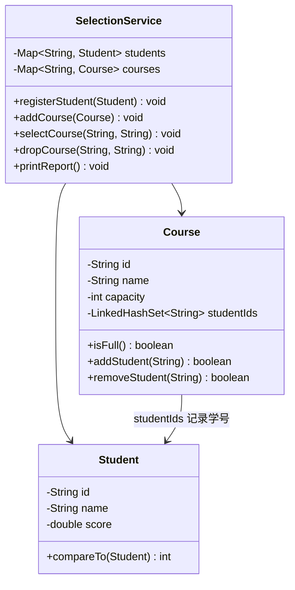

## 0. 本节阅读指引（先读这一节）

本篇是集合知识的综合实战：把 018 集合框架、020 比较器、021 Objects 串成一个可运行的小项目。

阅读方式：先通读需求与设计，再对照完整代码逐段理解，最后自己动手改规则（例如把容量改成 3、增加"退课"按钮逻辑）。

前置：020 集合框架详解、020 JavaComparator/Comparable；学完 023 文件读写后可回来为项目增加存档功能。

> 记住：项目的价值在于跑通并修改它，而不是只看代码。

---

## 1. 项目背景与需求

学校需要一个控制台版学生选课系统，要求：

1. 可以注册学生（学号、姓名、成绩），学号唯一；
2. 可以开设课程（课程号、课程名、容量），课程号唯一；
3. 学生可以选课，规则：课程必须存在、学生必须存在、课程未满、不能重复选同一门课；
4. 学生可以退课；
5. 可以按姓名排序输出学生名单，也可以按成绩从高到低输出排行榜；
6. 可以查看每门课程的选课人数与选课名单。

本项目的教学重点不是业务复杂度，而是集合选型：去重用 `Set`、按学号/课程号索引用 `Map`、有序输出用 `List` 加 `Comparator`。

## 2. 总体设计



`SelectionService` 是核心：`students` 与 `courses` 用 `Map` 以 ID 为键实现 O(1) 查找；`Course` 内部用 `LinkedHashSet` 保存选课学号，既去重又保持选课顺序。

## 3. 实体类

### 3.1 学生类（实现 Comparable）

```java
import java.util.Objects;

/**
 * 学生实体：实现 Comparable，自然顺序为学号升序。
 */
public class Student implements Comparable<Student> {
    private final String id;
    private final String name;
    private final double score;

    public Student(String id, String name, double score) {
        this.id = Objects.requireNonNull(id, "学号不能为 null");
        this.name = Objects.requireNonNull(name, "姓名不能为 null");
        this.score = score;
    }

    public String getId() {
        return id;
    }

    public String getName() {
        return name;
    }

    public double getScore() {
        return score;
    }

    @Override
    public int compareTo(Student other) {
        // 学号字符串比较，保证同一学号只有一个学生
        return this.id.compareTo(other.id);
    }

    @Override
    public String toString() {
        return String.format("%s %s %.1f分", id, name, score);
    }
}
```

### 3.2 课程类（内部用 LinkedHashSet 去重）

```java
import java.util.LinkedHashSet;
import java.util.Set;

/**
 * 课程实体：内部维护选课学生学号集合。
 */
public class Course {
    private final String id;
    private final String name;
    private final int capacity;
    // LinkedHashSet：去重且保持选课先后顺序
    private final Set<String> studentIds = new LinkedHashSet<>();

    public Course(String id, String name, int capacity) {
        if (id == null || name == null || capacity <= 0) {
            throw new IllegalArgumentException("课程参数不合法");
        }
        this.id = id;
        this.name = name;
        this.capacity = capacity;
    }

    public String getId() {
        return id;
    }

    public String getName() {
        return name;
    }

    public int getCapacity() {
        return capacity;
    }

    public boolean isFull() {
        return studentIds.size() >= capacity;
    }

    public boolean contains(String studentId) {
        return studentIds.contains(studentId);
    }

    /**
     * 添加学生：已满或重复时返回 false。
     */
    public boolean addStudent(String studentId) {
        if (isFull() || studentIds.contains(studentId)) {
            return false;
        }
        return studentIds.add(studentId);
    }

    public boolean removeStudent(String studentId) {
        return studentIds.remove(studentId);
    }

    public Set<String> getStudentIds() {
        // 返回只读视图，防止外部直接修改
        return java.util.Collections.unmodifiableSet(studentIds);
    }
}
```

## 4. 选课服务与业务规则

```java
import java.util.ArrayList;
import java.util.Comparator;
import java.util.LinkedHashMap;
import java.util.List;
import java.util.Map;
import java.util.Objects;

/**
 * 选课服务：集中管理学生、课程与选课规则。
 */
public class SelectionService {
    // 按学号索引学生，按课程号索引课程：Map 的典型用法
    private final Map<String, Student> students = new LinkedHashMap<>();
    private final Map<String, Course> courses = new LinkedHashMap<>();

    public void registerStudent(Student student) {
        Objects.requireNonNull(student, "学生不能为 null");
        Student old = students.putIfAbsent(student.getId(), student);
        if (old != null) {
            throw new IllegalArgumentException("学号已存在：" + student.getId());
        }
    }

    public void addCourse(Course course) {
        Objects.requireNonNull(course, "课程不能为 null");
        Course old = courses.putIfAbsent(course.getId(), course);
        if (old != null) {
            throw new IllegalArgumentException("课程号已存在：" + course.getId());
        }
    }

    /**
     * 选课：依次校验学生、课程、容量与重复，全部通过才加入。
     */
    public void selectCourse(String studentId, String courseId) {
        Student student = students.get(studentId);
        Course course = courses.get(courseId);
        if (student == null) {
            throw new IllegalArgumentException("学生不存在：" + studentId);
        }
        if (course == null) {
            throw new IllegalArgumentException("课程不存在：" + courseId);
        }
        if (course.isFull()) {
            throw new IllegalStateException("课程已满：" + course.getName());
        }
        if (course.contains(studentId)) {
            throw new IllegalStateException("重复选课：" + student.getName());
        }
        course.addStudent(studentId);
    }

    public void dropCourse(String studentId, String courseId) {
        Course course = courses.get(courseId);
        if (course == null || !course.removeStudent(studentId)) {
            throw new IllegalArgumentException("退课失败：课程不存在或未选该课");
        }
    }

    /**
     * 输出学生名单（姓名升序）与成绩排行榜（成绩降序）。
     */
    public void printStudents() {
        List<Student> byName = new ArrayList<>(students.values());
        byName.sort(Comparator.comparing(Student::getName));
        System.out.println("=== 学生名单（按姓名）===");
        byName.forEach(System.out::println);

        List<Student> byScore = new ArrayList<>(students.values());
        byScore.sort(Comparator.comparing(Student::getScore).reversed());
        System.out.println("=== 成绩排行榜（从高到低）===");
        byScore.forEach(System.out::println);
    }

    /**
     * 输出每门课程的选课人数与名单。
     */
    public void printCourses() {
        System.out.println("=== 课程选课情况 ===");
        for (Course course : courses.values()) {
            System.out.printf("%s %s：%d/%d 人%n",
                    course.getId(), course.getName(),
                    course.getStudentIds().size(), course.getCapacity());
            course.getStudentIds().forEach(sid -> System.out.println("    - " + sid));
        }
    }
}
```

## 5. 完整可运行示例

把上述三个类放进同一目录，再编写入口类运行：

```java
/**
 * 学生选课系统入口：演示完整业务流程。
 */
public class Main {
    public static void main(String[] args) {
        SelectionService service = new SelectionService();

        // 1. 注册学生
        service.registerStudent(new Student("S001", "张三", 92));
        service.registerStudent(new Student("S002", "李四", 78));
        service.registerStudent(new Student("S003", "王五", 85));

        // 2. 开设课程
        service.addCourse(new Course("C001", "Java 程序设计", 2));
        service.addCourse(new Course("C002", "数据结构", 3));

        // 3. 选课：容量为 2 的课程选第 3 人应失败
        service.selectCourse("S001", "C001");
        service.selectCourse("S002", "C001");
        try {
            service.selectCourse("S003", "C001");
        } catch (IllegalStateException e) {
            System.out.println("预期失败：" + e.getMessage());
        }
        service.selectCourse("S003", "C002");

        // 4. 退课后再选
        service.dropCourse("S002", "C001");
        service.selectCourse("S003", "C001");

        // 5. 输出报表
        service.printStudents();
        service.printCourses();
    }
}
```

运行命令：

```text
javac *.java
java Main
```

预期输出要点：张三、李四、王五按姓名排序出现；排行榜为张三（92）、王五（85）、李四（78）；C001 最终 2/2 人（张三、王五），C002 1/3 人（王五）。

## 6. 验收清单

- [ ] 能说出本项目为什么用 `Map` 存学生/课程、用 `Set` 存选课名单；
- [ ] 能解释 `LinkedHashSet` 与 `HashSet` 在输出顺序上的差异；
- [ ] 能解释 `Comparator.comparing(...).reversed()` 的排序方向；
- [ ] 能说出 `Objects.requireNonNull` 在这里扮演的防御性编程角色；
- [ ] 能独立新增一条业务规则（例如"每人最多选 3 门课"）。

## 7. 扩展练习

1. 学完 023 文件读写后，为系统增加"存档/读档"功能：把学生与选课结果写入文本文件；
2. 学完 024 Lambda 与 025 Stream 后，用 `stream().filter()` 重写"查询选了某门课的所有学生"；
3. 把选课人数统计改成按人数降序输出，练习自定义 `Comparator`；
4. 结合 016 异常处理机制，把业务规则异常统一封装为自定义异常。
