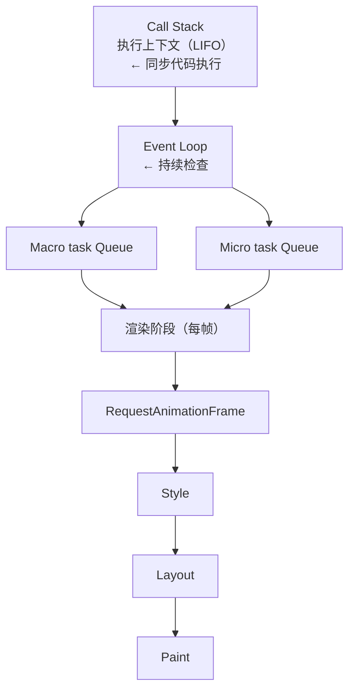

# 事件循环详解（Event Loop In Depth）

## 前置知识

- [事件循环](/javascript/029-EventLoop)：建议先完成前一篇的学习

## 学习目标

- 掌握「1. 历史动机与发展脉络（Historical Motivation & Evolution）」的核心机制、典型用法与常见陷阱
- 掌握「2. 形式化定义（Formal Definitions）」的核心机制、典型用法与常见陷阱
- 掌握「3. 理论推导与原理解析（Theoretical Derivation）」的核心机制、典型用法与常见陷阱
- 掌握「4. 代码示例（Production-Ready Examples）」的核心机制、典型用法与常见陷阱
- 掌握「5. 对比分析（Comparative Analysis）」的核心机制、典型用法与常见陷阱


> 本篇对标 MIT 6.005（Software Construction）、Stanford CS110L（Safety in Systems Programming）与 CMU 15-410（Operating Systems Design）教学水准，系统讲授 JavaScript 事件循环（Event Loop）的形式语义、调度模型、浏览器与 Node.js 差异及工程实践。所有数学公式使用 KaTeX 渲染，参考文献采用 ACM Reference Format。

---

## 1. 历史动机与发展脉络（Historical Motivation & Evolution）

### 1.1 单线程 JavaScript 的起源（1995）

Brendan Eich 在 1995 年用 10 天设计 JavaScript 时，受 Netscape 浏览器约束，做出三个关键决策：

1. **单线程**：浏览器 DOM 操作不能并发，否则会出现"两个脚本同时修改同一节点"的竞态。单线程简化了开发者模型。
2. **异步 I/O**：网络请求、定时器、用户事件必须非阻塞，否则页面会卡死。
3. **事件驱动**：借鉴 Scheme 的 continuation-passing style 与 HyperTalk 的事件模型，所有异步操作通过回调（callback）完成。

这三者共同催生了**事件循环**（Event Loop）作为 JavaScript 的核心运行模型。

### 1.2 事件循环的规范化（2008–2018）

JavaScript 长期缺乏事件循环的规范定义。浏览器各自实现，导致 `setTimeout` 与 `Promise.then` 的执行顺序在不同浏览器中不一致。

**关键里程碑**：

- **HTML5（2014）**：WHATWG HTML 规范首次系统定义"Event loop processing model"（§8.1.7），明确任务源（task source）与微任务队列（microtask queue）。
- **ES2015（2015）**：Promise 引入"Job Queue"概念，规范微任务语义。ECMA-262 §8.4 定义 `EnqueueJob` 抽象操作。
- **ES2020（2020）**：`async/await` 标准化，明确 `await` 后的续体作为微任务执行。
- **Node.js v11（2018）**：Node.js 修正微任务执行时机，与浏览器对齐——`setTimeout` 回调与 `Promise.then` 之间会清空微任务队列。

### 1.3 Node.js 事件循环的演进

Node.js 采用 libuv（最初由 Joyent 的 Ben Noordhuis 与 Bert Belder 开发）作为事件循环实现。libuv 的核心是跨平台 I/O 多路复用（epoll / kqueue / IOCP）。

**版本演进**：

- **Node.js 0.1（2011）**：基于 libev 的简单事件循环。
- **Node.js 0.10（2013）**：`setImmediate` 引入，提供 I/O 后的立即执行。
- **Node.js 11（2018）**：微任务执行时机从"每阶段结束"改为"每个宏任务结束"，与浏览器一致。
- **Node.js 16（2021）**：引入 `timersPromises` 模块，提供基于 Promise 的 `setTimeout`。
- **Node.js 20（2023）**：稳定 `perf_hooks` 与 `PerformanceObserver`，支持事件循环延迟监控。

### 1.4 Worker 线程与并行（2012–2024）

单线程事件循环无法利用多核 CPU。Web Workers（2012）引入并行：

- **Dedicated Worker**：与主线程一对一通信。
- **Shared Worker**：多个标签页共享。
- **Service Worker**：离线缓存与推送通知。
- **Worklets**：音频处理、绘图，运行在渲染流水线中。

Node.js 10.5+（2018）引入 `worker_threads` 模块，支持真正的多线程。每个 Worker 有独立的事件循环与 V8 实例，通过 `MessageChannel` 通信。

### 1.5 Scheduler API 与优先级调度（2024）

传统事件循环只有两种优先级：宏任务与微任务。实际工程需要更细粒度：

- **user-blocking**：阻塞用户的任务（如动画、输入响应）。
- **user-visible**：用户可见但可延迟（如数据加载）。
- **background**：后台任务（如分析上报）。

Chrome 94+ 引入 `scheduler.postTask()`，Chrome 129+ 引入 `scheduler.yield()`，提供基于优先级的任务调度。这是事件循环模型自 1995 年以来最大的演进。

---

## 2. 形式化定义（Formal Definitions）

### 2.1 事件循环的形式模型

**定义 3.1.1（事件循环）**：事件循环是一个三元组 $\mathcal{E} = (T, M, S)$，其中：

- $T$ 是任务队列（task queue）的集合，按任务源（task source）分类。
- $M$ 是微任务队列（microtask queue），FIFO。
- $S$ 是状态机（state machine），描述渲染、I/O 等阶段。

**事件循环迭代（Event Loop Iteration）**：

$$
\begin{aligned}
&\text{1. Select } t \in T \text{ (oldest task from any source)} \\
&\text{2. Execute } t \\
&\text{3. While } M \neq \emptyset: \text{ dequeue and execute microtask} \\
&\text{4. Perform rendering steps (Style → Layout → Paint)} \\
&\text{5. Repeat}
\end{aligned}
$$

### 2.2 任务源（Task Source）

HTML 规范定义多个任务源，每个源有独立队列：

- **DOM manipulation**：`Response.body` 操作。
- **User interaction**：`click`、`input`、`keydown` 等用户事件。
- **Networking**：`fetch` 完成回调。
- **History traversal**：`history.back()` 等。
- **File**：`FileReader` 完成。

事件循环每次迭代从**任一非空队列**取一个任务，不保证跨源的 FIFO。

### 2.3 微任务（Microtask）

**定义 3.3.1（微任务）**：微任务是优先于下次渲染前执行的任务。来源：

- `Promise.then / catch / finally` 的回调
- `queueMicrotask(callback)` 注册
- `MutationObserver` 回调
- `IntersectionObserver` 回调（部分实现）
- `await` 后的续体（desugar 为 `Promise.then`）

**关键性质**：微任务队列在每个宏任务结束后**完全清空**，包括执行期间新增的微任务。

### 2.4 宏任务 vs 微任务的形式化

设宏任务 $t$ 执行过程中入队微任务集合 $M_t$，则事件循环满足：

$$\forall t, \quad \text{after}(t) \implies \text{empty}(M)$$

即每个宏任务后微任务队列必为空。这保证微任务"高优先级"语义。

### 2.5 Node.js 事件循环阶段

Node.js 事件循环（libuv）有六个阶段：

$$
\text{timers} \to \text{pending} \to \text{idle, prepare} \to \text{poll} \to \text{check} \to \text{close}
$$

每阶段处理特定任务源：

1. **timers**：`setTimeout` / `setInterval` 到期回调。
2. **pending callbacks**：系统级回调（TCP 错误、DNS 错误）。
3. **idle, prepare**：libuv 内部使用。
4. **poll**：I/O 回调（fs、net）。若 poll 队列空，可能阻塞等待 I/O。
5. **check**：`setImmediate` 回调。
6. **close callbacks**：`socket.on('close')`。

**关键差异**：Node.js v11 前，微任务在**阶段切换**时执行；v11+ 改为每个宏任务后执行，与浏览器对齐。

---

## 3. 理论推导与原理解析（Theoretical Derivation）

### 3.1 微任务优先级的正确性

**定理 4.1.1**：微任务必在下一个宏任务前执行。

证明：由事件循环迭代算法（定义 3.1.1），步骤 3 在步骤 1 之前完成微任务清空，故下一宏任务执行前微任务队列必空。$\square$

**推论 4.1.1**：递归 `Promise.resolve().then` 会导致宏任务饥饿。

证明：每次 `then` 回调执行时会再入队一个微任务，故 $M$ 永不为空，事件循环无法进入步骤 1，宏任务永不被执行。$\square$

### 3.2 `async/await` 的 desugar

V8 将 `async/await` desugar 为 `Promise` + generator。考虑：

```javascript
async function f() {
  const x = await g();
  return x * 2;
}
```

等价于：

```javascript
function f() {
  return new Promise((resolve, reject) => {
    g().then(
      (x) => resolve(x * 2),
      (e) => reject(e)
    );
  });
}
```

**关键点**：`await` 后的代码作为微任务执行，而非同步代码。这是 `async/await` 的核心语义。

### 3.3 微任务与渲染的时序

浏览器渲染流水线：

$$
\text{Task} \to \text{Microtasks} \to \text{RequestAnimationFrame} \to \text{Style} \to \text{Layout} \to \text{Paint}
$$

`requestAnimationFrame`（rAF）回调在微任务之后、Style 之前执行。这意味着：

- 微任务中的 DOM 修改会在本帧渲染。
- rAF 回调中的 DOM 修改也在本帧渲染（在 Style 前）。
- `setTimeout(0)` 回调在下一帧的 Task 阶段执行，DOM 修改在下一帧渲染。

### 3.4 长任务与 INP

**INP（Interaction to Next Paint）**：用户交互到下一帧渲染的时间。Chrome 2024 将 INP 列为核心 Web Vitals。

长任务（> 50 ms）会阻塞主线程，导致 INP 退化。切分长任务的关键模式：

```javascript
// ES2017 — 长任务切分
async function processLargeArray(items) {
  for (let i = 0; i < items.length; i++) {
    processItem(items[i]);

    // 每 16ms 让出一次主线程（约一帧）
    if (i % 100 === 0) {
      await yieldToMain();
    }
  }
}

async function yieldToMain() {
  // 优先使用 scheduler.yield（Chrome 129+）
  if (scheduler?.yield) {
    return scheduler.yield();
  }
  // 回退到 setTimeout
  return new Promise((resolve) => setTimeout(resolve, 0));
}
```

### 3.5 Node.js 的 process.nextTick

Node.js 独有的 `process.nextTick` 优先级**高于**微任务。形式化：

$$
\text{Task} \to \text{NextTick Queue} \to \text{Microtask Queue} \to \text{Next Phase}
$$

每次宏任务后，先清空 `nextTick` 队列，再清空微任务队列。`nextTick` 滥用会导致 I/O 饥饿——libuv 会强制在每阶段切换时让出，但 `nextTick` 仍可能延迟 I/O。

### 3.6 setImmediate 的语义

Node.js 的 `setImmediate` 在 poll 阶段后、check 阶段执行。形式化：

$$
\text{poll} \to \text{check (setImmediate)} \to \text{close} \to \text{timers}
$$

在 I/O 回调中，`setImmediate` 必在 `setTimeout(0)` 前执行：

```javascript
fs.readFile(__filename, () => {
  setTimeout(() => console.log('timeout'), 0);
  setImmediate(() => console.log('immediate'));
});
// 输出：immediate, timeout
```

但在非 I/O 上下文中，顺序不确定：

```javascript
setTimeout(() => console.log('timeout'), 0);
setImmediate(() => console.log('immediate'));
// 顺序不确定，取决于进程启动耗时
```

---

## 4. 代码示例（Production-Ready Examples）

### 4.1 工程项目配置

```json
{
  "name": "event-loop-demo",
  "version": "1.0.0",
  "type": "module",
  "engines": { "node": ">=18.0.0" },
  "scripts": {
    "start": "node src/index.js",
    "test": "node --test"
  }
}
```

### 4.2 经典输出顺序题

```javascript
// ES2015 — 经典事件循环题
console.log('1: sync');

setTimeout(() => {
  console.log('2: setTimeout');
}, 0);

Promise.resolve().then(() => {
  console.log('3: Promise.then');
});

queueMicrotask(() => {
  console.log('4: queueMicrotask');
});

console.log('5: sync');

// 输出顺序：1, 5, 3, 4, 2
// 解析：
//   1. 同步代码：1, 5
//   2. 微任务：3, 4（Promise.then 与 queueMicrotask FIFO）
//   3. 宏任务：2（setTimeout）
```

### 4.3 微任务饥饿

```javascript
// ES2015 — 微任务饥饿
function recursiveMicrotask() {
  Promise.resolve().then(recursiveMicrotask);
}
recursiveMicrotask();

setTimeout(() => {
  console.log('这行永远不会执行');
}, 0);

// setTimeout 永远无法执行！
// 修复：使用 setTimeout 让出执行权
function recursiveTask() {
  setTimeout(recursiveTask, 0);
}
recursiveTask();
// 其他任务有机会执行
```

### 4.4 大数组分批处理

```javascript
// ES2017 — 长任务切分
async function processLargeArray(items) {
  const CHUNK_SIZE = 100;
  for (let i = 0; i < items.length; i += CHUNK_SIZE) {
    const chunk = items.slice(i, i + CHUNK_SIZE);
    processChunk(chunk);

    if (i + CHUNK_SIZE < items.length) {
      await new Promise((resolve) => setTimeout(resolve, 0));
    }
  }
}

function processChunk(chunk) {
  for (const item of chunk) {
    // 处理每个 item
  }
}
```

### 4.5 优先级调度

```javascript
// ES2015 — 优先级调度
function urgentUpdate(data) {
  queueMicrotask(() => render(data)); // 高优先级
}

function backgroundSync() {
  setTimeout(() => syncToServer(), 0); // 低优先级
}

// 现代方案：scheduler.postTask（Chrome 94+）
async function modernSchedule() {
  // user-blocking：最高优先级
  await scheduler.postTask(() => updateUI(), {
    priority: 'user-blocking',
  });

  // user-visible：中等优先级
  await scheduler.postTask(() => fetchData(), {
    priority: 'user-visible',
  });

  // background：最低优先级
  await scheduler.postTask(() => sendAnalytics(), {
    priority: 'background',
  });
}
```

### 4.6 requestAnimationFrame 与 setTimeout

```javascript
// ES5 — requestAnimationFrame 与屏幕刷新同步
function animate() {
  moveElement();
  requestAnimationFrame(animate); // 在下一帧渲染前执行
}
requestAnimationFrame(animate);

// setTimeout 可能丢帧
function animateBad() {
  moveElement();
  setTimeout(animateBad, 16); // 不保证与屏幕刷新同步
}
```

### 4.7 requestIdleCallback

```javascript
// ES5 — 后台任务
function backgroundWork() {
  requestIdleCallback((deadline) => {
    while (deadline.timeRemaining() > 0 && tasks.length > 0) {
      const task = tasks.shift();
      task();
    }
    if (tasks.length > 0) {
      backgroundWork(); // 继续处理
    }
  });
}

// 超时选项
requestIdleCallback((deadline) => {
  // 即使没空闲也会在 2000ms 后强制执行
}, { timeout: 2000 });
```

### 4.8 async/await 与 Promise 对比

```javascript
// ES2017 — async/await
async function fetchDataAsync() {
  try {
    const res = await fetch('/api/data');
    const data = await res.json();
    return data;
  } catch (err) {
    console.error('Failed:', err);
    throw err;
  }
}

// ES2015 — Promise 链
function fetchDataPromise() {
  return fetch('/api/data')
    .then((res) => res.json())
    .catch((err) => {
      console.error('Failed:', err);
      throw err;
    });
}

// 两者语义等价，但 async/await 调试栈更清晰
```

### 4.9 yieldToMain 工具

```javascript
// ES2017 — yieldToMain（Chrome 129+ 优先）
async function yieldToMain() {
  if (typeof scheduler !== 'undefined' && scheduler.yield) {
    return scheduler.yield();
  }
  // 回退 1：MessageChannel（比 setTimeout 快）
  return new Promise((resolve) => {
    const channel = new MessageChannel();
    channel.port1.onmessage = resolve;
    channel.port2.postMessage(null);
  });
}

// 使用
async function process(items) {
  for (let i = 0; i < items.length; i++) {
    processItem(items[i]);
    if (i % 50 === 0) {
      await yieldToMain();
    }
  }
}
```

### 4.10 Node.js 阶段验证

```javascript
// ES2015 — Node.js 事件循环阶段验证
const fs = require('fs');

setImmediate(() => console.log('1: setImmediate'));
setTimeout(() => console.log('2: setTimeout'), 0);
Promise.resolve().then(() => console.log('3: Promise'));
process.nextTick(() => console.log('4: nextTick'));

fs.readFile(__filename, () => {
  console.log('5: fs.readFile');
  setTimeout(() => console.log('6: inner setTimeout'), 0);
  setImmediate(() => console.log('7: inner setImmediate'));
});

// 输出（Node.js 16+）：
//   4: nextTick
//   3: Promise
//   2: setTimeout（或 1，取决于启动耗时）
//   1: setImmediate
//   5: fs.readFile
//   7: inner setImmediate
//   6: inner setTimeout
```

### 4.11 串行任务调度器

```javascript
// ES2017 — 串行异步任务调度器
class AsyncTaskQueue {
  constructor() {
    this.queue = [];
    this.running = false;
  }

  enqueue(task) {
    return new Promise((resolve, reject) => {
      this.queue.push({ task, resolve, reject });
      this.run();
    });
  }

  async run() {
    if (this.running) return;
    this.running = true;

    while (this.queue.length > 0) {
      const { task, resolve, reject } = this.queue.shift();
      try {
        const result = await task();
        resolve(result);
      } catch (err) {
        reject(err);
      }
      // 让出主线程
      await new Promise((r) => setTimeout(r, 0));
    }

    this.running = false;
  }
}

// 使用
const queue = new AsyncTaskQueue();
queue.enqueue(async () => {
  const res = await fetch('/api/1');
  return res.json();
});
queue.enqueue(async () => {
  const res = await fetch('/api/2');
  return res.json();
});
```

### 4.12 并发控制

```javascript
// ES2017 — 并发限制
async function mapWithConcurrency(items, mapper, limit = 4) {
  const results = new Array(items.length);
  let index = 0;

  async function worker() {
    while (index < items.length) {
      const current = index++;
      try {
        results[current] = await mapper(items[current], current);
      } catch (err) {
        results[current] = { error: err };
      }
    }
  }

  const workers = Array.from({ length: limit }, () => worker());
  await Promise.all(workers);
  return results;
}

// 使用：并发 4 个请求
const urls = ['url1', 'url2', 'url3', 'url4', 'url5', 'url6'];
const results = await mapWithConcurrency(
  urls,
  (url) => fetch(url).then((r) => r.json()),
  4
);
```

---

## 5. 对比分析（Comparative Analysis）

### 5.1 浏览器 vs Node.js 事件循环

| 维度 | 浏览器 | Node.js |
| --- | --- | --- |
| 实现 | HTML 规范 §8.1.7 | libuv |
| 阶段数 | 6（Task / Microtask / rAF / Style / Layout / Paint） | 6（timers / pending / idle / poll / check / close） |
| `setImmediate` | 不支持（部分浏览器有非标准支持） | 支持（check 阶段） |
| `process.nextTick` | 不支持 | 支持（优先级高于微任务） |
| 微任务时机 | 每个宏任务后 | 每个宏任务后（v11+，与浏览器对齐） |
| 渲染 | 有 | 无 |
| I/O 模型 | 浏览器底层（如 Chrome 的 mojo） | libuv（epoll / kqueue / IOCP） |

### 5.2 JavaScript vs Python asyncio

| 维度 | JavaScript | Python |
| --- | --- | --- |
| 并发模型 | 单线程事件循环 | asyncio 单线程事件循环 |
| 关键字 | `async/await` | `async/await` |
| 调度器 | 浏览器/Node.js 内置 | `asyncio.get_event_loop()` |
| 阻塞检测 | 无（开发者负责） | `asyncio.run()` 检测阻塞 |
| 多线程 | Web Workers / worker_threads | `threading` 模块 |
| 多进程 | 无原生（Cluster） | `multiprocessing` 模块 |

### 5.3 JavaScript vs Go goroutine

| 维度 | JavaScript | Go |
| --- | --- | --- |
| 并发单元 | Promise / async function | goroutine |
| 调度 | 协作式（事件循环） | 抢占式（runtime 调度） |
| 多核 | 需 Web Workers | 原生支持（GOMAXPROCS） |
| 通信 | MessageChannel / postMessage | channel |
| 阻塞 | 阻塞整个事件循环 | 阻塞单个 goroutine |
| 内存 | Worker 独立堆 | goroutine 栈（2 KB 起步） |

Go 的 goroutine 模型天然支持多核与抢占式调度，但学习曲线高于 JavaScript 的事件循环。

### 5.4 JavaScript vs Rust async

| 维度 | JavaScript | Rust |
| --- | --- | --- |
| async 返回类型 | `Promise<T>` | `impl Future<Output = T>` |
| 运行时 | 内置（浏览器/Node.js） | 外部（tokio / async-std） |
| 零成本抽象 | 否（Promise 堆分配） | 是（Future 状态机） |
| 阻塞检测 | 无 | 编译期警告（如 `tokio::task::block_in_place`） |
| 取消 | AbortController / 状态标志 | `Drop` 自动取消 |

Rust 的 async 模型在编译期生成状态机，无堆分配，性能最优但复杂度高。

---

## 6. 常见陷阱与最佳实践（Pitfalls & Best Practices）

### 6.1 陷阱 1：微任务饥饿

**问题**：

```javascript
function recursive() {
  Promise.resolve().then(recursive);
}
recursive();
setTimeout(() => console.log('never'), 0);
// setTimeout 永远不执行
```

**修复**：用 `setTimeout` 让出执行权：

```javascript
function recursiveSafe() {
  // 工作...
  setTimeout(recursiveSafe, 0); // 让出，允许其他任务
}
```

### 6.2 陷阱 2：闭包捕获过时值

**问题**：

```javascript
for (var i = 0; i < 3; i++) {
  setTimeout(() => console.log(i), 0);
}
// 输出：3, 3, 3（var 是函数作用域，闭包捕获同一 i）
```

**修复**：用 `let`（块作用域）或 IIFE：

```javascript
for (let i = 0; i < 3; i++) {
  setTimeout(() => console.log(i), 0);
}
// 输出：0, 1, 2

// 或 IIFE
for (var i = 0; i < 3; i++) {
  ((j) => setTimeout(() => console.log(j), 0))(i);
}
```

### 6.3 陷阱 3：async 函数未 await

**问题**：

```javascript
async function leaky() {
  fetchData(); // 忘记 await，错误丢失
}
leaky();
// fetchData 的 reject 变成 unhandledrejection
```

**修复**：始终 `await` 或显式 `.catch`：

```javascript
async function safe() {
  await fetchData().catch((err) => console.error(err));
}
```

### 6.4 陷阱 4：Promise 链中断

**问题**：

```javascript
function bad() {
  fetch('/api/data')
    .then((res) => res.json())
    .then((data) => {
      if (data.error) {
        throw new Error(data.error); // 抛错但无人捕获
      }
      return data;
    });
  // 没有 .catch，错误丢失
}
```

**修复**：始终添加 `.catch` 或用 `async/await` + `try/catch`：

```javascript
async function good() {
  try {
    const res = await fetch('/api/data');
    const data = await res.json();
    if (data.error) throw new Error(data.error);
    return data;
  } catch (err) {
    console.error('Failed:', err);
    throw err;
  }
}
```

### 6.5 陷阱 5：在 Promise 构造函数中 throw

**问题**：

```javascript
const p = new Promise((resolve, reject) => {
  // 同步 throw 会被 Promise 捕获，但易混淆
  throw new Error('oops');
});
p.catch((err) => console.log(err)); // 'oops'
```

**修复**：明确使用 `reject`：

```javascript
const p = new Promise((resolve, reject) => {
  reject(new Error('oops'));
});
```

### 6.6 陷阱 6：forgetting await in forEach

**问题**：

```javascript
async function bad() {
  [1, 2, 3].forEach(async (x) => {
    await fetch(`/api/${x}`); // forEach 不等待
  });
  console.log('done'); // 在所有 fetch 完成前打印
}
```

**修复**：用 `for..of` 或 `Promise.all`：

```javascript
async function good() {
  for (const x of [1, 2, 3]) {
    await fetch(`/api/${x}`);
  }
  console.log('done');
}

// 或并行
async function parallel() {
  await Promise.all([1, 2, 3].map((x) => fetch(`/api/${x}`)));
  console.log('done');
}
```

### 6.7 陷阱 7：错误使用 Promise.all

**问题**：

```javascript
// 任一失败，其他结果丢失
const results = await Promise.all([
  fetch('/api/a'),
  fetch('/api/b'), // 失败
  fetch('/api/c'),
]);
// a 与 c 的结果丢失
```

**修复**：用 `Promise.allSettled`：

```javascript
const results = await Promise.allSettled([
  fetch('/api/a'),
  fetch('/api/b'),
  fetch('/api/c'),
]);
const fulfilled = results.filter((r) => r.status === 'fulfilled');
const rejected = results.filter((r) => r.status === 'rejected');
```

### 6.8 陷阱 8：长任务阻塞 INP

**问题**：

```javascript
function process(items) {
  items.forEach(processItem); // 同步处理 10000 项
}
// 阻塞主线程数百毫秒，INP 退化
```

**修复**：分批处理 + `yieldToMain`：

```javascript
async function process(items) {
  for (let i = 0; i < items.length; i++) {
    processItem(items[i]);
    if (i % 100 === 0) {
      await yieldToMain();
    }
  }
}
```

---

## 7. 工程实践（Engineering Practice）

### 7.1 任务优先级策略

根据任务紧急性选择调度方式：

| 任务类型 | 推荐方式 | 示例 |
| --- | --- | --- |
| 用户阻塞 | `scheduler.postTask({ priority: 'user-blocking' })` | 输入响应、动画 |
| 用户可见 | `queueMicrotask` 或 `scheduler.postTask({ priority: 'user-visible' })` | UI 更新 |
| 后台 | `setTimeout(0)` 或 `requestIdleCallback` | 分析上报 |
| 帧同步 | `requestAnimationFrame` | 动画 |
| 跨帧 | `await yieldToMain()` | 长任务切分 |

### 7.2 INP 优化

INP（Interaction to Next Paint）是 2024 年核心 Web Vitals。优化策略：

1. **减少长任务**：将 > 50 ms 的任务切分。
2. **及时让出**：使用 `yieldToMain` 让浏览器响应输入。
3. **避免布局抖动**：批量读写 DOM，避免交替 `offsetWidth` 与 `style` 修改。
4. **使用 rAF**：动画与视觉更新用 `requestAnimationFrame`。

### 7.3 性能监控

```javascript
// ES2015 — PerformanceObserver 监控长任务
const observer = new PerformanceObserver((list) => {
  for (const entry of list.getEntries()) {
    console.warn(`长任务: ${entry.duration.toFixed(2)} ms`);
  }
});
observer.observe({ entryTypes: ['longtask'] });

// 监控 INP
const inpObserver = new PerformanceObserver((list) => {
  for (const entry of list.getEntries()) {
    console.log(`INP: ${entry.duration} ms`);
  }
});
inpObserver.observe({ type: 'interaction', buffered: true });
```

### 7.4 Worker 卸载

将 CPU 密集任务卸载到 Web Worker：

```javascript
// main.js
const worker = new Worker('worker.js');

async function heavyCompute(data) {
  return new Promise((resolve) => {
    worker.onmessage = (e) => resolve(e.data);
    worker.postMessage(data);
  });
}

// worker.js
self.onmessage = (e) => {
  const result = computeExpensive(e.data);
  self.postMessage(result);
};
```

### 7.5 Node.js 集群

利用多核 CPU：

```javascript
import cluster from 'cluster';
import os from 'os';

if (cluster.isPrimary) {
  const numCPUs = os.cpus().length;
  for (let i = 0; i < numCPUs; i++) {
    cluster.fork();
  }
  cluster.on('exit', (worker) => {
    console.log(`Worker ${worker.process.pid} died`);
    cluster.fork(); // 重启
  });
} else {
  // 启动 HTTP 服务
  import('./server.js');
}
```

### 7.6 事件循环延迟监控（Node.js）

```javascript
// ES2015 — Node.js 事件循环延迟监控
import { monitorEventLoopDelay } from 'perf_hooks';

const h = monitorEventLoopDelay();
h.enable();

setInterval(() => {
  console.log(`事件循环延迟:
    50th: ${h.percentile(50) / 1e6} ms
    90th: ${h.percentile(90) / 1e6} ms
    99th: ${h.percentile(99) / 1e6} ms
    max:  ${h.max / 1e6} ms`);
  h.reset();
}, 10000);
```

---

## 8. 案例研究（Case Studies）

### 8.1 案例研究 1：React 状态更新时机

**背景**：React 中调用 `setState` 后立即读取 `state` 是旧值。

**根因**：React 的 `setState` 是异步的——它将更新加入队列，在下一次渲染时批处理。这是 React 的事件循环集成。

**修复**：使用 `useEffect` 或 `flushSync`：

```javascript
import { flushSync } from 'react-dom';

function handleClick() {
  flushSync(() => {
    setCount(count + 1); // 同步更新
  });
  console.log(count); // 新值
}
```

### 8.2 案例研究 2：Vue nextTick 的实现

**背景**：Vue 的 `nextTick` 在状态更新后执行回调，利用微任务。

**实现**：

```javascript
// Vue 3 简化版 nextTick
const resolvedPromise = Promise.resolve();
let currentFlushPromise = null;

export function nextTick(fn) {
  const p = currentFlushPromise || resolvedPromise;
  return fn ? p.then(fn) : p;
}
```

Vue 在状态变更后将渲染更新加入微任务队列，`nextTick` 确保回调在渲染后执行。

### 8.3 案例研究 3：长列表渲染优化

**背景**：渲染 10000 条数据的列表，主线程阻塞 2 秒。

**修复**：使用虚拟列表 + 分批渲染：

```javascript
// ES2017 — 分批渲染
async function renderList(items) {
  const container = document.getElementById('list');
  const CHUNK = 50;

  for (let i = 0; i < items.length; i += CHUNK) {
    const chunk = items.slice(i, i + CHUNK);
    const fragment = document.createDocumentFragment();
    for (const item of chunk) {
      const el = document.createElement('div');
      el.textContent = item;
      fragment.appendChild(el);
    }
    container.appendChild(fragment);

    if (i + CHUNK < items.length) {
      await yieldToMain(); // 让出主线程
    }
  }
}
```

### 8.4 案例研究 4：实时数据流处理

**背景**：WebSocket 每秒推送 1000 条数据，直接处理导致主线程卡顿。

**修复**：使用 `requestAnimationFrame` 批处理：

```javascript
let pendingData = [];
let scheduled = false;

ws.onmessage = (e) => {
  pendingData.push(JSON.parse(e.data));
  if (!scheduled) {
    scheduled = true;
    requestAnimationFrame(processBatch);
  }
};

function processBatch() {
  const batch = pendingData;
  pendingData = [];
  scheduled = false;
  for (const data of batch) {
    updateUI(data);
  }
}
```

### 8.5 案例研究 5：动画卡顿排查

**背景**：使用 `setTimeout(animate, 16)` 实现动画，60 fps 屏幕上出现卡顿。

**根因**：`setTimeout` 不与屏幕刷新同步，可能丢帧或重复渲染。

**修复**：使用 `requestAnimationFrame`：

```javascript
function animate() {
  moveElement();
  requestAnimationFrame(animate); // 与屏幕刷新同步
}
requestAnimationFrame(animate);
```

### 8.6 案例研究 6：Node.js 服务延迟抖动

**背景**：Node.js 服务 P99 延迟偶尔飙升至 500 ms。

**诊断**：

1. `monitorEventLoopDelay` 显示 99th 百分位延迟 200 ms。
2. 日志显示 GC 频繁触发。
3. 堆快照显示大量临时对象。

**根因**：业务逻辑中频繁创建大对象，触发频繁 GC，阻塞事件循环。

**修复**：

1. 使用对象池复用对象。
2. 大对象改为流式处理。
3. CPU 密集任务卸载到 `worker_threads`。

### 8.7 案例研究 7：Service Worker 缓存策略

**背景**：PWA 应用 Service Worker 缓存响应，但缓存更新时机不对。

**修复**：在 `activate` 事件中清理旧缓存（事件循环中异步执行）：

```javascript
// service-worker.js
self.addEventListener('activate', (event) => {
  event.waitUntil(
    (async () => {
      const keys = await caches.keys();
      await Promise.all(
        keys
          .filter((key) => key !== CACHE_VERSION)
          .map((key) => caches.delete(key))
      );
    })()
  );
});
```

---

### 填空题知识点讲解

**常见疑问 6**：JavaScript 事件循环的六个浏览器阶段是 Task、______、______、Style、Layout、Paint。

**解析讲解**：Microtask；RequestAnimationFrame

---

**常见疑问 7**：Node.js 事件循环的六个阶段是 timers、______、idle/prepare、______、check、close。

**解析讲解**：pending callbacks；poll

---

**常见疑问 8**：微任务队列在每个 ______ 后完全清空。

**解析讲解**：宏任务

---

**常见疑问 9**：`async/await` 中 `await` 后的代码作为 ______ 执行。

**解析讲解**：微任务

---

**常见疑问 10**：`scheduler.postTask` 的三个优先级是 user-blocking、______、______。

**解析讲解**：user-visible；background

---

### 编程题知识点讲解

**常见疑问 11**：实现一个 `yieldToMain` 工具，优先使用 `scheduler.yield`，回退到 `MessageChannel`。

```javascript
// ES2017 — yieldToMain
export async function yieldToMain() {
  // 优先使用 scheduler.yield（Chrome 129+）
  if (typeof scheduler !== 'undefined' && scheduler.yield) {
    return scheduler.yield();
  }

  // 回退到 MessageChannel（比 setTimeout 更快）
  return new Promise((resolve) => {
    const channel = new MessageChannel();
    channel.port1.onmessage = () => resolve();
    channel.port2.postMessage(null);
  });
}
```

---

**常见疑问 12**：实现一个并发限制的 `map` 函数。

```javascript
// ES2017 — 并发限制 map
async function asyncMap(items, mapper, concurrency = 4) {
  const results = new Array(items.length);
  let index = 0;

  async function worker() {
    while (index < items.length) {
      const current = index++;
      results[current] = await mapper(items[current], current);
    }
  }

  const workers = Array.from({ length: concurrency }, () => worker());
  await Promise.all(workers);
  return results;
}

// 使用
const urls = ['url1', 'url2', 'url3', 'url4', 'url5'];
const results = await asyncMap(
  urls,
  (url) => fetch(url).then((r) => r.json()),
  2 // 并发 2
);
```

---

**常见疑问 13**：实现一个可取消的 `setTimeout`。

```javascript
// ES2015 — 可取消 setTimeout
class CancellableTimer {
  constructor() {
    this.timerId = null;
  }

  start(callback, delay) {
    this.timerId = setTimeout(callback, delay);
  }

  cancel() {
    if (this.timerId !== null) {
      clearTimeout(this.timerId);
      this.timerId = null;
    }
  }
}

// 使用
const timer = new CancellableTimer();
timer.start(() => console.log('done'), 5000);
timer.cancel(); // 取消
```

---

**常见疑问 14**：实现一个基于 `requestIdleCallback` 的后台任务队列。

```javascript
// ES5 — 后台任务队列
class IdleTaskQueue {
  constructor() {
    this.tasks = [];
    this.scheduled = false;
  }

  enqueue(task) {
    this.tasks.push(task);
    if (!this.scheduled) {
      this.scheduled = true;
      this.schedule();
    }
  }

  schedule() {
    requestIdleCallback((deadline) => {
      while (
        deadline.timeRemaining() > 0 &&
        this.tasks.length > 0
      ) {
        const task = this.tasks.shift();
        try {
          task();
        } catch (err) {
          console.error('Idle task failed:', err);
        }
      }

      if (this.tasks.length > 0) {
        this.schedule(); // 继续处理
      } else {
        this.scheduled = false;
      }
    }, { timeout: 2000 });
  }
}

// 使用
const queue = new IdleTaskQueue();
queue.enqueue(() => console.log('后台任务 1'));
queue.enqueue(() => console.log('后台任务 2'));
```

---

### 11.1 学术论文

- **Hoare, C. A. R. (1978)**: *Communicating sequential processes*. CACM. — CSP 模型，事件循环的理论基础。
- **Liskov, B., & Shrira, L. (1988)**: *Promises: Linguistic support for efficient asynchronous procedure calls*. SIGPLAN. — Promise 的学术起源。
- **Miller, H. (2017)**: *Faster async functions and promises*. V8 Blog. — V8 团队的 async/await 性能优化。

### 11.2 规范文档

- **HTML Living Standard §8.1.7**: Event loops — 浏览器事件循环规范。
- **HTML Living Standard §8.1.7.3**: Microtask processing — 微任务处理算法。
- **ECMA-262 §8.4**: Jobs and Job Queues — ECMA 规范的微任务模型。
- **ECMA-262 §27.2.3**: Promise Jobs — Promise 相关微任务。

### 11.3 工程实践

- **web.dev**: INP 优化指南（https://web.dev/articles/inp）。
- **V8 Blog**: async/await 性能优化（https://v8.dev/blog/fast-async）。
- **Node.js Docs**: The Node.js Event Loop（https://nodejs.org/en/docs/guides/event-loop-timers-and-nexttick）。
- **MDN Web Docs**: 使用 `requestAnimationFrame`、`queueMicrotask`、`scheduler.postTask`。

### 11.4 进阶主题

- **Web Workers 与 OffscreenCanvas**：将渲染移至 Worker，主线程零阻塞。
- **Service Worker**：离线缓存与推送通知的事件循环模型。
- **Worklets**：音频处理、绘图，运行在渲染流水线中。
- **SharedArrayBuffer 与 Atomics**：跨线程共享内存的同步原语。
- **Scheduler API**：基于优先级的任务调度（Chrome 94+）。

### 11.5 相关课程

- **MIT 6.005: Software Construction** — 软件构造中的并发模型。
- **Stanford CS110L: Safety in Systems Programming** — 系统编程中的安全性。
- **CMU 15-410: Operating Systems Design** — 操作系统调度与并发。
- **Berkeley CS162: Operating Systems** — 事件驱动与进程调度。
- **MIT 6.172: Performance Engineering** — 性能工程中的事件循环优化。

---

## 附录 A：术语表（Glossary）

| 术语 | 英文 | 定义 |
| --- | --- | --- |
| 事件循环 | Event Loop | JavaScript 的核心运行模型 |
| 宏任务 | Macrotask / Task | 事件循环的主要任务单元 |
| 微任务 | Microtask | 优先于下次渲染前执行的任务 |
| 任务源 | Task Source | 任务按来源分类的队列 |
| 渲染流水线 | Rendering Pipeline | Style → Layout → Paint |
| 长任务 | Long Task | 超过 50 ms 的任务 |
| INP | Interaction to Next Paint | 用户交互到下一帧渲染的时间 |
| 让出主线程 | Yield to Main | 让浏览器响应其他任务 |
| 优先级调度 | Priority Scheduling | 基于任务紧急性的调度 |
| 协作式调度 | Cooperative Scheduling | 任务主动让出 CPU |
| 抢占式调度 | Preemptive Scheduling | 调度器强制切换任务 |

---

## 附录 B：浏览器事件循环速查



### 执行顺序

1. 执行一个宏任务
2. 清空所有微任务（包括新增的）
3. 执行 rAF 回调
4. Style → Layout → Paint
5. 重复

---

## 附录 C：Node.js 事件循环速查

```mermaid
flowchart TD
    Timers[timers<br/>← setTimeout / setInterval] --> Pending[pending callbacks<br/>← 系统级回调（TCP 错误等）]
    Pending --> Idle[idle, prepare<br/>← libuv 内部使用]
    Idle --> Poll[poll<br/>← I/O 回调（fs / net）]
    Poll --> Check[check<br/>← setImmediate]
    Check --> Close[close callbacks<br/>← socket.on('close')]
    Close --> Timers
```

### 微任务时机（Node.js v11+）

- 每个宏任务后清空微任务队列
- 每个阶段切换时清空 `nextTick` 队列
- 与浏览器行为一致

---

## 附录 D：调度方式对比

| 调度方式 | 优先级 | 典型延迟 | 用途 |
| --- | --- | --- | --- |
| 同步代码 | 最高 | 0 ms | 主流程 |
| `queueMicrotask` | 高 | 0 ms（下个宏任务前） | 紧急更新 |
| `Promise.then` | 高 | 0 ms（下个宏任务前） | Promise 续体 |
| `await` | 高 | 0 ms（下个宏任务前） | async 续体 |
| `MutationObserver` | 高 | 0 ms（下个宏任务前） | DOM 变更监听 |
| `scheduler.yield` | 中 | ~0.1 ms | 让出主线程 |
| `MessageChannel` | 中 | ~0.1 ms | 让出主线程（回退） |
| `setTimeout(0)` | 低 | 4 ms（嵌套 5 层后） | 低优先级任务 |
| `setInterval(0)` | 低 | 4 ms | 周期性任务 |
| `requestAnimationFrame` | 帧同步 | ~16 ms（60 fps） | 动画 |
| `requestIdleCallback` | 空闲 | 不定（可能数秒） | 后台任务 |
| `scheduler.postTask` | 可配置 | 取决于优先级 | 优先级调度 |

---

## 结语

事件循环是 JavaScript 运行时的核心，理解其形式语义、调度模型与工程实践是高级 JavaScript 工程师的必备技能。本篇对标 MIT 6.005 / Stanford CS110L / CMU 15-410 教学水准，从理论到实践系统讲授。关键要点：

1. **理解模型**：事件循环是 Task + Microtask + Rendering 的循环。
2. **掌握优先级**：微任务 > 宏任务，`nextTick` > 微任务（Node.js）。
3. **避免饥饿**：递归微任务会阻塞宏任务，需用 `setTimeout` 让出。
4. **优化 INP**：长任务切分、及时让出、使用 rAF。
5. **现代 API**：`scheduler.postTask` 与 `scheduler.yield` 是未来方向。

掌握本篇内容后，应能在浏览器与 Node.js 项目中正确使用事件循环 API，设计高性能异步架构。
## 调用栈与堆

**基本写法：调用栈执行同步代码**
`<函数调用>`
```javascript
// 同步代码按调用栈后进先出执行
function a() { b(); }
function b() { console.log("done"); }
a();
```

---

## 宏任务与微任务

**基本写法：微任务队列**
`queueMicrotask(<回调>)`
```javascript
// 微任务在当前宏任务结束后立即执行
queueMicrotask(() => console.log("micro"));
```

---

**基本写法：宏任务队列**
`setTimeout(<回调>, <延迟>)`
```javascript
// 宏任务在下一次事件循环执行
setTimeout(() => console.log("macro"), 0);
```

---

**基本写法：微任务优先于宏任务**
`Promise.resolve().then(<回调>)`
```javascript
// then 回调作为微任务先于 setTimeout 执行
Promise.resolve().then(() => console.log("micro"));
setTimeout(() => console.log("macro"), 0);
```

---

## 事件循环阶段

**基本写法：Node.js 事件循环阶段**
`timers -> pending -> poll -> check -> close callbacks`
```javascript
// timers 执行 setTimeout setInterval
// check 执行 setImmediate
// poll 执行 I/O 回调
setTimeout(() => {}, 0);     // timers 阶段
setImmediate(() => {});      // check 阶段
```

---

**基本写法：浏览器事件循环**
`执行脚本 -> 微任务 -> requestAnimationFrame -> 渲染 -> 宏任务`
```javascript
// 浏览器每个宏任务后清空微任务队列
console.log("script");
setTimeout(() => console.log("timeout"), 0);
Promise.resolve().then(() => console.log("promise"));
```

---

## process.nextTick

**基本写法：nextTick 优先级最高**
`process.nextTick(<回调>)`
```javascript
// Node.js 中 nextTick 早于微任务执行
process.nextTick(() => console.log("nextTick"));
Promise.resolve().then(() => console.log("promise"));
```

---

## async await 转换

**基本写法：await 转为 then 链**
`await <promise>`
```javascript
// await 之后的代码相当于 then 回调作为微任务
async function fn() {
    console.log(1);
    await Promise.resolve();
    console.log(3);
}
fn();
console.log(2);  // 输出顺序 1 2 3
```

---

## 任务队列实战

**基本写法：输出顺序判断**
`<同步> -> <微任务> -> <宏任务>`
```javascript
// 经典执行顺序示例
console.log("start");
setTimeout(() => console.log("timeout"));
Promise.resolve().then(() => console.log("promise"));
console.log("end");
// 输出顺序 start end promise timeout
```

---

**基本写法：嵌套微任务**
`<微任务>.then(<回调>)`
```javascript
// 微任务中产生的微任务在同一阶段清空
Promise.resolve()
    .then(() => Promise.resolve())
    .then(() => console.log("nested"));
```

---

**基本写法：宏任务嵌套**
`setTimeout(() => setTimeout(<回调>))`
```javascript
// 宏任务中产生的宏任务进入下一轮循环
setTimeout(() => {
    setTimeout(() => console.log("inner"));
}, 0);
```

---

## requestAnimationFrame

**基本写法：rAF 在渲染前执行**
`requestAnimationFrame(<回调>)`
```javascript
// rAF 在浏览器重绘前调用适合动画
requestAnimationFrame(() => console.log("rAF"));
```

---

**基本写法：rAF 与 setTimeout 区别**
`requestAnimationFrame(<回调>)`
```javascript
// rAF 同步浏览器刷新率通常 60fps
let start = performance.now();
requestAnimationFrame(t => console.log(t - start));
```

---

## 任务拆分

**基本写法：长任务拆分**
`setTimeout(<回调>, 0)`
```javascript
// 拆分长任务避免阻塞主线程
function chunk(tasks) {
    if (tasks.length === 0) return;
    const task = tasks.shift();
    task();
    setTimeout(() => chunk(tasks), 0);
}
```

---

**基本写法：使用 scheduler.yield**
`await scheduler.yield()`
```javascript
// ES2024+ 让出主线程继续执行后续代码
async function work() {
    for (const item of items) {
        process(item);
        await scheduler.yield();
    }
}
```

---

## MessageChannel

**基本写法：MessageChannel 创建宏任务**
`new MessageChannel()`
```javascript
// MessageChannel 端口通信是宏任务
const { port1, port2 } = new MessageChannel();
port1.onmessage = () => console.log("received");
port2.postMessage(null);
```

---

## 异步执行顺序

**基本写法：综合执行顺序**
`<script> -> <micro> -> <macro>`
```javascript
// 同步代码 -> 微任务 -> 宏任务 -> 渲染
console.log(1);
setTimeout(() => console.log(2));
Promise.resolve().then(() => console.log(3));
queueMicrotask(() => console.log(4));
console.log(5);
// 输出 1 5 3 4 2
```

---

## 浏览器渲染时机

**基本写法：渲染与任务交错**
`<宏任务> -> <微任务> -> <rAF> -> <渲染>`
```javascript
// 一帧内执行顺序宏任务清空微任务 rAF 渲染
setTimeout(() => console.log("task"));
requestAnimationFrame(() => console.log("rAF"));
Promise.resolve().then(() => console.log("micro"));
```

---

## 实用模式

**基本写法：nextTick 工具函数**
`Promise.resolve().then(<回调>)`
```javascript
// 浏览器实现 nextTick 等同微任务
const nextTick = fn => Promise.resolve().then(fn);
nextTick(() => console.log("next tick"));
```

---

**基本写法：立即 resolved Promise**
`Promise.resolve().then(<回调>)`
```javascript
// 已 resolved 的 then 仍是异步微任务
Promise.resolve().then(() => console.log("async"));
console.log("sync");
```
