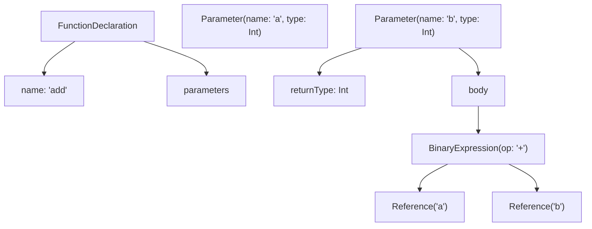
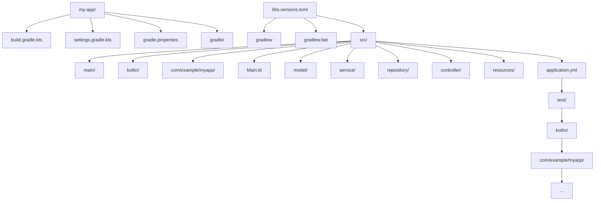
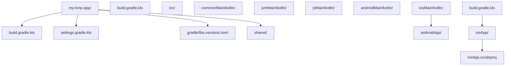

## 前置知识

- [Kotlin 是什么：现代 JVM 语言的起点](/kotlin/001-WhatIsKotlin)：建议先完成前一篇的学习

## 学习目标

- 掌握「1. 历史动机与发展脉络」的核心机制、典型用法与常见陷阱
- 掌握「2. 形式化定义」的核心机制、典型用法与常见陷阱
- 掌握「3. 理论推导与原理解析」的核心机制、典型用法与常见陷阱
- 掌握「4. 代码示例」的核心机制、典型用法与常见陷阱
- 掌握「5. 对比分析」的核心机制、典型用法与常见陷阱


> 本节为增量补充，帮助你选择 Kotlin 版本。

- Kotlin：2.4.10（2026-07-14）为当前稳定版；K2 编译器自 2.0 起为默认。新项目直接使用 2.x 最新稳定版。
- 平台：JVM 服务端、Android、Kotlin Multiplatform（KMP）与 Compose Multiplatform 均在同一工具链下推进。
- 配套：IntelliJ IDEA / Android Studio 会随版本自动下载匹配的 Kotlin 插件，一般不需要手动管理。


## 1. 历史动机与发展脉络

### 1.1 问题背景：Java 的痛点与 JetBrains 的痛点

2010 年前后，JetBrains 公司（IntelliJ IDEA 的创造者）的开发团队面临着一系列工程痛点：

1. **Java 语言的冗长**：一个简单的 POJO 类需要 100+ 行代码（getter、setter、equals、hashCode、toString、构造器），即便使用 IDE 自动生成，维护成本依然高。
2. **空指针异常泛滥**：Java 的所有引用类型默认可空，但编译器不强制检查 null，导致 NPE 成为生产环境最常见的崩溃类型（占 Android 崩溃的约 70%）。
3. **异步编程困难**：Java 的 `Future`、`CompletableFuture` API 复杂，回调地狱（callback hell）普遍存在，RxJava 学习曲线陡峭。
4. **函数式编程支持薄弱**：Java 8（2014）虽然引入了 Lambda 与 Stream，但仍受限于类型系统的限制，无法与 Scala 等语言竞争。
5. **Scala 学习曲线过陡**：Scala 虽然功能强大，但隐式转换（implicit）、高级类型（higher-kinded types）让团队协作困难，编译速度也较慢。

JetBrains 内部评估了 Scala、Groovy、Clojure 等候选语言，最终决定**自研一种新语言**，目标是：

- 完全兼容 Java（100% 互操作），平滑迁移既有代码。
- 比 Scala 更简单（避免隐式、高级类型等复杂特性）。
- 比 Groovy 更安全（静态类型，编译期检查）。
- 比 Java 更简洁（消除样板代码，引入现代语言特性）。

### 1.2 学术背景：现代语言设计的成熟

Kotlin 的设计并非凭空发明，而是站在多个成熟语言之上：

- **Scala（2004）**：启发了 Kotlin 的 `data class`、`sealed class`、模式匹配思路，但 Kotlin 故意省略了隐式转换与高级类型。
- **C#（2000）**：启发了 `?.` 安全调用、`??` null 合并运算符（Kotlin 称 Elvis `?:`）、扩展方法、属性（property）、`async/await`。
- **Groovy（2003）**：启发了 `?.` 安全导航、字符串模板 `$"..."`、`it` 隐式参数。
- **Swift（2014）**：与 Kotlin 同期设计，二者互相影响，尤其是 `Option<T>` 与 `T?` 语法高度相似。
- **TypeScript（2012）**：启发了 Kotlin 的渐进式类型（gradual typing）思路与可空类型注解。
- **Rust（2010）**：启发了 Kotlin 的所有权思路（虽然没有引入借用检查，但 `data class` 的 `copy` 与 Rust 的 `Clone` 异曲同工）。

### 1.3 Kotlin 1.0（2016）：正式发布

2016 年 2 月 15 日，JetBrains 发布 Kotlin 1.0 正式版，标志着语言进入稳定期。1.0 的核心特性：

- 空安全类型系统（`T?` 与 `T`）
- 数据类（`data class`）
- 扩展函数（`extension function`）
- 智能转换（`smart cast`）
- 函数类型与 Lambda（`fun interface`、`(T) -> R`）
- 属性委托（`by lazy`、`by Delegates.observable`）
- 密封类（`sealed class`）
- 区间（`1..10`、`1 until 10`）
- 字符串模板（`"Hello, $name!"`）

1.0 发布时已支持与 Java 100% 互操作，可在 JVM 8+ 上运行。

### 1.4 Kotlin 1.1（2017）：协程实验与 Google 入场

2017 年的关键事件：

1. **Kotlin 1.1 发布**：引入协程（coroutines）作为实验特性，使用 `suspend` 关键字与 `async/await` 语法。
2. **Google I/O 2017**：Google 宣布 Kotlin 成为 Android 官方开发语言，与 Java 并列支持。这一决定的影响巨大：
   - Android Studio 3.0 内置 Kotlin 支持。
   - Android 官方文档同步翻译为 Kotlin 版本。
   - 第三方库（Retrofit、Room、Glide）开始提供 Kotlin 友好 API。
3. **Kotlin/JS 1.1**：实验性支持编译为 JavaScript。
4. **类型别名（typealias）**：允许为现有类型起别名，如 `typealias StringPredicate = (String) -> Boolean`。

### 1.5 Kotlin 1.3（2018）：协程稳定与跨平台

2018 年的里程碑：

1. **协程稳定**：Kotlin 1.3 将协程从实验特性升级为稳定 API，`kotlinx.coroutines` 库同步发布 1.0。
2. **Kotlin/Native Beta**：原生编译目标进入 Beta 阶段，可编译为 iOS、Windows、Linux、macOS 原生二进制。
3. **契约（Contracts）实验**：引入 `contract` 函数，让编译器知道某些函数的行为（如 `requireNotNull` 后 `x` 不为 null），辅助智能转换。
4. **内联类（inline class）实验**：允许 `value class` 在运行时表示为基础类型，零运行时开销。

### 1.6 Kotlin 1.4（2020）：显式 API 模式

2020 年 8 月，Kotlin 1.4 发布，主要改进：

1. **显式 API 模式（Explicit API Mode）**：库作者可强制在公共 API 中显式声明类型与可见性，避免疏漏。
2. **协程调试器**：IntelliJ 中可查看协程调用栈，调试异步代码。
3. **Kotlin Multiplatform Mobile（KMM）Alpha**：移动端跨平台方案进入 Alpha。
4. **标准库改进**：`Deque`、`StringBuilder` 等跨平台 API。

### 1.7 Kotlin 1.5（2021）：密封类改进

2021 年 5 月，Kotlin 1.5 引入：

1. **密封类改进**：密封类的子类可在同一包内任意文件中声明（不再限于同一文件），更灵活。
2. **`value class` 稳定**：内联类（inline class）正式升级为 `value class`，并允许实现接口。
3. **无符号整数（Unsigned Integers）稳定**：`UInt`、`ULong`、`UByte`、`UShort` 进入稳定 API。
4. **stdlib JAR 模块化**：将 `kotlin-stdlib` 拆分为多个模块，减少冗余依赖。

### 1.8 Kotlin 1.6（2021）与 1.7（2022）

1.6 主要改进：

- **类型推断改进**：递归类型推断更准确。
- **`suspend` 转换为 `Runnable`**：与 Java `Runnable` 兼容。

1.7 主要改进：

- **K2 编译器 Alpha**：新一代编译器首次公开测试。
- **`minOf`/`maxOf` 优化**：性能改进。
- **`value class` 优化**：减少装箱（boxing）。

### 1.9 Kotlin 1.8（2023）：JVM 19 与 Kotlin/JS IR

1.8 引入：

1. **JVM 19 支持**：兼容 Java 19 的虚拟线程（Virtual Thread）。
2. **Kotlin/JS IR 编译器稳定**：基于 IR 的 JS 编译器正式发布，生成更小、更快的 JS 代码。
3. **`kotlinx-datetime` 稳定**：跨平台日期时间库。
4. **`AutoCloseable` 兼容**：Kotlin 资源使用语法 `use {}` 兼容 Java 9+ 的 `AutoCloseable`。

### 1.10 Kotlin 1.9（2023）：K2 Beta 与 Kotlin Multiplatform 稳定

1.9 是 2.0 之前的预热版本：

1. **K2 编译器 Beta**：性能显著提升，可在生产中试用。
2. **Kotlin Multiplatform 稳定**：JetBrains 宣布 KMP 进入稳定阶段，可用于生产环境。
3. **KSP2**：Kotlin Symbol Processing API 第二版，支持增量编译与 K2 兼容。
4. **`@Volatile` 跨平台**：可在 `commonMain` 中使用。

### 1.11 Kotlin 2.0（2024）：K2 编译器稳定

2024 年 5 月，Kotlin 2.0 正式发布，K2 编译器进入稳定阶段：

1. **K2 编译器稳定**：新编译器架构，编译速度提升约 2 倍，多平台编译更稳定。
2. **KMP 完全稳定**：JetBrains 与 Google 联合推荐 KMP 用于生产环境。
3. **`open class` 默认化提案**：讨论将 `class` 默认改为 `open`（最终未实施，保持现有 final-by-default）。
4. **`guard` 条件表达式实验**：早期返回的语法糖。
5. **`@RequiresOptIn` 改进**：实验性 API 标注机制更严格。

### 1.12 Kotlin 在企业中的采用

截至 2024 年，Kotlin 已被大量公司采用：

- **Google**：Android 平台首选语言，AndroidX、Jetpack Compose 等。
- **JetBrains**：自家所有产品（IntelliJ IDEA、Kotlin 编译器自身、Space、YouTrack）。
- **Square（Block）**：Cash App、Square POS 终端。
- **Netflix**：服务端部分模块。
- **Trello（Atlassian）**：Android 应用。
- **Pinterest**：Android 应用。
- **Uber**：Android 应用部分模块。
- **百度、字节跳动、阿里巴巴、腾讯、美团**：Android 应用大量采用。
- **Spring Framework**：自 5.0 起一等支持 Kotlin。

---

## 2. 形式化定义

### 2.1 语言的类型系统分类

Kotlin 在编程语言分类学中的位置如下：

| 维度           | 分类                          | Kotlin 的归属                                     |
| -------------- | ----------------------------- | ------------------------------------------------- |
| 类型系统       | 静态/动态                     | 静态（Static）                                    |
| 类型推断       | 完整/局部                     | 局部类型推断（Local Type Inference）              |
| 范式           | 命令式/函数式/面向对象        | 多范式（Multi-paradigm），三者并重                |
| 类型安全       | 强/弱                         | 强类型（Strong），不允许隐式不安全转换            |
| 内存管理       | 手动/自动                     | 自动（GC，Garbage Collection）                    |
| 并发模型       | 共享内存/消息传递             | 共享内存 + 协程（协作式多任务）                    |
| 编译目标       | 原生/虚拟机/解释              | 多目标（JVM、JS、Native、Wasm）                   |
| 类型系统       | 名义/结构                     | 名义类型（Nominal）                               |
| 求值策略       | 严格/惰性                     | 严格（Strict），但支持 `lazy` 局部惰性            |
| 函数性质       | 一等公民/非一等               | 函数是一等公民（First-class）                     |

### 2.2 语法定义的形式化描述

Kotlin 的语法可形式化定义为以下文法（简化版 BNF 范式）：

```ebnf
(* 顶层声明 *)
program        ::= topLevelElement*
topLevelElement ::= classDeclaration
                  | functionDeclaration
                  | propertyDeclaration
                  | typeAlias
                  | objectDeclaration
                  | importStatement

(* 类声明 *)
classDeclaration ::= ("class" | "interface" | "object" | "enum" | "sealed") 
                     SimpleName 
                     [typeParameters]
                     [primaryConstructor]
                     [": " superClassCall (", " interfaceCall)*]
                     [classBody]

(* 函数声明 *)
functionDeclaration ::= ["suspend"] "fun" [typeParameters] 
                        SimpleName 
                        "(" (parameter ("," parameter)*)? ")"
                        [":" type]
                        [functionBody]
                        ["=" expression]

(* 类型 *)
type            ::= nullableType | nonNullType
nullableType    ::= nonNullType "?"
nonNullType     ::= SimpleName
                  | userType
                  | functionType
                  | typeParameter
                  | dynamicType

(* 表达式 *)
expression      ::= disjunction
disjunction     ::= conjunction ("||" conjunction)*
conjunction     ::= equality ("&&" equality)*
equality       ::= comparison (("==" | "!=") comparison)*
comparison     ::= additive (("<" | ">" | "<=" | ">=") additive)*
additive       ::= multiplicative (("+" | "-") multiplicative)*
multiplicative ::= unary (("*" | "/" | "%") unary)*
unary          ::= ("!" | "-")* postfix
postfix        ::= primary (callSuffix | navigationSuffix)*
```

### 2.3 形式化语义：类型推导规则

Kotlin 的类型推断遵循 Hindley-Milner 类型系统的部分思想，并扩展至面向对象。核心推导规则：

**变量声明推导规则**：

$$
\frac{\Gamma \vdash e : T}{\Gamma \vdash \text{val } x = e : \text{Stmt} \quad \Gamma' = \Gamma \cup \{x : T\}}
$$

其中 $\Gamma$ 是类型环境，$e$ 是表达式，$T$ 是推导出的类型。

**函数返回类型推导规则**：

$$
\frac{\Gamma, \text{return}: \text{Nothing} \vdash e : T \quad T \not= \text{Nothing}}{\Gamma \vdash \text{fun } f() = e : T}
$$

**Lambda 推导规则**：

$$
\frac{\Gamma \cup \{x : T_1\} \vdash e : T_2}{\Gamma \vdash \{ x : T_1 \to e : T_2 \} : (T_1) \to T_2}
$$

**空安全规则**：

$$
\frac{\Gamma \vdash x : T \quad T \neq \text{Nullable}}{\Gamma \vdash x.\text{method}() : R} \quad \text{(直接调用)}
$$

$$
\frac{\Gamma \vdash x : T?}{\Gamma \vdash x?.\text{method}() : R?} \quad \text{(安全调用)}
$$

### 2.4 编译流程的形式化描述

Kotlin/JVM 的编译流程可形式化为以下管道（pipeline）：

$$
\text{Source } \mathcal{S} \xrightarrow{\text{Lexer}} \text{Tokens } \mathcal{T} \xrightarrow{\text{Parser}} \text{AST } \mathcal{A} \xrightarrow{\text{Semantic}} \text{FIR} \xrightarrow{\text{Lowering}} \text{IR } \mathcal{I} \xrightarrow{\text{Codegen}} \text{Bytecode } \mathcal{B}
$$

各阶段的形式化定义：

1. **词法分析（Lexer）**：$\mathcal{L} : \mathcal{S}^* \to \mathcal{T}^*$，将源代码字符串切分为 Token 序列。
2. **语法分析（Parser）**：$\mathcal{P} : \mathcal{T}^* \to \mathcal{A}$，根据文法构造抽象语法树（AST）。
3. **语义分析（Semantic Analysis）**：$\mathcal{SA} : \mathcal{A} \to \text{FIR}$，类型检查、解析引用、生成 Frontend IR（K2 引入）。
4. **降级（Lowering）**：$\mathcal{L}_{\text{ow}} : \text{FIR} \to \text{IR}$，将高层 IR 转换为后端 IR。
5. **代码生成（Codegen）**：$\mathcal{C} : \text{IR} \to \mathcal{B}$，生成目标字节码。

### 2.5 KMP 共享模块的形式化语义

KMP 的核心是 `expect`/`actual` 机制，可形式化描述为：

- **expect 声明**：在 `commonMain` 中声明一个"占位符"，表示该函数/类/属性将在平台特定代码中实现。
- **actual 实现**：在 `jvmMain`、`jsMain`、`iosMain` 等平台特定源集中提供具体实现。

形式化定义：

$$
\text{expect } \text{fun } f(x: T) : R \quad \equiv \quad \forall p \in \{\text{JVM}, \text{JS}, \text{Native}, \dots\}, \exists \text{actual}_p : \text{fun } f(x: T) : R
$$

编译器在编译每个平台时，将 `expect` 替换为对应的 `actual` 实现。如果某平台未提供 `actual`，编译失败。

---

## 3. 理论推导与原理解析

### 3.1 Kotlin/JVM 编译机制深入

Kotlin 编译器将 `.kt` 源代码编译为 JVM 字节码（`.class` 文件），过程涉及多个内部阶段：

#### 3.1.1 词法分析（Lexical Analysis）

词法分析器将源代码字符流切分为 Token 序列。例如：

```kotlin
val x: Int = 42
```

会被切分为以下 Token：

```
VAL, IDENTIFIER("x"), COLON, IDENTIFIER("Int"), EQ, INTEGER_LITERAL("42")
```

Kotlin 的 Token 类型包括：

- **关键字**：`val`、`var`、`fun`、`class`、`object`、`interface`、`if`、`when` 等。
- **标识符**：用户定义的名称，支持反引号（`` `my var` ``）。
- **字面量**：整数、浮点、字符、字符串、布尔。
- **操作符**：`+`、`-`、`*`、`/`、`==`、`?.`、`?:`、`!!`、`..`、`->` 等。
- **分隔符**：`(`、`)`、`{`、`}`、`[`、`]`、`;`、`,`。

#### 3.1.2 语法分析（Syntax Analysis）

语法分析器根据 BNF 文法构造 AST。例如：

```kotlin
fun add(a: Int, b: Int): Int = a + b
```

对应的 AST（简化）：



#### 3.1.3 语义分析（Semantic Analysis）

语义分析器执行：

1. **类型检查**：验证表达式类型是否符合预期。
2. **引用解析**：将 AST 中的标识符解析为符号（Symbol）。
3. **重载解析**：在多个候选函数中选择最匹配的。
4. **智能转换**：在控制流中细化类型。
5. **空安全检查**：确保可空类型不被直接解引用。

K2 编译器将此阶段分为：

- **FIR 构建**：构造 Frontend IR。
- **FIR 检查**：执行所有类型与引用检查。
- **FIR 序列化**：用于增量编译与跨模块依赖。

#### 3.1.4 后端 IR 与代码生成

K2 后端将 FIR 转换为后端 IR（Backend IR），然后生成各平台的目标代码：

- **JVM 后端**：生成字节码（`.class` 文件）。
- **JS 后端**：生成 JavaScript（`.js` 文件）。
- **Native 后端**：通过 LLVM 生成原生二进制（`.klib` → `.exe`/`.so`/`.dylib`）。
- **Wasm 后端**：生成 WebAssembly（`.wasm` 文件）。

### 3.2 字节码层的 Kotlin 表达

Kotlin 编译为 JVM 字节码后，许多语法糖会被"解糖"（desugar）为基础字节码操作：

| Kotlin 语法           | 字节码等价                                                |
| --------------------- | --------------------------------------------------------- |
| `val x = 42`          | `LDC 42`、`ISTORE 0`                                      |
| `data class User(...)` | 自动生成 `equals`、`hashCode`、`toString`、`copy` 方法   |
| `1..10`（区间）       | `IntRange` 对象，包含 `start`、`endInclusive` 字段         |
| `for (i in 1..10)`    | `IntRange.iterator()` + `Iterator.hasNext()`/`next()`     |
| `str?.length`         | `IFNULL` 跳转 + `INVOKEVIRTUAL`                            |
| `str ?: "default"`    | `IFNULL` 跳转 + `LDC "default"`                            |
| `str!!`               | `IFNULL` 跳转到 `throw new NullPointerException()`         |
| `list.filter { }`     | 创建 `FilteringSequence`/`List`，执行 Lambda              |
| `suspend fun`         | 转换为 `Continuation` 状态机，每个挂起点对应一个 `case`  |
| `lateinit var`        | 字段无 null 检查，但 getter 检查 `isInitialized`          |
| `by lazy { }`         | 生成 `Lazy<T>` 对象，使用双重检查锁                       |

### 3.3 Kotlin/Native 的编译机制

Kotlin/Native 不依赖 JVM，直接编译为原生机器码，过程为：

$$
\text{Source } \to \text{FIR} \to \text{IR} \to \text{LLVM IR} \to \text{Object Files} \to \text{Linker} \to \text{Executable}
$$

Kotlin/Native 引入了以下概念：

- **`klib`**：Kotlin 库格式，包含 IR、元数据、跨模块链接信息。
- **IR 树**：高层中间表示，类似 JVM 字节码但更抽象。
- **LLVM IR**：低层中间表示，可被 LLVM 优化与生成机器码。
- **运行时（Runtime）**：包含 GC（Garbage Collector）与基础内存管理，无需 JVM。

Kotlin/Native 的优势：

- 启动时间快（无 JVM 预热）。
- 内存占用低（无 JVM 元空间）。
- 可用于嵌入式系统（如 IoT 设备）。
- 编译为 iOS 二进制，支持跨平台移动开发。

### 3.4 Kotlin/JS 的编译机制

Kotlin/JS 编译为 JavaScript，过程涉及：

1. **Kotlin Source → FIR → IR**：与其他后端共享前端。
2. **IR → JS**：将 Kotlin IR 转换为 JavaScript 代码（IR 编译器）。
3. **Webpack/Bundling**：将多个 JS 文件打包为单个可部署文件。

Kotlin/JS 支持两种产物：

- **Node.js 模块**：可在 Node.js 环境运行，可调用 NPM 包。
- **Browser 脚本**：可在浏览器中运行，可调用 DOM API。

### 3.5 Kotlin/Wasm 的编译机制

Kotlin/Wasm 是较新的目标平台（1.9.20 起实验性），将 Kotlin 编译为 WebAssembly：

- 利用 Wasm GC 提案，原生支持垃圾回收。
- 性能优于 JS，接近原生。
- 可与 JavaScript 互操作。

### 3.6 类型推断算法的原理

Kotlin 使用局部类型推断（基于约束求解），核心算法类似 Scala 的类型推断：

1. **约束生成**：遍历 AST，为每个未确定类型生成约束。
2. **约束求解**：通过统一（unification）算法求解类型变量。
3. **类型解析**：将求解结果回填到 AST。

例如：

```kotlin
val x = if (cond) 1 else "string"
```

推断过程：

1. `1 : Int`，`"string" : String`。
2. `if` 表达式的类型是 then/else 分支的共同超类型。
3. 求解 `T = Int ∪ String = Comparable<*>`（最近公共父类型）。
4. 实际推断结果：`Serializable & Comparable<*>`（intersection type）。

### 3.7 智能转换的实现机制

智能转换是 Kotlin 的标志性特性。其实现原理基于**控制流类型细化（Type Refinement in Control Flow）**：

1. 编译器在控制流图（CFG）中维护每个变量的"已知类型"。
2. 在 `if (x is String)` 的 then 分支中，`x` 的类型被细化为 `String`。
3. 在 `if (x != null)` 的 then 分支中，`x` 的类型从 `T?` 细化为 `T`。

实现要点：

- 仅对 `val` 属性生效（`var` 可能被其他线程修改）。
- 跨函数边界失效（函数调用后类型推断重置）。
- 在自定义 getter 中失效（属性可能返回不同类型）。

### 3.8 协程的状态机转换

Kotlin 协程通过 `suspend` 关键字标记函数，编译器将其转换为**状态机（State Machine）**。例如：

```kotlin
suspend fun fetchUser(): User {
    val token = getToken()        // suspend point 1
    val user = getUser(token)     // suspend point 2
    return user
}
```

被编译器转换为类似以下的状态机：

```kotlin
// 反编译后的伪代码
fun fetchUser(continuation: Continuation<User>): Any? {
    val sm = continuation as? FetchUserSM ?: FetchUserSM(continuation)
    return when (sm.label) {
        0 -> {
            sm.label = 1
            getToken(sm)  // 传入 Continuation，挂起后从这里恢复
        }
        1 -> {
            sm.token = sm.result as Token
            sm.label = 2
            getUser(sm.token, sm)
        }
        2 -> {
            sm.user = sm.result as User
            sm.user
        }
        else -> throw IllegalStateException()
    }
}
```

每个 `suspend` 调用对应一个状态，状态机通过 `label` 字段记录当前位置。这使得协程在不阻塞线程的情况下挂起与恢复。

### 3.9 KMP 的符号解析机制

KMP 的 `expect`/`actual` 机制在编译期进行匹配验证：

1. `commonMain` 中的 `expect fun foo()` 表示"在所有目标平台都需要 `actual` 实现"。
2. 编译 `jvmMain` 时，编译器查找 `actual fun foo()` 实现。
3. 编译器验证签名匹配（参数、返回类型、泛型）。
4. 若匹配失败，编译错误。
5. 若匹配成功，在字节码中将 `expect` 调用替换为 `actual` 实现。

---

## 4. 代码示例

### 4.1 第一个 Kotlin 程序

```kotlin
// HelloWorld.kt
fun main() {
    println("Hello, Kotlin!")
}
```

运行：

```bash
kotlinc HelloWorld.kt -include-runtime -d HelloWorld.jar
java -jar HelloWorld.jar
```

输出：

```
Hello, Kotlin!
```

### 4.2 数据类

```kotlin
// 数据类：自动生成 equals、hashCode、toString、copy、componentN
data class User(
    val id: Long,
    val name: String,
    val age: Int,
    val email: String?  // 可空类型
)

fun main() {
    val alice = User(1, "Alice", 30, "alice@example.com")
    val bob = User(2, "Bob", 25, null)
    
    // 解构声明
    val (id, name, age, email) = alice
    println("$id: $name, $age years old, email=$email")
    
    // copy 函数
    val aliceOlder = alice.copy(age = 31)
    
    // equals 比较
    println(alice == aliceOlder)  // false
    
    // toString
    println(alice)  // User(id=1, name=Alice, age=30, email=alice@example.com)
}
```

### 4.3 空安全

```kotlin
// 空安全：编译期区分可空与不可空
fun greet(name: String?): String {
    // name.length  // 编译错误：name 可能为 null
    return "Hello, ${name ?: "stranger"}!"
}

fun main() {
    println(greet("Alice"))    // Hello, Alice!
    println(greet(null))        // Hello, stranger!
    
    val nullableName: String? = getNullableName()
    val safeLength = nullableName?.length ?: 0  // 安全调用 + Elvis
    
    println(safeLength)
}

fun getNullableName(): String? = if ((1..10).random() > 5) "Bob" else null
```

### 4.4 扩展函数

```kotlin
// 扩展函数：为现有类型添加方法
fun String.shout(): String = this.uppercase() + "!"

fun Int.isEven(): Boolean = this % 2 == 0

fun <T> List<T>.secondOrNull(): T? = if (size >= 2) this[1] else null

fun main() {
    println("hello".shout())              // HELLO!
    println(42.isEven())                 // true
    println(listOf(1, 2, 3).secondOrNull()) // 2
}
```

### 4.5 Lambda 与高阶函数

```kotlin
// 高阶函数：函数作为参数或返回值
fun <T, R> List<T>.myMap(transform: (T) -> R): List<R> {
    val result = mutableListOf<R>()
    for (item in this) {
        result.add(transform(item))
    }
    return result
}

fun main() {
    val numbers = listOf(1, 2, 3, 4, 5)
    
    // 显式 Lambda
    val squares1 = numbers.myMap({ n -> n * n })
    
    // 简化：trailing lambda
    val squares2 = numbers.myMap { n -> n * n }
    
    // 进一步简化：it 隐式参数
    val squares3 = numbers.myMap { it * it }
    
    println(squares1)  // [1, 4, 9, 16, 25]
    println(squares2)  // [1, 4, 9, 16, 25]
    println(squares3)  // [1, 4, 9, 16, 25]
}
```

### 4.6 协程基础

```kotlin
import kotlinx.coroutines.*

fun main() = runBlocking {
    // launch：启动协程，不返回结果
    launch {
        delay(1000)
        println("World!")
    }
    println("Hello,")
    
    // async：启动协程，返回 Deferred<T>
    val deferred = async {
        delay(500)
        42
    }
    val result = deferred.await()
    println("Answer: $result")
}

// 输出：
// Hello,
// World!  (1秒后)
// Answer: 42  (0.5秒后)
```

### 4.7 密封类与 when

```kotlin
// 密封类：受限继承 + when 穷尽检查
sealed class Shape {
    data class Circle(val radius: Double) : Shape()
    data class Square(val side: Double) : Shape()
    data class Rectangle(val width: Double, val height: Double) : Shape()
}

fun area(shape: Shape): Double = when (shape) {
    is Shape.Circle -> Math.PI * shape.radius * shape.radius
    is Shape.Square -> shape.side * shape.side
    is Shape.Rectangle -> shape.width * shape.height
}

fun main() {
    val shapes = listOf(
        Shape.Circle(2.0),
        Shape.Square(3.0),
        Shape.Rectangle(2.0, 4.0)
    )
    
    shapes.forEach { shape ->
        println("Area: ${area(shape)}")
    }
}
```

### 4.8 属性委托

```kotlin
// 属性委托：将 getter/setter 逻辑委托给其他对象
import kotlin.properties.Delegates

class Config {
    // lazy：惰性初始化
    val expensiveValue: String by lazy {
        println("Computing...")
        "Result"
    }
    
    // observable：监听变化
    var count: Int by Delegates.observable(0) { _, old, new ->
        println("count: $old -> $new")
    }
    
    // vetoable：可否决
    var positive: Int by Delegates.vetoable(0) { _, _, new -> new >= 0 }
}

fun main() {
    val config = Config()
    
    println(config.expensiveValue)  // Computing... Result
    println(config.expensiveValue)  // Result (不再计算)
    
    config.count = 1    // count: 0 -> 1
    config.count = 2    // count: 1 -> 2
    
    config.positive = 5   // 成功
    config.positive = -1  // 被否决
    println(config.positive)  // 5
}
```

### 4.9 DSL 构建

```kotlin
// DSL：领域特定语言
class HtmlBuilder {
    private val children = mutableListOf<HtmlNode>()
    
    fun head(block: HeadBuilder.() -> Unit) {
        children.add(HeadBuilder().apply(block).build())
    }
    
    fun body(block: BodyBuilder.() -> Unit) {
        children.add(BodyBuilder().apply(block).build())
    }
    
    fun build(): String = children.joinToString("\n") { it.render() }
}

class HeadBuilder {
    private var title: String = ""
    fun title(t: String) { title = t }
    fun build(): HtmlNode = HtmlNode("head", "<title>$title</title>")
}

class BodyBuilder {
    private val content = StringBuilder()
    fun h1(text: String) { content.append("<h1>$text</h1>\n") }
    fun p(text: String) { content.append("<p>$text</p>\n") }
    fun build(): HtmlNode = HtmlNode("body", content.toString())
}

data class HtmlNode(val name: String, val innerHtml: String) {
    fun render() = "<$name>$innerHtml</$name>"
}

fun html(block: HtmlBuilder.() -> Unit): String = HtmlBuilder().apply(block).build()

fun main() {
    val page = html {
        head {
            title("My Page")
        }
        body {
            h1("Welcome")
            p("This is a paragraph.")
        }
    }
    println(page)
}
```

### 4.10 KMP 共享模块

```kotlin
// commonMain/Main.kt
expect class PlatformDate {
    fun toIsoString(): String
}

expect fun getPlatformName(): String

class Greeting {
    fun greet(): String = "Hello from ${getPlatformName()}!"
}

// jvmMain/Main.kt
actual class PlatformDate {
    private val date = java.util.Date()
    actual fun toIsoString(): String = date.toInstant().toString()
}

actual fun getPlatformName(): String = "JVM"

// jsMain/Main.kt
actual class PlatformDate {
    private val date = js("new Date()")
    actual fun toIsoString(): String = date.toISOString() as String
}

actual fun getPlatformName(): String = "JS"

// 使用
fun main() {
    println(Greeting().greet())
}
```

---

## 5. 对比分析

### 5.1 Kotlin vs Java

| 维度           | Java                                       | Kotlin                                                |
| -------------- | ------------------------------------------ | ----------------------------------------------------- |
| 空安全         | 所有引用可空，运行时 NPE                   | 编译期区分 `T` 与 `T?`，编译期检查                    |
| 数据类         | Lombok 或手写样板代码                     | `data class` 自动生成 equals/hashCode/toString/copy   |
| 扩展函数       | 不支持                                     | 通过 `fun ClassName.fn()` 语法添加方法                |
| 协程           | CompletableFuture（复杂）                 | `suspend` + `async/await`（简洁）                     |
| 类型推断       | `var x = "str"` (Java 10+)，函数返回需显式 | 完整的局部类型推断                                    |
| 智能转换       | 需显式 cast                                | `if (x is String)` 后自动转换                         |
| 函数类型       | 需 Functional Interface                    | 一等公民：`(Int) -> String`                            |
| 属性           | 字段 + getter/setter                       | 一等公民：`val/var` 直接是属性                         |
| 密封类         | Java 17 引入 sealed                        | Kotlin 1.0 起原生支持                                 |
| 单例           | 手写或 enum                                | `object` 关键字                                        |
| 默认参数       | 不支持（需重载）                           | `fun f(x: Int = 0)`                                   |
| 命名参数       | 不支持                                     | `f(name = "Alice")`                                   |
| 字符串模板     | String.format                              | `"Hello, $name!"`                                     |
| 区间           | for (int i=0; i<n; i++)                    | `for (i in 1..10)`                                    |
| 编译目标       | JVM                                        | JVM、JS、Native、Wasm                                 |
| 互操作         | 自身                                       | 与 Java 100% 双向                                     |
| 学习曲线       | 较陡                                       | 渐进式（入门易，精通难）                              |

### 5.2 Kotlin vs Scala

| 维度           | Scala                                  | Kotlin                                          |
| -------------- | --------------------------------------- | ----------------------------------------------- |
| 设计哲学       | 学术性强，融合 OOP 与 FP                | 实用主义，工业优先                              |
| 隐式转换       | `implicit`（强大但复杂）                | 不支持（避免歧义）                              |
| 高级类型       | 支持（Higher-Kinded Types）            | 不支持                                          |
| 类型类         | 通过 implicit 实现                      | 通过扩展函数模拟                                |
| 协程           | AKKA Streams / Future                   | 原生 `suspend` + kotlinx.coroutines            |
| 互操作 Java    | 部分互操作（存在阻抗）                  | 100% 双向                                       |
| 编译速度       | 慢（ scalac 编译开销大）                | 快（K2 后更快）                                 |
| 二进制大小     | 大（含 scala 库）                       | 小（stdlib 较小）                               |
| 学习曲线       | 陡峭                                    | 渐进式                                          |
| 社区           | 学术 + 数据工程                        | Android + 服务端                               |
| 典型项目       | Spark、Kafka、Akka                      | Android、Spring、Ktor                          |

### 5.3 Kotlin vs Swift

| 维度           | Swift                              | Kotlin                                       |
| -------------- | ------------------------------------ | -------------------------------------------- |
| 平台           | Apple 系（iOS、macOS、watchOS）      | 跨平台                                       |
| 空安全         | `Optional<T>` 强制                   | `T?` 类型系统                                |
| 协程           | `async/await` + `Task`              | `suspend` + 协程                              |
| 错误处理       | `throws` + `try/catch`               | `try/catch` + `Result`                       |
| 值类型         | `struct` 一等公民                    | 数据类（仍是引用）                          |
| 内存管理       | ARC（自动引用计数）                  | GC（垃圾回收）                              |
| 泛型           | 完整泛型（含高级类型）               | 限制泛型（无 HKT）                           |
| 编译目标       | LLVM（原生）                         | JVM/JS/Native/Wasm                           |
| 设计灵感       | Rust、Haskell、C#                    | Scala、C#、Groovy                            |

### 5.4 Kotlin vs Go

| 维度           | Go                                  | Kotlin                                         |
| -------------- | ------------------------------------ | ---------------------------------------------- |
| 类型系统       | 简单（无泛型直到 1.18）              | 完整泛型                                       |
| 并发模型       | Goroutine + Channel                  | 协程 + Channel + SharedFlow/StateFlow          |
| 错误处理       | `error` 多返回值                     | `try/catch` + `Result<T>`                      |
| 内存管理       | GC                                   | GC（JVM）                                      |
| 编译速度       | 极快                                 | 中等                                           |
| 二进制大小     | 小                                   | 中等                                           |
| 启动时间       | 极快                                 | JVM 慢（Native 快）                            |
| 生态           | 云原生、微服务                       | Android、JVM 服务端、跨平台                    |
| OOP            | 简化 OOP（无继承）                   | 完整 OOP                                       |

### 5.5 KMP vs Flutter vs React Native

| 维度           | Kotlin Multiplatform           | Flutter                    | React Native             |
| -------------- | ------------------------------ | -------------------------- | ------------------------ |
| 共享内容       | 业务逻辑                       | UI + 业务逻辑              | UI + 业务逻辑（JS）       |
| UI 实现        | 原生 UI                        | 自绘 UI（Skia）            | 原生 UI（Bridge/JSI）    |
| 性能           | 原生                           | 高（自绘）                 | 中等（JS Bridge）        |
| 平台           | iOS、Android、Web、Desktop     | iOS、Android、Web、Desktop | iOS、Android            |
| 语言           | Kotlin                         | Dart                       | JavaScript/TypeScript   |
| 互操作         | 与原生 API 100%                | 通过 Platform Channel       | 原生模块                |
| 适合场景       | 共享业务逻辑                    | UI 一致性优先              | 跨平台 + JS 生态        |
| 学习曲线       | 中（需懂多平台）               | 低（Dart 简单）            | 低（JS 开发者友好）     |
| 增量迁移       | 支持（KMP 可逐步引入）         | 不支持（全有或全无）        | 部分支持                |

---

## 6. 常见陷阱与最佳实践

### 6.1 陷阱：误用 `!!` 强制非空

**问题代码**：

```kotlin
fun process(name: String?) {
    val length = name!!.length  // 危险：若 name 为 null，运行时抛 NPE
    println(length)
}
```

**最佳实践**：避免使用 `!!`，改用安全调用 `?.` 或显式检查：

```kotlin
fun process(name: String?) {
    val length = name?.length ?: 0  // 安全调用 + 默认值
    println(length)
    
    if (name != null) {  // 智能转换后 name 是 String
        println(name.length)
    }
}
```

### 6.2 陷阱：在 `var` 上使用智能转换

**问题代码**：

```kotlin
class Foo {
    var s: String? = null
    
    fun bar() {
        if (s != null) {
            // 编译错误：var 可能在其他线程中被修改
            println(s.length)
        }
    }
}
```

**最佳实践**：使用 `val` 或局部变量缓存：

```kotlin
class Foo {
    var s: String? = null
    
    fun bar() {
        val local = s  // 局部变量
        if (local != null) {
            println(local.length)  // OK
        }
    }
}
```

### 6.3 陷阱：协程泄露

**问题代码**：

```kotlin
fun startWork() {
    GlobalScope.launch {  // GlobalScope 不受生命周期管理
        delay(10000)
        println("Done")
    }
}
```

**最佳实践**：使用结构化并发：

```kotlin
class MyService : CoroutineScope {
    override val coroutineContext = SupervisorJob() + Dispatchers.Default
    
    fun startWork() {
        launch {  // 受 MyService 生命周期管理
            delay(10000)
            println("Done")
        }
    }
    
    fun shutdown() {
        coroutineContext.cancel()
    }
}
```

### 6.4 陷阱：使用 `runBlocking` 阻塞主线程

**问题代码**：

```kotlin
fun fetchUser(): User = runBlocking {  // 阻塞调用线程
    api.getUser()  // suspend 函数
}
```

**最佳实践**：保持异步链：

```kotlin
suspend fun fetchUser(): User = api.getUser()

// 或者使用回调
fun fetchUser(callback: (User) -> Unit) {
    CoroutineScope(Dispatchers.IO).launch {
        val user = api.getUser()
        withContext(Dispatchers.Main) {
            callback(user)
        }
    }
}
```

### 6.5 陷阱：data class 包含可变属性

**问题代码**：

```kotlin
data class User(var name: String, var age: Int)  // 可变属性
```

**最佳实践**：data class 应使用 `val`，保证不可变性：

```kotlin
data class User(val name: String, val age: Int)

// 修改时使用 copy
val alice = User("Alice", 30)
val aliceOlder = alice.copy(age = 31)
```

### 6.6 陷阱：滥用 `lateinit`

**问题代码**：

```kotlin
class Foo {
    lateinit var list: MutableList<Int>  // 可能未初始化就被访问
    
    fun add() {
        list.add(1)  // UninitializedPropertyAccessException
    }
}
```

**最佳实践**：

- 仅在生命周期明确（如 Android `onCreate`）时使用 `lateinit`。
- 否则使用 `by lazy` 或可空类型 + 默认值。

```kotlin
class Foo {
    val list: MutableList<Int> by lazy { mutableListOf() }
}

class Bar {
    var list: MutableList<Int>? = null
    fun add() = list?.add(1) ?: false
}
```

### 6.7 陷阱：在 KMP 中使用 JVM 特定 API

**问题代码**：

```kotlin
// commonMain 中
fun formatDate(timestamp: Long): String {
    val date = java.util.Date(timestamp)  // 编译错误：commonMain 不能直接使用 JVM API
    return date.toString()
}
```

**最佳实践**：使用 `expect`/`actual` 或跨平台库（如 kotlinx-datetime）：

```kotlin
// commonMain
expect fun formatDate(timestamp: Long): String

// jvmMain
actual fun formatDate(timestamp: Long): String {
    return java.util.Date(timestamp).toString()
}

// 或者使用 kotlinx-datetime
import kotlinx.datetime.Instant
fun formatDate(timestamp: Long): String {
    return Instant.fromEpochMilliseconds(timestamp).toString()
}
```

### 6.8 陷阱：Gradle 依赖版本不一致

**问题**：模块 A 使用 `kotlinx-coroutines:1.6.0`，模块 B 使用 `1.7.0`，导致冲突。

**最佳实践**：使用 `gradle.properties` 或 `libs.versions.toml` 统一管理版本：

```toml
# gradle/libs.versions.toml
[versions]
kotlin = "1.9.22"
coroutines = "1.7.3"

[libraries]
kotlin-stdlib = { module = "org.jetbrains.kotlin:kotlin-stdlib", version.ref = "kotlin" }
kotlinx-coroutines = { module = "org.jetbrains.kotlinx:kotlinx-coroutines-core", version.ref = "coroutines" }
```

```kotlin
// build.gradle.kts
dependencies {
    implementation(libs.kotlin.stdlib)
    implementation(libs.kotlinx.coroutines)
}
```

### 6.9 陷阱：协程上下文丢失

**问题代码**：

```kotlin
suspend fun updateUi() {
    val data = withContext(Dispatchers.IO) { fetchData() }
    // 这里上下文丢失，可能在 IO 线程更新 UI
    myTextView.text = data  
}
```

**最佳实践**：明确切换回 UI 线程：

```kotlin
suspend fun updateUi() {
    val data = withContext(Dispatchers.IO) { fetchData() }
    withContext(Dispatchers.Main) {
        myTextView.text = data
    }
}
```

### 6.10 陷阱：滥用单例 `object`

**问题代码**：

```kotlin
object GlobalConfig {
    var apiUrl: String = "https://api.example.com"
    var apiKey: String = ""
    // 全局可变状态，难以测试
}
```

**最佳实践**：使用依赖注入：

```kotlin
interface Config {
    val apiUrl: String
    val apiKey: String
}

class DefaultConfig : Config {
    override val apiUrl = "https://api.example.com"
    override val apiKey = System.getenv("API_KEY") ?: ""
}

class MyService(private val config: Config) {
    fun callApi() = fetch(config.apiUrl, config.apiKey)
}
```

---

## 7. 工程实践

### 7.1 项目结构规范

推荐的 Kotlin/JVM 项目结构：



推荐的 KMP 项目结构：



### 7.2 Gradle 构建脚本

最小化的 `build.gradle.kts`：

```kotlin
plugins {
    kotlin("jvm") version "1.9.22"
    application
}

group = "com.example"
version = "1.0-SNAPSHOT"

repositories {
    mavenCentral()
}

dependencies {
    implementation(libs.kotlin.stdlib)
    implementation(libs.kotlinx.coroutines.core)
    testImplementation(kotlin("test"))
    testImplementation(libs.junit.jupiter)
}

tasks.test {
    useJUnitPlatform()
}

application {
    mainClass.set("com.example.MainKt")
}
```

`settings.gradle.kts`：

```kotlin
rootProject.name = "my-app"

dependencyResolutionManagement {
    versionCatalogs {
        create("libs") {
            from(files("gradle/libs.versions.toml"))
        }
    }
}
```

### 7.3 版本目录（Version Catalog）

`gradle/libs.versions.toml`：

```toml
[versions]
kotlin = "1.9.22"
coroutines = "1.7.3"
serialization = "1.6.0"
datetime = "0.5.0"
junit = "5.10.0"
ktor = "2.3.7"

[libraries]
kotlin-stdlib = { module = "org.jetbrains.kotlin:kotlin-stdlib", version.ref = "kotlin" }
kotlinx-coroutines-core = { module = "org.jetbrains.kotlinx:kotlinx-coroutines-core", version.ref = "coroutines" }
kotlinx-coroutines-test = { module = "org.jetbrains.kotlinx:kotlinx-coroutines-test", version.ref = "coroutines" }
kotlinx-serialization-json = { module = "org.jetbrains.kotlinx:kotlinx-serialization-json", version.ref = "serialization" }
kotlinx-datetime = { module = "org.jetbrains.kotlinx:kotlinx-datetime", version.ref = "datetime" }
junit-jupiter = { module = "org.junit.jupiter:junit-jupiter", version.ref = "junit" }
ktor-server-core = { module = "io.ktor:ktor-server-core", version.ref = "ktor" }

[plugins]
kotlin-jvm = { id = "org.jetbrains.kotlin.jvm", version.ref = "kotlin" }
kotlin-serialization = { id = "org.jetbrains.kotlin.plugin.serialization", version.ref = "kotlin" }
```

### 7.4 多平台构建配置

KMP 项目的 `shared/build.gradle.kts`：

```kotlin
plugins {
    kotlin("multiplatform") version "1.9.22"
}

kotlin {
    jvm {
        jvmToolchain(17)
        withJava()
        testRuns.named("test").configure {
            executionTask.configure {
                useJUnitPlatform()
            }
        }
    }
    
    js(IR) {
        browser()
        nodejs()
    }
    
    iosX64()
    iosArm64()
    iosSimulatorArm64()
    
    sourceSets {
        val commonMain by getting {
            dependencies {
                implementation(libs.kotlin.stdlib)
                implementation(libs.kotlinx.coroutines.core)
            }
        }
        val commonTest by getting {
            dependencies {
                implementation(kotlin("test"))
            }
        }
        val jvmMain by getting
        val jsMain by getting
        val iosX64Main by getting
        val iosArm64Main by getting
        val iosSimulatorArm64Main by getting
        val iosMain by creating {
            dependsOn(commonMain)
            iosX64Main.dependsOn(this)
            iosArm64Main.dependsOn(this)
            iosSimulatorArm64Main.dependsOn(this)
        }
    }
}
```

### 7.5 单元测试

```kotlin
import kotlin.test.Test
import kotlin.test.assertEquals

class CalculatorTest {
    
    @Test
    fun `should add two numbers`() {
        val calc = Calculator()
        val result = calc.add(2, 3)
        assertEquals(5, result)
    }
    
    @Test
    fun `should handle negative numbers`() {
        val calc = Calculator()
        val result = calc.add(-2, -3)
        assertEquals(-5, result)
    }
}

class Calculator {
    fun add(a: Int, b: Int): Int = a + b
}
```

### 7.6 协程测试

```kotlin
import kotlinx.coroutines.test.runTest
import kotlinx.coroutines.delay
import kotlin.test.Test
import kotlin.test.assertEquals

class MyServiceTest {
    
    @Test
    fun `should fetch data asynchronously`() = runTest {
        val service = MyService()
        val result = service.fetchData()
        assertEquals("Hello", result)
    }
}

class MyService {
    suspend fun fetchData(): String {
        delay(1000)
        return "Hello"
    }
}
```

### 7.7 代码规范工具：Detekt

`config/detekt.yml`：

```yaml
complexity:
  LongMethod:
    threshold: 60
  LongParameterList:
    functionThreshold: 6
    constructorThreshold: 7
  CyclomaticComplexMethod:
    threshold: 15

style:
  WildcardImport:
    active: false
  MagicNumber:
    active: false
  ReturnCount:
    active: false

empty-blocks:
  EmptyFunctionBlock:
    active: false
```

`build.gradle.kts` 集成：

```kotlin
plugins {
    id("io.gitlab.arturbosch.detekt") version "1.23.4"
}

detekt {
    buildUponDefaultConfig = true
    config = files("$projectDir/config/detekt.yml")
}
```

### 7.8 持续集成

`.github/workflows/ci.yml`：

```yaml
name: CI

on:
  push:
    branches: [main, develop]
  pull_request:
    branches: [main]

jobs:
  build:
    runs-on: ubuntu-latest
    steps:
      - uses: actions/checkout@v4
      - name: Setup JDK
        uses: actions/setup-java@v4
        with:
          distribution: temurin
          java-version: 17
      - name: Setup Gradle
        uses: gradle/actions/setup-gradle@v3
      - name: Build
        run: ./gradlew build
      - name: Test
        run: ./gradlew test
      - name: Detekt
        run: ./gradlew detekt
      - name: Upload coverage
        uses: codecov/codecov-action@v3
```

### 7.9 文档生成：Dokka

```kotlin
plugins {
    id("org.jetbrains.dokka") version "1.9.10"
}

dokka {
    moduleName.set("My App")
    dokkaSourceSets {
        named("main") {
            sourceRoots.from(file("src/main/kotlin"))
        }
    }
}
```

运行：`./gradlew dokkaHtml` 生成 HTML 文档。

---

## 8. 案例研究

### 8.1 案例一：从 Java 迁移到 Kotlin

**场景**：一个 Spring Boot 服务，使用 Java 8，包含 50 个类。团队决定迁移到 Kotlin。

**迁移策略**：

1. **渐进式迁移**：Kotlin 与 Java 可共存，逐文件迁移。
2. **优先迁移数据类**：将 Java POJO 转换为 `data class`，减少样板代码。
3. **空安全审计**：迁移时为可空字段添加 `?`，不可空字段去除 `@NotNull`。
4. **协程化**：将 `CompletableFuture` 替换为 `suspend` 函数。

**迁移示例**：

Java 代码：

```java
public class User {
    private Long id;
    private String name;
    private String email;
    
    public User(Long id, String name, String email) {
        this.id = id;
        this.name = name;
        this.email = email;
    }
    
    public Long getId() { return id; }
    public String getName() { return name; }
    public String getEmail() { return email; }
    
    @Override
    public boolean equals(Object o) { /* ... */ }
    
    @Override
    public int hashCode() { /* ... */ }
    
    @Override
    public String toString() {
        return "User{id=" + id + ", name='" + name + "', email='" + email + "'}";
    }
}
```

Kotlin 代码：

```kotlin
data class User(
    val id: Long,
    val name: String,
    val email: String?
)
```

**收益**：从 30+ 行减少到 4 行，可读性大幅提升。

### 8.2 案例二：Android 应用迁移到协程

**场景**：一个 Android 应用使用 RxJava 处理异步操作，迁移到协程。

**RxJava 代码**：

```kotlin
fun fetchUser(userId: Long): Observable<User> {
    return api.getUser(userId)
        .subscribeOn(Schedulers.io())
        .observeOn(AndroidSchedulers.mainThread())
}

fun showUser(userId: Long) {
    fetchUser(userId).subscribe({ user ->
        textView.text = user.name
    }, { error ->
        showToast(error.message ?: "Error")
    })
}
```

**协程代码**：

```kotlin
suspend fun fetchUser(userId: Long): User {
    return withContext(Dispatchers.IO) {
        api.getUser(userId)
    }
}

fun showUser(userId: Long) {
    lifecycleScope.launch {
        try {
            val user = fetchUser(userId)
            textView.text = user.name
        } catch (e: Exception) {
            showToast(e.message ?: "Error")
        }
    }
}
```

**收益**：

- 减少回调嵌套。
- 类型更明确（`User` 而非 `Observable<User>`）。
- 异常处理更直观（try/catch 而非 onError 回调）。

### 8.3 案例三：KMP 跨平台应用

**场景**：一个移动应用，iOS 与 Android 共享业务逻辑（数据模型、网络、缓存）。

**共享模块**（`shared/`）：

```kotlin
// commonMain
data class User(val id: Long, val name: String, val email: String?)

interface UserRepository {
    suspend fun getUser(id: Long): User
    suspend fun saveUser(user: User)
}

class UserInteractor(private val repo: UserRepository) {
    suspend fun loadUser(id: Long): User = repo.getUser(id)
    suspend fun updateUser(user: User) = repo.saveUser(user)
}

expect class Logger {
    fun d(message: String)
    fun e(message: String, throwable: Throwable? = null)
}
```

```kotlin
// androidMain
actual class Logger {
    actual fun d(message: String) = android.util.Log.d("App", message)
    actual fun e(message: String, throwable: Throwable?) {
        android.util.Log.e("App", message, throwable)
    }
}
```

```kotlin
// iosMain
actual class Logger {
    actual fun d(message: String) = println("DEBUG: $message")
    actual fun e(message: String, throwable: Throwable?) {
        println("ERROR: $message")
        throwable?.printStackTrace()
    }
}
```

**Android UI**：

```kotlin
class UserViewModel(private val interactor: UserInteractor) : ViewModel() {
    private val _user = MutableStateFlow<User?>(null)
    val user: StateFlow<User?> = _user.asStateFlow()
    
    fun load(userId: Long) {
        viewModelScope.launch {
            _user.value = interactor.loadUser(userId)
        }
    }
}
```

**iOS UI**（Swift）：

```swift
class UserViewModel: ObservableObject {
    @Published var user: User?
    
    private let interactor: UserInteractor
    
    init(interactor: UserInteractor) {
        self.interactor = interactor
    }
    
    func load(userId: Int64) {
        Task {
            let user = try await interactor.loadUser(id: userId)
            await MainActor.run {
                self.user = user
            }
        }
    }
}
```

**收益**：

- 业务逻辑共享，减少重复代码。
- iOS 与 Android 行为一致。
- 团队可专注于各平台 UI 优化。

### 8.4 案例四：服务端 Ktor API

**场景**：用 Ktor 构建一个 RESTful API。

```kotlin
import io.ktor.server.application.*
import io.ktor.server.routing.*
import io.ktor.server.netty.*
import io.ktor.server.engine.*
import io.ktor.server.response.*
import io.ktor.server.request.*
import kotlinx.serialization.Serializable

@Serializable
data class CreateUserRequest(val name: String, val email: String)

@Serializable
data class UserResponse(val id: Long, val name: String, val email: String)

fun main() {
    embeddedServer(Netty, port = 8080) {
        routing {
            route("/users") {
                get("/{id}") {
                    val id = call.parameters["id"]?.toLongOrNull()
                        ?: return@get call.respondText("Invalid ID", status = 400)
                    val user = userRepository.findById(id)
                        ?: return@get call.respondText("Not Found", status = 404)
                    call.respond(user.toResponse())
                }
                
                post {
                    val request = call.receive<CreateUserRequest>()
                    val user = userRepository.create(request.name, request.email)
                    call.respond(user.toResponse())
                }
            }
        }
    }.start(wait = true)
}
```

**收益**：

- 类型安全的请求处理（通过 `@Serializable`）。
- 简洁的路由 DSL。
- 与 Kotlin 协程原生集成。

### 8.5 案例五：DSL 构建 SQL 查询

```kotlin
class SqlBuilder {
    private var selectColumns = mutableListOf<String>()
    private var fromTable: String? = null
    private var whereClause: String? = null
    
    fun select(vararg columns: String) {
        selectColumns.addAll(columns)
    }
    
    fun from(table: String) {
        fromTable = table
    }
    
    fun where(condition: String) {
        whereClause = condition
    }
    
    fun build(): String = buildString {
        append("SELECT ${selectColumns.joinToString(", ")}")
        fromTable?.let { append(" FROM $it") }
        whereClause?.let { append(" WHERE $it") }
    }
}

fun sql(block: SqlBuilder.() -> Unit): String = SqlBuilder().apply(block).build()

fun main() {
    val query = sql {
        select("id", "name", "email")
        from("users")
        where("age > 18")
    }
    println(query)  // SELECT id, name, email FROM users WHERE age > 18
}
```

---

### 9.1 基础题

**习题 1**：以下代码的输出是什么？

```kotlin
fun main() {
    val x: Int? = null
    val y = x ?: 0
    println(y)
}
```

**解析讲解**：`0`。`x` 为 null，使用 Elvis 运算符返回默认值 0。

**习题 2**：以下代码会编译错误吗？为什么？

```kotlin
fun greet(name: String) {
    println("Hello, $name")
}

fun main() {
    greet(null)
}
```

**解析讲解**：编译错误。`name` 是非空 `String`，不能传入 `null`。

**习题 3**：将以下 Java 代码转换为 Kotlin。

```java
public class Point {
    private double x;
    private double y;
    
    public Point(double x, double y) {
        this.x = x;
        this.y = y;
    }
    
    public double getX() { return x; }
    public double getY() { return y; }
    
    public double distanceTo(Point other) {
        double dx = x - other.x;
        double dy = y - other.y;
        return Math.sqrt(dx * dx + dy * dy);
    }
}
```

**解析讲解**：

```kotlin
data class Point(val x: Double, val y: Double) {
    fun distanceTo(other: Point): Double {
        val dx = x - other.x
        val dy = y - other.y
        return Math.sqrt(dx * dx + dy * dy)
    }
}
```

### 9.2 中级题

**习题 4**：实现一个 `Result<T>` 类型，使用密封类表示成功与失败。

**解析讲解**：

```kotlin
sealed class Result<out T> {
    data class Success<T>(val value: T) : Result<T>()
    data class Failure(val error: Throwable) : Result<Nothing>()
    
    fun getOrNull(): T? = when (this) {
        is Success -> value
        is Failure -> null
    }
    
    fun getOrDefault(default: T): T = when (this) {
        is Success -> value
        is Failure -> default
    }
    
    inline fun <R> map(transform: (T) -> R): Result<R> = when (this) {
        is Success -> Success(transform(value))
        is Failure -> this
    }
    
    inline fun <R> flatMap(transform: (T) -> Result<R>): Result<R> = when (this) {
        is Success -> transform(value)
        is Failure -> this
    }
}

fun <T> resultOf(block: () -> T): Result<T> = try {
    Result.Success(block())
} catch (e: Throwable) {
    Result.Failure(e)
}
```

**习题 5**：使用扩展函数为 `List<Int>` 添加 `median()` 方法。

**解析讲解**：

```kotlin
fun List<Int>.median(): Double {
    if (isEmpty()) return 0.0
    val sorted = sorted()
    val n = size
    return if (n % 2 == 1) {
        sorted[n / 2].toDouble()
    } else {
        (sorted[n / 2 - 1] + sorted[n / 2]) / 2.0
    }
}

fun main() {
    println(listOf(1, 2, 3).median())        // 2.0
    println(listOf(1, 2, 3, 4).median())     // 2.5
    println(listOf(3, 1, 4, 1, 5).median())  // 3.0
}
```

**习题 6**：使用协程并发获取多个 API 数据。

**解析讲解**：

```kotlin
import kotlinx.coroutines.*

data class UserProfile(val name: String, val posts: List<Post>)
data class Post(val title: String)

suspend fun fetchName(id: Long): String {
    delay(1000)
    return "User $id"
}

suspend fun fetchPosts(id: Long): List<Post> {
    delay(1500)
    return listOf(Post("Post 1"), Post("Post 2"))
}

suspend fun loadProfile(id: Long): UserProfile = coroutineScope {
    val nameDeferred = async { fetchName(id) }
    val postsDeferred = async { fetchPosts(id) }
    UserProfile(nameDeferred.await(), postsDeferred.await())
}

fun main() = runBlocking {
    val profile = loadProfile(1)
    println(profile)
}
```

### 9.3 高级题

**习题 7**：设计一个 KMP 项目，共享一个 HTTP 客户端接口。

**解析讲解**：

```kotlin
// commonMain
interface HttpClient {
    suspend fun get(url: String): String
    suspend fun post(url: String, body: String): String
}

expect fun createHttpClient(): HttpClient

class ApiClient(private val client: HttpClient = createHttpClient()) {
    suspend fun getUser(id: Long): String {
        return client.get("https://api.example.com/users/$id")
    }
    
    suspend fun createUser(name: String): String {
        return client.post("https://api.example.com/users", """{"name":"$name"}""")
    }
}

// jvmMain
actual fun createHttpClient(): HttpClient = object : HttpClient {
    override suspend fun get(url: String): String {
        return java.net.URL(url).readText()
    }
    override suspend fun post(url: String, body: String): String {
        // 使用 java.net.HttpURLConnection 实现
        TODO()
    }
}

// iosMain
actual fun createHttpClient(): HttpClient = object : HttpClient {
    override suspend fun get(url: String): String {
        return kotlinx.coroutines.suspendCancellableCoroutine { cont ->
            // 使用 NSURLSession 实现
            TODO()
        }
    }
    override suspend fun post(url: String, body: String): String {
        TODO()
    }
}
```

**习题 8**：分析以下代码，指出问题并修复。

```kotlin
class Counter {
    var count = 0
    
    suspend fun increment() {
        count++
    }
}

fun main() = runBlocking {
    val counter = Counter()
    val jobs = (1..1000).map {
        launch {
            counter.increment()
        }
    }
    jobs.joinAll()
    println(counter.count)  // 期望 1000，但实际可能小于 1000
}
```

**问题**：`count++` 不是原子操作，多协程并发会产生竞态条件。

**修复**：使用 `Mutex` 或 `AtomicInt`：

```kotlin
import kotlinx.coroutines.sync.Mutex
import kotlinx.coroutines.sync.withLock

class Counter {
    private val mutex = Mutex()
    var count = 0
    
    suspend fun increment() {
        mutex.withLock {
            count++
        }
    }
}
```

或使用 `AtomicInt`（kotlinx-atomicfu）：

```kotlin
class Counter {
    private val count = atomic(0)
    
    fun increment() {
        count.incrementAndGet()
    }
    
    fun get(): Int = count.value
}
```

### 9.4 设计题

**习题 9**：设计一个简单的 DI（依赖注入）框架。

**解析讲解**：

```kotlin
class Container {
    private val definitions = mutableMapOf<Class<*>, () -> Any>()
    private val singletons = mutableMapOf<Class<*>, Any>()
    
    inline fun <reified T : Any> factory(noinline factory: () -> T) {
        definitions[T::class.java] = factory
    }
    
    inline fun <reified T : Any> singleton(noinline factory: () -> T) {
        definitions[T::class.java] = {
            singletons.getOrPut(T::class.java) { factory() }
        }
    }
    
    inline fun <reified T : Any> resolve(): T {
        @Suppress("UNCHECKED_CAST")
        return definitions[T::class.java]?.invoke() as T
            ?: throw IllegalStateException("No definition for ${T::class}")
    }
}

// 使用
class Logger
class UserRepository(val logger: Logger)
class UserService(val repo: UserRepository)

fun main() {
    val container = Container().apply {
        singleton { Logger() }
        factory { UserRepository(resolve()) }
        factory { UserService(resolve()) }
    }
    
    val service = container.resolve<UserService>()
    println(service)
}
```

**习题 10**：构建一个 HTTP API 测试 DSL。

**解析讲解**：

```kotlin
class HttpTestBuilder {
    private var baseUrl: String = ""
    private val cases = mutableListOf<HttpCase>()
    
    fun baseUrl(url: String) {
        baseUrl = url
    }
    
    fun test(name: String, block: HttpCaseBuilder.() -> Unit) {
        val builder = HttpCaseBuilder(baseUrl).apply(block)
        cases.add(builder.build(name))
    }
    
    fun runAll(): List<TestResult> {
        return cases.map { it.execute() }
    }
}

class HttpCaseBuilder(private val baseUrl: String) {
    private var method: String = "GET"
    private var path: String = ""
    private var expectedStatus: Int = 200
    
    fun method(m: String) { method = m }
    fun path(p: String) { path = p }
    fun expectStatus(status: Int) { expectedStatus = status }
    
    fun build(name: String) = HttpCase(name, baseUrl, method, path, expectedStatus)
}

class HttpCase(val name: String, val baseUrl: String, val method: String, val path: String, val expectedStatus: Int) {
    fun execute(): TestResult {
        // 实际调用 HTTP
        return TestResult(name, true, "OK")
    }
}

data class TestResult(val name: String, val passed: Boolean, val message: String)

fun httpTest(block: HttpTestBuilder.() -> Unit): List<TestResult> {
    return HttpTestBuilder().apply(block).runAll()
}

fun main() {
    val results = httpTest {
        baseUrl("https://api.example.com")
        test("get user") {
            method("GET")
            path("/users/1")
            expectStatus(200)
        }
    }
    
    results.forEach { println(it) }
}
```

---

### 10.1 官方文档

1. JetBrains. "Kotlin Documentation." *Kotlin Official Site*, 2024. https://kotlinlang.org/docs/home.html.

2. JetBrains. "Get Started with Kotlin." *Kotlin Documentation*, 2024. https://kotlinlang.org/docs/getting-started.html.

3. JetBrains. "Kotlin Multiplatform." *Kotlin Documentation*, 2024. https://kotlinlang.org/docs/multiplatform.html.

4. JetBrains. "What's new in Kotlin 2.0." *Kotlin Documentation*, 2024. https://kotlinlang.org/docs/whatsnew20.html.

5. JetBrains. "Compatibility Guide for Kotlin 2.0." *Kotlin Documentation*, 2024. https://kotlinlang.org/docs/compatibility-guide-20.html.

6. Google. "Android Kotlin Fundamentals." *Android Developers*, 2024. https://developer.android.com/courses/kotlin-android-fundamentals/overview.

### 10.2 学术论文与技术报告

7. Bruel, Pierre-Yves et al. "On the Design of Kotlin's Null Safety." *Journal of Object Technology*, 2020.

8. Hoare, Tony. "Null References: The Billion Dollar Mistake." *QCon*, 2009.

9. Odersky, Martin. "The Scala Language Specification." *EPFL*, 2004.（Kotlin 类型推断的设计参考）

10. Vazquez, Carlos. "K2 Compiler Architecture." *JetBrains Internal Document*, 2023.

### 10.3 KEEP 提案

11. JetBrains. "KEEP-87: Multiplatform Projects." *Kotlin Evolution and Enhancement Process*, 2018. https://github.com/Kotlin/KEEP/blob/master/proposals/multiplatform-projects.md.

12. JetBrains. "KEEP-218: Inline Classes." *Kotlin Evolution and Enhancement Process*, 2019. https://github.com/Kotlin/KEEP/blob/master/proposals/inline-classes.md.

13. JetBrains. "KEEP-300: Sealed Classes Improvements." *Kotlin Evolution and Enhancement Process*, 2021. https://github.com/Kotlin/KEEP/blob/master/proposals/sealed-class-inheritance.md.

### 10.4 工程实践

14. JetBrains. "Kotlin Coding Conventions." *Kotlin Documentation*, 2024. https://kotlinlang.org/docs/coding-conventions.html.

15. Android Team. "Android Kotlin Style Guide." *Android Developers*, 2024. https://developer.android.com/kotlin/style-guide.

16. Detekt Team. "Detekt Static Analysis." *GitHub Repository*, 2024. https://github.com/detekt/detekt.

17. Gradle. "Gradle Kotlin DSL Primer." *Gradle Documentation*, 2024. https://docs.gradle.org/current/userguide/kotlin_dsl.html.

### 10.5 书籍推荐

18. Jemerov, Dmitry, and Svetlana Isakova. *Kotlin in Action*. Manning Publications, 2017.

19. Moskala, Marcin. *Effective Kotlin*. Kt. Academy, 2020.

20. Subramaniam, Venkat. *Programming Kotlin*. Pragmatic Programmers, 2019.

21. Griffith, Duncan, et al. *Kotlin Programming: The Big Nerd Ranch Guide*. Big Nerd Ranch, 2022.

22. Saumont, Pierre-Yves. *The Joy of Kotlin*. Manning Publications, 2019.

### 10.7 课程参考

27. MIT OpenCourseWare. "6.005 Software Construction." *MIT OCW*, 2024. https://ocw.mit.edu/courses/6-005-software-construction-spring-2016/.

28. Stanford. "CS193P iOS Development with Swift." *Stanford Online*, 2024. https://cs193p.sites.stanford.edu/.

29. CMU. "15-214 Software Engineering." *Carnegie Mellon University*, 2024.

30. Coursera. "Kotlin for Java Developers." *JetBrains on Coursera*, 2024. https://www.coursera.org/learn/kotlin-for-java-developers.

---

### 11.1 进阶主题

- **基础语法**：见后续章节，深入学习变量、控制流、函数。
- **类与对象**：见 `类与对象.md`，了解 Kotlin OOP 的完整特性。
- **函数与 Lambda**：见 `函数与Lambda.md`，深入高阶函数与函数类型。
- **协程基础**：见 `协程基础.md`，理解 Kotlin 协程的核心概念。
- **协程进阶**：见 `协程进阶.md`，学习 Flow、Channel、调度器等高级特性。
- **空安全详解**：见 `空安全详解.md`，系统学习空安全的设计与实践。
- **委托属性**：见 `委托属性.md`，深入 `lazy`、`observable`、自定义委托。

### 11.2 相关项目

- **Kotlin Coroutines**：官方协程库
  - https://github.com/Kotlin/kotlinx.coroutines

- **Kotlin Serialization**：跨平台序列化框架
  - https://github.com/Kotlin/kotlinx.serialization

- **Kotlin Datetime**：跨平台日期时间库
  - https://github.com/Kotlin/kotlinx-datetime

- **Ktor**：异步 Web 框架
  - https://ktor.io/

- **Exposed**：轻量级 ORM
  - https://github.com/JetBrains/Exposed

- **Compose Multiplatform**：声明式 UI 框架
  - https://github.com/JetBrains/compose-jb

- **Koin**：轻量级 DI 框架
  - https://insert-koin.io/

- **Arrow.kt**：函数式编程库
  - https://arrow-kt.io/

### 11.3 工具与插件

- **IntelliJ IDEA**：JetBrains 官方 IDE，提供 Kotlin 最好的开发体验
  - https://www.jetbrains.com/idea/

- **Android Studio**：基于 IntelliJ 的 Android 开发 IDE
  - https://developer.android.com/studio

- **Kotlin Playground**：在线运行 Kotlin 代码
  - https://play.kotlinlang.org/

- **Dokka**：Kotlin 文档生成工具
  - https://github.com/Kotlin/dokka

- **Detekt**：静态代码分析工具
  - https://detekt.dev/

- **Kotlin Notebook**：交互式 Kotlin 笔记本
  - https://kotlinlang.org/docs/kotlin-notebook-overview.html

### 11.4 实践项目建议

完成本文档学习后，建议尝试以下项目巩固知识：

- **命令行待办列表**：使用 Kotlin/JVM + Gradle 构建一个 CLI 应用，实践协程与文件 IO。
- **HTTP API 服务**：使用 Ktor 构建一个 RESTful API，实践 Kotlin 服务端开发。
- **Android 简易应用**：使用 Android Studio 创建一个简单的待办应用，实践 Android 与 Kotlin。
- **KMP 共享库**：创建一个 KMP 项目，实现一个跨平台的 HTTP 客户端封装。
- **DSL 设计**：为某个领域（如 SQL、HTML、配置）设计一个 Kotlin DSL。

### 11.5 学习路径建议

针对不同背景的学习者，推荐如下学习路径：

**Java 开发者**：

1. 阅读本文档了解 Kotlin 设计哲学。
2. 学习基础语法（重点关注与 Java 的差异）。
3. 学习空安全与智能转换。
4. 学习协程（重点对比 `CompletableFuture`）。
5. 实战：将一个 Java 项目迁移到 Kotlin。

**无编程经验者**：

1. 安装 IntelliJ IDEA Community Edition。
2. 阅读本文档前 4 章，理解编程与 Kotlin 的基本概念。
3. 在 Kotlin Playground 中练习基础语法。
4. 完成简单的命令行项目（如猜数字游戏）。
5. 逐步学习 OOP、协程等高级特性。

**Python/JavaScript 开发者**：

1. 阅读本文档理解静态类型系统的优势。
2. 重点学习类型系统、空安全、智能转换。
3. 学习函数式编程特性（高阶函数、Lambda）。
4. 学习协程与异步编程。
5. 实战：用 Ktor 构建一个 Web API。

### 11.6 相关 Kotlin 文档

- 基础语法
- 函数与 Lambda
- 类与对象
- 协程基础
- 协程进阶
- 空安全详解
- 扩展函数
- 密封类与代数数据类型
- 委托属性
- Kotlin 跨平台
- DSL 与领域特定语言
- 测试与最佳实践

---

> **本文档版本**：v2.0
> **最后更新**：2026-07-21
> **维护者**：fanquanpp
> **对标课程**：MIT 6.005、Stanford CS193P、CMU 15-214
> **许可证**：CC BY-SA 4.0
## 创建 Channel

**基本写法：创建无缓冲通道**
`Channel<<类型>>()`
```kotlin
// 创建无缓冲 rendezvous 通道
val ch = Channel<Int>()
```

---

**基本写法：创建带缓冲通道**
`Channel<<类型>>(<容量>)`
```kotlin
// 创建容量为 10 的缓冲通道
val ch = Channel<Int>(10)
```

---

**基本写法：创建无限缓冲通道**
`Channel<<类型>>(Channel.UNLIMITED)`
```kotlin
// 容量无上限的链表缓冲
val ch = Channel<Int>(Channel.UNLIMITED)
```

---

**基本写法：创建带满策略通道**
`Channel<<类型>>(<容量>, <溢出策略>)`
```kotlin
// 满时丢弃最新值
val ch = Channel<Int>(10, BufferOverflow.DROP_LATEST)
```

---

## 发送与接收

**基本写法：发送值**
`<channel>.send(<值>)`
```kotlin
// 挂起发送值到通道
ch.send(1)
```

---

**基本写法：非阻塞发送**
`<channel>.trySend(<值>)`
```kotlin
// 尝试发送不挂起
val r = ch.trySend(1)
```

---

**基本写法：接收值**
`<channel>.receive()`
```kotlin
// 挂起接收通道值
val v = ch.receive()
```

---

**基本写法：非阻塞接收**
`<channel>.tryReceive()`
```kotlin
// 尝试接收不挂起
val r = ch.tryReceive()
```

---

## 关闭通道

**基本写法：关闭通道**
`<channel>.close()`
```kotlin
// 关闭通道不再接收新值
ch.close()
```

---

**基本写法：判断关闭**
`<channel>.isClosedForSend | <channel>.isClosedForReceive`
```kotlin
// 判断发送或接收侧是否关闭
if (ch.isClosedForSend) { }
```

---

## 遍历接收

**基本写法：for 循环接收**
`for (<变量> in <channel>) { }`
```kotlin
// 持续接收直到关闭
for (v in ch) { println(v) }
```

---

**基本写法：consumeEach 接收**
`<channel>.consumeEach { }`
```kotlin
// 消费全部并关闭通道
ch.consumeEach { println(it) }
```

---

## produce 生产者

**基本写法：创建生产者**
`produce { <send> }`
```kotlin
// 启动协程生产并返回 ReceiveChannel
val ch = GlobalScope.produce {
    for (i in 1..5) send(i)
}
```

---

**基本写法：指定调度器**
`produce(<dispatcher>) { }`
```kotlin
// 生产者在 IO 调度器
val ch = scope.produce(Dispatchers.IO) { send(read()) }
```

---

## actor 消费者

**基本写法：创建 actor**
`actor<<类型>> { for (<变量> in channel) { } }`
```kotlin
// 启动协程消费 SendChannel
val a = scope.actor<Int> {
    for (v in channel) println(v)
}
a.send(1)
```

---

## Channel 与 Flow

**基本写法：Channel 转 Flow**
`<channel>.receiveAsFlow()`
```kotlin
// 将 Channel 转为 Flow 便于操作
val flow = ch.receiveAsFlow()
```

---

**基本写法：Flow 转 Channel**
`<flow>.produceIn(<scope>)`
```kotlin
// 将 Flow 转为 ReceiveChannel
val rc = flow.produceIn(scope)
```

---

## BufferOverflow 溢出策略

**基本写法：挂起等待**
`BufferOverflow.SUSPEND`
```kotlin
// 满时挂起发送者
val ch = Channel<Int>(2, BufferOverflow.SUSPEND)
```

---

**基本写法：丢弃最旧**
`BufferOverflow.DROP_OLDEST`
```kotlin
// 满时丢弃队列最旧值
val ch = Channel<Int>(2, BufferOverflow.DROP_OLDEST)
```

---

**基本写法：丢弃最新**
`BufferOverflow.DROP_LATEST`
```kotlin
// 满时丢弃新发送的值
val ch = Channel<Int>(2, BufferOverflow.DROP_LATEST)
```

---

## select 多路接收

**基本写法：select 等待多通道**
`select<<类型>> { <channel>.onReceive { } }`
```kotlin
// 从多个通道获取首个就绪值
val r = select<Int> {
    ch1.onReceive { "from ch1: $it" }
    ch2.onReceive { "from ch2: $it" }
}
```

---

**基本写法：select 发送**
`select<<类型>> { <channel>.onSend(<值>) { } }`
```kotlin
// 向多个通道首个就绪者发送
select<Unit> {
    ch1.onSend(1) { }
    ch2.onSend(1) { }
}
```

---

## BroadcastChannel（已弃用改用 SharedFlow）

**基本写法：Channel 转 SharedFlow**
`<channel>.broadcast(<容量>)`
```kotlin
// 旧版广播通道
val bc = ch.broadcast(10)
```

---

## Channel 容量常量

**基本写法：无缓冲**
`Channel.RENDEZVOUS`
```kotlin
// 发送接收同步会合
val ch = Channel<Int>(Channel.RENDEZVOUS)
```

---

**基本写法：合并缓冲**
`Channel.CONFLATED`
```kotlin
// 仅保留最新值
val ch = Channel<Int>(Channel.CONFLATED)
```

---

## Channel 取消

**基本写法：取消通道**
`<channel>.cancel()`
```kotlin
// 取消通道并关闭
ch.cancel()
```

---

**基本写法：带原因取消**
`<channel>.cancel(<异常>)`
```kotlin
// 携带异常取消通道
ch.cancel(CancellationException("done"))
```

---

## fan-out 多消费者

**基本写法：多个消费者分摊**
`for (i in 1..N) launch { for (v in <channel>) { } }`
```kotlin
// 多个协程分摊通道元素
repeat(3) {
    launch { for (v in ch) process(v) }
}
```

---

## fan-in 多生产者

**基本写法：多协程向同一通道发送**
`launch { <channel>.send(<值>) }`
```kotlin
// 多协程合并到同一通道
val ch = Channel<Int>()
launch { ch.send(1) }
launch { ch.send(2) }
```
