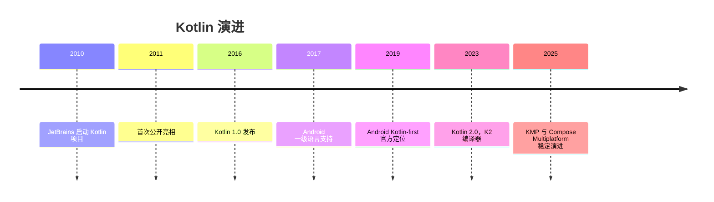
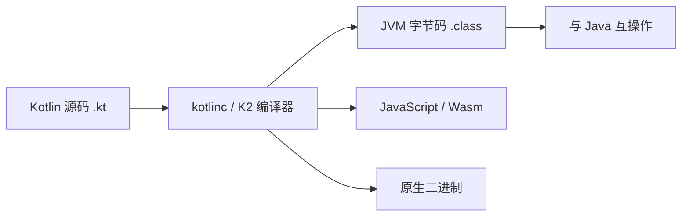

## 前置知识

- [Kotlin 概述与环境配置](/kotlin/002-KotlinOverviewEnvSetup)：建议先完成前一篇的学习

## 学习目标

- 掌握「1. 历史动机与发展脉络」的核心机制、典型用法与常见陷阱
- 掌握「2. 形式化定义」的核心机制、典型用法与常见陷阱
- 掌握「3. 理论推导与原理解析」的核心机制、典型用法与常见陷阱
- 掌握「4. 代码示例（带详尽注释）」的核心机制、典型用法与常见陷阱
- 掌握「5. 对比分析」的核心机制、典型用法与常见陷阱


## 1. 历史动机与发展脉络

Kotlin 由 JetBrains 于 2010 年开始研发，2011 年公开，2016 年 2 月发布 1.0。设计动机是解决 Java 的长期痛点：冗长（样板代码）、空指针风险、类型推断不足、函数式支持薄弱。Kotlin 与 Java 100% 互操作，编译器（kotlinc）输出 JVM 字节码，因此可以在既有 Java 项目中渐进采用。

2017 年 Google 宣布 Kotlin 成为 Android 一级开发语言；2019 年 Android 官方推荐 Kotlin-first；2023 年 Kotlin 2.0 发布，引入 K2 编译器（基于 FIR 前端），编译速度与内存占用显著改善。Kotlin Multiplatform（KMP）支持 JVM、Android、iOS、WebAssembly 与原生目标，JetBrains 与 Google 在 Compose Multiplatform 上持续推进跨平台 UI 方案。

Kotlin 版本节奏：1.x 时代每半年左右发布小版本；2.0 起保持每年大版本演进（2.1、2.2 等），K2 编译器默认启用，`kotlinx` 生态（coroutines、serialization、datetime）同步发展。



## 2. 形式化定义

### 2.1 变量声明

`val 名称: 类型 = 值`：只读引用，初始化后不可重新赋值（但引用的对象内部状态可变）；

`var 名称: 类型 = 值`：可变引用，可重新赋值；

类型推断：`val count = 42` 推断为 `Int`；`val name = "Kotlin"` 推断为 `String`。

顶层声明：Kotlin 允许在文件顶层声明变量与函数，无需类包装。

### 2.2 基本类型

数值：`Byte`、`Short`、`Int`、`Long`（后缀 L）、`Float`（后缀 F）、`Double`；

布尔：`Boolean`（`true`/`false`）；

字符：`Char`（单引号）；

字符串：`String`（双引号），不可变；

无符号类型（实验性到稳定）：`UInt`、`ULong` 等；

Kotlin 类型都是对象，但数值类型在 JVM 上尽量装箱/拆箱优化（`Int` 映射 `int` 或 `Integer`）。

### 2.3 字符串模板

`"$variable"` 直接插入变量；`"${expression}"` 插入表达式；`$` 本身用 `\$` 转义。模板在编译期展开为字符串拼接或 `StringBuilder`，支持任意表达式（包括函数调用与属性访问）。

### 2.4 控制流

`if`：可作表达式，返回分支值；

`when`：替代 Java 的 switch，支持任意条件（常量、类型检查、区间、表达式、无参数分支），也可作表达式；

`for`：迭代任何提供迭代器的对象，常用 `for (x in 0..10)`；

`while`/`do-while`：与 Java 语义一致；

`break`/`continue` 与标签（label）配合支持跳出嵌套循环。

### 2.5 区间

`a..b`：闭区间（包含 b）；

`a until b`：半开区间（不含 b）；

`a downTo b`：递减区间；

`step n`：步长；

区间支持 `in` 运算符检查成员关系。

### 2.6 类型检查与转换

`is`：类型检查，智能转换（smart cast）在不可变上下文中自动生效；

`as`：强制转换；`as?`：安全转换，失败返回 null；

可空类型：`Type?`；安全调用 `?.`；Elvis `?:`；非空断言 `!!`。



## 3. 理论推导与原理解析

### 3.1 空安全类型系统

Kotlin 把可空性编码进类型系统：`String` 与 `String?` 是不同静态类型。编译器在调用链上强制处理空值：`?.` 短路返回 null，`?:` 提供默认值，`!!` 显式声明“我确定非空”（失败抛 `NullPointerException`）。推导：若函数参数类型为 `String`，任何调用点都不可能传入 null（编译期拒绝），从而消灭了一整类运行时异常。

智能转换的成立条件：目标变量在检查点后未被修改且不是开放属性（open member），编译器才允许自动转换类型。`var` 在并发场景可能被修改，因此智能转换受限。

### 3.2 val 与不可变性

`val` 约束的是“引用”，不是“对象”。`val list = mutableListOf<Int>()` 后可以 `list.add(1)`，因为对象本身可变。Kotlin 标准库刻意区分可变与只读集合接口（`MutableList` vs `List`），用类型系统表达可变性边界。

### 3.3 when 的表达式语义

`when` 作表达式时必须覆盖所有分支（或存在 else），因为表达式的类型是各分支的公共超类型。这保证穷尽性（exhaustiveness），避免 Java switch 遗漏分支的静默行为。

### 3.4 字符串模板的编译展开

字符串模板编译为 `StringBuilder.append` 链或 `String.format` 的等价物，多段拼接的性能优于手工 `+` 链（减少中间字符串对象）。`${}` 内的表达式在求值时若含可空值，字符串结果为 `"null"` 文本（与 Java 拼接一致）。

## 4. 代码示例（带详尽注释）

### 4.1 val 与 var

```kotlin
// 只读引用：初始化后不可重新赋值
val appName: String = "FANDEX"

// 可变引用：可以重新赋值
var retryCount: Int = 0
retryCount += 1

// 类型推断：编译器根据初始值推断类型
val version = "1.4.2"
val maxRetries = 3

// 顶层声明：无需类包装，可直接访问
val TOP_LEVEL_CONST = "常量"
```

讲解：优先使用 `val`，只有确实需要重新赋值时才用 `var`。这不仅是风格，更是把“可变性”最小化的工程原则。顶层声明简化了小工具代码，是 Kotlin 与 Java 的重要差异。

### 4.2 基本类型与显式转换

```kotlin
val anInt: Int = 100
val aLong: Long = 100L          // 后缀 L 表示 Long
val aFloat: Float = 1.5f        // 后缀 f 表示 Float
val aDouble: Double = 1.5       // 默认浮点字面量是 Double
val aBoolean: Boolean = true
val aChar: Char = 'A'

// 数值类型不隐式转换：必须显式调用 toXxx
val converted: Long = anInt.toLong()
val fromString: Int = "42".toInt()
```

讲解：Kotlin 禁止数值类型隐式拓宽（`Int` 不能直接赋给 `Long`），避免 Java 中 `int` 与 `long` 混用的隐蔽溢出。显式转换让意图清晰，代价是少量样板。

### 4.3 字符串模板

```kotlin
val user = "Alice"
val score = 95

// 简单变量插入
val greeting = "Hello, $user!"

// 表达式插入：需要运算或方法调用时使用花括号
val report = "成绩：${score} 分，等级：${if (score >= 90) "A" else "B"}"

// 美元符号转义
val price = "单价：\$10"
```

讲解：字符串模板是 Kotlin 最常用的特性之一。`${}` 内可以是任意表达式，甚至嵌套 `if`。转义 `\$` 避免与模板语法冲突。

### 4.4 if 与 when 表达式

```kotlin
// if 作为表达式：直接赋值
val max = if (a > b) a else b

// when 作为表达式：多分支匹配
val grade = when (score) {
    in 90..100 -> "优秀"
    in 80..89 -> "良好"
    in 60..79 -> "及格"
    else -> "不及格"
}

// when 无参数形式：替代 if-else 链
val result = when {
    score >= 90 -> "优秀"
    score >= 60 -> "通过"
    else -> "未通过"
}
```

讲解：`when` 的 `in` 分支使用区间匹配；作为表达式时必须穷尽（有 else）。无参数 `when` 适合多个互斥条件判断，可读性优于嵌套 if。

### 4.5 循环与区间

```kotlin
// 闭区间：0 到 5 包含 5
for (i in 0..5) {
    println(i)
}

// 半开区间：0 到 4
for (i in 0 until 5) {
    println(i)
}

// 递减 + 步长
for (i in 10 downTo 1 step 2) {
    println(i)
}

// 遍历集合
val names = listOf("Kotlin", "Java", "Go")
for (name in names) {
    println(name)
}

// 带索引遍历
for ((index, name) in names.withIndex()) {
    println("$index: $name")
}
```

讲解：区间与 `for` 的组合覆盖绝大多数迭代需求。`withIndex()` 解构出索引与元素，避免手动维护计数器。`downTo` 与 `step` 让倒序步进循环声明式化。

### 4.6 类型检查与安全转换

```kotlin
fun describe(value: Any): String {
    // is 检查 + 智能转换：分支内 value 自动变为 String
    if (value is String) {
        return "字符串，长度 ${value.length}"
    }
    // 智能转换对不可变局部变量有效
    if (value is Int) {
        return "整数 ${value + 1}"
    }
    return "未知类型"
}

// 安全转换：失败返回 null 而不是抛异常
val number: Int? = "123".toIntOrNull()

// as? 安全强转
val text: String? = value as? String
```

讲解：`is` 配合智能转换是 Kotlin 类型系统的招牌能力；`toIntOrNull` 与 `as?` 让“可能失败”的转换返回可空结果，由调用方处理，而不是抛异常。

### 4.7 空安全操作符

```kotlin
data class User(val name: String?, val email: String?)

fun format(user: User?): String {
    // 安全调用：user 为 null 时整链为 null
    val upperName = user?.name?.uppercase()

    // Elvis：为 null 时使用默认值
    val displayName = user?.name ?: "匿名用户"

    // 链式组合：安全调用 + Elvis 提供完整默认
    val email = user?.email ?: "未提供邮箱"

    // !! 非空断言：明确表示不可能为 null（滥用会重新引入 NPE）
    // val dangerous = user!!.name

    return "$displayName（$email）"
}

// 调用：传入 null 也不会崩溃
println(format(null))
println(format(User(null, "alice@example.com")))
```

讲解：`?.`、`?:` 组合是 Kotlin 空安全的标准模式。`!!` 是逃生舱，仅用于“与 Java 互操作且确定非空”的场景；业务代码中应尽量避免。

### 4.8 包与导入

```kotlin
package com.fandex.tools

// 导入单个声明
import kotlin.math.sqrt

// 通配导入
import java.time.*

// 别名：解决命名冲突
import java.util.Date as JavaDate
```

讲解：Kotlin 的包与导入机制与 Java 类似，但增加 `as` 别名解决冲突，支持顶层声明直接导入。目录结构与包名不必强一致（但建议一致以利维护）。

## 5. 对比分析

### 5.1 Kotlin 与 Java 基础语法对比

| 维度 | Kotlin | Java |
| --- | --- | --- |
| 变量 | val/var + 推断 | 类型前置，无推断（局部可 var） |
| 空安全 | 类型系统内置 | 注解可选，运行时检查 |
| 字符串模板 | 原生 | 无（需拼接或 format） |
| switch | when 表达式 | switch 语句（14+ 有表达式） |
| 区间 | .. until downTo step | 无内置 |
| 智能转换 | 是 | 无（Java 16 模式匹配部分实现） |

### 5.2 val 与 Java final

`val` 等价于 Java `final` 局部变量；但 Kotlin 的只读集合接口（`List`）是更深层的不可变约束，Java 的 `Collections.unmodifiableList` 是运行时包装。

### 5.3 可空类型与 Optional

Java 8 的 `Optional` 是包装类型，有装箱开销且不能用于字段；Kotlin 的可空性是类型系统特性，无运行时开销。在互操作边界（Java 调用 Kotlin），可空性通过 `@Nullable`/`@NotNull` 注解导出。

## 6. 常见陷阱与最佳实践

陷阱一：把 `val` 当作不可变对象。`val` 只约束引用；需要不可变数据时使用 `data class` + 只读集合。

陷阱二：滥用 `!!` 导致 NPE 回潮。最佳实践：用 `?:`、`?.`、`toIntOrNull` 等安全手段；`!!` 只在互操作边界使用。

陷阱三：数值隐式转换的直觉错误。`Int` 与 `Long` 运算必须先显式转换，否则编译失败（这是特性不是 bug）。

陷阱四：字符串模板中 `$` 未转义。需要输出美元符号时写 `\$`。

陷阱五：`when` 表达式缺少 else 分支导致编译错误。作为表达式时必须穷尽。

陷阱六：智能转换在 `var` 或并发修改下失效。改用局部 `val` 副本或显式转换。

陷阱七：把 Kotlin 源码放在错误目录或包名不匹配，IDE 能纠正但命令行构建失败。保持目录与包一致。

最佳实践：默认 `val`；空安全用 `?.`/`?:`；`when` 优先于 if-else 链；区间循环优先于索引循环；每个函数保持小且纯。

## 7. 工程实践

### 7.1 项目结构

```text
src/main/kotlin/
  com/fandex/app/
    Main.kt          # 入口：main 函数
    model/           # 数据类
    service/         # 业务逻辑
    util/            # 扩展函数与工具
src/test/kotlin/
  com/fandex/app/
    MainTest.kt      # 单元测试
```

讲解：Kotlin 项目结构与 Java 类似，但顶层函数减少了“工具类”的样板。测试目录镜像主目录，使用 kotlin.test 或 JUnit 5。

### 7.2 构建工具

```kotlin
// build.gradle.kts：Kotlin DSL
plugins {
    kotlin("jvm") version "2.1.20"
    application
}

repositories {
    mavenCentral()
}

dependencies {
    testImplementation(kotlin("test"))
}

application {
    mainClass.set("com.fandex.app.MainKt")
}
```

讲解：Gradle Kotlin DSL 是 Kotlin 项目的主流构建方式，构建脚本本身也是 Kotlin 代码，获得类型检查与 IDE 补全。`mainClass` 指向 `MainKt`（顶层 main 函数所在文件的 JVM 类名）。

### 7.3 与 Java 互操作

```kotlin
// 调用 Java 代码：直接使用
val list = java.util.ArrayList<String>()
list.add("Kotlin")

// Java 平台类型（String!）需要自行决定可空处理
val maybeNull: String? = javaMethodMayReturnNull()
```

讲解：Kotlin 可以无缝调用 Java API；Java 返回的类型是“平台类型”，编译器不强制可空检查，需要开发者根据上下文处理。

## 8. 案例研究：学生成绩统计工具

需求：读取成绩列表，计算平均分、最高分、等级分布，并以表格形式输出。用基础语法完整实现：

```kotlin
data class Student(val name: String, val score: Int)

fun main() {
    val students = listOf(
        Student("Alice", 92),
        Student("Bob", 78),
        Student("Carol", 85),
        Student("Dave", 59)
    )

    // 平均分：sum 与 count 组合
    val average = students.map { it.score }.average()
    println("平均分：%.1f".format(average))

    // 最高分与姓名
    val top = students.maxByOrNull { it.score }
    println("最高分：${top?.name}（${top?.score}）")

    // 等级分布：groupBy + 区间判断
    val byGrade = students.groupBy { student ->
        when (student.score) {
            in 90..100 -> "优秀"
            in 80..89 -> "良好"
            in 60..79 -> "及格"
            else -> "不及格"
        }
    }

    // 输出表格
    byGrade.forEach { (grade, list) ->
        println("$grade：${list.size} 人 - ${list.joinToString { it.name }}")
    }
}
```

讲解：该案例综合使用 `data class`、集合操作（`map`、`maxByOrNull`、`groupBy`）、`when` 表达式、字符串模板与 `?.` 空安全。输出：

平均分：78.5；最高分：Alice（92）；优秀：1 人 - Alice；良好：1 人 - Carol；及格：1 人 - Bob；不及格：1 人 - Dave。

## 9. 知识要点总结与深入讲解

Kotlin 基础语法的设计哲学可以概括为“表达力优先、安全内建”：val/var 表达可变性意图，空安全表达失败可能，when/区间/模板减少样板。每学一个特性，都应与 Java 对照理解“解决的是什么痛点”。

空安全的三个操作符是递进关系：`?.` 传播空、`?:` 提供默认、`!!` 断言非空。工程上 `!!` 越少越好，互操作边界之外几乎可以消除 NPE。

类型推断不是类型弱化：Kotlin 仍是强静态类型语言，推断发生在编译期。理解了这一点，就不会误以为 `val x = 1` 是动态类型。

### 1. 变量声明

Kotlin 提供两种变量声明方式：`val`（只读）和 `var`（可变）。

#### 1.1 val（只读变量）

```kotlin
val name: String = "Kotlin"  // 显式类型
val version = 2.2            // 类型推断为 Double
val year = 2011              // 类型推断为 Int

// name = "Java"  // 编译错误：Val cannot be reassigned
```

> **最佳实践**：优先使用 `val`，仅在确实需要修改变量时才使用 `var`。这使代码更安全、更易推理。

#### 1.2 var（可变变量）

```kotlin
var count: Int = 0
count = 1           // OK
count += 10         // OK

var message = "Hello"
message = "World"   // OK，类型必须一致
// message = 42     // 编译错误：Type mismatch
```

#### 1.3 延迟初始化

```kotlin
// lateinit — 用于 var，延迟初始化引用类型
lateinit var service: UserService

fun setup() {
    service = UserService()  // 在使用前初始化
}

// by lazy — 用于 val，首次访问时初始化
val heavyObject: ExpensiveClass by lazy {
    println("Initializing...")
    ExpensiveClass()
}
```

#### 1.4 常量

```kotlin
// 编译期常量（顶层或伴生对象中）
const val MAX_SIZE = 100
const val APP_NAME = "FANDEX"

// 运行时常量
val runtimeConstant = computeValue()
```

### 1. 基本类型

与 Java 不同，Kotlin 中一切皆对象，基本类型在可能时编译为 Java 原始类型。

#### 1.1 数值类型

| 类型     | 位数 | 最小值   | 最大值   |
| -------- | ---- | -------- | -------- |
| `Byte`   | 8    | -128     | 127      |
| `Short`  | 16   | -32768   | 32767    |
| `Int`    | 32   | -2³¹     | 2³¹-1    |
| `Long`   | 64   | -2⁶³     | 2⁶³-1    |
| `Float`  | 32   | IEEE 754 | IEEE 754 |
| `Double` | 64   | IEEE 754 | IEEE 754 |

```kotlin
val intVal = 42              // Int
val longVal = 42L            // Long
val doubleVal = 3.14         // Double
val floatVal = 3.14f         // Float
val hexVal = 0xFF            // Int (十六进制)
val binaryVal = 0b1010       // Int (二进制)
val underscored = 1_000_000  // Int (下划线分隔，提高可读性)

// 数值转换 — Kotlin 不支持隐式转换
val intVal2: Int = 100
val longVal2: Long = intVal2.toLong()   // 显式转换
val doubleVal2: Double = intVal2.toDouble()
```

#### 1.2 布尔类型

```kotlin
val isActive: Boolean = true
val isComplete = false

// 惰性逻辑运算
val result = isActive && expensiveCheck()  // 短路求值
```

#### 1.3 字符与字符串

```kotlin
// Char — 用单引号
val letter: Char = 'A'
val unicode: Char = '\u0041'  // 'A'

// String — 用双引号
val text: String = "Hello, Kotlin"

// 原始字符串（三引号）— 保留格式
val rawText = """
    |Hello,
    |Kotlin!
""".trimMargin()  // trimMargin 去除 | 前缀

val rawText2 = """
    Hello,
    Kotlin!
""".trimIndent()  // 去除公共缩进
```

#### 1.4 数组

```kotlin
// 创建数组
val numbers = arrayOf(1, 2, 3, 4, 5)           // Array<Int>
val strings = arrayOf("a", "b", "c")            // Array<String>
val mixed = arrayOf(1, "two", 3.0)              // Array<Any>

// 原始类型数组（无装箱开销）
val intArray = intArrayOf(1, 2, 3)              // IntArray
val byteArray = byteArrayOf(1, 2, 3)            // ByteArray
val longArray = longArrayOf(1L, 2L, 3L)         // LongArray

// 构造函数创建
val squares = Array(5) { i -> i * i }           // [0, 1, 4, 9, 16]
val zeros = IntArray(5)                          // [0, 0, 0, 0, 0]
val ones = IntArray(5) { 1 }                    // [1, 1, 1, 1, 1]
```

### 2. 字符串模板

Kotlin 支持字符串模板，比 Java 的字符串拼接更简洁高效：

```kotlin
val name = "Kotlin"
val version = 2.2

// 简单模板
println("Language: $name")                    // Language: Kotlin

// 表达式模板
println("Version: ${version + 0.1}")          // Version: 2.3

// 嵌套表达式
val list = listOf("a", "b", "c")
println("Size: ${list.size}, First: ${list[0]}")  // Size: 3, First: a

// 在原始字符串中使用
val json = """
    {
        "name": "$name",
        "version": $version
    }
""".trimIndent()
```

> **注意**：如果需要在字符串中使用 `$` 字面量，需要转义：`${'$'}` 或 `\$`。

### 3. 包与导入

#### 3.1 包声明

```kotlin
package com.example.kotlinbasics

// 文件中的所有声明都属于此包
class MyClass
fun topLevelFunction() = "Hello"
```

#### 3.2 导入

```kotlin
// 默认导入（无需显式声明）
// kotlin.*、kotlin.annotation.*、kotlin.collections.* 等

// 显式导入
import com.example.utils.Logger
import com.example.utils.formatDate

// 导入并重命名（解决冲突）
import com.example.utils.formatDate as formatDateUtil
import com.other.utils.formatDate as formatDateOther

// 导入整个包
import com.example.utils.*

// 导入伴生对象成员
import com.example.Config.DEFAULT_TIMEOUT
```

### 4. 控制流

#### 4.1 if 表达式

Kotlin 中 `if` 是表达式，有返回值：

```kotlin
// 作为表达式
val max = if (a > b) a else b

// 多行 if 表达式
val result = if (score >= 90) {
    println("Excellent")
    "A"
} else if (score >= 80) {
    println("Good")
    "B"
} else {
    println("Keep going")
    "C"
}
```

#### 4.2 when 表达式

`when` 是 Kotlin 中强大的模式匹配工具，替代 Java 的 `switch`：

```kotlin
// 基本 when
when (x) {
    1 -> println("One")
    2, 3 -> println("Two or Three")
    in 4..10 -> println("Four to Ten")
    !in 11..20 -> println("Not in 11-20")
    is String -> println("It's a String")
    else -> println("Unknown")
}

// when 作为表达式
val description = when (x) {
    0 -> "Zero"
    1, 2, 3 -> "Small"
    in 4..100 -> "Medium"
    else -> "Large"
}

// 无参 when（替代 if-else 链）
when {
    x > 0 -> println("Positive")
    x < 0 -> println("Negative")
    else -> println("Zero")
}

// 捕获 when 主体中的变量
fun process(input: Any) = when (input) {
    is Int -> "Integer: ${input * 2}"    // input smart-cast to Int
    is String -> "String of length ${input.length}"
    is List<*> -> "List with ${input.size} elements"
    else -> "Unknown type"
}
```

#### 4.3 for 循环

```kotlin
// 遍历区间
for (i in 1..5) print("$i ")          // 1 2 3 4 5

// 遍历区间（排除末尾）
for (i in 1 until 5) print("$i ")     // 1 2 3 4

// 递减遍历
for (i in 5 downTo 1) print("$i ")    // 5 4 3 2 1

// 带步长
for (i in 1..10 step 2) print("$i ")  // 1 3 5 7 9

// 遍历集合
val items = listOf("apple", "banana", "cherry")
for (item in items) println(item)

// 带索引遍历
for ((index, value) in items.withIndex()) {
    println("$index: $value")
}

// 遍历 Map
val map = mapOf("a" to 1, "b" to 2, "c" to 3)
for ((key, value) in map) {
    println("$key = $value")
}
```

#### 4.4 while 与 do-while

```kotlin
var i = 0
while (i < 5) {
    println(i)
    i++
}

var input: String
do {
    input = readLine() ?: ""
} while (input.isEmpty())
```

#### 4.5 循环控制

```kotlin
// break 和 continue
for (i in 1..10) {
    if (i == 3) continue  // 跳过 3
    if (i == 7) break     // 到 7 停止
    println(i)
}

// 标签循环
loop@ for (i in 1..5) {
    for (j in 1..5) {
        if (i * j == 6) break@loop  // 跳出外层循环
        println("$i * $j = ${i * j}")
    }
}
```

### 5. 区间与数列

#### 5.1 区间（Range）

```kotlin
// 闭区间
val range1 = 1..10        // IntRange: 1, 2, ..., 10
val range2 = 'a'..'z'     // CharRange: a, b, ..., z

// 半开区间
val range3 = 1 until 10   // IntRange: 1, 2, ..., 9

// 递减区间
val range4 = 10 downTo 1  // IntRange: 10, 9, ..., 1

// 带步长
val range5 = 1..10 step 2  // 1, 3, 5, 7, 9
val range6 = 10 downTo 1 step 3  // 10, 7, 4, 1
```

#### 5.2 区间操作

```kotlin
val range = 1..100

// 包含检查
3 in range          // true
200 in range        // false
50 !in range        // false

// 区间判断
val ch = 'k'
ch in 'a'..'z'      // true
ch in 'A'..'Z'      // false

// 实用函数
(1..10).random()    // 随机数
(1..10).first       // 1
(1..10).last        // 10
(1..10).step(3)     // 1, 4, 7, 10
```

#### 5.3 数列（Progression）

区间本质上是数列的实现，数列定义了 `first`、`last` 和 `step`：

```kotlin
// 自定义步长的数列
val progression = IntProgression.fromClosedRange(1, 10, 3)
// 1, 4, 7, 10

// 数列转列表
val list = (1..10 step 2).toList()  // [1, 3, 5, 7, 9]
```

### 6. 类型检查与转换

```kotlin
// is 和 !is 操作符
if (obj is String) {
    // obj 在此分支自动智能转换为 String
    println(obj.length)
}

// as 和 as? 类型转换
val x: Any = "Hello"
val s1: String = x as String       // 不安全转换，可能抛出 ClassCastException
val s2: String? = x as? String     // 安全转换，失败返回 null
val s3: Int? = x as? Int           // null（转换失败）
```

> **智能转换**是 Kotlin 的核心特性之一。编译器在条件分支中自动进行类型转换，无需手动强转，既安全又简洁。
### 变量声明

**基本写法：val 声明显式类型只读变量**
`val <name>: <Type> = <value>`
```kotlin
// 声明显式类型的只读变量
val name: String = "Kotlin";
```

**基本写法：val 类型推断只读变量**
`val <name> = <value>`
```kotlin
// 类型推断为 Double
val version = 2.2;
// 类型推断为 Int
val year = 2011;
```

**基本写法：var 声明显式类型可变变量**
`var <name>: <Type> = <value>`
```kotlin
// 声明可变变量并修改
var count: Int = 0;
count = 1;
count += 10;
```

**基本写法：var 类型推断可变变量**
`var <name> = <value>`
```kotlin
// 声明可变字符串变量
var message = "Hello";
message = "World";
```

**基本写法：lateinit 延迟初始化可变变量**
`lateinit var <name>: <Type>`
```kotlin
// 用于 var，延迟初始化引用类型
lateinit var service: UserService;
fun setup() {
    service = UserService();
}
```

**基本写法：by lazy 首次访问时初始化只读变量**
`val <name>: <Type> by lazy { <init> }`
```kotlin
// 用于 val，首次访问时初始化
val heavyObject: ExpensiveClass by lazy {
    println("Initializing...");
    ExpensiveClass();
}
```

**基本写法：const val 编译期常量**
`const val <name> = <value>`
```kotlin
// 编译期常量（顶层或伴生对象中）
const val MAX_SIZE = 100;
```

**单行写法：const val 多常量声明**
`const val <name1> = <value1>; const val <name2> = <value2>`
```kotlin
// 单行声明多个编译期常量
const val APP_NAME = "FANDEX"; const val VERSION = "1.0";
```

---

### 基本类型

**基本写法：Int 整数字面量**
`val <name> = <int>`
```kotlin
// Int 类型字面量
val intVal = 42;
```

**基本写法：Long 长整数字面量**
`val <name> = <int>L`
```kotlin
// Long 类型字面量（后缀 L）
val longVal = 42L;
```

**基本写法：Double 双精度浮点字面量**
`val <name> = <float>`
```kotlin
// Double 类型字面量
val doubleVal = 3.14;
```

**基本写法：Float 单精度浮点字面量**
`val <name> = <float>f`
```kotlin
// Float 类型字面量（后缀 f）
val floatVal = 3.14f;
```

**基本写法：十六进制字面量**
`val <name> = 0x<hex>`
```kotlin
// 十六进制 Int 字面量
val hexVal = 0xFF;
```

**基本写法：二进制字面量**
`val <name> = 0b<binary>`
```kotlin
// 二进制 Int 字面量
val binaryVal = 0b1010;
```

**基本写法：下划线分隔字面量**
`val <name> = <int_with_underscores>`
```kotlin
// 下划线提升可读性
val underscored = 1_000_000;
```

**基本写法：数值显式转换**
`<value>.to<Type>()`
```kotlin
// Kotlin 不支持隐式转换，必须显式调用转换函数
val intVal: Int = 100;
val longVal: Long = intVal.toLong();
```

**基本写法：Boolean 布尔类型**
`val <name>: Boolean = <bool>`
```kotlin
// 声明布尔变量
val isActive: Boolean = true;
```

**基本写法：短路求值**
`val <name> = <bool> && <expr>`
```kotlin
// 短路求值，expensiveCheck 在 isActive 为 false 时不执行
val result = isActive && expensiveCheck();
```

**基本写法：Char 字符类型**
`val <name>: Char = '<char>'`
```kotlin
// Char 用单引号
val letter: Char = 'A';
```

**基本写法：Char Unicode 字符**
`val <name>: Char = '\u<hex>'`
```kotlin
// Unicode 字符
val unicode: Char = '\u0041';
```

**基本写法：String 字符串类型**
`val <name>: String = "<text>"`
```kotlin
// String 用双引号
val text: String = "Hello, Kotlin";
```

**单行写法：trimMargin 原始字符串**
`"""<content>""".trimMargin()`
```kotlin
// trimMargin 去除 | 前缀
val rawText = """
    |Hello,
    |Kotlin!
""".trimMargin();
```

**单行写法：trimIndent 原始字符串**
`"""<content>""".trimIndent()`
```kotlin
// trimIndent 去除公共缩进
val rawText2 = """
    Hello,
    Kotlin!
""".trimIndent();
```

**单行写法：arrayOf 创建对象数组**
`arrayOf(<elements>)`
```kotlin
// 对象数组
val numbers = arrayOf(1, 2, 3, 4, 5);
```

**单行写法：intArrayOf 创建原始类型数组**
`<type>ArrayOf(<elements>)`
```kotlin
// 原始类型数组（无装箱开销）
val intArray = intArrayOf(1, 2, 3);
```

**换行写法：Array 构造函数创建数组**
`Array(<size>) { <index> -> <expr> }`
```kotlin
// 构造函数创建数组，按索引计算元素
val squares = Array(5) { i -> i * i };
```

**换行写法：IntArray 构造函数创建数组**
`<Type>Array(<size>) { <init> }`
```kotlin
// 构造函数创建原始类型数组并初始化
val ones = IntArray(5) { 1 };
```

---

### 字符串模板

**基本写法：简单变量模板**
`"...$<name>..."`
```kotlin
// 简单模板：直接插入变量
val name = "Kotlin";
println("Language: $name");
```

**基本写法：表达式模板**
`"...${<expression>}..."`
```kotlin
// 表达式模板：插入计算结果
val version = 2.2;
println("Version: ${version + 0.1}");
```

**基本写法：嵌套表达式模板**
`"...${<obj>.<prop>}..."`
```kotlin
// 嵌套表达式：访问属性
val list = listOf("a", "b", "c");
println("Size: ${list.size}, First: ${list[0]}");
```

**单行写法：原始字符串中使用模板**
`"""...$<name>..."""`
```kotlin
// 原始字符串中使用模板
val name = "Kotlin";
val json = """
    {
        "name": "$name"
    }
""".trimIndent();
```

---

### 包与导入

**基本写法：包声明**
`package <package.name>`
```kotlin
// 声明包名
package com.example.kotlinbasics;
```

**基本写法：显式导入**
`import <package>.<name>`
```kotlin
// 显式导入单个类或函数
import com.example.utils.Logger;
```

**基本写法：导入并重命名**
`import <package>.<name> as <alias>`
```kotlin
// 导入并重命名解决冲突
import com.example.utils.formatDate as formatDateUtil;
```

**基本写法：导入整个包**
`import <package>.*`
```kotlin
// 导入整个包的所有内容
import com.example.utils.*;
```

**基本写法：导入伴生对象成员**
`import <package>.<Class>.<member>`
```kotlin
// 导入伴生对象成员
import com.example.Config.DEFAULT_TIMEOUT;
```

---

### 控制流

**基本写法：if 表达式**
`val <name> = if (<cond>) <exprA> else <exprB>`
```kotlin
// if 作为表达式赋值
val max = if (a > b) a else b;
```

**换行写法：多分支 if 表达式**
`val <name> = if (<cond>) { <body> } else if (<cond>) { <body> } else { <body> }`
```kotlin
// 多行 if 表达式
val result = if (score >= 90) {
    println("Excellent");
    "A";
} else if (score >= 80) {
    println("Good");
    "B";
} else {
    println("Keep going");
    "C";
}
```

**基本写法：when 表达式**
`when (<subject>) { <branches> }`
```kotlin
// 基本 when 分支匹配
when (x) {
    1 -> println("One");
    2, 3 -> println("Two or Three");
    else -> println("Unknown");
}
```

**基本写法：when 区间匹配**
`when (<subject>) { in <range> -> <expr> }`
```kotlin
// 区间匹配
when (x) {
    in 4..10 -> println("Four to Ten");
    !in 11..20 -> println("Not in 11-20");
}
```

**基本写法：when 类型匹配**
`when (<subject>) { is <Type> -> <expr> }`
```kotlin
// 类型匹配
when (x) {
    is String -> println("It's a String");
}
```

**基本写法：when 作为表达式赋值**
`val <name> = when (<subject>) { <branches> }`
```kotlin
// when 表达式返回值
val description = when (x) {
    0 -> "Zero";
    1, 2, 3 -> "Small";
    in 4..100 -> "Medium";
    else -> "Large";
}
```

**基本写法：无参 when**
`when { <branches> }`
```kotlin
// 无参 when 替代 if-else 链
when {
    x > 0 -> println("Positive");
    x < 0 -> println("Negative");
    else -> println("Zero");
}
```

**基本写法：when 捕获变量智能转换**
`fun <name>(<param>: Any) = when (<param>) { is <Type> -> <expr> }`
```kotlin
// when 中 is 检查后智能转换
fun process(input: Any) = when (input) {
    is Int -> "Integer: ${input * 2}";
    is String -> "String of length ${input.length}";
    else -> "Unknown type";
}
```

**基本写法：for 遍历闭区间**
`for (<item> in <start>..<end>) { <body> }`
```kotlin
// 遍历闭区间
for (i in 1..5) print("$i ");
```

**基本写法：for 遍历半开区间**
`for (<item> in <start> until <end>) { <body> }`
```kotlin
// 遍历半开区间（排除末尾）
for (i in 1 until 5) print("$i ");
```

**基本写法：for 递减遍历**
`for (<item> in <start> downTo <end>) { <body> }`
```kotlin
// 递减遍历
for (i in 5 downTo 1) print("$i ");
```

**基本写法：for 带步长遍历**
`for (<item> in <range> step <n>) { <body> }`
```kotlin
// 带步长遍历
for (i in 1..10 step 2) print("$i ");
```

**基本写法：for 遍历集合**
`for (<item> in <iterable>) { <body> }`
```kotlin
// 遍历集合元素
val items = listOf("apple", "banana", "cherry");
for (item in items) println(item);
```

**基本写法：带索引遍历**
`for ((<index>, <value>) in <collection>.withIndex()) { <body> }`
```kotlin
// 带索引遍历集合
for ((index, value) in items.withIndex()) {
    println("$index: $value");
}
```

**基本写法：遍历 Map**
`for ((<key>, <value>) in <map>) { <body> }`
```kotlin
// 遍历 Map 键值对
val map = mapOf("a" to 1, "b" to 2);
for ((key, value) in map) {
    println("$key = $value");
}
```

**基本写法：while 循环**
`while (<cond>) { <body> }`
```kotlin
// while 循环
var i = 0;
while (i < 5) {
    println(i);
    i++;
}
```

**基本写法：do-while 循环**
`do { <body> } while (<cond>)`
```kotlin
// do-while 循环（至少执行一次）
var input: String;
do {
    input = readLine() ?: "";
} while (input.isEmpty());
```

**基本写法：break 跳出循环**
`break`
```kotlin
// break 跳出循环
for (i in 1..10) {
    if (i == 7) break;
    println(i);
}
```

**基本写法：continue 跳过本次**
`continue`
```kotlin
// continue 跳过当前迭代
for (i in 1..10) {
    if (i == 3) continue;
    println(i);
}
```

**基本写法：标签 break**
`break@<label>`
```kotlin
// 标签 break 跳出外层循环
loop@ for (i in 1..5) {
    for (j in 1..5) {
        if (i * j == 6) break@loop;
        println("$i * $j = ${i * j}");
    }
}
```

---

### 区间与数列

**基本写法：闭区间**
`<start>..<end>`
```kotlin
// 闭区间：包含 end
val range1 = 1..10;
```

**基本写法：字符区间**
`'<char>'..'<char>'`
```kotlin
// 字符区间
val range2 = 'a'..'z';
```

**基本写法：半开区间**
`<start> until <end>`
```kotlin
// 半开区间：不包含 end
val range3 = 1 until 10;
```

**基本写法：递减区间**
`<start> downTo <end>`
```kotlin
// 递减区间
val range4 = 10 downTo 1;
```

**基本写法：带步长区间**
`<range> step <n>`
```kotlin
// 带步长的区间
val range5 = 1..10 step 2;
```

**基本写法：递减带步长区间**
`<start> downTo <end> step <n>`
```kotlin
// 递减且带步长
val range6 = 10 downTo 1 step 3;
```

**基本写法：in 包含检查**
`<value> in <range>`
```kotlin
// 检查值是否在区间内
val range = 1..100;
3 in range;
```

**基本写法：!in 不包含检查**
`<value> !in <range>`
```kotlin
// 检查值是否不在区间内
50 !in range;
```

**基本写法：区间随机数**
`<range>.random()`
```kotlin
// 从区间获取随机数
(1..10).random();
```

**基本写法：区间首尾属性**
`<range>.[first|last]`
```kotlin
// 获取区间首尾元素
(1..10).first;
(1..10).last;
```

**基本写法：数列自定义步长**
`IntProgression.fromClosedRange(<start>, <end>, <step>)`
```kotlin
// 自定义步长的数列
val progression = IntProgression.fromClosedRange(1, 10, 3);
```

**基本写法：区间转列表**
`<range>.toList()`
```kotlin
// 区间转换为列表
val list = (1..10 step 2).toList();
```

---

### 类型检查与转换

**基本写法：is 类型检查**
`if (<obj> is <Type>) { <body> }`
```kotlin
// is 检查后智能转换
if (obj is String) {
    println(obj.length);
}
```

**基本写法：!is 类型检查**
`if (<obj> !is <Type>) { <body> }`
```kotlin
// !is 检查类型不匹配
if (obj !is String) {
    println("Not a String");
}
```

**基本写法：as 不安全类型转换**
`<obj> as <Type>`
```kotlin
// 不安全转换，可能抛出 ClassCastException
val x: Any = "Hello";
val s1: String = x as String;
```

**基本写法：as? 安全类型转换**
`<obj> as? <Type>`
```kotlin
// 安全转换，失败返回 null
val s2: String? = x as? String;
```

---

### Kotlin 2.x 新特性

**基本写法：Kotlin 2.0 K2 编译器前端**
`// 默认启用 K2 编译器`
```kotlin
// Kotlin 2.0 起默认启用 K2 编译器前端
// 无需额外配置，编译速度与稳定性显著提升
// 旧版本手动启用：在 gradle.properties 中设置 kotlin.language.version=2.0
fun main() {
    // K2 编译器对类型推断、内联函数处理更精确
    val list = listOf(1, 2, 3).map { it * 2 }
    println(list)
}
```

**基本写法：Kotlin 2.1 guard 条件 in when**
`when (<x>) { <条件> && guard -> <语句> }`
```kotlin
// when 分支支持 guard 条件，使用 if 关键字附加布尔守卫
fun classify(x: Any): String = when (x) {
    is Int if x > 0 -> "正整数"
    is Int if x < 0 -> "负整数"
    is Int -> "零"
    is String if x.isNotEmpty() -> "非空字符串"
    else -> "其他"
}
// 调用示例
println(classify(42))       // 正整数
println(classify("hello")) // 非空字符串
```

**基本写法：Kotlin 2.1 多重赋值**
`val (<a>, <b>) = <pair>`
```kotlin
// 多重赋值：解构 Pair/Triple 到多个变量
val pair = "Alice" to 30
val (name, age) = pair
println("$name $age") // Alice 30
// 用于函数返回多值场景
fun userInfo(): Pair<String, Int> = "Bob" to 25
val (n, a) = userInfo()
// 也支持 List 解构
val (first, second) = listOf(10, 20)
```

**基本写法：Kotlin 2.2 context receivers**
`context(<receiver>) fun <name>() { }`
```kotlin
// 上下文接收者：声明函数依赖的接收者上下文
class Logger { fun log(msg: String) { println(msg) } }
class Config { val env = "prod" }
// 函数同时依赖 Logger 和 Config 两个上下文
context(Logger, Config)
fun printEnv() {
    log("当前环境: $env")
}
// 调用时需在对应接收者作用域内
with(Logger()) {
    with(Config()) {
        printEnv()
    }
}
```

**基本写法：Kotlin 2.3 Java 25 互操作增强**
`// Kotlin 2.3 增强 Java 25 互操作`
```kotlin
// Kotlin 2.3 改进与 Java 25 新特性的互操作
// 支持 Java 25 模式匹配、记录类、密封类等特性的更优调用
// Java 25 密封类可在 Kotlin 中直接 when 穷尽匹配
sealed interface JShape permits JCircle, JSquare {}
// Kotlin 中无 else 分支也能穷尽匹配
fun area(s: JShape): Double = when (s) {
    is JCircle -> Math.PI * s.r * s.r
    is JSquare -> s.side * s.side
}
```
