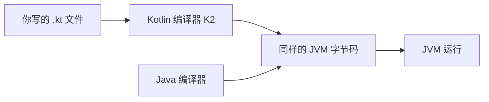

## Kotlin 在技术版图中的位置

Kotlin 是运行在 **JVM 上的现代语言**——与 Java 共用同一个运行平台，但语法更简洁、更安全。两个标志性事实：

- **Android 官方首选语言**：Google 于 2019 年宣布 Android 开发 Kotlin 优先（Kotlin-first），Jetpack 全家桶与新 API 均以 Kotlin 为第一优先级。
- **Spring 官方全面支持**：Spring Framework 自 5.0 起把 Kotlin 列为一等公民，Ktor 则是 Kotlin 世界原生的服务端框架。

Kotlin 由 JetBrains 于 2011 年发布，2016 年发布 1.0 稳定版，2017 年被 Google 宣布为 Android 官方支持语言，2024 年 5 月发布搭载 K2 编译器的 2.0 版本——编译速度最高提升约 2 倍，K2 自此成为默认编译器。

## 与 Java 的关系：同平台、可互操作



Kotlin 与 Java 编译成同一种字节码，**同一个项目里两种语言可以互相调用**——企业可以在存量 Java 代码上逐步引入 Kotlin，按文件、按模块渐进迁移，这是它在业界快速铺开的关键。编译后的 `.class` 文件对 JVM 来说没有区别，Kotlin 类可以被 Java 代码 `new` 出来，Java 类库也可以直接在 Kotlin 中 import。

看一段对比。Java 版：

```java
if (name != null) {
    System.out.println("长度: " + name.length());
} else {
    System.out.println("长度: null");
}
```

Kotlin 版：

```kotlin
fun main() {
    val name: String? = "Kotlin"   // String? 表示"可能为 null"
    println("长度: ${name?.length}")  // 长度: 6

    val empty: String? = null
    println("长度: ${empty?.length}") // 长度: null
}
```

`?.`（安全调用）一行完成"判空再取值"——**空指针是 Java 世界最高频的崩溃来源，Kotlin 直接把"可能为空"做进了类型系统**：`String` 保证永远不为空，`String?` 才允许为空，编译器强制你在使用可空值前处理 null 情况。

## 设计目标：读得懂、写得短、跑得稳

Kotlin 的名字来自圣彼得堡附近的科特林岛，JetBrains 的目标很务实：**一门比 Java 更简洁、更安全，同时 100% 与 Java 互操作的语言**。落到日常编码，是几条可以直接体会的原则：

1. **简洁**：省略分号、类型通常自动推断、`data class` 一行生成 equals/hashCode/toString。
2. **安全**：空安全进类型系统；默认不可变（`val`）与默认 final（类不可随便继承）减少意外。
3. **表达力**：lambda 与高阶函数、扩展函数（不改源码给别人的类"加方法"）、协程（用同步写法做异步）。
4. **工程友好**：与 Java 工具链（Gradle、Maven、IDE）无缝衔接，官方支持编译到 JVM、JS、Native 与 Wasm 多个平台。

## 动手环节：第一次运行

无需安装任何东西——打开浏览器访问 [Kotlin Playground](https://play.kotlinlang.org)，输入：

```kotlin
fun main() {
    val name = "学习者"          // val：不可变变量（优先使用）
    var count = 0                // var：可变变量
    for (i in 1..100) count += i // 1..100 是闭区间

    println("你好，$name")                       // 你好，学习者
    println("1 到 100 的和是 $count")            // 1 到 100 的和是 5050
    println("长度: ${name.length}")              // 长度: 4（字符串模板 + 属性访问）
}
```

点击运行，对照注释确认三行输出。两个语法点先记住：

- `val` 定义不可变变量（优先用它），`var` 定义可变变量。
- `$name` 与 `${...}` 是字符串模板，可以直接把值或表达式嵌进文本。

本地环境安装（IntelliJ IDEA 自带 Kotlin 插件、命令行编译器、Gradle 集成）见 [Kotlin 概述与环境搭建](/kotlin/020-KotlinOverviewEnvSetup)。

## 应用版图：Kotlin 都用在哪

| 领域 | 代表技术 | 现状 |
| ---- | -------- | ---- |
| Android | Jetpack Compose、AndroidX | 官方首选，新 API 以 Kotlin 为主 |
| 服务端 | Spring Boot、Ktor | Spring 一等支持；Ktor 轻量、全协程 |
| 跨平台 | Kotlin Multiplatform、Compose Multiplatform | 1.9.20 起稳定，业务逻辑与 UI 共享 |
| 前端/脚本 | Kotlin/JS、Gradle KTS | Gradle 构建脚本默认 Kotlin DSL |
| 数据与测试 | Exposed、kotest | 与 JVM 生态互通 |

零基础阶段不必全部了解，只需要建立直觉：**学会 Kotlin，一条路径可以覆盖 Android、服务端与多平台**。

## 从 Java 视角速览：同样的任务，更少的代码

| 任务 | Java 写法 | Kotlin 写法 |
| ---- | --------- | ----------- |
| 判空取值 | `if (name != null) ...` | `name?.length` |
| 默认值 | 三元表达式 + 判空 | `name ?: "guest"`（Elvis 运算符） |
| 不可变变量 | `final int x = 1;` | `val x = 1` |
| 数据载体 | 手写 equals/hashCode/toString | `data class User(val name: String)` |
| 单例 | 单例模式样板代码 | `object Config { ... }` |
| 异步 | 回调 / `Future.get()` 阻塞 | `suspend` 函数 + 协程 |

不需要现在掌握全部语法——这张表的价值是建立直觉：**Kotlin 的每个"短"都有对应的语义保证**，而不是纯粹少打字。

## 推荐学习路径

本模块 50 余篇文档由浅入深，主线节奏如下：

1. **语言基础**（本篇 → 003-005）：语法、函数与 lambda、类与对象。
2. **核心机制**：作用域函数、扩展函数、集合操作、空安全、密封类与泛型。
3. **并发主线**：协程基础 -> 高级用法 -> Flow -> Channel，这是 Kotlin 区别于 Java 的最大增量。
4. **生态实战**：序列化、测试、Gradle 构建，再到 Android/KMP/Spring/Ktor 按需选修。

每篇都有可运行代码与"常见陷阱"小节；学完主线后，[Kotlin 学习总结](/kotlin/580-KotlinLearningSummary) 提供自检清单。

## 常见困惑

**"先学 Java 还是 Kotlin？"**——本仓库建议：按 java 模块学完面向对象基础后进入 kotlin，两者互相印证，JVM 与集合等知识完全共用。直接从 Kotlin 开始也可行，只是遇到 JVM 概念（字节码、类加载）时需要回补。

**"Kotlin 只能写 Android 吗？"**——不。服务端（Ktor、Spring）、多平台（Kotlin Multiplatform）、前端（Kotlin/JS）、构建脚本（Gradle KTS）都在用它。

**"Kotlin 会取代 Java 吗？"**——两者更像是共生：Kotlin 编译成同一种字节码、调用同一套类库。在存量 Java 项目中，常见形态是"新代码用 Kotlin、老代码逐步迁移"，而不是一次性替换。

**"Kotlin 2.0 之后语法变化大吗？"**——不大。2.0 的主角是 K2 编译器（更快、更聪明），语言语义保持兼容；2.1-2.3 恢复了特性迭代（guard 条件、上下文参数等），但核心语法自 1.0 起高度稳定，老教程大部分内容依然有效。

## 小结

- Kotlin 是 **JVM 上的现代语言**：与 Java 同字节码、可互操作，简洁与空安全是第一印象。
- 三个高频语法先记牢：`val`/`var`、字符串模板、安全调用 `?.`。
- 应用版图覆盖 Android、服务端、多平台；官方编译器 K2 自 2.0 起成为默认。
- 下一步：进入 [Kotlin 概述与环境搭建](/kotlin/020-KotlinOverviewEnvSetup) 搭好本地环境，开始语法主线。
