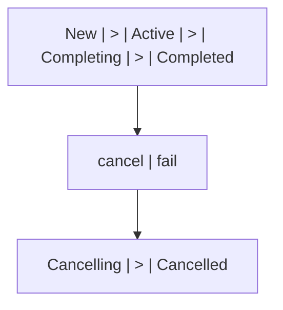
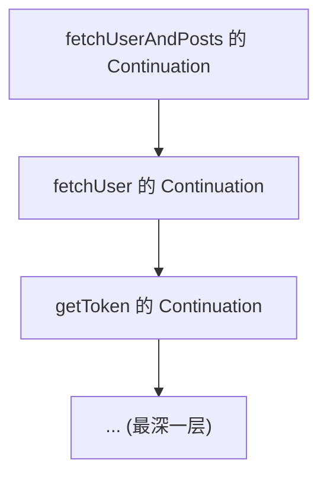
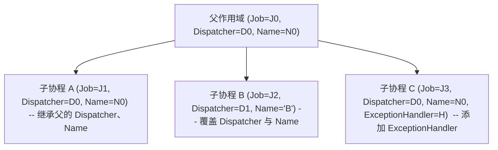

## 前置知识

- [扩展函数](/kotlin/017-ExtensionFunction)：建议先完成前一篇的学习

## 学习目标

- 掌握「1. 历史动机与发展脉络」的核心机制、典型用法与常见陷阱
- 掌握「2. 形式化定义」的核心机制、典型用法与常见陷阱
- 掌握「3. 理论推导与原理解析」的核心机制、典型用法与常见陷阱
- 掌握「4. 代码示例」的核心机制、典型用法与常见陷阱
- 掌握「5. 对比分析」的核心机制、典型用法与常见陷阱


## 1. 历史动机与发展脉络

### 1.1 问题背景：异步编程的演进痛点

协程的诞生源于一个长期存在的工程痛点：**异步编程难写、难读、难维护**。

回顾异步编程的演进史：

1. **回调（Callback）时代**：最早的异步方案。函数接收一个回调，完成时调用。问题：回调地狱（callback hell），错误处理分散，代码可读性极差。

   ```javascript
   // 典型的回调地狱
   getData(function(a) {
       getMoreData(a, function(b) {
           getEvenMoreData(b, function(c) {
               // ...
           });
       });
   });
   ```

2. **Future / Promise 时代**：Java 5（2004）引入 `Future`，JavaScript 引入 `Promise`。问题：组合性差，无法链式调用（Java 8 的 `CompletableFuture` 部分解决），异常处理仍繁琐。

   ```java
   Future<User> userFuture = executor.submit(() -> fetchUser());
   Future<Profile> profileFuture = executor.submit(() -> fetchProfile(userFuture.get()));
   Profile profile = profileFuture.get();  // 阻塞！
   ```

3. **RxJava / ReactiveX 时代**：基于观察者模式 + 函数式编程。问题：学习曲线陡峭，操作符繁多，调试困难，过度抽象简单场景。

   ```kotlin
   fetchUser()
       .flatMap { user -> fetchProfile(user) }
       .subscribeOn(Schedulers.io())
       .observeOn(AndroidSchedulers.mainThread())
       .subscribe({ profile -> show(profile) }, { error -> showError(error) })
   ```

4. **`async`/`await` 时代**：C# 5（2012）首创，ES2017、Python 3.5、Rust 1.39 等陆续采纳。问题：需要语言级支持，但代码风格接近同步，可读性最佳。

   ```csharp
   public async Task<Profile> GetProfileAsync() {
       var user = await GetUserAsync();
       var profile = await GetProfileAsync(user);
       return profile;
   }
   ```

5. **协程（Coroutines）时代**：Go（Goroutine）、Python（asyncio）、Kotlin、Rust（async/await）等。协程将"暂停"与"恢复"作为一等公民，让异步代码看起来像同步代码，但执行时是协作式调度。

Kotlin 协程的设计目标：

- **同步风格写异步代码**：用 `suspend` 函数与 `await` 让代码看起来同步，但实际是非阻塞的。
- **零开销抽象**：协程对象轻量（约 100 字节），可创建数十万个不耗尽内存。
- **结构化并发**：所有协程必须隶属于某个作用域，避免"游离协程"造成的资源泄漏。
- **与现有生态兼容**：能与 `Future`、`Promise`、回调式 API 互操作。
- **可插拔的调度器**：可指定协程在哪个线程池执行，支持 IO、CPU、UI 等不同场景。

### 1.2 学术背景：协程的早期理论

协程的概念并非新生事物，其历史可追溯至 1958 年：

- **Melvin Conway（1958）**：首次提出"协程"（coroutine）一词，用于描述 COBOL 编译器的实现。
- ****Marlin（1980）**：在《Coroutines: An Order-Independent Method for Controlling Concurrent Computations》中形式化了协程的语义。
- **Modula-2（1980s）**：Niklaus Wirth 在 Modula-2 中引入协程原语。
- **Lua（1993）**：原生支持对称协程（symmetric coroutines）。
- **Python（2001, generator）→ asyncio（2014）**：通过 generator 实现协程，后被 `async`/`await` 取代。
- **Go Goroutine（2009）**：协程 + Channel 的现代典范，让 CSP（Communicating Sequential Processes）模型流行。
- **C# async/await（2012）**：将协程引入主流工业语言。
- **Rust async/await（2019）**：零开销协程，编译为状态机。

Kotlin 协程的设计受到上述所有方案的影响：

- 借鉴 Go 的 CSP（Channel 模型）。
- 借鉴 C# 的 `async`/`await` 风格。
- 借鉴 Python 的 generator-based 实现（早期）。
- 借鉴 Java 的 `Executor` 抽象（Dispatcher）。

### 1.3 Kotlin 1.1（2017）：协程实验

2017 年 4 月，Kotlin 1.1 发布，协程作为实验特性首次引入：

- 引入 `suspend` 关键字，标记可挂起函数。
- 提供 `kotlinx.coroutines` 库（实验状态），包含 `launch`、`async`、`await` 等 API。
- 引入 `CoroutineScope` 接口。
- 编译器将 `suspend` 函数转换为 Continuation-Passing Style（CPS）+ 状态机。

由于是实验特性，1.1-1.2 期间 API 变化频繁，不建议生产使用。

### 1.4 Kotlin 1.3（2018）：协程稳定

2018 年 10 月，Kotlin 1.3 发布，协程正式稳定：

- `kotlinx.coroutines` 1.0 发布，API 稳定。
- 引入 `@RestrictsSuspension`、`@ExperimentalCoroutinesApi` 等注解。
- 修复多个早期 bug，性能优化。
- 完整文档与教程发布。

### 1.5 Kotlin 1.4（2020）：调试器与改进

- IntelliJ 协程调试器：可查看协程调用栈、状态、变量。
- `CoroutineScope` 的 `coroutineContext` 改进。
- 性能优化：减少协程对象分配。

### 1.6 Kotlin 1.6（2021）- 1.7（2022）：稳定性增强

- `resume`/`resumeWithException` API 稳定。
- `Dispatchers.Default` 线程数动态调整。
- `kotlinx-coroutines-test` API 稳定。

### 1.7 Kotlin 1.8（2023）：与 JVM 21 兼容

- 兼容 Java 21 的虚拟线程（Virtual Threads）。
- 与 `StructuredTaskScope` 互操作。

### 1.8 Kotlin 2.0（2024）：K2 编译器与协程

- K2 编译器对 `suspend` 函数的状态机生成更优化。
- 编译速度提升约 30%。
- 协程调试栈追踪更准确（不再显示"协程未正确栈追踪"）。

---

## 2. 形式化定义

### 2.1 协程的形式化定义

协程（Coroutines）是可挂起（suspendable）的计算实例。形式化定义如下：

**定义（Coroutine）**：一个协程 $C$ 是一个三元组 $(S, \Sigma, \delta)$，其中：

- $S = \{s_0, s_1, \dots, s_n\}$ 是有限状态集合，$s_0$ 是初始状态。
- $\Sigma = \{x_0, x_1, \dots, x_m\}$ 是局部变量集合（包括函数参数）。
- $\delta : S \times \text{Event} \to S$ 是状态转移函数，事件包括 `resume`、`suspend`、`complete`、`cancel`。

**挂起（Suspend）操作**：协程在状态 $s_i$ 执行 `suspend` 操作时，将当前状态保存为 $(s_i, \Sigma_i)$，并将控制权交还调度器。调度器可在未来调用 `resume(value)` 让协程从 $s_i$ 继续，$\Sigma_i$ 恢复。

**恢复（Resume）操作**：$\text{resume}(v) : (s_i, \Sigma_i) \to (s_{i+1}, \Sigma_{i+1})$，其中 $\Sigma_{i+1} = \Sigma_i \cup \{r := v\}$（$r$ 是挂起点的返回值）。

### 2.2 Continuation 的形式化定义

**定义（Continuation）**：Continuation 是"剩余计算"的抽象表示。给定一个表达式 $E$ 在某点的求值状态，其 Continuation 是"接受该点的值 $v$，完成 $E$ 的求值并返回最终结果"的函数：

$$
\text{Continuation} : \text{Value} \to \text{Result}
$$

在 Kotlin 中，`Continuation<T>` 接口定义为：

```kotlin
public interface Continuation<in T> {
    public val context: CoroutineContext
    public fun resumeWith(result: Result<T>)
}
```

`resumeWith` 接收 `Result<T>`，表示"前一个挂起点已返回值 $T$，请继续执行"。

### 2.3 CPS（Continuation-Passing Style）转换

Kotlin 编译器将 `suspend` 函数转换为 CPS 风格。原始函数：

```kotlin
suspend fun fetchUser(): User {
    val token = getToken()       // suspend point 1
    val user = getUser(token)    // suspend point 2
    return user
}
```

CPS 转换后：

```kotlin
fun fetchUser(continuation: Continuation<User>): Any? {
    // 状态机实现
}
```

返回类型 `Any?` 而非 `User` 的原因：函数可能返回 `COROUTINE_SUSPENDED`（表示已挂起）或 `User`（表示同步完成）。

### 2.4 结构化并发的形式化定义

**定义（Structured Concurrency）**：给定协程作用域 $SC$，其所有子协程 $\{C_1, C_2, \dots, C_n\}$ 满足：

1. **生命周期绑定**：$SC$ 的完成等价于所有 $C_i$ 完成（$\forall i, C_i.\text{isCompleted}$）。
2. **失败传播**：若 $C_i$ 抛出异常 $e$，则 $SC$ 抛出 $e$，且 $\forall j \neq i, C_j.\text{cancel}(e)$。
3. **取消传播**：若 $SC.\text{cancel}()$，则 $\forall i, C_i.\text{cancel}()$。

形式化：

$$
\text{Scope}(SC, \{C_1, \dots, C_n\}) \quad \text{s.t.} \quad
\begin{cases}
SC.\text{complete} \iff \bigwedge_i C_i.\text{complete} \\
C_i.\text{fail}(e) \implies SC.\text{fail}(e) \land \bigwedge_{j \neq i} C_j.\text{cancel}(e) \\
SC.\text{cancel}() \implies \bigwedge_i C_i.\text{cancel}()
\end{cases}
$$

### 2.5 Job 状态机的形式化定义

`Job` 接口的状态机：



状态转换条件：

- `New → Active`：调用 `start()` 或 `join()`。
- `Active → Completing`：协程函数返回。
- `Active → Cancelling`：调用 `cancel()`。
- `Completing → Completed`：所有子 Job 完成。
- `Cancelling → Cancelled`：清理完成。

### 2.6 调度器的形式化定义

`CoroutineDispatcher` 是一个函数：

$$
\text{Dispatcher} : \text{Runnable} \to \text{Unit}
$$

它决定一个 `Runnable`（可执行块）在哪个线程执行。形式化：

$$
\text{dispatch}(r: \text{Runnable}) : \text{execute}(r \text{ on thread } t \in \text{ThreadPool})
$$

不同调度器选择不同的线程池：

- `Dispatchers.Default`：`Runtime.getRuntime().availableProcessors()` 个线程。
- `Dispatchers.IO`：默认 64 个线程（可调）。
- `Dispatchers.Main`：平台特定（Android 主线程、Swing EDT、JavaFX Application Thread）。
- `Dispatchers.Unconfined`：不切换线程，由调用者线程执行。

---

## 3. 理论推导与原理解析

### 3.1 suspend 函数的状态机转换

Kotlin 编译器将 `suspend` 函数转换为状态机（State Machine）。考虑以下函数：

```kotlin
suspend fun fetchUserAndPosts(): Pair<User, List<Post>> {
    val user = fetchUser()        // suspend point A
    val posts = fetchPosts(user)  // suspend point B
    return user to posts
}
```

编译器将其转换为类似以下的状态机：

```kotlin
// 伪代码：编译器生成的实际代码更复杂
fun fetchUserAndPosts(continuation: Continuation<*>): Any? {
    val sm = continuation as? FetchUserSM ?: FetchUserSM(continuation)
    
    when (sm.label) {
        0 -> {
            sm.label = 1
            val result = fetchUser(sm)  // 传入 Continuation
            if (result == COROUTINE_SUSPENDED) {
                return COROUTINE_SUSPENDED  // 已挂起，等待 resume
            }
            // 同步完成，继续执行
            sm.user = result as User
            sm.label = 2
            val result2 = fetchPosts(sm.user, sm)
            if (result2 == COROUTINE_SUSPENDED) {
                return COROUTINE_SUSPENDED
            }
            sm.posts = result2 as List<Post>
            return sm.user to sm.posts
        }
        1 -> {
            sm.user = sm.result as User  // 从 Continuation 恢复
            sm.label = 2
            val result2 = fetchPosts(sm.user, sm)
            if (result2 == COROUTINE_SUSPENDED) {
                return COROUTINE_SUSPENDED
            }
            sm.posts = result2 as List<Post>
            return sm.user to sm.posts
        }
        2 -> {
            sm.user = (sm.continuation as FetchUserSM).user
            sm.posts = sm.result as List<Post>
            return sm.user to sm.posts
        }
        else -> throw IllegalStateException()
    }
}

class FetchUserSM(continuation: Continuation<*>) : Continuation<Pair<User, List<Post>>> {
    var label = 0
    var user: User? = null
    var posts: List<Post>? = null
    var result: Any? = null
    var continuation: Continuation<*> = continuation
    
    override val context: CoroutineContext
        get() = continuation.context
    
    override fun resumeWith(result: Result<Pair<User, List<Post>>>) {
        this.result = result.getOrNull() ?: result.exceptionOrNull()
        continuation.resumeWith(result)
    }
}
```

**关键观察**：

1. 每个挂起点对应一个 `case`（状态）。
2. `label` 字段记录当前状态。
3. 所有局部变量被提升为字段（`user`、`posts`、`token` 等）。
4. 调用 `suspend` 函数时传入 `Continuation`（即 `sm` 自身）。
5. 若返回 `COROUTINE_SUSPENDED`，说明挂起，函数返回；否则继续执行。

### 3.2 Continuation 的链式结构

Continuation 形成链表（call stack 的协程等价物）：



每个 Continuation 持有"调用者"的 Continuation，形成逆序链。当最内层 `resume` 时，依次调用外层 `resumeWith`，直到顶层。

### 3.3 结构化并发的实现机制

`coroutineScope` 的伪实现：

```kotlin
suspend fun <R> coroutineScope(block: suspend CoroutineScope.() -> R): R = suspendCoroutineUninterceptedOrReturn { uCont ->
    val scope = ScopeCoroutine(uCont.context, uCont)
    // 启动 block，传入 scope
    val result = block.startCoroutineUninterceptedOrReturn(scope)
    if (result === COROUTINE_SUSPENDED) {
        // 挂起，等待所有子协程完成
        return COROUTINE_SUSPENDED
    }
    result as R
}
```

`ScopeCoroutine` 在完成时检查所有子 Job：

- 若所有子 Job 完成，则完成自身。
- 若任一子 Job 失败，则取消所有其他子 Job，传播异常。

### 3.4 协程与线程的关系

协程与线程是多对多关系：

- 一个协程在任意时刻只能在一个线程上执行。
- 一个线程可同时运行多个协程（通过协作式调度）。
- 协程可在不同挂起点之间切换线程（通过 `withContext` 或 `Dispatcher`）。

线程切换的代价：

- 操作系统线程切换：约 1-10 微秒（上下文切换、TLB 刷新）。
- 协程切换：约 10-100 纳秒（仅修改 Continuation 状态、调度器入队）。

### 3.5 协程的取消机制

协程取消是协作式的（cooperative cancellation）。`cancel()` 仅设置取消标志，协程在以下时机响应取消：

1. **挂起点**：调用 `suspend` 函数时，若协程已被取消，抛出 `CancellationException`。
2. **`yield()`**：主动让出执行权，同时检查取消标志。
3. **`ensureActive()`**：显式检查，若已取消则抛出异常。

纯 CPU 计算不响应取消：

```kotlin
// 这个协程不会被取消！
runBlocking {
    val job = launch(Dispatchers.Default) {
        var i = 0
        while (true) {  // 没有 suspend，永远不响应取消
            i++
        }
    }
    delay(100)
    job.cancelAndJoin()  // 永远不会完成！
}
```

修复：

```kotlin
runBlocking {
    val job = launch(Dispatchers.Default) {
        var i = 0
        while (isActive) {  // 检查取消标志
            i++
            if (i % 1000 == 0) yield()  // 主动让出，响应取消
        }
    }
    delay(100)
    job.cancelAndJoin()  // 立即完成
}
```

### 3.6 调度器的实现原理

`Dispatchers.Default` 使用 `CoroutineScheduler`，这是一个基于 Work-Stealing 的线程池：

- 默认线程数 = `max(2, CPU 核心数)`。
- 每个线程有本地队列，从头部取任务。
- 当本地队列空时，从其他线程队列尾部"偷"任务（steal）。
- 当所有队列都空时，线程进入阻塞等待（parking）。

`Dispatchers.IO` 在 `Default` 基础上扩展：

- 当任务被标记为 IO 时，可临时增加线程（最多 64 个）。
- 任务完成后，线程归还到默认池。

### 3.7 协程作用域的继承机制

协程作用域的上下文（`CoroutineContext`）通过继承传递：



子协程的 `Job` 始终是新的（不继承父的 `Job`），但父子关系通过 `parent` 字段建立。

### 3.8 异常传播机制

协程异常传播遵循"结构化"原则：

1. 子协程抛出未捕获异常。
2. 异常被 `CoroutineExceptionHandler` 处理（如果有）。
3. 若未处理，传播到父 `Job`。
4. 父 `Job` 取消所有子协程（除 `SupervisorJob`）。
5. 父 `Job` 自身转为失败状态。
6. 异常继续向上传播，直到根作用域。
7. 根作用域未处理时，触发 `Thread.UncaughtExceptionHandler`。

`SupervisorJob` 改变行为：子协程失败不影响兄弟，仅自己失败。

---

## 4. 代码示例

### 4.1 第一个协程

```kotlin
import kotlinx.coroutines.*

fun main() = runBlocking {  // 启动主协程作用域
    launch {  // 启动新协程
        delay(1000)  // 非阻塞等待 1 秒
        println("World!")
    }
    println("Hello,")  // 主协程继续执行
}
// 输出（约 1 秒后退出）：
// Hello,
// World!
```

### 4.2 launch 启动并发

```kotlin
import kotlinx.coroutines.*

fun main() = runBlocking {
    val jobs = (1..5).map { i ->
        launch {
            delay((1000..3000).random().toLong())
            println("Coroutine $i done")
        }
    }
    jobs.forEach { it.join() }  // 等待所有完成
    println("All done")
}
```

### 4.3 async 并发获取结果

```kotlin
import kotlinx.coroutines.*

fun main() = runBlocking {
    val time = measureTimeMillis {
        // 串行：耗时约 3 秒
        val user = fetchUser()  // 1s
        val profile = fetchProfile(user)  // 1s
        val settings = fetchSettings(user)  // 1s
        println("$user, $profile, $settings")
    }
    println("Serial: $time ms")
    
    val time2 = measureTimeMillis {
        // 并发：耗时约 1 秒
        val userDeferred = async { fetchUser() }
        // 这里假设 profile 与 settings 不依赖 user（简化示例）
        val profileDeferred = async { fetchProfile(null) }
        val settingsDeferred = async { fetchSettings(null) }
        
        val user = userDeferred.await()
        val profile = profileDeferred.await()
        val settings = settingsDeferred.await()
        println("$user, $profile, $settings")
    }
    println("Concurrent: $time2 ms")
}

suspend fun fetchUser(): String {
    delay(1000)
    return "User(id=1)"
}

suspend fun fetchProfile(user: Any?): String {
    delay(1000)
    return "Profile(...)"
}

suspend fun fetchSettings(user: Any?): String {
    delay(1000)
    return "Settings(...)"
}

fun measureTimeMillis(block: () -> Unit): Long {
    val start = System.currentTimeMillis()
    block()
    return System.currentTimeMillis() - start
}
```

### 4.4 withContext 切换调度器

```kotlin
import kotlinx.coroutines.*
import java.io.File

fun main() = runBlocking {
    // 当前在主调度器（runBlocking 默认）
    println("Thread: ${Thread.currentThread().name}")
    
    val content = withContext(Dispatchers.IO) {
        // 切换到 IO 线程
        println("Reading on: ${Thread.currentThread().name}")
        File("input.txt").readText()
    }
    
    // 自动切回主调度器
    println("Back to: ${Thread.currentThread().name}")
    println("Content: $content")
}
```

### 4.5 coroutineScope 子作用域

```kotlin
import kotlinx.coroutines.*

fun main() = runBlocking {
    println("Start")
    
    coroutineScope {
        launch {
            delay(1000)
            println("Task 1 done")
        }
        launch {
            delay(2000)
            println("Task 2 done")
        }
    }
    // coroutineScope 等待所有子协程完成才返回
    
    println("End")  // 在 2 秒后输出
}
```

### 4.6 取消协程

```kotlin
import kotlinx.coroutines.*

fun main() = runBlocking {
    val job = launch {
        repeat(10) { i ->
            println("Working $i")
            delay(500)
        }
    }
    
    delay(1300)  // 让 job 运行一会
    println("Canceling")
    job.cancelAndJoin()  // 取消并等待
    println("Done")
}
// 输出：
// Working 0
// Working 1
// Working 2
// Canceling
// Done
```

### 4.7 超时控制

```kotlin
import kotlinx.coroutines.*

fun main() = runBlocking {
    try {
        val result = withTimeout(2000) {
            repeat(10) { i ->
                println("Working $i")
                delay(500)
            }
            "Completed"
        }
        println(result)
    } catch (e: TimeoutCancellationException) {
        println("Timeout: ${e.message}")
    }
}
// 输出：
// Working 0
// Working 1
// Working 2
// Working 3
// Timeout: Timed out waiting for 2000 ms
```

### 4.8 finally 资源清理

```kotlin
import kotlinx.coroutines.*

fun main() = runBlocking {
    val job = launch {
        try {
            repeat(10) { i ->
                println("Working $i")
                delay(500)
            }
        } finally {
            // 即使被取消，finally 也会执行
            println("Cleaning up resources")
        }
    }
    
    delay(1300)
    job.cancelAndJoin()
}
```

### 4.9 NonCancellable 在 finally 中调用 suspend

```kotlin
import kotlinx.coroutines.*

fun main() = runBlocking {
    val job = launch {
        try {
            repeat(10) { i ->
                println("Working $i")
                delay(500)
            }
        } finally {
            // 在 finally 中调用 suspend 函数需要 NonCancellable
            withContext(NonCancellable) {
                delay(500)  // 这个 suspend 不会被取消
                println("Cleanup done")
            }
        }
    }
    
    delay(1300)
    job.cancelAndJoin()
}
```

### 4.10 自定义 suspend 函数

```kotlin
import kotlinx.coroutines.*
import kotlin.system.measureTimeMillis

suspend fun <T, R> retry(
    times: Int,
    initialDelay: Long = 100,
    factor: Double = 2.0,
    block: suspend () -> T
): T {
    var currentDelay = initialDelay
    repeat(times - 1) { i ->
        try {
            return block()
        } catch (e: Exception) {
            if (i == times - 2) throw e
            println("Attempt ${i + 1} failed, retrying in ${currentDelay}ms")
            delay(currentDelay)
            currentDelay = (currentDelay * factor).toLong()
        }
    }
    return block()
}

fun main() = runBlocking {
    var attempts = 0
    val time = measureTimeMillis {
        val result = retry(times = 3) {
            attempts++
            if (attempts < 3) throw RuntimeException("Failed")
            "Success"
        }
        println("Result: $result")
    }
    println("Time: $time ms")
}
```

### 4.11 组合并发与并发限制

```kotlin
import kotlinx.coroutines.*
import kotlinx.coroutines.sync.Semaphore

suspend fun fetchWithConcurrency(ids: List<Int>, concurrency: Int = 5): List<String> = coroutineScope {
    val semaphore = Semaphore(concurrency)
    ids.map { id ->
        async {
            semaphore.withPermit {
                fetchItem(id)
            }
        }
    }.awaitAll()
}

suspend fun fetchItem(id: Int): String {
    delay(500)
    return "Item $id"
}

fun main() = runBlocking {
    val ids = (1..20).toList()
    val time = measureTimeMillis {
        val items = fetchWithConcurrency(ids, concurrency = 5)
        items.forEach { println(it) }
    }
    println("Total time: $time ms")  // 约 2000ms（20 / 5 = 4 批 * 500ms）
}
```

### 4.12 Android 生命周期绑定

```kotlin
import androidx.lifecycle.ViewModel
import androidx.lifecycle.viewModelScope
import kotlinx.coroutines.*

class UserViewModel(private val repo: UserRepository) : ViewModel() {
    private val _user = MutableStateFlow<User?>(null)
    val user: StateFlow<User?> = _user.asStateFlow()
    
    fun loadUser(userId: Long) {
        viewModelScope.launch {  // 与 ViewModel 生命周期绑定
            try {
                _user.value = repo.getUser(userId)
            } catch (e: Exception) {
                // 处理错误
            }
        }
    }
    
    // ViewModel 销毁时自动取消所有协程
}
```

---

## 5. 对比分析

### 5.1 Kotlin 协程 vs Java CompletableFuture

| 维度         | Java CompletableFuture                | Kotlin Coroutines                            |
| ------------ | --------------------------------------- | -------------------------------------------- |
| 语法         | 链式调用 `.thenApply`、`.thenCompose`  | `suspend` + `await`，类似同步代码             |
| 类型         | `CompletableFuture<T>`                 | `T`（直接）或 `Deferred<T>`                  |
| 异常处理     | `exceptionally`、`handle`              | `try/catch`                                  |
| 取消         | `cancel(true)`（不友好）                | `cancel()` + 协作式取消                       |
| 组合性       | 中（`allOf`、`anyOf`）                  | 高（`coroutineScope`、`async`、`awaitAll`）  |
| 调试         | 栈追踪复杂                              | 较清晰（K2 后改善）                           |
| 学习曲线     | 陡（操作符多）                          | 缓（与同步代码相似）                          |
| 兼容性       | JDK 原生                                | 需要 `kotlinx.coroutines` 库                  |
| 背压         | 无                                      | Flow 支持                                     |
| 结构化并发   | 无                                      | 原生支持                                      |

### 5.2 Kotlin 协程 vs RxJava

| 维度         | RxJava                              | Kotlin Coroutines                       |
| ------------ | ------------------------------------ | --------------------------------------- |
| 范式         | 观察者 + 函数式                     | 命令式（风格）+ 协作式                  |
| API          | `Observable`、`Flowable`、`Single`  | `suspend`、`Flow`、`Deferred`           |
| 操作符       | 数百个                              | 集合 API + 少量协程 API                 |
| 学习曲线     | 极陡                                | 平缓                                    |
| 背压         | 内置（`Flowable`）                  | `Flow` 内置                             |
| Hot/Cold     | 显式区分                            | `Flow` 冷流，`SharedFlow`/`StateFlow` 热 |
| 调试         | 难（操作符链长）                    | 较易（栈接近同步）                      |
| 互操作       | 与 Java 8+ Stream                    | 与 Java Future                          |

### 5.3 Kotlin 协程 vs Go Goroutine

| 维度         | Go Goroutine                          | Kotlin Coroutines                        |
| ------------ | ------------------------------------- | ---------------------------------------- |
| 语法         | `go func()`                           | `launch { }` 或 `async { }`              |
| 通信         | Channel（CSP）                        | Channel + SharedFlow + 直接共享          |
| 调度         | 运行时调度（M:N）                     | 库调度（基于 Dispatcher）                |
| 取消         | `context.WithCancel`                  | `Job.cancel()`                           |
| 异常         | `panic`/`recover`                     | `try/catch` + `CoroutineExceptionHandler` |
| 结构化并发   | `context` 传递                        | `coroutineScope`                         |
| 性能         | 极高（编译器优化）                    | 高（JVM 优化）                           |
| 生态         | Go 标准库                            | JVM 生态                                 |

### 5.4 Kotlin 协程 vs Python asyncio

| 维度         | Python asyncio                | Kotlin Coroutines                       |
| ------------ | ----------------------------- | --------------------------------------- |
| 语法         | `async def`、`await`          | `suspend fun`、`await`                  |
| 事件循环     | 显式 `asyncio.run`            | 隐式（Dispatcher）                      |
| 类型         | 无原生类型                    | `Deferred<T>`                           |
| 取消         | `Task.cancel`                 | `Job.cancel`                            |
| 结构化并发   | `TaskGroup`（3.11+）          | `coroutineScope`                        |
| 性能         | 中等（GIL）                   | 高（JVM）                               |

### 5.5 Kotlin 协程 vs Java 21 Virtual Threads

| 维度         | Java 21 Virtual Threads         | Kotlin Coroutines                       |
| ------------ | ------------------------------- | --------------------------------------- |
| 抽象层级     | JVM 层                          | 语言层                                  |
| 代码风格     | 同步（阻塞）                    | 同步（suspend）                         |
| API 改动     | 无需（`Thread.ofVirtual()`）   | 需要 `suspend` 标记                     |
| 调试         | 简单（像普通线程）              | 中等（状态机）                          |
| 取消         | `Thread.interrupt`             | `Job.cancel`                            |
| 资源开销     | 极低（KB 级）                   | 极低（百字节级）                         |
| 生态         | JDK 原生                        | Kotlin 库                               |
| 适用场景     | 阻塞 IO                        | 阻塞 IO + 复杂异步                      |

---

## 6. 常见陷阱与最佳实践

### 6.1 陷阱：使用 GlobalScope

**问题代码**：

```kotlin
fun startWork() {
    GlobalScope.launch {  // 不受生命周期管理，可能泄漏
        while (true) {
            delay(1000)
            println("Working")
        }
    }
}
```

**最佳实践**：使用结构化作用域：

```kotlin
class MyService : CoroutineScope {
    override val coroutineContext = SupervisorJob() + Dispatchers.Default
    
    fun startWork() {
        launch {
            while (isActive) {  // 检查取消标志
                delay(1000)
                println("Working")
            }
        }
    }
    
    fun shutdown() {
        coroutineContext.cancel()
    }
}
```

### 6.2 陷阱：在 runBlocking 中嵌套 runBlocking

**问题代码**：

```kotlin
suspend fun fetchData(): String = runBlocking {  // 协程中阻塞！
    api.fetch()
}
```

**最佳实践**：直接使用 `suspend`：

```kotlin
suspend fun fetchData(): String = api.fetch()
```

### 6.3 陷阱：async 不 await

**问题代码**：

```kotlin
fun load() = runBlocking {
    async {  // 启动了，但不 await
        delay(1000)
        println("Done")
    }
    // 函数返回后 async 可能仍在运行
}
```

**最佳实践**：始终 `await`，或使用 `launch` 替代：

```kotlin
fun load() = runBlocking {
    val deferred = async {
        delay(1000)
        "Done"
    }
    println(deferred.await())
}
```

### 6.4 陷阱：忽略协程取消

**问题代码**：

```kotlin
fun process() = runBlocking {
    val job = launch(Dispatchers.Default) {
        val list = (1..1_000_000).toList()
        // CPU 密集操作，不响应取消
        val sum = list.sum()
        println(sum)
    }
    delay(100)
    job.cancel()  // 不会被取消
}
```

**最佳实践**：使用 `isActive` 与 `yield`：

```kotlin
fun process() = runBlocking {
    val job = launch(Dispatchers.Default) {
        var sum = 0L
        for (i in 1..1_000_000) {
            if (!isActive) break  // 检查取消
            sum += i
            if (i % 10000 == 0) yield()  // 让出执行权
        }
        println(sum)
    }
    delay(100)
    job.cancelAndJoin()
}
```

### 6.5 陷阱：在 finally 中调用 suspend

**问题代码**：

```kotlin
val job = launch {
    try {
        // ...
    } finally {
        delay(1000)  // 协程被取消时，finally 中的 suspend 也会被取消
        println("Cleanup")
    }
}
```

**最佳实践**：使用 `NonCancellable`：

```kotlin
finally {
    withContext(NonCancellable) {
        delay(1000)
        println("Cleanup")
    }
}
```

### 6.6 陷阱：错误使用 SupervisorJob

**问题代码**：

```kotlin
val scope = CoroutineScope(Job())  // 默认 Job，子失败会传播
launch {  // 子协程 A
    throw Exception("A failed")
}
launch {  // 子协程 B
    delay(1000)
    println("B done")  // 不会执行
}
```

**最佳实践**：需要独立失败时使用 `SupervisorJob`：

```kotlin
val scope = CoroutineScope(SupervisorJob())
launch {  // 子协程 A
    throw Exception("A failed")  // 仅 A 失败
}
launch {  // 子协程 B
    delay(1000)
    println("B done")  // 会执行
}
```

### 6.7 陷阱：错误的异常处理

**问题代码**：

```kotlin
val handler = CoroutineExceptionHandler { _, e ->
    println("Caught: $e")
}

fun main() = runBlocking {
    val handler = CoroutineExceptionHandler { _, e -> println("Caught: $e") }
    
    launch(handler) {  // 顶层协程，handler 生效
        throw Exception("Test")
    }
    
    launch(handler) {  // 嵌套协程
        launch {  // 子协程
            throw Exception("Test")  // handler 不生效！异常传播到父
        }
    }
}
```

**最佳实践**：`CoroutineExceptionHandler` 仅对顶层协程生效。子协程的异常会传播到父，由父处理。

### 6.8 陷阱：阻塞调用占满调度器

**问题代码**：

```kotlin
fun main() = runBlocking(Dispatchers.Default) {  // 仅 N 个线程
    repeat(100) {
        launch {
            Thread.sleep(10000)  // 阻塞！占满调度器
        }
    }
    // 其他协程无法运行
}
```

**最佳实践**：阻塞操作必须用 `Dispatchers.IO` 或 `withContext(Dispatchers.IO)`：

```kotlin
fun main() = runBlocking {
    repeat(100) {
        launch(Dispatchers.IO) {
            Thread.sleep(10000)
        }
    }
}
```

### 6.9 陷阱：在 Android 主线程阻塞

**问题代码**：

```kotlin
fun onClick() = runBlocking {  // 主线程阻塞！
    val data = fetchData()  // suspend
    textView.text = data
}
```

**最佳实践**：使用 `lifecycleScope.launch`：

```kotlin
fun onClick() {
    lifecycleScope.launch {
        val data = fetchData()
        textView.text = data
    }
}
```

### 6.10 陷阱：忘记 awaitAll

**问题代码**：

```kotlin
fun process() = runBlocking {
    val deferreds = (1..5).map { async { fetch(it) } }
    deferreds.forEach { it.await() }  // 串行 await，丢失并发优势
}
```

**最佳实践**：使用 `awaitAll`：

```kotlin
fun process() = runBlocking {
    val deferreds = (1..5).map { async { fetch(it) } }
    val results = deferreds.awaitAll()  // 真正并发
}
```

---

## 7. 工程实践

### 7.1 协程作用域管理

```kotlin
import kotlinx.coroutines.*

class MyApplication : CoroutineScope {
    private val job = SupervisorJob()
    override val coroutineContext = job + Dispatchers.Default
    
    fun start() {
        launch { backgroundTask() }
        launch { anotherTask() }
    }
    
    fun stop() {
        job.cancelAndJoin()  // 取消所有子协程
    }
    
    private suspend fun backgroundTask() {
        while (isActive) {
            delay(1000)
            println("Tick")
        }
    }
    
    private suspend fun anotherTask() {
        // ...
    }
}
```

### 7.2 自定义调度器

```kotlin
import kotlinx.coroutines.*
import java.util.concurrent.Executors

val myDispatcher = Executors.newFixedThreadPool(4).asCoroutineDispatcher()

fun main() = runBlocking {
    launch(myDispatcher) {
        println("Running on ${Thread.currentThread().name}")
    }.join()
    
    (myDispatcher.executor as? ExecutorService)?.shutdown()
}

// kotlinx.coroutines 提供 ExecutorService 的扩展
val <T> T.executor: Any get() = this  // 简化示例
```

### 7.3 协程测试

```kotlin
import kotlinx.coroutines.test.runTest
import kotlinx.coroutines.test.StandardTestDispatcher
import kotlinx.coroutines.test.advanceTimeBy
import kotlinx.coroutines.delay
import kotlin.test.Test
import kotlin.test.assertEquals

class MyServiceTest {
    
    @Test
    fun `should return result after delay`() = runTest {
        val service = MyService()
        val result = service.fetchData()
        assertEquals("Data", result)
    }
    
    @Test
    fun `should handle concurrent requests`() = runTest {
        val service = MyService()
        val results = (1..10).map {
            async { service.fetchData() }
        }.awaitAll()
        
        assertEquals(10, results.size)
    }
}

class MyService {
    suspend fun fetchData(): String {
        delay(1000)
        return "Data"
    }
}
```

### 7.4 结构化并发模式

```kotlin
import kotlinx.coroutines.*

class UserLoader(private val api: UserApi) {
    
    suspend fun loadUserWithDependencies(userId: Long): UserDetails = coroutineScope {
        val user = async { api.getUser(userId) }
        val posts = async { api.getPosts(userId) }
        val friends = async { api.getFriends(userId) }
        
        UserDetails(
            user.await(),
            posts.await(),
            friends.await()
        )
    }
    
    suspend fun loadUsers(userIds: List<Long>): List<UserDetails> = coroutineScope {
        userIds.map { id ->
            async { loadUserWithDependencies(id) }
        }.awaitAll()
    }
}

data class UserDetails(
    val user: User,
    val posts: List<Post>,
    val friends: List<User>
)
```

### 7.5 重试与退避

```kotlin
import kotlinx.coroutines.*
import kotlinx.coroutines.delay

suspend fun <T> retry(
    times: Int = 3,
    initialDelay: Long = 100,
    factor: Double = 2.0,
    block: suspend () -> T
): T {
    var currentDelay = initialDelay
    var lastException: Exception? = null
    repeat(times) { i ->
        try {
            return block()
        } catch (e: Exception) {
            lastException = e
            if (i < times - 1) {
                delay(currentDelay)
                currentDelay = (currentDelay * factor).toLong()
            }
        }
    }
    throw lastException ?: RuntimeException("Unknown error")
}

// 使用
suspend fun fetchWithRetry(): String = retry {
    api.fetch()
}
```

### 7.6 限流与并发控制

```kotlin
import kotlinx.coroutines.*
import kotlinx.coroutines.sync.Semaphore
import kotlinx.coroutines.sync.withPermit

class RateLimiter(private val maxConcurrency: Int) {
    private val semaphore = Semaphore(maxConcurrency)
    
    suspend fun <T> execute(block: suspend () -> T): T = semaphore.withPermit {
        block()
    }
}

suspend fun processItems(items: List<String>, limiter: RateLimiter): List<String> = coroutineScope {
    items.map { item ->
        async { limiter.execute { processItem(item) } }
    }.awaitAll()
}

suspend fun processItem(item: String): String {
    delay(500)
    return item.uppercase()
}
```

### 7.7 超时与降级

```kotlin
import kotlinx.coroutines.*

suspend fun fetchWithFallback(
    primary: suspend () -> String,
    fallback: suspend () -> String,
    timeoutMs: Long = 2000
): String = coroutineScope {
    try {
        withTimeout(timeoutMs) {
            primary()
        }
    } catch (e: TimeoutCancellationException) {
        fallback()
    }
}

// 使用
suspend fun getData(): String = fetchWithFallback(
    primary = { fetchFromCache() },
    fallback = { fetchFromNetwork() }
)
```

### 7.8 协程上下文传播

```kotlin
import kotlinx.coroutines.*

val TraceContextKey = coroutineContextKey<String>("traceId")

class TraceContextElement(val traceId: String) : AbstractCoroutineContextElement(Key) {
    companion object Key : CoroutineContext.Key<TraceContextElement>
}

fun <T> coroutineContextKey(name: String) = object : CoroutineContext.Key<T> {}

fun main() = runBlocking {
    val traceId = "trace-123"
    
    val context = coroutineContext + TraceContextElement(traceId)
    
    withContext(context) {
        launch {
            println("Child coroutine trace: ${coroutineContext[TraceContextElement]?.traceId}")
            // 输出 trace-123
        }
    }
}
```

### 7.9 协程调试

```kotlin
import kotlinx.coroutines.*

fun main() = runBlocking {
    // 启用调试
    val context = CoroutineName("main-coroutine") + Dispatchers.Default
    withContext(context) {
        launch(CoroutineName("child-1")) {
            println("Running in: ${coroutineContext[CoroutineName]}")
            delay(100)
        }
        
        launch(CoroutineName("child-2")) {
            println("Running in: ${coroutineContext[CoroutineName]}")
            delay(100)
        }
    }
    
    println("Done")
}

// JVM 调试参数：-Dkotlinx.coroutines.debug=on
```

### 7.10 协程与 Spring 集成

```kotlin
import org.springframework.web.bind.annotation.*
import kotlinx.coroutines.*

@RestController
class UserController(private val service: UserService) {
    
    @GetMapping("/users/{id}")
    suspend fun getUser(@PathVariable id: Long): User {
        return service.getUser(id)  // suspend 函数，Spring 自动处理
    }
    
    @PostMapping("/users")
    suspend fun createUser(@RequestBody request: CreateUserRequest): User {
        return service.createUser(request)
    }
}

@Service
class UserService(private val repo: UserRepository) {
    suspend fun getUser(id: Long): User = withContext(Dispatchers.IO) {
        repo.findById(id) ?: throw NotFoundException("User not found")
    }
    
    suspend fun createUser(req: CreateUserRequest): User = withContext(Dispatchers.IO) {
        repo.save(req.toUser())
    }
}
```

---

## 8. 案例研究

### 8.1 案例一：API 聚合

**场景**：需要从三个 API 获取数据并聚合成一个响应。

```kotlin
import kotlinx.coroutines.*

class UserAggregator(
    private val userApi: UserApi,
    private val postApi: PostApi,
    private val friendApi: FriendApi
) {
    
    suspend fun aggregate(userId: Long): UserProfile = coroutineScope {
        // 并发获取所有数据
        val userDeferred = async { userApi.getUser(userId) }
        val postsDeferred = async { postApi.getPosts(userId) }
        val friendsDeferred = async { friendApi.getFriends(userId) }
        
        // 等待所有完成
        UserProfile(
            user = userDeferred.await(),
            posts = postsDeferred.await(),
            friends = friendsDeferred.await()
        )
    }
}

data class UserProfile(
    val user: User,
    val posts: List<Post>,
    val friends: List<User>
)
```

### 8.2 案例二：批量处理

**场景**：处理 1000 个项目，限制并发为 10。

```kotlin
import kotlinx.coroutines.*
import kotlinx.coroutines.sync.Semaphore
import kotlinx.coroutines.sync.withPermit

class BatchProcessor {
    
    suspend fun processAll(items: List<Item>, concurrency: Int = 10): List<Result> = coroutineScope {
        val semaphore = Semaphore(concurrency)
        items.map { item ->
            async {
                semaphore.withPermit {
                    process(item)
                }
            }
        }.awaitAll()
    }
    
    private suspend fun process(item: Item): Result {
        delay(100)
        return Result(item.id, "Processed")
    }
}
```

### 8.3 案例三：超时与重试

**场景**：调用外部 API，超时 2 秒，失败重试 3 次。

```kotlin
import kotlinx.coroutines.*

class ResilientClient(private val client: ApiClient) {
    
    suspend fun callWithResilience(): String {
        var attempt = 0
        var lastError: Exception? = null
        var delayMs = 100L
        
        while (attempt < 3) {
            attempt++
            try {
                return withTimeout(2000) {
                    client.call()
                }
            } catch (e: TimeoutCancellationException) {
                lastError = e
                println("Attempt $attempt timeout, retrying in ${delayMs}ms")
                delay(delayMs)
                delayMs *= 2
            } catch (e: Exception) {
                lastError = e
                println("Attempt $attempt failed: ${e.message}")
                delay(delayMs)
                delayMs *= 2
            }
        }
        throw lastError ?: RuntimeException("Unknown error")
    }
}
```

### 8.4 案例四：生产者-消费者

**场景**：一个生产者协程产生数据，多个消费者协程处理。

```kotlin
import kotlinx.coroutines.*
import kotlinx.coroutines.channels.Channel

class ProducerConsumer {
    
    suspend fun run() = coroutineScope {
        val channel = Channel<Int>(capacity = 10)
        
        // 生产者
        val producer = launch {
            for (i in 1..100) {
                channel.send(i)
                println("Produced: $i")
            }
            channel.close()
        }
        
        // 消费者（3 个）
        val consumers = (1..3).map { id ->
            launch {
                for (item in channel) {
                    println("Consumer $id: $item")
                    delay(100)
                }
            }
        }
        
        producer.join()
        consumers.forEach { it.join() }
    }
}
```

### 8.5 案例五：Android ViewModel

**场景**：在 Android 中使用协程加载用户数据。

```kotlin
import androidx.lifecycle.ViewModel
import androidx.lifecycle.viewModelScope
import kotlinx.coroutines.*
import kotlinx.coroutines.flow.*

class UserViewModel(private val repo: UserRepository) : ViewModel() {
    
    private val _uiState = MutableStateFlow<UiState>(UiState.Loading)
    val uiState: StateFlow<UiState> = _uiState.asStateFlow()
    
    fun loadUser(userId: Long) {
        _uiState.value = UiState.Loading
        
        viewModelScope.launch {
            try {
                val user = repo.getUser(userId)
                _uiState.value = UiState.Success(user)
            } catch (e: Exception) {
                _uiState.value = UiState.Error(e.message ?: "Unknown error")
            }
        }
    }
    
    fun refresh(userId: Long) {
        viewModelScope.launch {
            try {
                val user = repo.getUser(userId)
                _uiState.value = UiState.Success(user)
            } catch (e: Exception) {
                _uiState.value = UiState.Error(e.message ?: "Unknown error")
            }
        }
    }
    
    // ViewModel 销毁时自动取消所有协程
}

sealed class UiState {
    object Loading : UiState()
    data class Success(val user: User) : UiState()
    data class Error(val message: String) : UiState()
}
```

---

### 9.1 基础题

**习题 1**：以下代码的输出顺序是什么？

```kotlin
fun main() = runBlocking {
    launch {
        delay(100)
        println("A")
    }
    launch {
        delay(50)
        println("B")
    }
    println("Main")
}
```

**解析讲解**：
```
Main
B
A
```

`Main` 立即输出，B 延迟 50ms 后输出，A 延迟 100ms 后输出。

**习题 2**：以下代码会有什么问题？

```kotlin
fun fetchUser(): User = runBlocking {
    api.getUser()  // suspend
}
```

**解析讲解**：阻塞调用线程。应该改为 `suspend fun fetchUser(): User = api.getUser()`。

**习题 3**：写一个函数，并发获取 3 个 URL 的内容，返回 Map<URL, String>。

**解析讲解**：

```kotlin
suspend fun fetchAll(urls: List<String>): Map<String, String> = coroutineScope {
    urls.map { url ->
        url to async { fetchUrl(url) }
    }.associate { (url, deferred) ->
        url to deferred.await()
    }
}

suspend fun fetchUrl(url: String): String {
    delay(500)
    return "Content of $url"
}
```

### 9.2 中级题

**习题 4**：实现一个带超时与重试的 fetch 函数。

**解析讲解**：

```kotlin
suspend fun <T> fetchWithRetry(
    timeoutMs: Long = 2000,
    retries: Int = 3,
    block: suspend () -> T
): T {
    var lastError: Exception? = null
    repeat(retries) { attempt ->
        try {
            return withTimeout(timeoutMs) {
                block()
            }
        } catch (e: Exception) {
            lastError = e
            if (attempt < retries - 1) {
                delay(100 * (attempt + 1).toLong())
            }
        }
    }
    throw lastError ?: RuntimeException("Failed")
}
```

**习题 5**：以下代码运行后 `count` 的值是多少？为什么？

```kotlin
var count = 0

fun main() = runBlocking {
    val jobs = (1..1000).map {
        launch(Dispatchers.Default) {
            count++
        }
    }
    jobs.joinAll()
    println(count)
}
```

**解析讲解**：不确定，通常小于 1000。因为 `count++` 不是原子操作，多线程并发修改会产生竞态条件。修复方法见习题 7。

**习题 6**：实现一个函数，将 List 转换为按顺序处理的协程流。

**解析讲解**：

```kotlin
fun <T, R> List<T>.mapConcurrent(concurrency: Int, transform: suspend (T) -> R): Flow<R> = flow {
    val semaphore = kotlinx.coroutines.sync.Semaphore(concurrency)
    coroutineScope {
        val deferreds = map { item ->
            async {
                semaphore.withPermit {
                    transform(item)
                }
            }
        }
        deferreds.forEach { emit(it.await()) }
    }
}

// 使用
suspend fun main() {
    val results = listOf(1, 2, 3, 4, 5)
        .mapConcurrent(2) { processItem(it) }
        .toList()
}

suspend fun processItem(item: Int): Int {
    delay(100)
    return item * 2
}
```

### 9.3 高级题

**习题 7**：修复习题 5 中的竞态条件。

**解析讲解**：

```kotlin
import kotlinx.coroutines.sync.Mutex
import kotlinx.coroutines.sync.withLock

class Counter {
    private val mutex = Mutex()
    private var count = 0
    
    suspend fun increment() {
        mutex.withLock {
            count++
        }
    }
    
    fun get(): Int = count
}

fun main() = runBlocking {
    val counter = Counter()
    val jobs = (1..1000).map {
        launch(Dispatchers.Default) {
            counter.increment()
        }
    }
    jobs.joinAll()
    println(counter.get())  // 1000
}
```

**习题 8**：分析以下代码的死锁风险。

```kotlin
suspend fun deadLock() = runBlocking {
    val mutex1 = Mutex()
    val mutex2 = Mutex()
    
    launch {
        mutex1.withLock {
            delay(100)
            mutex2.withLock {
                println("A done")
            }
        }
    }
    
    launch {
        mutex2.withLock {
            delay(100)
            mutex1.withLock {
                println("B done")
            }
        }
    }
}
```

**解析讲解**：存在死锁风险。两个协程互相等待对方持有的锁。解决方法是按固定顺序获取锁：

```kotlin
launch {
    mutex1.withLock {
        delay(100)
        mutex2.withLock {
            println("A done")
        }
    }
}

launch {
    mutex1.withLock {  // 先获取 mutex1
        delay(100)
        mutex2.withLock {  // 再获取 mutex2
            println("B done")
        }
    }
}
```

### 9.4 设计题

**习题 9**：设计一个协程限流器，支持每秒最多 N 次调用。

**解析讲解**：

```kotlin
import kotlinx.coroutines.*
import kotlinx.coroutines.sync.Mutex
import kotlinx.coroutines.sync.withLock

class RateLimiter(private val maxPerSecond: Int) {
    private val mutex = Mutex()
    private val timestamps = mutableListOf<Long>()
    
    suspend fun <T> execute(block: suspend () -> T): T {
        while (true) {
            val now = System.currentTimeMillis()
            mutex.withLock {
                timestamps.removeAll { it < now - 1000 }
                if (timestamps.size < maxPerSecond) {
                    timestamps.add(now)
                    return@withLock true
                }
            }
            delay(50)
        }
        return block()
    }
}

// 使用
suspend fun main() {
    val limiter = RateLimiter(maxPerSecond = 10)
    repeat(50) {
        limiter.execute {
            println("Request $it at ${System.currentTimeMillis()}")
        }
    }
}
```

**习题 10**：实现一个协程池，支持动态调整并发数。

**解析讲解**：

```kotlin
import kotlinx.coroutines.*
import kotlinx.coroutines.flow.MutableStateFlow
import kotlinx.coroutines.flow.asStateFlow
import kotlinx.coroutines.sync.Semaphore

class DynamicPool(initialConcurrency: Int = 4) {
    private val _concurrency = MutableStateFlow(initialConcurrency)
    val concurrency = _concurrency.asStateFlow()
    
    private var semaphore = Semaphore(initialConcurrency)
    
    fun setConcurrency(newConcurrency: Int) {
        _concurrency.value = newConcurrency
        semaphore = Semaphore(newConcurrency)
    }
    
    suspend fun <T> execute(block: suspend () -> T): T = semaphore.withPermit {
        block()
    }
}
```

---

### 10.1 官方文档

1. JetBrains. "Coroutines Guide." *Kotlin Coroutines Documentation*, 2024. https://kotlinlang.org/docs/coroutines-guide.html.

2. JetBrains. "Coroutine Context and Dispatchers." *Kotlin Coroutines Documentation*, 2024. https://kotlinlang.org/docs/coroutine-context-and-dispatchers.html.

3. JetBrains. "Shared Mutable State and Concurrency." *Kotlin Coroutines Documentation*, 2024. https://kotlinlang.org/docs/shared-mutable-state-and-concurrency.html.

4. JetBrains. "Asynchronous Flow." *Kotlin Coroutines Documentation*, 2024. https://kotlinlang.org/docs/flow.html.

5. JetBrains. "Channels." *Kotlin Coroutines Documentation*, 2024. https://kotlinlang.org/docs/channels.html.

6. JetBrains. "Exception Handling and Supervision." *Kotlin Coroutines Documentation*, 2024. https://kotlinlang.org/docs/exception-handling.html.

### 10.2 学术论文

7. Conway, Melvin. "Design of a Separable Transition-Diagram Compiler." *Communications of the ACM*, 6(7):396-408, 1963.

8. Marlin, Christopher. "Coroutines: An Order-Independent Method for Controlling Concurrent Computations." *Department of Computer Science, University of British Columbia*, 1980.

9. Haller, Philipp, and Martin Odersky. "Actors that Unify Threads and Events." *LNCS*, 2006.（Scala 的早期协程设计）

10. Pressler, Roman. "Structured Concurrency." *JetBrains Blog*, 2018. https://elizarov.medium.com/structured-concurrency-2113ace2e823.

### 10.3 KEEP 提案

11. JetBrains. "KEEP-102: Coroutines." *Kotlin Evolution and Enhancement Process*, 2017. https://github.com/Kotlin/KEEP/blob/master/proposals/coroutines.md.

12. JetBrains. "KEEP-297: Continuation Pileline." *Kotlin Evolution and Enhancement Process*, 2021.

### 10.4 工程实践

13. Elizarov, Roman. "Kotlin Coroutines in Practice." *KotlinConf 2018*, 2018.

14. JetBrains. "kotlinx.coroutines Reference." *GitHub Repository*, 2024. https://github.com/Kotlin/kotlinx.coroutines.

15. Google. "Guide to app architecture: Coroutines." *Android Developers*, 2024. https://developer.android.com/topic/architecture.

### 10.5 书籍推荐

16. Moskala, Marcin, and Igor Wojda. *Android Development with Kotlin*. Packt, 2017.

17. Moskala, Marcin. *Effective Kotlin*. Kt. Academy, 2020.（第 7-9 章协程部分）

18. Griffith, Duncan. *Kotlin Programming: The Big Nerd Ranch Guide*. Big Nerd Ranch, 2022.

19. Akhmechet, Eugene. *Kotlin Coroutines Deep Dive*. 2023.

### 10.7 课程参考

25. MIT OpenCourseWare. "6.005 Software Construction." *MIT OCW*, 2024. https://ocw.mit.edu/.

26. Stanford. "CS193P iOS Development." *Stanford Online*, 2024.

27. CMU. "15-440 Distributed Systems." *Carnegie Mellon University*, 2024.

28. Coursera. "Kotlin for Java Developers." *JetBrains on Coursera*, 2024.

---

### 11.1 进阶主题

- **协程进阶**：见 `协程进阶.md`，深入学习 Flow、Channel、StateFlow、SharedFlow。
- **协程异常处理**：见 `协程异常处理.md`，深入异常传播、SupervisorJob、CoroutineExceptionHandler。
- **协程调度器与上下文**：见 `协程调度器与上下文.md`，深入 Dispatcher、CoroutineContext、ThreadLocal。
- **Flow 与响应式流**：见 `Flow与响应式流.md`，学习冷流与背压。
- **Channel 与 BroadcastChannel**：见 `Channel与BroadcastChannel.md`，学习 CSP 模型。
- **Kotlin 与并发安全**：见 `Kotlin与并发安全.md`，学习 Mutex、Atomic、Channel。
- **Kotlin 与 Spring**：见 `Kotlin与Spring.md`，学习服务端协程实践。

### 11.2 相关项目

- **kotlinx.coroutines**：官方协程库
  - https://github.com/Kotlin/kotlinx.coroutines

- **kotlinx-atomicfu**：原子操作库
  - https://github.com/Kotlin/kotlinx-atomicfu

- **Arrow Fx Coroutines**：函数式协程扩展
  - https://arrow-kt.io/docs/apidocs/arrow-fx-coroutines/

- **Ktor**：基于协程的 Web 框架
  - https://ktor.io/

- **Spring WebFlux**：响应式 Web 框架
  - https://docs.spring.io/spring-framework/reference/web/webflux.html

### 11.3 工具与插件

- **IntelliJ Coroutine Debugger**：协程调试器
  - https://plugins.jetbrains.com/plugin/20121-kotlin-coroutine-debugger

- **kotlinx-coroutines-test**：协程测试库
  - https://github.com/Kotlin/kotlinx.coroutines/tree/master/kotlinx-coroutines-test

- **BlockHound**：检测阻塞调用
  - https://github.com/reactor/BlockHound

### 11.5 实践项目建议

- **API 聚合器**：使用协程并发调用多个 API，聚合响应。
- **限流客户端**：实现令牌桶或漏桶限流的 HTTP 客户端。
- **生产者-消费者系统**：基于 Channel 实现并发任务队列。
- **爬虫**：使用协程并发抓取网页，限制并发数。
- **WebSocket 服务器**：使用 Ktor + 协程实现实时通信。

### 11.6 学习路径建议

**初学者**：

1. 阅读本文档第 1-5 章。
2. 在 IntelliJ 中创建 Kotlin 项目，运行示例。
3. 完成 10.1 节基础习题。
4. 阅读 `协程异常处理.md`、`协程调度器与上下文.md`。
5. 实战：将一个回调式 API 改写为协程。

**Java 开发者**：

1. 重点学习第 2 章动机，对比 `CompletableFuture`。
2. 学习第 4 章原理，理解状态机。
3. 重点学习第 7 章陷阱，避免常见错误。
4. 阅读 `Kotlin与Spring.md`，实践服务端协程。

**Android 开发者**：

1. 重点学习 `viewModelScope`、`lifecycleScope`。
2. 学习第 8.10 节 Spring 集成（虽是服务端，模式相通）。
3. 学习 `Flow` 系列，理解响应式 UI。
4. 阅读 Android 官方协程指南。

### 11.7 相关 Kotlin 文档

- 概述与环境配置
- 协程进阶
- 协程异常处理
- 协程调度器与上下文
- Flow 与响应式流
- Flow 冷流与 SharedFlow 和 StateFlow
- Channel 与 BroadcastChannel
- Kotlin 与并发安全
- 集合与协程
- Kotlin 与 Spring
- Kotlin 与 Ktor
- Kotlin 与 Android
- 测试与最佳实践

---

> **本文档版本**：v2.0
> **最后更新**：2026-07-21
> **维护者**：fanquanpp
> **对标课程**：MIT 6.005、Stanford CS193P、CMU 15-440
> **许可证**：CC BY-SA 4.0
## 协程基础

**基本写法：launch 启动协程**
`GlobalScope.launch { <body> }`
```kotlin
// 启动新协程（不阻塞当前线程）
GlobalScope.launch {
    delay(1000);
    println("Hello, Coroutines!");
}
```

**基本写法：runBlocking 阻塞启动**
`runBlocking { <body> }`
```kotlin
// 阻塞当前线程直到协程完成
runBlocking {
    delay(1000);
    println("Hello, Coroutines!");
}
```

**基本写法：async 启动异步任务**
`async { <body> }`
```kotlin
// 启动异步任务并返回 Deferred
val deferred = async {
    delay(1000);
    42;
}
```

**基本写法：await 等待结果**
`<deferred>.await()`
```kotlin
// 等待异步任务完成并获取结果
val result = deferred.await();
```

**基本写法：awaitAll 等待多个任务**
`awaitAll(<deferred1>, <deferred2>)`
```kotlin
// 等待多个异步任务完成
val d1 = async { 1 };
val d2 = async { 2 };
val results = awaitAll(d1, d2);
```

---

## 作用域构建器

**基本写法：coroutineScope 协程作用域**
`coroutineScope { <body> }`
```kotlin
// 创建协程作用域，等待所有子协程完成
coroutineScope {
    launch {
        delay(1000);
        println("Task 1");
    }
    launch {
        delay(500);
        println("Task 2");
    }
}
```

**基本写法：supervisorScope 监督作用域**
`supervisorScope { <body> }`
```kotlin
// 子协程异常不会取消其他子协程
supervisorScope {
    launch {
        delay(100);
        throw Exception("Failed");
    }
    launch {
        delay(200);
        println("Still running");
    }
}
```

**基本写法：withContext 切换上下文**
`withContext(<dispatcher>) { <body> }`
```kotlin
// 切换协程上下文
suspend fun fetchData(): String = withContext(Dispatchers.IO) {
    networkRequest();
}
```

---

## 调度器

**基本写法：Dispatchers.Main 主线程**
`launch(Dispatchers.Main) { <body> }`
```kotlin
// 在主线程执行（UI 操作）
launch(Dispatchers.Main) {
    updateUI();
}
```

**基本写法：Dispatchers.IO IO 线程**
`launch(Dispatchers.IO) { <body> }`
```kotlin
// 在 IO 线程执行（网络、文件操作）
launch(Dispatchers.IO) {
    val data = readFile();
}
```

**基本写法：Dispatchers.Default 默认线程**
`launch(Dispatchers.Default) { <body> }`
```kotlin
// 在默认线程执行（CPU 密集型）
launch(Dispatchers.Default) {
    val result = heavyComputation();
}
```

**基本写法：Dispatchers.Unconfined 不限制**
`launch(Dispatchers.Unconfined) { <body> }`
```kotlin
// 不限制线程
launch(Dispatchers.Unconfined) {
    println("Running in ${Thread.currentThread().name}");
}
```

---

## 挂起函数

**基本写法：suspend 挂起函数**
`suspend fun <name>(<params>): <ReturnType>`
```kotlin
// 挂起函数，可在协程中调用
suspend fun fetchData(): String {
    delay(1000);
    return "Data";
}
```

**基本写法：挂起函数调用网络请求**
`suspend fun <name>(<params>): <ReturnType> = withContext(Dispatchers.IO) { <body> }`
```kotlin
// 挂起函数执行网络请求
suspend fun fetchUser(id: String): User = withContext(Dispatchers.IO) {
    api.getUser(id);
}
```

**基本写法：delay 延迟**
`delay(<milliseconds>)`
```kotlin
// 延迟指定毫秒（不阻塞线程）
delay(1000);
```

---

## Job 控制

**基本写法：Job 取消**
`<job>.cancel()`
```kotlin
// 取消协程
val job = launch {
    repeat(1000) { i ->
        println(i);
        delay(500);
    }
}
delay(1300);
job.cancel();
```

**基本写法：Job 等待完成**
`<job>.join()`
```kotlin
// 等待协程完成
val job = launch { /* ... */ };
job.join();
```

**基本写法：cancelAndJoin 取消并等待**
`<job>.cancelAndJoin()`
```kotlin
// 取消并等待协程完成
job.cancelAndJoin();
```

**基本写法：isActive 检查活跃状态**
`if (isActive) { <body> }`
```kotlin
// 检查协程是否活跃
while (isActive) {
    println("Working...");
    delay(500);
}
```

**基本写法：ensureActive 确保活跃**
`ensureActive()`
```kotlin
// 确保协程活跃，否则抛出 CancellationException
ensureActive();
```

**基本写法：yield 让出执行权**
`yield()`
```kotlin
// 让出执行权给其他协程
yield();
```

---

## 超时控制

**基本写法：withTimeout 超时**
`withTimeout(<milliseconds>) { <body> }`
```kotlin
// 设置超时，超时抛出 TimeoutCancellationException
withTimeout(1000) {
    repeat(1000) { i ->
        println(i);
        delay(100);
    }
}
```

**基本写法：withTimeoutOrNull 安全超时**
`withTimeoutOrNull(<milliseconds>) { <body> }`
```kotlin
// 超时返回 null，不抛出异常
val result = withTimeoutOrNull(1000) {
    repeat(1000) { i ->
        println(i);
        delay(100);
    }
    "Done";
}
```

---

## Channel 通道

**基本写法：Channel 创建通道**
`Channel<<Type>>()`
```kotlin
// 创建通道
val channel = Channel<String>();
```

**基本写法：send 发送数据**
`<channel>.send(<value>)`
```kotlin
// 发送数据到通道
launch {
    channel.send("Hello");
}
```

**基本写法：receive 接收数据**
`<channel>.receive()`
```kotlin
// 从通道接收数据
val value = channel.receive();
```

**基本写法：close 关闭通道**
`<channel>.close()`
```kotlin
// 关闭通道
channel.close();
```

**基本写法：for 遍历通道**
`for (<item> in <channel>) { <body> }`
```kotlin
// 遍历通道接收数据
for (msg in channel) {
    println(msg);
}
```

**基本写法：produce 生产者**
`produce { send(<value>) }`
```kotlin
// 创建生产者协程
val producer = produce {
    for (i in 1..5) {
        send(i);
    }
}
```

---

## Flow 流

**基本写法：flow 创建流**
`flow { emit(<value>) }`
```kotlin
// 创建冷流
val flow = flow {
    for (i in 1..5) {
        emit(i);
    }
}
```

**基本写法：collect 收集流**
`<flow>.collect { <body> }`
```kotlin
// 收集流中的值
flow.collect { value ->
    println(value);
}
```

**基本写法：flowOf 创建流**
`flowOf(<values>)`
```kotlin
// 创建固定值的流
val flow = flowOf(1, 2, 3, 4, 5);
```

**基本写法：asFlow 集合转流**
`<collection>.asFlow()`
```kotlin
// 集合转换为流
val flow = listOf(1, 2, 3).asFlow();
```

**基本写法：map 转换流**
`<flow>.map { <transform> }`
```kotlin
// 转换流中的值
val doubled = flow.map { it * 2 };
```

**基本写法：filter 过滤流**
`<flow>.filter { <predicate> }`
```kotlin
// 过滤流中的值
val evens = flow.filter { it % 2 == 0 };
```

**基本写法：flowOn 切换调度器**
`<flow>.flowOn(<dispatcher>)`
```kotlin
// 切换流执行的调度器
val flow = flow { /* IO 操作 */ }.flowOn(Dispatchers.IO);
```

**基本写法：buffer 缓冲流**
`<flow>.buffer()`
```kotlin
// 缓冲流，提高并发性能
flow.buffer().collect { /* ... */ }
```

**基本写法：conflate 合并流**
`<flow>.conflate()`
```kotlin
// 合并流，只保留最新值
flow.conflate().collect { /* ... */ }
```

**基本写法：zip 合并流**
`<flow1>.zip(<flow2>) { <a>, <b> -> <transform> }`
```kotlin
// 合并两个流
val combined = flow1.zip(flow2) { a, b -> "$a-$b" };
```

**基本写法：combine 合并流**
`<flow1>.combine(<flow2>) { <a>, <b> -> <transform> }`
```kotlin
// 合并两个流，任一流发射时触发
val combined = flow1.combine(flow2) { a, b -> a + b };
```

**基本写法：flatMapConcat 顺序展平**
`<flow>.flatMapConcat { <transform> }`
```kotlin
// 顺序展平流
flow.flatMapConcat { flowOf(it, it * 2) };
```

**基本写法：flatMapMerge 并发展平**
`<flow>.flatMapMerge { <transform> }`
```kotlin
// 并发展平流
flow.flatMapMerge { flowOf(it, it * 2) };
```

**基本写法：catch 捕获异常**
`<flow>.catch { <body> }`
```kotlin
// 捕获流中的异常
flow.catch { e ->
    println("Error: $e");
}.collect { /* ... */ }
```

**基本写法：onCompletion 完成回调**
`<flow>.onCompletion { <body> }`
```kotlin
// 流完成时回调
flow.onCompletion {
    println("Completed");
}.collect { /* ... */ }
```

**基本写法：StateFlow 状态流**
`MutableStateFlow(<initial>)`
```kotlin
// 创建状态流
val state = MutableStateFlow(0);
```

**基本写法：SharedFlow 共享流**
`MutableSharedFlow<<Type>>()`
```kotlin
// 创建共享流
val shared = MutableSharedFlow<String>();
```

---

## 异常处理

**基本写法：try-catch 捕获异常**
`try { <body> } catch (e: <Exception>) { <body> }`
```kotlin
// 捕获协程中的异常
try {
    delay(1000);
} catch (e: CancellationException) {
    println("Cancelled");
}
```

**基本写法：CoroutineExceptionHandler 异常处理器**
`val <handler> = CoroutineExceptionHandler { <ctx>, <e> -> <body> }`
```kotlin
// 创建协程异常处理器
val handler = CoroutineExceptionHandler { _, e ->
    println("Caught: $e");
};
launch(handler) {
    throw RuntimeException("Error");
}
```

**基本写法：SupervisorJob 监督作业**
`launch(SupervisorJob()) { <body> }`
```kotlin
// 使用 SupervisorJob，子协程异常不影响其他子协程
val supervisor = SupervisorJob();
launch(supervisor) { /* ... */ }
```

---

## 并发工具

**基本写法：Mutex 互斥锁**
`val <mutex> = Mutex(); <mutex>.withLock { <body> }`
```kotlin
// 使用互斥锁保护共享资源
val mutex = Mutex();
var counter = 0;
launch {
    mutex.withLock {
        counter++;
    }
}
```

**基本写法：Semaphore 信号量**
`val <semaphore> = Semaphore(<permits>); <semaphore>.withPermit { <body> }`
```kotlin
// 使用信号量限制并发数
val semaphore = Semaphore(3);
launch {
    semaphore.withPermit {
        networkRequest();
    }
}
```

**换行写法：async 并发请求**
`coroutineScope { val <d1> = async { <body> }; val <d2> = async { <body> }; <d1>.await() + <d2>.await() }`
```kotlin
// 并发执行多个异步任务
suspend fun fetchAll(): Pair<String, Int> = coroutineScope {
    val name = async { fetchName() };
    val age = async { fetchAge() };
    name.await() to age.await();
}
```
