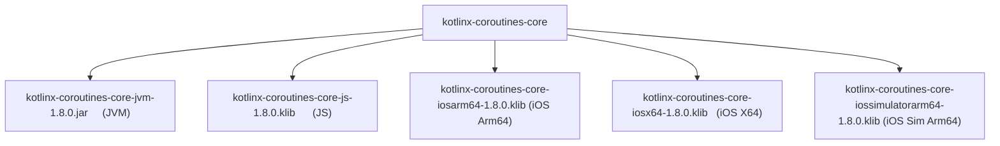
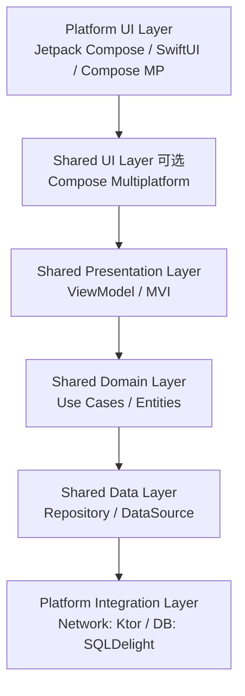
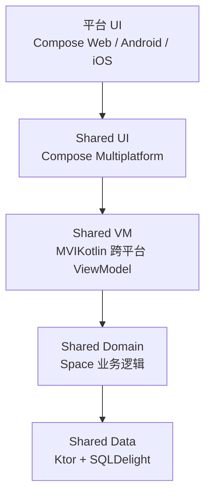
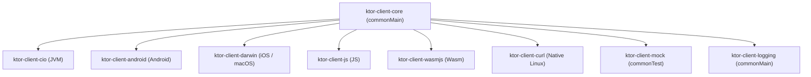
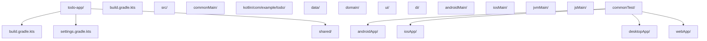

# Kotlin 跨平台（Kotlin Multiplatform）

## 前置知识

- [协程异常处理](/kotlin/053-CoroutineExceptionHandling)：建议先完成前一篇的学习

## 学习目标

- 掌握「1. 历史动机与发展脉络」的核心机制、典型用法与常见陷阱
- 掌握「2. 形式化定义」的核心机制、典型用法与常见陷阱
- 掌握「3. 理论推导与原理解析」的核心机制、典型用法与常见陷阱
- 掌握「4. 代码示例」的核心机制、典型用法与常见陷阱
- 掌握「5. 对比分析」的核心机制、典型用法与常见陷阱


> 本文档对标 MIT 6.005、Stanford CS193P、CMU 15-410 教学水准，系统讲解 Kotlin Multiplatform（KMP）从设计哲学到编译器后端实现的完整链路。内容覆盖 Kotlin/JVM、Kotlin/JS、Kotlin/Native、Kotlin/Wasm 四大目标平台，配套企业级生产代码、跨语言对比、形式化推导与习题解析。

## 1. 历史动机与发展脉络

### 1.1 问题背景：跨平台开发的工程困境

移动应用开发长期面临一个核心矛盾：**业务逻辑的跨平台共享** 与 **原生 UI 体验** 的取舍。在 KMP 出现之前，主流方案可分为三类：

**方案一：Web 混合应用（Cordova / Ionic）**

- 优势：开发成本低，一套代码三端运行。
- 劣势：性能差、用户体验割裂、原生能力受限。

**方案二：JavaScript 桥接框架（React Native / Weex）**

- 优势：UI 接近原生体验，逻辑跨平台共享。
- 劣势：JS Bridge 通信开销、内存占用高、原生调试困难、版本升级阵痛。

**方案三：自绘引擎（Flutter / Qt）**

- 优势：UI 完全一致、性能接近原生。
- 劣势：包体积增加（自绘引擎）、原生组件集成复杂（如 WebView、地图）、平台特性滞后。

Kotlin Multiplatform 提出了第四种范式：**共享业务逻辑、保留原生 UI**。这种"中间路线"的核心动机是：

1. **复用核心代码**：网络、数据、业务规则等"无 UI 依赖"的代码跨平台复用。
2. **保留原生 UI**：Android 用 Jetpack Compose，iOS 用 SwiftUI，桌面用 Compose Desktop 或 JavaFX。
3. **零桥接开销**：Kotlin/Native 直接编译为原生二进制，无运行时虚拟机、无 JS Bridge。
4. **生态统一**：Java/Kotlin 库可在 JVM 平台直接复用，C/C++ 库可通过 cinterop 在 Native 平台复用。

### 1.2 学术背景：多平台语言研究

KMP 的理论基础来自编程语言理论中的**多目标编译**（Multi-Target Compilation）与**目标无关中间表示**（Target-Independent IR）研究：

- **ML 家族的 FLINT / SML/NJ**：早期探索多后端编译的函数式语言。
- **Rust 的 LLVM 后端**：通过 LLVM IR 支持多平台，证明"统一中间表示 + 多目标代码生成"的可行性。
- **Swift 的 SIL（Swift Intermediate Language）**：苹果为 Swift 设计的中间表示，支持高级优化。
- **WebAssembly（Wasm）**：W3C 标准的字节码格式，提供可移植的运行时目标。

Kotlin 的设计借鉴了上述经验，提出了**统一前端 + 多后端 IR** 的架构：

1. **统一前端**：所有平台共享 Kotlin 语法解析、类型检查、FIR（Frontend Intermediate Representation）。
2. **平台后端**：JVM 后端生成 `.class`/`.jar`，JS 后端生成 `.js`，Native 后端生成 LLVM IR，Wasm 后端生成 `.wasm`。
3. **跨平台 IR**：K2 编译器统一了所有后端的 IR，便于跨平台优化与一致性。

### 1.3 Kotlin 1.0（2016 年 2 月）：Kotlin/JVM 首发

Kotlin 1.0 仅支持 JVM 平台，但其语言设计已经为后续的多平台扩展预留了空间：

- 显式的 `package` 与 `import` 机制，便于跨模块共享。
- 严格的类型系统，便于静态分析。
- 与 Java 完全互操作，复用 JVM 生态。

此时跨平台能力由 `kotlin-platform` 实验性模块承担，但未正式发布。

### 1.4 Kotlin 1.1（2017 年 5 月）：JVM / JS 双平台

Kotlin 1.1 正式引入 Kotlin/JS 作为 Beta 平台：

```kotlin
// Kotlin 1.1
fun main(args: Array<String>) {
    println("Hello from Kotlin/JS")
}
```

此时 Kotlin/JS 通过 Kotlin 编译器直接生成 JavaScript（UMD 模块），可运行于 Node.js 与浏览器。但存在诸多限制：

- 不能直接调用 JavaScript 库（需手动 `external` 声明）。
- 产物体积大（包含完整的 Kotlin 运行时）。
- 缺乏 Tree-shaking 支持。

### 1.5 Kotlin 1.2（2017 年 11 月）：多平台项目雏形

Kotlin 1.2 引入了**多平台项目**（Multiplatform Projects）的实验性特性：

```kotlin
// 早期 expect/actual 语法
expect class Platform() {
    val name: String
}

actual class Platform {
    actual val name: String = "JVM"
}
```

此时多平台项目仅支持 JVM + JS，且 API 不稳定。但已确立 `expect`/`actual` 的核心机制。

### 1.6 Kotlin 1.3（2018 年 10 月）：Kotlin/Native 加入

Kotlin 1.3 将 Kotlin/Native 提升至 Beta，多平台项目正式支持三大目标：JVM、JS、Native。同时引入协程 GA，为跨平台异步编程奠定基础。

Kotlin/Native 的核心特性：

1. 基于 LLVM 9.0（后续升级至 11、14）。
2. 编译为原生可执行文件或动态库（`.so`、`.dylib`、`.dll`）。
3. 旧内存管理器：基于 ARC（自动引用计数）+ 工作线程隔离。
4. 通过 `cinterop` 工具调用 C/C++ 库。

### 1.7 Kotlin 1.4（2020 年 8 月）：多平台项目稳定化

Kotlin 1.4 将多平台项目提升为稳定状态（Alpha → Beta → Stable），并引入：

1. **层级源集（Hierarchical Source Sets）**：支持 `intermediateMain`、`iosArm64Main` 等中间源集，便于按平台族组织代码。
2. **默认目标层级**：`androidMain`、`iosMain`、`jvmMain`、`jsMain` 等开箱即用。
3. **Kotlin/JS IR 编译器**：引入基于 IR 的新编译器，支持 Tree-shaking、减小产物体积。
4. **Kotlin/Native 与 SwiftUI 互操作**：通过 `@ObjCName` 注解暴露 Kotlin 类给 Swift。

### 1.8 Kotlin 1.5（2021 年 5 月）：Kotlin/JS IR 默认

Kotlin 1.5 将 Kotlin/JS IR 编译器设为默认（仍可回退到旧编译器），并引入：

1. **`@JsExport` 注解**：显式导出 Kotlin 函数为 JavaScript API。
2. **`@JsModule` 注解**：声明 Kotlin 模块依赖的 npm 包。
3. **更激进的 Tree-shaking**：移除未使用的 Kotlin 标准库代码。
4. **`kotlinx-nodejs` 实验性支持**：直接调用 Node.js API。

### 1.9 Kotlin 1.6-1.7（2021-2022 年）：Kotlin/Native 新内存管理器

Kotlin 1.6 引入了 Kotlin/Native 新内存管理器（New Memory Manager）的实验版本，1.7.20 提升为 Beta，1.9 默认启用。新内存管理器的核心改进：

1. **移除线程隔离**：允许工作线程间自由共享对象（旧版限制工作线程只能访问自己的对象堆）。
2. **与 JVM 一致性**：对象生命周期、GC 行为更接近 JVM，便于 `commonMain` 代码跨平台一致。
3. **支持 Compose Multiplatform iOS**：新内存管理器是 Compose iOS 的前置条件。
4. **移除 ` freezes` API**：旧版的 `freeze()`、`isFrozen` 等手动冻结 API 被废弃。

### 1.10 Kotlin 1.8-1.9（2023 年）：Kotlin/Wasm 实验性

Kotlin 1.8 引入 Kotlin/Wasm（WebAssembly）的实验版本，1.9.20 提升为 Alpha：

```kotlin
// build.gradle.kts
wasm {
    binaries.executable()
}
```

Kotlin/Wasm 的核心特性：

1. 基于 WasmGC 提案（Garbage Collection），无需自带 GC。
2. 启动速度优于 Kotlin/JS（字节码预编译）。
3. 产物体积小（无运行时虚拟机）。
4. 与浏览器 `import.meta` 集成，支持 ES 模块。

### 1.11 Kotlin 2.0（2024 年 5 月）：K2 与 KMP 全面成熟

Kotlin 2.0 是 KMP 发展的里程碑：

1. **K2 编译器 GA**：统一前端、更快的编译、更好的诊断。
2. **KMP Stable**：多平台项目从 Beta 提升为 Stable。
3. **Compose Multiplatform iOS Stable**：iOS 上使用 Compose 正式可用。
4. **Kotlin/Wasm Beta**：从 Alpha 提升至 Beta。
5. **Expect/Actual 改进**：支持 `expect` 属性、`expect` 类型别名、更严格的签名校验。

### 1.12 JetBrains 的设计哲学

JetBrains 在设计 KMP 时遵循了以下哲学：

1. **原生优先**：每个平台都应获得"一等公民"级别的性能与体验，不应为跨平台妥协。
2. **渐进式采用**：可从单个模块（如网络层）开始共享，逐步扩展至业务逻辑、UI 层。
3. **编译期安全**：`expect`/`actual` 在编译期校验签名一致性，运行时无反射开销。
4. **互操作优先**：与平台原生生态无缝集成：JVM 与 Java 互操作、JS 与 npm/DOM 互操作、Native 与 C/Swift 互操作。
5. **生态开放**：标准库（`kotlinx.coroutines`、`kotlinx.serialization`）跨平台一致，第三方库（Ktor、SQLDelight）支持 KMP。
6. **不锁定技术栈**：UI 层可选 Compose Multiplatform、SwiftUI、Jetpack Compose、React 等，业务逻辑层独立。

### 1.13 时间线总览

```
2010  Kotlin 项目启动
2016  Kotlin 1.0 — 仅支持 JVM
2017  Kotlin 1.1 — Kotlin/JS Beta
2017  Kotlin 1.2 — 多平台项目实验性
2018  Kotlin 1.3 — Kotlin/Native Beta，多平台三端齐备
2020  Kotlin 1.4 — 多平台项目 Stable，JS IR 编译器
2021  Kotlin 1.5 — JS IR 默认，@JsExport
2022  Kotlin 1.7 — Kotlin/Native 新内存管理器 Beta
2023  Kotlin 1.8 — Kotlin/Wasm 实验性
2023  Kotlin 1.9.20 — Kotlin/Wasm Alpha，KMP Beta
2024  Kotlin 2.0 — K2 GA，KMP Stable，Compose iOS Stable，Wasm Beta
```

---

## 2. 形式化定义

### 2.1 多平台项目的 Gradle 模型

根据 Kotlin 官方文档，KMP 项目的 Gradle 配置可形式化定义如下：

$$
\text{KMPProject} ::= \text{Plugins} \;\text{Targets} \;\text{SourceSets} \;\text{Dependencies}
$$

其中：

- $\text{Plugins}$：包含 `org.jetbrains.kotlin.multiplatform` 插件，可选 `org.jetbrains.kotlin.plugin.serialization`、`com.android.application` 等。
- $\text{Targets}$：编译目标列表，如 `jvm()`、`js()`、`iosX64()`、`iosArm64()`、`iosSimulatorArm64()`、`wasmJs()`。
- $\text{SourceSets}$：源集层次结构，包含 `commonMain`、`jvmMain`、`iosMain` 等。
- $\text{Dependencies}$：依赖配置，分为 `commonMain` 依赖、平台特定依赖、`androidMain` 实现。

### 2.2 源集层次结构（Hierarchical Source Sets）

KMP 的源集层次结构是一棵树：

$$
\text{SourceSetTree} ::= \text{commonMain} \to \big\{\text{jvmMain}, \text{jsMain}, \text{nativeMain}, \text{wasmJsMain}\big\}
$$

其中 $\text{nativeMain}$ 又可细分：

$$
\text{nativeMain} \to \big\{\text{appleMain}, \text{linuxMain}, \text{mingwMain}\big\}
$$

进一步：

$$
\text{appleMain} \to \big\{\text{iosMain}, \text{macosMain}, \text{tvosMain}, \text{watchosMain}\big\}
$$

最终：

$$
\text{iosMain} \to \big\{\text{iosArm64Main}, \text{iosX64Main}, \text{iosSimulatorArm64Main}\big\}
$$

形式化地，源集树是一个有向无环图（DAG），每个子源集继承父源集的所有源文件与依赖。

### 2.3 Expect/Actual 机制的形式化

`expect`/`actual` 是 KMP 的核心抽象机制。其形式化定义：

对于 `expect` 声明 $E : \sigma$（签名 $\sigma$），存在 `actual` 声明 $A_i : \sigma_i$ 对应每个平台 $P_i$，满足：

$$
\forall P_i \in \text{Targets}, \;\exists A_i \;\text{s.t.}\; \text{match}(E, A_i) = \text{true}
$$

其中 $\text{match}$ 函数校验：

1. **名称一致**：`expect fun foo()` 对应 `actual fun foo()`。
2. **签名一致**：参数类型、返回类型、可见性修饰符匹配。
3. **类型参数一致**：泛型参数数量与约束一致。
4. **`@Throws` 一致**：声明的异常表一致（JVM 平台）。

### 2.4 平台声明的语义

`expect` 声明在 `commonMain` 中只是一个**契约**（Contract），不包含实现。其语义：

$$
\text{eval}(\text{expect}\;f) = \bot \quad \text{(undefined in commonMain)}
$$

在编译期，`expect` 声明被解析为符号引用；在链接期（每个平台单独链接），编译器查找对应的 `actual` 实现并绑定。

形式化地，对于调用 `expect fun foo(): Int`：

$$
\text{compile}(\text{foo}()) = \text{SymbolRef}(\text{foo})
$$

$$
\text{link}_{P_i}(\text{SymbolRef}(\text{foo})) = A_i
$$

### 2.5 Kotlin/Native 编译流水线

Kotlin/Native 的编译流水线可形式化为：

$$
\text{Source} \xrightarrow{\text{Frontend}} \text{FIR} \xrightarrow{\text{Backend}} \text{KtIR} \xrightarrow{\text{NativeLowering}} \text{LLVM IR} \xrightarrow{\text{LLVM}} \text{Object} \xrightarrow{\text{Linker}} \text{Binary}
$$

各阶段职责：

- $\text{Frontend}$：解析 Kotlin 源码，生成 FIR（Frontend IR）。
- $\text{Backend}$：将 FIR 转换为 Kotlin IR（KtIR），进行平台无关优化。
- $\text{NativeLowering}$：将 KtIR 降低为 LLVM IR，处理平台特定语义。
- $\text{LLVM}$：LLVM 编译器优化与代码生成，产出 Object 文件。
- $\text{Linker}$：链接器（ld、lld）合并 Object 文件，生成可执行文件或动态库。

### 2.6 Kotlin/JS 编译流水线

Kotlin/JS 的编译流水线（IR 编译器）：

$$
\text{Source} \xrightarrow{\text{Frontend}} \text{FIR} \xrightarrow{\text{Backend}} \text{KtIR} \xrightarrow{\text{JsLowering}} \text{JS AST} \xrightarrow{\text{Generator}} \text{JS Source}
$$

各阶段职责：

- $\text{JsLowering}$：将 KtIR 降低为 JavaScript AST，处理闭包、原型链、`this` 绑定。
- $\text{Generator}$：从 AST 生成 JavaScript 源码（或直接字节码），输出 `.js` 文件。
- **可选步骤**：通过 Webpack 或 esbuild 打包，进行 Tree-shaking 与压缩。

### 2.7 Kotlin/Wasm 编译流水线

Kotlin/Wasm 的编译流水线：

$$
\text{Source} \xrightarrow{\text{Frontend}} \text{FIR} \xrightarrow{\text{Backend}} \text{KtIR} \xrightarrow{\text{WasmLowering}} \text{Wasm Module} \xrightarrow{\text{GC Pass}} \text{WasmGC Binary}
$$

关键特性：

- $\text{Wasm Module}$：标准的 WebAssembly 模块结构（Section、Function、Table、Memory）。
- $\text{GC Pass}$：基于 WasmGC 提案的垃圾回收，无需自带 GC（依赖宿主环境）。

### 2.8 与其他跨平台方案的形式化对比

| 维度 | KMP | React Native | Flutter | Qt |
|------|-----|--------------|---------|-----|
| 共享范围 | 业务逻辑 | 业务逻辑 + UI | 全栈 | 全栈 |
| UI 实现 | 原生 | JS Bridge 渲染 | 自绘引擎 | 自绘引擎 |
| 运行时 | 编译为原生 | JS 引擎 + Bridge | Dart VM + Skia | C++ 运行时 |
| 性能 | 接近原生 | 中（Bridge 开销） | 接近原生 | 接近原生 |
| 包体积增量 | 小（<1MB） | 中（~10MB） | 大（~20MB） | 大（~50MB） |
| 互操作 | 编译期 | 运行时 | 编译期 | 编译期 |

形式化地，跨平台方案的可共享代码量 $S$ 与运行时性能 $P$ 之间存在权衡：

$$
S \cdot P \leq K \quad \text{(K 为常数，取决于方案)}
$$

KMP 选择了高 $P$、中 $S$ 的组合。

---

## 3. 理论推导与原理解析

### 3.1 源集继承的代数模型

源集层次结构可以形式化为偏序集（Partial Order Set）：

$$
(\text{SourceSets}, \preceq)
$$

其中 $A \preceq B$ 表示 $A$ 是 $B$ 的祖先（即 $B$ 继承 $A$ 的源文件）。例如：

$$
\text{commonMain} \preceq \text{iosMain} \preceq \text{iosArm64Main}
$$

源集的合并（Merge）操作：

$$
\text{Merge}(A, B) = A \cup B \cup \text{Ancestors}(A) \cup \text{Ancestors}(B)
$$

例如，编译 `iosArm64Main` 时，编译器会合并：

```
commonMain + nativeMain + appleMain + iosMain + iosArm64Main
```

这五层源集的源文件共同构成最终的编译单元。

### 3.2 Expect/Actual 的类型检查

考虑以下 `expect`/`actual` 声明：

```kotlin
// commonMain
expect class DateProvider() {
    fun now(): Long
}

// jvmMain
actual class DateProvider {
    actual fun now(): Long = System.currentTimeMillis()
}

// iosMain
actual class DateProvider {
    actual fun now(): Long = NSDate().timeIntervalSince1970.toLong() * 1000
}
```

类型检查规则：

1. **`commonMain` 中的 `expect` 必须有 `actual`**：否则编译错误 `Expected declaration 'DateProvider' has no actual declaration in module ... for target JVM`。
2. **签名必须匹配**：`actual` 的参数列表、返回类型、可见性必须与 `expect` 一致。
3. **类型可兼容**：返回类型在跨平台时需满足"最具体超类型"规则。

形式化地：

$$
\text{TypeCheck}_{P_i}(\text{expect}, \text{actual}) = \text{match}(\sigma_{\text{expect}}, \sigma_{\text{actual}}^{P_i})
$$

### 3.3 跨平台类型映射

KMP 标准库在 `commonMain` 中定义的 `kotlin.*` 类型，在各平台有不同的底层实现：

| Kotlin 类型 | JVM 平台 | JS 平台 | Native 平台 | Wasm 平台 |
|------|---------|---------|------------|-----------|
| `Int` | `int` | `number` | `int32_t` | `i32` |
| `Long` | `long` | `BigInt`（实验性） | `int64_t` | `i64` |
| `String` | `java.lang.String` | `string` | `KString` | `externref` |
| `List<T>` | `java.util.List` | `Array` | `KList` | 内置类型 |
| `Array<T>` | `T[]` | `Array` | `KArray` | 内置类型 |

形式化地，类型映射可以表示为函数 $\text{Map}_{P_i} : \text{KotlinType} \to \text{PlatformType}$：

$$
\text{Map}_{\text{JVM}}(\text{Int}) = \text{int}
$$

$$
\text{Map}_{\text{JS}}(\text{Int}) = \text{number}
$$

### 3.4 Kotlin/Native 内存模型

Kotlin/Native 的新内存管理器（1.9+ 默认）采用**全局垃圾回收器**：

1. **堆（Heap）**：所有工作线程共享一个全局堆。
2. **GC 算法**：基于 Immix 的标记-清除（Mark-Sweep）+ 复制（Copy）。
3. **对象布局**：每个对象有头部（Header）+ 字段（Fields），头部包含 GC 标记位。
4. **线程本地分配缓冲区（TLAB）**：每个工作线程有自己的 TLAB，减少锁竞争。

形式化地，对象的生命周期：

$$
\text{Lifetime}(o) = \text{Reachable}(o, \text{Roots})
$$

其中 $\text{Roots}$ 是 GC 根集合（栈变量、全局变量、寄存器）。新内存管理器移除了旧版的"线程隔离"约束，允许对象在任意线程间自由传递。

### 3.5 Kotlin/JS IR 与 Tree-shaking

Kotlin/JS IR 编译器的 Tree-shaking 算法：

1. **入口点（Entry Point）**：标记为 `@JsExport` 的函数、`main` 函数。
2. **可达性分析（Reachability Analysis）**：从入口点出发，标记所有可达的函数、类、属性。
3. **死代码消除（Dead Code Elimination）**：移除不可达的代码。
4. **名称混淆（Name Mangling）**：对内部函数重命名为短名，减小体积。

形式化地：

$$
\text{Reachable} = \text{fix}(\lambda S. S \cup \text{Callees}(S))(\text{EntryPoints})
$$

$$
\text{Output} = \text{Reachable} \setminus \text{Unreachable}
$$

实测数据：Kotlin/JS IR 编译器相对旧编译器可减小 30%-50% 的产物体积。

### 3.6 互操作：Kotlin/Native 与 C

Kotlin/Native 通过 `cinterop` 工具调用 C 库：

```kotlin
// build.gradle.kts
kotlin {
    val nativeMain by creating
    val linuxX64Main by getting {
        cinterops {
            val libcurl by creating {
                defFile("src/nativeInterop/cinterop/libcurl.def")
            }
        }
    }
}
```

`libcurl.def` 文件示例：

```
headers = curl/curl.h
headerFilter = curl/*
linkerOpts.linux = -lcurl
```

编译器生成的 Kotlin 绑定：

```kotlin
// 自动生成
object libcurl {
    fun curl_easy_init(): COpaquePointer
    fun curl_easy_setopt(handle: COpaquePointer, opt: CURLoption, vararg args: Any?): CURLcode
    fun curl_easy_cleanup(handle: COpaquePointer)
}
```

形式化地，C 函数 `curl_easy_init()` 与 Kotlin 绑定的映射：

$$
\text{C} \; \text{CURL* curl_easy_init()} \;\;\xrightarrow{\text{cinterop}}\;\; \text{Kotlin} \; \text{fun curl_easy_init(): COpaquePointer}
$$

### 3.7 互操作：Kotlin/JS 与 JavaScript

Kotlin/JS 通过 `external` 修饰符调用 JavaScript：

```kotlin
// 调用 console.log
external fun consoleLog(message: String)

external interface JQuery {
    fun text(value: String): JQuery
}

@JsModule("jquery")
external fun jq(selector: String): JQuery
```

编译为 JavaScript：

```javascript
function consoleLog(message) {
    console.log(message);
}
// jq 通过 import 引入
import jq from "jquery";
```

形式化地：

$$
\text{Kotlin} \; \text{external fun f()} \;\;\xrightarrow{\text{compile}}\;\; \text{JS} \; \text{import f from "<module>"}
$$

### 3.8 互操作：Kotlin/Native 与 Swift/Objective-C

Kotlin/Native 编译为 Apple 框架（Framework）后，可被 Swift 直接调用：

```kotlin
// Kotlin
@ObjCName("Greeter")
class Greeter {
    fun greet(name: String): String = "Hello, $name!"
}
```

Swift 调用：

```swift
// Swift
import MyKotlinFramework

let greeter = Greeter()
print(greeter.greet(name: "World"))
```

形式化地，Kotlin 类与 Objective-C 类的映射：

$$
\text{Kotlin class K} \;\;\xrightarrow{\text{compile}}\;\; \text{Objective-C class K} \;\;\xrightarrow{\text{bridging}}\;\; \text{Swift class K}
$$

### 3.9 Compose Multiplatform 编译路径

Compose Multiplatform 的编译流水线：

$$
\text{Composable} \xrightarrow{\text{Compose Compiler}} \text{KtIR with \$\$emit} \xrightarrow{\text{Platform Backend}} \text{Platform Code}
$$

- **Compose Compiler**：在 KtIR 阶段对 `@Composable` 函数进行变换，插入 `$$emit` 调用。
- **Platform Backend**：JVM 生成 `.class`，JS 生成 `.js`，Native 生成 LLVM IR，Wasm 生成 `.wasm`。

Compose Multiplatform 的核心抽象：

```kotlin
@Composable
fun Greeting(name: String) {
    Text("Hello, $name!")
}
```

编译为带状态机的 IR：

```kotlin
@Composable
fun Greeting(name: String, $composer: Composer, $changed: Int) {
    $composer.startGroup(...)
    Text("Hello, $name!", ...)
    $composer.endGroup(...)
}
```

### 3.10 跨平台依赖解析

KMP 的依赖解析在 Gradle 层完成：

```kotlin
// commonMain 依赖
val commonMain by getting {
    dependencies {
        implementation("org.jetbrains.kotlinx:kotlinx-coroutines-core:1.8.0")
        implementation("org.jetbrains.kotlinx:kotlinx-serialization-json:1.6.3")
    }
}
```

Gradle 会将 `kotlinx-coroutines-core` 解析为各平台的子构件：



形式化地：

$$
\text{Resolve}(\text{artifact}: GAV) = \big\{ \text{artifact}_{P_i} : P_i \in \text{Targets} \big\}
$$

---

## 4. 代码示例

### 4.1 最小化 KMP 项目结构

一个典型的 KMP 项目目录结构：

```mermaid
flowchart TD
    T0["my-app/"]
    T1["build.gradle.kts"]
    T2["settings.gradle.kts"]
    T3["shared/"]
    T4["build.gradle.kts"]
    T5["src/"]
    T6["commonMain/"]
    T7["kotlin/"]
    T8["com/example/shared/"]
    T9["Platform.kt"]
    T10["Calculator.kt"]
    T11["commonTest/"]
    T12["kotlin/"]
    T13["com/example/shared/"]
    T14["CalculatorTest.kt"]
    T15["androidMain/"]
    T16["kotlin/"]
    T17["com/example/shared/"]
    T18["Platform.android.kt"]
    T19["iosMain/"]
    T20["kotlin/"]
    T21["com/example/shared/"]
    T22["Platform.ios.kt"]
    T23["jvmMain/"]
    T24["kotlin/"]
    T25["com/example/shared/"]
    T26["Platform.jvm.kt"]
    T27["jsMain/"]
    T28["kotlin/"]
    T29["com/example/shared/"]
    T30["Platform.js.kt"]
    T31["androidApp/"]
    T32["iosApp/"]
    T33["desktopApp/"]
    T0 --> T1
    T0 --> T2
    T0 --> T3
    T30 --> T31
    T30 --> T32
    T30 --> T33
```



### 4.2 根 `build.gradle.kts`

```kotlin
// build.gradle.kts (root)
plugins {
    alias(kotlin.plugins.multiplatform) apply false
    alias(kotlin.plugins.compose) apply false
    alias(androidx.plugins.application) apply false
}
```

`settings.gradle.kts`：

```kotlin
// settings.gradle.kts
pluginManagement {
    repositories {
        google()
        mavenCentral()
        gradlePluginPortal()
    }
}

dependencyResolutionManagement {
    repositories {
        google()
        mavenCentral()
    }
}

include(":shared")
include(":androidApp")
include(":desktopApp")
```

### 4.3 `shared` 模块的 Gradle 配置

```kotlin
// shared/build.gradle.kts
plugins {
    kotlin("multiplatform")
    kotlin("plugin.serialization")
    id("com.android.library")
}

kotlin {
    // 目标平台配置
    androidTarget()
    jvm()
    js {
        browser()
        nodejs()
        binaries.executable()
    }
    iosX64()
    iosArm64()
    iosSimulatorArm64()

    // 层级源集
    sourceSets {
        commonMain {
            dependencies {
                implementation("org.jetbrains.kotlinx:kotlinx-coroutines-core:1.8.0")
                implementation("org.jetbrains.kotlinx:kotlinx-serialization-json:1.6.3")
                implementation("io.ktor:ktor-client-core:2.3.10")
            }
        }
        commonTest {
            dependencies {
                implementation(kotlin("test"))
                implementation("org.jetbrains.kotlinx:kotlinx-coroutines-test:1.8.0")
            }
        }
        androidMain {
            dependencies {
                implementation("io.ktor:ktor-client-android:2.3.10")
            }
        }
        iosMain {
            dependencies {
                implementation("io.ktor:ktor-client-darwin:2.3.10")
            }
        }
        jvmMain {
            dependencies {
                implementation("io.ktor:ktor-client-java:2.3.10")
            }
        }
        jsMain {
            dependencies {
                implementation("io.ktor:ktor-client-js:2.3.10")
            }
        }
    }
}

android {
    namespace = "com.example.shared"
    compileSdk = 34
    defaultConfig {
        minSdk = 24
    }
}
```

### 4.4 `expect`/`actual` 平台声明

`commonMain` 中的 `expect`：

```kotlin
// shared/src/commonMain/kotlin/com/example/shared/Platform.kt
package com.example.shared

expect class Platform() {
    val name: String
}

expect fun currentTimeMillis(): Long

expect fun randomUUID(): String

expect class AtomicRef<T>(value: T) {
    fun get(): T
    fun set(value: T)
    fun compareAndSet(expected: T, new: T): Boolean
}
```

JVM 平台的 `actual`：

```kotlin
// shared/src/jvmMain/kotlin/com/example/shared/Platform.jvm.kt
package com.example.shared

import java.util.UUID
import java.util.concurrent.atomic.AtomicReference

actual class Platform actual constructor() {
    actual val name: String = "JVM"
}

actual fun currentTimeMillis(): Long = System.currentTimeMillis()

actual fun randomUUID(): String = UUID.randomUUID().toString()

actual class AtomicRef<T> actual constructor(value: T) {
    private val delegate = AtomicReference(value)
    actual fun get(): T = delegate.get()
    actual fun set(value: T) = delegate.set(value)
    actual fun compareAndSet(expected: T, new: T): Boolean =
        delegate.compareAndSet(expected, new)
}
```

Android 平台的 `actual`：

```kotlin
// shared/src/androidMain/kotlin/com/example/shared/Platform.android.kt
package com.example.shared

import java.util.UUID
import java.util.concurrent.atomic.AtomicReference

actual class Platform actual constructor() {
    actual val name: String = "Android ${android.os.Build.VERSION.SDK_INT}"
}

actual fun currentTimeMillis(): Long = System.currentTimeMillis()

actual fun randomUUID(): String = UUID.randomUUID().toString()

actual class AtomicRef<T> actual constructor(value: T) {
    private val delegate = AtomicReference(value)
    actual fun get(): T = delegate.get()
    actual fun set(value: T) = delegate.set(value)
    actual fun compareAndSet(expected: T, new: T): Boolean =
        delegate.compareAndSet(expected, new)
}
```

iOS 平台的 `actual`：

```kotlin
// shared/src/iosMain/kotlin/com/example/shared/Platform.ios.kt
package com.example.shared

import platform.Foundation.NSDate
import platform.Foundation.timeIntervalSince1970
import platform.Foundation.NSUUID
import kotlin.native.concurrent.AtomicReference
import kotlin.native.concurrent.compareAndSet

actual class Platform actual constructor() {
    actual val name: String = "iOS"
}

actual fun currentTimeMillis(): Long =
    (NSDate().timeIntervalSince1970 * 1000).toLong()

actual fun randomUUID(): String = NSUUID().UUIDString()

actual class AtomicRef<T> actual constructor(value: T) {
    private val delegate = AtomicReference(value)
    actual fun get(): T = delegate.value
    actual fun set(value: T) { delegate.value = value }
    actual fun compareAndSet(expected: T, new: T): Boolean =
        delegate.compareAndSet(expected, new)
}
```

JS 平台的 `actual`：

```kotlin
// shared/src/jsMain/kotlin/com/example/shared/Platform.js.kt
package com.example.shared

external object crypto {
    fun randomUUID(): String
}

external fun jsDateNow(): Double

actual class Platform actual constructor() {
    actual val name: String = "JavaScript"
}

actual fun currentTimeMillis(): Long = jsDateNow().toLong()

actual fun randomUUID(): String = crypto.randomUUID()

actual class AtomicRef<T> actual constructor(value: T) {
    private var _value: T = value
    actual fun get(): T = _value
    actual fun set(value: T) { _value = value }
    actual fun compareAndSet(expected: T, new: T): Boolean {
        if (_value != expected) return false
        _value = new
        return true
    }
}
```

### 4.5 共享业务逻辑

`commonMain` 中的纯逻辑代码：

```kotlin
// shared/src/commonMain/kotlin/com/example/shared/Calculator.kt
package com.example.shared

class Calculator {
    private var result: Double = 0.0

    fun add(value: Double): Calculator {
        result += value
        return this
    }

    fun subtract(value: Double): Calculator {
        result -= value
        return this
    }

    fun multiply(value: Double): Calculator {
        result *= value
        return this
    }

    fun divide(value: Double): Calculator {
        require(value != 0.0) { "Cannot divide by zero" }
        result /= value
        return this
    }

    fun getResult(): Double = result

    fun reset(): Calculator {
        result = 0.0
        return this
    }
}
```

### 4.6 跨平台 HTTP 客户端

`commonMain` 中定义 HTTP 客户端接口：

```kotlin
// shared/src/commonMain/kotlin/com/example/shared/HttpClient.kt
package com.example.shared

import io.ktor.client.*
import io.ktor.client.request.*
import io.ktor.client.statement.*
import kotlinx.coroutines.Dispatchers
import kotlinx.coroutines.withContext
import kotlinx.serialization.Serializable
import kotlinx.serialization.json.Json

@Serializable
data class User(val id: Int, val name: String, val email: String)

class UserRepository(private val client: HttpClient) {
    private val json = Json { ignoreUnknownKeys = true }

    suspend fun getUser(id: Int): User = withContext(Dispatchers.Default) {
        val response: HttpResponse = client.get("https://api.example.com/users/$id")
        json.decodeFromString(response.bodyAsText())
    }

    suspend fun createUser(user: User): User = withContext(Dispatchers.Default) {
        val response: HttpResponse = client.post("https://api.example.com/users") {
            header("Content-Type", "application/json")
            setBody(json.encodeToString(User.serializer(), user))
        }
        json.decodeFromString(response.bodyAsText())
    }
}
```

各平台配置 `HttpClient`：

```kotlin
// shared/src/androidMain/kotlin/com/example/shared/HttpClientFactory.android.kt
package com.example.shared

import io.ktor.client.*
import io.ktor.client.engine.android.*

actual fun createHttpClient(): HttpClient = HttpClient(Android) {
    engineSettings {
        connectTimeout = 10_000
        socketTimeout = 10_000
    }
}
```

```kotlin
// shared/src/iosMain/kotlin/com/example/shared/HttpClientFactory.ios.kt
package com.example.shared

import io.ktor.client.*
import io.ktor.client.engine.darwin.*

actual fun createHttpClient(): HttpClient = HttpClient(Darwin) {
    engineSettings {
        connectTimeout = 10_000
        readTimeout = 10_000
    }
}
```

### 4.7 跨平台持久化（SQLDelight）

```kotlin
// shared/build.gradle.kts
kotlin {
    sourceSets {
        commonMain {
            dependencies {
                implementation("app.cash.sqldelight:runtime:2.0.1")
            }
        }
        androidMain {
            dependencies {
                implementation("app.cash.sqldelight:android-driver:2.0.1")
            }
        }
        iosMain {
            dependencies {
                implementation("app.cash.sqldelight:native-driver:2.0.1")
            }
        }
    }
}
```

`commonMain` 中的 `Database` 接口：

```kotlin
// shared/src/commonMain/kotlin/com/example/shared/Database.kt
package com.example.shared

import app.cash.sqldelight.db.SqlDriver

expect class DatabaseDriverFactory {
    fun createDriver(): SqlDriver
}
```

```kotlin
// shared/src/androidMain/kotlin/com/example/shared/DatabaseDriverFactory.android.kt
package com.example.shared

import android.content.Context
import app.cash.sqldelight.db.SqlDriver
import app.cash.sqldelight.driver.android.AndroidSqliteDriver

actual class DatabaseDriverFactory(private val context: Context) {
    actual fun createDriver(): SqlDriver =
        AndroidSqliteDriver(MyDatabase.Schema, context, "my.db")
}
```

```kotlin
// shared/src/iosMain/kotlin/com/example/shared/DatabaseDriverFactory.ios.kt
package com.example.shared

import app.cash.sqldelight.db.SqlDriver
import app.cash.sqldelight.driver.native.NativeSqliteDriver

actual class DatabaseDriverFactory {
    actual fun createDriver(): SqlDriver =
        NativeSqliteDriver(MyDatabase.Schema, "my.db")
}
```

### 4.8 跨平台日志门面

`commonMain` 中的日志接口：

```kotlin
// shared/src/commonMain/kotlin/com/example/shared/Logger.kt
package com.example.shared

enum class LogLevel { DEBUG, INFO, WARN, ERROR }

expect fun log(level: LogLevel, tag: String, message: String, throwable: Throwable? = null)

object Logger {
    fun d(tag: String, message: String) = log(LogLevel.DEBUG, tag, message)
    fun i(tag: String, message: String) = log(LogLevel.INFO, tag, message)
    fun w(tag: String, message: String, throwable: Throwable? = null) =
        log(LogLevel.WARN, tag, message, throwable)
    fun e(tag: String, message: String, throwable: Throwable? = null) =
        log(LogLevel.ERROR, tag, message, throwable)
}
```

JVM 实现：

```kotlin
// shared/src/jvmMain/kotlin/com/example/shared/Logger.jvm.kt
package com.example.shared

import java.util.logging.Level
import java.util.logging.Logger as JLogger

private val loggers = mutableMapOf<String, JLogger>()

actual fun log(level: LogLevel, tag: String, message: String, throwable: Throwable?) {
    val logger = loggers.getOrPut(tag) { JLogger.getLogger(tag) }
    val javaLevel = when (level) {
        LogLevel.DEBUG -> Level.FINE
        LogLevel.INFO -> Level.INFO
        LogLevel.WARN -> Level.WARNING
        LogLevel.ERROR -> Level.SEVERE
    }
    if (throwable != null) {
        logger.log(javaLevel, message, throwable)
    } else {
        logger.log(javaLevel, message)
    }
}
```

Android 实现：

```kotlin
// shared/src/androidMain/kotlin/com/example/shared/Logger.android.kt
package com.example.shared

import android.util.Log

actual fun log(level: LogLevel, tag: String, message: String, throwable: Throwable?) {
    when (level) {
        LogLevel.DEBUG -> Log.d(tag, message, throwable)
        LogLevel.INFO -> Log.i(tag, message, throwable)
        LogLevel.WARN -> Log.w(tag, message, throwable)
        LogLevel.ERROR -> Log.e(tag, message, throwable)
    }
}
```

iOS 实现：

```kotlin
// shared/src/iosMain/kotlin/com/example/shared/Logger.ios.kt
package com.example.shared

import platform.Foundation.NSLog

actual fun log(level: LogLevel, tag: String, message: String, throwable: Throwable?) {
    val prefix = when (level) {
        LogLevel.DEBUG -> "D"
        LogLevel.INFO -> "I"
        LogLevel.WARN -> "W"
        LogLevel.ERROR -> "E"
    }
    val formatted = "[$prefix] $tag: $message"
    if (throwable != null) {
        NSLog("$formatted\n${throwable.stackTraceToString()}")
    } else {
        NSLog(formatted)
    }
}
```

JS 实现：

```kotlin
// shared/src/jsMain/kotlin/com/example/shared/Logger.js.kt
package com.example.shared

external fun consoleLog(level: String, message: String)

actual fun log(level: LogLevel, tag: String, message: String, throwable: Throwable?) {
    val levelStr = when (level) {
        LogLevel.DEBUG -> "debug"
        LogLevel.INFO -> "info"
        LogLevel.WARN -> "warn"
        LogLevel.ERROR -> "error"
    }
    val formatted = "[$tag] $message"
    consoleLog(levelStr, formatted)
    throwable?.let { consoleLog(levelStr, it.toString()) }
}
```

### 4.9 Compose Multiplatform UI

```kotlin
// shared/src/commonMain/kotlin/com/example/shared/ui/App.kt
package com.example.shared.ui

import androidx.compose.foundation.layout.*
import androidx.compose.foundation.text.BasicText
import androidx.compose.runtime.*
import androidx.compose.ui.Modifier
import androidx.compose.ui.unit.dp

@Composable
fun CounterApp() {
    var count by remember { mutableStateOf(0) }

    Column(
        modifier = Modifier.padding(16.dp),
        verticalArrangement = Arrangement.spacedBy(8.dp)
    ) {
        BasicText("Count: $count")
        Button(onClick = { count++ }) {
            BasicText("Increment")
        }
        Button(onClick = { count-- }) {
            BasicText("Decrement")
        }
        Button(onClick = { count = 0 }) {
            BasicText("Reset")
        }
    }
}

@Composable
expect fun Button(onClick: () -> Unit, content: @Composable () -> Unit)
```

Android 实现：

```kotlin
// shared/src/androidMain/kotlin/com/example/shared/ui/Button.android.kt
package com.example.shared.ui

import androidx.compose.material.Button
import androidx.compose.runtime.Composable

@Composable
actual fun Button(onClick: () -> Unit, content: @Composable () -> Unit) {
    Button(onClick = onClick, content = content)
}
```

iOS 实现：

```kotlin
// shared/src/iosMain/kotlin/com/example/shared/ui/Button.ios.kt
package com.example.shared.ui

import androidx.compose.foundation.layout.PaddingValues
import androidx.compose.ui.unit.dp
import androidx.compose.material.Button
import androidx.compose.runtime.Composable

@Composable
actual fun Button(onClick: () -> Unit, content: @Composable () -> Unit) {
    Button(
        onClick = onClick,
        content = content,
        contentPadding = PaddingValues(16.dp)
    )
}
```

### 4.10 跨平台协程测试

```kotlin
// shared/src/commonTest/kotlin/com/example/shared/CalculatorTest.kt
package com.example.shared

import kotlinx.coroutines.test.runTest
import kotlin.test.Test
import kotlin.test.assertEquals

class CalculatorTest {
    @Test
    fun testAdd() {
        val calculator = Calculator()
        val result = calculator.add(5.0).add(3.0).getResult()
        assertEquals(8.0, result)
    }

    @Test
    fun testDivideByZero() {
        val calculator = Calculator()
        try {
            calculator.divide(0.0)
            assert(false) { "Should throw exception" }
        } catch (e: IllegalArgumentException) {
            assertEquals("Cannot divide by zero", e.message)
        }
    }

    @Test
    fun testChain() = runTest {
        val calculator = Calculator()
        val result = calculator
            .add(10.0)
            .subtract(3.0)
            .multiply(2.0)
            .divide(7.0)
            .getResult()
        assertEquals(2.0, result, 0.0001)
    }
}
```

### 4.11 发布跨平台库

```kotlin
// shared/build.gradle.kts
plugins {
    kotlin("multiplatform")
    `maven-publish`
    signing
}

kotlin {
    jvm()
    js {
        browser()
        nodejs()
        binaries.executable()
    }
    iosArm64()
    iosX64()
    iosSimulatorArm64()
}

group = "com.example"
version = "1.0.0"

publishing {
    publications {
        publications.withType<MavenPublication> {
            pom {
                name.set("My Shared Library")
                description.set("A multiplatform library.")
                url.set("https://github.com/example/my-lib")
                licenses {
                    license {
                        name.set("Apache-2.0")
                        url.set("https://www.apache.org/licenses/LICENSE-2.0.txt")
                    }
                }
                developers {
                    developer {
                        id.set("fanquanpp")
                        name.set("Fan Quan")
                        email.set("contact@example.com")
                    }
                }
                scm {
                    url.set("https://github.com/example/my-lib")
                    connection.set("scm:git:git://github.com/example/my-lib.git")
                }
            }
        }
    }
    repositories {
        maven {
            url = uri("https://s01.oss.sonatype.org/service/local/staging/deploy/maven2/")
            credentials {
                username = System.getenv("OSSRH_USERNAME")
                password = System.getenv("OSSRH_PASSWORD")
            }
        }
    }
}

signing {
    useInMemoryPgpKeys(
        System.getenv("SIGNING_KEY_ID"),
        System.getenv("SIGNING_KEY"),
        System.getenv("SIGNING_PASSWORD")
    )
    sign(publishing.publications)
}
```

### 4.12 Kotlin/Wasm 配置

```kotlin
// shared/build.gradle.kts
kotlin {
    wasmJs {
        browser {
            testTask {
                useKarma {
                    useChromeHeadless()
                }
            }
        }
        nodejs()
        binaries.executable()
    }

    sourceSets {
        commonMain {
            dependencies {
                implementation("org.jetbrains.kotlinx:kotlinx-coroutines-core:1.8.0")
            }
        }
        wasmJsMain {
            dependencies {
                implementation("io.ktor:ktor-client-js:2.3.10")
            }
        }
    }
}
```

Wasm 主入口：

```kotlin
// shared/src/wasmJsMain/kotlin/com/example/shared/Main.wasm.kt
@OptIn(ExperimentalJsExport::class)
@JsExport
fun add(a: Int, b: Int): Int = a + b

@OptIn(ExperimentalJsExport::class)
@JsExport
fun main() {
    println("Hello from Kotlin/Wasm!")
}
```

HTML 宿主页：

```html
<!-- shared/src/wasmJsMain/resources/index.html -->
<!DOCTYPE html>
<html>
<head>
    <title>Kotlin/Wasm Demo</title>
</head>
<body>
    <script src="my-app.js"></script>
</body>
</html>
```

---

## 5. 对比分析

### 5.1 与 React Native 对比

| 维度 | Kotlin Multiplatform | React Native |
|------|---------------------|-------------|
| 共享范围 | 业务逻辑、数据层、UI（Compose Multiplatform） | 业务逻辑、UI（React 组件） |
| 语言 | Kotlin | JavaScript / TypeScript |
| 运行时 | 编译为原生代码 | JavaScript 引擎（Hermes / JSC） |
| UI 实现 | 原生（Jetpack Compose / SwiftUI）或 Compose Multiplatform | React 组件，原生渲染 |
| 通信开销 | 无（直接调用） | JS Bridge（异步消息传递） |
| 性能 | 接近原生 | 中等（Bridge 开销） |
| 包体积 | 小（<1MB 增量） | 中（~10MB JS 引擎 + RN 运行时） |
| 互操作 | 编译期类型安全 | 运行时类型不安全 |
| 调试体验 | 一致（Kotlin 全栈） | 割裂（JS / Native 切换） |
| 生态 | Kotlin/JVM + KMP 库 | npm + React 生态 |

**结论**：KMP 适合需要高性能、强类型、与原生深度集成的应用；React Native 适合 Web 团队快速迁移、生态丰富的场景。

### 5.2 与 Flutter 对比

| 维度 | Kotlin Multiplatform | Flutter |
|------|---------------------|---------|
| 共享范围 | 业务逻辑（可选 UI） | 全栈（UI + 逻辑） |
| 语言 | Kotlin | Dart |
| UI 实现 | 原生或 Compose Multiplatform | 自绘引擎（Skia / Impeller） |
| 渲染 | 平台原生 API | Canvas 绘制 |
| 性能 | 接近原生 | 接近原生 |
| 包体积 | 小 | 大（~20MB Flutter 引擎） |
| 平台集成 | 深度（编译期互操作） | 浅层（Platform Channel） |
| 学习曲线 | 中（需懂 Kotlin + 平台原生） | 低（单一 Dart） |
| 生态 | Java/JVM + 原生 | Flutter 包（pub.dev） |

**结论**：KMP 适合保留原生 UI 体验、深度集成平台特性的应用；Flutter 适合追求 UI 一致性、快速迭代的应用。

### 5.3 与 Java 多平台对比

| 维度 | Kotlin Multiplatform | Java（JVM 多平台） |
|------|---------------------|------------------|
| 目标平台 | JVM、JS、Native、Wasm | JVM（仅通过 JVM 跨平台） |
| UI | 原生 + Compose Multiplatform | JVM UI（JavaFX、Swing） |
| 包体积 | 小（Native 独立二进制） | 大（JVM 运行时） |
| 启动速度 | 快（Native 无 JVM 预热） | 慢（JVM 类加载） |
| 内存占用 | 低 | 高 |
| 互操作 | 编译期 + 运行时 | 运行时（JNI） |
| 生态 | Java + 原生 + KMP | Java 生态 |

**结论**：KMP 在保留 JVM 生态的同时扩展到非 JVM 平台（iOS、嵌入式、Wasm），是 Java 多平台的进化版。

### 5.4 与 C# 多平台对比

| 维度 | Kotlin Multiplatform | C#（.NET MAUI） |
|------|---------------------|-----------------|
| 共享范围 | 业务逻辑 + 可选 UI | 全栈 |
| 语言 | Kotlin | C# |
| 运行时 | 编译为原生 / JVM / JS / Wasm | .NET Runtime |
| 目标平台 | JVM、JS、Native、Wasm | Android、iOS、Windows、macOS |
| UI 实现 | 原生或 Compose | .NET MAUI 抽象层 |
| 互操作 | 编译期 + 平台 API | .NET 抽象 + 平台绑定 |
| 生态 | JVM + 原生 | .NET 生态 |

### 5.5 与 Swift 跨平台对比

| 维度 | Kotlin Multiplatform | Swift |
|------|---------------------|-------|
| 共享范围 | 多平台 | Apple 平台为主 |
| 语言 | Kotlin | Swift |
| 后端 | JVM、JS、LLVM、Wasm | LLVM |
| 平台 | Android、iOS、JVM、Web、Wasm | iOS、macOS、Linux、Windows（实验） |
| UI | Compose Multiplatform | SwiftUI |
| 互操作 | C/C++、Java、JavaScript、Swift/Objective-C | C/C++、Objective-C |

### 5.6 与 Rust 跨平台对比

| 维度 | Kotlin Multiplatform | Rust |
|------|---------------------|------|
| 共享范围 | 业务逻辑 + 可选 UI | 库 + CLI + 服务端 |
| 语言 | Kotlin | Rust |
| 后端 | JVM、JS、LLVM、Wasm | LLVM |
| 安全性 | 空安全 + 异常 | 所有权 + 借用检查 |
| 性能 | 接近原生 | 极致 |
| 学习曲线 | 中（与 Java 相似） | 高 |
| 互操作 | C/C++、Java、JS | C/C++（FFI） |
| 生态 | JVM + 原生 + Web | crates.io |

**总结**：KMP 与各方案的对比如下：

| 场景 | 推荐方案 |
|------|---------|
| Android + iOS 共享业务逻辑 | KMP |
| 跨平台 UI 一致性 | Flutter 或 Compose Multiplatform |
| Web + 原生共享 | KMP（JS/Wasm） |
| 嵌入式 / 服务端高性能 | Rust 或 Kotlin/Native |
| JVM 生态复用 | KMP（JVM） |

---

## 6. 常见陷阱与最佳实践

### 6.1 陷阱一：在 `commonMain` 中直接使用平台 API

**错误示例**：

```kotlin
// shared/src/commonMain/kotlin/com/example/shared/Time.kt
package com.example.shared

fun currentTime(): Long {
    // 错误：System.currentTimeMillis() 仅在 JVM 平台可用
    return System.currentTimeMillis()
}
```

**正确做法**：使用 `expect`/`actual`：

```kotlin
// commonMain
expect fun currentTime(): Long

// jvmMain
actual fun currentTime(): Long = System.currentTimeMillis()

// iosMain
actual fun currentTime(): Long = NSDate().timeIntervalSince1970.toLong() * 1000
```

### 6.2 陷阱二：`expect` 与 `actual` 签名不一致

**错误示例**：

```kotlin
// commonMain
expect fun parseDate(input: String): Date

// jvmMain
actual fun parseDate(input: String, format: String): Date {  // 错误：多了一个参数
    // ...
}
```

**正确做法**：保持签名完全一致：

```kotlin
// commonMain
expect fun parseDate(input: String): Date

// jvmMain
actual fun parseDate(input: String): Date {
    val format = SimpleDateFormat("yyyy-MM-dd")
    return format.parse(input)
}
```

### 6.3 陷阱三：在 `commonMain` 中使用 `java.*` 包

**错误示例**：

```kotlin
// commonMain
import java.util.Date  // 错误：java.util.Date 不可用

fun now(): Date = Date()
```

**正确做法**：使用 `kotlinx-datetime` 库（跨平台）：

```kotlin
// commonMain
import kotlinx.datetime.Instant

fun now(): Instant = Clock.System.now()
```

### 6.4 陷阱四：忘记为每个平台提供 `actual`

**错误示例**：定义 `expect` 但忘记为 iOS 提供 `actual`：

```kotlin
// commonMain
expect class FileStorage(path: String) {
    fun write(data: ByteArray)
    fun read(): ByteArray
}

// jvmMain
actual class FileStorage actual constructor(path: String) {
    // 实现
}

// 忘记 iosMain 的 actual
```

**结果**：编译 iOS 目标时报错 `Expected declaration 'FileStorage' has no actual declaration in module ... for target IOS_ARM64`。

**正确做法**：为所有目标平台提供 `actual`。

### 6.5 陷阱五：在 `commonMain` 中使用反射

**错误示例**：

```kotlin
// commonMain
fun <T> createInstance(clazz: Class<T>): T {  // 错误：Class<T> 仅在 JVM 可用
    return clazz.getDeclaredConstructor().newInstance()
}
```

**正确做法**：使用 `kotlinx.serialization` 或工厂模式：

```kotlin
// commonMain
interface Factory<T> {
    fun create(): T
}

fun <T> createInstance(factory: Factory<T>): T = factory.create()
```

### 6.6 陷阱六：忽略 Kotlin/Native 的新旧内存管理器差异

**旧内存管理器**（Kotlin 1.6 之前）：

```kotlin
// 旧版需要手动 freeze
val data = MyData().freeze()  // 跨线程传递前必须 freeze
```

**新内存管理器**（Kotlin 1.9+ 默认）：

```kotlin
// 新版无需 freeze，对象可自由跨线程传递
val data = MyData()
backgroundScope.launch {
    println(data)  // 合法
}
```

**正确做法**：升级到 Kotlin 1.9+ 后移除所有 `freeze()` 调用。

### 6.7 陷阱七：在 Kotlin/JS 中滥用 `external`

**错误示例**：

```kotlin
external fun anyJavaScriptFunction(): Any  // 类型不安全
```

**正确做法**：为 `external` 声明提供精确类型：

```kotlin
external interface User {
    val name: String
    val age: Int
}

external fun fetchUser(): Promise<User>
```

### 6.8 陷阱八：在 Kotlin/Native 中滥用全局状态

**错误示例**：

```kotlin
// 全局可变状态，多线程访问不安全
var globalCounter: Int = 0

fun increment() {
    globalCounter++
}
```

**正确做法**：使用原子引用或 `Mutex`：

```kotlin
import kotlin.native.concurrent.AtomicInt

val globalCounter = AtomicInt(0)

fun increment() {
    globalCounter.increment()
}
```

### 6.9 陷阱九：发布 KMP 库时遗漏平台构件

**错误示例**：发布时仅包含 JVM 构件，导致 iOS 用户无法使用。

**正确做法**：在 `build.gradle.kts` 中配置所有目标的发布：

```kotlin
publishing {
    publications {
        kotlin.targets.forEach { target ->
            target.artifacts.forEach { artifact ->
                // 确保所有构件都加入发布
            }
        }
    }
}
```

### 6.10 陷阱十：Compose Multiplatform 滥用 `expect` UI

**错误示例**：为每个平台写一份 Compose UI：

```kotlin
// commonMain
@Composable
expect fun MyButton(text: String, onClick: () -> Unit)

// androidMain
@Composable
actual fun MyButton(text: String, onClick: () -> Unit) {
    MaterialButton(...) { Text(text) }
}

// iosMain
@Composable
actual fun MyButton(text: String, onClick: () -> Unit) {
    CupertinoButton(...) { Text(text) }
}
```

**问题**：UI 实现重复，维护成本高。

**正确做法**：在 `commonMain` 中实现 UI，仅在必要时拆分：

```kotlin
// commonMain
@Composable
fun MyButton(text: String, onClick: () -> Unit) {
    Button(onClick = onClick) {
        Text(text)
    }
}
```

### 6.11 最佳实践总结

1. **业务逻辑在 `commonMain`**：将所有平台无关的逻辑放入 `commonMain`，最大化复用。
2. **平台 API 用 `expect`/`actual`**：仅对真正需要平台差异的代码使用 `expect`/`actual`。
3. **优先使用跨平台库**：`kotlinx-coroutines`、`kotlinx-serialization`、`kotlinx-datetime`、`Ktor`、`SQLDelight`。
4. **测试在 `commonTest`**：跨平台测试覆盖所有目标。
5. **避免 `java.*` 包**：`commonMain` 中禁止使用 `java.*`，仅在平台源集中使用。
6. **使用新内存管理器**：Kotlin 1.9+ 默认启用，避免使用旧版 `freeze`。
7. **Compose UI 优先共享**：尽量在 `commonMain` 中实现 UI，避免平台分叉。
8. **发布前检查平台构件**：使用 `./gradlew publishToMavenLocal` 验证所有平台构件。

---

## 7. 工程实践

### 7.1 项目分层架构

推荐的 KMP 项目分层架构：



### 7.2 共享 ViewModel

```kotlin
// shared/src/commonMain/kotlin/com/example/shared/viewmodel/UserViewModel.kt
package com.example.shared.viewmodel

import kotlinx.coroutines.CoroutineScope
import kotlinx.coroutines.Dispatchers
import kotlinx.coroutines.flow.MutableStateFlow
import kotlinx.coroutines.flow.StateFlow
import kotlinx.coroutines.launch

class UserViewModel(
    private val userRepository: UserRepository,
    private val scope: CoroutineScope = CoroutineScope(Dispatchers.Default)
) {
    private val _uiState = MutableStateFlow<UiState>(UiState.Loading)
    val uiState: StateFlow<UiState> = _uiState

    fun loadUser(id: Int) {
        scope.launch {
            _uiState.value = UiState.Loading
            try {
                val user = userRepository.getUser(id)
                _uiState.value = UiState.Success(user)
            } catch (e: Exception) {
                _uiState.value = UiState.Error(e.message ?: "Unknown error")
            }
        }
    }

    sealed class UiState {
        object Loading : UiState()
        data class Success(val user: User) : UiState()
        data class Error(val message: String) : UiState()
    }
}
```

### 7.3 Android 集成

```kotlin
// androidApp/src/main/java/com/example/android/MainActivity.kt
package com.example.android

import android.os.Bundle
import androidx.activity.ComponentActivity
import androidx.activity.compose.setContent
import androidx.compose.runtime.collectAsState
import com.example.shared.viewmodel.UserViewModel
import com.example.shared.ui.UserScreen

class MainActivity : ComponentActivity() {
    private val viewModel = UserViewModel(UserRepository(createHttpClient()))

    override fun onCreate(savedInstanceState: Bundle?) {
        super.onCreate(savedInstanceState)
        setContent {
            val state = viewModel.uiState.collectAsState()
            UserScreen(state.value, onRefresh = { viewModel.loadUser(1) })
        }
    }
}
```

### 7.4 iOS 集成（SwiftUI 调用 Kotlin）

发布 iOS Framework：

```kotlin
// shared/build.gradle.kts
kotlin {
    iosArm64 {
        binaries.framework {
            baseName = "Shared"
            isStatic = false
            export("dev.icerock.moko:mvvm-core:0.16.0")
        }
    }
}
```

SwiftUI 调用：

```swift
// iosApp/iOSApp.swift
import SwiftUI
import Shared

struct ContentView: View {
    @StateObject var viewModel = UserViewModelWrapper()

    var body: some View {
        NavigationView {
            VStack {
                switch viewModel.state {
                case .loading:
                    ProgressView()
                case .success(let user):
                    Text("User: \(user.name)")
                case .error(let message):
                    Text("Error: \(message)")
                }
            }
            .navigationTitle("User")
        }
    }
}

class UserViewModelWrapper: ObservableObject {
    @Published var state: UserViewModelUiState = .loading

    private let viewModel: UserViewModel

    init() {
        viewModel = UserViewModel(
            userRepository: UserRepository(client: HttpClientFactory().createHttpClient())
        )
        observeState()
        viewModel.loadUser(id: 1)
    }

    private func observeState() {
        // 通过 Kotlin Flow 的 collect 在 Swift 中观察状态
        viewModel.uiStateFlow.collect { [weak self] state in
            DispatchQueue.main.async {
                self?.state = state
            }
        }
    }
}
```

### 7.5 跨平台依赖注入

使用 Koin 实现跨平台 DI：

```kotlin
// shared/src/commonMain/kotlin/com/example/shared/di/DI.kt
package com.example.shared.di

import org.koin.core.context.startKoin
import org.koin.core.module.Module
import org.koin.dsl.module

fun initKoin(platformModule: Module) {
    startKoin {
        modules(commonModule, platformModule)
    }
}

val commonModule = module {
    single { createHttpClient() }
    single { UserRepository(get()) }
    single { UserViewModel(get()) }
}
```

平台模块：

```kotlin
// shared/src/androidMain/kotlin/com/example/shared/di/DI.android.kt
package com.example.shared.di

import org.koin.dsl.module

val androidModule = module {
    single { DatabaseDriverFactory(androidContext()) }
}
```

```kotlin
// androidApp
class MyApplication : Application() {
    override fun onCreate() {
        super.onCreate()
        initKoin(androidModule)
    }
}
```

### 7.6 测试策略

跨平台测试金字塔：

```
        /\
       /  \     E2E 测试（各平台单独）
      /----\
     /      \   集成测试（commonTest + 平台 test）
    /--------\
   /          \ 单元测试（commonTest）
  /____________\
```

示例单元测试：

```kotlin
// shared/src/commonTest/kotlin/com/example/shared/UserRepositoryTest.kt
package com.example.shared

import io.ktor.client.*
import io.ktor.client.engine.mock.*
import io.ktor.client.request.*
import io.ktor.http.*
import kotlinx.coroutines.test.runTest
import kotlin.test.Test
import kotlin.test.assertEquals

class UserRepositoryTest {
    @Test
    fun testGetUser() = runTest {
        val mockEngine = MockEngine { request ->
            respond(
                content = """{"id":1,"name":"Alice","email":"alice@example.com"}""",
                status = HttpStatusCode.OK,
                headers = headersOf("Content-Type", "application/json")
            )
        }
        val client = HttpClient(mockEngine)
        val repository = UserRepository(client)
        val user = repository.getUser(1)
        assertEquals("Alice", user.name)
    }
}
```

### 7.7 CI/CD 配置

GitHub Actions 多平台构建示例：

```yaml
# .github/workflows/build.yml
name: Build

on:
  push:
    branches: [main]
  pull_request:

jobs:
  build-jvm:
    runs-on: ubuntu-latest
    steps:
      - uses: actions/checkout@v4
      - uses: actions/setup-java@v4
        with:
          distribution: temurin
          java-version: 17
      - name: Build JVM
        run: ./gradlew jvmTest jvmJar

  build-js:
    runs-on: ubuntu-latest
    steps:
      - uses: actions/checkout@v4
      - uses: actions/setup-java@v4
        with:
          distribution: temurin
          java-version: 17
      - uses: actions/setup-node@v4
        with:
          node-version: 20
      - name: Build JS
        run: ./gradlew jsTest jsBrowserProductionWebpack

  build-ios:
    runs-on: macos-latest
    steps:
      - uses: actions/checkout@v4
      - uses: actions/setup-java@v4
        with:
          distribution: temurin
          java-version: 17
      - name: Build iOS
        run: ./gradlew iosX64Test iosX64Binaries

  build-android:
    runs-on: ubuntu-latest
    steps:
      - uses: actions/checkout@v4
      - uses: actions/setup-java@v4
        with:
          distribution: temurin
          java-version: 17
      - name: Build Android
        run: ./gradlew androidTest androidDebugBuild
```

### 7.8 性能调优

Kotlin/Native 编译优化：

```kotlin
// build.gradle.kts
kotlin {
    iosArm64 {
        binaries.executable {
            freeCompilerArgs += listOf(
                "-Xruntime-type=opt",
                "-Xgc=cms",
                "-Xallocator=mimalloc"
            )
        }
    }
}
```

Kotlin/JS 产物优化：

```kotlin
// build.gradle.kts
kotlin {
    js {
        browser {
            webpackTask {
                mode = productionMode
            }
        }
        binaries.executable()
        compilerOptions {
            freeCompilerArgs.addAll(
                listOf(
                    "-Xir-property-lazy-initialization",
                    "-Xg0"
                )
            )
        }
    }
}
```

---

## 8. 案例研究

### 8.1 案例一：JetBrains Space 跨平台架构

**背景**：JetBrains Space 是一个团队协作平台，支持 Web、Android、iOS、Desktop 多端。Space 团队采用 KMP 共享业务逻辑。

**架构**：



**共享代码比例**：约 70% 代码在 `commonMain`，30% 在平台源集。

**经验总结**：

1. 优先共享 VM 层，UI 层可分平台实现以获得最佳原生体验。
2. 使用 MVIKotlin 实现 MVI 架构，便于跨平台一致的状态管理。
3. Ktor + SQLDelight 是经过验证的数据层方案。
4. Compose Multiplatform 用于 Web 与 Desktop，移动端可选 SwiftUI/Jetpack Compose。

### 8.2 案例二：Netflix 跨平台数据分析

**背景**：Netflix 使用 KMP 在 Android、iOS 间共享数据分析 SDK，统一事件采集逻辑。

**架构**：

```kotlin
// commonMain
class AnalyticsClient(
    private val eventStore: EventStore,
    private val networkClient: NetworkClient,
    private val platformInfo: PlatformInfo
) {
    fun track(event: AnalyticsEvent) {
        val enriched = event.copy(
            platform = platformInfo.platformName,
            osVersion = platformInfo.osVersion,
            timestamp = currentTimeMillis()
        )
        eventStore.append(enriched)
    }

    fun flush() {
        // 批量上报到服务器
    }
}
```

**经验总结**：

1. 数据采集逻辑高度一致，KMP 共享率超过 90%。
2. 通过 `expect`/`actual` 注入平台特定信息（设备 ID、操作系统版本等）。
3. 与原生分析 SDK（Firebase Analytics、iOS Analytics）通过适配器模式集成。

### 8.3 案例三：Philips Health Suite 健康设备 SDK

**背景**：飞利浦健康套件使用 KMP 为 Android、iOS 共享蓝牙设备通信 SDK。

**架构**：

```kotlin
// commonMain
expect class BluetoothManager {
    fun scanForDevices(): List<BluetoothDevice>
    fun connect(device: BluetoothDevice): BluetoothConnection
    fun disconnect(connection: BluetoothConnection)
}

class HealthDeviceClient(private val bluetooth: BluetoothManager) {
    suspend fun readHeartRate(device: BluetoothDevice): Int {
        val connection = bluetooth.connect(device)
        // 读取心率数据
        return parseHeartRate(connection.read(0x2A37))
    }
}
```

**经验总结**：

1. 蓝牙协议（GATT）规范是跨平台的，业务逻辑可高度共享。
2. 平台特定的蓝牙 API（`android.bluetooth`、`CoreBluetooth`）通过 `expect`/`actual` 抽象。
3. 数据解析层（字节流到结构化数据）100% 跨平台。

### 8.4 案例四：VMware 跨平台管理工具

**背景**：VMware 使用 Kotlin/Native 构建跨平台 CLI 工具，运行于 Linux、macOS、Windows。

**架构**：

```kotlin
// main.kt
fun main(args: Array<String>) {
    val parser = ArgParser("vmctl")
    val vmId by parser.option(ArgType.String, description = "VM ID").required()
    val action by parser.option(ArgType.String, description = "Action").required()
    parser.parse(args)

    when (action) {
        "start" -> startVM(vmId)
        "stop" -> stopVM(vmId)
        "status" -> printStatus(vmId)
        else -> error("Unknown action: $action")
    }
}
```

**经验总结**：

1. Kotlin/Native 编译为单文件可执行程序，便于分发。
2. 通过 `clikt` 跨平台 CLI 库实现统一的命令行解析。
3. 使用 `kotlinx-serialization` 实现配置文件读写。

### 8.5 案例五：Ktor 官方多平台 HTTP 客户端

**背景**：Ktor Client 是 JetBrains 官方的跨平台 HTTP 客户端，支持 JVM、Android、iOS、JS、Wasm、Native。

**架构**：



**关键设计**：

```kotlin
// commonMain
expect class HttpClientEngineFactory<T : HttpClientEngineConfig> {
    fun create(block: T.() -> Unit): HttpClientEngine
}

class HttpClient(
    private val engine: HttpClientEngine,
    private val config: HttpClientConfig
) {
    suspend fun <T> get(url: String, block: HttpRequestBuilder.() -> Unit): T {
        // 跨平台 HTTP 请求逻辑
    }
}
```

**经验总结**：

1. 核心 HTTP 协议逻辑（重试、超时、编码、缓存）在 `commonMain`。
2. 平台特定的网络 API（OkHttp、NSURLSession、fetch、curl）通过 Engine 抽象。
3. 测试通过 `MockEngine` 实现跨平台一致。

---

### 填空题知识点讲解

**题目 2.1**：KMP 的四大编译目标分别是 ________、________、________、________。

**解析讲解**：JVM、JS、Native、Wasm

**解析讲解**：KMP 支持 JVM（Java 虚拟机）、JS（JavaScript，IR 编译器）、Native（LLVM 编译为原生二进制）、Wasm（WebAssembly）四大目标平台。

**题目 2.2**：KMP 项目中，`commonMain` 的源文件由所有平台共享，平台特定的源集命名规则是 ________。

**解析讲解**：`<platformName>Main`（如 `androidMain`、`iosMain`、`jvmMain`、`jsMain`）

**解析讲解**：KMP 的源集命名遵循 `<platformName>Main` / `<platformName>Test` 的规则，便于识别和管理。

**题目 2.3**：Kotlin/Native 的编译流水线为：Source → ________ → KtIR → ________ → Object → Binary。

**解析讲解**：FIR（Frontend IR）、LLVM IR

**解析讲解**：Kotlin/Native 的编译流水线：源码经前端解析为 FIR，再转换为 KtIR（Kotlin IR），然后降低为 LLVM IR，最终通过 LLVM 编译为 Object 文件，链接器合并为可执行文件。

**题目 2.4**：Kotlin/JS IR 编译器的 Tree-shaking 算法基于 ________ 分析，从 ________ 出发标记可达代码。

**解析讲解**：可达性（Reachability）、入口点（Entry Points，即 `@JsExport` 与 `main` 函数）

**解析讲解**：IR 编译器从 `@JsExport` 标注的函数与 `main` 函数出发，进行可达性分析，标记所有可达的代码，移除不可达代码以减小产物体积。

**题目 2.5**：KMP 的源集层次结构是一棵树，`commonMain` 是根，`iosMain` 的父节点是 ________，`iosArm64Main` 的父节点是 ________。

**解析讲解**：`nativeMain`（或 `appleMain`）、`iosMain`

**解析讲解**：源集层次：`commonMain` → `nativeMain` → `appleMain` → `iosMain` → `iosArm64Main`。每个子源集继承父源集的源文件与依赖。

### 编程题知识点讲解

**题目 3.1**：实现一个跨平台的 `FileLogger`，要求：

- `commonMain` 中定义 `FileLogger` 接口，提供 `log(message: String)` 方法。
- 各平台提供 `actual` 实现：
  - JVM：写入 `java.io.File`。
  - iOS：写入 `NSFileManager` 管理的文档目录。
  - JS：调用 `localStorage` 存储。

```kotlin
// commonMain
expect class FileLogger(filePath: String) {
    fun log(message: String)
    fun read(): List<String>
    fun clear()
}
```

**解析讲解**：

```kotlin
// commonMain
package com.example.shared

expect class FileLogger(filePath: String) {
    fun log(message: String)
    fun read(): List<String>
    fun clear()
}
```

```kotlin
// jvmMain
package com.example.shared

import java.io.File

actual class FileLogger actual constructor(private val filePath: String) {
    private val file = File(filePath)

    actual fun log(message: String) {
        file.appendText("${java.util.Date()}: $message\n")
    }

    actual fun read(): List<String> =
        if (file.exists()) file.readLines() else emptyList()

    actual fun clear() {
        file.writeText("")
    }
}
```

```kotlin
// iosMain
package com.example.shared

import platform.Foundation.NSFileManager
import platform.Foundation.NSDocumentDirectory
import platform.Foundation.NSUserDomainMask
import platform.Foundation.NSString
import platform.Foundation.NSUTF8StringEncoding
import platform.Foundation.createDirectoryAtPath
import platform.Foundation.writeToFile
import platform.Foundation.stringWithContentsOfFile

actual class FileLogger actual constructor(private val filePath: String) {
    private val fullPath: String by lazy {
        val documents = NSFileManager.defaultManager.URLsForDirectory(
            NSDocumentDirectory, NSUserDomainMask
        ).first().path
        "$documents/$filePath"
    }

    actual fun log(message: String) {
        val content = "${platform.Foundation.NSDate()}: $message\n"
        (content as NSString).writeToFile(
            fullPath, atomically = true, encoding = NSUTF8StringEncoding
        )
    }

    actual fun read(): List<String> {
        val content = (NSString.stringWithContentsOfFile(fullPath) ?: "") as String
        return content.split("\n")
    }

    actual fun clear() {
        ("" as NSString).writeToFile(
            fullPath, atomically = true, encoding = NSUTF8StringEncoding
        )
    }
}
```

```kotlin
// jsMain
package com.example.shared

external class LocalStorage {
    fun getItem(key: String): String?
    fun setItem(key: String, value: String)
    fun removeItem(key: String)
}

external val localStorage: LocalStorage

actual class FileLogger actual constructor(private val filePath: String) {
    actual fun log(message: String) {
        val existing = localStorage.getItem(filePath) ?: ""
        val timestamp = js("Date.now()").toString()
        val newContent = "$existing$timestamp: $message\n"
        localStorage.setItem(filePath, newContent)
    }

    actual fun read(): List<String> {
        val content = localStorage.getItem(filePath) ?: ""
        return content.split("\n").filter { it.isNotEmpty() }
    }

    actual fun clear() {
        localStorage.removeItem(filePath)
    }
}
```

**题目 3.2**：实现一个跨平台的 `Mutex`（互斥锁），并支持 `withLock` 扩展函数。

```kotlin
// commonMain
expect class Mutex() {
    fun lock()
    fun unlock()
    fun tryLock(): Boolean
}

inline fun <T> Mutex.withLock(block: () -> T): T {
    lock()
    try {
        return block()
    } finally {
        unlock()
    }
}
```

**解析讲解**：

```kotlin
// jvmMain
import java.util.concurrent.locks.ReentrantLock

actual class Mutex {
    private val delegate = ReentrantLock()
    actual fun lock() = delegate.lock()
    actual fun unlock() = delegate.unlock()
    actual fun tryLock(): Boolean = delegate.tryLock()
}
```

```kotlin
// iosMain
import platform.Foundation.NSRecursiveLock

actual class Mutex {
    private val delegate = NSRecursiveLock()
    actual fun lock() = delegate.lock()
    actual fun unlock() = delegate.unlock()
    actual fun tryLock(): Boolean = delegate.tryLock()
}
```

```kotlin
// jsMain
actual class Mutex {
    private var locked = false
    actual fun lock() {
        // JS 是单线程，lock 是无操作
        locked = true
    }
    actual fun unlock() {
        locked = false
    }
    actual fun tryLock(): Boolean {
        if (locked) return false
        locked = true
        return true
    }
}
```

**题目 3.3**：实现一个跨平台的 `Greeting` 服务，根据当前平台返回不同的问候语。

```kotlin
// commonMain
class GreetingService {
    fun greet(name: String): String {
        val platformName = getPlatformName()
        val hour = getHourOfDay()
        val greeting = when {
            hour < 12 -> "Good morning"
            hour < 18 -> "Good afternoon"
            else -> "Good evening"
        }
        return "$greeting, $name! (Running on $platformName)"
    }
}

expect fun getPlatformName(): String
expect fun getHourOfDay(): Int
```

**解析讲解**：

```kotlin
// jvmMain
actual fun getPlatformName(): String = "JVM ${System.getProperty("java.version")}"
actual fun getHourOfDay(): Int = java.time.LocalTime.now().hour
```

```kotlin
// androidMain
actual fun getPlatformName(): String = "Android ${android.os.Build.VERSION.RELEASE}"
actual fun getHourOfDay(): Int =
    java.util.Calendar.getInstance().get(java.util.Calendar.HOUR_OF_DAY)
```

```kotlin
// iosMain
import platform.Foundation.NSCalendar
import platform.Foundation.NSCalendarUnitHour
import platform.Foundation.NSDate
import platform.Foundation.NSProcessInfo

actual fun getPlatformName(): String =
    "iOS ${NSProcessInfo.processInfo.operatingSystemVersionString}"

actual fun getHourOfDay(): Int {
    val components = NSCalendar.currentCalendar.components(
        NSCalendarUnitHour, fromDate = NSDate()
    )
    return components.hour.toInt()
}
```

```kotlin
// jsMain
external fun jsDate(): dynamic

actual fun getPlatformName(): String = "JavaScript"
actual fun getHourOfDay(): Int = js("new Date().getHours()")
```

### 9.5 综合应用题

**题目 5.1**：设计一个跨平台的"待办事项"应用，要求：

- 支持 Android、iOS、Desktop（JVM）、Web（JS）四端。
- 数据层：SQLDelight 持久化。
- 网络层：Ktor 同步到云端。
- UI 层：Compose Multiplatform。
- 状态管理：MVI 架构。

请给出：

1. 项目目录结构。
2. Gradle 配置。
3. 关键模块的代码骨架。

**解析讲解**：

**目录结构**：



**Gradle 配置**：

```kotlin
// shared/build.gradle.kts
plugins {
    kotlin("multiplatform")
    kotlin("plugin.serialization")
    id("com.android.library")
    id("org.jetbrains.compose")
}

kotlin {
    androidTarget()
    jvm()
    js { browser(); binaries.executable() }
    iosX64(); iosArm64(); iosSimulatorArm64()

    sourceSets {
        commonMain {
            dependencies {
                implementation("org.jetbrains.kotlinx:kotlinx-coroutines-core:1.8.0")
                implementation("org.jetbrains.kotlinx:kotlinx-serialization-json:1.6.3")
                implementation("io.ktor:ktor-client-core:2.3.10")
                implementation("app.cash.sqldelight:runtime:2.0.1")
                implementation(compose.runtime)
                implementation(compose.foundation)
                implementation(compose.material)
            }
        }
    }
}
```

**数据层**：

```kotlin
// commonMain
class TodoRepository(
    private val database: TodoDatabase,
    private val api: TodoApi
) {
    fun getAll(): List<Todo> = database.todoQueries.selectAll().executeAsList()
    fun add(todo: Todo) { database.todoQueries.insert(todo) }
    suspend fun sync(): Result<Unit> = api.sync(getAll())
}
```

**领域层**：

```kotlin
// commonMain
class TodoInteractor(private val repo: TodoRepository) {
    fun loadTodos(): List<Todo> = repo.getAll()
    fun addTodo(title: String) {
        val todo = Todo(id = randomUUID(), title = title, completed = false)
        repo.add(todo)
    }
    suspend fun sync() = repo.sync()
}
```

**UI 层（MVI）**：

```kotlin
// commonMain
class TodoStore(private val interactor: TodoInteractor) {
    private val _state = MutableStateFlow(TodoState())
    val state: StateFlow<TodoState> = _state

    fun dispatch(intent: TodoIntent) {
        when (intent) {
            is TodoIntent.Load -> _state.value = _state.value.copy(
                todos = interactor.loadTodos(), isLoading = false
            )
            is TodoIntent.Add -> {
                interactor.addTodo(intent.title)
                dispatch(TodoIntent.Load)
            }
            is TodoIntent.Sync -> {
                _state.value = _state.value.copy(isSyncing = true)
                interactor.sync()
                _state.value = _state.value.copy(isSyncing = false)
            }
        }
    }
}

@Composable
fun TodoScreen(store: TodoStore) {
    val state by store.state.collectAsState()
    Column {
        state.todos.forEach { todo ->
            Text(todo.title)
        }
        Button(onClick = { store.dispatch(TodoIntent.Add("New Todo")) }) {
            Text("Add")
        }
    }
}
```

**题目 5.2**：分析以下 KMP 项目的潜在问题并提出改进建议：

```kotlin
// commonMain
class UserManager {
    private val users = mutableMapOf<String, User>()

    fun addUser(user: User) {
        users[user.id] = user
    }

    fun getUser(id: String): User? = users[id]

    fun saveToDisk() {
        // 使用 java.io.FileOutputStream 写入
        val fos = java.io.FileOutputStream("users.dat")
        // ...
    }
}
```

**解析讲解**：

**问题**：

1. `java.io.FileOutputStream` 在 `commonMain` 中不可用（仅 JVM 平台）。
2. `mutableMapOf` 在 Kotlin/Native 旧内存管理器下需要 `freeze()`，新内存管理器无需。
3. 缺乏并发保护（`mutableMapOf` 不是线程安全的）。
4. 硬编码文件路径，平台特定（iOS 没有 `users.dat` 概念）。

**改进建议**：

```kotlin
// commonMain
interface Storage {
    fun write(data: ByteArray)
    fun read(): ByteArray
}

class UserManager(private val storage: Storage) {
    private val users = AtomicRef<Map<String, User>>(emptyMap())

    fun addUser(user: User) {
        // 使用原子引用保证线程安全
        val current = users.value
        val updated = current + (user.id to user)
        users.compareAndSet(current, updated)
    }

    fun getUser(id: String): User? = users.value[id]

    fun saveToDisk() {
        val data = serialize(users.value)
        storage.write(data)
    }
}
```

平台实现 `Storage`：

```kotlin
// jvmMain
class JvmStorage(private val file: File) : Storage {
    override fun write(data: ByteArray) = file.writeBytes(data)
    override fun read(): ByteArray = file.readBytes()
}

// iosMain
class IosStorage(private val path: String) : Storage {
    override fun write(data: ByteArray) { /* NSFileManager 写入 */ }
    override fun read(): ByteArray { /* NSFileManager 读取 */ }
}
```

---

### 10.1 官方文档

[1] JetBrains. Kotlin Multiplatform Documentation [EB/OL]. (2024-05-20) [2026-07-20]. https://kotlinlang.org/docs/multiplatform.html.

[2] JetBrains. Kotlin/Native Memory Management [EB/OL]. (2024-05-20) [2026-07-20]. https://kotlinlang.org/docs/native-memory-manager.html.

[3] JetBrains. Kotlin/JS IR Compiler [EB/OL]. (2024-05-20) [2026-07-20]. https://kotlinlang.org/docs/js-ir-compiler.html.

[4] JetBrains. Kotlin/Wasm [EB/OL]. (2024-05-20) [2026-07-20]. https://kotlinlang.org/docs/wasm-overview.html.

[5] JetBrains. Compose Multiplatform [EB/OL]. (2024-05-20) [2026-07-20]. https://www.jetbrains.com/lp/compose-multiplatform/.

### 10.2 学术论文

[6] Wadler, P. 1998. The Expression Problem. Email posting to Java Genericity mailing list. https://homepages.inf.ed.ac.uk/wadler/papers/expression/expression.txt.

[7] Shaikhha, A. et al. 2022. Multi-Stage Compilation with Cross-Platform Optimizations. Proceedings of the ACM on Programming Languages, 6(OOPSLA), 1-30. https://doi.org/10.1145/3563300.

[8] Bolz, C. F. et al. 2014. Meta-Tracing Makes a Fast RPython Interpreter. Proceedings of the 3rd International Workshop on Programming Language Approaches to Concurrency- and Communication-cEntric Software (PLACES 2014), 155, 52-60. https://doi.org/10.4204/EPTCS.155.7.

[9] Blackburn, S. M. et al. 2004. Immix: A Mark-Region Garbage Collector with Space Efficiency, Fast Collection, and Mutator Performance. Proceedings of the 23rd ACM SIGPLAN Conference on Object-Oriented Programming Systems Languages and Applications (OOPSLA '08), 43(10), 21-36. https://doi.org/10.1145/1449764.1449778.

[10] Haas, A. et al. 2017. Bringing the Web up to Speed with WebAssembly. Proceedings of the 38th ACM SIGPLAN Conference on Programming Language Design and Implementation (PLDI '17), 185-200. https://doi.org/10.1145/3062341.3062363.

### 10.3 技术博客

[11] Shafiev, A. 2022. Kotlin/Native New Memory Manager: How It Works. JetBrains Blog. https://blog.jetbrains.com/kotlin/2022/08/kotlin-native-new-memory-manager/.

[12] Zarechensky, M. 2023. Kotlin/Wasm: The Future of Kotlin on the Web. JetBrains Blog. https://blog.jetbrains.com/kotlin/2023/12/kotlin-wasm-beta/.

[13] Belyaev, J. 2024. Compose Multiplatform iOS Stable Release. JetBrains Blog. https://blog.jetbrains.com/kotlin/2024/04/compose-multiplatform-ios-stable/.

### 10.4 开源项目

[14] JetBrains. kotlinx.coroutines: Library Support for Kotlin Coroutines [Source Code]. https://github.com/Kotlin/kotlinx.coroutines.

[15] JetBrains. kotlinx.serialization: Kotlin Serialization Library [Source Code]. https://github.com/Kotlin/kotlinx.serialization.

[16] JetBrains. Ktor: Framework for Building Connected Systems [Source Code]. https://github.com/ktorio/ktor.

[17] Square. SQLDelight: Generates Typesafe Kotlin APIs from SQL [Source Code]. https://github.com/cashapp/sqldelight.

[18] JetBrains. Compose Multiplatform: Modern UI Framework for Cross-Platform [Source Code]. https://github.com/JetBrains/compose-multiplatform.

---

### 11.1 Kotlin 官方资源

- **Kotlin Multiplatform 样板项目**：https://kmp.jetbrains.com/
- **KMP Samples 仓库**：https://github.com/Kotlin/kmp-full-stack-template
- **Kotlin/Native 源码**：https://github.com/JetBrains/kotlin/tree/master/kotlin-native
- **Compose Multiplatform 文档**：https://www.jetbrains.com/help/kotlin-multiplatform-dev/

### 11.2 跨平台架构模式

- **Clean Architecture for KMP**：https://github.com/InsertKoinIO/koin
- **MVIKotlin**：https://github.com/arkivanov/MVIKotlin
- **Decompose**（生命周期感知）：https://github.com/arkivanov/Decompose
- **Multiplatform Settings**：https://github.com/russhwolf/multiplatform-settings

### 11.3 平台特定资源

- **Kotlin/Native 与 C 互操作**：https://kotlinlang.org/docs/native-c-interop.html
- **Kotlin/JS 与 npm 互操作**：https://kotlinlang.org/docs/js-modules.html
- **Kotlin/Wasm 与浏览器集成**：https://kotlinlang.org/docs/wasm-js-browser.html
- **Kotlin/Native 与 Swift/Objective-C**：https://kotlinlang.org/docs/native-objc-interop.html

### 11.4 性能优化

- **Kotlin/Native 性能调优**：https://kotlinlang.org/docs/native-performance.html
- **Kotlin/JS 产物优化**：https://kotlinlang.org/docs/js-project-setup.html#webpack
- **Compose Multiplatform 性能**：https://github.com/JetBrains/compose-multiplatform/blob/master/tutorials/Performance

### 11.6 相关书籍

- **《Kotlin in Action》**（Dmitry Jemerov, Svetlana Isakova, Manning, 2nd Edition, 2024）
- **《Programming Kotlin》**（Stephen Chin, Jonathan Allen, Venkat Subramaniam, O'Reilly, 2024）
- **《Compose Multiplatform by Tutorials》**（raywenderlich.com, 2024）
- **《Hands-On Kotlin Multiplatform》**（Piyush Agarwal, Packt Publishing, 2024）

### 11.7 演进趋势与未来方向

- **K2 编译器全面替代 K1**：Kotlin 2.0 后 K2 成为默认，未来版本将进一步优化 IR 生成质量。
- **Compose Multiplatform Web Stable**：Compose for Web 即将从 Alpha 升级至 Stable。
- **Kotlin/Wasm GA**：预计 Kotlin 2.2+ 将 Wasm 提升至 Stable。
- **Kotlin/Native 性能优化**：基于 LLVM 16+，引入更激进的 LTO 与 PGO（Profile-Guided Optimization）。
- **KMP 与 Server-Side Swift 集成**：未来可能支持 Kotlin/Native 编译为 Swift Package。
- **跨平台 AI 推理**：KMP + ONNX Runtime / TensorFlow Lite 跨平台机器学习。

---

## 附录 A：KMP 速查表

### A.1 关键 Gradle 插件

| 插件 ID | 用途 |
|---------|------|
| `org.jetbrains.kotlin.multiplatform` | KMP 核心插件 |
| `org.jetbrains.kotlin.plugin.serialization` | 序列化支持 |
| `org.jetbrains.kotlin.native.cocoapods` | CocoaPods 集成 |
| `org.jetbrains.compose` | Compose Multiplatform |
| `com.android.application` / `com.android.library` | Android 构建 |

### A.2 关键注解

| 注解 | 用途 |
|------|------|
| `@JsExport` | 导出 Kotlin 函数为 JS API |
| `@JsModule` | 声明 JS 模块依赖 |
| `@JsName` | 指定 JS 函数名 |
| `@ObjCName` | 指定 Objective-C 类名 |
| `@Throws` | 声明抛出异常（JVM 调用） |
| `@SharedImmutable` | 标记不可变全局变量（旧内存管理器） |

### A.3 关键源集

| 源集 | 用途 |
|------|------|
| `commonMain` | 所有平台共享代码 |
| `commonTest` | 所有平台共享测试 |
| `jvmMain` | JVM 平台代码 |
| `androidMain` | Android 平台代码 |
| `iosMain` | iOS 平台共享代码 |
| `iosArm64Main` | iOS ARM64 设备代码 |
| `iosX64Main` | iOS x64 模拟器代码 |
| `iosSimulatorArm64Main` | Apple Silicon 模拟器代码 |
| `jsMain` | JS 平台代码 |
| `wasmJsMain` | Wasm JS 平台代码 |

### A.4 关键库

| 库 | 用途 |
|---|------|
| `kotlinx-coroutines-core` | 协程 |
| `kotlinx-serialization-json` | JSON 序列化 |
| `kotlinx-datetime` | 跨平台日期时间 |
| `ktor-client-core` | HTTP 客户端 |
| `sqldelight-runtime` | SQL 持久化 |
| `multiplatform-settings` | 配置存储 |
| `koin-core` | 依赖注入 |
| `compose-runtime` / `compose-foundation` | Compose UI |

---

## 附录 B：KMP 版本兼容性矩阵

| Kotlin 版本 | KMP 状态 | Kotlin/Native 内存管理器 | Kotlin/JS 编译器 | Kotlin/Wasm | Compose Multiplatform |
|-------------|---------|-------------------------|-----------------|-------------|----------------------|
| 1.4 | Beta | 旧 | 旧（默认）/ IR（实验） | 不支持 | Android / Desktop |
| 1.5 | Beta | 旧 | IR（默认） | 不支持 | Android / Desktop |
| 1.6 | Beta | 新（实验） | IR | 不支持 | Android / Desktop / Web Alpha |
| 1.7 | Beta | 新（Beta） | IR | 不支持 | Android / Desktop / Web Beta |
| 1.8 | Beta | 新（默认） | IR | 实验性 | Android / Desktop / Web Stable |
| 1.9.20 | Beta | 新 | IR | Alpha | Android / Desktop / Web / iOS Beta |
| 2.0 | Stable | 新 | IR | Beta | Android / Desktop / Web / iOS Stable |

---

## 附录 C：常见错误与解决方案

### C.1 编译错误

**错误 1**：`Expected declaration 'X' has no actual declaration in module ... for target Y`

**原因**：缺少对应平台的 `actual` 实现。

**解决**：为每个目标平台提供 `actual`。

**错误 2**：`Actual function 'X' has no corresponding expected declaration`

**原因**：`actual` 声明没有匹配的 `expect`。

**解决**：在 `commonMain` 中添加 `expect` 声明。

**错误 3**：`Type mismatch: inferred type is X but Y was expected`

**原因**：`actual` 返回类型与 `expect` 不匹配。

**解决**：统一 `expect` 与 `actual` 的返回类型。

### C.2 运行时错误

**错误 1**：`Unresolved reference: System`

**原因**：在 `commonMain` 中引用了 `java.lang.System`。

**解决**：使用 `expect`/`actual` 封装系统调用。

**错误 2**：`InvalidMutabilityException: Mutation attempt of frozen ...`

**原因**：在旧内存管理器下修改了已 `freeze()` 的对象。

**解决**：升级到新内存管理器，或使用 `AtomicReference`。

### C.3 构建错误

**错误 1**：`Task ':shared:compileKotlinJs' failed`

**原因**：JS 编译失败，可能是依赖版本不匹配。

**解决**：检查 `kotlin` 与 `kotlinx-*` 库的版本兼容性。

**错误 2**：`Unable to find a specification for 'PodName'`

**原因**：CocoaPods 依赖配置错误。

**解决**：检查 `podfile` 中的 `pod` 声明。

---

## 附录 D：术语表

| 术语 | 英文 | 释义 |
|------|------|------|
| 多平台 | Multiplatform | 跨多个目标平台共享代码的能力 |
| 源集 | Source Set | Gradle 中源文件的逻辑分组 |
| 期望声明 | Expect Declaration | `commonMain` 中的抽象声明 |
| 实际声明 | Actual Declaration | 平台源集中的具体实现 |
| 层级源集 | Hierarchical Source Sets | 源集的树状层次结构 |
| 中间表示 | Intermediate Representation (IR) | 编译器内部的平台无关表示 |
| 前端中间表示 | Frontend IR (FIR) | K2 编译器前端的中间表示 |
| 树摇 | Tree-shaking | 移除未使用代码的优化 |
| 互操作 | Interop | 与其他语言或运行时的交互能力 |
| 自动引用计数 | Automatic Reference Counting (ARC) | Objective-C 的内存管理方式 |
| 全局 GC | Global GC | Kotlin/Native 新内存管理器使用的回收算法 |
| 框架 | Framework | Apple 平台的动态库封装格式 |
| 协程 | Coroutine | 协作式多任务的轻量级线程 |
| 可组合函数 | Composable Function | Compose 中描述 UI 的函数 |

---

## 附录 E：本文档写作说明

### E.1 教学方法

本文档采用以下教学方法：

1. **Bloom 分类法**：学习目标按 Bloom 六层级组织，从记忆到创造。
2. **问题驱动**：每个章节从问题出发，引导学习者思考解决方案。
3. **形式化与实例结合**：理论部分用 KaTeX 数学公式形式化，实践部分用代码示例落地。
4. **跨语言对比**：通过与其他语言/方案对比，加深理解。
5. **陷阱导向**：常见陷阱章节帮助学习者避免实际工程中的错误。

### E.2 内容来源

本文档内容来源：

- Kotlin 官方文档与规范。
- JetBrains 官方博客与 KotlinConf 演讲。
- 学术论文（OOPSLA、PLDI、ACM SIGPLAN）。
- 开源项目源码（kotlinx-coroutines、Ktor、SQLDelight）。
- 工程实践案例（JetBrains Space、Netflix、VMware）。

### E.3 版本与时效

本文档基于 Kotlin 2.0 编写，覆盖至 2024 年 5 月发布的特性。后续版本可能引入新特性或废弃旧特性，请以 Kotlin 官方文档为准。

### E.4 适用读者

- 欲掌握 KMP 的 Android / iOS / JVM 开发者。
- 有 Kotlin 基础、希望扩展到多平台的开发者。
- 评估跨平台方案选型的架构师。
- 编程语言理论爱好者。

---

## 总结

Kotlin Multiplatform 是 JetBrains 提出的"共享业务逻辑、保留原生 UI"的跨平台方案，通过统一的 Kotlin 语言、`expect`/`actual` 抽象机制、多后端编译器（JVM/JS/Native/Wasm）实现。KMP 已在 Kotlin 2.0 进入 Stable 状态，配套的 Compose Multiplatform 在 iOS 上也达到稳定。本章节系统讲解了 KMP 的设计哲学、编译流水线、跨平台抽象机制、工程实践与生态库，为学习者构建跨平台应用提供了完整的知识体系。

KMP 的核心价值在于：

1. **零桥接开销**：直接编译为原生代码，无运行时虚拟机。
2. **编译期安全**：`expect`/`actual` 在编译期校验，运行时无反射。
3. **生态复用**：Java、C/C++、JS、Swift/Objective-C 生态可直接复用。
4. **渐进式采用**：可从单个模块开始共享，逐步扩展。
5. **不锁定 UI**：UI 层可选 Compose Multiplatform 或原生 UI。

未来，随着 K2 编译器、Compose Multiplatform Web、Kotlin/Wasm 的成熟，KMP 将成为跨平台开发的重要选择，与 React Native、Flutter 形成三足鼎立之势。
