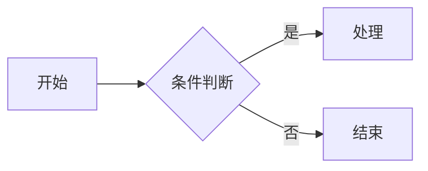

> **认知导入（Layer 1 进阶层）**
> 前置知识：001 语法总览（建议先掌握 Layer 0 基础语法）。
> 边界说明：GFM = CommonMark + 一组扩展。本篇是"地图"：每个扩展给出要点与跳转链接，单语法细节见对应专篇。
> 强制练习：在 GitHub 的 Issue 编辑框里把本篇的扩展逐个粘贴预览，观察哪些生效。

## 1. GFM 是什么

GitHub Flavored Markdown（GFM）是 GitHub 在 CommonMark 基础上扩展的 Markdown 方言，是 GitHub 上所有文本内容（README、Issue、Pull Request、Discussion、评论）的解析标准。它有两层身份：

- **一份正式规范**（GFM Spec，基于 cmark-gfm），定义了表格、任务列表、删除线、自动链接、脚注等扩展；
- **一组平台特性**：`@` 提及、`#123` 引用、数学公式、Mermaid 图表、警报块等 GitHub 网站自家的功能。

## 2. GFM 规范级扩展一览

| 扩展 | 语法 | 专篇 |
| :--- | :--- | :--- |
| 表格 | `\| 列 \| 列 \|` | `markdown/100-Table` |
| 任务列表 | `- [x] 完成` | `markdown/170-TaskList` |
| 删除线 | `~~文本~~` | `markdown/120-Strikethrough` |
| 自动链接 | 直接写 `https://...` | `markdown/130-AutoLink` |
| 脚注 | `[^1]` 与 `[^1]: 内容` | `markdown/150-Footnote` |
| 禁用危险 HTML（tagfilter） | 过滤 `<iframe>` 等标签 | 本篇第 7 节 |

围栏代码块（``` 加语言标识）虽由 GFM 普及，现已是事实标准，专篇见 `markdown/090-CodeBlockSyntaxHighlight`。

## 3. 规范级扩展要点

### 3.1 表格

```markdown
| 名称 | 类型    | 描述   |
| :--- | :------ | :----- |
| id   | integer | 主键   |
| name | string  | 用户名 |
```

要点：表头 + 分隔行（`| --- |`）构成表格；冒号控制对齐；单元格只装行内元素；竖线内容写 `\|`；少列补空、多列丢弃。详见 `markdown/100-Table`。

### 3.2 任务列表

```markdown
- [x] 完成需求分析
- [ ] 编写单元测试
```

要点：标记在列表项开头、`[ ]` 后必须有空格；GitHub 上可点击勾选且会写回源码；Issue 列表会显示完成进度。详见 `markdown/170-TaskList`。

### 3.3 删除线

```markdown
~~已废弃的 API~~，新 API 见文档 v2。
```

要点：双波浪号、紧贴内容；单波浪号在 GitHub 网页端不生效；纯 CommonMark 渲染器原样显示。详见 `markdown/120-Strikethrough`。

### 3.4 自动链接

```markdown
访问 https://github.com 了解更多
邮箱：user@example.com
```

GFM 自动识别裸 URL（http/https/ftp）、`www.` 域名与裸邮箱；尾随标点会被剔除、括号按配对处理。纯 CommonMark 只认尖括号 `<URL>` 写法。详见 `markdown/130-AutoLink`。

### 3.5 脚注

```markdown
结论已通过基准测试[^bench]验证。

[^bench]: 基准报告见仓库 bench/ 目录。
```

脚注是 cmark-gfm 解析器的扩展（未写入正式 GFM 规范文档），2021 年 9 月起在 GitHub 全站生效，渲染为文末尾注 + 点击回链。详见 `markdown/150-Footnote`。

## 4. GitHub 平台特性（规范之外）

以下功能是 GitHub 网站的行为，写成 Markdown 通用规范的一部分并不成立——在其他平台渲染为普通文本。

### 4.1 警报块（alerts，2024 年起）

```markdown
> [!NOTE]
> 补充说明。

> [!WARNING]
> 注意风险。
```

五种类型（NOTE/TIP/IMPORTANT/WARNING/CAUTION），标记必须全大写。详见 `markdown/180-AdmonitionCallout`。

### 4.2 数学公式（2022 年起）与图表

````markdown
能量公式：$E = mc^2$

$$
\int_0^1 x^2 \, dx = \frac{1}{3}
$$
````

行内 `$...$`、块级 `$$...$$`。代码块语言写 `mermaid` 则渲染为流程图/时序图：

````markdown

````

专篇：`markdown/210-LaTeXMathFormula`、`markdown/220-Mermaid`。

### 4.3 用户、Issue 与提交的自动引用

```markdown
@octocat 请确认这个变更。

修复 #123 的回归问题，相关讨论见 gh-landing-page#456。

该行为自提交 8f9a0b1 起变化。
```

`@用户名` 触发通知，`#编号` 链接 Issue/PR，跨仓库用 `用户/仓库#编号`，7 位以上的提交哈希自动链接到 commit。

### 4.4 Emoji 短代码

```markdown
合并前需要 :white_check_mark: 通过全部测试。
```

gemoji 命名清单，输入 `:` 有自动补全。详见 `markdown/140-Emoji`。

### 4.5 折叠区域（HTML details）

```markdown
<details>
<summary>点击展开排查步骤</summary>

1. 检查环境变量
2. 重启服务

</details>
```

`<summary>` 与内容之间留空行，内部 Markdown 才会被解析；加 `open` 属性默认展开。

## 5. 代码围栏与语法高亮

围栏代码块用三个及以上反引号包裹，开栏写语言标识触发高亮：

````markdown
```python
def fib(n: int) -> int:
    return n if n < 2 else fib(n - 1) + fib(n - 2)
```
````

要点：

- 常用语言标识覆盖 `js/ts/python/go/rust/java/sql/json/yaml/bash/diff/mermaid` 等；
- 内容含三反引号时，用**更多个**反引号做外层围栏；
- 围栏内不解析任何 Markdown，无需转义；
- `diff` 语言块中 `-`/`+` 开头的行渲染红绿着色。

详见 `markdown/090-CodeBlockSyntaxHighlight`。

## 6. 链接引用定义

长文档里反复出现的 URL 可用引用式链接收敛到文末（属于 CommonMark 核心，配合 GFM 阅读体验很好）：

```markdown
访问 [GitHub][gh] 与 [GitLab][gl] 的对比文档。

[gh]: https://github.com "GitHub"
[gl]: https://gitlab.com "GitLab"
```

正文只剩语义文字，URL 集中维护；引用定义在渲染后不可见。

## 7. 与 CommonMark 的关系（迁移视角）

- GFM 规范官方定位为 CommonMark 的**超集**：在 CommonMark 基础上叠加扩展，并明确了与规范的差异点。
- 实用视角：GFM 扩展语法在纯 CommonMark 渲染器上通常**退化为普通文本**（`~~x~~` 显示波浪号、表格变成一行行普通文字），不会报错，但结构和语义丢失——这是跨平台文档最常见的事故形态。
- GFM 自带安全机制（tagfilter）：`<title>`、`<textarea>`、`<style>`、`<iframe>`、`<script>` 等标签会被过滤或原样转义显示，防止注入。
- 迁移建议：对外发布的内容优先只用 CommonMark 核心；明确目标平台是 GitHub/GitLab 时再放心使用 GFM 扩展；提交前在目标平台预览。

## 小结

- 初学者要点：GFM = CommonMark + 表格、任务列表、删除线、自动链接、脚注等扩展；GitHub 上还能用警报块、公式、Mermaid、`@提及` 与 `#引用`；写 GitHub 内容直接用 GFM 即可。
- 进阶注意：平台特性（alerts、公式、图表）不属于 GFM 规范，换平台即失效；GFM 扩展在纯 CommonMark 渲染器上退化为普通文本而非报错，跨平台发布前务必预览；tagfilter 会过滤危险 HTML；扩展细节都在对应专篇。
