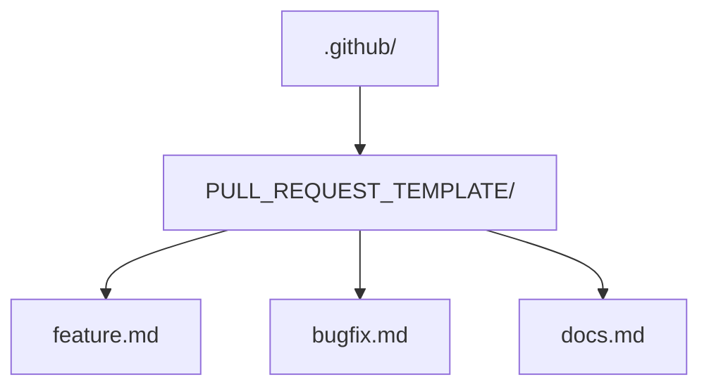

## 1. PR 协作概述

### 1.1 Markdown 在 PR 中的角色

Pull Request（PR）是代码协作的核心机制，Markdown 是 PR 中所有文本内容的格式标准：

- **PR 描述**：变更说明、测试计划、截图
- **代码评论**：行内评论和总体评论
- **审查意见**：审查者的反馈和建议
- **提交信息**：每次提交的说明

### 1.2 协作流程

```
创建分支 → 编写代码 → 提交 PR → 代码审查 → 修改 → 合并
    ↑                                    ↓
    └────────── Markdown 贯穿全程 ───────┘
```

## 2. PR 描述模板

### 2.1 功能 PR 模板

```markdown
## 变更类型

- [x] 新功能（feature）
- [ ] 修复（bugfix）
- [ ] 重构（refactor）
- [ ] 文档（docs）

## 变更说明

简要描述本次变更的内容和原因。

## 关联 Issue

Closes #123

## 变更详情

- 添加了用户认证模块
- 集成 JWT Token 验证
- 添加登录/注册 API

## 测试

- [x] 单元测试通过
- [x] 集成测试通过
- [ ] E2E 测试通过
- [x] 手动测试通过

## 截图

| 之前           | 之后          |
| -------------- | ------------- |
|  |  |

## 检查清单

- [x] 代码遵循项目规范
- [x] 已添加必要的注释
- [x] 文档已更新
- [x] 无新增警告
```

### 2.2 Bug 修复模板

```markdown
## Bug 描述

**现象**：用户登录后偶尔被重定向到 404 页面

**复现步骤**：

1. 访问 `/login`
2. 输入凭证并提交
3. 偶尔（约 30% 概率）出现 404

**期望行为**：登录后应重定向到首页

**根因**：`redirectUrl` 在异步操作中被意外覆盖

## 修复方案

使用局部变量保存 `redirectUrl`，避免异步操作中的竞态条件。

## 测试

- [x] 添加回归测试
- [x] 手动验证修复
```

### 2.3 配置 PR 模板

在仓库中创建 `.github/PULL_REQUEST_TEMPLATE.md` 文件：

```
.github/
└── PULL_REQUEST_TEMPLATE.md
```

或创建多个模板：



## 3. 代码评论中的 Markdown

### 3.1 行内评论

在 PR 的代码差异视图中，可以对特定行添加评论，评论正文支持完整 Markdown（代码块、强调、列表等）：

````markdown
**建议**：这里可以使用可选链操作符简化代码

```javascript
// 当前
if (user && user.address && user.address.city) {
```

```javascript
// 建议
if (user?.address?.city) {
```
````

理由：可选链更简洁，且语义更清晰。评论中引用代码片段时，为片段标注语言即可获得语法高亮。

### 3.2 建议式评论（suggestion）

GitHub 支持用 `suggestion` 代码块直接提出代码修改建议，对方点一下 "Commit suggestion" 就能采纳：

````markdown
建议修改为：

```suggestion
const result = await fetchData(userId);
```
````

注意：`suggestion` 块必须挂在**具体代码行**的评论上才会生效，写在总评论里只是普通代码块。

### 3.3 审查评论格式

结构化的审查意见比一句话评论更可执行，推荐"等级 + 位置 + 问题 + 建议 + 原因"五要素：

````markdown
### 必须修改（blocker）

**位置**：`src/auth/login.ts:42`

**问题**：密码未使用 bcrypt 哈希就存储到数据库

**建议**：

```typescript
// 修改前
await db.query('INSERT INTO users (password) VALUES (?)', [password]);

// 修改后
const hashedPassword = await bcrypt.hash(password, 10);
await db.query('INSERT INTO users (password) VALUES (?)', [hashedPassword]);
```

**原因**：明文存储密码是严重的安全隐患
````

### 3.4 评论分类标记

| 标记 | 含义 | 使用场景 |
| :--- | :--- | :--- |
|  `nit` | 小问题 | 代码风格、命名 |
|  `question` | 疑问 | 不理解的逻辑 |
|  `suggestion` | 建议 | 可选的改进 |
|  `blocker` | 阻塞 | 必须修改才能合并 |
|  `warning` | 警告 | 潜在问题 |

## 4. 提交信息规范

### 4.1 Conventional Commits

```markdown
feat: add user authentication
fix: resolve login redirect loop
docs: update API reference
style: format code with prettier
refactor: extract validation logic
test: add unit tests for auth module
chore: upgrade dependencies
````

### 4.2 提交信息模板

```bash
# .gitmessage
# <type>(<scope>): <subject>
# 格式: <type>(<scope>): <subject>
# type: feat|fix|docs|style|refactor|test|chore
# scope: 影响范围（可选）
# subject: 简短描述（不超过50字符）
#
# 详细描述（可选，每行不超过72字符）
#
# 关联 Issue（可选）
# Closes #123
```

配置：

```bash
git config commit.template .gitmessage
```

## 5. 文档维护

### 5.1 CHANGELOG 维护

```markdown
## [2.1.0] - 2026-06-14

### Added

- 用户认证模块（#123）
- 深色模式支持（#124）

### Fixed

- 修复登录重定向问题（#125）
- 修复移动端布局错位（#126）

### Changed

- 升级依赖到最新版本（#127）

### Deprecated

- `oldAPI()` 将在 v3.0 移除，请迁移到 `newAPI()`

### Removed

- 移除已废弃的 `v1/auth` 端点
```

### 5.2 README 维护

PR 中涉及功能变更时，应同步更新 README：

```markdown
## PR 检查清单

- [ ] README 已更新（如有必要）
- [ ] CHANGELOG 已更新
- [ ] API 文档已更新（如有必要）
- [ ] 迁移指南已添加（如有破坏性变更）
```

### 5.3 文档审查要点

| 要点       | 检查内容                   |
| :--------- | :------------------------- |
| **准确性** | 文档描述是否与代码实现一致 |
| **完整性** | 新功能是否有对应文档       |
| **示例**   | 是否提供了使用示例         |
| **链接**   | 内部链接是否有效           |
| **格式**   | Markdown 语法是否正确      |


## 小结

- 初学者要点：PR 描述、评论、审查意见全部是 Markdown；复选框清单让检查项可追踪；`Closes #123` 建立与 Issue 的自动关联；代码评论里用代码块给上下文。
- 进阶注意：`suggestion` 代码块能让审查意见一键采纳（必须挂在具体代码行上）；PR 模板放 `.github/PULL_REQUEST_TEMPLATE.md` 或 `PULL_REQUEST_TEMPLATE/` 目录实现多场景模板；Conventional Commits 约定提交格式；CHANGELOG 按 Keep a Changelog 风格组织；功能变更与文档更新放在同一个 PR 里评审。
