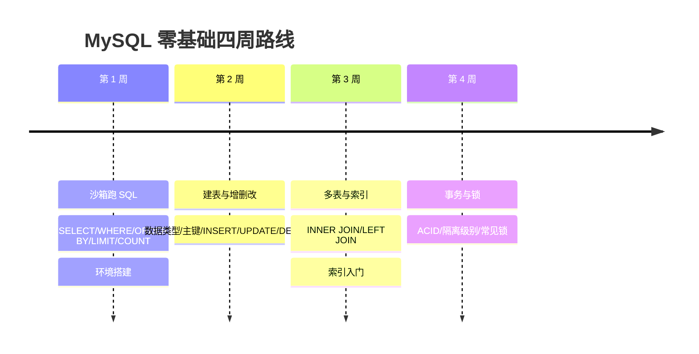

## 0. 四周时间线

## 1. 第一周：先跑起来（约 3-4 小时）

必读：

1. `040-SQLPlayground`（沙箱，10 个练习）；
2. `050-MySQLOverviewDatabaseDesign` 第 0 节（五分钟第一句 SQL）；
3. `120-DQL` 前 5 个动作（SELECT、WHERE、ORDER BY、LIMIT、COUNT）；
4. `060-MySQLEnvSetup`（本地环境，可选）。

验收：能独立写出“查询年龄大于 18 的用户并按年龄排序取前 5 条”。

## 2. 第二周：会建表、会增删改（约 4-6 小时）

必读：

1. `070-MySQLDataTypeConstraint`（只学 INT/VARCHAR/DATE + 主键/非空/默认值）；
2. `080-DDL`（CREATE TABLE / ALTER TABLE）；
3. `100-DML`（INSERT/UPDATE/DELETE，重点：UPDATE/DELETE 必须带 WHERE）。

验收：能创建一张 `students` 表并完成增删改查。

## 3. 第三周：多表查询与索引（约 4-6 小时）

必读：

1. `140-MultiTableJoinDetailed`（先只学 INNER JOIN 与 LEFT JOIN）；
2. `220-ClusteredIndexSecondaryIndex`（索引是什么、为什么快）；
3. `890-MySQLQuickLookup`（遇到不会的语法先查这里）。

验收：能解释 INNER JOIN 与 LEFT JOIN 的区别，并说出索引为什么能加速。

## 4. 第四周：事务与锁（约 3-4 小时）

必读：

1. `420-TransactionIsolationImplementation`（ACID 与隔离级别）；
2. `450-LockClassification`（常见锁类型）；
3. `460-TransactionLockMechanism`（事务与锁配合）。

验收：能说出脏读/不可重复读/幻读分别被哪个隔离级别解决。

## 5. 之后：按需查阅

- 索引深入：013-019、060、062；
- 优化与执行计划：020-028、055、065；
- 事务、锁与 MVCC：029-034、064、067-069、073；
- 日志与备份恢复：035-041；
- 复制与高可用：042-047、059、070；
- 分区与分库分表：048、049、071；
- 安全、权限与注入防护：050-054、077-079、086；
- 速查与理论：075、076、081。

> 一句话记住：第一周先跑通查询，第二周会建表增删改，第三周懂多表与索引，第四周理解事务与锁；之后全是按需查阅。

## 扩展学习

- 使用指南：`mysql/010-HowToUseThisCourse`；
- 术语表：`mysql/030-Glossary`；
- 沙箱：`mysql/040-SQLPlayground`。
