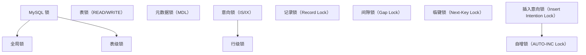

## 1. 锁分类总览



## 2. 全局锁

```sql
-- 全局读锁：整个实例只读，用于物理冷备或全局一致性点
FLUSH TABLES WITH READ LOCK;
UNLOCK TABLES;

-- InnoDB 备份的标准姿势其实不用全局锁：
-- mysqldump --single-transaction 借助 MVCC 快照备份，业务不中断
```

## 3. 表级锁

### 3.1 表锁

```sql
LOCK TABLES employees READ;       -- 读锁
LOCK TABLES employees WRITE;      -- 写锁
UNLOCK TABLES;
```

### 3.2 元数据锁（MDL）

```sql
-- MDL 自动获取，防止 DDL 与 DML 冲突
-- SELECT → MDL 读锁
-- ALTER → MDL 写锁

-- 长事务阻塞 DDL
-- 事务A: BEGIN; SELECT * FROM t;  -- 持有 MDL 读锁
-- 事务B: ALTER TABLE t ADD COLUMN ...;  -- 等待 MDL 写锁
-- 事务C: SELECT * FROM t;  -- 等待事务B的 MDL 写锁！

-- 查看MDL等待
SELECT * FROM performance_schema.metadata_locks;
```

### 3.3 意向锁

```sql
-- 表级意向锁：加行锁前先在表上"挂号"，让表级锁请求能快速判断冲突
-- IS：打算加行级 S 锁（SELECT ... FOR SHARE）
-- IX：打算加行级 X 锁（SELECT ... FOR UPDATE / DML）

-- 表级锁兼容矩阵（√ 兼容，× 冲突）：
--          |  IS   IX   S    X
--   IS     |  √    √    √    ×
--   IX     |  √    √    ×    ×
--   S      |  √    ×    √    ×
--   X      |  ×    ×    ×    ×
-- 记忆：意向锁之间永远兼容；真正的互斥发生在行级
```

## 4. 行级锁

### 4.1 记录锁（Record Lock）

```sql
-- 锁定索引记录
SELECT * FROM t WHERE id = 5 FOR UPDATE;
-- 锁定 id=5 的索引记录
```

### 4.2 间隙锁（Gap Lock）

```sql
-- 锁定索引记录之间的间隙
SELECT * FROM t WHERE id BETWEEN 5 AND 10 FOR UPDATE;
-- 锁定 (5, 10) 间隙，阻止插入 id=6,7,8,9

-- 间隙锁之间不冲突
-- 间隙锁与插入意向锁冲突
```

### 4.3 临键锁（Next-Key Lock）

```sql
-- 记录锁 + 间隙锁
-- InnoDB 在 REPEATABLE READ 下的默认行锁算法

-- 退化为记录锁：唯一索引等值查询且记录存在
SELECT * FROM t WHERE id = 5 FOR UPDATE;  -- id 是主键，存在
-- 只锁 id=5 行

-- 退化为间隙锁：唯一索引等值查询但记录不存在
SELECT * FROM t WHERE id = 5 FOR UPDATE;  -- id=5 不存在
-- 锁 (prev, next) 间隙
```

### 4.4 插入意向锁

```sql
-- INSERT 操作在插入前获取插入意向锁
-- 是一种特殊的间隙锁，不阻止其他插入意向锁
-- 只与间隙锁冲突

-- 多个事务向同一间隙的不同位置插入不冲突
INSERT INTO t VALUES (6, ...);  -- 事务A
INSERT INTO t VALUES (7, ...);  -- 事务B
-- 不冲突
```

## 5. 自增锁

```sql
-- AUTO-INC 锁模式（innodb_autoinc_lock_mode）：
-- 0：传统模式（批量 INSERT 整段持表级 AUTO-INC 锁）
-- 1：连续模式（5.7 默认：简单 INSERT 用轻量互斥量，批量 INSERT 持表锁）
-- 2：交叉模式（8.0 起默认：全部用轻量互斥量，并发最好；ROW 格式下复制安全）

-- 注意：该变量是只读的，只能写入 my.cnf 后重启，不能 SET GLOBAL！
-- innodb_autoinc_lock_mode = 2
-- 且 mode=2 + STATEMENT 格式复制不安全——8.0 默认 ROW 格式正好配套
```

## 6. 查看锁信息

```sql
-- MySQL 8.0：锁与锁等待在 performance_schema
-- （旧版 information_schema.INNODB_LOCKS / INNODB_LOCK_WAITS 已在 8.0 移除）
SELECT ENGINE_TRANSACTION_ID, INDEX_NAME, LOCK_TYPE, LOCK_MODE, LOCK_DATA
FROM performance_schema.data_locks;

SELECT * FROM performance_schema.data_lock_waits;   -- 谁在等谁

-- sys 视图是开箱即用的封装：等锁/堵人的连接、SQL、事务年龄一目了然
SELECT * FROM sys.innodb_lock_waits\G
--   wait_pid / blocking_pid / blocking_query / blocking_trx_age
-- 元数据锁（MDL）等待在 performance_schema.metadata_locks
```
