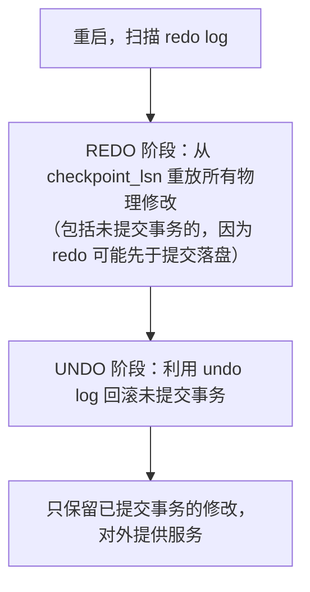

## 1. redo log 解决什么问题

先看一个反直觉的事实：事务提交后，被修改的**数据页可能还躺在内存里**，并没有写入磁盘。
如果此时进程崩溃，内存里的脏页就丢了——那"已提交"的数据岂不是会丢失？

InnoDB 的答案不是"提交时把脏页刷盘"（随机 IO 太慢），而是 **WAL（Write-Ahead
Logging，先写日志）**：把"某个页的某个位置改成了什么值"这条**物理修改记录**先顺序地
写到磁盘上的 redo log，然后才允许把脏页慢慢刷盘。崩溃后重启时，把 redo log 重放一遍，
就能把没来得及落盘的修改找回来。

```sql
-- 类比：账本为了安全，每笔记账先在流水单上记一行（顺序写、很快），
-- 正式账页（数据文件）可以攒一批再誊写（随机写、很慢）。
-- 流水单丢了才是灾难，所以每笔必须先落到流水单上。
```

一句话：**redo log 用"顺序写"换"随机写"，同时保证已提交事务的持久性（D）**。

## 2. 物理结构

### 2.1 日志文件布局（8.0.30 前后差异大，重点）

```sql
-- MySQL 8.0.30 之前：固定的一小组文件，循环写
--   ib_logfile0, ib_logfile1, ...（由 innodb_log_file_size × innodb_log_files_in_group 决定）

-- MySQL 8.0.30 起：改为 #innodb_redo 目录下的 32 个文件（ib_redoN），动态伸缩
--   总容量由一个变量统一控制：
SHOW VARIABLES LIKE 'innodb_redo_log_capacity';
-- 默认 104857600（100MB），在线可调，无需重启
SET GLOBAL innodb_redo_log_capacity = 2147483648;  -- 扩到 2GB，立即生效
```

> 版本注意：`innodb_log_file_size` / `innodb_log_files_in_group` /
> `innodb_log_group_home_dir` 在 8.0.30 已废弃，**8.4 起彻底移除**——
> 升级 8.4 前必须从 my.cnf 删除这些行，改用 `innodb_redo_log_capacity`，
> 否则服务器拒绝启动。老教程里的 `SET GLOBAL innodb_log_file_size=...` 写法已不可用。

### 2.2 循环写与两个指针

```
redo log 空间逻辑上是一个环：

   write pos ────────────→        （当前写到哪）
   ┌────┬────┬────┬────┬────┬────┐
   │已写│已写│已写│可写│可写│可写│
   └────┴────┴────┴────┴────┴────┘
   checkpoint ─────────→           （刷盘推进到哪）

write pos 追上 checkpoint → 必须停下来，先推进 checkpoint（把脏页刷盘），
此时所有写入阻塞 → 这就是"redo log 太小引发写入抖动"的根因。
```

## 3. 写入路径与 LSN

### 3.1 从修改到落盘


`write` 和 `fsync` 是两个阶段：write 把日志搬到操作系统缓存，fsync 才真正落盘。
两者的时机由 `innodb_flush_log_at_trx_commit` 控制（见下）。

### 3.2 LSN（Log Sequence Number）

LSN 是 redo log 的全局逻辑时钟，单调递增，单位是"字节"：

| 概念            | 含义                                       |
| --------------- | ------------------------------------------ |
| log 体系的 LSN  | 当前已写入 Log Buffer 的位置               |
| flushed LSN     | 已 fsync 到磁盘 redo 文件的位置            |
| checkpoint LSN  | 此前的脏页已全部刷盘，崩溃恢复只需重放这之后 |

恒有 `checkpoint_lsn ≤ flushed_lsn ≤ 当前写入 LSN`。观测手段：

```sql
SHOW ENGINE INNODB STATUS\G
-- LOG 部分可看到 Log sequence number / Last checkpoint at
-- 两者差值 ≈ 未刷盘的日志量，长期偏大说明刷盘能力（磁盘）是瓶颈
```

## 4. 刷盘策略：innodb_flush_log_at_trx_commit

| 值 | 提交时的动作                          | 崩溃时最多丢                  | 典型用途           |
| -- | ------------------------------------- | ----------------------------- | ------------------ |
| 0  | 提交不碰日志，每秒由后台 write+fsync  | 约 1 秒事务                   | 极端性能场景（少） |
| 1  | 提交时 write + fsync（默认）          | 不丢                          | 生产默认推荐       |
| 2  | 提交时只 write，每秒 fsync            | MySQL 进程崩不丢；整机断电丢  | 可容忍秒级丢失     |

```sql
SHOW VARIABLES LIKE 'innodb_flush_log_at_trx_commit';
SET GLOBAL innodb_flush_log_at_trx_commit = 1;  -- 生产库保持默认 1
```

常见误解澄清：

- 设为 0 或 2 时，**事务本身的持久性被削弱**，而且回收站不止丢"1 秒"——
  高并发下丢的是"最近一次 fsync 以来所有已提交事务"；
- 与主从复制安全强相关：值 1 应与 `sync_binlog=1` 搭配，
  组成俗称的"双 1 配置"，才能保证崩溃后主库与 binlog 完全一致。

## 5. 组提交（Group Commit）

fsync 是提交路径上最贵的操作。高并发下，InnoDB 把"同一时刻一起提交"的事务的
redo 合并成一次 fsync：

```
事务 A 提交 ─┐
事务 B 提交 ─┼─→ 排队进入提交队列 ─→ 一次 fsync 覆盖所有排队事务的 redo
事务 C 提交 ─┘
```

并发越高，单次 fsync 摊薄的提交越多，吞吐越好——这也是"高并发下 MySQL 反而
跑得更稳"的原因之一。binlog 侧有同样的组提交机制（`binlog_group_commit_sync_delay`
可主动攒批，用于提高从库并行复制的并行度，见并行复制一篇）。

## 6. Checkpoint 与崩溃恢复

### 6.1 Checkpoint（检查点）

把 checkpoint 推进的动作叫 checkpoint：选出"redo 已经全部落盘"的脏页刷回磁盘，
然后前移 checkpoint LSN，释放可复用的日志空间。InnoDB 采用 **fuzzy checkpoint**
（模糊检查点）：不追求某一瞬间全库一致，只按页逐个刷，期间业务不中断。

### 6.2 崩溃恢复流程



注意 REDO 阶段会"重放过头"——它不管事务有没有提交都重放，再靠 UNDO 阶段回滚。
这就是 redo 与 undo 必须配合使用的原因：redo 保证已提交的丢不了，undo 保证没提交的
当作没发生。

## 7. 性能调优要点

```sql
-- 1. 容量：按"高峰期 1 小时左右的日志写入量"估算，过小导致频繁 checkpoint 抖动
SET GLOBAL innodb_redo_log_capacity = 4294967296;  -- 例如 4GB（大写入量实例）

-- 2. Log Buffer：大批量写入（导入、批量 DML）适当调大，减少中途落盘
SET GLOBAL innodb_log_buffer_size = 67108864;      -- 64MB，8.0 支持在线调整

-- 3. 刷盘方式：Linux 上让 InnoDB 绕过 OS 页缓存，避免双重缓存
--    [mysqld] innodb_flush_method = O_DIRECT

-- 4. 观测：checkpoint 年龄逼近容量 = 预警信号
SHOW ENGINE INNODB STATUS\G
```

| 症状                                   | 可能原因            | 处置                              |
| -------------------------------------- | ------------------- | --------------------------------- |
| 写入周期性卡顿（几十毫秒到秒级尖刺）   | redo 容量过小       | 调大 innodb_redo_log_capacity     |
| `Innodb_log_waits` 持续增长            | 日志缓冲不够/磁盘慢 | 调大 buffer；检查磁盘吞吐         |
| 崩溃恢复要几十分钟                     | 容量过大 + 崩溃频繁 | 容量与 RTO 权衡，不宜盲目求大     |

## 8. 小结

- 初学者要点：redo log = InnoDB 的"物理流水账"，先写日志再写数据页，保证已提交
  事务不丢；`innodb_flush_log_at_trx_commit=1` 是生产默认。
- 进阶注意：8.0.30 起容量统一由 `innodb_redo_log_capacity` 控制，旧三件套变量
  在 8.4 已移除；容量大小是"写入抖动"与"崩溃恢复时长"之间的权衡；
  redo（持久性）与 undo（回滚/MVCC）各司其职，崩溃恢复 = REDO 重放 + UNDO 回滚。
