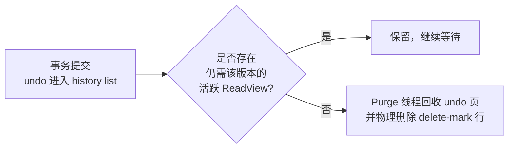
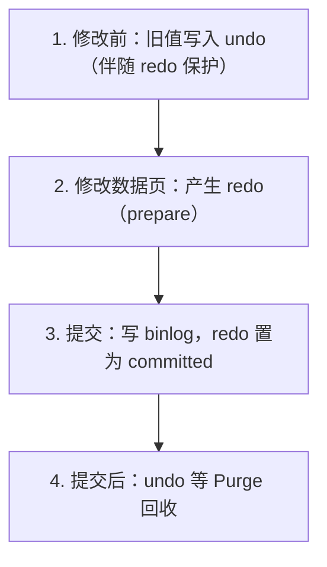

## 1. undo log 解决什么问题

undo log 记录的是数据**修改前的旧值**，作用有两个：

| 功能     | 说明                                  | 面向           |
| -------- | ------------------------------------- | -------------- |
| 事务回滚 | ROLLBACK 时按旧值把数据改回去，保证 A | 事务本身       |
| MVCC     | 为快照读提供历史版本，保证隔离（I）   | 其他并发事务   |

与 redo log 的分工用一句话记住：**redo 保证"提交的丢不了"，undo 保证"没提交的
当没发生"**。undo log 本身也有持久化保护——写 undo 之前同样会先产生 redo，
所以崩溃恢复后 undo log 依然可用。

```sql
-- 类比：undo log 是每笔修改的"橡皮擦说明书"——
-- 怎么擦（回滚）写在说明书里；同时旧版本也留着给其他事务"翻旧账"（MVCC）。
```

## 2. 版本链：undo 如何支撑 MVCC

InnoDB 每行都有隐藏列 `DB_TRX_ID`（最后修改事务 ID）与 `DB_ROLL_PTR`（回滚指针）。
多次修改后，旧版本经 `DB_ROLL_PTR` 串成链：

```
当前行：{name='Carol', trx_id=300, roll_ptr → undo_2}
                                         ↓
undo_2：{name='Bob',   trx_id=200, roll_ptr → undo_1}
                                         ↓
undo_1：{name='Alice', trx_id=100, roll_ptr → NULL}
```

快照读时从事务的 ReadView 出发，沿链回溯找到第一个"对本事务可见"的版本。
完整可见性算法见 MVCC 原理一篇；这里只需记住：**undo log 越长，回溯越慢**——
这是长事务拖慢全库查询的底层机制之一。

### 2.1 三类操作的 undo

```sql
-- INSERT → insert undo record：只记主键，回滚时直接删除该行。
--          事务提交后无其他事务需要它，可立即清理（insert undo 可就地丢弃）。

-- UPDATE → update undo record：记旧值快照（含主键与被改列的旧内容）。
--          提交后仍可能被其他事务的快照读引用，必须等 Purge 判定安全。

-- DELETE → delete 标记（delete mark）：行先打删除标记，Purge 确认无引用后
--          才真正物理删除。
```

insert undo 与 update undo 的差别直接决定了"纯插入型事务提交后空间立即回收，
而更新型事务的 undo 要等 purge"这一行为差异。

## 3. 回滚段与 undo 表空间

undo log 存放在**回滚段（rollback segment）**管理的 undo 页中，回滚段归属 undo 表空间。

```sql
-- MySQL 8.0：默认 2 个独立 undo 表空间（undo_001 / undo_002），随初始化自动创建
--   每个 undo 表空间最多 128 个回滚段（innodb_rollback_segments 默认 128）
SHOW VARIABLES LIKE 'innodb_rollback_segments';

-- 历史提示：5.6/5.7 时代需要用 innodb_undo_tablespaces 手工迁移独立 undo 表空间，
--   该变量在 8.0.14 起废弃（固定默认 2 个自动创建），不要再在新版本中设置它。

-- undo 表空间自动截断（8.0 默认开启）：超过阈值后收缩文件
SHOW VARIABLES LIKE 'innodb_undo_log_truncate';
SHOW VARIABLES LIKE 'innodb_max_undo_log_size';   -- 触发截断的阈值，默认 1GB
```

对比 5.7 之前"undo 长在共享 ibdata1 里、只能重建实例才能收缩"的困境，
8.0 的独立 undo 表空间支持**在线收缩**，是长事务治理的基础设施升级。

## 4. Purge：历史版本的回收

已提交事务的 undo log 不会立刻删除——必须等所有可能引用它的 ReadView 都消失：



观测与排查：

```sql
-- history list length：等待 Purge 的 undo 数量，观察 Purge 是否跟得上
SHOW ENGINE INNODB STATUS\G
-- TRANSACTIONS 段末尾：History list length 1234

-- 更精细：从 INNODB_METRICS 取同口径指标
SELECT COUNT FROM information_schema.INNODB_METRICS
WHERE NAME = 'trx_rseg_history_len';

-- 查谁在制造长事务（Purge 被卡住的头号嫌疑人）
SELECT trx_id, trx_started,
       TIMESTAMPDIFF(SECOND, trx_started, NOW()) AS age_sec,
       trx_state, trx_rows_locked, trx_rows_modified
FROM information_schema.INNODB_TRX
ORDER BY trx_started;
```

**长事务是 undo 膨胀的唯一主因**：哪怕它什么都不改，只要不提交，
它的 ReadView 就让 Purge 无法清理它之后产生的所有版本。
典型后果：undo 表空间持续增长、快照读回溯变慢、行锁持有时间变长。
治理原则：事务要小、交互式操作（人工确认、RPC 调用）不要包在事务里、
监控 `INNODB_TRX` 中执行时间超过阈值的会话并告警。

## 5. 回滚的真实代价

```sql
BEGIN;
UPDATE big_table SET status = 'x' WHERE created_at < '2020-01-01';  -- 500 万行
-- 发现写错了……
ROLLBACK;   -- 不是"瞬间取消"：InnoDB 要按 undo 逐行反向修改 500 万行
```

常见误区是"没 COMMIT 就没成本"。实际上：大事务运行期间，undo 持续累积、
锁持续持有、Purge 被阻塞；ROLLBACK 的耗时可能与正向执行同一量级。
正确的止损方式通常是"kill 会话让它自动回滚"或提前拆小事务，
而**不能**用 `SET GLOBAL innodb_rollback_segments` 之类的参数"加速回滚"——
没有这种开关。

## 6. 与 redo / binlog 的协作



- 崩溃恢复时：redo 重放 → undo 回滚未提交事务（两阶段提交细节见两阶段提交一篇）；
- undo 是**引擎层**的逻辑日志，binlog 是 **Server 层**日志——binlog 不参与崩溃
  恢复中的回滚，只服务于复制与时间点恢复。

## 7. 小结

- 初学者要点：undo log = "旧值仓库"，回滚靠它、MVCC 快照读也靠它；
  8.0 默认两个独立 undo 表空间、支持在线截断。
- 进阶注意：purge 滞后（History list length 增长）几乎都指向长事务；
  `innodb_undo_tablespaces` 是 5.7 时代的配置，8.0.14 起已废弃；
  大事务的 ROLLBACK 代价与正向执行同量级，预防优于止损。
