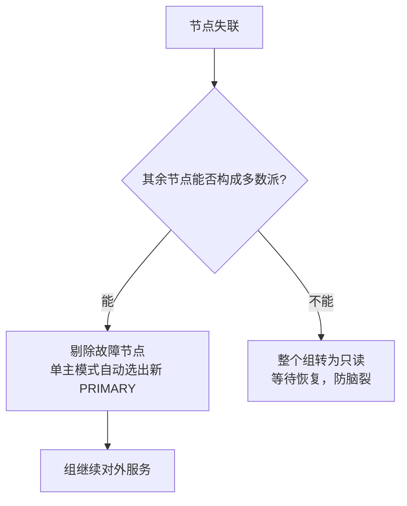

## 1. 组复制定位：比异步/半同步强在哪

MySQL Group Replication（MGR，5.7.17 引入）是官方的**分布式一致性复制**方案。
它与主从复制的关系用"提交时等谁"来看最清楚：

| 方案       | 提交时等待                      | 故障切换   | 数据安全           |
| ---------- | ------------------------------- | ---------- | ------------------ |
| 异步复制   | 谁都不等                        | 人工/外部  | 可能丢最新事务     |
| 半同步复制 | 等 1 个副本"收到 binlog"的 ACK  | 人工/外部  | 不丢已确认事务     |
| 组复制     | 多数派节点**认证通过**后提交    | **自动**   | 多数派存活即不丢   |

底层差异：普通复制是"主库说了算，从库照抄"；MGR 里每个事务要先在组内广播，
由多数派（majority，如 3 节点中的 2 个）基于 **Paxos 协议**对事务顺序达成一致，
通过**认证（certification）**检测写冲突，之后才真正提交。因此：

- 不存在"单点写入权威"，任何成员宕机多数派仍在即可继续服务；
- 故障检测与主节点选举内建，**自动完成**，无需 Orchestrator 等外部仲裁；
- 集群自带"防脑裂"：少数派自动转为只读，不会出现两个可写主库。

## 2. 两种模式

| 模式     | 写入点   | 冲突处理                               | 适用                     |
| -------- | -------- | -------------------------------------- | ------------------------ |
| 单主模式 | 仅 PRIMARY | 故障时自动选新主（推荐）             | 绝大多数业务             |
| 多主模式 | 全部节点 | 认证阶段检测写集冲突，后提交者回滚     | 写冲突极低的场景（少用） |

多主模式基于**写集（修改行的主键集合）**做乐观冲突检测：两个事务修改同一行，
先在多数派完成认证者胜出，后者整个回滚（应用收到错误）。业务热点行会放大回滚率，
所以实践中**单主模式是默认选择**；使用多主要求应用具备死锁/回滚重试能力。

```sql
-- 查看成员与角色（单主模式下定位当前主库）
SELECT MEMBER_HOST, MEMBER_PORT, MEMBER_STATE, MEMBER_ROLE
FROM performance_schema.replication_group_members;

-- 单主模式下，非主节点默认 super_read_only，写入会被拒绝
```

## 3. 部署前置条件与配置

MGR 对实例有硬性要求：GTID 开启、ROW 格式 binlog、表必须有主键、
`enforce_gtid_consistency=ON`、不支持仅间隙锁依赖的隔离语义（建议 RC 或 RR）等。

```ini
# my.cnf（node1 示例；node2/node3 改 server-id 与 local_address）
[mysqld]
server_id = 1
gtid_mode = ON
enforce_gtid_consistency = ON
binlog_format = ROW
binlog_checksum = NONE            # 组复制要求（8.0.16 前的成员校验限制）

# 组复制插件与参数
plugin_load_add = 'group_replication.so'
group_replication_group_name = '3E11FA47-71CA-11E1-9E33-C80AA9429562'  # 随意 UUID，全组一致
group_replication_start_on_boot = OFF
group_replication_local_address = 'node1:33061'          # 组内通信端口
group_replication_group_seeds = 'node1:33061,node2:33061,node3:33061'
group_replication_single_primary_mode = ON               # 单主模式（默认 ON）
group_replication_ip_allowlist = '192.168.1.0/24'        # 8.0.22+ 新名（旧名 ip_whitelist）
```

> 配置变更提示：老教程里的 `master-info-repository` /
> `relay-log-info-repository`（曾要求设为 TABLE）在 8.0 已废弃并于 8.4 移除，
> 8.0+ 本来就默认 TABLE，新版本配置文件里直接删掉这两行。

## 4. 引导与加入

```sql
-- 首个节点：创建复制账号并引导（bootstrap）组
SET SQL_LOG_BIN = 0;
CREATE USER 'repl'@'%' IDENTIFIED WITH caching_sha2_password BY 'ReplPass123!';
GRANT BACKUP_ADMIN, REPLICATION REPLICA ON *.* TO 'repl'@'%';
SET SQL_LOG_BIN = 1;

-- 引导只能做一次：仅第一个节点执行，且保证 group_replication_bootstrap_group=OFF 复位
SET GLOBAL group_replication_bootstrap_group = ON;
START GROUP_REPLICATION;
SET GLOBAL group_replication_bootstrap_group = OFF;

-- 其他节点直接加入（恢复通道按需一次性配置）
CHANGE REPLICATION SOURCE TO SOURCE_USER='repl', SOURCE_PASSWORD='ReplPass123!'
  FOR CHANNEL 'group_replication_recovery';
START GROUP_REPLICATION;

-- 验证：三个成员 ONLINE
SELECT * FROM performance_schema.replication_group_members;
```

> 语法提示：旧写法 `CHANGE MASTER TO ... FOR CHANNEL 'group_replication_recovery'`
> 与 `GRANT REPLICATION SLAVE` 中的 MASTER/SLAVE 拼写在 8.4 已移除，
> 统一使用 SOURCE/REPLICA 命名。

新节点加入时的数据补齐叫**分布式恢复**：优先走增量（binlog 还够用时），
差距太大自动触发远程克隆（Clone 插件）全量对齐后再追增量——这也是
MGR 与 Clone 插件深度集成的体现。

## 5. 故障检测与自动选主



- 故障检测基于成员间的心跳与怀疑（suspicion）超时，超过阈值认定失联；
- 单主模式按预定义优先级规则选新主，客户端通过 MySQL Router 或
  查询 `replication_group_members` 感知新主；
- 2 节点组没有容错能力（任意一个挂掉就失去多数派）——**生产至少 3 节点**；
  容忍 N 个节点故障需要 2N+1 个节点。

## 6. 限制与运维要点

1. **表必须有主键**：没有主键的表无法做写集认证，直接拒绝加入；
2. **单主模式的写扩展性有限**：写仍是单点，MGR 提供的是高可用而非写扩展；
3. **大事务是杀手**：认证与广播的开销随事务大小增长，官方建议单事务控制在
   较小规模（`group_replication_transaction_size_limit` 默认约 150MB），
   批处理照旧要拆小；
4. **对延迟敏感**：跨机房部署要评估 RTT，认证提交的延迟直接进入写路径；
5. **流量隔离**：`group_replication_consistency`（8.0.14+）可按会话控制
   读一致性强度（如 BEFORE_ON_PRIMARY_FAILOVER），在故障切换后防止读到旧数据；
6. 多数情况下不必裸用 MGR：**InnoDB Cluster = MGR + MySQL Shell + MySQL Router**，
   由 Shell 负责部署、Router 负责寻址与故障转移（见 InnoDB Cluster 一篇）。

## 7. 小结

- 初学者要点：MGR = 多数派认证 + 自动选主的高可用复制；单主模式是默认与推荐；
  至少 3 节点起；表必须有主键。
- 进阶注意：理解"认证在提交前"是理解其数据安全与写延迟代价的关键；
  8.4 已移除 MASTER/SLAVE 拼写与 repository 类旧参数，部署脚本要按新语法维护；
  需要读 写路由与跨集群容灾时，评估 InnoDB Cluster / ClusterSet 而不是自研。
