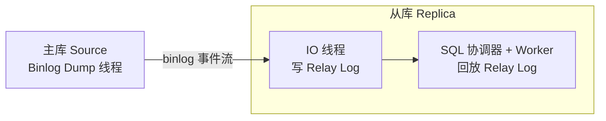

## 1. 复制架构与延迟的定义



三线程（组）模型：

| 线程               | 位置 | 作用                            |
| ------------------ | ---- | ------------------------------- |
| Binlog Dump 线程   | 主库 | 每个 FROM 侧连接一个，推送事件  |
| IO 线程（接收器）  | 从库 | 接收事件写入 Relay Log          |
| 回放器（协调器+Worker） | 从库 | 读取 Relay Log，按依赖关系回放 |

延迟的本质：**回放速度长期低于主库写入速度**，积压持续增长。

```sql
SHOW REPLICA STATUS\G
-- Seconds_Behind_Source：延迟秒数（旧名 Seconds_Behind_Master 已随 8.4 移除）
--   局限：它比较的是"事件时间戳"，网络中断重连、大事务执行中会显示 0 或失真
-- 更精确的做法：pt-heartbeat 在主库周期性写入心跳，从库计算真实滞后
--   pt-heartbeat -h 主库 --update -D test
--   pt-heartbeat -h 从库 --monitor -D test   -- 毫秒级真实延迟
```

> 术语：8.0.22 起 SHOW SLAVE STATUS 等旧拼写废弃，8.4 移除；
> 全文统一使用新名。

## 2. 延迟根因分析

### 2.1 单线程回放瓶颈（结构性主因）

主库事务可以任意并行，从库回放在同一时刻最多"依赖允许的"并行度：

```
主库（并行）:  T1 | T2 | T3 | T4   ← 同时提交
从库：         依赖判定后并行回放，无依赖关系才可同跑

主库 QPS 高于从库回放能力 → Seconds_Behind_Source 单调上升
```

8.0.27 起 `replica_parallel_workers` 默认 4，已默认多线程回放；
但"并行度"受依赖关系限制（见第 3 节），单表热点事务依然接近串行。

### 2.2 大事务

```sql
-- 反模式：一个事务改 500 万行
DELETE FROM logs WHERE created_at < '2025-01-01';

-- 从库必须把这个事务**完整**回放完，期间它独占协调器、
-- 其他事务即使无依赖也可能被（提交顺序约束）卡住 → 延迟陡增
```

大事务是延迟曲线"台阶式跳变"最常见的原因；治理见 3.4。

### 2.3 DDL

```sql
-- 大表 ALTER 回放：从库只有一套回放线程，DDL 期间该表相关事务全部排队
ALTER TABLE big_table ADD COLUMN new_col INT;
```

从库 DDL 还会带来二级问题：回放 DDL 时它持有的 MDL 锁会让读流量堆积。
治理：低峰执行、使用 gh-ost/pt-online-schema-change 在所有节点分别执行，
或接受"从库先变更"的滚动方案。

### 2.4 从库硬件与负载

| 资源 | 典型问题                       | 影响             |
| ---- | ------------------------------ | ---------------- |
| CPU  | 从库核数低于主库               | 回放并行度上不去 |
| 磁盘 | 从库用 HDD / 无 RAID 缓存保护  | Relay Log 与页写入慢 |
| 网络 | 主从带宽不足、跨机房 RTT 大    | IO 线程收不齐    |

从库还承担读流量：长查询占用 CPU/IO 与行锁，回放被拖慢——
"从库上跑报表把延迟跑出来"是经典事故。

## 3. 解决方案

### 3.1 并行复制（治结构性瓶颈）

并行策略的演进与当前配置见并行复制一篇，要点速览：

```sql
-- 8.0.27+/8.4：默认已开启写集并行回放
-- 老版本（8.0 早于 8.0.27）需要显式：
STOP REPLICA SQL_THREAD;
SET GLOBAL replica_parallel_workers = 8;        -- 旧名 slave_parallel_workers
SET GLOBAL replica_preserve_commit_order = ON;  -- 保证从库提交顺序与主库一致
START REPLICA SQL_THREAD;
```

| 方案（历史演进）     | 并行度来源     | 现状                              |
| -------------------- | -------------- | --------------------------------- |
| DATABASE（5.6 库级） | 不同数据库     | 已废弃并于 8.4 移除，单库无效     |
| LOGICAL_CLOCK（5.7） | 主库组提交批次 | 仍是回放的兜底依赖判定            |
| WRITESET（8.0+）     | 行级依赖关系   | 8.4 起自动启用，无需任何开关变量  |

> 版本注意：`binlog_transaction_dependency_tracking` 与
> `transaction_write_set_extraction` 两个老开关在 8.4 已被移除——
> 8.4 中服务器总是收集写集，只要 Worker > 0 就按"写集优先、COMMIT_ORDER 兜底"
> 并行回放，配置文件里不要再写这两行。

### 3.2 半同步复制（不解决延迟，解决不丢）

```sql
-- 半同步等的是"从库已收到 binlog"的 ACK，不是"回放完成"
-- 它提升数据安全，对延迟没有直接帮助（反而增加主库提交时延）
INSTALL PLUGIN rpl_semi_sync_source SONAME 'semisync_source.so';
SET GLOBAL rpl_semi_sync_source_enabled = ON;
```

职责区分：丢数据风险 → 半同步/组复制；延迟 → 并行复制 + 事务治理。

### 3.3 拆分大事务与批量治理

```sql
-- 反模式：单条大事务
DELETE FROM logs WHERE created_at < '2025-01-01';

-- 正解 1：按主键分批 + 循环执行（每批一个事务）
DELETE FROM logs WHERE created_at < '2025-01-01' ORDER BY id LIMIT 10000;

-- 正解 2：按时间片分批
DELETE FROM logs WHERE created_at >= '2024-01-01' AND created_at < '2024-02-01';

-- 正解 3：pt-archiver 自动化归档/删除
-- pt-archiver --source h=host,D=db,t=logs --where "created_at<'2025-01-01'" \
--   --purge --limit 10000 --commit-each
```

经验阈值：单事务行数控制在几万到几十万以内，并在压测中验证从库回放耗时。

### 3.4 从库侧治理

```sql
-- 1. 从库必须只读，防止外部写入破坏一致性
SET GLOBAL read_only = ON;
SET GLOBAL super_read_only = ON;   -- 连有 SUPER 权限的会话也挡住

-- 2. 用 pt-query-digest 分析从库慢查询，报表/大查询迁到专用只读实例
-- pt-query-digest slow.log

-- 3. 从库配置不要"缩水"：buffer_pool 等关键参数与主库同级，
--    否则同样的 SQL 在从库跑得慢，回放就被拖住
```

### 3.5 读写分离路由策略（应用层兜底）

```
1. 关键路径（下单后立刻查订单）强制读主库，或走"会话级粘主"
2. 延迟超过阈值时，中间件自动把读切回主库（降级保护）
3. 常用组件：MySQL Router、ProxySQL、ShardingSphere 等；
   基于 GTID 的一致性读（如 WAIT_FOR_EXECUTED_GTID_SET）可做精确"读自己写"
```

```sql
-- "读自己写"的轻量实现：写事务返回后记录 GTID，读请求先等待该 GTID 回放完成
SELECT WAIT_FOR_EXECUTED_GTID_SET('3E11FA47-...:1-100', 1);  -- 最多等 1 秒
```

## 4. 监控与告警

```sql
SHOW REPLICA STATUS\G
-- Seconds_Behind_Source          延迟秒数（粗）
-- Replica_IO_Running / Replica_SQL_Running   双 Yes 才健康
-- Retrieved_Gtid_Set / Executed_Gtid_Set     差集=在路上/未回放的事务

-- Worker 级视角：哪个 Worker 卡在哪个事务
SELECT worker_id, last_applied_transaction, last_processed_transaction
FROM performance_schema.replication_applier_status_by_worker;

-- IO 慢还是回放慢？看一对差值：
--   Read_Master_Log_Pos 远超 Exec_Source_Log_Pos → 回放慢（上并行/拆事务）
--   两者接近但 Seconds_Behind_Source 大          → IO/网络慢（查主库 IO 与带宽）
```

## 5. 小结

- 初学者要点：延迟 = 回放跟不上写入；大事务与单线程回放是两大根因；
  治理三板斧：开并行复制、拆大事务、从库只读并隔离重查询。
- 进阶注意：8.4 移除了 `binlog_transaction_dependency_tracking` 等老开关，
  写集并行是默认行为；`Seconds_Behind_Source` 有盲区，精确监控用 pt-heartbeat；
  半同步解决"丢不丢"，不解决"延不延"，两者不要混为一谈。
