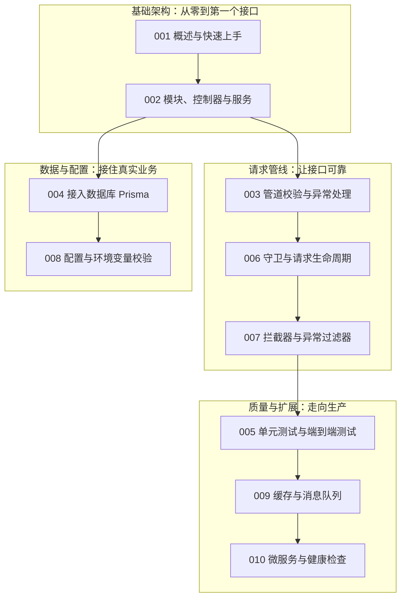

本篇是 nestjs 模块的收官总结。我们以一个"虚拟歌手音乐平台"的后端为线索，把前 10 篇文档的核心内容重新串一遍：平台上有 P 主（producer）发布歌曲（song），歌姬（virtual singer）拥有自己的应援色，演唱会（concert）开放抢票，粉丝团（fan club）随时在线。围绕这些实体，你会再次看到模块、守卫、拦截器、队列与微服务各自扮演的角色，并能在自检清单上确认自己真正掌握了多少。回顾不同于初学：初学追求"每一步都跑通"，回顾追求"每一层都说得清"。建议先遮住各节的代码示例，只看小节标题回忆写法，再展开对照；说不上来的条目直接跳回对应原文档重读。整张知识地图里，模块三层结构与请求生命周期是两个枢纽——前者决定代码怎么组织，后者决定请求怎么流动，务必优先巩固。

## 前置知识

- [NestJS 模块、控制器与服务](/nestjs/002-ModuleControllerService)：三层结构与 DTO 是全部后续内容的地基，回顾前请确认能独立写出一条完整路由。
- [NestJS 管道校验与异常处理](/nestjs/003-ValidationPipes)：管道与异常过滤器决定了接口的可靠性，回顾守卫与拦截器时需要以它为参照。

## 学习目标

1. 能画出 NestJS 请求生命周期管线图，说清中间件、守卫、拦截器、管道、处理器、异常过滤器七层组件的执行顺序与职责边界。
2. 能按"模块-控制器-服务-DTO"四件套独立搭建一个功能单元，并通过 Prisma 完成数据库持久化与模块化注入。
3. 能用 `@nestjs/config` 与 zod 搭建"启动即校验"的类型安全配置体系，避免环境变量翻车三连。
4. 能判断应用何时需要缓存、队列与微服务，并用 CacheModule、BullMQ 与 Terminus 落地对应方案。

## 知识地图



## 核心概念回顾

### 1. 三层结构与依赖注入

NestJS 借鉴 Angular 的架构思想，把服务端代码固定为"模块（组装）+ 控制器（翻译 HTTP）+ 服务（业务逻辑）+ DTO（定义入参）"四件套。控制器只做协议适配，业务全部下沉到服务；服务之间通过构造器注入协作，容器负责实例的创建与复用。用 [模块、控制器与服务](/nestjs/002-ModuleControllerService) 中的方法搭建平台的歌曲单元：

```typescript
// src/songs/songs.service.ts —— 歌曲服务：查询某位 P 主发布的全部歌曲
import { Injectable } from "@nestjs/common"
import { PrismaService } from "../prisma/prisma.service"

@Injectable() // 标记为可注入，容器负责实例化
export class SongsService {
  constructor(private readonly prisma: PrismaService) {}

  /** 按 P 主筛选歌曲，发布时间倒序，供首页"新曲速递"使用 */
  findByProducer(producerId: number) {
    return this.prisma.song.findMany({
      where: { producerId },
      orderBy: { publishedAt: "desc" },
      include: { singer: true } // 连带返回演唱歌姬与应援色
    })
  }
}
```

依赖注入的价值在测试时才真正显现：服务从不自己创建依赖，测试就能在容器里把 PrismaService 换成替身，单测因此又快又稳。待办示例与上面的歌曲服务结构完全同构，把实体名换掉、写法整体复用，这正是结构规范的意义——任何人打开你的模块，都能在三分钟内找到控制器、服务与 DTO 各自的位置。

### 2. 管道校验：DTO 是请求的第一道门

管道在请求进入控制器前做"安检"：类型不对、字段缺失、格式错误全部在门口拦截。声明式校验靠 `class-validator` 装饰器写在 DTO 类上，再由全局 `ValidationPipe` 统一启用；`class-transformer` 负责把普通对象转成类实例，让规则真正生效（见[管道校验与异常处理](/nestjs/003-ValidationPipes)）：

```typescript
// src/songs/dto/create-song.dto.ts —— P 主投稿歌曲的入参标准
import { IsInt, IsString, Length, Min } from "class-validator"

export class CreateSongDto {
  @IsString()
  @Length(1, 50, { message: "歌名需在 1-50 字符之间" })
  songName: string

  @IsInt()
  @Min(1, { message: "歌曲必须挂在真实 P 主名下" })
  producerId: number

  @IsInt()
  @Min(2, { message: "BPM 不得低于 2" })
  bpm: number
}
```

校验规则写在 DTO 上而非控制器里，意味着同一个 DTO 被任何入口复用时都自动获得同样的安检标准。ValidationPipe 需要全局启用，并建议带上 whitelist 选项剥离请求里未经声明的字段，防止恶意多传的数据绕过校验直入服务层；rejectUnknownProperties 一类的严格策略则要在与前端约定后再打开，避免正常请求被误伤。

### 3. 守卫与请求生命周期

一个请求会依次穿过中间件、守卫、拦截器前半、管道、处理器、拦截器后半、异常过滤器七层，每层只做一类事。守卫用 `CanActivate` 决定"能不能进"，配合 `@SetMetadata` 与 `Reflector` 可以实现声明式角色控制（见[守卫与请求生命周期](/nestjs/006-GuardsAndLifecycle)）：

```typescript
// src/concerts/concerts.guard.ts —— 演唱会守卫：只有主办方与认证 P 主能改排期
@Injectable()
export class ConcertGuard implements CanActivate {
  constructor(private readonly reflector: Reflector) {}

  canActivate(context: ExecutionContext): boolean {
    // 读取 handler 或控制器上 @SetMetadata("roles", [...]) 声明的角色要求
    const roles = this.reflector.getAllAndOverride<string[]>("roles", [
      context.getHandler(),
      context.getClass()
    ])
    if (!roles) return true // 未声明角色要求则放行
    const { user } = context.switchToHttp().getRequest()
    return roles.includes(user?.role) // "organizer" 或 "verified-producer"
  }
}
```

守卫只回答"能不能进"，不回答"进来了是什么"：响应形态归拦截器管，错误形态归过滤器管，三层各司其职才不会互相越界。三种绑定作用域中，全局绑定推荐用 APP_GUARD 这样的 token 在模块 providers 里注册，让容器参与实例化，守卫内部的依赖注入才不会断裂。

### 4. 拦截器与异常过滤器

拦截器是函数式思维：`next.handle()` 返回 RxJS 响应流，写在 `handle()` 之前的是前半（计时、记录请求），用操作符加工返回流的是后半（统一响应壳、错误翻译）。异常过滤器则兜底所有未捕获异常，把错误翻译成统一 JSON。两者共同决定接口的最终输出形态（见[拦截器与异常过滤器](/nestjs/007-InterceptorsAndFilters)）：

```typescript
// src/common/interceptors/response.interceptor.ts —— 全站统一响应壳
@Injectable()
export class ResponseInterceptor implements NestInterceptor {
  intercept(context: ExecutionContext, next: CallHandler): Observable<any> {
    return next.handle().pipe(
      tap(() => {
        // 前后半交界：此处可顺手记录"歌曲列表耗时 xx ms"等日志
      }),
      map((data) => ({ code: 0, message: "ok", data })) // 正常路径包一层壳
    )
  }
}
```

拦截器最容易误解的是它的"环绕"结构：handle 之前的前半段同步执行，对返回流的加工才是后半段，异常必须在流上用 catchError 接住，而不是套一层 try/catch。理解了"响应是一条流"这个关键字，map、tap、catchError 三兄弟的分工就一目了然，日志与响应壳也可以拆成两个职责单一的拦截器。

### 5. 配置体系与环境变量校验

配置翻车三连——`DATABASE_URL` 拼错、`PORT` 读出字符串、密钥提交进 git——都可以在启动阶段拦截。`registerAs` 命名空间收敛散落配置，zod 的 `validate` 函数让坏配置直接导致启动失败，`z.infer` 再给出类型安全的读取结果（见[配置与环境变量校验](/nestjs/008-ConfigEnvValidation)）：

```typescript
// src/config/env.validation.ts —— zod 校验：坏配置在启动时就报错
import { z } from "zod"

export const envSchema = z.object({
  DATABASE_URL: z.string().url(), // 数据库连接串必须是合法 URL
  PORT: z.coerce.number().int().positive(), // 字符串 "3000" 自动转数字 3000
  JWT_SECRET: z.string().min(16, "密钥至少 16 位"), // 粉丝登录态签名密钥
  QUEUE_CONCURRENCY: z.coerce.number().default(5) // 抢票队列并发数，缺省 5
})

export type Env = z.infer<typeof envSchema> // 推导出类型安全的配置形状
```

zod 校验的价值在于 fail fast：应用启动的第一毫秒就把坏配置拦下，而不是让第一万个请求踩坑。配合 registerAs 命名空间与类型化的 ConfigService，配置读取从"到处 process.env"收敛为"一处声明、处处类型安全"，密钥管理也顺势获得 .env 多环境分层与 .env.example 的团队约定。

### 6. 缓存与消息队列

单机 CRUD 撑不到生产规模：同一接口每秒被查几十次用响应缓存，导出报表、抢票出票这类慢操作用队列异步化。BullMQ 的任务自带重试与退避策略，消费失败不会拖垮 HTTP 响应（见[缓存与消息队列](/nestjs/009-CachingAndQueues)）：

```typescript
// src/concerts/tickets.processor.ts —— BullMQ 消费者：演唱会抢票异步出票
@Processor("tickets")
export class TicketsProcessor {
  constructor(private readonly prisma: PrismaService) {}

  /** 每个出票任务自动获得重试与指数退避，失败任务进入 delayed 状态 */
  @Process("issue")
  async handle(job: Job<{ concertId: number; fanClubId: number }>) {
    await this.prisma.ticket.create({
      data: {
        concertId: job.data.concertId,
        fanClubId: job.data.fanClubId, // 票归属到粉丝团，方便应援统计
        seatZone: "A" // 按粉丝团等级分配看台区
      }
    })
    return `粉丝团 ${job.data.fanClubId} 出票成功`
  }
}
```

缓存与队列的共同前提是打破"请求-响应同步完成"的假设：缓存把读压力挪到进程外，队列把慢操作挪到时间轴之外。引入前先确认症状真实存在——列表接口确实被高频重复查询、导出确实拖慢了响应；为不存在的规模支付复杂度，是 009 篇反复强调的反模式。

### 7. 微服务与健康检查

当多个应用开始重复实现同一套逻辑时，才轮到微服务。NestJS 的底气是"同一套代码换传输层"：`@MessagePattern` 承接请求-响应调用，`@EventPattern` 承接事件广播，`connectMicroservice` 让 HTTP 与微服务在同一个进程共存；再用 `@nestjs/terminus` 暴露健康检查端点供探针探测（见[微服务与健康检查](/nestjs/010-MicroservicesAndHealth)）：

```typescript
// src/songs/songs.controller.ts —— 消息处理器：HTTP 路由与微服务共用同一份业务
@MessagePattern({ cmd: "songs.hot" }) // 请求-响应：调用方等待热门歌曲榜
findHot() {
  return this.songsService.findHot(10)
}

@EventPattern("concert.finished") // 事件模式：演唱会结束广播，不等待返回
handleConcertFinished(payload: { concertId: number }) {
  // 归档该场演唱会的全部曲目，刷新歌姬的代表作统计
  return this.songsService.archiveByConcert(payload.concertId)
}
```

微服务是最后一块拼图：当多个应用开始重复实现同一套逻辑时才拆进程，且先在同一仓库里拆清模块边界、用队列通信，边界稳定后再拆分部署。传输层可插拔让 TCP、Redis、NATS 之间切换只改一行配置；健康检查端点则交给部署平台的探针定时探测，Terminus 已为数据库、内存、磁盘等常见探针提供现成实现。

## 易混淆概念对比

请求管线的组件最容易被混用，先用一张表划清职责（依据[守卫与请求生命周期](/nestjs/006-GuardsAndLifecycle)）：

| 组件 | 核心接口 | 执行时机 | 典型职责 |
| --- | --- | --- | --- |
| 中间件 | NestMiddleware | 管线最前 | CORS、body 解析、请求日志 |
| 守卫 | CanActivate | 管道之前 | 登录态、角色、限流 |
| 拦截器 | NestInterceptor | 处理器前后两半 | 耗时统计、统一响应壳 |
| 管道 | PipeTransform | 进控制器前 | 参数类型转换与校验 |
| 异常过滤器 | ExceptionFilter | 全管线兜底 | 统一错误 JSON 输出 |

另一组高频混淆是微服务的两种消息处理器，选错会导致调用方永远等不到响应：

| 维度 | @MessagePattern | @EventPattern |
| --- | --- | --- |
| 通信模式 | 请求-响应 | 发布-订阅 |
| 返回值 | 返回给调用方 | 不等待、不返回 |
| 典型场景 | 查询热门歌曲榜 | 演唱会结束后归档 |
| 失败表现 | 调用方收到异常 | 由消费方自行重试补偿 |

## 常见误区与排查

以下五条来自真实项目的高频翻车，每条先给错误写法，再给修正代码。

1. 忘记把服务注册进 `providers`，容器报 `Nest can't resolve dependencies`。错误写法是只注入不注册；正确做法是让所属模块持有它：

```typescript
@Module({
  controllers: [SongsController],
  providers: [SongsService] // 忘了这一行，SongsController 的注入就会爆炸
})
export class SongsModule {}
```

2. DTO 写成 `interface`，`ValidationPipe` 完全不生效。装饰器只能附着在类上，`class-transformer` 也只认类实例：

```typescript
// 错误：interface 在编译后消失，校验规则无处附着
// interface CreateSongDto { songName: string }

// 正确：必须是 class，配合 @IsString() 等装饰器
export class CreateSongDto {
  @IsString()
  songName: string
}
```

3. 直接拿 `process.env.PORT` 与数字比较，`"3000" === 3000` 永远为 false。用 zod 的 `z.coerce.number()` 在启动期完成转换（见[配置与环境变量校验](/nestjs/008-ConfigEnvValidation)）：

```typescript
// 错误：比较永远为假，端口静默回退到默认值
// if (process.env.PORT === 3000) enableDebugRoutes()

// 正确：先声明转换再读取
const port = envSchema.parse(process.env).PORT // 数字 3000
```

4. 用 `useGlobalFilters(SomeFilter)` 注册全局过滤器，过滤器内部注入的服务会脱离容器。应改为在模块中用 `APP_FILTER` token 注册，让依赖注入全程生效：

```typescript
 providers: [
   {
     provide: APP_FILTER, // 以容器接管的方式注册全局过滤器
     useClass: AllExceptionsFilter
   }
 ]
```

5. 端到端测试直连真实数据库，一次误删让开发数据全部归零。用 `overrideProvider` 把 PrismaService 换成测试替身（见[单元测试与端到端测试](/nestjs/005-Testing)）：

```typescript
const moduleRef = await Test.createTestingModule({
  imports: [AppModule]
})
  .overrideProvider(PrismaService) // 用假数据库替换真实连接
  .useValue(fakePrisma)
  .compile()
```

## 自检清单

- [ ] 能用 `nest g` 三条命令生成功能模块，并说出模块、控制器、服务各自负责什么
- [ ] 能为一个投稿接口写出带 `class-validator` 规则的 DTO，并说明为什么必须是 class 而不是 interface
- [ ] 能默画请求生命周期管线图，指出守卫与管道的先后顺序
- [ ] 能用 `@SetMetadata` 加 `Reflector` 实现声明式角色鉴权
- [ ] 能写一个拦截器完成耗时统计，并解释 `map`、`tap`、`catchError` 各自的分工
- [ ] 能用 zod 让错误的环境变量在启动阶段直接失败，并推导出类型安全的配置
- [ ] 能判断一个慢接口该用缓存还是队列，并为 BullMQ 任务配置重试退避
- [ ] 能区分 `@MessagePattern` 与 `@EventPattern`，并说出健康检查端点给谁用

## 后续学习路径

1. 若三层结构还不够熟练，回到[模块、控制器与服务](/nestjs/002-ModuleControllerService)把待办示例完整重写一遍。
2. 想吃透管线行为，精读[守卫与请求生命周期](/nestjs/006-GuardsAndLifecycle)与[拦截器与异常过滤器](/nestjs/007-InterceptorsAndFilters)，并用实验验证执行顺序。
3. 向生产迈进，按[缓存与消息队列](/nestjs/009-CachingAndQueues)、[微服务与健康检查](/nestjs/010-MicroservicesAndHealth)的顺序，先解决读压力再拆服务边界。
4. 每一步都配合[单元测试与端到端测试](/nestjs/005-Testing)补齐安全网，让重构有据可依。
