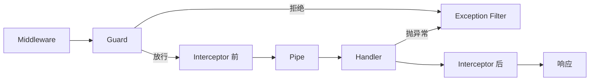

## 0. 请求生命周期（先读这里）

> 学习目标：看懂一个请求从进入 NestJS 到返回响应要穿过哪些组件、各自负责什么；会用 CanActivate 编写鉴权守卫，用 @SetMetadata 与 Reflector 实现声明式角色控制；理解方法级、控制器级、全局三种绑定作用域的差异。

一个请求会依次穿过 7 层组件，每层只做一类事：

| 顺序 | 组件 | 核心接口 | 典型职责 |
| --- | --- | --- | --- |
| 1 | 中间件 Middleware | NestMiddleware | 通用预处理：CORS、body 解析、请求日志 |
| 2 | 守卫 Guard | CanActivate | 决定请求能否继续：登录态、角色、限流 |
| 3 | 拦截器（前半） | NestInterceptor | 计时起点、请求改写 |
| 4 | 管道 Pipe | PipeTransform | 参数转换与校验（见[管道校验与异常处理](/nestjs/170-ValidationPipes)） |
| 5 | 处理器 Handler | Controller + Service | 真正的业务逻辑 |
| 6 | 拦截器（后半） | RxJS 操作符 | 响应映射、统一包装 |
| 7 | 异常过滤器 | ExceptionFilter | 兜底所有未捕获异常 |



先记住三个结论：守卫在管道与处理器之前，鉴权失败时校验和业务都不会执行；拦截器横跨前后两半，天然适合"环绕通知"式的逻辑；任何一层抛出的异常，最终都汇入异常过滤器。拦截器与异常过滤器是下一篇的主角，本章先把管线起点（守卫）吃透。

## 1. 第一个守卫：CanActivate

守卫返回 `true` 放行、`false` 拒绝（默认 403）。先做一个登录守卫：

```typescript
// src/common/guards/auth.guard.ts
import {
  CanActivate,
  ExecutionContext,
  Injectable,
  UnauthorizedException
} from "@nestjs/common"

@Injectable()
export class AuthGuard implements CanActivate {
  canActivate(context: ExecutionContext): boolean {
    const request = context.switchToHttp().getRequest()
    const token = request.headers["authorization"]
    if (!token) {
      // 未携带凭证直接 401，业务代码完全无感
      throw new UnauthorizedException("请先登录")
    }
    // 真实项目在这里校验 JWT，并把解析出的用户挂到 request 上
    request.user = { id: 1, name: "itian", roles: ["admin"] }
    return true
  }
}
```

**讲解：**

1. `ExecutionContext` 是"请求上下文 + 反射信息"的组合体：`switchToHttp()` 拿到底层请求/响应对象，`getHandler()` 与 `getClass()` 用来区分当前是哪个方法、哪个控制器。
2. 守卫里抛异常与返回 `false` 都是拒绝，但抛 `UnauthorizedException`、`ForbiddenException` 能带明确的状态码与文案，前端好区分"没登录"和"没权限"。
3. `request.user` 是守卫写给下游的"公共上下文"：管道、处理器、拦截器都能读到，第 4 节的参数装饰器会优雅地消费它。
4. 守卫是 DI 容器的正式成员，可以注入 `ConfigService`、`JwtService` 等任意 Provider，这是守卫优于"控制器里手写 if 判断"的根本原因。

## 2. 声明式角色控制：@SetMetadata 与 Reflector

"哪些接口要什么角色"不该硬编码在守卫里，用元数据声明、由守卫读取：

```typescript
// src/common/decorators/roles.decorator.ts
import { SetMetadata } from "@nestjs/common"

export const ROLES_KEY = "roles"
// @Roles("admin") 会把 ["admin"] 写进路由元数据
export const Roles = (...roles: string[]) => SetMetadata(ROLES_KEY, roles)
```

```typescript
// src/common/guards/roles.guard.ts
import {
  CanActivate,
  ExecutionContext,
  ForbiddenException,
  Injectable
} from "@nestjs/common"
import { Reflector } from "@nestjs/core"
import { ROLES_KEY } from "../decorators/roles.decorator"

@Injectable()
export class RolesGuard implements CanActivate {
  constructor(private readonly reflector: Reflector) {}

  canActivate(context: ExecutionContext): boolean {
    // 依次查"方法上"与"类上"的元数据，方法级覆盖类级
    const required = this.reflector.getAllAndOverride<string[]>(ROLES_KEY, [
      context.getHandler(),
      context.getClass()
    ])
    if (!required?.length) return true // 未标注角色的接口不限制
    const { user } = context.switchToHttp().getRequest()
    const ok = required.some((role) => user?.roles?.includes(role))
    if (!ok) throw new ForbiddenException("权限不足")
    return true
  }
}
```

控制器里两个守卫一起挂：

```typescript
// src/todos/todos.controller.ts（节选）
@Controller("todos")
@UseGuards(AuthGuard) // 类级：整个控制器都要求登录
export class TodosController {
  @Post()
  @UseGuards(RolesGuard) // 方法级：登录之外还要求角色
  @Roles("admin")
  create(@Body() dto: CreateTodoDto) {
    return this.todosService.create(dto)
  }
}
```

**讲解：**

1. `@SetMetadata(key, value)` 把任意数据附着在路由上，本质是给方法打了个标签；`Reflector` 是读取标签的官方工具。
2. `getAllAndOverride` 按数组顺序查找、命中即返回，形成"方法覆盖类"的语义；想把两处角色合并判断则改用 `getAllAndMerge`。
3. 规则写在路由上（声明）、逻辑收敛在守卫里（执行），新增接口只需要一行 `@Roles(...)`——这就是声明式鉴权的价值。
4. 进阶：Nest 新版提供 `Reflector.createDecorator<string[]>()` 创建类型安全的装饰器，用法以官方文档为准。

## 3. 绑定作用域：方法、控制器与全局

| 方式 | 写法 | 依赖注入 | 适用场景 |
| --- | --- | --- | --- |
| 方法级 | 方法上 `@UseGuards(X)` | 传类引用时支持 | 单个接口的特殊规则 |
| 控制器级 | 类上 `@UseGuards(X)` | 传类引用时支持 | 整组接口统一约束 |
| 全局（推荐） | `{ provide: APP_GUARD, useClass }` | 支持 | 鉴权等全站逻辑 |
| 全局（实例） | `app.useGlobalGuards(new X())` | 不支持 | main.ts 里快速试验 |

全局注册推荐走模块 Provider：

```typescript
// src/app.module.ts（节选）
import { APP_GUARD } from "@nestjs/core"

@Module({
  providers: [
    { provide: APP_GUARD, useClass: AuthGuard }, // 先注册先执行
    { provide: APP_GUARD, useClass: RolesGuard }
  ]
})
export class AppModule {}
```

**讲解：**

1. 传类引用（而非 new 出来的实例）时，Nest 会在所属模块作用域内实例化，构造器依赖正常注入；`useGlobalGuards(new X())` 脱离模块上下文，只适合零依赖组件。
2. 同一个 `APP_GUARD` token 写多个即注册多个全局守卫，执行顺序就是书写顺序：AuthGuard 先登录校验，RolesGuard 后判角色。
3. 全局守卫对每一个路由生效（包括不存在的路由），因此 RolesGuard 里"没有元数据就放行"的判断必不可少。

## 4. 自定义参数装饰器：消费守卫的产出

守卫把用户挂到 `request.user` 之后，用参数装饰器在控制器里优雅取出：

```typescript
// src/common/decorators/current-user.decorator.ts
import { createParamDecorator, ExecutionContext } from "@nestjs/common"

export const CurrentUser = createParamDecorator(
  (data: string | undefined, ctx: ExecutionContext) => {
    const request = ctx.switchToHttp().getRequest()
    const user = request.user
    // @CurrentUser("id") 取单字段；@CurrentUser() 取整个用户对象
    return data ? user?.[data] : user
  }
)
```

```typescript
@Get("me")
me(@CurrentUser() user: AuthUser, @CurrentUser("name") name: string) {
  return { user, name }
}
```

**讲解：**

1. 工厂函数第一个参数就是使用处传入的值：`@CurrentUser("id")` 传入 `"id"`，配合可选参数实现"取整 / 取字段"两种用法。
2. 参数装饰器在管道之后求值，但它依赖的数据（`request.user`）由守卫提前写入——管线各层围绕同一个 request 对象协作，分工明确。

## 5. 小结与延伸

- 请求生命周期七层：Middleware、Guard、Interceptor（前）、Pipe、Handler、Interceptor（后）、Exception Filter，各层只做一类事。
- 守卫答"能不能进"：`CanActivate` + `ExecutionContext` 判断，`@SetMetadata`/`Reflector` 做声明式角色控制。
- 全站性守卫用 `APP_GUARD` token 注册在 `AppModule`，支持 DI 且顺序可控。
- 延伸：真实项目鉴权用 `@nestjs/passport` + `@nestjs/jwt`（Strategy 模式对接守卫）；限流用 `@nestjs/throttler`（同样基于守卫实现）。
