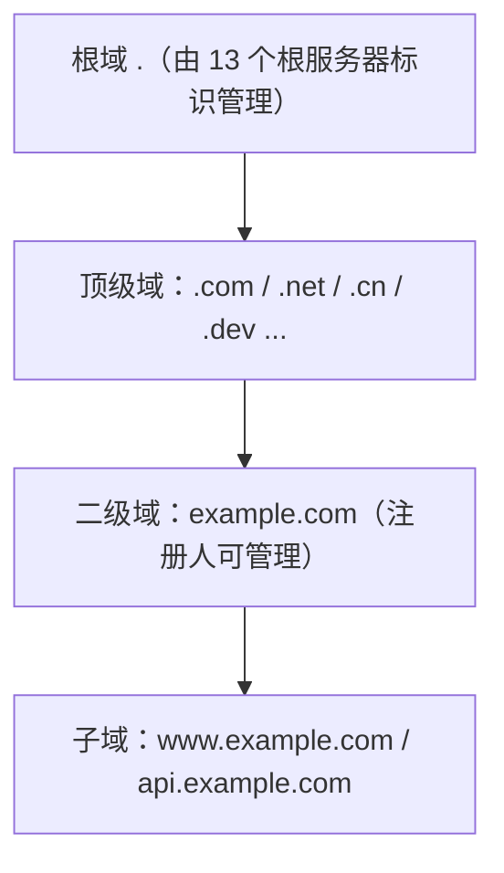
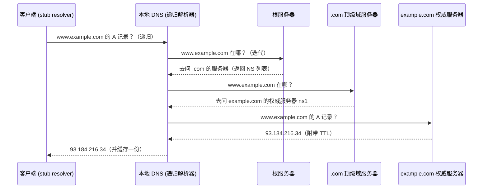
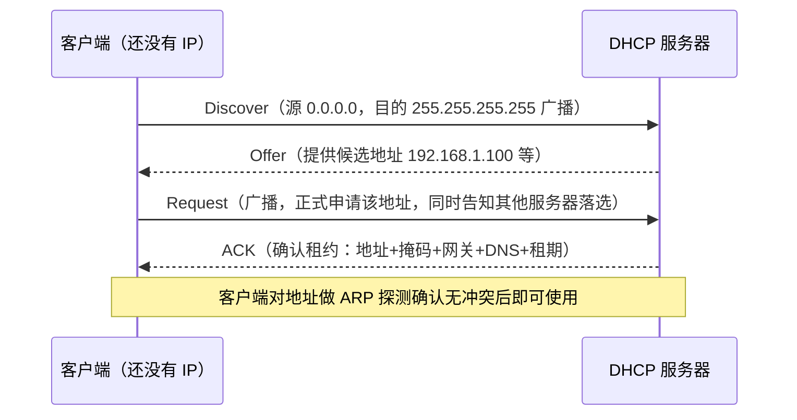

前置知识：TCP/IP 分层模型、UDP/TCP 的区别、子网划分（见 [网络基础与协议](networking/010-NetworkBasicsAndProtocol)）。

学习目标：

- 说清 DNS 递归查询与迭代查询的区别，能读懂 `dig` 完整输出；
- 理解 DNS 明文传输的风险，知道 DoT / DoH / DoQ 三条加密路线的区别与现状；
- 理解 DNSSEC 的信任链如何从根域一路验证到你的查询结果；
- 掌握 DHCP 的 DORA 四步流程与租约续期时机，能区分 DHCPv6 与 SLAAC 两种 IPv6 地址获取方式。

## 1. 为什么需要 DNS

计算机网络只认 IP 地址，但人类记不住 `142.250.196.110`，只记得 `google.com`。DNS（Domain Name
System，域名系统）就是这两者之间的翻译层——可以类比成一部**分层维护的电话簿**：你问前台（本地
DNS 服务器）「example.com 的电话是多少」，前台自己不认识，就替你去问总公司、再问分公司，最后把
号码抄给你，并顺手记在自己的小本子上（缓存）。

最早的方案是每台主机维护一个 `hosts` 文件（如今位于 `/etc/hosts`），由 SRI-NIC 统一分发。主机
数量一多，单文件既改不动也同步不动，于是 1983 年诞生的 DNS（RFC 1034/1035）用两个核心思想解决
了扩展性问题：

- **层次化命名**：域名按 `主机名.二级域.顶级域.根` 组织，每一级由不同机构管理，责权分明；
- **分散式数据库 + 缓存**：数据分散在全球的权威服务器上，查询结果沿途缓存，热点域名不必每次都
  问到根。

> 类比失真提示：电话簿是「查询后不通知」的，而 DNS 记录有 TTL，缓存到期后必须重新查询——类比
> 中省略了「时效」这一维度。

## 2. 域名空间与解析流程

### 2.1 域名层次结构



「13 个根服务器」是**逻辑标识**（A 到 M），借助 Anycast 任播技术，每个标识在全球部署了上千个实
例节点——这是初学者最常见的误解之一，详见 [BGP 与多线机房互联](networking/300-BGP) 的 Anycast
一节。

### 2.2 递归查询与迭代查询

这是 DNS 面试与排障中区分度最高的一对概念：

- **递归查询（recursive）**：客户端 → 本地 DNS。「你必须给我最终答案，查不到别回来」；
- **迭代查询（iterative）**：本地 DNS → 根 / 顶级域 / 权威。「你不知道就告诉我该去问谁」。



### 2.3 用 dig 观察一次真实解析

```bash
# 递归查询：向系统配置的本地 DNS 发起
dig www.example.com

# 追踪完整的迭代过程（从根开始逐级显示）
dig +trace www.example.com

# 指定查询 8.8.8.8，绕过本地缓存，便于对比
dig @8.8.8.8 www.example.com
```

`dig` 输出的关键字段（节选）：

```text
;; QUESTION SECTION:
;www.example.com.		IN	A

;; ANSWER SECTION:
www.example.com.	86400	IN	A	93.184.216.34
;                ^^^^^^ ^^     ^^^^^^^^^^^^^
;                 TTL  记录类型   记录值

;; Query time: 26 msec
;; SERVER: 192.168.1.1#53(192.168.1.1)   ← 实际应答的解析器
```

`86400` 是 TTL（秒），即这条记录允许被缓存一天。域名迁移时如果旧记录 TTL 很长，全球缓存要等
TTL 过期才会更新——**迁移前先调低 TTL** 是运维铁律。

## 3. 常见资源记录类型

| 类型  | 作用                  | 示例                                      |
| :---: | :-------------------- | :---------------------------------------- |
| A     | 域名 → IPv4 地址      | `www IN A 93.184.216.34`                  |
| AAAA  | 域名 → IPv6 地址      | `www IN AAAA 2606:2800:220:1::1`          |
| CNAME | 别名，指向另一个域名  | `blog IN CNAME example.github.io`         |
| MX    | 邮件交换，带优先级    | `IN MX 10 mail.example.com`               |
| NS    | 指定权威名称服务器    | `IN NS ns1.example.com`                   |
| SOA   | 区域起点：主 NS、序号、刷新参数 | 序号递增触发从服务器同步          |
| TXT   | 任意文本              | SPF 反垃圾邮件、域名所有权验证            |
| SRV   | 服务定位              | `_sip._tcp IN SRV 10 60 5060 sip.example.com` |
| CAA   | 限定可为该域签发证书的 CA | `IN CAA 0 issue "letsencrypt.org"`    |

两条高频陷阱规则：

1. **CNAME 不能与其他记录共存**。RFC 1034 规定 CNAME 与任何其他资源记录互斥，所以根域
   （`example.com`）通常不能设 CNAME（根域必须有 SOA/NS 记录），需要跳转时用 ALIAS /
   flattened CNAME 这类厂商扩展实现；
2. **MX 指向的目标不能是 CNAME**。部分解析器会拒绝处理，邮件投递可能失败。

## 4. DNS 缓存层级与 TTL

一次解析可能命中四层缓存，排障时要从上往下逐层排除：

```text
浏览器缓存（几十秒~分钟级）
  → 操作系统缓存（systemd-resolved / nscd）
    → 本地 DNS 服务器缓存（路由器、运营商或公共解析器）
      → 权威服务器（真正的数据源）
```

- TTL 越长 → 解析越快、权威压力越小，但记录变更生效越慢；典型的平衡值是 300~3600 秒；
- **负缓存**：查询「不存在的域名」这一否定答案同样会被缓存（时长取自权威 SOA 记录的
  negative TTL 参数），所以刚注册的新域名有时「明明配好了却查不到」；
- Linux 下解析顺序由 `/etc/nsswitch.conf` 的 `hosts:` 行决定——通常是 `files dns`，即先查
  `/etc/hosts` 再走 DNS。容器镜像里 DNS 失灵的第一检查项就是它。

## 5. DNS 传输与加密演进

传统 DNS 查询走 UDP 53 端口**明文传输**，路径上的任何设备都能看到你在访问哪个域名，也能篡改
应答（运营商劫持、DNS 缓存投毒都是现实攻击面）。加密 DNS 因此成为近年标准化与落地的重点：

| 方案 | 标准    | 传输        | 端口  | 特点                               |
| :--- | :------ | :---------- | :---: | :--------------------------------- |
| 传统 | RFC 1035 | UDP/TCP    | 53    | 明文，兼容性最好                   |
| DoT  | RFC 7858 (RFC 8310 用于严格隐私) | TLS over TCP | 853 | 传输层加密，独立端口便于防火墙管控 |
| DoH  | RFC 8484 | HTTPS (HTTP/2) | 443 | 与网页流量混在一起，难以区分与封锁；主流浏览器与主流操作系统均已支持 |
| DoQ  | RFC 9250 | QUIC (RFC 9000) | 853/443 | 避免 DoT 的 TCP 队头阻塞，延迟特性接近 UDP 明文 DNS |

补充两点现状，避免过度推断：

- 大规模公共解析器（如 `1.1.1.1`、`8.8.8.8`）同时提供 DoT/DoH/DoQ 三种接入，客户端侧由浏览
  器或操作系统配置决定走哪条；企业网络则常用防火墙直接封 853 端口、并劫持明文 53 来强制内网
  解析策略，这也是很多「开了加密 DNS 后公司内网域名解析失败」问题的根源；
- 另一个值得知道的记录类型是 **HTTPS（SVCB）记录**（RFC 9460）：它可以在 DNS 应答里直接告知
  客户端「本站支持 HTTP/3、备选端口是多少」，配合 Encrypted ClientHello（ECH）进一步减少明文
  泄露，属于正在推进的方向，表述宜保守。

### 5.1 什么时候 DNS 会走 TCP 53

即使不用加密 DNS，两种情况会回落到 TCP：

1. 响应超过 UDP 载荷上限（512 字节；开启 EDNS0 后通常 1232~4096 字节）或被截断（TC 标志置位）；
2. 区域传送（AXFR/IXFR，主从服务器同步整个 zone）只允许走 TCP。

## 6. DNSSEC：给 DNS 应答签名

DNS 加密传输解决「窃听/中间人」，但没有解决**权威数据本身被伪造**的问题——如果权威服务器或缓
存被投毒（DNS 缓存污染），DoH 也只是忠实地把假答案加密送给你。DNSSEC（RFC 4033~4035）的思路
是给每条记录配上数字签名，让客户端可以**逐级验证信任链**：

```text
根 KSK（信任锚点，随操作系统/解析器内置）
  └─ 签发 .com 的 DS 记录 → 验证 .com 的 DNSKEY
       └─ 签发 example.com 的 DS 记录 → 验证 example.com 的 DNSKEY
            └─ 签发 www.example.com 的 RRSIG → 验证最终 A 记录
```

四类核心记录：

| 记录     | 作用                                         |
| :------- | :------------------------------------------- |
| DNSKEY   | 区域公钥，用于验证签名                       |
| RRSIG    | 对资源记录集合的数字签名                     |
| DS       | 存放在父区域，指向子区域的密钥指纹（信任链环）|
| NSEC/NSEC3 | 「该域名确实不存在」的签名的否定证明       |

验证示例：

```bash
# AD（Authenticated Data）标志置位表示递归解析器已完成验证
dig +dnssec www.example.com
# 期望输出头部 flags 一行包含: qr rd ra ad
```

注意 DNSSEC **只做完整性验证，不加密内容**，与 DoH/DoT 是互补关系。部署侧最大的运维坑是签名
过期：滚动更新密钥（KSK/ZSK rollover）安排不当会导致整站解析失败。

## 7. DHCP：自动获取网络配置

DNS 解决「名字 → 地址」，DHCP（Dynamic Host Configuration Protocol，RFC 2131）解决「设备接入
时地址等参数从哪来」。没有 DHCP 的世界，每台新设备都要手工填 IP/掩码/网关/DNS——办公室里每来
一个实习生，网管都要爬一次工位。

### 7.1 DORA 四步流程



两个细节：

- **Request 为什么也用广播**：同一网段可能有多台 DHCP 服务器都发了 Offer，广播 Request 让「落
  选」的服务器知道可以把地址收回，避免地址被假性占用；
- 报文中的 `xid` 事务 ID 用于客户端匹配属于自己的应答。

### 7.2 租约生命周期与续租时机

DHCP 地址不是「分配了就永久拥有」，而是租约（lease）制。以租期 T 为例（RFC 2131 默认建议 1 天）：

| 时间点      | 客户端行为                                       |
| :---------- | :----------------------------------------------- |
| 50%（T1）   | 单播 Request 向原服务器续租，成功则重置租期       |
| 87.5%（T2） | 原服务器无响应，广播 Request 向任意服务器续租     |
| 100%        | 租约到期，放弃地址，重新走 Discover              |

```bash
# 以 DHCP 方式获取地址
sudo dhclient -v eth0
# 释放当前租约（离开网络前执行，方便地址尽快回收复用）
sudo dhclient -r eth0
# 查看当前租约信息（NetworkManager 系统的租约文件）
cat /var/lib/NetworkManager/*.lease 2>/dev/null || ls /var/lib/dhcp/
```

### 7.3 DHCP 中继（Relay）

DHCP Discover 是二层/三层广播，**无法穿越路由器**。跨网段集中部署 DHCP 服务器时，在网关接口
上配置中继代理，把广播转成单播发给远端服务器：

```text
# Cisco / 华为风格：在客户端所在网段的网关接口上配置
interface Vlan10
  ip address 192.168.10.1 255.255.255.0
  ip helper-address 10.0.0.100    # 指向集中式 DHCP 服务器

# Linux 网关上的中继守护进程
dhcrelay -i vlan10 10.0.0.100
```

服务器收到的是单播报文，根据其中的网关地址字段（giaddr）判断客户端真实网段，从对应地址池分配。

### 7.4 DHCPv6 与 SLAAC

IPv6 的地址自动配置有两条路线，实际网络里经常混用：

| 维度       | SLAAC（无状态，RFC 4862）    | DHCPv6（有状态，RFC 8415）          |
| :--------- | :--------------------------- | :---------------------------------- |
| 地址来源   | 路由器通告（RA）里的前缀 + 客户端自生成接口标识 | DHCPv6 服务器集中分配 |
| 服务器     | 不需要                       | 需要（UDP 546 客户端 / 547 服务器） |
| DNS 等参数 | RA 的 RDNSS 选项或无状态 DHCPv6 补充 | 服务器集中下发               |
| 管控粒度   | 弱（客户端自治）             | 强（可记录谁在用哪个地址）          |

路由器 RA 报文中的两个标志位决定终端行为：M（Managed）置位走 DHCPv6 获取地址；O（Other）置位
表示地址自己算、其他参数问 DHCPv6。排障时先抓 RA（`rdisc6 eth0` 或抓 ICMPv6 type 134）看标志位。

## 8. 完整实战：用 dnsmasq 搭一套小型 DNS+DHCP

dnsmasq 是路由器、开发环境中最常见的轻量组合方案：上游转发 DNS + 本地域名解析 + DHCP 分配，
一个进程搞定，非常适合实验室或家庭网络。

```bash
# /etc/dnsmasq.conf 关键配置（节选，均为常用默认路径）
# ---- DHCP 部分 ----
# 地址池：192.168.8.100~200，租期 12h；网关与本机即 DHCP 服务器
dhcp-range=192.168.8.100,192.168.8.200,255.255.255.0,12h
# 为打印机按 MAC 固定地址（保留 IP）
dhcp-host=aa:bb:cc:dd:ee:ff,printer,192.168.8.50

# ---- DNS 部分 ----
# 本地域名后缀：接入设备自动获得 <hostname>.lab 内部解析
domain=lab
local=/lab/            # lab 后缀不下发给上游
# 上游加密 DNS：DoT 示例（dnsmasq 2.86+ 支持）
server=1.1.1.1
# 常用公共 DoT 上游写法：server=//one.one.one.one@853#1.1.1.1
```

```bash
sudo systemctl restart dnsmasq

# 验证 DHCP：另起一台机器 dhclient，应获得池内地址
# 验证 DNS：本地名解析
dig printer.lab +short    # 预期输出: 192.168.8.50
# 验证缓存与上游转发
dig example.com +short    # 预期输出一个 A 地址，二次查询 Query time 明显下降
```

## 9. 陷阱与调试速查

| 现象                             | 排查顺序                                                                 |
| :------------------------------- | :----------------------------------------------------------------------- |
| 域名解析失败，IP 直连正常         | `cat /etc/resolv.conf` → `dig @8.8.8.8` 对比 → 检查是否被企业策略强制内网 DNS |
| 解析到错误 IP（劫持/污染）        | `dig @1.1.1.1` 与 `dig @223.5.5.5` 对比；确认 DoH/DoT 是否可用           |
| 域名迁移后部分用户访问旧服务器    | 旧记录 TTL 未过；下次迁移前提前 1~2 天调低 TTL                           |
| `dig` 正常但应用解析失败          | 检查 `/etc/nsswitch.conf`、应用自带的 DNS 库（Go/Java 自实现解析器不读 nsswitch） |
| DHCP 获取不到地址（跨网段）       | 网关是否配 helper-address / dhcrelay；服务器侧防火墙是否放行 UDP 67      |
| 开了加密 DNS 后内网域名失效       | 加密通道绕过了内网 DNS；在内网 DNS 支持加密或客户端配置排除列表          |

抓包验证：`tcpdump -i eth0 -n udp port 53` 观察 DNS 明文交互（加密 DNS 则应看到 853/443 上的
TLS/QUIC 流量而非 53 端口报文），详见 [Tcpdump 抓包分析](networking/270-Tcpdump)。

## 10. 小结

**初学者要点**

- DNS 把域名翻译成 IP，本地 DNS 替你做递归查询，各级服务器之间是迭代查询；
- 记住 A/AAAA/CNAME/MX 四种记录和 TTL 的含义，就能看懂大多数域名配置；
- DHCP 用 Discover/Offer/Request/Ack 四步发地址，租约到 50% 时开始续租。

**进阶注意**

- 传统 53 端口明文 DNS 有窃听与劫持风险，加密方案按「DoT（端口 853，易管控）→ DoH（443，难区
  分）→ DoQ（QUIC，低延迟）」三条路线演进，选型要同时考虑隐私目标与网络管控需求；
- DNSSEC 提供的是签名验证而非加密，与 DoH/DoT 互补；部署时警惕签名与密钥滚动过期；
- 排障先分层：浏览器缓存 → 系统缓存 → 本地 DNS → 权威，`dig +trace` 与指定 `@server` 对比是
  最快的定位手段；跨网段 DHCP 失效优先检查中继配置。
