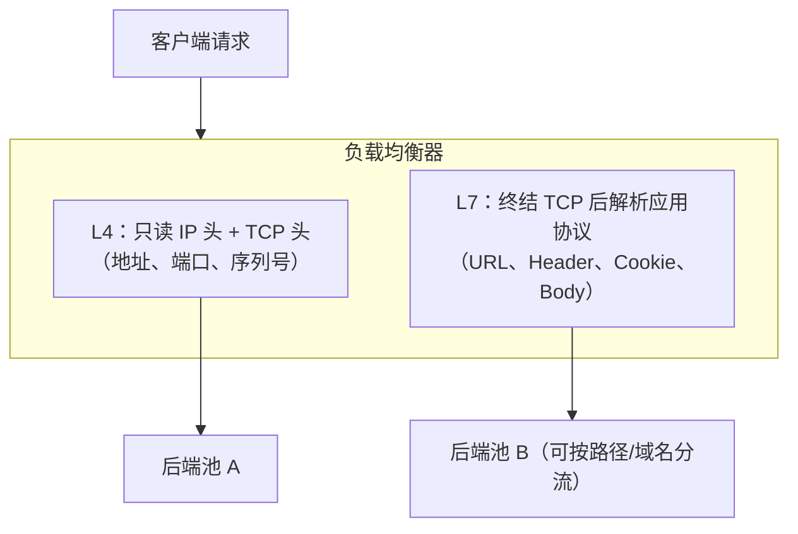

前置知识：TCP 连接、HTTP 报文结构（见 [网络基础与协议](networking/010-NetworkBasicsAndProtocol)、
[HTTP 协议](networking/120-HTTPProtocol)）；调度算法细节见
[负载均衡算法](networking/210-LoadBalanceAlgorithm)。

学习目标：

- 说清负载均衡在扩容体系中的位置，以及 L4 与 L7 负载的本质差异；
- 认识硬件、软件、云三类实现与 DNS 轮询/GSLB 全局调度，能按场景选型；
- 掌握健康检查与会话保持的基本机制；
- 知道接入负载均衡后最常见的几类线上问题（真实 IP、长连接、健康检查风暴）。

## 1. 为什么需要负载均衡

单机容量有天花板，扩容只有两条路：

- **纵向扩展（scale-up）**：换更强的机器。简单直接，但单机价格指数上升且永远有物理上限；
- **横向扩展（scale-out）**：用多台普通机器组成集群。便宜、可线性增加，但需要一个「分单者」
  把请求合理分配给每台机器——这个角色就是负载均衡器（Load Balancer）。

> 类比：餐厅领位员。客人只认「本店」（对外的一个地址），领位员根据每桌的空位情况安排入座；
> 某桌结账走人（后端宕机）后，领位员不再往那里带客。算法（怎么挑桌）是
> [负载均衡算法](networking/210-LoadBalanceAlgorithm) 的内容，本文关注「领位员站在哪里、
> 能看到什么、怎么判断某桌已废」。

## 2. 四层（L4）与七层（L7）负载

### 2.1 分工的本质：能看到报文的哪一层



| 维度         | L4（传输层）                    | L7（应用层）                          |
| :----------- | :------------------------------ | :------------------------------------ |
| 判断依据     | 源/目的 IP + 端口               | URL、Host、Header、Cookie、方法       |
| 是否终结连接 | 可不终结（DR/TUN 直接转发）     | 必须终结：先与客户端建 TCP，再对后端发起新连接 |
| 性能         | 高（内核转发，不解密不解析）     | 较低（用户态解析，TLS 还要解密）       |
| 灵活性       | 低                              | 高：按路径分流、改写头、限流、WAF 接入 |
| 代表实现     | LVS/IPVS、云 NLB、F5 L4 虚服务器 | Nginx、HAProxy、Traefik、云 ALB/Ingress |

典型生产分层是「L4 在前扛量、L7 在后分流」：LVS/云 NLB 承受原始流量洪峰，Nginx 集群完成路径
级路由与业务逻辑。两层的算法与高可用机制相通（L4 组合见
[高可用 LVS](networking/240-HighAvailabilityLVS) 与
[Keepalived 双机热备](networking/250-KeepalivedDualHotStandby)）。

### 2.2 一个常被忽略的推论

L7 代理终结连接意味着**客户端的 TCP 连接和后端的 TCP 连接是两条独立的连接**：客户端侧长连接
不等于后端侧长连接，调优要分开看；L4 NAT 型转发则维护一条端到端映射。这直接决定了第 7 节的
几个陷阱。

## 3. 部署形态

| 形态     | 代表               | 优势                       | 代价                             |
| :------- | :----------------- | :------------------------- | :------------------------------- |
| 硬件负载 | F5、A10            | 性能强、SSL 卸载硬件加速   | 昂贵、锁定厂商                   |
| 软件负载 | Nginx、HAProxy、IPVS、Envoy | 免费、灵活、迭代快   | 自行负责高可用与容量规划         |
| 云负载   | ALB/NLB/CLB 等     | 免运维、自动扩缩、弹性计费 | 行为黑盒、空闲超时/配额受限      |

最朴素的「负载均衡」其实是 **DNS 轮询**：一个域名配多条 A 记录，解析结果轮流返回。它零成本，
但有三个硬伤——客户端与各级缓存让流量无法精准控制（TTL 内改不动）、没有健康检查（坏节点照样
被解析到）、无法按负载调度。它的价值在于引出全局调度的正规军：

**GSLB（Global Server Load Balance，全局负载均衡）**：用「智能 DNS」按用户的地理位置、运营商、
站点实时健康度返回不同的服务 IP，把用户引导到最近的机房/云区域。策略输入包括 GeoIP 库、
探测延迟、站点容量；因为要过 DNS 缓存，调度粒度受 TTL 限制（通常几分钟级）。DNS 解析机制见
[DNS 与 DHCP](networking/100-DNSDHCP)。

## 4. 健康检查

调度的前提是知道「谁还活着」。健康检查分两类：

- **主动检查**：调度器周期性探测后端（TCP 三次握手能否建立、HTTP 接口是否返回 200、gRPC
  Health Checking Protocol 等），失败计数达标后摘除节点，恢复后自动加回；
- **被动检查**：根据转发过程中的真实失败（连接被拒、超时、5xx 比例）就地摘除。响应快，但
  「发现」的前提是有真实流量打过去。

```text
# Nginx 开源版：被动失败判定（max_fails 次失败进入 fail_timeout 秒冷却）
upstream backend {
    server 192.168.8.11:80 max_fails=3 fail_timeout=30s;
    server 192.168.8.12:80;
}

# HAProxy：主动 HTTP 探测
backend web
    option httpchk GET /healthz
    http-check expect status 200
    server s1 192.168.8.11:80 check inter 2s fall 3 rise 2
```

检查路径的选择本身就是设计：探「端口通」太粗（应用假死但端口还开着），探「业务关键接口」最
准但要在应用里实现 `/healthz`；健康接口应尽量自检依赖（数据库、缓存），否则会出现「实例活着
但每个请求都失败」的僵尸节点。

## 5. 会话保持（概览）

无状态服务不需要会话保持；有状态服务（未改造的 Session 存本地的旧应用）需要让同一用户的后续
请求回到同一实例。机制上三条路：

| 方式           | 做法                                   | 注意                                   |
| :------------- | :------------------------------------- | :------------------------------------- |
| 源 IP 哈希/持久化 | 按客户端 IP 哈希或 IPVS 持久化模板     | NAT 后大用户群分布不均；节点变更即失效 |
| Cookie 注入    | L7 调度器插入/改写会话 Cookie 标记后端 | 精确到浏览器实例；需要 L7 能力         |
| 协议级学习     | 部分硬件/网关根据协议特征跟踪          | 与具体产品绑定                         |

要强调的结论：**会话保持是可用性手段，不是正确性保证**——节点宕机时粘性必然失效。根治方案是
把状态外置（Redis Session、JWT Token），让任意节点可服务任意请求。粘性与哈希算法的关系与实
现细节见 [负载均衡算法](networking/210-LoadBalanceAlgorithm)。

## 6. 完整示例：一个最小可用的七层入口

```text
# /etc/nginx/conf.d/entry.conf —— 按 Host 与路径分流的最小入口
upstream web_pool {
    server 192.168.8.11:8080;
    server 192.168.8.12:8080;
    keepalive 32;                       # 与后端保持 32 条空闲长连接复用
}
upstream api_pool {
    server 192.168.8.21:9000;
    server 192.168.8.22:9000;
}

server {
    listen 80;
    server_name www.example.com;

    location /api/ {
        proxy_pass http://api_pool;     # /api/ 前缀的流量走 API 池
        proxy_set_header Host $host;
        proxy_set_header X-Real-IP $remote_addr;
        proxy_set_header X-Forwarded-For $proxy_add_x_forwarded_for;
        proxy_http_version 1.1;         # 启用 keepalive 必须显式升协议
        proxy_set_header Connection "";
    }
    location / {
        proxy_pass http://web_pool;
        proxy_set_header X-Forwarded-For $proxy_add_x_forwarded_for;
    }
}
```

```bash
sudo nginx -t && sudo systemctl reload nginx
curl -s http://www.example.com/api/healthz     # 预期返回 api 池的健康响应
# 多次访问验证分发（两池各自在后端间轮询）
for i in $(seq 4); do curl -s http://www.example.com/ | tail -1; done
```

## 7. 陷阱与调试

1. **后端拿到的是 LB 的 IP**：L7 代理后端看到的来源全是调度器。传真实 IP 用
   `X-Forwarded-For`/`X-Real-IP`（注意可被伪造，安全判断只信任第一跳或用 PROXY protocol）；
   应用日志、风控、限流都受影响；
2. **与后端的连接模式**：`proxy_pass` 默认对每个请求新建后端连接（HTTP/1.0 关闭式），压测下
   TIME_WAIT 爆炸；配 `keepalive` + `proxy_http_version 1.1` + `Connection ""` 三件套才是长
   连接复用；
3. **健康检查风暴**：检查间隔太短、后端重启慢，摘除/加回反复横跳；用 `fall/rise` 迟滞 + 合理
   间隔（1~5s）平滑；云 LB 还要注意「冷却期」概念；
4. **云 LB 的空闲超时**：WebSocket/SSE 长连接被云 LB 默认空闲超时（常见 60s 级）掐断，表现为
   「连接隔几分钟掉一次」；调大超时并在应用层加心跳保活。WebSocket 协议本身见
   [HTTP 协议](networking/120-HTTPProtocol)；
5. **会话粘性掩盖故障**：粘住某节点的用户「只有他们坏了」，健康检查全绿；排障时先看粘性路由
   再看后端；
6. **TLS 在哪一层卸载**：L4 直通（TLS 到后端，LB 不解密）与 L7 卸载（LB 解密后明文转发）影响
   合规审计、Header 注入能力与后端证书管理，选型时明确写下决策。

## 8. 小结

**初学者要点**

- 负载均衡 = 横向扩容的分单者；L4 看 IP+端口、快而粗，L7 终结连接看 URL/Header、慢而灵活；
- 典型组合是 L4 扛流量洪峰 + L7 做业务分流；接入云就用托管 LB，自建首选 Nginx/HAProxy/IPVS；
- 健康检查分主动探测与被动摘除，检查目标要贴近业务真实健康；有状态旧应用靠会话保持过渡，
  根治是状态外置。

**进阶注意**

- L7 终结连接意味着客户端/后端两条独立 TCP，长连接、超时、真实 IP 都要在两层分别设计；
- DNS 轮询/GSLB 的调度精度受 TTL 与缓存制约，跨地域调度记住「分钟级、就近、可回退」三词；
- 上线前把「TLS 卸载层次、空闲超时、健康接口语义」写进部署文档，这三处是接入 LB 后最高频的
  返工点。
