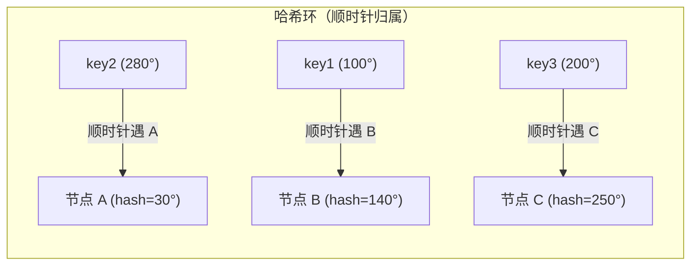

前置知识：负载均衡的整体架构（L4/L7 区分见 [负载均衡技术](networking/200-LoadBalanceTech)）。

学习目标：

- 掌握静态算法（轮询、加权轮询、源哈希）与动态算法（最少连接、响应时间）的调度依据与适用场景；
- 深入理解一致性哈希：它解决了普通哈希的什么问题、虚拟节点如何改善均衡性，能算出节点变更时
  的数据迁移比例；
- 能在 Nginx 与 IPVS 中配置并验证这些算法，理解「算法选错」在真实业务中的表现。

## 1. 算法在调度器里的位置

负载均衡器每收到一个新请求，都要回答「给哪台后端」——调度算法就是这个决策函数。它只影响**新
连接**的分配，已建立的连接不会被算法迁移。算法分两大类：

- **静态算法**：只看请求本身的固定信息（第几个请求、源 IP、URL 哈希），不感知后端负载；
- **动态算法**：依据实时状态（当前连接数、响应时间、健康度）调度。

## 2. 静态算法

### 2.1 轮询（Round Robin）

按顺序依次分发：请求 1 → A，请求 2 → B，请求 3 → C，请求 4 → 又回到 A。实现简单、绝对公平，
是所有调度器默认给人「直觉正确」的起点。

它的盲区在于**把「请求」当成了等价单位**：A 业务里有 5ms 的轻接口和 2s 的重接口时，轮询保证
的是请求数均衡，而不是负载均衡——重接口恰好连续落在同一台机器上时，那台机器会率先过载。

```bash
# IPVS 配置轮询
ipvsadm -A -t 203.0.113.10:80 -s rr
```

### 2.2 加权轮询（WRR）

给性能不同的后端分配权重，权重高者多接请求。注意两种经典实现的差异：

- **简单重复式**（IPVS `wrr`）：按权重比例「成组」分发，权重 2:1 会连续给 A 两次再给 B 一次，
  宏观比例正确，微观上有突刺；
- **平滑插值式**（Nginx 默认加权轮询，smooth WRR）：通过「当前有效权重每轮递减」的算法把请求
  交错打散，2:1 的实际序列近似 `A A B A A B ...` 而不是 `A A B` 循环，瞬时压力更均匀。

```text
# Nginx upstream：权重 2:1
upstream backend {
    server 192.168.8.11:80 weight=2;
    server 192.168.8.12:80 weight=1;
}
```

### 2.3 源地址哈希（Source IP Hash）

对客户端 IP 做哈希后取模选节点。同一客户端总是落到同一后端，因此天然提供**会话粘性**：
`ip_hash`（Nginx）、LVS 的 `-p` 持久化本质类似。

两个局限：一是客户端集中在 NAT 出口后时分布不均；二是普通哈希在**后端数量变化时会全局洗牌**
（见第 4 节），而这正是一致性哈希要解决的问题。

## 3. 动态算法

### 3.1 最少连接（Least Connections）

新请求总是给「当前活跃连接数最少」的后端。它校正了轮询「请求数公平 ≠ 负载公平」的缺陷：
处理慢的机器连接堆积、活跃数自然升高，新请求就会绕开它。适合**请求处理时长差异大**的业务
（上传、报表导出、长连接网关）。

加权版 wlc（加权最少连接）在连接数之外再除以权重，是 IPVS 生产环境最常用的默认推荐：

```bash
ipvsadm -A -t 203.0.113.10:80 -s wlc
```

```text
# Nginx 商业版/开源 1.3+ 可用最少连接（开源版为 least_conn）
upstream backend {
    least_conn;
    server 192.168.8.11:80 weight=2;
    server 192.168.8.12:80;
}
```

### 3.2 最短响应时间 / 最小平均延迟

按后端近期响应时间或延迟调度（如 Nginx 的 `least_time` 系列指令、HAProxy 的动态算法），比连
接数更接近「用户体验」。代价是持续采样带来的开销与震荡风险，通常配合平滑窗口使用；对大多数
业务，wlc 与响应时间算法的实际差距小于它们带来的复杂度，不要过早优化。

## 4. 一致性哈希：为「节点集合会变」而设计

### 4.1 普通哈希的致命问题

取模哈希 `node = hash(key) % N` 在 N 不变时表现良好；但扩容（N: 3→4）后，几乎所有 key 的取模
结果都变了——对于缓存集群，这意味着**一次扩容打翻整个缓存**，数据库瞬间被回源流量打穿。

一致性哈希（Consistent Hashing, 1997, Karger 等人）的改造：把哈希空间组织成一个环（如 0~2^32-1），
节点与 key 都映射到环上，key 顺时针找到的第一个节点即为其归宿。这样增删一个节点，**只有该节
点与相邻节点之间的弧段上的 key 需要迁移**，理想情况下迁移比例为 `1/N`。



新增节点 D（落在 90°）时，只有原属于 B 的 `90°~100°` 弧段 key 迁移到 D——B 的其余 key、A 与 C
全部不动。

### 4.2 虚拟节点

只放 3 个真实节点时，环上弧段划分随机性大，容易出现某节点覆盖小半环（负载倾斜）。解决办法是
**每个物理节点映射成成百上千个虚拟节点**散布在环上：虚拟节点越多，弧段划分越均匀，节点宕机
时其负载也近似均匀地摊给所有幸存者，而不是全部压给环上下一个倒霉节点。Ketama（memcached 客
户端生态的经典实现）即采用 100~200 个虚拟节点/物理节点的经验值。

```text
# Nginx 一致性哈希（用于缓存类后端；ketama 参数兼容 Ketama 客户端生态）
upstream cache_pool {
    hash $request_uri consistent;
    server 192.168.8.11:11211;
    server 192.168.8.12:11211;
    server 192.168.8.13:11211;
}
```

一致性哈希的场景特征是「key 必须稳定归属同一节点」：缓存分片、对象存储分片、特定有状态服务
路由。普通无状态 web 分发并不需要它——用轮询/wlc 反而更均匀。

## 5. 完整示例：配置并验证加权轮询

两台后端（11、12）返回不同页面，一台 Nginx 调度器，权重 2:1：

```bash
# 调度器 /etc/nginx/conf.d/lb.conf
upstream backend {
    server 192.168.8.11:80 weight=2;
    server 192.168.8.12:80 weight=1;
}
server {
    listen 80;
    location / {
        proxy_pass http://backend;
    }
}
```

```bash
sudo nginx -t && sudo systemctl reload nginx

# 连发 6 个请求观察分发序列
for i in $(seq 6); do curl -s http://127.0.0.1/; done
# 预期输出（平滑 WRR 交错，比例 2:1）：
# backend-11  backend-11  backend-12  backend-11  backend-11  backend-12
```

同样的语义在 IPVS 中是 `ipvsadm -A -t <VIP>:80 -s wrr` 加 `-w` 权重；两种实现的选择依据见
[负载均衡技术](networking/200-LoadBalanceTech) 与 [高可用 LVS](networking/240-HighAvailabilityLVS)。

## 6. 算法选型速查

| 场景                                         | 推荐算法            | 理由                                     |
| :------------------------------------------- | :------------------ | :--------------------------------------- |
| 无状态短请求，后端性能一致                    | 轮询                | 最简单，无需状态                          |
| 后端性能不均（新老机型混部）                  | 加权轮询 / wlc      | 权重反映容量                              |
| 请求时长差异大（上传、导出、长连接）           | 最少连接 wlc        | 连接数是比请求数更真实的负载信号           |
| 需要会话粘性（无共享 Session 的旧应用）        | 源 IP 哈希/持久化   | 同源同节点；根治仍应做 Session 共享       |
| 缓存/分片集群，节点会动态增删                 | 一致性哈希          | 节点变更只迁移 1/N 的 key                 |
| 需要按请求内容分片（URL/租户）                 | 内容哈希 + consistent | 归属稳定且分布可控                      |

## 7. 陷阱与调试

1. **把会话保持当正确性保证**：哈希/粘性在后端宕机时必然重路由，登录态丢失；粘性只是迁移期
   的兼容手段，正确性落在集中式 Session/Token；
2. **权重设 0 与 backup 语义混淆**：Nginx `server ... down` 表示不参与；`backup` 表示仅当其他
   全挂才启用；IPVS 中权重 0 表示不再接收新连接（存量连接继续），常用于灰度摘流量；
3. **最少连接算法在 HTTP keep-alive 下的失真**：长连接让「连接数」不再反映瞬时压力，七层调
   度器要看请求数或响应时间指标；
4. **一致性哈希的热点 key**：单个超热 key 仍会打满其归属节点，一致性哈希不解决单 key 热点，
   需要应用层拆 key 或本地缓存兜底；
5. **摘节点不等于安全下线**：无论哪种算法，摘除前先观察排空（drain）存量连接，IPVS 权重置 0
   就是为此设计的。

## 8. 小结

**初学者要点**

- 静态算法看请求、动态算法看负载；轮询最简单，加权轮询适配性能差异，最少连接适配时长差异；
- 一致性哈希 = 哈希环 + 顺时针归属，节点变更只迁移 1/N 的数据；虚拟节点让分布更均匀；
- Nginx 与 IPVS 都能表达上述算法：`weight`/`least_conn`/`hash ... consistent` 对应 `wrr`/`lc`/`wlc`。

**进阶注意**

- 平滑加权轮询与简单加权轮询在瞬时序列上不同，压测对时序敏感的业务要留意实现差异；
- 粘性策略（源哈希、持久化）只是会话迁移期的过渡方案；摘流量的正确姿势是权重置 0 + 排空；
- 算法解决「均匀」，不解决「单 key 热点」与「有状态正确性」，后者是应用层设计的责任。
