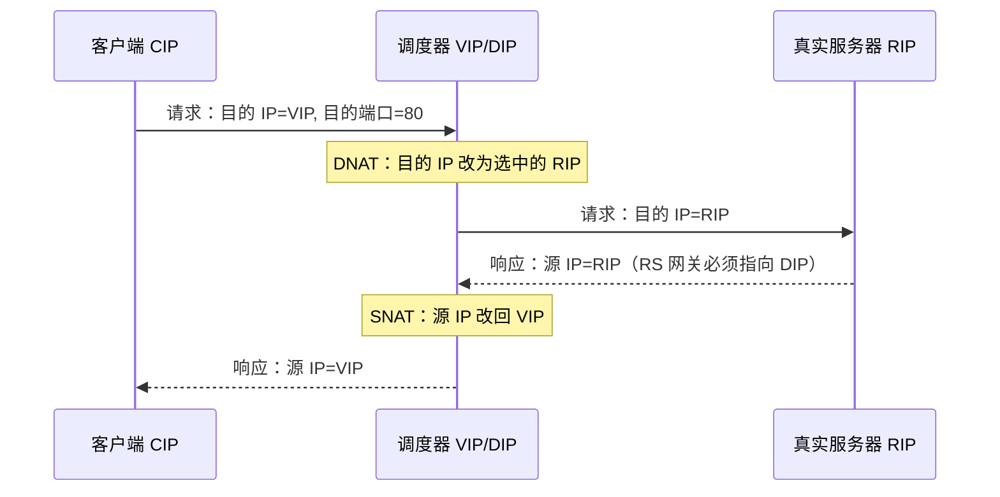
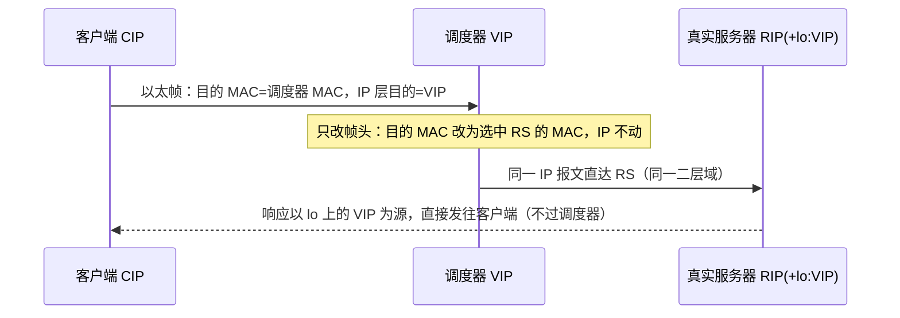

前置知识：TCP/IP 封装与 NAT 原理（见 [网络基础与协议](networking/010-NetworkBasicsAndProtocol)）；
算法细节见 [负载均衡算法](networking/210-LoadBalanceAlgorithm)。

学习目标：

- 说清 LVS 的组件模型：调度器（VS）、真实服务器（RS）与 VIP/DIP/RIP 三类地址；
- 理解 NAT、DR、TUN 三种转发模式分别改写了报文的哪一层，为什么 DR 性能最好；
- 能用 `ipvsadm` 配出可工作的 NAT/DR 负载均衡，并解释 DR 模式 RS 上的 ARP 抑制参数；
- 知道 LVS 自身的高可用要靠 Keepalived 补齐（VRRP 主备 + 健康检查联动）。

## 1. LVS 是什么

LVS（Linux Virtual Server）是章文嵩博士 1998 年发起的开源项目，核心是内核中的 **IPVS** 模块：
在内核态的网络层 hook 点上，把发往虚拟 IP（VIP）的连接**按调度算法转发到后端真实服务器**，
对客户端完全透明——客户端以为自己访问的是一台服务器。

> 类比：医院前台分诊台。病人（客户端）只挂「门诊部」的号（VIP），分诊台（调度器）决定你具体
> 去哪个诊室（RS）。诊室看完病直接告诉你结果（响应报文），不必再经过分诊台——DR 模式的思想
> 正是「请求过调度器、响应直接回」。

它工作在**传输层（四层）**：只看 IP + 端口，不解析 HTTP 内容。与七层负载（Nginx/HAProxy）的
分工见 [负载均衡技术](networking/200-LoadBalanceTech)；四层性能远高于七层，但没有改写 URL、
按路径分流的能力。

## 2. 组件与地址模型

| 术语  | 全称                   | 含义                                     |
| :---- | :--------------------- | :--------------------------------------- |
| VS/DS | Virtual/Director Server | 调度器（运行 IPVS 的负载均衡器）         |
| RS    | Real Server            | 后端真实服务器                           |
| CIP   | Client IP              | 客户端地址                               |
| VIP   | Virtual IP             | 对外服务的虚拟地址，挂在调度器上（DR 模式 RS 上也有「影子」副本） |
| DIP   | Director IP            | 调度器与后网段通信的地址                 |
| RIP   | Real Server IP         | 真实服务器地址                           |

IPVS 本身只是转发引擎，管理工具是用户态的 `ipvsadm`（新版也可用 `ipvsadm -Ln` 查看原子模块
保存的表）。调度器上没有 VIP 对应的服务进程——VIP 是「收包入口」，真正的服务在 RS 上。

## 3. 三种转发模式

三种模式的差别，本质是**调度器改写了报文的哪一层、响应报文怎么回去**。

### 3.1 NAT 模式：改写目的 IP



- RS 的**默认网关必须指向 DIP**，否则响应绕过调度器，客户端收到源 IP 为 RIP 的报文会丢弃；
- 进出流量都经过调度器，调度器是带宽瓶颈（响应通常远大于请求）；
- RS 可以跑在任何操作系统上，且可以跨网段部署。

### 3.2 DR 模式：改写目的 MAC（性能首选）



- 请求经调度器，**响应由 RS 直接返回客户端**，调度器吞吐不再是瓶颈，因此 DR 是生产首选；
- 代价：调度器与 RS 必须**同一二层网络**（因为靠 MAC 转发）；
- 关键配置在 RS 侧：VIP 配置在 loopback 上（对外不可见的「影子地址」），并用 ARP 内核参数抑制
  RS 应答/通告 VIP（详见 8.2 实验步骤——这是 DR 模式配置失败率最高的环节）。

### 3.3 TUN 模式：IP 隧道封装

调度器把完整 IP 报文封装进新的 IP 头（IPIP 隧道）发给 RS；RS 解封装后处理，响应同样直接回客
户端。与 DR 一样「请求过、响应不过」，但 RS 可以**跨网段/跨机房**部署（隧道三层可达即可）。
RS 必须支持 IPIP 协议（Linux 配 `tunl0` 接口）。隧道封装原理见
[隧道技术](networking/310-Tunneling)。

### 3.4 模式对比

| 维度         | NAT              | DR               | TUN              |
| :----------- | :--------------- | :--------------- | :--------------- |
| 改写内容     | 目的 IP（DNAT）  | 目的 MAC         | 整包重新封装     |
| 响应路径     | 经过调度器       | RS 直接返回      | RS 直接返回      |
| RS 网关要求  | 必须指向 DIP     | 无特殊要求       | 无特殊要求       |
| 网络要求     | 可跨网段         | 同一二层域       | 三层可达即可     |
| 调度器带宽   | 瓶颈             | 仅承接受理请求   | 仅承接受理请求   |
| RS 修改量    | 改网关           | lo 配 VIP + ARP 抑制 | tunl0 配 VIP |
| 典型规模     | 小型             | 大多数生产场景   | 跨机房/异地      |

## 4. 调度算法与会话保持

`ipvsadm` 的 `-s` 参数选择调度算法，与
[负载均衡算法](networking/210-LoadBalanceAlgorithm) 一一对应：

```bash
# 常用算法：rr 轮询 / wrr 加权轮询 / lc 最少连接 / wlc 加权最少连接（默认）
ipvsadm -A -t 203.0.113.10:80 -s wlc
```

有状态应用（如未做集中 Session 的登录服务）需要**会话保持**：IPVS 支持按来源 IP 的持久化
连接（persistence template），让同一客户端在超时窗口内始终落在同一 RS：

```bash
# -p 600：同一来源 IP 的后续连接 600 秒内固定分发到同一 RS
ipvsadm -A -t 203.0.113.10:80 -s wlc -p 600
```

注意持久化只保证「窗口内的粘性」，RS 宕机时该模板会重新调度——不要把有状态正确性寄托在它
身上，根治方案是应用层 Session 共享或改用 Token。

## 5. 健康检查：LVS 的短板与补位

IPVS **本身不做健康检查**：RS 宕机后，ipvsadm 表里的条目还在，连接会被转发到黑洞。生产方案
是把 LVS 与 **Keepalived** 组合：

- Keepalived 的 checkers 进程周期性探测 RS（TCP 端口或 HTTP 状态码），失败即调用 IPVS 接口
  剔除该 RS，恢复后自动加回；
- 同时用 VRRP 对调度器自身做主备：主调度器持有 VIP，主挂后备机接管，消除调度器单点。

这套组合的完整配置见 [Keepalived 双机热备](networking/250-KeepalivedDualHotStandby)。

## 6. 完整实战：可复现的双机实验

实验拓扑：调度器（eth0 对外 203.0.113.10/VIP，eth1 对内 192.168.8.1/DIP），两台 RS
（192.168.8.11、192.168.8.12，各运行 nginx 并写入不同的 index.html 便于观察分发）。

### 6.1 NAT 模式

```bash
# ---- 调度器 ----
sudo sysctl -w net.ipv4.ip_forward=1        # NAT 模式必须开启转发
sudo ipvsadm -A -t 203.0.113.10:80 -s wlc
sudo ipvsadm -a -t 203.0.113.10:80 -r 192.168.8.11:80 -m -w 2   # -m 即 NAT 模式
sudo ipvsadm -a -t 203.0.113.10:80 -r 192.168.8.12:80 -m -w 1
sudo ipvsadm -Ln                             # 查看规则与统计

# ---- RS（两台都要）----
sudo ip route replace default via 192.168.8.1   # 网关指向 DIP，这是 NAT 的命门

# ---- 客户端验证 ----
for i in 1 2 3; do curl -s http://203.0.113.10/; done
# 预期：输出在 RS1/RS2 的页面间按权重（2:1）交替
```

### 6.2 DR 模式

```bash
# ---- 调度器：VIP 配在对外接口 ----
sudo ip addr add 203.0.113.10/32 dev eth0
sudo ipvsadm -A -t 203.0.113.10:80 -s wlc
sudo ipvsadm -a -t 203.0.113.10:80 -r 192.168.8.11:80 -g    # -g 即 DR 模式
sudo ipvsadm -a -t 203.0.113.10:80 -r 192.168.8.12:80 -g

# ---- RS：lo 上配置 VIP + ARP 抑制（两台都要）----
sudo ip addr add 203.0.113.10/32 dev lo
sudo sysctl -w net.ipv4.conf.all.arp_ignore=1     # 只应答目标 IP 为接收口 IP 的 ARP 请求
sudo sysctl -w net.ipv4.conf.eth0.arp_announce=2  # 通告 ARP 时使用出口口最佳本地地址
# 持久化写入 /etc/sysctl.d/99-lvs-dr.conf，重启生效

# ---- 客户端验证 ----
curl -s http://203.0.113.10/
# 抓包验证「响应不过调度器」：在调度器抓包只见请求方向
sudo tcpdump -i eth0 -qn host 203.0.113.10
```

## 7. 陷阱与调试

1. **DR 模式 ARP 抑制漏配**：RS 直接应答 ARP 导致客户端绕过调度器直连某台 RS（表现为「负载
   不生效、拔线一台就全挂」）。`arp_ignore=1` + `arp_announce=2` 是标准组合，且要用
   `sysctl -a | grep arp_` 确认参数确实生效；
2. **NAT 模式 RS 网关没改**：现象是 SYN 能到 RS、客户端却收不到任何响应；`ipvsadm -Lnc` 里
   连接停留在 SYN_RECV；
3. **调度器未开 `ip_forward`**（NAT/TUN 需要）；DR 模式则相反，不要开启转发（不需要）；
4. **防火墙**：RS 与调度器之间的转发链（FORWARD）需放行，iptables 默认 DROP 时表现为时通时
   不通，排查方法见 [Iptables 防火墙](networking/230-IptablesFirewall)；
5. **连接未释放导致调度不均**：长时间 TCP 会话粘住某台 RS，用 `-L --timeout` 查看会话超时并
   必要时调整；
6. **VIP 漂移与 ARP 缓存**：主备切换后部分交换机仍缓存旧 MAC，Keepalived 的 `vrrp_strict` 与
   `gratuitous_arp` 相关默认行为一般能处理，异常时手工发免费 ARP。

## 8. 小结

**初学者要点**

- LVS 是内核级四层负载均衡：IPVS 按算法把发往 VIP 的连接分给后端 RS；
- 三种模式一句话：NAT 改目的 IP（响应回调度器）、DR 改目的 MAC（响应直发客户端）、TUN 加隧道
  头（响应直发、可跨机房）；
- DR 生产最常用；RS 网关（NAT）与 ARP 抑制（DR）是两类模式各自的「命门配置」。

**进阶注意**

- IPVS 不做健康检查、自身无冗余，生产形态几乎总是「Keepalived（VRRP 主备 + 健康检查）+ LVS」；
- 会话保持用持久化模板只是缓解手段，有状态正确性应落在应用层；
- 调优从「响应不过调度器」出发选 DR/TUN；调度算法在连接时长差异大的业务里用 wlc 优于 rr。
