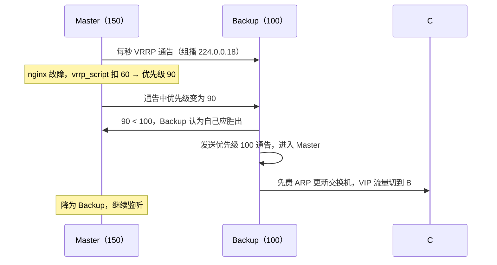

前置知识：VLAN 与网关的作用、LVS 的 VIP 概念（见 [高可用 LVS](networking/240-HighAvailabilityLVS)）。

学习目标：

- 理解 VRRP 如何用「虚拟路由器 + 优先级选举」消除网关/入口的单点故障；
- 掌握 Keepalived 的两大功能：VRRP 主备（VIP 漂移）与健康检查（联动 LVS/IPVS）；
- 能写出一份生产可用的主备配置，并解释抢占模式、`vrrp_script` 降权的行为；
- 能定位脑裂（双 Master）问题并知道至少两种防护手段。

## 1. 问题：VIP 的单点

负载均衡入口、内网网关这类地址（VIP/网关 IP）必须恒定可用，但承载它们的物理机器会宕机。
Keepalived 的答案是 **VRRP（Virtual Router Redundancy Protocol，虚拟路由冗余协议）**：多台物
理设备共同「伪装」成一台虚拟路由器，用同一个虚拟 MAC（`00:00:5E:00:01:{VRID}`）与虚拟 IP 对
外服务；某一时刻只有一台（Master）实际持有并应答该地址，Master 失效后其他成员（Backup）在秒
级内接管。

> 类比：银行「柜员窗口 3 号」。窗口号（VIP）永远存在，客户不关心今天坐窗口的是谁；当值柜员
> （Master）离席，排班表上优先级最高的替补自动坐进去继续服务。

协议细节（排障时会用到）：

- Master 以组播地址 `224.0.0.18`、IP 协议号 **112** 周期发送 VRRP 通告（默认每 1 秒）；
- 优先级 0~255：255 保留给「IP 属主」（物理接口就配着该 VIP 的设备），常用主备优先级如
  150/100，数值相同则比较接口 IP 大小；
- Backup 在 `3 × 通告间隔 + 偏移时间` 内没收到通告即判定 Master 死亡并接管（优先级越低偏移越
  大，避免同时抢占）；
- 协议版本：VRRPv2（RFC 3768，IPv4）与 VRRPv3（RFC 5798，同时支持 IPv4/IPv6），Keepalived 两者
  均实现，生产建议显式写明 `version 3`。

## 2. Keepalived 的组成

Keepalived 用一个进程整合了两块能力，这正是它比「裸 VRRPD + 自写脚本」流行的原因：

```text
Keepalived
├── vrrpd    ：VRRP 协议栈，负责 VIP/MAC 的主备漂移
├── checkers ：对真实服务器/本机服务做 TCP/HTTP/MISC 检查，
│              失败时调用 IPVS 接口增删 RS（与 LVS 联动，见高可用 LVS 一文）
└── 控制平面 ：统一解析 keepalived.conf，通知脚本钩子（notify_master 等）
```

## 3. 主备配置：一份可直接落地的示例

场景：两台 Nginx 入口（`192.168.8.11` 主 / `192.168.8.12` 备），对外 VIP `192.168.8.100`，
并在本机服务异常时把 VIP 让给对端。

```text
# /etc/keepalived/keepalived.conf（主节点；备节点见注释差异）
global_defs {
    router_id node-A                  # 集群内唯一标识
    vrrp_skip_check_adv_addr
    vrrp_garp_interval 0.2            # 免费 ARP 间隔，加速交换机 MAC 更新
}

# 本机健康检查：nginx 进程/页面存活则正常，失败则按 weight 扣减优先级
vrrp_script chk_nginx {
    script "/usr/bin/curl -fs -m 2 http://127.0.0.1/healthz || exit 1"
    interval 2                        # 每 2 秒检查一次
    weight -60                        # 失败时优先级扣 60（150-60=90 < 备机 100）
    fall 2                            # 连续失败 2 次才判定 DOWN
    rise 2                            # 连续成功 2 次才恢复
}

vrrp_instance VI_1 {
    state MASTER                      # 备节点改为 BACKUP
    interface eth0
    virtual_router_id 51              # 主备必须一致；同网段多组热备勿重复
    priority 150                      # 备节点改 100
    advert_int 1                      # 通告间隔 1 秒
    authentication {
        auth_type PASS
        auth_pass 4f2a91              # 同组一致，仅防误接设备，不是安全边界
    }
    virtual_ipaddress {
        192.168.8.100/24 dev eth0
    }
    track_script {
        chk_nginx
    }
    notify_master "/etc/keepalived/notify.sh master"
    notify_backup "/etc/keepalived/notify.sh backup"
}
```

`notify.sh` 钩子示例（切换时通知运维或重启本机依赖 VIP 的服务）：

```bash
#!/bin/bash
# 参数即角色：master / backup / fault
state="$1"
logger -t keepalived "role changed to $state"
if [ "$state" = "master" ]; then
    systemctl reload nginx   # nginx 监听 VIP 时需 nonlocal bind 配合（见陷阱 4）
fi
```

验证：

```bash
sudo systemctl enable --now keepalived
ip -4 addr show dev eth0 | grep 192.168.8.100   # 主节点应有该 VIP
sudo tcpdump -i eth0 -nn proto 112              # 观察 VRRP 通告，主备各抓一次
# 手工模拟故障：主节点 systemctl stop keepalived
# 预期：备节点在 3 秒左右接管 VIP（tcpdump 出现新 Master 通告，优先级 100）
```

## 4. 主备切换与脑裂

### 4.1 正常切换



「抢占」行为：默认抢占模式下，恢复后的高优先级节点会夺回 Master（业务上通常希望如此）；若切
换本身代价高（缓存、长连接），可配 `nopreempt` + 初始都用 BACKUP，实现「不回头」的故障切换。

### 4.2 脑裂：双 Master 的成因与危害

**脑裂**指心跳中断但双方进程都活着，各自认为对端已死、同时持有 VIP。危害是二层表混乱：同一
VIP 出现两个 MAC，流量被随机分发，写操作可能重复执行。

常见成因与防护：

| 成因                     | 防护手段                                                       |
| :----------------------- | :------------------------------------------------------------- |
| 心跳链路单点（一条线断了）| 双链路心跳（交叉互联 + 不同交换机）；单播 `unicast_peer` 冗余路径 |
| 防火墙拦了 VRRP 报文      | 放行 IP 协议号 112（见陷阱 1）；配置变更后先抓包确认通告在流动   |
| 组播被中间设备抑制        | 改用 `unicast_src_ip`/`unicast_peer` 单播模式                   |
| 脚本误判（curl 超时风暴） | `fall/rise` 迟滞、`-m` 超时收紧、检查命令幂等且轻量              |

兜底检测：备机上用 cron 脚本检测「我是 BACKUP 却持有 VIP」或抓包发现两个 Master 通告源，立即
告警或自隔离（fence）——自动仲裁在 Keepalived 内没有内建，实践中以「双心跳 + 抓包告警」为基
线组合。

## 5. 陷阱与调试

1. **防火墙未放行 VRRP**：它不是 TCP/UDP 端口，而是独立 IP 协议号 112。iptables 需
   `iptables -A INPUT -p vrrp -j ACCEPT`（或 `-p 112`）；nftables 同理。现象是双机各自为
   Master（两台都 `ip addr` 看得到 VIP）；
2. **VRID 冲突**：同网段另一组热备用了相同 `virtual_router_id`，两套集群互相选举，表现为
   「莫名其妙的主备震荡」；规划 VRID 像规划 VLAN 一样登记管理；
3. **VIP 漂移后业务不通**：交换机 MAC 表未更新。检查 `vrrp_garp_interval`/`garp_master_repeat`
   相关参数，或切换后手工发免费 ARP（`arping -U -I eth0 192.168.8.100`）；
4. **服务监听 VIP 但 VIP 未漂来时启动失败**：让服务绑定 `0.0.0.0`，或设置
   `sysctl net.ipv4.ip_nonlocal_bind=1` 允许绑定尚不存在的地址；
5. **vrrp_script 权重语义**：`weight` 为正数（如 60）时是「检查成功则加分」，为负数（-60）才是
   「失败则扣分」，配置时别把语义写反；扣分后若仍高于对端，切换不会发生；
6. **云环境限制**：公有云 VPC 普遍不支持协议 112 组播/免费 ARP 行为，VRRP 方案在云上通常要换
   成云厂商的浮动 IP/高可用组产品，不要硬搬。

## 6. 小结

**初学者要点**

- Keepalived = VRRP 主备（VIP 漂移）+ 健康检查（联动 LVS）；Master 每秒发通告，Backup 超时接管；
- 一份最小可用配置记五要素：`interface`、`virtual_router_id`（主备一致）、`priority`（主高备
  低）、`virtual_ipaddress`、健康检查 `vrrp_script`；
- 验证三板斧：`ip addr` 看归属、`tcpdump proto 112` 看通告、停主进程看切换时长。

**进阶注意**

- 脑裂防护靠链路冗余（双心跳/单播）+ 放行协议 112 + 外部仲裁告警三件套，Keepalived 自身不做
  仲裁；`nopreempt` 适合切换代价大的场景；
- 与 LVS 组合时，checkers 负责增删 RS 条目；与 Nginx 组合时，`vrrp_script` 检测本机服务异常并
  扣优先级，让「服务的死」传导为「VIP 的让」；
- 协议版本选 VRRPv3（RFC 5798），云上环境另寻厂商原生的 HA 机制。
