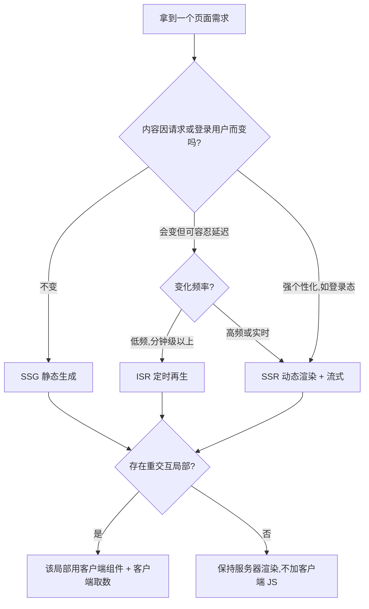

## 0. 渲染策略全景（先读这里）

> 学习目标：能用一张对比表区分 SSG/ISR/SSR/CSR 的取舍；知道框架依据哪些信号判定页面是静态还是动态；会用 `loading.tsx` 与 `<Suspense>` 做流式渲染；理解 Next.js 16 缓存模型显式化后的三个关键词——Cache Components、Partial Prefetching、Instant Navigations；拿到需求能按决策树选出渲染方式。

同一份页面代码，选错渲染策略，轻则白屏变长，重则每分钟多烧一台服务器。本篇把"选型"拆成三个问题：数据多旧可接受？用户是谁？交互有多重？

| 策略 | 全称 | HTML 生成时机 | 数据新鲜度 | 首屏速度 | 服务器成本 | 典型场景 |
| --- | --- | --- | --- | --- | --- | --- |
| SSG | 静态生成 | 构建时一次 | 构建时快照，需重新构建 | 最快 | 最低（CDN 直出） | 营销页、关于页 |
| ISR | 增量静态再生 | 构建时 + 后台定时再生 | 可调（秒级到分钟级陈旧） | 快 | 低 | 博客、商品页 |
| SSR | 服务端渲染 | 每次请求时 | 实时 | 中（TTFB 取决于计算量） | 高 | 仪表盘、搜索 |
| CSR | 客户端渲染 | 浏览器执行 JS 后 | 实时 | 首屏慢、后续快 | 最低（只发壳） | 重交互编辑器局部 |

**讲解：**

1. 前三种都发生在服务器，用户拿到的都是"带内容的 HTML"，SEO 友好；CSR 的首屏 HTML 近乎空壳，搜索引擎与弱网用户都不友好。
2. App Router 中这些策略不是全局开关，而是**页面级甚至组件级**的选择：同一站点可以逐路由混用。
3. 决策顺序：先看数据新鲜度要求（决定 SSG/ISR/SSR），再看交互强度（决定是否局部 CSR）。

## 1. 静态还是动态：框架如何判定

App Router 默认把页面静态化，只有出现"动态信号"才会退回每次请求渲染。判定信号有三类。

```tsx
// app/dashboard/page.tsx —— 动态信号一：动态 API
import { cookies } from "next/headers"

export default async function Dashboard() {
  // 读取 cookies()/headers() 等动态 API：本页自动变为每次请求渲染
  const theme = (await cookies()).get("theme")?.value
  return <main data-theme={theme}>仪表盘</main>
}
```

```tsx
// app/blog/page.tsx —— 动态信号二/三：fetch 缓存选项与路由段配置
export const revalidate = 300 // 路由段配置：本页每 5 分钟 ISR 再生

export default async function Blog() {
  const posts = await fetch("https://api.example.com/posts", {
    next: { revalidate: 300 }, // 取数级缓存：与页面策略保持一致
  }).then((r) => r.json())
  return <PostList posts={posts} />
}
```

```tsx
// app/search/page.tsx —— searchParams 属于请求信息，使用即动态
export default async function SearchPage({
  searchParams,
}: {
  searchParams: Promise<{ q: string }> // Next.js 15 起为 Promise，需要 await
}) {
  const { q } = await searchParams
  return <p>搜索：{q}</p>
}
```

**讲解：**

1. 动态信号清单：`cookies()`、`headers()`、页面 props 的 `searchParams`、`connection()` 等；只要任一被使用，该路由就转为动态渲染。
2. 也可显式声明：`export const dynamic = "force-dynamic"` 强制动态、`"force-static"` 强制静态；显式声明的优先级高于默认推断。
3. Next.js 16 缓存模型显式化（Cache Components，见第 3 节）之后，"什么被缓存、什么动态"由代码显式声明，默认行为更保守，细节以官方文档为准。

## 2. 流式 SSR 与 Suspense 边界

SSR 不必等最慢的查询。流式渲染把 HTML 按 Suspense 边界切块：布局与快的部分先发送，慢的卡片随后补齐。

```tsx
// app/dashboard/page.tsx
import { Suspense } from "react"
import Revenue from "./revenue" // async 服务器组件：聚合查询，较慢
import Sales from "./sales"     // async 服务器组件：单表查询，较快

export default function DashboardPage() {
  return (
    <main>
      <h1>仪表盘</h1>
      {/* 两个边界互不阻塞：壳先到，各自的骨架屏先展示 */}
      <Suspense fallback={<RevenueSkeleton />}>
        <Revenue />
      </Suspense>
      <Suspense fallback={<SalesSkeleton />}>
        <Sales />
      </Suspense>
    </main>
  )
}
```

```tsx
// app/dashboard/loading.tsx —— 路由级兜底：导航进入本路由时立即展示
export default function Loading() {
  return <p>加载仪表盘……</p> // 实际项目中替换为整页骨架屏
}
```

**讲解：**

1. `loading.tsx` 是路由级的隐式 `<Suspense>`：点击链接后先展示它，页面数据就绪再切换，无需等待完整渲染。
2. 手动 `<Suspense>` 的粒度越细，白屏与占位时间越短：慢卡片不必拖累整页。
3. 骨架屏要模拟真实布局尺寸，避免内容到达后页面跳动（CLS）；数据获取仍写在服务器组件里，与流式不冲突。

## 3. Cache Components 与 Partial Prefetching

Next.js 16.0 把缓存模型显式化：过去"fetch 默认缓存、Router Cache 自动缓存"的隐式行为，是"为什么页面没更新"类问题的根源。在 `next.config.ts` 中设置 `cacheComponents: true` 启用，两个核心概念：

1. **Cache Components**：缓存什么由代码显式声明（`use cache` 指令等），未声明的内容默认动态渲染；动态读取必须放在 `<Suspense>` 边界内，与缓存壳自由组合。
2. **Partial Prefetching**：导航预取不再只有"整页静态 HTML"与"什么都不取"两档——可以只预取页面的静态壳，动态部分进入页面后再流式补齐。

```tsx
// app/products/[id]/page.tsx —— cacheComponents 模式下的组合示意
import { Suspense } from "react"
import ProductInfo from "./product-info" // 商品名、描述：稳定内容
import LivePrice from "./live-price"     // 实时价格：动态内容

export default async function ProductPage({
  params,
}: {
  params: Promise<{ id: string }>
}) {
  const { id } = await params
  return (
    <main>
      {/* 稳定部分：可被缓存，预取时即可送达 */}
      <ProductInfo id={id} />
      {/* 动态部分：包在 Suspense 内，进入页面后流式补齐 */}
      <Suspense fallback={<p>价格加载中……</p>}>
        <LivePrice id={id} />
      </Suspense>
    </main>
  )
}
```

```tsx
// app/products/[id]/live-price.tsx —— 缓存与动态的分界写在代码里
export default async function LivePrice({ id }: { id: string }) {
  // 未声明缓存 => 每次请求实时取价；若可容忍延迟，
  // 在函数顶部加 'use cache' 并配合缓存时间配置即可转为缓存读取
  const price = await fetchLatestPrice(id)
  return <strong>￥{price}</strong>
}
```

**讲解：**

1. 判断口诀：**能缓存的显式缓存，该动态的老实动态**；两类的交界处用 `<Suspense>` 划开。
2. Partial Prefetching 让"点得快"与"看得全"兼得：静态壳秒开，动态洞由流式填上。
3. 启用后传统路由段配置（`dynamic`、`revalidate`、`fetchCache`）会被新模型取代，迁移映射与 `'use cache'`/`cacheLife` 的完整用法见第 7 篇《缓存体系与 Cache Components 深入》；具体配置项以当前版本的官方文档为准。

## 4. Instant Navigations：SPA 级导航体验

Next.js 16.3 引入 Instant Navigations，目标是让 App Router 的客户端导航达到"点击即切换"的即时感（机制细节以官方文档为准）：

1. **预取更激进也更聪明**：`<Link>` 进入视口即预取，借助 Partial Prefetching 只取静态壳，动态部分不浪费带宽。
2. **客户端缓存复用**：已访问过的页面壳与数据被保留，返回导航（前进/后退）几乎零等待。
3. **导航流水线优化**：预取、渲染、提交各阶段重叠执行，先展示缓存壳再流式补齐动态洞。

```tsx
// app/components/nav.tsx —— prefetch 属性控制预取激进度
import Link from "next/link"

export function Nav() {
  return (
    <nav>
      {/* prefetch 默认行为已足够；确需关停时才显式设置 */}
      <Link href="/blog" prefetch={false}>博客（大列表，按需加载）</Link>
      <Link href="/about">关于（默认预取，享受即时导航）</Link>
    </nav>
  )
}
```

**讲解：**

1. Instant Navigations 不是新路由器，而是既有客户端路由在"预取 + 缓存 + 流式"三件事上的组合升级。
2. 体验提升的前提是页面结构配合：稳定内容与动态内容边界清晰（第 3 节），预取才有"壳"可取。
3. 对实时性极强、不希望预取的页面（如支付页），可用 `prefetch={false}` 收敛。

## 5. 选型决策树与场景对照



| 页面类型 | 推荐策略 | 理由 |
| --- | --- | --- |
| 营销首页、关于页 | SSG | 内容固定，追求极致速度与最低成本 |
| 博客、文档、商品详情 | ISR | 页面多、更新不频繁，revalidate 定时再生 |
| 搜索结果、实时榜单 | SSR（可加短 revalidate） | 依赖查询串，要求较新的数据 |
| 登录后仪表盘 | SSR + Suspense 流式 | 个性化数据，慢卡片不阻塞整页 |
| 富文本编辑器、画板 | 局部 CSR | 复杂交互状态，JS 必须在客户端 |
| 支付、确认页 | SSR + 关闭预取 | 实时且强一致，避免任何旧缓存 |

**讲解：**

1. 决策树上每一步都在问代价：新鲜度要求越高，离"静态、便宜、快"越远；交互越重，进入浏览器的 JS 越多。
2. "局部 CSR"是关键纪律：只把真正需要交互的叶子组件标 `"use client"`，页面骨架仍留在服务器。
3. 混合是常态：一个电商站点通常同时存在 SSG 帮助页、ISR 商品页与 SSR 购物车。

## 6. 动手试试

1. 用 `next build` 查看路由清单：把一个静态页改为读取 `cookies()`，再构建并对比日志中该路由的渲染标记变化。
2. 给仪表盘页加 `loading.tsx` 与两块 `<Suspense>` 骨架屏，用 Network 面板观察 HTML 的流式到达。
3. 选一个商品页按第 3 节拆分：稳定信息与实时价格分离，思考哪些部分适合声明缓存。

## 小结与延伸

> 先问数据多旧可接受：不变用 SSG、可容忍延迟用 ISR、要实时用 SSR；再问交互多重：重交互只下沉到叶子组件 CSR。判定看动态 API 与显式声明；慢查询交给 Suspense 流式；16 时代的缓存要显式声明，导航即时感来自 Partial Prefetching 与 Instant Navigations。

- 数据获取与缓存的基础语法，见第 3 篇《Next.js 数据获取与缓存》。
- Cache Components 指令与迁移映射的系统讲解，见第 7 篇《缓存体系与 Cache Components 深入》。
- 缓存与预取对部署产物与 CDN 的影响，见第 9 篇《Next.js 部署与性能优化》。
- Partial Prefetching 与 Instant Navigations 的最新形态以官方文档为准。
