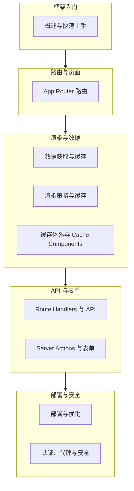

Next.js 模块共 10 篇文档，覆盖了从建站到上线的完整链路。本文继续以"虚拟歌手音乐平台"为背景（歌姬主页、演唱会排期、粉丝团报名），把 App Router 文件约定、数据获取与缓存、API 层、渲染策略、缓存新模型和部署安全六条线索收拢成一页，作为二轮复习的索引。

使用建议：Next.js 的知识重心不在语法而在"约定与选型"——文件放哪里、缓存选哪种、渲染用哪档，都是决策题而非默写题。它的设计哲学是"约定优先于配置"：记住文件名就是记住功能，记住缓存关键词就是记住整套数据策略。因此复习时建议每读完一节就问自己：这个需求放到我的项目里该怎么选，为什么这样选，换一种选法会牺牲什么。示例代码可直接放入 create-next-app 生成的项目中对照验证。

## 前置知识

- [Next.js 16 概述与快速上手](/nextjs/010-NextJS16Overview)：App Router 的定位与 create-next-app 建站流程，理解"页面文件即路由"的起点。
- [React 概述与环境配置](/react/010-OverviewEnvSetup)：React 19 组件模型是 Next.js 的地基，服务端组件语法直接来自 React 19。
- [Next.js App Router 路由系统](/nextjs/020-AppRouterRouting)：布局嵌套、动态路由与 loading、error、not-found 三种状态页面的文件约定。

## 学习目标

1. 能默写 App Router 的核心文件约定：page、layout、loading、error、not-found、route，并说出每个文件的职责边界。
2. 能为演唱会排期页选择正确的 fetch 缓存策略，说清 force-cache、no-store、revalidate 三者的差别与组合方式。
3. 能用 Route Handlers 写出粉丝团报名接口，再用 Server Actions 改写同一需求，并说出两者的适用边界。
4. 能用一张表区分 SSG、ISR、SSR、CSR，并给出每个页面级的选型结论与判定信号。
5. 能说出 Next.js 16 Cache Components 模型的核心变化：`'use cache'` 显式声明缓存、`cacheLife` 控制时长、静态壳与动态洞同页共存。
6. 能配置 proxy.ts 保护粉丝团页面，并说出构建期与运行期各自的优化手段。

## 知识地图



模块共 10 篇，结构紧凑：N1 与 N2 解决"页面从哪来"，是一切的地基；N3 是全模块的心脏，数据从哪来、多旧可接受、HTML 何时生成，三个问题都落在这里，其中 010 是 003 与 007 的进阶合流（Next.js 16 的显式缓存模型），初学可先跳过、二轮复习时再攻；N4 解决"数据怎么改"；N5 解决"如何安全地上线"。读完后回头看，你会发现整条链路就是一次真实项目从开发到发布的顺序重演，按编号顺序复习即可覆盖全部主干。

## 核心概念回顾

### 1. 文件约定与布局：page 与 layout 的分工

App Router 用目录结构表达路由，不写任何路由表：目录名就是 URL 段，文件夹一层层嵌套对应路径一级级下钻。`layout.tsx` 是共享壳，切换子页面时不会重新渲染，导航条写在布局里即可避免整页刷新；`page.tsx` 才是真正随路由切换的页面内容；导出 `metadata` 对象即可自动注入 head 标签，这是内置的 SEO 能力，不用再引入任何第三方插件。

```tsx
// app/layout.tsx：虚拟歌手音乐平台的根布局
import type { Metadata } from 'next'

// 导出 metadata 即可自动注入 head 标签，这是内置 SEO 能力
export const metadata: Metadata = {
  title: '星屑音乐台',
  description: '虚拟歌手演唱会直播与歌曲库',
}

export default function RootLayout({
  children,
}: Readonly<{ children: React.ReactNode }>) {
  return (
    <html lang="zh-CN">
      <body>
        <header>导航：歌曲库 / 演唱会 / 粉丝团</header>
        {children}
      </body>
    </html>
  )
}
```

### 2. 动态路由与页面状态约定

歌姬主页、演唱会详情页都用 `[id]` 动态段承接。Next.js 15 以后 `params` 是 Promise，必须 `await`；取不到数据时调用 `notFound()` 交给 `not-found.tsx` 渲染，加载与报错则分别由 `loading.tsx` 与 `error.tsx` 接管。这套"状态页面"约定让每个路由段天然具备加载、出错、兜底三种形态，不再需要手写状态机。

```tsx
// app/concerts/[id]/page.tsx：演唱会详情页
import { notFound } from 'next/navigation'

interface Concert {
  id: string
  title: string
  singer: string
}

export default async function ConcertPage({
  params,
}: {
  params: Promise<{ id: string }>
}) {
  const { id } = await params // params 是 Promise，必须 await
  const concert: Concert | null = await fetch(
    `https://api.fandex.dev/concerts/${id}`,
  ).then((r) => (r.ok ? r.json() : null))

  if (!concert) notFound() // 交给 not-found.tsx 渲染 404 界面
  return <h1>{concert.title}：{concert.singer} 专场</h1>
}
```

### 3. 数据获取与缓存策略

服务器组件里可以直接 `await fetch()`。缓存策略只需记住三个关键词：`force-cache` 存起来、`no-store` 不存、`revalidate` 定期更新。横幅广告、实时榜单、演唱会排期正好对应三种策略，判断依据只有一个问题：这份数据旧多少秒可以接受。

```tsx
// app/songs/page.tsx：三种 fetch 缓存策略同页对比
export default async function SongsPage() {
  // 静态数据：构建时抓取一次并长期缓存
  const banners = await fetch('https://api.fandex.dev/banners', {
    cache: 'force-cache',
  }).then((r) => r.json())

  // 实时榜单：每次请求都重新拉取
  const ranking = await fetch('https://api.fandex.dev/ranking', {
    cache: 'no-store',
  }).then((r) => r.json())

  // 演唱会排期：每 60 秒后台再生一次（ISR）
  const concerts = await fetch('https://api.fandex.dev/concerts', {
    next: { revalidate: 60 },
  }).then((r) => r.json())

  return (
    <main>
      <p>今日榜单第一：{ranking[0].title}</p>
      <p>近期演唱会 {concerts.length} 场，横幅 {banners.length} 张</p>
    </main>
  )
}
```

### 4. Route Handlers：app 目录下的后端接口

`route.ts` 是 Next.js 内置的后端：导出与 HTTP 方法同名的函数即可对外提供接口，完全基于 Web 标准 Request 与 Response，不依赖 Express 等额外框架。它与 `page.tsx` 在同一文件夹中互斥，适合开放给第三方调用的场景；代码只在服务器执行，可以安全地连接数据库、读取环境变量密钥。

```ts
// app/api/fan-club/route.ts：粉丝团报名接口
const members: string[] = [] // 演示用内存存储，生产请接数据库

// GET /api/fan-club：查询当前成员总数
export async function GET() {
  return Response.json({ total: members.length })
}

// POST /api/fan-club：新增一名粉丝团成员
export async function POST(request: Request) {
  const { nickname } = await request.json()
  if (!nickname) {
    return Response.json({ error: '昵称不能为空' }, { status: 400 })
  }
  members.push(nickname)
  return Response.json({ ok: true, total: members.length }, { status: 201 })
}
```

### 5. Server Actions：表单提交的最短路径

本应用内部的表单不必手写接口：用 `'use server'` 标记的异步函数可以直接绑定到 `<form action>`，框架自动完成序列化与请求，写库后还能配合 `revalidatePath` 或 `revalidateTag` 刷新列表缓存。要注意 Action 本质仍是公开的 HTTP 端点，入参校验与权限检查一样都不能少，这是 [Server Actions 与表单](/nextjs/050-ServerActionsForms) 反复强调的安全模型。

```tsx
// app/fan-club/page.tsx：内联 Server Action，提交直接在服务器执行
async function joinFanClub(formData: FormData) {
  'use server' // 函数体首行声明，标记为服务器函数
  const nickname = String(formData.get('nickname') ?? '').trim()
  if (!nickname) return // 真实项目应改用 zod 做服务端强校验
  // 此处将昵称写入数据库，并可用 revalidatePath 刷新粉丝团列表
}

export default function FanClubPage() {
  return (
    <form action={joinFanClub}>
      <input name="nickname" placeholder="输入应援昵称" required />
      <button type="submit">加入粉丝团</button>
    </form>
  )
}
```

### 6. 渲染策略：给每个页面选对生成时机

同一站点可以逐路由混用 SSG、ISR、SSR 与 CSR，这不是全局开关而是页面级选择。判定信号主要有三类：动态 API（cookies、headers）、fetch 缓存选项、路由段配置。演唱会榜单页用 `revalidate` 声明 ISR，兼顾新鲜度与服务器成本；关于页、应援色说明页则保持默认静态直出。

```tsx
// app/ranking/page.tsx：用路由段配置选择 ISR 策略
export const revalidate = 300 // 每 5 分钟后台再生一次榜单

interface Song {
  id: number
  title: string
}

export default async function RankingPage() {
  const songs: Song[] = await fetch('https://api.fandex.dev/ranking').then(
    (r) => r.json(),
  )
  return (
    <ol>
      {songs.slice(0, 10).map((s) => (
        <li key={s.id}>{s.title}</li>
      ))}
    </ol>
  )
}
```

### 7. proxy.ts 与访问控制

`proxy.ts`（Next.js 16 起由 `middleware.ts` 更名，旧文件名仍可用但已废弃）在请求进入路由前运行，适合做登录态检查、重定向与请求改写。它运行在 Node.js 运行时上，但官方要求它保持轻量：只做 Cookie 或请求头级别的判断，重查询交给页面或 Route Handler，否则每个被拦截的请求都会变慢。更完整的鉴权分层模型见第 8 篇。

```ts
// proxy.ts：未登录用户访问粉丝团页时重定向到登录页
import { NextResponse, type NextRequest } from 'next/server'

export function proxy(request: NextRequest) {
  const hasSession = request.cookies.has('fan_session')
  if (!hasSession) {
    const url = new URL('/login', request.url)
    url.searchParams.set('from', request.nextUrl.pathname) // 记录回跳地址
    return NextResponse.redirect(url)
  }
  return NextResponse.next()
}

export const config = {
  matcher: ['/fan-club/:path*'], // 仅拦截粉丝团相关路由
}
```

## 易混淆概念对比

### page.tsx 与 route.ts

| 对比项 | page.tsx（页面） | route.ts（接口） |
| --- | --- | --- |
| 对外产出 | 渲染好的 HTML 与 React UI | HTTP 响应（JSON、文本、流） |
| 典型调用方 | 浏览器地址栏、站内导航 | fetch、curl、移动端、第三方系统 |
| 必须导出 | default 的 React 组件 | 与方法同名的 GET、POST 等函数 |
| 返回值 | JSX | Web 标准 Response 对象 |
| 同目录关系 | 二者互斥，一个文件夹二选一 | 同左 |
| 适用场景 | 歌姬主页、演唱会列表等页面 | 开放 API、Webhook、外部回调 |

### SSG、ISR 与 SSR

| 对比项 | SSG | ISR | SSR |
| --- | --- | --- | --- |
| HTML 生成时机 | 构建时一次 | 构建时加后台定时再生 | 每次请求时 |
| 数据新鲜度 | 构建时快照 | 秒级到分钟级陈旧 | 实时 |
| 首屏速度 | 最快 | 快 | 取决于服务器计算量 |
| 服务器成本 | 最低（CDN 直出） | 低 | 高 |
| 典型页面 | 关于页、应援色说明页 | 歌曲库、演唱会排期 | 实时榜单、个人中心 |

## 常见误区与排查

### 误区 1：page.tsx 与 route.ts 放进同一文件夹

```text
错误结构：app/api/fan-club/ 下同时存在 page.tsx 与 route.ts
现象：构建报错，一个路径要么渲染页面、要么响应接口，二者只能选一
修正：页面放 app/fan-club/page.tsx，接口放 app/api/fan-club/route.ts
```

### 误区 2：把 params 当同步对象使用

```tsx
// 错误：Next.js 15 以后 params 是 Promise，直接取属性得到 undefined
export default function Page({ params }: { params: { id: string } }) {
  return <h1>{params.id}</h1> // 页面上什么都不显示
}

// 修正：组件改为 async，先 await 再使用
export default async function Page({
  params,
}: {
  params: Promise<{ id: string }>
}) {
  const { id } = await params
  return <h1>歌姬 {id}</h1>
}
```

### 误区 3：在服务器组件里写交互逻辑

```tsx
// 错误：服务器组件不能使用 useState 与事件处理
export default function VoteBox() {
  const [count, setCount] = useState(0) // 构建期直接报错
  return <button onClick={() => setCount(count + 1)}>投票</button>
}

// 修正：交互组件单独成文件并在顶部声明 'use client'
'use client'
export default function VoteBox() {
  const [count, setCount] = useState(0)
  return <button onClick={() => setCount(count + 1)}>投票 {count}</button>
}
```

### 误区 4：滥用 no-store 导致页面全部动态化

```tsx
// 错误：与页面无关的数据也用了 no-store，整页被迫每次请求渲染
const fans = await fetch('https://api.fandex.dev/fans', { cache: 'no-store' })
  .then((r) => r.json())

// 修正：只有实时性要求高的数据用 no-store，其余交给 revalidate
const fans = await fetch('https://api.fandex.dev/fans', {
  next: { revalidate: 300 },
}).then((r) => r.json())
```

### 误区 5：Server Action 返回不可序列化的对象

```ts
// 错误：返回类实例，跨网络边界无法序列化，客户端拿到报错
export async function joinFanClub() {
  'use server'
  return new FanClubMember('星尘P') // FanClubMember 类实例不可序列化
}

// 修正：只返回普通对象
export async function joinFanClub() {
  'use server'
  return { ok: true, nickname: '星尘P' }
}
```

### 误区 6：在 proxy 里做重查询

```ts
// 错误：proxy 官方定位是轻量入口层，直连数据库的慢查询会拖慢每个被拦截的请求
export async function proxy(request: NextRequest) {
  const user = await db.user.findBySession(request.cookies) // 不应出现
  return NextResponse.next()
}

// 修正：proxy 只做轻量 Cookie 检查，详细鉴权放到页面或 Route Handler
export function proxy(request: NextRequest) {
  if (!request.cookies.has('fan_session')) {
    return NextResponse.redirect(new URL('/login', request.url))
  }
  return NextResponse.next()
}
```

### 误区 7：客户端组件引用服务器专用依赖

```ts
// 错误：数据库客户端被打进浏览器包，构建报错甚至泄漏密钥
'use client'
import { db } from '@/lib/db'

// 修正：数据访问只写在服务器侧（服务器组件、route.ts、Action），
// 客户端组件通过调用接口或 Server Action 间接取数
```

### 误区 8：revalidatePath 的路径与页面不一致

```ts
// 错误：路径与实际路由段不匹配，缓存静默失效失败
revalidatePath('/fan-club/list')

// 修正：与真实路由段严格对应；写库完成后立即调用
revalidatePath('/fan-club')
```

## 自检清单

- [ ] 能默写 page、layout、loading、error、not-found、route 六个文件约定各自的职责。
- [ ] 能解释 layout 在子页面切换时不重渲染的特性对导航条与状态保持的意义。
- [ ] 能为三种不同时效的数据分别选出 force-cache、revalidate、no-store 并说明理由。
- [ ] 能写出粉丝团报名接口的 route.ts 版本与 Server Actions 版本，并说出取舍标准。
- [ ] 能用 useActionState 把服务端校验错误回显到表单并保留用户已输入的内容。
- [ ] 能对着决策树为歌曲详情页、实时榜单、购票后台分别选定渲染策略并给出判定信号。
- [ ] 能说清 params 与 searchParams 在 Next.js 15 以后均为 Promise 的写法差异。
- [ ] 能说出 `'use cache'` + `cacheLife` + `cacheTag` 各自解决什么问题，以及 Cache Components 启用后哪些路由段配置会失效。
- [ ] 能配置 matcher 精确控制 proxy 的拦截范围，避免全站请求都被额外处理。
- [ ] 能列举部署阶段的三个优化抓手：图片字体优化、按需加载、缓存头策略。
- [ ] 能说明为什么客户端组件不能 import 数据库客户端，以及密钥泄漏的常见路径。

## 后续学习路径

1. 复习 [Next.js 数据获取与缓存](/nextjs/030-DataFetchingCaching)，把三种缓存策略的适用边界背熟，重点理解请求去重与按标签失效。
2. 深入 [Route Handlers 与 API 设计](/nextjs/040-RouteHandlersApi)，补齐统一错误处理与状态码规范，学会用 NextRequest、NextResponse 处理 Cookie 与流式响应。
3. 攻克 [Server Actions 与表单](/nextjs/050-ServerActionsForms)，掌握 zod 校验、useActionState 错误回显与缓存失效的完整链路。
4. 精读 [渲染策略与缓存](/nextjs/060-RenderingStrategies)，理解 Next.js 16 缓存模型显式化后的 Cache Components、Partial Prefetching 与 Instant Navigations。
5. 进阶 [缓存体系与 Cache Components 深入](/nextjs/070-CacheComponentsDeepDive)，掌握 `'use cache'`、`cacheLife` 与 `updateTag` 的新模型写法，并把传统缓存语义逐一迁移过去。
6. 学习 [认证、代理与安全](/nextjs/080-AuthProxyMiddleware)，为平台补上完整的登录、会话与代理转发方案。
7. 实践 [部署与优化](/nextjs/090-DeploymentOptimization)，把构建分析、图片字体优化落到 CI 流程里，形成可重复的发布管线。
8. 回到 [Next.js App Router](/react/410-NextJsAppRouter)，从 React 视角补全 App Router 的实现原理，理解服务端组件在元框架中如何落地，打通 react 模块与 nextjs 模块的最后一公里。
