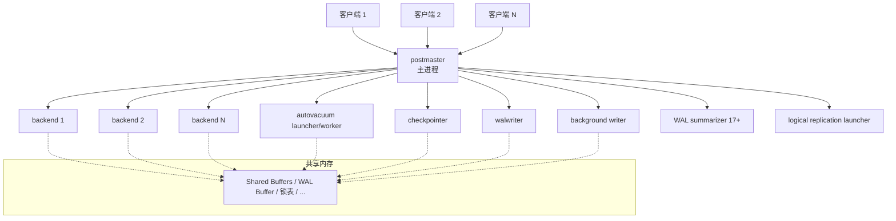
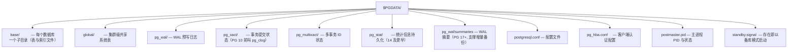

## 1. 为什么先学架构

理解 PostgreSQL 的整体结构，是后续学习 VACUUM、锁、复制、调优的地基。
举例来说：为什么一个慢查询能拖垮整个数据库？为什么连接数不能开很大？
为什么统计信息在 PostgreSQL 15 前后行为不同？答案都在架构里。

一个可以先行建立的类比：把 PostgreSQL 想象成一家**餐厅**——

- postmaster 是**前台经理**：迎客、为每桌客人安排服务员；
- 每个后端进程（backend）是一名**服务员**：一对一服务一位客人（连接）；
- 共享内存是**后厨公共操作台**：所有服务员共享的备菜区；
- 后台工作进程（checkpointer、walwriter 等）是**保洁与仓储团队**。

## 2. 进程模型：一连接一进程

### 2.1 与线程模型的对比

PostgreSQL 采用**多进程**架构（而非 MySQL 的多线程）：每个客户端连接
由一个独立的操作系统进程服务。进程间内存天然隔离，一个后端崩溃不会
直接污染其他进程的内存，稳定性好；代价是进程创建开销大、每个连接的
基础内存占用高（数 MB 起步），因此生产环境通常配合 PgBouncer 等连接池。



### 2.2 连接流程

```
客户端发起连接 → postmaster 完成认证（pg_hba.conf）
→ fork 出一个 backend 进程 → 此后该连接的所有查询都由这个进程处理
→ 连接断开时, 进程退出
```

```sql
-- 验证"一连接一进程": 每个客户端连接在 pg_stat_activity 中对应一个 backend 进程
SELECT pid, usename, application_name, backend_type
FROM pg_stat_activity;
--     pid   | usename  | application_name | backend_type
--   --------+----------+------------------+------------------
--    16224  | postgres | psql             | client backend
--    16088  |          |                  | autovacuum launcher
--    16230  |          |                  | logical replication launcher
--    16085  |          |                  | background writer
--    ...（backend_type 列可区分客户端连接与后台进程）

-- 查看当前连接数（对应 backend 进程数）
SELECT count(*) FROM pg_stat_activity WHERE backend_type = 'client backend';
--  count
-- ------
--      3
```

### 2.3 核心后台进程

| 进程 | 作用 | 相关参数 |
| --------------------- | ---------------------------------- | ---------------------------------- |
| postmaster | 主进程，监听端口、认证、fork 后端 | port、max_connections |
| backend（client backend） | 处理单个客户端连接的全部查询 | — |
| checkpointer | 执行检查点，把脏页刷盘并写检查点记录 | checkpoint_timeout、checkpoint_completion_target |
| background writer（bgwriter） | 平滑刷写共享缓冲区中的脏页，减轻检查点压力 | bgwriter_delay |
| walwriter | 把 WAL 缓冲区刷写到磁盘 | wal_writer_delay |
| autovacuum launcher | 调度 autovacuum worker | autovacuum、autovacuum_naptime |
| autovacuum worker | 实际执行自动清理/分析 | autovacuum_max_workers |
| WAL summarizer（PostgreSQL 17+） | 持续生成 WAL 块引用摘要，支撑增量备份 | summarize_wal |
| logical replication launcher | 按需拉起逻辑复制的 apply worker | max_logical_replication_workers |
| WAL sender | 向备库/订阅端发送 WAL（按连接产生） | max_wal_senders |
| WAL receiver / startup（备库） | 接收并回放 WAL | primary_conninfo |
| stats collector | **PostgreSQL 14 及更早**：收集统计信息 | — |
| io worker（PostgreSQL 18+） | 异步 I/O 的工作进程（io_method = worker） | io_method、io_workers |

两个重要的版本演进：

- **PostgreSQL 15**：统计信息从 stats collector 进程的周期性文件写入，
  改为保存在共享内存中，查询 `pg_stat_*` 视图实时且更轻量；
  独立的 stats collector 进程从此消失。
- **PostgreSQL 17**：为支撑增量备份，新增常驻的 WAL summarizer 后台进程。

```bash
# 在操作系统层面直接观察 PostgreSQL 进程树（Linux）
ps -ef | grep postgres
# postgres  16085     1  0 ... postgres: checkpointer
# postgres  16087     1  0 ... postgres: walwriter
# postgres  16088     1  0 ... postgres: autovacuum launcher
# postgres  16224  16085  0 ... postgres: postgres postgres [local] idle
```

## 3. 共享内存：所有进程的公共操作台

### 3.1 主要共享内存区域

| 区域 | 参数 | 默认值 | 说明 |
| -------------- | ----------------------- | --------- | ------------------------------ |
| Shared Buffers | shared_buffers | 128MB | 数据页缓存（缓冲池） |
| WAL Buffer | wal_buffers | -1(自动) | WAL 日志缓冲区 |
| Clog（pg_xact） | — | — | 事务提交状态（提交/中止/进行中） |
| Lock Table | — | — | 重型锁（表锁等）的锁表 |
| ProcArray | — | — | 所有活动进程与事务的信息，快照的依据 |
| 复制/逻辑槽 | — | — | 复制槽状态 |
| 统计信息（15+） | — | — | pg_stat_* 视图的数据源 |

### 3.2 缓冲池工作方式

backend 读取数据时：先在 Shared Buffers 找目标页（命中则直接用），
未命中则从磁盘读入缓冲池（必要时按时钟扫描淘汰旧页）。
修改数据时只改缓冲池中的页（成为"脏页"），由 bgwriter/checkpointer
异步刷盘——这就是"写数据不等于立刻落盘"，崩溃恢复依赖 WAL。

```sql
-- 缓冲池常用诊断
SELECT count(*) FROM pg_buffercache;  -- 需 CREATE EXTENSION pg_buffercache;

-- 某表占用了多少缓冲页
SELECT c.relname, count(*) AS buffers
FROM pg_buffercache b JOIN pg_class c ON b.relfilenode = pg_relation_filenode(c.oid)
WHERE c.relname = 'orders'
GROUP BY c.relname;
```

```ini
# postgresql.conf：生产环境一般设为物理内存的 25% 左右
shared_buffers = '4GB'      # 以 16GB 内存服务器为例
# 修改后需要重启
```

## 4. 本地内存：每个进程私有

| 区域 | 参数 | 默认值 | 说明 |
| -------------------- | --------------------- | ------ | ------------------------- |
| Work Mem | work_mem | 4MB | 排序、哈希连接等操作的内存 |
| Maintenance Work Mem | maintenance_work_mem | 64MB | VACUUM、CREATE INDEX 等 |
| Temp Buffers | temp_buffers | 8MB | 临时表缓冲区 |

关键认知：**work_mem 是"每个排序/哈希节点"的配额，不是连接总配额**。
一条复杂查询可能同时使用多个 work_mem，一个高并发系统里实际内存
= 连接数 x 每连接节点数 x work_mem，这是内存溢出（OOM）的常见根源。

```sql
-- 会话级临时调大（只影响当前连接, 用于个别大报表查询）
SET work_mem = '256MB';
SELECT ... ORDER BY ... LIMIT ...;
RESET work_mem;

-- 验证排序是否溢出到磁盘（external merge Sort 说明 work_mem 不够）
EXPLAIN (ANALYZE, BUFFERS) SELECT * FROM big_table ORDER BY payload;
-- Sort Method: quicksort   Memory: 25MB       -- 内存内完成
-- Sort Method: external merge  Disk: 180MB     -- 溢出到磁盘, 考虑调大 work_mem
```

## 5. 一条查询的旅程

把前面的组件串起来，一条 `SELECT` 从进入数据库到返回要经过：

```
客户端 → 认证（pg_hba.conf）→ backend 进程
  → 解析器（Parser）    : 生成语法树
  → 分析器（Analyzer）  : 解析对象名、检查权限
  → 重写器（Rewriter）  : 展开视图、应用规则
  → 规划器（Planner）   : 依据统计信息生成最优执行计划
  → 执行器（Executor）  : 按计划树逐节点取元组
      → 缓冲池读取数据页（未命中则读磁盘）
      → 依据 MVCC 可见性规则过滤元组版本
→ 结果返回客户端
```

写操作（INSERT/UPDATE/DELETE）在此基础上多两步：先把变更记录写入
WAL 缓冲区（并按 synchronous_commit 约定刷盘），再修改缓冲池中的数据页。
这条"WAL 先行"的原则是崩溃恢复与复制的基础。

## 6. 数据目录结构



```sql
-- 定位某张表在磁盘上的物理文件（relfilenode）
SELECT pg_relation_filenode('orders') AS filenode,
       pg_relation_filepath('orders') AS filepath;
--   filepath
--  -------------------------------------------
--  base/16384/24596
--（base/数据库OID/表文件节点号, 表超过 1GB 会拆成 24596.1、24596.2 ...）
```

## 7. 实战场景

### 7.1 场景一：连接数打满

```
现象: 应用报 FATAL: sorry, too many clients already
原因: 每连接一进程, max_connections 有上限, 且每个进程消耗数 MB 内存
处置: 短查询密集场景引入 PgBouncer（transaction 池化模式）,
      长事务/慢查询则优先优化查询而不是扩连接数
```

### 7.2 场景二：统计信息查询突然变慢/变快

```
现象: 升级到 PostgreSQL 15 后, pg_stat_user_tables 的读数"实时"了
原因: 15 前统计由 collector 进程定期写文件（有延迟与丢失）,
      15 后存于共享内存, 读到的就是当前值
```

## 8. 常见陷阱与调试

- **以为 shared_buffers 越大越好**：超过内存 25-40% 通常收益递减，
  因为操作系统页缓存（double buffering）也在缓存数据页。
- **在高并发下把 work_mem 设成 256MB**：内存需求是乘法关系，
  先观察 `Sort Method: external merge` 再针对性调整。
- **直接 kill 后台进程**：postmaster 检测到子进程异常退出会重启整个
  实例（所有连接断开）；运维操作应使用 `pg_terminate_backend(pid)`。
- **以为删了表磁盘立刻释放**：被删除的文件句柄可能仍被进程持有，
  长事务、复制槽、prepared 事务都会拖住空间回收（详见 VACUUM 一文）。

## 小结

- 初学者要点：PostgreSQL 是"一连接一进程"的 C/S 架构；backend 进程负责
  你的所有查询；数据先写 WAL、再改内存页、最后异步落盘；shared_buffers
  是公共缓存，work_mem 是私有工作区。
- 进阶注意：统计信息在 15 后存于共享内存；17 新增 WAL summarizer 支撑
  增量备份；18 新增异步 I/O（io_method = worker/io_uring）。理解
  "进程模型 x 内存配额 x 后台进程分工"这三件事，是读懂 VACUUM、锁、
  并行查询与复制文档的前提。
