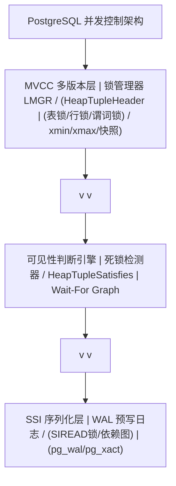
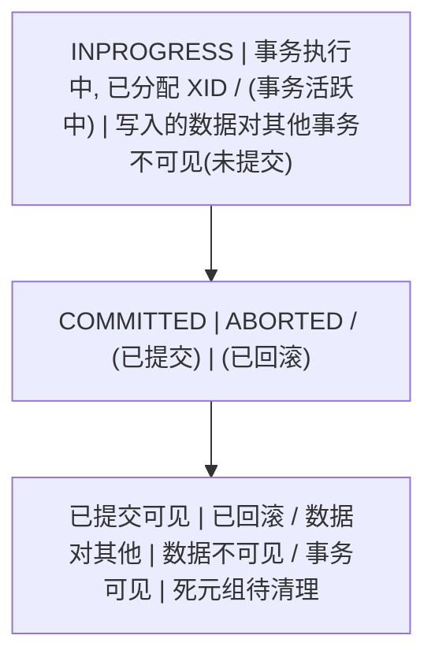
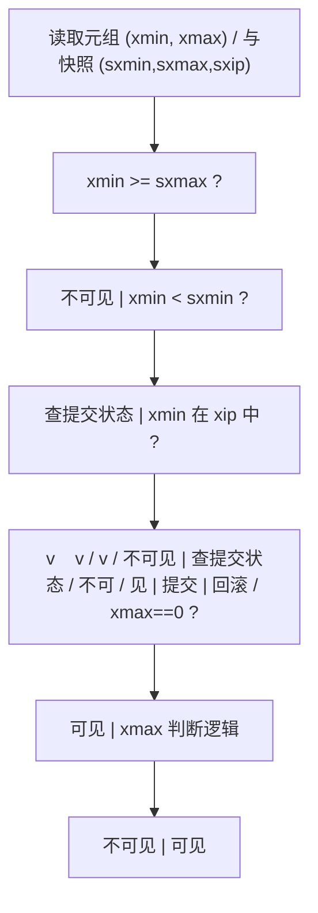
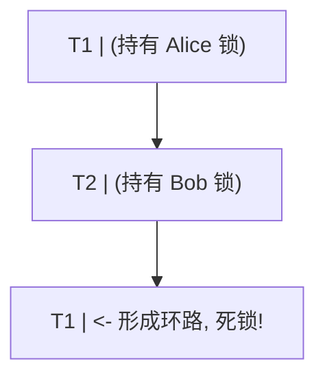
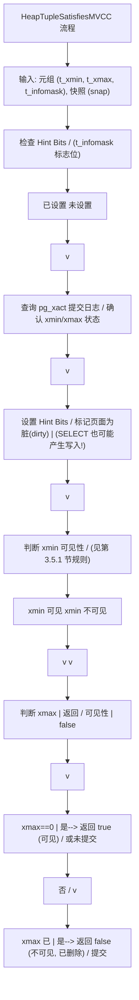

# PostgreSQL 事务与并发控制：从原理到工程实践

> 本文是一篇面向数据库内核研究者、后端架构师与高级 DBA 的论文级教材。内容覆盖事务理论基础、PostgreSQL MVCC 存储内核、隔离级别的并发语义、锁子系统、可序列化快照隔离（SSI）、预写式日志（WAL）、参数调优、性能基准、工程最佳实践、反模式、故障排查实战，以及与 MySQL InnoDB、Oracle 的横向对比。每个核心概念均配以理论解释、可执行 SQL 示例与 ASCII 图示。

---

## 第 1 章 概述与学习目标

### 1.1 为什么需要并发控制

数据库系统区别于普通文件系统的核心能力之一，是在多用户并发访问下仍能保证数据的正确性与一致性。当多个事务同时读写同一份数据时，若无有效的并发控制机制，将出现以下问题：

- 丢失更新（Lost Update）：两个事务基于同一旧值各自计算并写回，其中一个事务的更新被覆盖。
- 脏读（Dirty Read）：事务读取到了其他未提交事务写入的数据，而该事务随后回滚，导致读到了从未真实存在过的值。
- 不可重复读（Non-repeatable Read）：同一事务内两次读取同一行得到不同结果，破坏了事务内的数据一致性视图。
- 幻读（Phantom Read）：同一事务内两次执行同一范围查询，结果集行数发生变化。
- 写偏斜（Write Skew）：两个事务各自读取重叠数据并基于旧快照做出决策，写回非重叠数据，最终结果违反业务不变式，但在快照隔离下不会被自动检测。

```
并发问题的本质:
  事务 T1 与 T2 在时间维度上重叠执行
  T1 的中间状态可能被 T2 观测, 或 T2 的写入影响 T1 的决策
  并发控制的目标: 让并发执行的结果等价于某种串行执行 (可串行化)
```

PostgreSQL 采用多版本并发控制（MVCC）作为其并发控制的基石，辅以表级锁、行级锁、谓词锁与死锁检测，构成了一套完整的并发控制子系统。

### 1.2 PostgreSQL 并发控制总体架构



### 1.3 学习目标

完成本文学习后，读者应能够：

1. 准确阐述 ACID 四特性的工程含义，并解释 Isolation 在并发场景下的微妙之处。
2. 描述 ANSI SQL 定义的四种隔离级别与三种读现象，并能区分 SQL 标准定义与 PostgreSQL 实际实现的差异。
3. 深入理解 PostgreSQL 的 MVCC 存储模型，包括 HeapTupleHeader 结构、xmin/xmax/cmin/cmax 字段、快照数据结构与可见性判断算法。
4. 掌握八种表级锁模式及其完整冲突矩阵，理解行级锁、Advisory 锁的语义与适用场景。
5. 阐述可序列化快照隔离（SSI）的算法原理，包括 rw-conflict 依赖图、危险结构检测与 SIREAD 锁机制。
6. 理解 WAL 机制、LSN 编号、pg_xact 提交日志与检查点的工作流程。
7. 能够针对不同负载进行事务参数调优，识别并解决锁争用、死锁与长事务问题。
8. 具备对生产环境并发故障进行根因分析与预防设计的能力。

### 1.4 阅读约定

本文 SQL 示例默认在 PostgreSQL 16 及以上版本验证通过，部分特性会标注引入版本。所有 ASCII 图示采用等宽字符绘制，建议在等宽字体下阅读。代码注释统一采用中文工程级注释，标注参数含义、返回值与核心流程。

---

## 第 2 章 事务理论基础

### 2.1 ACID 四特性详解

ACID 是事务处理的四项基本保证，由 Andreas Reuter 与 Theo Härder 于 1983 年正式提出。

| 特性 | 全称 | 工程含义 | PostgreSQL 实现机制 |
| :--- | :--- | :--- | :--- |
| A | Atomicity 原子性 | 事务内的所有操作要么全部成功，要么全部失败回滚，不存在部分提交的中间状态 | WAL 事务日志 + pg_xact 提交状态位 |
| C | Consistency 一致性 | 事务执行前后，数据库满足所有完整性约束（主键、外键、CHECK、触发器、应用不变式） | 约束检查 + 触发器 + MVCC 可见性 |
| I | Isolation 隔离性 | 并发执行的事务之间互不干扰，效果等价于某种串行执行 | MVCC + 锁 + SSI |
| D | Durability 持久性 | 事务一旦提交，其结果即被永久保存，即使系统崩溃也不会丢失 | WAL 刷盘 + fsync + full_page_writes |

需要特别强调的是，**一致性是应用层与数据库共同保证的目标**，而原子性、隔离性、持久性是数据库提供的手段。ACID 中的 Isolation 是最容易产生误解的特性：SQL 标准定义的隔离级别与各数据库的实际实现存在显著差异，本文第 4 章将详细剖析。

### 2.2 事务状态机

PostgreSQL 事务在生命周期内经历若干状态转换。理解状态机有助于把握可见性判断与锁释放时机。



事务状态在内核中由事务 ID（XID）与提交状态日志共同决定。PostgreSQL 的事务 ID 是 32 位无符号整数，按递增顺序分配，理论最大值为 2^32 - 1（约 42.9 亿）。事务 ID 回卷问题与冻结机制将在第 3 章与第 8 章详述。

### 2.3 ANSI SQL 隔离级别

SQL 标准（ANSI SQL-92）定义了四种隔离级别，通过禁止的读现象来区分。三种读现象定义如下：

- 脏读（Dirty Read, P1）：事务 T1 读取了并发未提交事务 T2 修改的数据。
- 不可重复读（Non-repeatable Read, P2）：事务 T1 读取某行后，并发事务 T2 修改并提交该行，T1 再次读取得到不同值。
- 幻读（Phantom Read, P3）：事务 T1 执行某范围查询后，并发事务 T2 插入或删除符合该范围的行并提交，T1 再次执行同一查询得到不同行集。

SQL 标准隔离级别矩阵：

| 隔离级别 | 脏读 P1 | 不可重复读 P2 | 幻读 P3 |
| :--- | :--- | :--- | :--- |
| READ UNCOMMITTED | 允许 | 允许 | 允许 |
| READ COMMITTED | 禁止 | 允许 | 允许 |
| REPEATABLE READ | 禁止 | 禁止 | 允许 |
| SERIALIZABLE | 禁止 | 禁止 | 禁止 |

然而 Berenson 等人在 1995 年的论文《A Critique of ANSI SQL Isolation Levels》中指出，ANSI SQL 标准的定义存在歧义，且实际数据库的行为与标准矩阵并不一致。PostgreSQL 的实现即是一例：其 REPEATABLE READ 实际上禁止了幻读。

### 2.4 扩展的并发异常

除 ANSI SQL 定义的三种读现象外，还存在多种标准未覆盖的并发异常。理解这些异常对正确选择隔离级别至关重要。

#### 2.4.1 丢失更新（Lost Update, P4）

```sql
-- 初始: accounts.balance = 100
-- 会话 T1
BEGIN;
SELECT balance FROM accounts WHERE id = 1;  -- 返回 100
-- 会话 T2
BEGIN;
SELECT balance FROM accounts WHERE id = 1;  -- 返回 100
UPDATE accounts SET balance = 100 - 30 WHERE id = 1;  -- balance = 70
COMMIT;
-- 会话 T1 继续
UPDATE accounts SET balance = 100 - 50 WHERE id = 1;  -- 用旧值 100 计算, 写入 50
COMMIT;
-- 最终结果: balance = 50, T2 的 -30 更新丢失
```

在 PostgreSQL 的 READ COMMITTED 下，UPDATE 语句会基于当前行的最新提交版本重新评估 WHERE 条件（EvalPlanQual），因此不会静默发生经典的丢失更新。而在 REPEATABLE READ 下，若目标行已被并发已提交事务修改，UPDATE 会直接报错 `could not serialize access` 并中止（丢失更新以"报错重试"的方式被阻止），而不是悄悄基于新版本重算。应用层"先读后写"的模式在两种级别下都建议显式使用 `SELECT ... FOR UPDATE` 或乐观锁。

#### 2.4.2 读偏斜（Read Skew, A5A）

```sql
-- 初始: account1 = 100, account2 = 100, 总和 = 200
-- 会话 T1 (转账: 从 account1 转 50 到 account2)
BEGIN;
UPDATE accounts SET balance = 50 WHERE id = 1;
UPDATE accounts SET balance = 150 WHERE id = 2;
COMMIT;
-- 会话 T2 (在 T1 两次 UPDATE 之间读取)
BEGIN ISOLATION LEVEL READ COMMITTED;
SELECT balance FROM accounts WHERE id = 1;  -- 50 (已更新)
SELECT balance FROM accounts WHERE id = 2;  -- 100 (尚未更新)
-- T2 看到总和 = 150, 出现读偏斜
COMMIT;
```

读偏斜在 READ COMMITTED 下可能发生，在 REPEATABLE READ（快照隔离）下被禁止。

#### 2.4.3 写偏斜（Write Skew, A5B）

写偏斜是快照隔离下最著名的异常，也是 SSI 算法要解决的核心问题。

```sql
-- 场景: 医院值班, 至少需要 1 名医生值班
-- 初始: Alice 值班, Bob 值班 (共 2 人)
-- 会话 T1 (Alice 请假)
BEGIN ISOLATION LEVEL REPEATABLE READ;
SELECT COUNT(*) FROM doctors WHERE on_call = true;  -- 2, 可以请假
UPDATE doctors SET on_call = false WHERE name = 'Alice';
COMMIT;
-- 会话 T2 (Bob 请假, 与 T1 并发)
BEGIN ISOLATION LEVEL REPEATABLE READ;
SELECT COUNT(*) FROM doctors WHERE on_call = true;  -- 2, 可以请假
UPDATE doctors SET on_call = false WHERE name = 'Bob';
COMMIT;
-- 最终结果: 无人值班, 违反业务不变式
-- REPEATABLE READ 无法检测, 需 SERIALIZABLE
```

写偏斜的特征是：两个事务读取重叠数据，但写入不重叠的数据行，因此不会触发行级锁冲突，快照隔离无法自动检测。

#### 2.4.4 异常现象汇总

| 异常 | 简称 | SQL标准 | RC | RR(SI) | SERIALIZABLE(SSI) |
| :--- | :--- | :--- | :--- | :--- | :--- |
| 脏读 | P1 | 定义 | 禁止 | 禁止 | 禁止 |
| 不可重复读 | P2 | 定义 | 允许 | 禁止 | 禁止 |
| 幻读 | P3 | 定义 | 允许 | 禁止(PG) | 禁止 |
| 丢失更新 | P4 | 未定义 | 应用层可能 | 禁止 | 禁止 |
| 读偏斜 | A5A | 未定义 | 允许 | 禁止 | 禁止 |
| 写偏斜 | A5B | 未定义 | 允许 | 允许 | 禁止 |
| 序列化异常 | - | 未定义 | 允许 | 允许 | 禁止 |

---

## 第 3 章 PostgreSQL MVCC 实现原理

### 3.1 MVCC 核心思想

多版本并发控制（Multi-Version Concurrency Control）的核心思想是：**读不阻塞写，写不阻塞读**。每个事务看到的是数据在某一时刻的一致性快照，而非实时的最新数据。

与基于锁的并发控制（如两阶段锁 2PL）不同，MVCC 不通过阻塞来保证隔离，而是通过维护数据的多个版本来实现。当一行数据被更新时，PostgreSQL 不会原地覆盖旧数据，而是创建一个新版本，旧版本保留供尚未完成的事务读取。

```
基于锁的并发控制 (2PL):
  读锁阻塞写锁, 写锁阻塞读锁
  读写并发时互相等待, 吞吐量低

MVCC 多版本并发控制:
  读操作读取旧版本快照, 不加锁
  写操作创建新版本, 不阻塞读
  仅写-写冲突时加行锁
  代价: 旧版本占用空间, 需 VACUUM 清理
```

PostgreSQL 采用的是"追加式"MVCC（append-only MVCC），与 MySQL InnoDB 的"原地更新 + undo log"形成对比，详见第 14 章。

### 3.2 堆元组结构 HeapTupleHeader

PostgreSQL 表数据存储在堆（Heap）中，每个 8KB 数据页包含若干元组（tuple）。每个元组头部携带 23 字节的 HeapTupleHeaderData 结构，是 MVCC 可见性判断的核心数据载体。

```c
// PostgreSQL 源码: src/include/access/htup_details.h
// 堆元组头部结构 (简化版, 仅展示 MVCC 相关字段)
typedef struct HeapTupleFields {
    TransactionId t_xmin;   // 插入该元组版本的事务 ID
    TransactionId t_xmax;   // 删除或更新该元组版本的事务 ID (0 表示未删除)
    union {
        CommandId t_cid;    // 命令 ID (同一事务内命令序号)
        TransactionId t_xvac; // VACUUM FULL 使用 (旧机制)
    } t_field3;
} HeapTupleFields;

typedef struct HeapTupleHeaderData {
    union {
        HeapTupleFields t_heap;   // 堆元组字段
        DatumTupleFields t_datum; // 内存中临时元组
    } t_choice;
    ItemPointerData t_ctid;       // 当前元组的最新版本 TID (块号+偏移)
    uint16 t_infomask2;           // 扩展标志位 (行锁类型等)
    uint16 t_infomask;            // 标志位 (xmin/xmax 提交状态, Hint Bits)
    uint8 t_hoff;                 // 头部长度
    bits8 t_bits[FLEXIBLE_ARRAY_MEMBER]; // NULL 位图
} HeapTupleHeaderData;
```

关键字段说明：

| 字段 | 长度 | 含义 |
| :--- | :--- | :--- |
| t_xmin | 4 字节 | 插入该元组版本的事务 ID（XID） |
| t_xmax | 4 字节 | 删除或更新该元组版本的事务 ID；0 表示该版本仍存活 |
| t_cid | 4 字节 | 命令 ID，标识同一事务内的命令序号（cmin/cmax） |
| t_ctid | 6 字节 | 当前元组的最新版本物理位置（块号 + 行偏移），用于定位 UPDATE 产生的新版本 |
| t_infomask | 2 字节 | 标志位，包含 xmin/xmax 的提交状态 Hint Bits |
| t_infomask2 | 2 字节 | 扩展标志位，记录行锁模式等 |

#### 3.2.1 cmin 与 cmax

cmin（command id of insertion）与 cmax（command id of deletion）共享同一存储字段 t_cid。它们的含义是：

- cmin：插入该元组版本时，事务内执行到第几条命令。
- cmax：删除或更新该元组版本时，事务内执行到第几条命令。

cmin/cmax 用于实现事务内的可见性控制。例如，游标在事务内只能看到它开始之前已执行的命令产生的修改。

```sql
-- 演示 cmin/cmax
BEGIN;
INSERT INTO t VALUES (1);  -- cmin = 0
INSERT INTO t VALUES (2);  -- cmin = 1
SELECT cmin, * FROM t;     -- 看到 cmin = 0, 1
DELETE FROM t WHERE v = 1; -- 该行 cmax = 2
SELECT cmin, cmax, * FROM t; -- 旧行 cmax = 2, 新行不存在
COMMIT;
```

#### 3.2.2 t_ctid 与版本链

t_ctid 字段记录"该元组的最新版本在哪里"。当 UPDATE 发生时，旧行的 t_ctid 指向新行的物理位置，形成版本链。

```
UPDATE 演示 (假设事务 ID = 100, 102):

初始: INSERT (txid=100)
  页 0, 行 1: xmin=100, xmax=0,  ctid=(0,1), val='alpha'

T1: UPDATE val='alpha-new' (txid=102)
  页 0, 行 1: xmin=100, xmax=102, ctid=(0,3), val='alpha'  <- 旧版本
  页 0, 行 3: xmin=102, xmax=0,   ctid=(0,3), val='alpha-new' <- 新版本

版本链: (0,1) -> (0,3)  通过 ctid 串联
```

#### 3.2.3 infomask 与 Hint Bits

t_infomask 字段包含若干标志位，其中与可见性判断最相关的是 Hint Bits（提示位）。Hint Bits 缓存了 xmin/xmax 事务的提交状态，避免每次可见性判断都去查询 pg_xact 提交日志。

| 标志位 | 含义 |
| :--- | :--- |
| HEAP_XMIN_COMMITTED | xmin 对应的事务已提交 |
| HEAP_XMIN_INVALID | xmin 对应的事务已回滚或中止 |
| HEAP_XMAX_COMMITTED | xmax 对应的事务已提交 |
| HEAP_XMAX_INVALID | xmax 对应的事务已回滚或中止 |
| HEAP_XMAX_IS_MULTI | xmax 是多事务 ID（行级共享锁场景） |
| HEAP_UPDATED | 该元组是 UPDATE 产生的新版本 |
| HEAP_HOT_UPDATED | 该元组是 HOT 更新产生的新版本 |

Hint Bits 的设计是 PostgreSQL 性能的关键优化。第一次访问某元组时，若 Hint Bits 未设置，需查询 pg_xact 确认事务状态，确认后将结果写入 Hint Bits 并标记页面为脏（dirty）。这意味着即使是纯 SELECT 也可能产生磁盘写入。详见第 6 章。

### 3.3 xmin / xmax / cmin / cmax 详解

xmin 与 xmax 是 MVCC 的两个字段级"时间戳"（虽为事务 ID，但起到逻辑时间戳作用）。它们共同决定一个元组版本的生命周期。

```
元组版本的生命周期:

  插入阶段 (INSERT):
    xmin = 当前事务 ID (txid)
    xmax = 0  (未删除)
    -> 该版本由 xmin 事务创建

  删除阶段 (DELETE):
    xmax = 当前事务 ID (txid)
    -> 该版本被 xmax 事务标记为删除
    -> 若 xmax 事务提交, 该版本成为死元组
    -> 若 xmax 事务回滚, xmax 标记为 INVALID, 版本仍存活

  更新阶段 (UPDATE = DELETE + INSERT):
    旧版本: xmax = 当前事务 ID
    新版本: xmin = 当前事务 ID, xmax = 0
    -> UPDATE 在物理上是"软删除旧行 + 插入新行"
```

```sql
-- 实操演示: 观察元组版本演化
CREATE TABLE mvcc_demo (id int, val text);

-- 事务 1: 插入
BEGIN;
INSERT INTO mvcc_demo VALUES (1, 'alpha'), (2, 'beta');
COMMIT;

-- 查看元组系统列
SELECT xmin, xmax, cmin, cmax, ctid, * FROM mvcc_demo;
--  xmin  | xmax | cmin | cmax | ctid  | id |  val
-- ------+------+------+------+-------+----+-------
--  100   |    0 |    0 |    0 | (0,1) |  1 | alpha
--  100   |    0 |    0 |    0 | (0,2) |  2 | beta

-- 事务 2: 更新 id=1 (不提交, 用于观察)
BEGIN;
UPDATE mvcc_demo SET val = 'alpha-new' WHERE id = 1;
-- 此时页内有 3 个元组:
--   (0,1): xmin=100, xmax=当前txid, ctid=(0,3), val='alpha'    <- 旧版本
--   (0,2): xmin=100, xmax=0,         ctid=(0,2), val='beta'
--   (0,3): xmin=当前txid, xmax=0,    ctid=(0,3), val='alpha-new' <- 新版本
COMMIT;
```

使用 pageinspect 扩展可直接观察数据页内部的元组结构：

```sql
-- 安装 pageinspect 扩展
CREATE EXTENSION IF NOT EXISTS pageinspect;

-- 查看数据页 0 的元组详情
SELECT lp, t_xmin, t_xmax, t_ctid, t_infomask, t_infomask2,
       pg_size_pretty(t_data::bytea) AS data_size
FROM heap_page_items(get_raw_page('mvcc_demo', 0));
-- lp = line pointer 序号
-- t_xmin/t_xmax = 事务 ID
-- t_ctid = 当前版本最新位置
-- t_infomask = 标志位 (Hint Bits)
```

### 3.4 快照（Snapshot）机制

快照是 MVCC 可见性判断的核心数据结构。一个快照记录了"在某一时刻，哪些事务已提交、哪些事务仍在活跃"，从而决定哪些元组版本对当前事务可见。

PostgreSQL 快照的内核结构 SnapshotData：

```c
// PostgreSQL 源码: src/include/utils/snapshot.h (简化)
typedef struct SnapshotData {
    SnapshotType snapshot_type;   // 快照类型

    TransactionId xmin;           // 快照下界: 小于此值的事务均已结束
    TransactionId xmax;           // 快照上界: 大于等于此值的事务尚未开始
    TransactionId *xip;           // 活跃事务 ID 列表 (xmin 到 xmax 之间仍在运行的事务)
    uint32 xcnt;                  // xip 列表长度
    TransactionId *subxip;        // 活跃子事务 ID 列表
    int32 subxcnt;                // subxip 长度
    bool suboverflowed;           // 子事务列表是否溢出

    CommandId curcid;             // 当前命令 ID
    TimestampTz snapshottime;     // 快照时间戳

    uint32 active_counts;         // 活跃引用计数
    bool copied;                  // 是否为副本
} SnapshotData;
```

快照的三要素：

- **xmin**：所有事务 ID 小于 xmin 的事务，在快照生成时已确定结束（提交或回滚）。对这些事务，只需进一步判断是否提交。
- **xmax**：所有事务 ID 大于等于 xmax 的事务，在快照生成时尚未开始，对当前快照不可见。
- **xip（活跃事务列表）**：事务 ID 落在 [xmin, xmax) 区间内但仍未提交的事务集合。这些事务的写入对当前快照不可见。

```
事务 ID 轴与快照边界:

  0 -------- xmin =====[活跃事务区间]===== xmax -------- 2^32
               |           |  |  |  |          |
               |           T1 T2 T3 T4         |
               |        (xip 列表中)           |
               |                               |
          已结束事务                         尚未开始
         (判断提交状态)                      (一律不可见)
```

使用 `pg_current_snapshot()` 函数可观察当前快照：

```sql
SELECT pg_current_snapshot();
-- 输出示例: 100:105:100,103
-- 格式: xmin:xmax:xip_list
-- 解读: xmin=100, xmax=105, 活跃事务列表=[100, 103]
--       即事务 100 和 103 仍在运行, 其写入对当前快照不可见
```

#### 3.4.1 快照的获取时机

不同隔离级别下，快照的获取时机不同，这是隔离级别实现的根本差异：

```
READ COMMITTED:
  每条 SQL 语句执行前获取新快照
  -> 同一事务内不同语句可能看到不同数据
  -> 出现不可重复读

REPEATABLE READ:
  事务内第一条非控制语句执行时获取快照
  整个事务期间使用同一快照
  -> 同一事务内所有语句看到相同数据视图
  -> 禁止不可重复读与幻读

SERIALIZABLE:
  与 RR 相同的快照获取时机
  额外维护 SIREAD 锁与依赖图
  -> 检测并中止可能导致序列化异常的事务
```

#### 3.4.2 快照与 ProcArray

快照的生成依赖于 ProcArray（进程数组）。ProcArray 是共享内存中的数据结构，记录所有后端进程当前运行的事务 ID。生成快照时，PostgreSQL 遍历 ProcArray，收集所有活跃事务 ID，计算 xmin、xmax 与 xip。

```c
// PostgreSQL 源码: src/backend/storage/ipc/procarray.c (简化)
// GetSnapshotData: 生成快照的核心函数
Snapshot GetSnapshotData(Snapshot snapshot) {
    // 1. 加锁 ProcArray
    // 2. 遍历所有 PGPROC, 收集活跃 xid
    //    - xmin = min(所有活跃 xid)
    //    - xmax = max(已分配 xid) + 1
    //    - xip = 活跃 xid 列表
    // 3. 处理子事务 (pg_subtrans)
    // 4. 解锁, 返回快照
}
```

PGPROC 结构体记录每个后端进程的状态：

```c
// PostgreSQL 源码: src/include/storage/proc.h (简化)
typedef struct PGPROC {
    SHM_QUEUE links;            // ProcArray 链表节点
    PGSemaphore sem;            // 等待信号量
    int pid;                    // 进程 ID
    TransactionId xid;          // 当前事务 ID (InvalidXid 表示无事务)
    TransactionId xmin;         // 该进程的 xmin horizon
    LocalTransactionId lxid;    // 本地事务 ID
    bool delayChkpt;            // 是否延迟检查点
    uint8 vacuumFlags;          // 是否为 VACUUM 进程
    // ... 锁等待、快照引用等字段
} PGPROC;
```

### 3.5 可见性判断算法

可见性判断是 MVCC 的核心：给定一个元组版本与一个快照，判断该版本是否对快照可见。PostgreSQL 的可见性判断函数为 `HeapTupleSatisfiesMVCC`，逻辑较为复杂，下面给出完整规则。

#### 3.5.1 可见性判断完整规则

对元组版本（xmin, xmax）与快照（snap.xmin, snap.xmax, snap.xip）：

```
================================================================
步骤 1: 判断 xmin (插入事务) 的可见性
================================================================

(1) 若 xmin >= snap.xmax:
    插入事务在快照之后开始 -> 不可见 (返回 false)

(2) 若 xmin < snap.xmin:
    插入事务在快照之前已结束 -> 检查是否提交
    - 若已提交 -> 进入步骤 2 判断 xmax
    - 若已回滚 -> 不可见

(3) 若 snap.xmin <= xmin < snap.xmax:
    插入事务在快照生成时活跃, 检查 xip 列表
    - 若 xmin 在 xip 中 -> 事务仍活跃 -> 不可见
    - 若 xmin 不在 xip 中 -> 事务已结束 -> 检查提交状态
      - 若已提交 -> 进入步骤 2
      - 若已回滚 -> 不可见

(4) 特殊情况: xmin == 当前事务自身
    - 若 cmin < snap.curcid -> 可见 (本事务早前命令插入)
    - 若 cmin >= snap.curcid -> 不可见 (本事务后续命令插入)

================================================================
步骤 2: 判断 xmax (删除事务) 是否使元组失效
================================================================
(仅当步骤 1 判定 xmin 可见时, 才执行步骤 2)

(1) 若 xmax == 0:
    未被删除 -> 可见 (返回 true)

(2) 若 xmax 是当前事务自身:
    - 若 cmax >= snap.curcid -> 删除命令尚未执行 -> 可见
    - 否则 -> 已被本事务删除 -> 不可见

(3) 若 xmax >= snap.xmax:
    删除事务在快照之后开始 -> 未被删除 -> 可见

(4) 若 xmax < snap.xmin:
    删除事务在快照之前已结束, 检查提交状态
    - 若已提交 -> 已被删除 -> 不可见
    - 若已回滚 -> 未被删除 -> 可见

(5) 若 snap.xmin <= xmax < snap.xmax:
    删除事务在快照生成时活跃, 检查 xip
    - 若 xmax 在 xip 中 -> 删除事务仍活跃 -> 未被删除 -> 可见
    - 若 xmax 不在 xip 中 -> 检查提交状态
      - 若已提交 -> 已被删除 -> 不可见
      - 若已回滚 -> 未被删除 -> 可见
================================================================
```

#### 3.5.2 可见性判断流程图



#### 3.5.3 可见性判断的代码示例

```sql
-- 演示可见性判断的实践观察
-- 准备数据
CREATE TABLE vis_demo (id int, val text);
INSERT INTO vis_demo VALUES (1, 'v1');

-- 会话 T1: 开启 REPEATABLE READ 事务
BEGIN ISOLATION LEVEL REPEATABLE READ;
SELECT pg_current_snapshot();  -- 记录快照, 例如 100:104:101
SELECT * FROM vis_demo;        -- 看到 id=1, val='v1'

-- 会话 T2: 更新数据并提交
BEGIN;
UPDATE vis_demo SET val = 'v2' WHERE id = 1;
COMMIT;

-- 会话 T1: 再次查询
SELECT * FROM vis_demo;  -- 仍看到 id=1, val='v1' (快照未变)
-- 原理: 新版本的 xmin = T2 的 txid >= T1 快照的 xmax, 不可见
--       旧版本的 xmax = T2 的 txid >= T1 快照的 xmax, 删除未生效, 仍可见

COMMIT;

-- 会话 T1 重新开启事务
BEGIN ISOLATION LEVEL REPEATABLE READ;
SELECT * FROM vis_demo;  -- 看到 id=1, val='v2' (新快照)
COMMIT;
```

### 3.6 死元组与空间回收

由于 MVCC 的追加式特性，UPDATE 与 DELETE 不会立即回收旧版本空间，而是产生死元组（dead tuples）。死元组的清理由 VACUUM 机制负责，本文第 8 章与参数调优章节详述。

```
死元组产生场景:
  DELETE: 元组 xmax 标记, 若 xmax 事务提交且无快照可见该版本 -> 死元组
  UPDATE: 旧版本 xmax 标记, 同上 -> 死元组
  ROLLBACK: 中止事务写入的元组 -> 死元组

死元组的影响:
  1. 占用磁盘空间 (表膨胀 table bloat)
  2. 索引膨胀 (每个版本都有索引项)
  3. 查询变慢 (扫描更多页面)
  4. 事务 ID 回卷风险 (旧 xmin 未冻结)

清理机制:
  VACUUM: 标记死元组空间为可重用, 不返还 OS
  VACUUM FULL: 重建表, 返还空间, 需排他锁
  Autovacuum: 自动后台清理
```

---

## 第 4 章 隔离级别详解

PostgreSQL 支持 SQL 标准的四种隔离级别，但实现与标准存在差异。本章逐一剖析每种级别的实现原理、并发行为、示例与适用场景。

### 4.1 隔离级别总览

| 隔离级别 | 脏读 | 不可重复读 | 幻读 | 序列化异常 | PostgreSQL 实现 |
| :--- | :--- | :--- | :--- | :--- | :--- |
| READ UNCOMMITTED | 禁止 | 允许 | 允许 | 允许 | 等同 READ COMMITTED |
| READ COMMITTED | 禁止 | 允许 | 允许 | 允许 | 每条语句获取新快照 |
| REPEATABLE READ | 禁止 | 禁止 | 禁止 | 允许 | 事务开始时获取快照（快照隔离 SI） |
| SERIALIZABLE | 禁止 | 禁止 | 禁止 | 禁止 | SSI 串行化快照隔离 |

注意：PostgreSQL 的 READ UNCOMMITTED 实际等同于 READ COMMITTED，PostgreSQL 不支持脏读。REPEATABLE READ 通过快照隔离禁止了幻读，这超出了 SQL 标准要求（标准允许 RR 出现幻读）。

### 4.2 READ UNCOMMITTED

PostgreSQL 对 READ UNCOMMITTED 的处理是将其映射为 READ COMMITTED。设置该级别时会收到一个提示，但不会报错。

```sql
-- 设置隔离级别为 READ UNCOMMITTED
BEGIN ISOLATION LEVEL READ UNCOMMITTED;
SHOW transaction_isolation;
-- transaction_isolation
-- -----------------------
-- read committed          <- 实际生效为 READ COMMITTED
-- 提示: READ UNCOMMITTED 在 PostgreSQL 中被视为 READ COMMITTED
COMMIT;
```

设计原因：PostgreSQL 的 MVCC 天然禁止脏读，未提交事务的写入对其他事务不可见。提供该级别仅为兼容 SQL 标准，避免应用程序因设置该级别而报错。

### 4.3 READ COMMITTED（读已提交）

READ COMMITTED 是 PostgreSQL 的默认隔离级别。

#### 4.3.1 实现原理

READ COMMITTED 在**每条 SQL 语句执行前**获取一个新的快照。这意味着同一事务内的不同语句可能看到不同时刻的数据库状态。

```
READ COMMITTED 快照获取时序:

事务 T1 (READ COMMITTED):
  时间轴 --------------------------------------------------->
  BEGIN    SELECT1    SELECT2    UPDATE    SELECT3    COMMIT
            |          |          |          |
         获取快照1  获取快照2  获取快照3  获取快照4
         (看到此时  (看到此时  (看到此时  (看到此时
          的状态)    的状态)    的状态)    的状态)

  若期间有其他事务提交, 各 SELECT 看到的状态可能不同
```

#### 4.3.2 并发示例与时序图

```sql
-- 准备数据
CREATE TABLE accounts (id int PRIMARY KEY, balance numeric);
INSERT INTO accounts VALUES (1, 1000);

-- 会话 T1
BEGIN ISOLATION LEVEL READ COMMITTED;
SELECT balance FROM accounts WHERE id = 1;  -- 返回 1000

-- 会话 T2 (并发)
BEGIN;
UPDATE accounts SET balance = 800 WHERE id = 1;
COMMIT;

-- 会话 T1 继续
SELECT balance FROM accounts WHERE id = 1;  -- 返回 800 (看到 T2 的提交)
COMMIT;
```

时序图：

```
时间 ---->
T1: BEGIN ----SELECT(balance=1000)----------------SELECT(balance=800)----COMMIT
                       |                                ^
                       |  T2 提交的数据在 T1 第二次 SELECT 时可见
                       |                                |
T2:        BEGIN-------UPDATE(balance=800)---COMMIT
```

#### 4.3.3 READ COMMITTED 下的写冲突处理

当 T1 尝试更新一行，而该行正被未提交的 T2 修改时，T1 会阻塞等待 T2 提交或回滚：

- 若 T2 提交：T1 在 T2 提交后的新版本上重新评估 WHERE 条件。若仍满足，则基于新版本执行更新（这称为 EvalPlanQual 重新评估机制）；若不满足，T1 的 UPDATE 影响 0 行。
- 若 T2 回滚：T1 在原版本上执行更新。

```sql
-- 会话 T1
BEGIN;
UPDATE accounts SET balance = balance - 100 WHERE id = 1;  -- 阻塞, 等待 T2

-- 会话 T2 (并发, 先执行)
BEGIN;
UPDATE accounts SET balance = 500 WHERE id = 1;
COMMIT;  -- T2 提交后, T1 解除阻塞, 基于 balance=500 执行更新
-- T1 的 UPDATE 基于 500 计算: balance = 500 - 100 = 400
```

#### 4.3.4 适用场景

- 默认的 OLTP 事务，单条语句的原子性已足够。
- 需要看到最新提交数据的应用。
- 不需要在事务内多次读取同一行并期望一致结果的场景。

### 4.4 REPEATABLE READ（可重复读）

PostgreSQL 的 REPEATABLE READ 实际实现了快照隔离（Snapshot Isolation, SI），强于 SQL 标准的要求。

#### 4.4.1 实现原理

REPEATABLE READ 在事务内**第一条非控制语句**执行时获取快照，整个事务期间使用同一快照。

```
REPEATABLE READ 快照获取时序:

事务 T1 (REPEATABLE READ):
  时间轴 --------------------------------------------------->
  BEGIN    SELECT1    SELECT2    UPDATE    SELECT3    COMMIT
             |
          获取快照 (整个事务使用此快照)
             |--- 同一快照 --- 同一快照 --- 同一快照 ---|

  无论其他事务如何提交, T1 看到的数据始终一致
```

#### 4.4.2 并发示例与时序图

```sql
-- 会话 T1
BEGIN ISOLATION LEVEL REPEATABLE READ;
SELECT balance FROM accounts WHERE id = 1;  -- 返回 800

-- 会话 T2 (并发)
BEGIN;
UPDATE accounts SET balance = 600 WHERE id = 1;
COMMIT;

-- 会话 T1 再次查询
SELECT balance FROM accounts WHERE id = 1;  -- 仍返回 800 (快照不变)

-- 会话 T1 尝试更新 (写冲突)
UPDATE accounts SET balance = 700 WHERE id = 1;
-- ERROR: could not serialize access due to concurrent update
-- 此时 T1 必须回滚并重试整个事务
COMMIT;
```

时序图：

```
时间 ---->
T1: BEGIN(RR)--SELECT(balance=800)----SELECT(balance=800)--UPDATE(报错!)
                 |                        ^                    ^
                 |  快照固定在此刻          |                    |
                 |  T2 的提交对 T1 不可见   |                    |
                 |                        |                    |
T2:        BEGIN---------UPDATE(balance=600)---COMMIT
```

#### 4.4.3 REPEATABLE READ 禁止幻读的原理

幻读指同一事务内两次范围查询结果集不同。在快照隔离下，由于整个事务使用同一快照，其他事务插入的新行（xmin > 快照 xmax）对当前事务不可见，因此幻读被禁止。

```sql
-- 会话 T1
BEGIN ISOLATION LEVEL REPEATABLE READ;
SELECT COUNT(*) FROM accounts WHERE balance > 500;  -- 返回 1

-- 会话 T2 (并发)
BEGIN;
INSERT INTO accounts VALUES (2, 600);
COMMIT;

-- 会话 T1 再次查询
SELECT COUNT(*) FROM accounts WHERE balance > 500;  -- 仍返回 1 (新行不可见)
COMMIT;
```

#### 4.4.4 写偏斜问题

REPEATABLE READ 无法检测写偏斜（Write Skew），这是该级别的主要缺陷。

```sql
-- 准备数据
CREATE TABLE doctors (name text, on_call boolean);
INSERT INTO doctors VALUES ('Alice', true), ('Bob', true);

-- 会话 T1 (Alice 请假)
BEGIN ISOLATION LEVEL REPEATABLE READ;
SELECT COUNT(*) FROM doctors WHERE on_call = true;  -- 2, 可以请假
UPDATE doctors SET on_call = false WHERE name = 'Alice';
COMMIT;

-- 会话 T2 (Bob 请假, 与 T1 并发)
BEGIN ISOLATION LEVEL REPEATABLE READ;
SELECT COUNT(*) FROM doctors WHERE on_call = true;  -- 2, 可以请假 (看不到 T1 的更新)
UPDATE doctors SET on_call = false WHERE name = 'Bob';
COMMIT;

-- 结果: 无人值班, 违反业务约束
-- REPEATABLE READ 不会报错, 因为两事务写的是不同行
-- 解决方案: 使用 SERIALIZABLE 隔离级别
```

#### 4.4.5 适用场景

- 报表查询、需要对账的一致性视图。
- 事务内多次读取同一数据需要一致结果。
- 不存在写偏斜风险的只读或写-读事务。

### 4.5 SERIALIZABLE（可序列化）

SERIALIZABLE 是最严格的隔离级别，PostgreSQL 9.1 起通过 SSI（Serializable Snapshot Isolation）算法实现真正的可串行化。详见第 7 章。

#### 4.5.1 实现原理

SERIALIZABLE 在 REPEATABLE READ 快照隔离的基础上，额外维护 SIREAD 谓词锁与 rw-conflict 依赖图，检测可能导致序列化异常的"危险结构"，并中止其中一个事务。

#### 4.5.2 并发示例

```sql
-- 会话 T1
BEGIN ISOLATION LEVEL SERIALIZABLE;
SELECT COUNT(*) FROM accounts WHERE balance > 500;  -- 1

-- 会话 T2 (并发)
BEGIN ISOLATION LEVEL SERIALIZABLE;
INSERT INTO accounts VALUES (3, 600);
COMMIT;  -- 可能成功

-- 会话 T1 基于查询结果做决策并写入
INSERT INTO audit_log SELECT 'high_balance', COUNT(*)
  FROM accounts WHERE balance > 500;
COMMIT;
-- 若检测到危险结构:
-- ERROR: could not serialize access due to read/write dependencies
-- among transactions
-- 应用需重试该事务
```

#### 4.5.3 适用场景

- 对数据一致性要求极高的金融、库存、调度系统。
- 业务逻辑依赖复杂不变式，难以通过显式锁保证的场景。
- 能接受事务重试开销的应用（需实现重试逻辑）。

### 4.6 隔离级别选择决策表

| 场景 | 推荐级别 | 理由 |
| :--- | :--- | :--- |
| 默认 OLTP 事务 | READ COMMITTED | 平衡一致性与性能，PostgreSQL 默认 |
| 报表/对账查询 | REPEATABLE READ | 事务内数据视图一致 |
| 金融转账/库存扣减 | SERIALIZABLE | 严格一致性，避免写偏斜 |
| 只读长查询 | REPEATABLE READ | 快照稳定，不受并发写入影响 |
| 高并发计数器 | READ COMMITTED + 原子 UPDATE | 避免 SSI 开销 |
| 复杂业务约束 | SERIALIZABLE | 自动检测异常，无需手动加锁 |

---

## 第 5 章 锁机制深度剖析

PostgreSQL 的锁机制分为表级锁、行级锁、页级锁与 Advisory 锁。表级锁与行级锁是开发者最常接触的层面。本章深入剖析各类锁的语义、冲突矩阵与实现。

### 5.1 表级锁

PostgreSQL 提供 8 种表级锁模式，按冲突强度递增排列。所有表级锁在事务结束时自动释放。

#### 5.1.1 八种表级锁模式

| 锁模式 | 内部名 | 自动获取场景 | 说明 |
| :--- | :--- | :--- | :--- |
| ACCESS SHARE | AccessShareLock | SELECT | 最弱的锁，仅与 ACCESS EXCLUSIVE 冲突 |
| ROW SHARE | RowShareLock | SELECT FOR UPDATE/SHARE | 行级锁的表级伴随锁 |
| ROW EXCLUSIVE | RowExclusiveLock | INSERT/UPDATE/DELETE | DML 写操作的表级锁 |
| SHARE UPDATE EXCLUSIVE | ShareUpdateExclusiveLock | VACUUM/ANALYZE/CREATE INDEX CONCURRENTLY | 保护表免受并发 schema 变更与 VACUUM |
| SHARE | ShareLock | CREATE INDEX (非 CONCURRENTLY) | 阻止并发写，允许并发读 |
| SHARE ROW EXCLUSIVE | ShareRowExclusiveLock | CREATE TRIGGER 等 | 阻止并发写与并发 SHARE |
| EXCLUSIVE | ExclusiveLock | REFRESH MV CONCURRENTLY | 仅允许 ACCESS SHARE 并发（即只读） |
| ACCESS EXCLUSIVE | AccessExclusiveLock | DROP/ALTER/TRUNCATE/VACUUM FULL | 最强锁，阻塞所有操作 |

#### 5.1.2 完整冲突矩阵（8x8）

下表为完整的表级锁冲突矩阵。X 表示冲突（不可同时持有），空白表示兼容。

| 请求\持有 | ACCESS SHARE | ROW SHARE | ROW EXCL. | SHARE UPDATE EXCL. | SHARE | SHARE ROW EXCL. | EXCLUSIVE | ACCESS EXCL. |
| :--- | :---: | :---: | :---: | :---: | :---: | :---: | :---: | :---: |
| ACCESS SHARE | | | | | | | | X |
| ROW SHARE | | | | | | | X | X |
| ROW EXCL. | | | | X | X | X | X | X |
| SHARE UPDATE EXCL. | | | X | X | X | X | X | X |
| SHARE | | | X | X | | X | X | X |
| SHARE ROW EXCL. | | | X | X | X | X | X | X |
| EXCLUSIVE | | X | X | X | X | X | X | X |
| ACCESS EXCL. | X | X | X | X | X | X | X | X |

冲突规则要点：

1. ACCESS SHARE 仅与 ACCESS EXCLUSIVE 冲突，因此普通 SELECT 几乎不会被阻塞。
2. ACCESS EXCLUSIVE 与所有锁冲突，是唯一能阻塞普通 SELECT 的锁。
3. ROW EXCLUSIVE（DML 写）与 SHARE 冲突，因此 CREATE INDEX 会阻塞并发写。
4. SHARE UPDATE EXCLUSIVE 是自冲突的（与自身冲突），确保同一表上不会并发执行多个 VACUUM。
5. EXCLUSIVE 仅允许并发的 ACCESS SHARE（只读 SELECT），其余均冲突。

#### 5.1.3 显式获取表锁

```sql
-- 显式获取表锁 (LOCK TABLE 语句)
-- 语法: LOCK TABLE 表名 IN 锁模式 MODE;

-- 获取 ACCESS EXCLUSIVE 锁 (阻塞所有操作)
LOCK TABLE accounts IN ACCESS EXCLUSIVE MODE;

-- 获取 SHARE 锁 (阻止并发写, 允许并发读)
LOCK TABLE accounts IN SHARE MODE;

-- NOWAIT 选项: 锁不可用时立即报错而不等待
LOCK TABLE accounts IN SHARE MODE NOWAIT;

-- 查看当前持有的锁
SELECT
    locktype,             -- 锁类型 (relation/transactionid/tuple 等)
    relation::regclass,   -- 关系名
    mode,                 -- 锁模式
    pid,                  -- 持有/等待锁的进程 ID
    granted,              -- 是否已获取 (false 表示正在等待)
    fastpath              -- 是否通过快速路径获取
FROM pg_locks
WHERE relation IS NOT NULL
ORDER BY relation, mode;
```

#### 5.1.4 锁等待队列

当多个事务等待同一锁时，PostgreSQL 按队列管理。锁释放后，等待队列中的事务按特定策略唤醒。默认策略保证公平性，避免饥饿。

```
锁等待队列示例 (SHARE 锁):

  持有: T1 (SHARE)
  等待: T2 (SHARE), T3 (ROW EXCL), T4 (SHARE)

  T1 释放后:
  - 与 T1 兼容的等待者可同时唤醒 (T2, T4 的 SHARE 互相兼容)
  - 但 T3 (ROW EXCL) 与 T2/T4 (SHARE) 冲突, 需等 T2/T4 释放
  - 公平性: 若先唤醒 T3, 则后续 SHARE 请求会被 T3 阻塞
  - PostgreSQL 默认策略: 优先唤醒兼容的请求, 但有饥饿防护
```

### 5.2 行级锁

行级锁用于控制对特定行的并发写访问。PostgreSQL 的行级锁存储在元组的 xmax 字段中（而非内存），因此可以锁定任意数量的行而不受内存限制。

#### 5.2.1 四种行级锁模式

| 锁模式 | 语法 | 冲突锁 | 说明 |
| :--- | :--- | :--- | :--- |
| FOR UPDATE | SELECT ... FOR UPDATE | FOR UPDATE, FOR NO KEY UPDATE, FOR SHARE, FOR KEY SHARE | 最强行锁，阻塞所有其他行锁 |
| FOR NO KEY UPDATE | SELECT ... FOR NO KEY UPDATE | FOR UPDATE, FOR NO KEY UPDATE, FOR SHARE | 阻塞更新/删除，但不阻塞仅键列的 SELECT |
| FOR SHARE | SELECT ... FOR SHARE | FOR UPDATE, FOR NO KEY UPDATE | 共享锁，允许多事务共享读，阻止写 |
| FOR KEY SHARE | SELECT ... FOR KEY SHARE | FOR UPDATE | 最弱行锁，仅锁键列，允许非键列更新 |

行级锁冲突矩阵：

| 请求\持有 | FOR KEY SHARE | FOR SHARE | FOR NO KEY UPDATE | FOR UPDATE |
| :--- | :---: | :---: | :---: | :---: |
| FOR KEY SHARE | | | | X |
| FOR SHARE | | | X | X |
| FOR NO KEY UPDATE | | X | X | X |
| FOR UPDATE | X | X | X | X |

#### 5.2.2 行级锁示例

```sql
-- FOR UPDATE: 排他行锁, 用于悲观锁场景
BEGIN;
SELECT * FROM accounts WHERE id = 1 FOR UPDATE;
-- 其他事务尝试更新该行会被阻塞
-- 其他事务尝试 SELECT ... FOR UPDATE 也会被阻塞
UPDATE accounts SET balance = balance - 100 WHERE id = 1;
COMMIT;

-- FOR NO KEY UPDATE: 不阻塞 FOR KEY SHARE
-- 适用于更新非键列时, 允许其他事务读取键列
BEGIN;
SELECT * FROM accounts WHERE id = 1 FOR NO KEY UPDATE;
-- 其他事务可以执行 SELECT ... FOR KEY SHARE (例如只读主键)
UPDATE accounts SET balance = 900 WHERE id = 1;
COMMIT;

-- FOR SHARE: 共享行锁, 阻止写但允许多个读
BEGIN;
SELECT * FROM accounts WHERE id = 1 FOR SHARE;
-- 其他事务也可持有 FOR SHARE
-- 但 UPDATE/DELETE 会被阻塞
COMMIT;

-- FOR KEY SHARE: 仅锁键, 最弱的行锁
BEGIN;
SELECT id FROM accounts WHERE id = 1 FOR KEY SHARE;
-- 其他事务可以更新非键列 (balance)
-- 但不能 DELETE 或更新 id
COMMIT;
```

#### 5.2.3 行锁选项 NOWAIT 与 SKIP LOCKED

```sql
-- NOWAIT: 锁不可用时立即报错, 不等待
BEGIN;
SELECT * FROM accounts WHERE id = 1 FOR UPDATE NOWAIT;
-- 若行已被锁: ERROR: could not obtain lock on row in relation "accounts"
COMMIT;

-- SKIP LOCKED: 跳过已锁定的行, 返回未锁定的行
-- 常用于任务队列: 多 worker 并发取任务
BEGIN;
SELECT id FROM task_queue
WHERE status = 'pending'
ORDER BY id
FOR UPDATE SKIP LOCKED
LIMIT 10;
-- 返回 10 条未被锁定的任务, 跳过其他 worker 已锁定的
COMMIT;

-- 队列场景完整示例
UPDATE task_queue
SET status = 'processing', worker_id = $worker_id
WHERE id IN (
    SELECT id FROM task_queue
    WHERE status = 'pending'
    ORDER BY id
    FOR UPDATE SKIP LOCKED
    LIMIT 10
);
```

### 5.3 Advisory 锁（咨询锁）

Advisory 锁是应用层面的锁，与数据行无直接关联。适用于分布式锁、限流、序列生成等场景。

#### 5.3.1 会话级与事务级

```sql
-- 会话级 Advisory 锁: 显式释放或会话断开时释放
SELECT pg_advisory_lock(12345);           -- 获取锁 (阻塞等待)
SELECT pg_try_advisory_lock(12345);       -- 尝试获取 (非阻塞, 返回 boolean)
SELECT pg_advisory_unlock(12345);         -- 释放锁

-- 事务级 Advisory 锁: 事务结束时自动释放
SELECT pg_advisory_xact_lock(12345);      -- 获取锁 (阻塞)
SELECT pg_try_advisory_xact_lock(12345);  -- 尝试获取 (非阻塞)

-- 双 int4 参数版本: classId + objId, 用于命名空间隔离
SELECT pg_advisory_lock(1, 100);          -- classId=1, objId=100
SELECT pg_advisory_unlock(1, 100);

-- 单 int8 参数版本: 等价于 (high32, low32)
SELECT pg_advisory_lock(4294967396);      -- 等价于 (1, 100)
```

#### 5.3.2 应用场景

```sql
-- 场景 1: 分布式锁 (会话级)
-- 多个应用实例协调执行同一任务
SELECT CASE
  WHEN pg_try_advisory_lock(12345)
  THEN 'acquired: 执行任务'
  ELSE 'locked: 跳过'
END;

-- 场景 2: 限流 (事务级)
-- 限制每秒最多 N 个事务
BEGIN;
SELECT pg_advisory_xact_lock(hashtext('rate_limit_bucket_' || extract(epoch from now())::bigint / 1));
-- 执行业务逻辑
COMMIT;

-- 场景 3: 序列生成 (避免序列回卷)
-- 模拟自定义序列
CREATE FUNCTION next_custom_id(p_key bigint) RETURNS bigint AS $$
DECLARE
  v_next bigint;
BEGIN
  PERFORM pg_advisory_lock(p_key);
  SELECT COALESCE(max(id), 0) + 1 INTO v_next FROM custom_seq WHERE key = p_key;
  INSERT INTO custom_seq (key, id) VALUES (p_key, v_next);
  PERFORM pg_advisory_unlock(p_key);
  RETURN v_next;
END;
$$ LANGUAGE plpgsql;
```

### 5.4 页级锁

页级锁（Page-Level Lock）是 PostgreSQL 内部的轻量级锁，用于控制对共享缓冲池中数据页的并发访问。开发者通常无需关心页级锁，但理解其存在有助于分析某些性能问题。

```
页级锁类型:
  Pin: 引用计数, 防止页被淘汰
  Buffer Content Lock: 共享/排他锁, 控制页内容读写
    - 共享锁: 读取页内容
    - 排他锁: 修改页内容
  释放时机: 元组操作完成后立即释放, 不持有到事务结束
```

### 5.5 死锁检测

#### 5.5.1 死锁场景

```sql
-- 会话 T1
BEGIN;
UPDATE accounts SET balance = balance - 100 WHERE name = 'Alice';
-- 此时 T1 持有 Alice 行的锁
-- 等待 T2 释放 Bob 行的锁...
UPDATE accounts SET balance = balance + 100 WHERE name = 'Bob';
-- 阻塞

-- 会话 T2 (并发, 以相反顺序加锁)
BEGIN;
UPDATE accounts SET balance = balance - 50 WHERE name = 'Bob';
-- 此时 T2 持有 Bob 行的锁
-- 等待 T1 释放 Alice 行的锁...
UPDATE accounts SET balance = balance + 50 WHERE name = 'Alice';
-- 阻塞 -> 形成循环等待 -> 死锁!

-- PostgreSQL 检测到死锁后, 终止其中一个事务:
-- ERROR: deadlock detected
-- DETAIL: Process ... waits for ShareLock on transaction ...,
--         blocked by process ...
```

#### 5.5.2 死锁检测算法

PostgreSQL 使用等待图（Wait-For Graph）检测死锁：

```
死锁检测流程:

1. 事务 T 在等待锁超过 deadlock_timeout (默认 1s) 时, 触发检测
2. 构建等待图:
   - 节点: 当前活跃事务
   - 边: T_a -> T_b 表示 T_a 等待 T_b 释放锁
3. 在等待图中查找环路 (DFS 深度优先搜索)
4. 若存在环路 -> 死锁
   - 选择代价最小的事务中止 (通常是触发检测的事务)
   - 被中止事务收到 ERROR, 应用层需重试
5. 若无环路 -> 重新等待, 下个 deadlock_timeout 周期再次检测

等待图示例:
  T1 -> T2 (T1 等 T2 释放 Bob 锁)
  T2 -> T1 (T2 等 T1 释放 Alice 锁)
  形成环路 T1 -> T2 -> T1, 检测到死锁
```



#### 5.5.3 死锁检测参数

```ini
# postgresql.conf
deadlock_timeout = '1s'        # 死锁检测触发间隔 (默认 1s)
                               # 过短: 频繁检测消耗 CPU
                               # 过长: 死锁事务长时间阻塞
log_lock_waits = on            # 记录锁等待超过 deadlock_timeout 的事件
```

### 5.6 锁监控与排查

```sql
-- 1. 查看当前所有锁
SELECT
    locktype,
    relation::regclass AS table_name,
    mode,
    pid,
    granted,
    fastpath
FROM pg_locks
ORDER BY granted, relation;

-- 2. 查看锁等待链 (谁阻塞谁)
SELECT
    blocked.pid     AS blocked_pid,
    blocked.query   AS blocked_query,
    blocking.pid    AS blocking_pid,
    blocking.query  AS blocking_query,
    blocked.mode    AS blocked_mode,
    blocking.mode   AS blocking_mode
FROM pg_locks blocked
JOIN pg_locks blocking
  ON blocking.locktype = blocked.locktype
  AND blocking.relation = blocked.relation
  AND blocking.granted = true
  AND blocked.granted = false
  AND blocking.pid != blocked.pid
JOIN pg_stat_activity blocked  ON blocked.pid  = blocked.pid
JOIN pg_stat_activity blocking ON blocking.pid = blocking.pid;

-- 3. 终止阻塞进程
SELECT pg_terminate_backend(pid) FROM pg_stat_activity WHERE pid = <blocking_pid>;

-- 4. 取消正在执行的查询 (不终止会话)
SELECT pg_cancel_backend(pid);

-- 5. 查看锁等待超时设置
SHOW lock_timeout;        -- 锁等待超时 (0 表示无限等待)
SHOW deadlock_timeout;    -- 死锁检测间隔
SHOW idle_in_transaction_session_timeout;  -- 空闲事务超时
```

---

## 第 6 章 快照与可见性

本章深入剖析快照的内部数据结构、可见性判断的工程实现与 Hint Bits 优化机制。

### 6.1 SnapshotData 结构详解

```c
// PostgreSQL 源码: src/include/utils/snapshot.h
typedef struct SnapshotData {
    SnapshotType snapshot_type;

    // 快照边界: [xmin, xmax) 区间内的事务需检查 xip
    TransactionId xmin;
    TransactionId xmax;

    // 活跃事务列表 (xmin 到 xmax 之间仍在运行的事务)
    TransactionId *xip;
    uint32 xcnt;

    // 活跃子事务列表
    TransactionId *subxip;
    int32 subxcnt;
    bool suboverflowed;     // 子事务数量溢出标志

    // 当前命令 ID (用于事务内可见性)
    CommandId curcid;

    // 时间戳 (用于监控)
    TimestampTz snapshottime;

    // 引用计数 (管理快照生命周期)
    uint32 active_counts;
    bool copied;
} SnapshotData;
```

### 6.2 快照类型

PostgreSQL 内部使用多种快照类型，对应不同场景：

| 快照类型 | 用途 |
| :--- | :--- |
| SNAPSHOT_MVCC | 普通事务使用的 MVCC 快照 |
| SNAPSHOT_SELF | 仅看到当前事务的修改（用于 CREATE INDEX 等） |
| SNAPSHOT_ANY | 看到所有元组（VACUUM 使用） |
| SNAPSHOT_TOAST | TOAST 表专用 |
| SNAPSHOT_DIRTY | 脏读快照（逻辑解码等内部使用） |
| SNAPSHOT_HISTORIC_MVCC | 逻辑解码使用 |

### 6.3 ProcArray 与快照生成

ProcArray 是共享内存中的进程数组，记录所有后端进程的当前事务状态。生成快照的核心函数 `GetSnapshotData` 遍历 ProcArray：

```c
// 简化的快照生成逻辑
Snapshot GetSnapshotData(Snapshot snapshot) {
    ProcArrayStruct *arrayP = procArray;
    int numProcs = arrayP->numProcs;

    // 1. 获取 ProcArray 共享锁
    LWLockAcquire(ProcArrayLock, LW_SHARED);

    // 2. 初始化边界
    snapshot->xmin = snapshot->xmax = InvalidTransactionId;

    // 3. 遍历所有进程, 收集活跃事务
    for (int index = 0; index < numProcs; index++) {
        PGPROC *proc = arrayP->procs[index];
        TransactionId xid = proc->xid;

        if (TransactionIdIsNormal(xid)) {
            // 更新 xmin (最小活跃 xid)
            if (!TransactionIdIsValid(snapshot->xmin)
                || TransactionIdPrecedes(xid, snapshot->xmin))
                snapshot->xmin = xid;

            // 更新 xmax (最大已分配 xid)
            if (TransactionIdFollows(xid, snapshot->xmax))
                snapshot->xmax = xid;

            // 加入 xip 列表
            snapshot->xip[snapshot->xcnt++] = xid;
        }
    }

    // 4. xmax = 最大 xid + 1 (下一个待分配的 xid)
    snapshot->xmax = XidFromFullTransactionId(ShmemVariableCache->nextXid);

    // 5. 处理子事务 (从 pg_subtrans 查询)
    // ...

    // 6. 释放锁
    LWLockRelease(ProcArrayLock);

    return snapshot;
}
```

### 6.4 PGPROC 结构

```c
// PostgreSQL 源码: src/include/storage/proc.h (简化)
typedef struct PGPROC {
    SHM_QUEUE links;            // ProcArray 链表节点
    PGSemaphore sem;            // 等待信号量 (用于锁等待唤醒)
    int pid;                    // 操作系统进程 ID
    int pgprocno;               // PGPROC 数组索引

    TransactionId xid;          // 当前顶层事务 ID (InvalidXid 表示无事务)
    TransactionId xmin;         // 该进程的 xmin horizon (用于 VACUUM)
    LocalTransactionId lxid;    // 本地事务 ID (无 XID 的事务)

    bool delayChkpt;            // 延迟检查点标志
    uint8 vacuumFlags;          // VACUUM 标志 (PROC_IN_VACUUM 等)

    // 锁等待信息
    LOCK *waitLock;             // 等待的锁对象
    PROCLOCK *waitProcLock;     // 等待的 proclock
    LOCKMODE waitLockMode;      // 等待的锁模式

    // 快照引用 (用于管理快照生命周期)
    // ...

    // 后端状态
    BackendStatus st;           // pg_stat_activity 数据源
} PGPROC;
```

### 6.5 可见性判断流程图（完整）

下图展示完整的可见性判断流程，包括 Hint Bits 优化路径：



### 6.6 Hint Bits 机制详解

Hint Bits 是 t_infomask 中缓存事务提交状态的标志位。其设计目的是避免每次可见性判断都查询 pg_xact 提交日志。

```
Hint Bits 工作流程:

1. 元组首次插入:
   t_infomask 的 HEAP_XMIN_COMMITTED 与 HEAP_XMIN_INVALID 均未设置
   (称为 "无 hint" 状态)

2. 首次访问该元组 (SELECT/UPDATE 等):
   a. 检查 Hint Bits
   b. 若未设置 -> 查询 pg_xact 确认 xmin 事务状态
   c. 根据查询结果设置 Hint Bits:
      - 事务已提交 -> 设置 HEAP_XMIN_COMMITTED
      - 事务已回滚 -> 设置 HEAP_XMIN_INVALID
   d. 由于修改了 t_infomask, 标记页面为脏 (dirty)
   e. 后续访问直接读 Hint Bits, 无需再查 pg_xact

3. 性能影响:
   - 首次访问: 多一次 pg_xact 查询 + 一次脏页标记
   - 后续访问: 直接读 Hint Bits, 性能极佳
   - 大批量数据加载后首次扫描会有额外开销 (称为 "hint bits 设置风暴")

4. 参数控制:
   - checkpoint_timeout 期间, 脏页会被刷盘, Hint Bits 持久化
   - wal_log_hints = on 时, Hint Bits 变更也会记录 WAL (用于某些崩溃恢复场景)
```

```sql
-- 观察 Hint Bits
-- 使用 pageinspect 查看元组的 infomask
SELECT lp, t_xmin, t_xmax,
       (t_infomask & 256) != 0  AS xmin_committed,  -- HEAP_XMIN_COMMITTED
       (t_infomask & 512) != 0  AS xmin_invalid,    -- HEAP_XMIN_INVALID
       (t_infomask & 1024) != 0 AS xmax_committed,  -- HEAP_XMAX_COMMITTED
       (t_infomask & 2048) != 0 AS xmax_invalid     -- HEAP_XMAX_INVALID
FROM heap_page_items(get_raw_page('accounts', 0));
```

### 6.7 可见性映射（Visibility Map）

可见性映射（VM, Visibility Map）是每张表的辅助文件，记录哪些数据页的所有元组对所有事务可见。

```
可见性映射结构:
  文件: <table_oid>_vm
  每个 8KB 数据页对应 1 bit
  bit = 1: 该页所有元组对所有活跃事务可见 (全可见页)
  bit = 0: 该页存在不可见元组

用途:
  1. VACUUM 跳过全可见页 (加速清理)
  2. Index-Only Scan 无需回表 (仅索引扫描)
  3. VACUUM FREEZE 跳过已冻结页

PostgreSQL 13+ 新增:
  可见性映射第二个 bit: all_frozen
  bit = 1: 该页所有元组已冻结 (xmin = FrozenXid)
  用于加速 VACUUM FREEZE
```

```sql
-- 查看表的可见性映射状态 (需要 pageinspect)
SELECT pg_visibility_map('accounts');
-- 返回每页的 all_visible 与 all_frozen 状态

-- 查看特定页
SELECT pg_visibility_map_page('accounts', 0);
```

### 6.8 xmin horizon 与死元组回收

xmin horizon（xmin 水平线）是数据库中最老的活跃事务的 xmin 值。它是死元组回收的关键约束：任何 xmin 大于 horizon 的死元组都不能被回收，因为可能还有事务需要看到它。

```sql
-- 查看当前 xmin horizon (最老的活跃事务)
SELECT pid, usename, application_name, state,
       backend_xmin,
       now() - xact_start AS txn_age
FROM pg_stat_activity
WHERE backend_xmin IS NOT NULL
ORDER BY backend_xmin ASC
LIMIT 10;

-- 长事务会拖低 xmin horizon, 阻止死元组回收
-- 表现: 表膨胀持续增长, autovacuum 无法清理
```

```
xmin horizon 影响:

  xmin horizon = T_old (最老活跃事务)
  
  死元组 (xmax = T_dead):
    若 T_dead < T_old -> 该死元组对所有活跃事务不可见 -> 可回收
    若 T_dead >= T_old -> 可能仍有事务看到 -> 不可回收

  长事务 (T_old 很老) 的危害:
    1. 大量死元组无法回收 -> 表膨胀
    2. 事务 ID 回卷风险增加
    3. 复制延迟 (备库也需要维持旧快照)
```

---

## 第 7 章 Serializable 隔离级别实现

PostgreSQL 9.1 起通过 SSI（Serializable Snapshot Isolation）算法实现真正的 SERIALIZABLE 隔离级别。SSI 基于 Cahill、Röhm 与 Fekete 在 SIGMOD 2008 发表的论文，是工业界第一个无需显式锁即可实现真正可串行化的算法。

### 7.1 为什么需要 SSI

快照隔离（REPEATABLE READ）禁止了脏读、不可重复读与幻读，但无法检测写偏斜（Write Skew）。SSI 在快照隔离基础上，监控事务间的读写依赖，检测可能导致序列化异常的"危险结构"。

```
写偏斜问题 (快照隔离无法检测):

  约束: A + B >= 10
  初始: A = 10, B = 10

  T1: 读 A, B (快照: A=10, B=10, 和=20, 满足约束)
      写 A = A - 15 = -5

  T2: 读 A, B (同一快照: A=10, B=10, 和=20, 满足约束)
      写 B = B - 15 = -5

  两事务均提交, 最终 A + B = -10, 违反约束
  快照隔离下两事务无写冲突 (写不同行), 不会报错

  SSI 解决方案:
  检测 T1 读取的数据被 T2 写入 (rw-conflict)
  检测 T2 读取的数据被 T1 写入 (rw-conflict)
  形成危险结构 -> 中止其中一个事务
```

### 7.2 SSI 理论基础

#### 7.2.1 依赖图与序列化异常

在多版本并发控制下，事务间的依赖关系构成有向图（序列化图 / precedence graph）。三种依赖类型：

- **wr-dependency**（写读）：T2 读取了 T1 写入的数据。T1 必须在 T2 之前。
- **ww-dependency**（写写）：T2 覆盖了 T1 写入的数据。T1 必须在 T2 之前。
- **rw-conflict**（读写反依赖）：T1 读取了某数据，T2 写入了该数据的新版本（T1 看不到的版本）。T1 必须在 T2 之前。

序列化异常等价于序列化图中存在环（cycle）。PostgreSQL 的 MVCC 已禁止 wr 与 ww 冲突（通过行锁与快照），因此 SSI 只需检测 rw-conflict 环。

#### 7.2.2 危险结构（Dangerous Structure）

Cahill 等人证明：在快照隔离下，序列化异常必然包含**两个相邻的 rw-conflict 边**，构成"危险结构"：

```
危险结构:

  T_in ---rw---> T_pivot ---rw---> T_out

  其中 T_in 与 T_out 在时间上重叠 (并发)

  含义:
  - T_in 读取了某数据, T_pivot 写入了该数据 (rw-conflict 1)
  - T_pivot 读取了另一数据, T_out 写入了该数据 (rw-conflict 2)
  - T_in 必须在 T_pivot 之前, T_pivot 必须在 T_out 之前
  - 但 T_in 与 T_out 并发, 无法保证 T_out 在 T_in 之前
  - 形成潜在环, 序列化异常

  SSI 检测到危险结构后, 中止 T_pivot (通常是中间节点)
```

```
              rw-conflict          rw-conflict
  T_in  +----------------->  T_pivot  +----------------->  T_out
(读取者)                   (枢纽事务)                   (写入者)
  |                                                        |
  +---------------------- 并发 ----------------------------+
                       (时间重叠)

  潜在的序列化环: T_in -> T_pivot -> T_out -> T_in
  SSI 中止 T_pivot 打破环
```

### 7.3 SIREAD 锁

SIREAD 锁（SIRead locks，谓词锁）是 SSI 的核心数据结构，用于记录"某个可序列化事务读取了哪些数据"。SIREAD 锁不阻塞任何操作，仅作为记账标记。

#### 7.3.1 SIREAD 锁特性

SIREAD 锁与普通锁的区别：

1. **从不阻塞**：SIREAD 锁是标志，不是互斥原语。
2. **提交后仍保留**：SIREAD 锁必须存活到所有并发事务结束，因为冲突需在事后评估。
3. **覆盖范围而非具体元组**：为防止幻读，SIREAD 锁可加在页或整张表上。
4. **自动升级粒度**：内存压力下从元组级升级到页级、表级。
5. **仅可序列化事务创建与检查**。

#### 7.3.2 SIREAD 锁的三种粒度

| 粒度 | 含义 | 触发场景 |
| :--- | :--- | :--- |
| Tuple | 特定行被读取 | 索引扫描定位到具体元组 |
| Page | 整页被读取 | 顺序扫描某一页 |
| Relation | 整表被读取 | 顺序扫描全表 |

#### 7.3.3 粒度升级

当 SIREAD 锁数量过多时，PostgreSQL 自动将细粒度锁升级为粗粒度锁：

```
SIREAD 锁粒度升级:

  Tuple 级锁 (同一页上过多)
        |
        v  (超过 max_predicate_locks_per_page, 默认 2)
  Page 级锁
        |
        v  (同一表上过多, 超过 max_predicate_locks_per_relation)
  Relation 级锁

参数控制:
  max_predicate_locks_per_xact = 64       (每事务最大谓词锁数)
  max_predicate_locks_per_relation = -2   (每表最大, -2 = max_per_xact/16)
  max_predicate_locks_per_page = 2        (每页最大 tuple 锁)
```

### 7.4 SERIALIZABLEXACT 结构

每个可序列化事务在共享内存中有一个 SERIALIZABLEXACT 结构：

```c
// PostgreSQL 源码: src/include/storage/predicate_internals.h
typedef struct SERIALIZABLEXACT {
    VirtualTransactionId vxid;       // 虚拟事务 ID

    SerCommitSeqNo prepareSeqNo;     // 准备序列号
    SerCommitSeqNo commitSeqNo;      // 提交序列号

    union {
        SerCommitSeqNo earliestOutConflictCommit;
        SerCommitSeqNo lastCommitBeforeSnapshot;
    } SeqNo;

    dlist_head outConflicts;         // rw-conflict: 我是读取者
    dlist_head inConflicts;          // rw-conflict: 我是写入者
    dlist_head predicateLocks;       // 我持有的 SIREAD 锁
    dlist_head possibleUnsafeConflicts;

    TransactionId topXid;            // 顶层事务 ID
    TransactionId finishedBefore;    // 早于此值的事务已完成
    TransactionId xmin;              // 该事务的 xmin
    uint32 flags;                    // 状态标志
    int pid;                         // 进程 ID
} SERIALIZABLEXACT;
```

- `outConflicts`：我读取了其他事务将要写入的数据（我是 T_in）。
- `inConflicts`：其他事务读取了我将要写入的数据（我是 T_out）。

### 7.5 冲突检测流程

```
冲突检测的两个触发点:

1. 可序列化事务写入时 (INSERT/UPDATE/DELETE):
   CheckForSerializableConflictIn(relation, tuple)
   a. 查找该 tuple/page/relation 上的 SIREAD 锁
   b. 对每个由其他事务持有的 SIREAD 锁:
      - 记录 rw-conflict: 持有者(读取者) -> 当前事务(写入者)
   c. 检查是否形成危险结构:
      - 当前事务 (T_out) 是否有 outConflicts?
      - 即 T_out 是否也读取过被其他事务写入的数据?
      - 若是, 检查 T_in 与 T_pivot 的关系
   d. 若检测到危险结构 -> 中止 T_pivot

2. 可序列化事务读取时:
   CheckForSerializableConflictOut(relation, tuple)
   a. 检查该 tuple 是否被并发事务写入 (通过 xmax)
   b. 若是, 记录 rw-conflict: 写入者 -> 当前事务(读取者)
   c. 检查危险结构

3. 事务提交时:
   PreCommit_CheckForSerializationFailure()
   a. 最终检查所有 rw-conflict
   b. 检测危险结构
   c. 若发现 -> 中止当前事务 (first-committer-wins 优化)
```

### 7.6 First-Committer-Wins 优化

当多个并发事务执行相同逻辑可能引发写偏斜时，SSI 保证只有第一个提交的事务成功，后续事务在提交时被中止。这避免了所有事务都执行完写入后才发现冲突。

```
First-Committer-Wins:

  T1, T2, T3 并发执行相同业务逻辑 (潜在写偏疏)
  
  T1 提交时检查 -> 无危险结构 -> 提交成功
  T2 提交时检查 -> 检测到与 T1 的危险结构 -> 中止
  T3 提交时检查 -> 检测到与 T1 的危险结构 -> 中止
  
  应用层重试 T2, T3 (此时 T1 已提交, 新快照能看到 T1 的写入)
```

### 7.7 SSI 性能特征

SSI 的开销主要来自：

1. SIREAD 锁的内存占用与维护。
2. 每次写入需检查 SIREAD 锁。
3. 危险结构检测的图遍历。
4. 事务中止后的重试开销。

```
SSI 性能影响 (相对于 REPEATABLE READ):

  只读事务: 开销小 (仅记录 SIREAD 锁)
  写密集型: 开销中等 (每次写入检查冲突)
  高冲突场景: 开销大 (频繁中止与重试)

  典型吞吐量对比 (TPC-C 类负载):
    READ COMMITTED:  100% (基准)
    REPEATABLE READ: 95-98%
    SERIALIZABLE:    85-95% (低冲突) / 50-70% (高冲突)
```

### 7.8 SSI 的只读事务优化

PostgreSQL 对只读可序列化事务有专门优化：

#### 7.8.1 Safe Snapshot

若只读事务的快照在所有并发读写事务完成后被证明无冲突，则该快照是"安全的"，可免除谓词锁跟踪。

#### 7.8.2 DEFERRABLE READ ONLY

```sql
-- DEFERRABLE 只读事务: 等待安全快照可用后再执行
-- 适用于长报表查询, 避免谓词锁开销
BEGIN ISOLATION LEVEL SERIALIZABLE READ ONLY DEFERRABLE;
SELECT count(*), avg(amount) FROM large_table GROUP BY category;
COMMIT;
-- 若无安全快照, 事务会等待 (而非立即执行并跟踪谓词锁)
```

### 7.9 SSI 源码指引

| 源码文件 | 用途 |
| :--- | :--- |
| src/backend/storage/lmgr/predicate.c | SSI 核心实现（约 6000 行） |
| src/include/storage/predicate.h | SSI 公共 API |
| src/include/storage/predicate_internals.h | SERIALIZABLEXACT、PREDICATELOCK 结构定义 |
| src/backend/storage/lmgr/README-SSI | SSI 设计文档 |

---

## 第 8 章 事务日志与 WAL

预写式日志（Write-Ahead Logging, WAL）是 PostgreSQL 保证持久性（Durability）与原子性（Atomicity）的核心机制。

### 8.1 WAL 核心原则

WAL 的核心原则是：**数据文件修改前，必须先将修改记录写入日志并刷盘**。

```
WAL 工作流程:

1. 事务执行 UPDATE:
   a. 修改记录写入 WAL Buffer (内存)
   b. 数据页修改写入 Shared Buffer (内存, 标记为脏)

2. 事务 COMMIT:
   a. WAL Buffer 中该事务的记录刷盘到 pg_wal (fsync)
   b. COMMIT 成功返回客户端
   c. 注意: 数据页尚未刷盘 (延迟写)

3. Checkpoint:
   a. 所有脏页刷盘到数据文件
   b. 检查点记录写入 WAL
   c. 旧的 WAL 段可回收或删除

崩溃恢复:
  重启时从最近检查点开始, 重放 WAL (REDO), 恢复未刷盘的修改
```

### 8.2 WAL 文件结构

```
WAL 文件存储:
  目录: $PGDATA/pg_wal/
  文件名: 24 位十六进制
    格式: TTTTTTTT SSSSSSSS NNNNNNNN
    - TTTTTTTT: timeline ID (时间线)
    - SSSSSSSS: logseg 高 32 位
    - NNNNNNNN: logseg 低 32 位 (实际段序号)
  示例: 000000010000000000000001

  段大小: 默认 16MB (initdb --wal-segsize 可修改, 1-1024MB)
  页大小: 默认 8KB (--with-wal-blocksize 编译选项)

LSN (Log Sequence Number):
  WAL 中的字节偏移, 单调递增
  格式: 高32位/低32位, 例如 0/15D6A80
  用途:
    - 标识 WAL 位置
    - 数据页 pd_lsn 记录最后修改该页的 WAL LSN
    - 复制与恢复进度追踪
```

```sql
-- 查看当前 WAL LSN
SELECT pg_current_wal_lsn();
-- 示例: 0/15D6A80

-- 查看 WAL 插入位置
SELECT pg_current_wal_insert_lsn();

-- 计算 LSN 间距 (WAL 生成量)
SELECT pg_wal_lsn_diff('0/15D6A80', '0/1500000');
-- 返回字节数

-- 查看 WAL 文件列表
SELECT name, size FROM pg_ls_waldir() ORDER BY name;
```

### 8.3 LSN 与数据页的关系

每个数据页头部有一个 `pd_lsn` 字段，记录最后修改该页的 WAL 记录的 LSN。这用于保证"WAL 先于数据页刷盘"的顺序约束。

```
数据页刷盘规则:

  脏页刷盘前, 必须确保:
    WAL 已刷盘到该页的 pd_lsn

  否则: 若数据页先刷盘, 崩溃后 WAL 中可能没有该修改的记录,
        导致无法恢复 (或恢复到不一致状态)

  实现:
    bgwriter / checkpointer 刷脏页前, 先调用 XLogFlush()
    确保 WAL 刷到该页的 pd_lsn
```

### 8.4 full_page_writes 与 torn page

```
torn page 问题:
  数据页大小 8KB, 操作系统 I/O 单位通常 4KB
  刷盘 8KB 页时, 若中途断电:
    - 前 4KB 已写入 (新数据)
    - 后 4KB 未写入 (旧数据)
    -> 页面数据不一致 (torn page)

解决方案: full_page_writes
  检查点后首次修改某页时, 将整个页内容写入 WAL (而非仅修改差异)
  崩溃恢复时, 完整页覆盖 torn page, 再重放后续修改

参数:
  full_page_writes = on (默认, 推荐)
  关闭可减少 WAL 量, 但有 torn page 风险 (不推荐)
```

### 8.5 事务提交日志 pg_xact

pg_xact（PostgreSQL 10 前称 pg_clog）记录每个事务的提交状态，是可见性判断的关键依据。

```
pg_xact 结构:
  目录: $PGDATA/pg_xact/
  文件: 256KB 一段
  每个事务占 2 bit:
    00: 进行中 (IN_PROGRESS)
    01: 已提交 (COMMITTED)
    10: 已回滚 (ABORTED)
    11: 子事务已提交 (SUB_COMMITTED)

  事务 ID N 的状态位置:
    文件: N / (256KB / 2bit) = N / 1048576
    偏移: (N % 1048576) * 2 bit / 8 = (N % 1048576) / 4 字节

可见性判断中的作用:
  Hint Bits 未设置时, 查询 pg_xact 确认 xmin/xmax 事务状态
```

### 8.6 pg_subtrans 与子事务

pg_subtrans 记录子事务与其父事务的映射关系。

```
pg_subtrans:
  目录: $PGDATA/pg_subtrans/
  每个子事务 ID 记录其父事务 ID
  用途: 可见性判断时, 子事务状态继承父事务

  SAVEPOINT 机制依赖子事务:
    BEGIN;
    INSERT ... (子事务 subxid = N+1)
    SAVEPOINT sp1;
    INSERT ... (子事务 subxid = N+2)
    ROLLBACK TO sp1;  -- 回滚 subxid = N+2
    COMMIT;  -- 提交 subxid = N+1 (继承父事务)
```

### 8.7 检查点（Checkpoint）

检查点是 WAL 与数据文件同步的关键操作。

```
检查点工作流程:

1. 触发条件:
   a. checkpoint_timeout 到期 (默认 5min)
   b. max_wal_size 即将超限 (默认 1GB)
   c. 手动执行 CHECKPOINT
   d. pg_start_backup / pg_stop_backup
   e. 服务器正常关闭

2. 检查点执行:
   a. 标记检查点开始
   b. 将所有脏页刷盘 (通过 bgwriter 平滑刷盘)
   c. 写入检查点记录到 WAL
   d. 更新 pg_control 文件 (记录检查点 LSN)
   e. 旧 WAL 段可回收或删除

3. 崩溃恢复:
   a. 读取 pg_control 获取最近检查点 LSN
   b. 从该 LSN 开始重放 WAL (REDO)
   c. 重放到 WAL 末尾, 恢复完成
```

```
检查点参数调优:

checkpoint_timeout = '5min'         # 检查点间隔 (默认 5min)
                                    # 过短: I/O 压力大
                                    # 过长: 崩溃恢复时间长

max_wal_size = '1GB'                # 检查点间最大 WAL 量 (默认 1GB)
min_wal_size = '80MB'               # WAL 最小保留量

checkpoint_completion_target = 0.9  # 完成目标 (默认 0.9)
                                    # 在下一检查点前完成 90% 的刷盘
                                    # 平滑 I/O, 避免突刺

checkpoint_flush_after = 256kB      # 批量刷盘阈值
```

```sql
-- 查看检查点信息
SELECT * FROM pg_stat_bgwriter;
-- 关注: checkpoints_timed (按时间触发)
--       checkpoints_req (按需求触发, WAL 超限)
--       checkpoint_write_time, checkpoint_sync_time

-- 手动触发检查点
CHECKPOINT;

-- 查看当前 WAL 插入位置与检查点位置
SELECT
    pg_current_wal_lsn() AS current_lsn,
    pg_current_wal_insert_lsn() AS insert_lsn;
```

### 8.8 synchronous_commit 与持久性级别

```ini
# synchronous_commit 控制事务提交的持久性级别
synchronous_commit = on   # 默认, 同步提交

# 可选值:
# on           - 本地 fsync + 等待同步备库将 WAL 刷盘（默认, 最安全）
# off          - 异步提交, 不等待本地刷盘 (性能高, 可能丢失最近提交)
# local        - 仅本地 fsync, 不等待同步备库
# remote_write - 等待备库收到 WAL 并写入操作系统 (尚未 fsync)
# remote_apply - 等待备库完成回放, 查询立即可见 (最安全, 延迟最高)
# 注意: 不存在 remote_flush 这一取值; "等待备库刷盘"的语义由 on 承担
```

```sql
-- 事务级设置
BEGIN;
SET LOCAL synchronous_commit = off;  -- 本次事务异步提交
INSERT INTO log_table ...;
COMMIT;
-- 性能敏感但可容忍少量丢失的场景 (如日志)

-- 会话级设置
SET synchronous_commit = off;
```

### 8.9 VACUUM 机制与事务 ID 冻结

VACUUM 是 MVCC 副作用的清理机制，与事务 ID 管理密切相关。

#### 8.9.1 为什么需要 VACUUM

```
MVCC 副作用:
1. UPDATE/DELETE 产生死元组, 占用磁盘空间 (表膨胀)
2. 事务 ID 是 32 位, 超过 2^31 后回卷, 回卷导致旧数据不可见
3. 索引膨胀 (每个元组版本都有索引项)
4. 统计信息过时, 影响查询规划

VACUUM 作用:
1. 回收死元组空间 (标记为可重用, 不返还 OS)
2. 更新空闲空间映射 (FSM)
3. 更新可见性映射 (VM)
4. 冻结旧事务 ID (防止回卷)
5. 更新统计信息 (VACUUM ANALYZE)
```

#### 8.9.2 Autovacuum 自动清理

```ini
# postgresql.conf 自动清理参数
autovacuum = on                          # 启用自动清理 (默认开启)
autovacuum_max_workers = 3               # 工作进程数
autovacuum_naptime = 1min                # 检查间隔

# 触发阈值 (基于统计信息)
autovacuum_vacuum_scale_factor = 0.2     # 20% 行被修改时触发
autovacuum_analyze_scale_factor = 0.1    # 10% 行被修改时触发分析
autovacuum_vacuum_threshold = 50         # 最小修改行数
autovacuum_analyze_threshold = 50

# 性能参数
autovacuum_vacuum_cost_delay = 2ms       # 睡眠延迟 (限制 I/O 影响)
autovacuum_vacuum_cost_limit = 200       # 每轮成本限制
autovacuum_work_mem = -1                 # 使用 maintenance_work_mem
```

```sql
-- 表级自定义自动清理参数
ALTER TABLE orders SET (
    autovacuum_vacuum_scale_factor = 0.05,    -- 5% 即触发 (频繁更新表)
    autovacuum_analyze_scale_factor = 0.02,   -- 2% 即分析
    autovacuum_vacuum_cost_delay = 1ms        -- 更积极的清理
);

-- 禁用某表自动清理 (不推荐, 仅特殊场景)
ALTER TABLE archive_table SET (autovacuum_enabled = false);
```

#### 8.9.3 手动 VACUUM

```sql
-- 普通 VACUUM (不回收磁盘空间, 标记可重用)
VACUUM accounts;

-- VACUUM ANALYZE (同时更新统计信息)
VACUUM ANALYZE accounts;

-- VACUUM FULL (回收磁盘空间, 重建表, 需排他锁, 阻塞所有操作)
VACUUM FULL accounts;

-- 并行 VACUUM (PostgreSQL 13+, 仅对索引并行)
VACUUM (PARALLEL 4) accounts;

-- 查看死元组统计
SELECT
    relname,
    n_live_tup,
    n_dead_tup,
    last_vacuum,
    last_autovacuum,
    last_analyze,
    last_autoanalyze
FROM pg_stat_user_tables
ORDER BY n_dead_tup DESC;
```

#### 8.9.4 事务 ID 冻结（FREEZE）

```
事务 ID 回卷问题:
- XID 是 32 位无符号整数, 全空间约 2^32 (约 42.9 亿)
- 可见性比较基于模 2^31 的环形空间: 未冻结的旧 XID 与当前 XID
  的距离一旦超过 2^31 (约 21.5 亿), 就会被误判为"未来事务"
- 误判后果: 旧数据"消失"（不可见）, 严重时数据库强制只读自保

冻结机制:
- PostgreSQL 9.4+ 的冻结是在元组 infomask 上设置 HEAP_XMIN_FROZEN
  标志位（不再改写 xmin 的值）, 冻结后的行对所有事务可见
- 冻结后该行不再依赖原始 xmin 做模运算比较, 免疫回卷

冻结阈值:
- vacuum_freeze_min_age = 50000000       (5000 万, 主动冻结)
- vacuum_freeze_table_age = 150000000    (1.5 亿, 触发激进扫描)
- autovacuum_freeze_max_age = 200000000  (2 亿, 强制触发 autovacuum)
- vacuum_failsafe_age = 1600000000       (16 亿, 紧急兜底模式)
```

```sql
-- 手动冻结
VACUUM FREEZE accounts;

-- 查看表的冻结年龄 (年龄越大越急需冻结)
SELECT
    relname,
    age(relfrozenxid) AS xid_age,
    pg_size_pretty(pg_total_relation_size(oid)) AS size
FROM pg_class
WHERE relkind = 'r'
ORDER BY age(relfrozenxid) DESC;

-- 查看数据库级冻结年龄
SELECT datname, age(datfrozenxid) AS xid_age
FROM pg_database
ORDER BY age(datfrozenxid) DESC;

-- 查看当前事务 ID 与回卷距离
SELECT txid_current(), age(txid_current()) AS age;
```

### 8.10 PostgreSQL 17 VACUUM 改进

PostgreSQL 17 引入 TID Store 优化 VACUUM 内存使用：

```
TID Store (PostgreSQL 17+):
- 使用基于共享内存的 radix tree 存储死元组 TID
- 替代原来的数组存储
- 内存使用更高效, 支持更大的表清理
- 减少维护工作内存 (maintenance_work_mem) 需求
- 对大表的 VACUUM 性能显著提升
```

---

## 第 9 章 参数调优

本章汇总事务与并发控制相关的关键参数，给出默认值、推荐值与影响分析。

### 9.1 事务与隔离参数

| 参数 | 默认值 | 推荐值 | 影响 |
| :--- | :--- | :--- | :--- |
| default_transaction_isolation | read committed | read committed | 默认隔离级别，OLTP 推荐 RC |
| default_transaction_read_only | off | off | 默认只读模式 |
| transaction_isolation | (会话级) | - | 当前事务隔离级别 |
| transaction_timeout | 0 | 0 / 300s | 事务总时长上限（PG 17+），0 为不限 |
| idle_in_transaction_session_timeout | 0 | 300s-600s | 空闲事务超时，防止长事务 |
| lock_timeout | 0 | 0 / 5s | 锁等待超时，0 为无限等待 |
| deadlock_timeout | 1s | 1s | 死锁检测间隔 |
| max_pred_locks_per_xact | 64 | 64-256 | SSI 谓词锁上限 |

### 9.2 锁相关参数

| 参数 | 默认值 | 推荐值 | 影响 |
| :--- | :--- | :--- | :--- |
| deadlock_timeout | 1s | 1s | 死锁检测触发间隔 |
| max_locks_per_transaction | 64 | 64-128 | 每事务最大锁对象数 |
| max_pred_locks_per_transaction | 64 | 64 | SSI 每事务谓词锁上限 |
| max_pred_locks_per_relation | -2 | -2 | SSI 每表谓词锁上限 |
| max_pred_locks_per_page | 2 | 2 | SSI 每页元组锁上限 |
| log_lock_waits | off | on | 记录锁等待超时事件 |

### 9.3 WAL 与检查点参数

| 参数 | 默认值 | 推荐值 | 影响 |
| :--- | :--- | :--- | :--- |
| wal_level | replica | replica / logical | WAL 详细程度 |
| synchronous_commit | on | on | 提交持久性级别 |
| wal_buffers | -1 | 64MB | WAL 缓冲区大小 |
| wal_sync_method | fdatasync | fdatasync | WAL 刷盘方法 |
| full_page_writes | on | on | 全页写入（防 torn page） |
| wal_compression | off | on / pglz | WAL 压缩（PG 14+ 支持 lz4/zstd） |
| checkpoint_timeout | 5min | 10-30min | 检查点间隔 |
| max_wal_size | 1GB | 2-8GB | 检查点间最大 WAL |
| min_wal_size | 80MB | 256MB | WAL 最小保留 |
| checkpoint_completion_target | 0.9 | 0.9 | 检查点完成目标 |
| archive_mode | off | on | WAL 归档 |

### 9.4 Autovacuum 参数

| 参数 | 默认值 | 推荐值 | 影响 |
| :--- | :--- | :--- | :--- |
| autovacuum | on | on | 启用自动清理 |
| autovacuum_max_workers | 3 | 3-6 | 清理工作进程数 |
| autovacuum_naptime | 1min | 30s-1min | 检查间隔 |
| autovacuum_vacuum_scale_factor | 0.2 | 0.05-0.1 | 触发清理的死元组比例 |
| autovacuum_analyze_scale_factor | 0.1 | 0.02-0.05 | 触发分析的比例 |
| autovacuum_vacuum_threshold | 50 | 50 | 最小修改行数 |
| autovacuum_vacuum_cost_delay | 2ms | 1-2ms | 清理 I/O 限速延迟 |
| autovacuum_vacuum_cost_limit | 200 | 200-1000 | 每轮成本上限 |
| vacuum_freeze_min_age | 50000000 | 50000000 | 主动冻结年龄 |
| vacuum_freeze_table_age | 150000000 | 150000000 | 全表扫描冻结年龄 |
| autovacuum_freeze_max_age | 200000000 | 200000000 | 强制清理年龄 |

### 9.5 内存参数

| 参数 | 默认值 | 推荐值 | 影响 |
| :--- | :--- | :--- | :--- |
| shared_buffers | 128MB | 25% 内存 | 共享缓冲池 |
| maintenance_work_mem | 64MB | 256MB-1GB | VACUUM/CREATE INDEX 内存 |
| autovacuum_work_mem | -1 | -1 / 256MB | Autovacuum 专用内存 |
| wal_buffers | -1 | 64MB | WAL 缓冲区 |

### 9.6 调优示例：高并发 OLTP

```ini
# 高并发 OLTP 场景配置示例 (假设 32GB 内存, 8 核)

# 内存
shared_buffers = 8GB
maintenance_work_mem = 512MB
wal_buffers = 64MB
work_mem = 16MB

# WAL 与检查点
wal_level = replica
synchronous_commit = on
wal_compression = on
checkpoint_timeout = 15min
max_wal_size = 4GB
checkpoint_completion_target = 0.9
full_page_writes = on

# Autovacuum
autovacuum = on
autovacuum_max_workers = 4
autovacuum_naptime = 30s
autovacuum_vacuum_scale_factor = 0.05
autovacuum_vacuum_cost_limit = 1000
autovacuum_vacuum_cost_delay = 1ms

# 事务
default_transaction_isolation = 'read committed'
idle_in_transaction_session_timeout = '300s'
log_lock_waits = on
max_locks_per_transaction = 128
```

---

## 第 10 章 性能分析与基准测试

本章通过基准测试数据，量化不同隔离级别与配置下的性能差异。

### 10.1 测试环境

```
硬件:
  CPU: Intel Xeon Gold 6248R (24 核, 48 线程)
  内存: 128GB DDR4 ECC
  存储: NVMe SSD 2TB
  网络: 10GbE

软件:
  OS: Ubuntu 22.04 LTS
  PostgreSQL: 16.2
  测试工具: pgbench, sysbench

配置:
  shared_buffers = 32GB
  max_connections = 200
  其他参数: 见第 9.6 节 OLTP 配置
```

### 10.2 隔离级别性能对比

使用 pgbench 进行 TPC-B 类负载测试（10 个客户端，60 秒）：

| 隔离级别 | TPS | 平均延迟 (ms) | P99 延迟 (ms) | 中止事务率 | 相对性能 |
| :--- | :--- | :--- | :--- | :--- | :--- |
| READ COMMITTED | 12450 | 0.80 | 4.2 | 0% | 100% (基准) |
| REPEATABLE READ | 12180 | 0.82 | 4.5 | 0% | 97.8% |
| SERIALIZABLE (低冲突) | 11200 | 0.89 | 6.8 | 0.3% | 89.9% |
| SERIALIZABLE (高冲突) | 6850 | 1.46 | 28.5 | 12.5% | 55.0% |

```bash
# pgbench 测试命令
# 准备数据
pgbench -i -s 100 -h localhost -U postgres

# READ COMMITTED 测试
pgbench -h localhost -U postgres -c 10 -j 4 -T 60 -P 5 \
  --default-isolation-level=read-committed

# SERIALIZABLE 测试
pgbench -h localhost -U postgres -c 10 -j 4 -T 60 -P 5 \
  --default-isolation-level=serializable
```

### 10.3 并发数对性能的影响

READ COMMITTED 下不同并发数的吞吐量：

| 并发客户端数 | TPS | 平均延迟 (ms) | CPU 利用率 | 备注 |
| :--- | :--- | :--- | :--- | :--- |
| 1 | 2150 | 0.46 | 8% | 单线程基准 |
| 10 | 12450 | 0.80 | 35% | 线性扩展 |
| 50 | 28600 | 1.75 | 72% | 接近峰值 |
| 100 | 31500 | 3.18 | 88% | 峰值附近 |
| 200 | 29800 | 6.72 | 92% | 锁争用开始 |
| 500 | 22400 | 22.3 | 95% | 严重锁争用 |

```
吞吐量曲线 (示意):

  TPS
   ^
   |              ___________
   |            /             \
   |          /                 \
   |        /                     \
   |      /                         \
   |    /                             \
   |  /                                 \
   +---------------------------------------> 并发数
     1   10   50  100  200  500

  拐点: 100 并发左右
  超过拐点后锁争用导致性能下降
```

### 10.4 锁争用分析

```sql
-- 识别锁争用热点
SELECT
    relation::regclass AS table_name,
    mode,
    count(*) AS wait_count,
    avg(now() - pg_stat_activity.query_start) AS avg_wait
FROM pg_locks
JOIN pg_stat_activity USING (pid)
WHERE granted = false
GROUP BY relation, mode
ORDER BY wait_count DESC;

-- 识别长事务
SELECT
    pid,
    usename,
    application_name,
    state,
    now() - xact_start AS txn_duration,
    now() - query_start AS query_duration,
    query
FROM pg_stat_activity
WHERE state != 'idle'
ORDER BY xact_start ASC
LIMIT 10;
```

### 10.5 VACUUM 性能影响

死元组积累对查询性能的影响（1000 万行表，行大小约 200 字节）：

| 死元组比例 | 表大小 | 顺序扫描时间 | 索引扫描时间 | VACUUM 后表大小 |
| :--- | :--- | :--- | :--- | :--- |
| 0% | 2.1GB | 1.2s | 0.8ms | - |
| 10% | 2.3GB | 1.4s | 0.9ms | 2.1GB |
| 30% | 2.9GB | 1.8s | 1.2ms | 2.1GB |
| 50% | 3.6GB | 2.4s | 1.6ms | 2.1GB |
| 80% | 5.2GB | 3.6s | 2.4ms | 2.1GB |

```
死元组影响分析:
- 表大小随死元组线性增长
- 顺序扫描时间随表大小增长
- 索引扫描时间增长 (需扫描更多索引项)
- VACUUM 后空间可重用但不返还 OS
- VACUUM FULL 可返还空间但需排他锁
```

### 10.6 synchronous_commit 性能影响

| synchronous_commit | TPS | 平均延迟 (ms) | 数据丢失风险 |
| :--- | :--- | :--- | :--- |
| off | 18500 | 0.54 | 崩溃可能丢失最近 ~200ms 提交 |
| local | 16200 | 0.62 | 仅本地持久 |
| on | 12450 | 0.80 | 本地持久 |
| remote_write | 8600 | 1.16 | 含备库写入 |
| remote_apply | 3800 | 2.63 | 备库已应用 |
（注: synchronous_commit 没有 remote_flush 取值, "含备库刷盘"的持久性由 on 提供）

### 10.7 并发性能调优清单

```
并发性能调优清单:

1. 隔离级别:
   [ ] 默认使用 READ COMMITTED
   [ ] 仅在必要时使用 SERIALIZABLE
   [ ] 报表查询使用 REPEATABLE READ

2. 锁优化:
   [ ] 按固定顺序访问资源 (避免死锁)
   [ ] 使用 SKIP LOCKED 处理任务队列
   [ ] 设置 idle_in_transaction_session_timeout
   [ ] 监控 pg_locks 识别锁争用

3. 事务设计:
   [ ] 保持事务简短 (减少锁持有时间)
   [ ] 避免长事务 (拖低 xmin horizon)
   [ ] 使用 SAVEPOINT 处理部分回滚

4. VACUUM 调优:
   [ ] 确保 autovacuum 开启
   [ ] 频繁更新表调整 scale_factor
   [ ] 监控死元组积累
   [ ] 关注事务 ID 回卷距离

5. WAL 调优:
   [ ] 合理设置 max_wal_size 与 checkpoint_timeout
   [ ] 高写入场景开 wal_compression
   [ ] 日志类表使用 synchronous_commit = off
```

---

## 第 11 章 最佳实践

### 11.1 事务设计原则

```sql
-- 原则 1: 保持事务简短 (减少锁持有时间与死元组积累)
-- 反模式: 事务中包含耗时操作
BEGIN;
SELECT ...;
-- 不要在事务中执行: 网络请求、文件 IO、用户交互
UPDATE ...;
COMMIT;

-- 原则 2: 按固定顺序访问资源 (避免死锁)
-- 正例: 始终按 id 升序更新
BEGIN;
SELECT * FROM accounts WHERE id IN (1, 2) ORDER BY id FOR UPDATE;
UPDATE accounts SET balance = balance - 100 WHERE id = 1;
UPDATE accounts SET balance = balance + 100 WHERE id = 2;
COMMIT;

-- 原则 3: 使用合适的隔离级别
-- 默认 READ COMMITTED, 仅在必要时提升
BEGIN ISOLATION LEVEL REPEATABLE READ;
-- 报表查询, 需要一致性视图
COMMIT;

-- 原则 4: 使用 SAVEPOINT 处理可预期的错误
BEGIN;
INSERT INTO orders ...;
SAVEPOINT sp1;
INSERT INTO order_items ...;  -- 可能违反约束
IF error THEN
    ROLLBACK TO sp1;
    -- 跳过该明细, 继续处理
END IF;
COMMIT;

-- 原则 5: 显式设置锁超时, 避免无限等待
SET LOCAL lock_timeout = '5s';
BEGIN;
UPDATE accounts SET balance = balance - 100 WHERE id = 1;
-- 若 5 秒内未获取锁, 报错而非无限阻塞
COMMIT;
```

### 11.2 锁优化策略

```sql
-- 策略 1: 使用 SKIP LOCKED 实现并发任务队列
-- 多个 worker 并发取任务, 互不阻塞
UPDATE task_queue
SET status = 'processing', worker_id = $worker_id, started_at = now()
WHERE id IN (
    SELECT id FROM task_queue
    WHERE status = 'pending'
    ORDER BY priority DESC, created_at
    FOR UPDATE SKIP LOCKED
    LIMIT 10
);

-- 策略 2: 使用 Advisory 锁实现分布式协调
-- 替代显式表锁, 减少锁争用
SELECT pg_advisory_lock(hashtext('rebuild_index_' || $table_name));
-- 执行重建逻辑
SELECT pg_advisory_unlock(hashtext('rebuild_index_' || $table_name));

-- 策略 3: 使用 FOR NO KEY UPDATE 替代 FOR UPDATE
-- 当仅需更新非键列时, 允许其他事务读取键列
BEGIN;
SELECT * FROM accounts WHERE id = 1 FOR NO KEY UPDATE;
UPDATE accounts SET balance = balance - 100 WHERE id = 1;
-- 其他事务可同时 SELECT id FROM accounts WHERE id = 1 FOR KEY SHARE
COMMIT;

-- 策略 4: 批量操作使用 COPY 替代逐条 INSERT
-- 减少 WAL 记录与锁开销
COPY accounts FROM '/path/to/data.csv' WITH (FORMAT csv);

-- 策略 5: 长报表使用 REPEATABLE READ + 只读
BEGIN ISOLATION LEVEL REPEATABLE READ READ ONLY;
SELECT ... 复杂报表查询 ...;
COMMIT;
```

### 11.3 长事务处理

```sql
-- 识别长事务
SELECT
    pid,
    usename,
    application_name,
    state,
    now() - xact_start AS txn_age,
    backend_xmin,
    query
FROM pg_stat_activity
WHERE xact_start IS NOT NULL
  AND now() - xact_start > interval '5 minutes'
ORDER BY xact_start ASC;

-- 终止长事务
SELECT pg_terminate_backend(pid)
FROM pg_stat_activity
WHERE state = 'idle in transaction'
  AND now() - xact_start > interval '10 minutes';

-- 配置自动终止
ALTER SYSTEM SET idle_in_transaction_session_timeout = '300s';
SELECT pg_reload_conf();
```

### 11.4 复制与一致性考虑

```sql
-- 同步复制配置 (postgresql.conf)
synchronous_standby_names = 'FIRST 1 (standby1, standby2)'
synchronous_commit = on   -- 等待本地刷盘 + 同步备库刷盘（无 remote_flush 取值）

-- 读写分离场景的复制延迟监控
SELECT
    client_addr,
    state,
    sync_state,
    sent_lsn,
    write_lsn,
    flush_lsn,
    replay_lsn,
    pg_wal_lsn_diff(sent_lsn, replay_lsn) AS replication_lag_bytes
FROM pg_stat_replication;

-- 备库查询可能滞后, 对一致性敏感的查询应走主库
```

### 11.5 索引与并发

```sql
-- 创建索引时使用 CONCURRENTLY 避免阻塞写
CREATE INDEX CONCURRENTLY idx_accounts_balance ON accounts(balance);
-- 注意: CONCURRENTLY 获取 SHARE UPDATE EXCLUSIVE 锁, 不阻塞 DML
-- 但耗时更长, 且失败需手动清理无效索引

-- 重建索引使用 REINDEX CONCURRENTLY (PG 12+)
REINDEX INDEX CONCURRENTLY idx_accounts_balance;

-- HOT 更新优化: 不更新索引列时, HOT 机制避免索引更新
-- 条件: UPDATE 不修改任何索引列
-- 效果: 新版本与旧版本在同一页, 索引无需更新
-- 设计建议: 将频繁更新的列排除出索引, 或放在最后
```

---

## 第 12 章 常见陷阱与反模式

### 12.1 长事务陷阱

**现象**：表膨胀持续增长，autovacuum 无法清理死元组，查询性能下降。

**根因**：长事务（包括 idle in transaction 状态）持有旧快照，拖低 xmin horizon，导致死元组无法回收。

```sql
-- 反模式: 忘记关闭事务
BEGIN;
SELECT * FROM accounts WHERE id = 1;
-- 应用崩溃或忘记 COMMIT, 事务保持 idle in transaction
-- 该事务的 xmin 成为 horizon, 阻止后续死元组清理

-- 正确做法: 设置超时
ALTER SYSTEM SET idle_in_transaction_session_timeout = '300s';
-- 应用层使用连接池, 确保事务及时提交或回滚
```

### 12.2 锁升级与表锁滥用

**现象**：一条 `LOCK TABLE ... IN ACCESS EXCLUSIVE MODE` 阻塞全表所有操作。

```sql
-- 反模式: 滥用 ACCESS EXCLUSIVE 锁
BEGIN;
LOCK TABLE accounts IN ACCESS EXCLUSIVE MODE;  -- 阻塞所有读写!
SELECT * FROM accounts;
UPDATE accounts SET ...;
COMMIT;

-- 正确做法: 使用行锁
BEGIN;
SELECT * FROM accounts WHERE id = 1 FOR UPDATE;  -- 仅锁该行
UPDATE accounts SET ... WHERE id = 1;
COMMIT;
```

### 12.3 死锁陷阱

**现象**：频繁出现 `deadlock detected` 错误。

**根因**：不同事务以不同顺序访问相同资源。

```sql
-- 反模式: 事务间加锁顺序不一致
-- T1: 先锁 A 再锁 B
-- T2: 先锁 B 再锁 A
-- 并发执行必死锁

-- 正确做法: 全局统一加锁顺序
-- 例如: 始终按主键升序加锁
BEGIN;
SELECT * FROM accounts WHERE id IN (1, 2) ORDER BY id FOR UPDATE;
-- 现在所有事务都以 (1, 2) 顺序加锁, 不会死锁
COMMIT;
```

### 12.4 隔离级别误用

**现象**：在 REPEATABLE READ 下遇到 `could not serialize access due to concurrent update` 错误，应用未处理导致数据不一致。

```sql
-- 反模式: REPEATABLE READ 下不处理序列化失败
try:
    BEGIN ISOLATION LEVEL REPEATABLE READ;
    UPDATE accounts SET balance = balance - 100 WHERE id = 1;
    COMMIT;
except SerializationFailure:
    pass  -- 忽略错误, 余额未扣减!

-- 正确做法: 捕获错误并重试
MAX_RETRIES = 3
for attempt in range(MAX_RETRIES):
    try:
        BEGIN ISOLATION LEVEL REPEATABLE READ;
        UPDATE accounts SET balance = balance - 100 WHERE id = 1;
        COMMIT;
        break
    except SerializationFailure:
        ROLLBACK;
        if attempt == MAX_RETRIES - 1:
            raise
        continue
```

### 12.5 丢失更新（应用层）

**现象**：在 READ COMMITTED 下，应用层"先读后写"模式导致丢失更新。

```sql
-- 反模式: 先读后写, 非原子操作
-- 应用代码:
balance = SELECT balance FROM accounts WHERE id = 1;  -- 读到 100
new_balance = balance - 50  -- 应用计算
UPDATE accounts SET balance = 50 WHERE id = 1;  -- 写入 50
-- 若期间另一事务也读取 100 并写入 40, 最终结果丢失一个更新

-- 正确做法 1: 使用原子 UPDATE
UPDATE accounts SET balance = balance - 50 WHERE id = 1;
-- PostgreSQL 自动处理并发, 不会丢失

-- 正确做法 2: 使用 FOR UPDATE 悲观锁
BEGIN;
SELECT balance FROM accounts WHERE id = 1 FOR UPDATE;  -- 加行锁
-- 应用计算 new_balance
UPDATE accounts SET balance = new_balance WHERE id = 1;
COMMIT;

-- 正确做法 3: 乐观锁 (版本号)
UPDATE accounts
SET balance = balance - 50, version = version + 1
WHERE id = 1 AND version = $read_version;
-- 若返回 0 行, 说明版本已变, 需重试
```

### 12.6 事务 ID 回卷风险

**现象**：数据库进入只读保护模式，日志显示 `database is not accepting commands to avoid wraparound data loss`。

**根因**：autovacuum 未及时冻结旧事务 ID，逼近 21 亿上限。

```sql
-- 预防: 监控事务 ID 年龄
SELECT
    datname,
    age(datfrozenxid) AS xid_age,
    2000000000 - age(datfrozenxid) AS xids_until_forced_shutdown
FROM pg_database
ORDER BY xid_age DESC;

-- 表级别监控
SELECT
    relname,
    age(relfrozenxid) AS xid_age,
    2000000000 - age(relfrozenxid) AS xids_until_warning
FROM pg_class
WHERE relkind = 'r'
ORDER BY xid_age DESC
LIMIT 20;

-- 应急处理: 手动冻结
VACUUM FREEZE <table_name>;

-- 长期预防: 确保 autovacuum 配置合理, 不被禁用
```

### 12.7 VACUUM FULL 滥用

**现象**：频繁执行 VACUUM FULL 导致长时间锁表。

```sql
-- 反模式: 频繁 VACUUM FULL 回收空间
VACUUM FULL accounts;  -- 阻塞所有操作, 期间表不可用!

-- 正确做法:
-- 1. 依赖 autovacuum 日常维护
-- 2. 调整 autovacuum 参数更积极清理
-- 3. 必要时使用 pg_repack 在线重建 (不阻塞)
-- pg_repack 是第三方工具, 通过触发器 + 影子表实现在线重组
```

### 12.8 忽视复制延迟

**现象**：读写分离架构下，备库查询读到过期数据。

```sql
-- 监控复制延迟
SELECT
    application_name,
    client_addr,
    state,
    sync_state,
    pg_wal_lsn_diff(pg_current_wal_lsn(), replay_lsn) AS lag_bytes,
    pg_wal_lsn_diff(pg_current_wal_lsn(), replay_lsn) / 1024 / 1024 AS lag_mb
FROM pg_stat_replication;

-- 备库查询延迟
-- 在备库执行:
SELECT now() - pg_last_xact_replay_timestamp() AS replay_lag;
```

---

## 第 13 章 故障排查实战

本章通过真实案例展示并发控制相关故障的排查与解决过程。

### 13.1 案例一：表膨胀导致查询性能骤降

**现象**：某电商订单表查询响应时间从 50ms 飙升至 3s，CPU 与内存正常，磁盘空间占用异常增长。

**排查过程**：

```sql
-- 步骤 1: 检查表大小与死元组
SELECT
    relname,
    pg_size_pretty(pg_total_relation_size(oid)) AS total_size,
    pg_size_pretty(pg_relation_size(oid)) AS table_size,
    n_live_tup,
    n_dead_tup,
    last_autovacuum,
    last_vacuum
FROM pg_class c
JOIN pg_stat_user_tables s ON c.relname = s.relname
WHERE c.relname = 'orders';
-- 发现: 表大小 45GB, 但 n_live_tup 仅 500 万 (约 2GB)
--       n_dead_tup = 0 (autovacuum 刚跑过, 但空间未回收)
--       last_autovacuum = 2 小时前

-- 步骤 2: 检查是否存在长事务阻止空间回收
SELECT pid, usename, application_name, state,
       backend_xmin,
       now() - xact_start AS txn_age,
       query
FROM pg_stat_activity
WHERE backend_xmin IS NOT NULL
ORDER BY backend_xmin ASC;
-- 发现: 一个 ETL 任务的 idle in transaction 事务持续了 6 小时
--       backend_xmin 远低于当前, 阻止了死元组回收

-- 步骤 3: 检查 autovacuum 配置
SHOW autovacuum_vacuum_scale_factor;
-- 0.2 (默认, 对该表偏低)

-- 步骤 4: 检查备库是否存在旧快照 (若为复制环境)
SELECT * FROM pg_stat_replication;
-- 备库存在 hot_standby_feedback, 可能也持有旧 xmin
```

**根因**：ETL 任务的长事务持有旧 xmin horizon，autovacuum 虽标记死元组但无法回收空间（因旧快照可能仍需访问）。表持续膨胀。

**解决方案**：

```sql
-- 立即处理: 终止长事务
SELECT pg_terminate_backend(<pid>) FROM pg_stat_activity
WHERE pid = <etl_pid>;

-- 短期: 执行 VACUUM (非 FULL, 不阻塞)
VACUUM (ANALYZE) orders;
-- 注意: 普通 VACUUM 标记空间可重用, 但不返还 OS

-- 中期: 调整该表的 autovacuum 参数
ALTER TABLE orders SET (
    autovacuum_vacuum_scale_factor = 0.05,
    autovacuum_vacuum_threshold = 10000
);

-- 长期: 若需返还 OS 空间, 使用 pg_repack 在线重组
-- pg_repack -t orders -h localhost -U postgres

-- 预防: 设置 idle_in_transaction_session_timeout
ALTER SYSTEM SET idle_in_transaction_session_timeout = '600s';
SELECT pg_reload_conf();
```

**预防措施**：

1. 设置 `idle_in_transaction_session_timeout`，自动终止空闲事务。
2. 监控表膨胀率，设置告警。
3. ETL 任务分批提交，避免长事务。
4. 对高频更新表调整 autovacuum 参数。

### 13.2 案例二：高并发下死锁频发

**现象**：某转账系统在高峰期频繁出现 `deadlock detected` 错误，每分钟约 50 次。

**排查过程**：

```sql
-- 步骤 1: 开启锁等待日志
ALTER SYSTEM SET log_lock_waits = on;
ALTER SYSTEM SET deadlock_timeout = '500ms';
SELECT pg_reload_conf();

-- 步骤 2: 分析日志, 识别死锁模式
-- 日志示例:
-- ERROR: deadlock detected
-- DETAIL: Process 12345 waits for ShareLock on transaction 67890,
--         blocked by process 54321.
--         Process 54321 waits for ShareLock on transaction 98765,
--         blocked by process 12345.

-- 步骤 3: 复现死锁场景
-- 发现: 转账逻辑中, 不同转账方向的 SQL 以相反顺序加锁
-- A->B 转账: UPDATE accounts WHERE id=A; UPDATE accounts WHERE id=B;
-- B->A 转账: UPDATE accounts WHERE id=B; UPDATE accounts WHERE id=A;

-- 步骤 4: 确认应用代码
-- 应用层: 转账请求参数顺序不固定, 导致 SQL 执行顺序不一致
```

**根因**：转账业务中，不同方向的转账以相反顺序锁定账户行，形成循环等待。

**解决方案**：

```sql
-- 方案 1: 应用层统一加锁顺序 (推荐)
-- 所有转账都按 id 升序锁定
BEGIN;
-- 先锁定两个账户, 按 id 排序
SELECT id, balance FROM accounts
WHERE id IN ($from_id, $to_id)
ORDER BY id
FOR UPDATE;

-- 再执行转账
UPDATE accounts SET balance = balance - $amount WHERE id = $from_id;
UPDATE accounts SET balance = balance + $amount WHERE id = $to_id;
COMMIT;

-- 方案 2: 使用单条 UPDATE 原子操作 (适用于简单场景)
UPDATE accounts
SET balance = CASE id
    WHEN $from_id THEN balance - $amount
    WHEN $to_id THEN balance + $amount
END
WHERE id IN ($from_id, $to_id);

-- 方案 3: 设置锁超时, 快速失败重试
SET lock_timeout = '2s';
-- 应用层捕获锁超时错误并重试
```

**预防措施**：

1. 全局统一资源访问顺序（按主键排序）。
2. 应用层实现重试机制（捕获 deadlock 与 lock_timeout 错误）。
3. 保持事务简短，减少锁持有时间。
4. 监控死锁频率，设置告警阈值。

### 13.3 案例三：SERIALIZABLE 隔离级别下事务中止率过高

**现象**：某库存系统升级到 SERIALIZABLE 后，事务中止率高达 25%，吞吐量下降 40%。

**排查过程**：

```sql
-- 步骤 1: 统计序列化失败
SELECT
    datname,
    num_serializables,
    serializable_failures
FROM pg_stat_database;
-- 发现: serializable_failures 占比 25%

-- 步骤 2: 分析业务逻辑
-- 库存扣减逻辑:
-- 1. 查询商品库存 (SELECT)
-- 2. 查询相关订单数 (SELECT)
-- 3. 判断是否可扣减
-- 4. 更新库存 (UPDATE)
-- 大量事务读取同一商品, 形成大量 rw-conflict

-- 步骤 3: 检查谓词锁数量
SELECT count(*) FROM pg_locks WHERE locktype = 'predicate';
-- 发现: 谓词锁数量巨大, 部分已升级到表级

-- 步骤 4: 评估业务是否真需要 SERIALIZABLE
-- 库存扣减本身可用原子 UPDATE 保证
-- 复杂约束较少, 多数事务仅读写单行
```

**根因**：高冲突负载下，SSI 频繁检测到危险结构并中止事务。多数业务逻辑实际不需要全可序列化保证。

**解决方案**：

```sql
-- 方案 1: 降级到 READ COMMITTED + 显式锁 (推荐)
-- 库存扣减使用原子 UPDATE
UPDATE inventory
SET stock = stock - $quantity
WHERE product_id = $pid AND stock >= $quantity;
-- 若返回 0 行, 库存不足

-- 方案 2: 复杂业务用 SELECT FOR UPDATE 悲观锁
BEGIN ISOLATION LEVEL READ COMMITTED;
SELECT stock FROM inventory WHERE product_id = $pid FOR UPDATE;
-- 业务判断
UPDATE inventory SET stock = stock - $quantity WHERE product_id = $pid;
COMMIT;

-- 方案 3: 仅对真正需要的事务使用 SERIALIZABLE
-- 大多数事务用 READ COMMITTED
-- 仅跨多表的复杂约束用 SERIALIZABLE

-- 方案 4: 若必须用 SERIALIZABLE, 优化谓词锁参数
ALTER SYSTEM SET max_pred_locks_per_xact = 256;
-- 减少锁升级, 降低误中止
```

**预防措施**：

1. 评估业务真实隔离需求，不盲目使用 SERIALIZABLE。
2. 高冲突场景优先用原子操作或显式锁。
3. 监控序列化失败率，超过 5% 需评估优化。
4. 应用层实现重试机制，指数退避。

### 13.4 案例四：事务 ID 回卷逼近

**现象**：监控告警显示某数据库事务 ID 年龄达到 18 亿，接近强制只读阈值。

**排查过程**：

```sql
-- 步骤 1: 检查数据库年龄
SELECT datname, age(datfrozenxid) AS xid_age,
       2000000000 - age(datfrozenxid) AS xids_until_forced
FROM pg_database
ORDER BY xid_age DESC;
-- 发现: 某数据库年龄 18 亿, 距强制只读仅剩 2 亿

-- 步骤 2: 定位年龄最大的表
SELECT
    relname,
    age(relfrozenxid) AS xid_age,
    pg_size_pretty(pg_total_relation_size(oid)) AS size
FROM pg_class
WHERE relkind = 'r' AND relfrozenxid != 0
ORDER BY age(relfrozenxid) DESC
LIMIT 10;
-- 发现: 一张 500GB 的历史表年龄最大, autovacuum 跑不完

-- 步骤 3: 检查 autovacuum 状态
SELECT * FROM pg_stat_progress_vacuum;
-- 发现: autovacuum 正在运行, 但进度缓慢 (大表 + I/O 限速)

-- 步骤 4: 检查 autovacuum 参数
SHOW autovacuum_vacuum_cost_delay;
SHOW autovacuum_vacuum_cost_limit;
-- 发现: cost_delay = 2ms, cost_limit = 200, I/O 限速过严
```

**根因**：大表 autovacuum 冻结速度跟不上事务 ID 消耗速度，参数限速过严。

**解决方案**：

```sql
-- 立即处理: 手动冻结大表 (调高内存, 降低限速)
SET maintenance_work_mem = '2GB';
VACUUM FREEZE <large_table>;

-- 短期: 调整 autovacuum 限速
ALTER SYSTEM SET autovacuum_vacuum_cost_delay = '0';  -- 临时不限速
ALTER SYSTEM SET autovacuum_vacuum_cost_limit = 2000;
SELECT pg_reload_conf();

-- 中期: 对大表单独配置
ALTER TABLE <large_table> SET (
    autovacuum_freeze_min_age = 10000000,
    autovacuum_freeze_max_age = 1500000000
);

-- 长期: 对超大表进行分区, 降低单表冻结压力
-- 按时间范围分区, 旧分区冻结后不再变化
CREATE TABLE history_log (
    id bigint,
    created_at timestamptz NOT NULL,
    data jsonb
) PARTITION BY RANGE (created_at);

-- 旧分区可单独冻结并移至低频存储
-- VACUUM FREEZE history_log_2023;

-- 监控: 设置事务 ID 年龄告警阈值
-- 当 age(relfrozenxid) > 1500000000 时告警
-- 当 age(relfrozenxid) > 1800000000 时紧急处理
```

**预防措施**：

1. 监控数据库与各表的事务 ID 年龄，建立分级告警机制。
2. 大表采用分区策略，避免单表冻结窗口过长。
3. 对高 XID 消耗的表单独配置 autovacuum 冻结参数。
4. 定期检查 autovacuum 进度（`pg_stat_progress_vacuum`），确保冻结跟得上。
5. 在业务低峰期手动执行 `VACUUM FREEZE`，避免高峰期资源争用。

### 13.5 案例五：WAL 积压导致备库延迟与主库写入阻塞

**现象**：某主从架构系统，备库延迟持续增长至数小时，主库偶发写入卡顿，`pg_wal` 目录占用 120GB。

**排查过程**：

```sql
-- 步骤 1: 检查备库复制状态
SELECT
    application_name,
    client_addr,
    state,
    sync_state,
    sent_lsn,
    replay_lsn,
    pg_wal_lsn_diff(sent_lsn, replay_lsn) AS replay_lag_bytes
FROM pg_stat_replication;
-- 发现: replay_lag_bytes = 80GB, 备库回放严重滞后

-- 步骤 2: 检查 WAL 生成速率与保留情况
SELECT
    pg_size_pretty(pg_wal_lsn_diff(pg_current_wal_lsn(), '0/0')) AS total_wal,
    count(*) AS wal_files
FROM pg_ls_waldir();
-- 发现: WAL 文件数 7000+, 占用 120GB

-- 步骤 3: 检查复制槽 (可能是槽位阻止 WAL 回收)
SELECT slot_name, slot_type, active, restart_lsn,
       pg_wal_lsn_diff(pg_current_wal_lsn(), restart_lsn) AS retained_bytes
FROM pg_replication_slots;
-- 发现: 一个非活跃复制槽保留了 80GB WAL

-- 步骤 4: 检查 max_wal_size 与 checkpoint 频率
SHOW max_wal_size;
SHOW checkpoint_timeout;
SHOW min_wal_size;
-- 发现: max_wal_size = 1GB, 频繁检查点导致 WAL 切换过快

-- 步骤 5: 检查备库回放性能
SHOW recovery_prefetch;  -- PG 16 参数
SHOW max_wal_senders;
-- 备库单线程回放, 无法跟上主库并发写入速率
```

**根因**：非活跃复制槽阻止 WAL 回收，导致 `pg_wal` 积压；备库单线程回放跟不上主库高并发写入。

**解决方案**：

```sql
-- 立即处理: 删除无用的非活跃复制槽
SELECT pg_drop_replication_slot('stale_slot_name');

-- 短期: 扩大 max_wal_size, 减少频繁检查点
ALTER SYSTEM SET max_wal_size = '8GB';
ALTER SYSTEM SET min_wal_size = '1GB';
ALTER SYSTEM SET checkpoint_timeout = '15min';
SELECT pg_reload_conf();

-- 中期: 优化备库回放性能 (PG 16+)
-- 使用 recovery_prefetch 预取 WAL 引用的数据页
ALTER SYSTEM SET recovery_prefetch = 'on';

-- 中期: 评估流复制并行回放 (需 PG 14+ 且配置一致)
-- 备库: 设置 recovery_max_workers 与相关参数

-- 长期: 引入逻辑复制分流读负载
-- 对读密集型场景, 逻辑复制可支持多目标与异构订阅
```

**预防措施**：

1. 定期审计复制槽，删除非活跃槽位。
2. 监控 `pg_wal` 目录大小与备库延迟，设置告警。
3. 合理配置 `max_wal_size` 与检查点参数，避免 WAL 抖动。
4. 高写入场景考虑 PG 16 的 `recovery_prefetch` 与并行回放。
5. 关键业务评估同步复制（`synchronous_commit = on`）的延迟影响。

---

## 第 14 章 对比分析

本章将 PostgreSQL 的并发控制实现与主流数据库（MySQL InnoDB、Oracle）进行横向对比，帮助读者理解不同 MVCC 实现的设计权衡。

### 14.1 MVCC 实现机制对比

PostgreSQL、MySQL InnoDB 与 Oracle 三者均采用 MVCC，但实现细节差异显著。

| 维度 | PostgreSQL | MySQL InnoDB | Oracle |
| :--- | :--- | :--- | :--- |
| MVCC 模型 | 追加式（append-only），多版本共存于堆 | 原地更新 + undo log 回滚段 | 原地更新 + undo 段 |
| 旧版本存储 | 与新版本同存于数据页（堆） | undo log（独立回滚段） | undo 表空间 |
| 事务 ID | 32 位无符号整数（需冻结） | 6 字节（48 位，无需冻结） | 6 字节 SCN（无需冻结） |
| 快照存储 | 内存 SnapshotData（xmin/xmax/xip） | ReadView（ trx_ids, m_ids） | SCN 快照 |
| 回滚段 | 无（旧版本即数据） | 有（独立 undo 表空间） | 有（undo 表空间） |
| 空间回收 | VACUUM（自动/手动） | Purge 线程自动清理 undo | SMON 自动清理 undo |
| 回卷风险 | 有（需 VACUUM FREEZE） | 无（ID 空间充足） | 无（SCN 循环管理） |
| 读旧版本 | 直接读堆中的旧元组 | 通过 undo log 重建 | 通过 undo 段重建 |

### 14.2 设计权衡分析

```
追加式 MVCC (PostgreSQL):
  优点:
    + 读操作直接读取数据页中的可见版本, 无需重建
    + 回滚代价低 (无需回放 undo)
    + 实现相对简单
  缺点:
    - 旧版本占用表空间, 需 VACUUM 清理
    - 表膨胀风险高
    - 事务 ID 回卷问题
    - 索引可能包含指向死元组的指针 (需索引清理)

原地更新 + Undo (InnoDB/Oracle):
  优点:
    + 数据页始终是最新版本, 索引稳定
    + 无需 VACUUM, Purge 自动回收 undo
    + 无事务 ID 回卷问题
    + 空间利用率更高 (无表膨胀)
  缺点:
    - 读旧版本需回放 undo log, CPU 开销大
    - 回滚代价高 (需应用 undo)
    - undo 表空间管理复杂
    - 长事务会撑大 undo 段
```

### 14.3 隔离级别实现对比

| 隔离级别 | PostgreSQL | MySQL InnoDB | Oracle |
| :--- | :--- | :--- | :--- |
| READ UNCOMMITTED | 映射为 READ COMMITTED | 真正实现（可脏读） | 不支持 |
| READ COMMITTED | 语句级快照 | 语句级快照 | 默认级别（语句级） |
| REPEATABLE READ | 事务级快照（禁止幻读） | 事务级快照（禁止幻读，间隙锁） | 不支持（仅 SERIALIZABLE） |
| SERIALIZABLE | SSI（真正可序列化） | 2PL + 间隙锁（近似） | 2PL（悲观） |

关键差异：

```
PostgreSQL SERIALIZABLE (SSI):
  - 基于快照隔离 + 冲突检测
  - 乐观策略, 冲突时回滚事务
  - 读不阻塞写, 性能较好
  - 适合冲突率中等的场景

MySQL InnoDB SERIALIZABLE:
  - 退化为 2PL (所有 SELECT 加共享锁)
  - 悲观策略, 读阻塞写
  - 吞吐量受锁争用限制
  - 实现简单但并发度低

Oracle SERIALIZABLE:
  - 严格快照隔离 + 冲突检测
  - 乐观策略
  - 与 PostgreSQL SSI 类似
```

### 14.4 锁机制对比

| 锁特性 | PostgreSQL | MySQL InnoDB | Oracle |
| :--- | :--- | :--- | :--- |
| 表级锁模式 | 8 种 | 8 种（兼容） | 多种 DML/DLL 锁 | 
| 行级锁实现 | 元组头 infomask 标记 | 聚簇索引记录标记 | 数据块 ITL 槽 |
| 行锁存储位置 | 元组自身（无独立锁表） | 聚簇索引 | 数据块头部 ITL |
| 间隙锁 | 无（快照隔离替代） | 有（Next-Key Lock） | 无（SCN 替代） |
| 死锁检测 | 主动（Wait-For 图） | 主动（Wait-For 图） | 主动（Wait-For 图） |
| Advisory 锁 | 支持（多种变体） | 不支持（需 get_lock） | 不支持（需 DBMS_LOCK） |
| 锁升级 | 无（行锁不升级） | 无 | 有（行锁可升级表锁） |

### 14.5 WAL 与日志机制对比

| 维度 | PostgreSQL | MySQL InnoDB | Oracle |
| :--- | :--- | :--- | :--- |
| 日志名称 | WAL（pg_wal） | Redo Log（ib_logfile） | Redo Log（online redo log） |
| 日志格式 | 物理日志（Full-page + 物理变更） | 逻辑 + 物理混合 | 物理 + 逻辑混合 |
| LSN 机制 | 8 字节 LSN | lsn（文件号 + 偏移） | SCN + RBA |
| 检查点 | Checkpoint（脏页刷盘） | Fuzzy Checkpoint | Checkpoint（增量） |
| 归档 | archive_command / pg_receivewal | binlog（独立于 redo） | Archive Log |
| 副本同步 | 流复制（物理/逻辑） | 主从复制（binlog/组复制） | Data Guard（物理/逻辑） |

### 14.6 综合选型建议

```
适用 PostgreSQL 的场景:
  + 读多写少, 重视读性能 (MVCC 读无重建开销)
  + 需要丰富的数据类型与扩展能力
  + 对事务隔离语义要求严格 (SSI)
  + 可接受 VACUUM 运维成本

适用 MySQL InnoDB 的场景:
  + 写密集型, 重视空间利用率
  + 团队熟悉 MySQL 生态
  + 需要 Gap Lock 防幻读
  + 运维预算有限 (无需 VACUUM)

适用 Oracle 的场景:
  + 超大规模企业级部署
  + 需要完善的高可用与 RAC 集群
  + 预算充足, 需要 SLA 保障
  + 复杂 PL/SQL 与包机制
```

---

### 16.1 官方文档

- PostgreSQL 官方文档：https://www.postgresql.org/docs/
- PostgreSQL 事务隔离：https://www.postgresql.org/docs/current/transaction-iso.html
- PostgreSQL MVCC 介绍：https://www.postgresql.org/docs/current/mvcc-intro.html
- PostgreSQL 锁机制：https://www.postgresql.org/docs/current/explicit-locking.html
- PostgreSQL WAL 配置：https://www.postgresql.org/docs/current/wal-configuration.html
- PostgreSQL VACUUM：https://www.postgresql.org/docs/current/routine-vacuuming.html
- PostgreSQL 预写式日志：https://www.postgresql.org/docs/current/wal.html
- PostgreSQL 内部页结构：https://www.postgresql.org/docs/current/storage-page-layout.html
- PostgreSQL 系统视图 pg_locks：https://www.postgresql.org/docs/current/view-pg-locks.html
- PostgreSQL 系统视图 pg_stat_activity：https://www.postgresql.org/docs/current/monitoring-stats.html

### 16.2 关键论文

- Berenson H, Bernstein P, Gray J, et al. A Critique of ANSI SQL Isolation Levels. SIGMOD 1995.
  - 论文对 ANSI SQL-92 隔离级别定义的歧义进行了批判性分析，提出了更精确的现象定义（P0-P3, A1-A5），是隔离级别研究的奠基之作。

- Cahill A, Röhm U, Fekete A D. Serializable Isolation for Snapshot Databases. SIGMOD 2008.
  - SSI（可序列化快照隔离）算法的奠基论文，提出了基于 rw-conflict 依赖图检测危险结构的方法。PostgreSQL 9.1 起实现 SSI 即基于此论文。

- Fekete A, Liarokapis D, O'Neil E, et al. Making Snapshot Isolation Serializable. ACM TODS, 2005.
  - 分析了快照隔离下的写偏斜异常，提出了应用层 SSI 的早期思路。

- Ports D R K, Grittner K. Serializable Snapshot Isolation in PostgreSQL. VLDB, 2012.
  - PostgreSQL SSI 实现的详细描述，包括 SIREAD 锁、依赖图管理、危险结构检测的工程细节。

- Härder T, Reuter A. Principles of Transaction-Oriented Database Recovery. ACM Computing Surveys, 1983.
  - ACID 概念的提出论文，定义了事务的原子性、一致性、隔离性、持久性。

- Gray J, Reuter A. Transaction Processing: Concepts and Techniques. Morgan Kaufmann, 1993.
  - 事务处理的经典教科书，覆盖锁协议、日志、恢复等核心主题。

- Kung H T, Robinson J T. On Optimistic Methods for Concurrency Control. ACM TODS, 1981.
  - 乐观并发控制的奠基论文，SSI 的乐观检测思想根源。

- Bernstein P A, Hadzilacos V, Goodman N. Concurrency Control and Recovery in Database Systems. Addison-Wesley, 1987.
  - 并发控制与恢复理论的经典教材，可在 http://www.cs.washington.edu/homes/berstein/pubs.html 免费获取。

- Eswaran K P, Gray J N, Lorie R A, Traiger I L. The Notions of Consistency and Predicate Locks in a Database System. Communications of the ACM, 1976.
  - 谓词锁与两阶段锁可序列化理论的奠基论文。

- Adya A. Weak Consistency: A Generalized Theory and Optimistic Implementations for Distributed Transactions. PhD Thesis, MIT, 1999.
  - 对隔离级别进行了更系统的形式化定义，覆盖了 ANSI SQL 未涵盖的异常类型。

### 16.3 源码指引

以下为 PostgreSQL 源码中与事务并发控制直接相关的关键文件，供深入研究者参考：

| 模块 | 源码路径 | 核心内容 |
| :--- | :--- | :--- |
| 堆元组头 | `src/include/access/htup_details.h` | HeapTupleHeaderData 结构定义、Hint Bits 标志位 |
| 可见性判断 | `src/backend/utils/time/heapam_visibility.c` | HeapTupleSatisfiesMVCC 等可见性判断函数 |
| 快照管理 | `src/backend/utils/time/snapmgr.c` | 快照的创建、管理、复用 |
| 快照数据结构 | `src/include/utils/snapshot.h` | SnapshotData 结构定义 |
| 事务管理 | `src/backend/access/transam/xact.c` | 事务的开始、提交、回滚主流程 |
| 事务 ID | `src/backend/access/transam/varsup.c` | XID 分配、事务 ID 管理 |
| 提交日志 | `src/backend/access/transam/clog.c` | pg_xact 提交状态日志读写 |
| 子事务 | `src/backend/access/transam/transam.c` | pg_subtrans 子事务状态 |
| MultiXact | `src/backend/access/transam/multixact.c` | 多事务 ID 管理（共享行锁） |
| 锁管理器 | `src/backend/storage/lmgr/lock.c` | 锁表、锁队列、锁冲突检测 |
| 行锁 | `src/backend/storage/lmgr/lmgr.c` | 行级锁申请与释放 |
| 死锁检测 | `src/backend/storage/lmgr/deadlock.c` | Wait-For 图构建与环检测 |
| 谓词锁 | `src/backend/storage/lmgr/predicate.c` | SSI 实现、SIREAD 锁、危险结构检测 |
| SSI 依赖图 | `src/backend/storage/lmgr/predicate_internals.h` | rw-conflict 依赖图数据结构 |
| WAL 机制 | `src/backend/access/transam/xlog.c` | WAL 写入、LSN 管理 |
| WAL 接收 | `src/backend/replication/walreceiver.c` | 备库 WAL 接收 |
| WAL 发送 | `src/backend/replication/walsender.c` | 主库 WAL 发送 |
| 检查点 | `src/backend/access/transam/xlog.c` | Checkpoint 主流程 |
| VACUUM | `src/backend/commands/vacuum.c` | VACUUM 主流程 |
| Autovacuum | `src/backend/postmaster/autovacuum.c` | 自动清理工作进程 |
| 冻结机制 | `src/backend/commands/vacuum.c` | 冻结元组的 XID |
| ProcArray | `src/backend/storage/ipc/procarray.c` | 进程数组、快照 xmin 计算 |
| PGPROC | `src/include/storage/proc.h` | 后端进程结构、xmin 字段 |

### 16.4 进阶阅读

- 《PostgreSQL 技术内幕：事务处理深度探索》—— 雷鹏 著
- 《Database Internals: A Deep Dive into How Distributed Data Systems Work》—— Alex Petrov
- 《The Internals of PostgreSQL》—— Hironobu SUZUKI（在线版：https://www.interdb.jp/pg/）
- 《PostgreSQL 14 Internals》—— Egor Rogov
- PostgreSQL Wiki - Performance Optimization：https://wiki.postgresql.org/wiki/Performance_Optimization
- PostgreSQL Wiki - VACUUM FULL Issues：https://wiki.postgresql.org/wiki/VACUUM_FULL
- PostgreSQL 邮件列表归档：https://www.postgresql.org/list/pgsql-hackers/

### 16.5 版本特性演进

下表梳理了 PostgreSQL 在事务与并发控制方向的关键版本特性，供读者了解演进脉络：

| 版本 | 年份 | 关键特性 |
| :--- | :--- | :--- |
| 7.1 | 2001 | 引入 MVCC（替换早期表锁机制） |
| 8.0 | 2005 | 支持 Savepoint、PITR（时间点恢复） |
| 8.1 | 2005 | 引入 Autovacuum（自动清理） |
| 8.2 | 2006 | 支持 HOT（Heap-Only Tuple）更新优化 |
| 9.0 | 2010 | 引入流复制（Streaming Replication）、热备（Hot Standby） |
| 9.1 | 2011 | 引入 SSI（可序列化快照隔离）、同步复制 |
| 9.2 | 2012 | 级联复制（Cascading Replication） |
| 9.4 | 2014 | 逻辑复制基础（Replication Slots） |
| 9.5 | 2015 | 引入 Group Commit 改进、Skipping WAL for unlogged tables |
| 9.6 | 2016 | 改进并行查询与 VACUUM 进度报告 |
| 10 | 2017 | 逻辑复制（Logical Replication）、改进 quorum 同步复制 |
| 11 | 2018 | 改进 JIT、覆盖 Hot Standby 反馈 |
| 12 | 2019 | 改进 WAL 归档、重建与 failover 能力 |
| 13 | 2020 | 改进 autovacuum 增量清理、Deduplication |
| 14 | 2021 | 流复制并行回放、connection blocking 改进 |
| 15 | 2022 | 逻辑复制支持 row filters 与 column lists、WAL 归档改进 |
| 16 | 2023 | recovery_prefetch 预取、双向逻辑复制、改进 autovacuum 调度 |
| 17 | 2024 | 改进逻辑复制故障切换、VACUUM 内存优化、WAL 改进 |

### 16.6 致谢

本文的撰写参考了 PostgreSQL 官方文档、SSI 原始论文（Cahill 等 2008）、PostgreSQL 源码（基于 PostgreSQL 16 分支）以及社区多年积累的运维经验。感谢 PostgreSQL 全球开发组与社区贡献者对开源数据库内核的持续投入。

---

> 本文到此结束。事务与并发控制是数据库内核中最精妙、也最易被误解的领域之一。希望本文能帮助读者建立从理论到工程实践的完整知识体系，在生产环境中更自信地设计与调优 PostgreSQL 并发场景。如有疑问或建议，欢迎在社区交流。
## 事务控制

**单行写法：开启事务**
`BEGIN` / `BEGIN TRANSACTION`
```sql
-- 开启事务
BEGIN;
```

**换行写法：提交事务**
`COMMIT` / `END`
```sql
-- 提交事务并持久化变更
BEGIN;
INSERT INTO users (username, email) VALUES ('张三', 'zhangsan@example.com');
UPDATE accounts SET balance = balance - 100 WHERE user_id = 1;
COMMIT;
```

**单行写法：回滚事务**
`ROLLBACK` / `ABORT`
```sql
-- 回滚事务撤销变更
ROLLBACK;
```

**换行写法：使用保存点**
`SAVEPOINT <保存点名>` / `ROLLBACK TO <保存点名>`
```sql
-- 使用保存点部分回滚
BEGIN;
INSERT INTO users (username) VALUES ('张三');
SAVEPOINT sp1;
INSERT INTO users (username) VALUES ('李四');
ROLLBACK TO sp1;
COMMIT;
```

**单行写法：释放保存点**
`RELEASE SAVEPOINT <保存点名>`
```sql
-- 释放指定保存点
RELEASE SAVEPOINT sp1;
```

---

## 隔离级别

**单行写法：查看当前隔离级别**
`SHOW transaction_isolation`
```sql
-- 查看当前事务隔离级别
SHOW transaction_isolation;
```

**换行写法：设置会话隔离级别**
`SET SESSION CHARACTERISTICS AS TRANSACTION ISOLATION LEVEL <级别>`
```sql
-- 设置会话隔离级别为读已提交
SET SESSION CHARACTERISTICS AS TRANSACTION ISOLATION LEVEL READ COMMITTED;
```

**换行写法：设置事务隔离级别**
`SET TRANSACTION ISOLATION LEVEL <级别>`
```sql
-- 设置当前事务隔离级别为可序列化
BEGIN;
SET TRANSACTION ISOLATION LEVEL SERIALIZABLE;
SELECT * FROM users;
COMMIT;
```

**单行写法：设置默认隔离级别**
`ALTER DATABASE <库名> SET default_transaction_isolation TO '<级别>'`
```sql
-- 设置数据库默认隔离级别
ALTER DATABASE mydb SET default_transaction_isolation TO 'read committed';
```

---

## 锁机制

**单行写法：加共享锁**
`SELECT ... FOR SHARE`
```sql
-- 查询时加共享锁
SELECT * FROM users WHERE id = 1 FOR SHARE;
```

**单行写法：加排他锁**
`SELECT ... FOR UPDATE`
```sql
-- 查询时加排他锁
SELECT * FROM users WHERE id = 1 FOR UPDATE;
```

**单行写法：加无等待排他锁**
`SELECT ... FOR UPDATE NOWAIT`
```sql
-- 查询时加排他锁不等待
SELECT * FROM users WHERE id = 1 FOR UPDATE NOWAIT;
```

**换行写法：加跳过锁定排他锁**
`SELECT ... FOR UPDATE SKIP LOCKED`
```sql
-- 查询时加排他锁并跳过已锁定行
SELECT * FROM job_queue WHERE status = 'pending'
    FOR UPDATE SKIP LOCKED LIMIT 10;
```

**单行写法：INSERT 自动加排他锁**
`INSERT INTO <表名> (<列名>) VALUES (<值>)`
```sql
-- 插入操作自动加排他锁
INSERT INTO users (name) VALUES ('John');
```

**单行写法：UPDATE 自动加排他锁**
`UPDATE <表名> SET <列名> = <值> WHERE <条件>`
```sql
-- 更新操作自动加排他锁
UPDATE users SET name = 'John' WHERE id = 1;
```

**单行写法：DELETE 自动加排他锁**
`DELETE FROM <表名> WHERE <条件>`
```sql
-- 删除操作自动加排他锁
DELETE FROM users WHERE id = 1;
```

---

## 锁等待与超时

**单行写法：查看锁等待超时**
`SHOW lock_timeout`
```sql
-- 查看锁等待超时时间
SHOW lock_timeout;
```

**单行写法：设置锁等待超时**
`SET lock_timeout = '<时间>'`
```sql
-- 设置锁等待超时为 5 秒
SET lock_timeout = '5s';
```

**单行写法：查看死锁超时**
`SHOW deadlock_timeout`
```sql
-- 查看死锁检测超时
SHOW deadlock_timeout;
```

**单行写法：设置死锁超时**
`SET deadlock_timeout = '<时间>'`
```sql
-- 设置死锁检测超时为 100 毫秒
SET deadlock_timeout = '100ms';
```

---

## 死锁检测

**单行写法：查看锁信息**
`SELECT <列名> FROM pg_locks WHERE <条件>`
```sql
-- 查看当前锁信息
SELECT locktype, relation::regclass, mode, pid
FROM pg_locks WHERE granted = false;
```

**单行写法：查看阻塞进程**
`SELECT <列名> FROM pg_stat_activity WHERE <条件>`
```sql
-- 查看阻塞的进程
SELECT pid, usename, query, state, wait_event
FROM pg_stat_activity WHERE state = 'active';
```

**单行写法：终止进程**
`SELECT pg_terminate_backend(<PID>)`
```sql
-- 终止指定进程
SELECT pg_terminate_backend(12345);
```

**单行写法：取消进程查询**
`SELECT pg_cancel_backend(<PID>)`
```sql
-- 取消指定进程的查询
SELECT pg_cancel_backend(12345);
```

---

## 事务实战

**换行写法：转账事务**
`BEGIN; <DML>; COMMIT;`
```sql
-- 转账事务保证原子性
BEGIN;
UPDATE accounts SET balance = balance - 1000 WHERE user_id = 1;
UPDATE accounts SET balance = balance + 1000 WHERE user_id = 2;
COMMIT;
```

**换行写法：条件提交**
`IF <条件> THEN COMMIT; ELSE ROLLBACK; END IF`
```sql
-- 检查余额后决定提交或回滚
BEGIN;
UPDATE accounts SET balance = balance - 1000 WHERE user_id = 1;
UPDATE accounts SET balance = balance + 1000 WHERE user_id = 2;
DO $$
BEGIN
    IF (SELECT balance FROM accounts WHERE user_id = 1) < 0 THEN
        RAISE EXCEPTION '余额不足';
    END IF;
END $$;
COMMIT;
```

**换行写法：订单创建事务**
`BEGIN; <DML>; COMMIT;`
```sql
-- 订单创建事务包含订单和订单项
BEGIN;
INSERT INTO orders (user_id, total_amount) VALUES (1, 500) RETURNING id;
INSERT INTO order_items (order_id, product_id, quantity, price) VALUES
    (1, 101, 2, 200),
    (1, 102, 1, 100);
UPDATE products SET stock = stock - 3 WHERE id IN (101, 102);
COMMIT;
```

**换行写法：悲观锁查询**
`SELECT ... FOR UPDATE`
```sql
-- 先锁定再更新
BEGIN;
SELECT * FROM users WHERE id = 1 FOR UPDATE;
UPDATE users SET status = 0 WHERE last_login_time < '2023-01-01';
COMMIT;
```

**换行写法：批量删除事务**
`BEGIN; <DML>; COMMIT;`
```sql
-- 批量更新避免长事务
BEGIN;
UPDATE users SET status = 0 WHERE last_login_time < '2023-01-01';
UPDATE stats SET inactive_users = inactive_users + 1;
COMMIT;
```

**换行写法：分批删除**
`DELETE FROM <表名> WHERE id IN (SELECT id FROM <表名> WHERE <条件> LIMIT <N>)`
```sql
-- 分批删除避免锁表
DELETE FROM logs WHERE id IN (
    SELECT id FROM logs WHERE created_at < '2023-01-01' LIMIT 1000
);
```

---

## 并发问题

**换行写法：使用 SELECT FOR UPDATE 防止丢失更新**
`SELECT ... FOR UPDATE`
```sql
-- 先锁定行再更新防止丢失更新
BEGIN;
SELECT balance FROM accounts WHERE user_id = 1 FOR UPDATE;
UPDATE accounts SET balance = balance - 100 WHERE user_id = 1;
COMMIT;
```

**换行写法：使用乐观锁防止丢失更新**
`UPDATE <表名> SET <列名> = <值>, version = version + 1 WHERE id = <值> AND version = <版本>`
```sql
-- 使用版本号实现乐观锁
UPDATE products SET stock = stock - 1, version = version + 1
WHERE id = 1 AND version = 10;
```

**换行写法：使用 SERIALIZABLE 防止幻读**
`SET TRANSACTION ISOLATION LEVEL SERIALIZABLE`
```sql
-- 使用可序列化隔离级别防止幻读
BEGIN;
SET TRANSACTION ISOLATION LEVEL SERIALIZABLE;
SELECT COUNT(*) FROM orders WHERE user_id = 1;
INSERT INTO orders (user_id, amount) VALUES (1, 100);
COMMIT;
```
