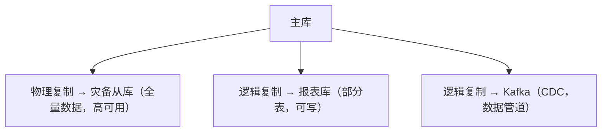

## 1. 复制概述

### 1.1 两种复制模型

```
物理复制:  复制 WAL（Write-Ahead Log）字节流 → 从库重放 WAL
逻辑复制:  解码 WAL 为逻辑变更 → 从库执行等价 SQL
```

### 1.2 核心对比

| 维度       | 物理复制     | 逻辑复制                         |
| ---------- | ------------ | -------------------------------- |
| 复制单位   | WAL 字节流   | 逻辑变更（INSERT/UPDATE/DELETE） |
| 粒度       | 整个实例     | 表级 / 行级                      |
| 从库可写   | 否（只读）   | 是                               |
| 版本要求   | 主从版本一致 | 可跨版本                         |
| 平台要求   | 主从平台一致 | 可跨平台                         |
| DDL 复制   | 自动         | 不支持（需手动）                 |
| 延迟       | 极低         | 较低                             |
| 数据一致性 | 字节级一致   | 逻辑一致                         |

## 2. 物理复制（流复制）

### 2.1 流复制架构


### 2.2 流复制配置

```ini
# 主库 postgresql.conf
wal_level = replica
max_wal_senders = 10
wal_keep_size = 1GB
hot_standby = on
synchronous_standby_names = 'standby1'

# 主库 pg_hba.conf（推荐 scram-sha-256, PG 18 起 md5 已弃用）
host replication replicator 192.168.1.0/24 scram-sha-256

# 从库 postgresql.conf
hot_standby = on
primary_conninfo = 'host=primary port=5432 user=replicator password=xxx'
```

### 2.3 同步模式

| 模式     | 配置                                | 数据安全   | 性能 |
| -------- | ----------------------------------- | ---------- | ---- |
| 异步     | `synchronous_commit = off`          | 可能丢数据 | 最高 |
| 本地     | `synchronous_commit = local`        | 主库确认   | 高   |
| 远程写   | `synchronous_commit = remote_write` | 从库OS缓存 | 中   |
| 同步提交 | `synchronous_commit = on`（默认）   | 从库已刷盘 | 低   |
| 远程应用 | `synchronous_commit = remote_apply` | 从库已回放 | 最低 |

注意: 取值中不存在 `remote_flush`, "等待从库刷盘"的语义由默认值 `on` 承担。

### 2.4 级联复制

```
Primary → Standby1 → Standby2 → Standby3

Standby2 从 Standby1 接收 WAL，减轻主库负担
```

```ini
-- 级联从库配置
primary_conninfo = 'host=standby1 port=5432 ...'
```

## 3. 逻辑复制

### 3.1 逻辑复制架构


发布端：PUBLICATION（定义要发布的表）；订阅端：SUBSCRIPTION（定义从哪个发布端订阅）

### 3.2 发布订阅配置

```sql
-- 发布端：创建发布
CREATE PUBLICATION my_pub FOR TABLE
    users, orders, products;

-- 只发布特定操作
CREATE PUBLICATION insert_only FOR TABLE
    audit_log WITH (publish = 'insert');

-- 订阅端：创建订阅
CREATE SUBSCRIPTION my_sub
    CONNECTION 'host=publisher port=5432 dbname=mydb user=replicator password=xxx'
    PUBLICATION my_pub;

-- 查看订阅状态
SELECT * FROM pg_stat_subscription;
```

### 3.3 行过滤（PostgreSQL 15+）

```sql
-- 只发布满足条件的行
CREATE PUBLICATION active_users FOR TABLE users
    WHERE (status = 'active');

CREATE PUBLICATION regional_orders FOR TABLE orders
    WHERE (region = 'east');
```

### 3.4 列过滤（PostgreSQL 15+）

```sql
-- 只发布指定列
CREATE PUBLICATION user_basic FOR TABLE users (id, name, email);
```

## 4. 逻辑解码

### 4.1 逻辑解码原理

```
WAL 字节流 → 逻辑解码插件 → 逻辑变更消息

WAL: [INSERT tuple at page 42 offset 7]
  ↓ pgoutput 插件
逻辑消息: INSERT INTO users (id, name) VALUES (1, 'Alice')
```

### 4.2 输出插件

| 插件          | 格式            | 用途          |
| ------------- | --------------- | ------------- |
| pgoutput      | PostgreSQL 原生 | 逻辑复制      |
| wal2json      | JSON            | CDC、数据同步 |
| test_decoding | 文本            | 测试调试      |
| pglogical     | 自定义          | BDR 扩展      |

### 4.3 使用 wal2json 进行 CDC

```sql
-- 创建逻辑复制槽
SELECT pg_create_logical_replication_slot('cdc_slot', 'wal2json');

-- 消费变更
SELECT * FROM pg_logical_slot_peek_changes('cdc_slot', NULL, NULL);

-- 输出示例
{
  "change": [
    {
      "kind": "insert",
      "schema": "public",
      "table": "users",
      "columnnames": ["id", "name"],
      "columntypes": ["integer", "text"],
      "columnvalues": [1, "Alice"]
    }
  ]
}
```

## 5. 场景选择

### 5.1 物理复制适用场景

- **高可用**：自动 Failover（Patroni、repmgr）
- **读扩展**：从库分担只读查询
- **灾备**：异地容灾
- **备份**：从库执行物理备份

### 5.2 逻辑复制适用场景

- **部分表同步**：只复制核心业务表
- **跨版本升级**：零停机升级
- **多主写入**：双向复制（需冲突解决）
- **数据分发**：将数据分发到不同系统
- **CDC**：变更数据捕获，同步到 Kafka/ES

### 5.3 混合方案



## 6. 常见问题与解决

### 6.1 逻辑复制冲突

```sql
-- 订阅端应用变更可能与本地数据冲突
-- 错误: duplicate key value violates unique constraint
-- 冲突后该订阅的 apply worker 会停止重试, 需人工介入

-- 解决方案1: 修好冲突数据后, 跳过出错的那个事务（按日志给出的 LSN）
ALTER SUBSCRIPTION my_sub SKIP (lsn = '0/12345678');

-- 解决方案2: 应用层保证不写冲突数据
-- 发布端和订阅端操作不同的行（如按租户或主键范围划分）

-- 解决方案3: 监控订阅状态, 订阅停止时告警
SELECT subname, pid, latest_end_time
FROM pg_stat_subscription
WHERE pid IS NULL;   -- pid 为 NULL 说明 apply worker 已停止
```

### 6.2 大事务延迟

```sql
-- 大事务默认需在订阅端完整接收后才应用
-- PG 14+ 支持流式应用（边接收边应用）:
ALTER SUBSCRIPTION my_sub SET (streaming = 'on');
-- PG 15+ 可用 streaming = 'parallel' 由多个并行 worker 流式应用大事务
-- PG 18 起 CREATE SUBSCRIPTION 默认即为 streaming = 'parallel'
```

### 6.3 DDL 同步

```sql
-- 逻辑复制不复制 DDL
-- 需要手动在发布端和订阅端执行

-- 发布端
ALTER TABLE users ADD COLUMN phone VARCHAR(20);

-- 订阅端（必须手动执行）
ALTER TABLE users ADD COLUMN phone VARCHAR(20);
```
