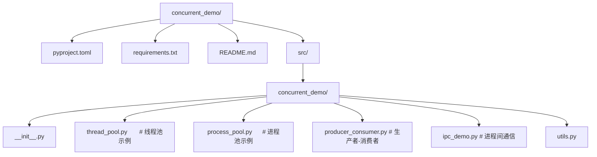
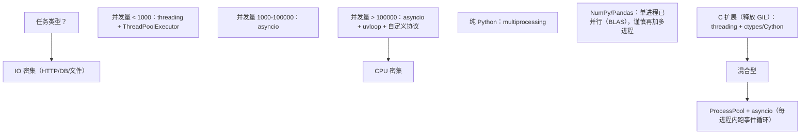
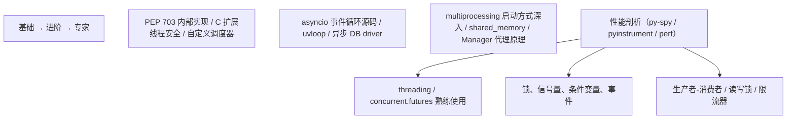

## 前置知识

- [Python 与 SQLAlchemy](/python/012-PythonSQLAlchemy)：建议先完成前一篇的学习

## 学习目标

- 掌握「1. 历史动机与发展脉络」的核心机制、典型用法与常见陷阱
- 掌握「2. 形式化定义」的核心机制、典型用法与常见陷阱
- 掌握「3. 理论推导与原理解析」的核心机制、典型用法与常见陷阱
- 掌握「4. 代码示例（企业级 production-ready）」的核心机制、典型用法与常见陷阱
- 掌握「5. 对比分析」的核心机制、典型用法与常见陷阱


## 1. 历史动机与发展脉络

### 1.1 早期单核时代（Python 0.9 – 1.x，1991–2000）

Python 诞生于 1991 年，Guido van Rossum 在 CWI（荷兰国家数学与计算机科学研究所）设计之初，就将"简洁性优于性能"作为核心理念。当时的硬件主流仍是单核处理器，操作系统对线程的支持尚未成熟（Windows NT 3.1 直到 1993 年才正式发布，LinuxThreads 1996 年才合入内核），Python 0.9 至 1.5 仅支持通过 `os.fork()` 在 Unix 上创建进程，并未提供原生线程抽象。

### 1.2 GIL 的诞生（Python 1.5，1997）

1997 年发布的 Python 1.5 引入了 `thread` 模块（后重命名为 `_thread`），首次支持多线程编程。然而 CPython 的内存管理基于**引用计数**（reference counting），每个 Python 对象内部维护一个 `ob_refcnt` 字段，多线程并发修改该字段将导致竞态条件（race condition）。当时无锁原子操作（如 CAS）在跨平台支持上不完善，Guido 选择了一个简洁而具争议的方案：在解释器层面引入一把全局互斥锁——**GIL**。

GIL 的核心规则：**任一时刻，仅允许一个线程在 CPython 解释器中执行 Python 字节码**。这一决策带来了三个深远影响：

1. 简化了 C 扩展的编写，无需考虑细粒度锁；
2. 牺牲了多核 CPU 上的并行计算能力；
3. 使 Python 在 IO 密集型场景仍能通过线程切换获得并发收益。

### 1.3 threading 模块（Python 2.0，2000）

Python 2.0 引入 `threading` 模块，提供面向对象的高级线程 API，模仿 Java 的 `java.lang.Thread` 设计，包含 `Thread`、`Lock`、`RLock`、`Condition`、`Event`、`Semaphore`、`Timer` 等原语。同一时期 `Queue` 模块（Python 2.4 起标准库）提供了线程安全的 FIFO/LIFO/Priority 队列，成为生产者-消费者模式的标准基础设施。

### 1.4 multiprocessing 模块（Python 2.6，2008）

随着多核 CPU 在 2005 年后普及，GIL 成为 CPU 密集型任务的瓶颈。PEP 371 在 Python 2.6 引入了 `multiprocessing` 模块，由 Jesse Noller 实现，通过进程级隔离绕过 GIL。该模块的 API 设计刻意与 `threading` 对齐，降低了迁移成本：

| `threading`         | `multiprocessing`   |
| ------------------- | ------------------- |
| `Thread`            | `Process`           |
| `Lock`              | `Lock`              |
| `RLock`             | `RLock`             |
| `Condition`         | `Condition`         |
| `Semaphore`         | `Semaphore`         |
| `queue.Queue`       | `multiprocessing.Queue` |

### 1.5 concurrent.futures（Python 3.2，2011）

PEP 3148 在 Python 3.2 引入 `concurrent.futures`，由 Brian Quinlan 设计，提供统一的 `Executor` 抽象，将线程池与进程池的 API 收敛为 `submit`/`map`/`shutdown` 三件套。这是 Python 并发 API 设计史上的重要里程碑，确立了"任务（callable）→ 执行器（executor）→ 未来（future）"三层解耦模型。

### 1.6 asyncio 的崛起（Python 3.4–3.12，2014–2024）

PEP 3156（Python 3.4）引入 `asyncio`，标志着 Python 在 IO 密集型场景从"多线程切换"转向"协程调度"范式。`asyncio` 与 `multiprocessing` 形成互补：前者用单线程事件循环处理海量并发连接，后者用多进程榨干 CPU 多核。

### 1.7 GIL 的黄昏（Python 3.13+，2024–）

PEP 703（2023 年 10 月）正式提议**移除 GIL**，使 CPython 支持真正的多线程并行执行。Sam Gross 的 nogil 分支被合入 main 分支（experimental build）。Python 3.13（2024 年 10 月发布）首次提供 `--disable-gil` 编译选项，Python 3.14+（2025）将其作为可配置特性。这一变革将重塑 Python 并发编程生态，本章节第 11 节将专门讨论其影响。

### 1.8 设计哲学总结

Guido van Rossum 在多次访谈中强调 Python 的并发设计遵循以下哲学：

> "I'd rather have a simple, correct, single-threaded program than a fast but buggy multi-threaded one. Concurrency should be opt-in, not opt-out."
>
> —— Guido van Rossum, PyCon 2015 Keynote

这一哲学解释了为什么 Python 选择 GIL 而非细粒度锁，为什么 `multiprocessing` 模仿 `threading` API 而非发明新范式，以及为什么 `asyncio` 在 Python 3.4 才合入——技术成熟度与社区共识必须先于语言特性。

---

## 2. 形式化定义

### 2.1 进程与线程的形式化模型

#### 2.1.1 进程（Process）

进程是操作系统资源分配和保护的基本单位。形式化地，一个进程 $P$ 可表示为七元组：

$$
P = \langle \text{PID}, \text{AS}, \text{FD}, \text{PC}, \text{RS}, \text{Sec}, \text{Env} \rangle
$$

其中：

- $\text{PID}$：进程标识符（Process ID），操作系统范围内唯一。
- $\text{AS}$：地址空间（Address Space），包含代码段 `.text`、数据段 `.data`、堆 `heap`、栈 `stack`。
- $\text{FD}$：文件描述符表（File Descriptor Table）。
- $\text{PC}$：程序计数器（Program Counter），指向下一条指令地址。
- $\text{RS}$：寄存器集合（Register Set），含通用寄存器与状态字。
- $\text{Sec}$：安全上下文（uid、gid、capabilities）。
- $\text{Env}$：环境变量与工作目录。

#### 2.1.2 线程（Thread）

线程是 CPU 调度的基本单位，同一进程内的线程共享 $\text{AS}$、$\text{FD}$、$\text{Sec}$、$\text{Env}$，但拥有独立的 $\text{PC}$、$\text{RS}$ 与栈空间。线程 $T$ 可表示为四元组：

$$
T = \langle \text{TID}, \text{PC}, \text{RS}, \text{Stack} \rangle
$$

#### 2.1.3 上下文切换成本

设进程切换成本为 $C_p$，线程切换成本为 $C_t$，则有：

$$
C_p = C_t + C_{TLB} + C_{cache}
$$

其中 $C_{TLB}$ 为 TLB（Translation Lookaside Buffer）失效重建成本，$C_{cache}$ 为 CPU cache 失效重建成本。典型值（x86-64 Linux）：

$$
C_t \approx 1\text{-}2\,\mu s, \quad C_p \approx 5\text{-}10\,\mu s
$$

### 2.2 GIL 的形式化语义

GIL 可建模为一个二元信号量 $\text{GIL} \in \{0, 1\}$，初始值为 1。任一线程 $T_i$ 执行 Python 字节码前必须执行 $\text{P}(\text{GIL})$（即 `acquire`），执行完毕或达到 `sys.setswitchinterval()`（默认 $5\,ms$）时执行 $\text{V}(\text{GIL})$（即 `release`）。

$$
\text{Execute}(T_i) \triangleq \text{P}(\text{GIL}); \; \text{run\_bytecode}(T_i); \; \text{V}(\text{GIL})
$$

CPython 3.2+ 采用**带有时间片的抢占式 GIL**：持有 GIL 的线程在以下情况释放：

1. **时间片到期**：每 `sys.setswitchinterval(seconds)` 秒检查一次，到期后让出 GIL。
2. **IO 阻塞**：执行阻塞式系统调用（如 `read`、`recv`）前主动释放。
3. **C 扩展显式释放**：通过 `Py_BEGIN_ALLOW_THREADS` / `Py_END_ALLOW_THREADS` 宏显式释放。

### 2.3 Amdahl 定律与多进程加速比

设任务中可并行部分占比为 $p$，处理器数为 $N$，则加速比 $S(N)$ 满足 Amdahl 定律：

$$
S(N) = \frac{1}{(1-p) + \frac{p}{N}}
$$

理论极限（$N \to \infty$）：

$$
S_{\infty} = \frac{1}{1-p}
$$

对于 GIL 约束下的多线程 CPU 密集型任务，$p \to 0$，故 $S(N) \approx 1$。而对于 `multiprocessing`，理论上 $p \to 1$，但受 IPC（进程间通信）开销与序列化成本影响，实际加速比通常低于理论值。

### 2.4 进程间通信的复杂度

`multiprocessing.Queue` 基于 POSIX 管道 + pickle 序列化。设单次 IPC 延迟为 $L$，消息大小为 $M$ 字节，序列化/反序列化吞吐率为 $B$ 字节/秒，则单次消息总延迟：

$$
T_{\text{ipc}} = L + \frac{M}{B}
$$

经验值（x86-64 Linux，本地 IPC）：$L \approx 10\,\mu s$，$B \approx 500\,\text{MB/s}$（pickle 协议 5）。这意味着传递 1KB 数据耗时约 $12\,\mu s$，传递 1MB 数据耗时约 $2\,ms$。在设计多进程 pipeline 时应**最大化消息粒度**，避免高频小消息。

---

## 3. 理论推导与原理解析

### 3.1 GIL 的字节码视角

考虑以下代码：

```python
# Python 3.12
counter = 0

def increment():
    global counter
    for _ in range(1_000_000):
        counter += 1
```

使用 `dis` 反汇编 `increment` 的核心循环：

```
>>> dis.dis(increment)
  4           0 LOAD_GLOBAL              1 (NULL + counter)
              2 LOAD_CONST               2 (1)
              4 BINARY_OP               13 (+=)
              6 STORE_GLOBAL             1 (counter)
              8 ...
```

`counter += 1` 展开为 `LOAD_GLOBAL` → `LOAD_CONST` → `BINARY_OP` → `STORE_GLOBAL` 共 4 条字节码。GIL 在这 4 条字节码之间**不会释放**（因为每条字节码是原子的），但**整个 `+=` 操作不是原子的**——GIL 可能在 `BINARY_OP` 后、`STORE_GLOBAL` 前切换线程，导致更新丢失。

#### 3.1.1 数学证明：竞态导致丢失更新

设两个线程并发执行 $N$ 次 `counter += 1`，初始 `counter = 0`。理论结果应为 $2N$。实际结果 $X$ 满足：

$$
X = 2N - k, \quad k \in [0, N]
$$

其中 $k$ 为丢失更新次数。$k > 0$ 的充要条件是存在某一时刻，两个线程的 `LOAD_GLOBAL` 读取到相同的旧值，随后各自 `STORE_GLOBAL` 写回，造成一次丢失。由 Ballot-box 问题（boxed-ballot problem），当 $N \to \infty$ 时 $P(k = 0) \to 0$。

#### 3.1.2 锁的正确性证明

使用 `threading.Lock` 后：

```python
from threading import Lock

counter = 0
lock = Lock()

def increment():
    global counter
    for _ in range(1_000_000):
        with lock:
            counter += 1
```

锁保证了临界区（critical section）的**互斥性**（mutual exclusion）与**进展性**（progress），由 Lamport 面包店算法的互斥性证明可直接推导。

### 3.2 多进程的内存模型

`multiprocessing.Process` 在 Linux 上默认使用 `fork()`，子进程获得父进程地址空间的**写时复制**（Copy-on-Write, CoW）副本。这意味着：

1. 子进程可以**只读**访问父进程的所有对象，无需序列化。
2. 一旦子进程修改某对象，内核触发 page fault，复制该页。
3. Python 引用计数的修改会触发 CoW，导致"看似只读"的遍历操作也会复制大量内存页。

#### 3.2.1 CoW 失效的引用计数问题

设父进程创建了一个包含 $n$ 个元素的列表 `L`，每个元素是一个 Python 对象。子进程 `fork()` 后，若仅遍历 `L`（不修改），理论上不会触发 CoW。然而 CPython 的 `for x in L:` 语义等价于：

```
iter = L.__iter__()
while True:
    x = iter.__next__()  # 内部执行 Py_INCREF(x)
    ...
```

`Py_INCREF(x)` 修改了 `x->ob_refcnt`，触发 CoW。这是 Python `fork()` 模型相对于 C `fork()` 的关键差异。

#### 3.2.2 解决方案：spawn 与 forkserver

Python 3.4+ 引入 `spawn` 启动方式（macOS 3.8+ 默认，Windows 一直默认）：子进程**不继承父进程内存**，而是重新启动 Python 解释器，仅序列化必要的参数。这避免了 CoW 引用计数问题，但牺牲了启动速度。

### 3.3 线程池的任务调度模型

`ThreadPoolExecutor` 内部维护一个工作线程队列与一个任务队列（`collections.deque`）。调度遵循 **FIFO** 规则：

$$
\text{Worker}_i \leftarrow \text{Queue.pop\_left}(), \quad i \in [1, N]
$$

当工作线程数 $W < \text{max\_workers}$ 且队列非空时，创建新线程；当线程空闲超过一定时间，回收线程。这一模型称为 **dynamic thread pool with bounded size**。

#### 3.3.1 最优线程数推导

对于 IO 密集型任务，最优线程数 $N^*$ 由 Little 定律推导：

$$
N^* = \lambda \cdot W
$$

其中 $\lambda$ 为任务到达率（tasks/sec），$W$ 为单任务平均等待时间（包括 IO 等待）。经验公式：

$$
N^* = N_{\text{cpu}} \cdot (1 + \frac{W_{\text{io}}}{W_{\text{cpu}}})
$$

例如 4 核 CPU、IO 等待 100ms、CPU 计算 10ms：$N^* = 4 \times (1 + 10) = 44$ 线程。

对于 CPU 密集型任务（多进程场景），$N^* = N_{\text{cpu}}$，超出后反而因上下文切换降低吞吐。

### 3.4 死锁的 Coffman 条件

死锁（deadlock）发生的充要条件由 Coffman（1971）给出四条：

1. **互斥**（Mutual Exclusion）：资源不可共享。
2. **持有并等待**（Hold and Wait）：线程持有资源同时等待新资源。
3. **不可剥夺**（No Preemption）：资源只能由持有者主动释放。
4. **循环等待**（Circular Wait）：存在线程等待环 $T_1 \to T_2 \to \dots \to T_1$。

破坏任一条件即可避免死锁。Python `threading.RLock`（可重入锁）通过同一线程可多次 acquire 破坏"持有并等待"，但代价是增加锁开销。

---

## 4. 代码示例（企业级 production-ready）

### 4.1 项目结构



### 4.2 pyproject.toml

```toml
[project]
name = "concurrent-demo"
version = "0.1.0"
description = "Python 多进程与多线程企业级示例"
requires-python = ">=3.10"
authors = [{ name = "FANDEX Team" }]
dependencies = [
    "httpx>=0.27.0",
    "tenacity>=8.2.0",
    "rich>=13.7.0",
]

[project.optional-dependencies]
dev = [
    "pytest>=7.4",
    "pytest-benchmark>=4.0",
    "ruff>=0.5.0",
    "mypy>=1.10",
]

[tool.ruff]
line-length = 100
target-version = "py310"

[tool.ruff.lint]
select = ["E", "F", "I", "N", "UP", "B", "C4", "SIM"]

[tool.mypy]
strict = true
```

### 4.3 requirements.txt

```
httpx==0.27.0
tenacity==8.2.3
rich==13.7.1
```

### 4.4 线程池：并发 HTTP 抓取器（Python 3.12）

```python
"""
线程池并发 HTTP 抓取器
- 支持超时、重试、限流
- 线程安全的结果聚合
- 优雅退出
Python: 3.10+
"""
from __future__ import annotations

import logging
import threading
import time
from concurrent.futures import ThreadPoolExecutor, as_completed
from dataclasses import dataclass, field
from typing import Any

import httpx
from rich.logging import RichHandler
from tenacity import (
    retry,
    retry_if_exception_type,
    stop_after_attempt,
    wait_exponential,
)

# 配置 rich 日志
logging.basicConfig(
    level=logging.INFO,
    format="%(message)s",
    datefmt="[%X]",
    handlers=[RichHandler(rich_tracebacks=True)],
)
logger = logging.getLogger(__name__)

@dataclass(slots=True, frozen=True)
class FetchResult:
    """抓取结果：不可变数据类，线程安全。"""

    url: str
    status: int
    elapsed_ms: float
    body_size: int
    error: str | None = None

@dataclass
class FetchStats:
    """聚合统计：使用 Lock 保护可变状态。"""

    total: int = 0
    success: int = 0
    failed: int = 0
    total_bytes: int = 0
    _lock: threading.Lock = field(default_factory=threading.Lock, repr=False)

    def record(self, result: FetchResult) -> None:
        """线程安全地记录单次抓取结果。"""
        with self._lock:
            self.total += 1
            if result.error is None and result.status == 200:
                self.success += 1
                self.total_bytes += result.body_size
            else:
                self.failed += 1

class TokenBucket:
    """
    令牌桶限流器：线程安全。
    数学模型：桶容量 C，速率 r tokens/sec。
    每次请求消耗 1 token。
    """

    def __init__(self, rate: float, capacity: int) -> None:
        self.rate = rate
        self.capacity = capacity
        self._tokens = float(capacity)
        self._last = time.monotonic()
        self._lock = threading.Lock()

    def acquire(self, timeout: float = 30.0) -> bool:
        """阻塞直到获取令牌或超时。"""
        deadline = time.monotonic() + timeout
        while True:
            with self._lock:
                now = time.monotonic()
                elapsed = now - self._last
                self._tokens = min(self.capacity, self._tokens + elapsed * self.rate)
                self._last = now
                if self._tokens >= 1.0:
                    self._tokens -= 1.0
                    return True
                wait = (1.0 - self._tokens) / self.rate
            if time.monotonic() + wait > deadline:
                return False
            time.sleep(min(wait, 0.5))

def fetch_one(
    client: httpx.Client,
    url: str,
    limiter: TokenBucket,
) -> FetchResult:
    """抓取单个 URL，带重试与限流。"""

    @retry(
        stop=stop_after_attempt(3),
        wait=wait_exponential(multiplier=0.5, max=5),
        retry=retry_if_exception_type((httpx.TimeoutException, httpx.NetworkError)),
        reraise=True,
    )
    def _do_fetch() -> FetchResult:
        if not limiter.acquire(timeout=10):
            return FetchResult(url, 0, 0, 0, error="rate_limited")
        start = time.perf_counter()
        r = client.get(url, timeout=10)
        elapsed = (time.perf_counter() - start) * 1000
        return FetchResult(url, r.status_code, elapsed, len(r.content))

    try:
        return _do_fetch()
    except Exception as exc:
        logger.warning("fetch %s failed: %s", url, exc)
        return FetchResult(url, 0, 0, 0, error=str(exc))

def fetch_all(urls: list[str], max_workers: int = 16) -> tuple[list[FetchResult], FetchStats]:
    """
    并发抓取所有 URL。
    返回结果列表与聚合统计。
    """
    stats = FetchStats()
    results: list[FetchResult] = []
    results_lock = threading.Lock()
    limiter = TokenBucket(rate=50.0, capacity=100)  # 50 req/s, 突发 100

    # 共享 Client：连接池复用
    with httpx.Client(
        headers={"User-Agent": "FANDEX-Crawler/1.0"},
        limits=httpx.Limits(max_connections=max_workers, max_keepalive_connections=max_workers),
    ) as client:
        with ThreadPoolExecutor(max_workers=max_workers, thread_name_prefix="fetch") as pool:
            futures = {pool.submit(fetch_one, client, u, limiter): u for u in urls}
            for future in as_completed(futures):
                res = future.result()
                with results_lock:
                    results.append(res)
                stats.record(res)
                logger.info(
                    "[%d/%d] %s -> %d (%.1fms, %dB)",
                    stats.total, len(urls), res.url, res.status, res.elapsed_ms, res.body_size,
                )

    return results, stats

if __name__ == "__main__":
    urls = [f"https://httpbin.org/delay/{i % 3}" for i in range(50)]
    start = time.perf_counter()
    results, stats = fetch_all(urls, max_workers=16)
    elapsed = time.perf_counter() - start
    logger.info(
        "done: %d success, %d failed, %.2fMB total, %.2fs elapsed, %.1f req/s",
        stats.success,
        stats.failed,
        stats.total_bytes / 1024 / 1024,
        elapsed,
        stats.total / elapsed,
    )
```

### 4.5 进程池：CPU 密集型数据预处理（Python 3.12）

```python
"""
进程池：CPU 密集型任务示例
- 蒙特卡洛估算 π
- 使用 ProcessPoolExecutor
- 共享内存优化
Python: 3.10+
"""
from __future__ import annotations

import math
import os
import random
import time
from concurrent.futures import ProcessPoolExecutor, as_completed
from multiprocessing import shared_memory
from typing import Iterator

import numpy as np

def monte_carlo_pi_chunk(n_samples: int, seed: int) -> int:
    """
    在单个进程内估算 π：返回落在单位圆内的点数。
    每个 chunk 独立，避免 GIL 竞争。
    """
    rng = random.Random(seed)
    inside = 0
    for _ in range(n_samples):
        x, y = rng.random(), rng.random()
        if x * x + y * y <= 1.0:
            inside += 1
    return inside

def monte_carlo_pi_numpy(n_samples: int, seed: int) -> int:
    """NumPy 向量化版本：比纯 Python 快 50-100 倍。"""
    rng = np.random.default_rng(seed)
    x = rng.random(n_samples)
    y = rng.random(n_samples)
    return int(np.sum(x * x + y * y <= 1.0))

def estimate_pi(total_samples: int, n_workers: int | None = None) -> float:
    """
    多进程估算 π。
    数学原理：π ≈ 4 * (圆内点数 / 总点数)
    """
    n_workers = n_workers or os.cpu_count() or 4
    chunk = total_samples // n_workers

    with ProcessPoolExecutor(max_workers=n_workers) as pool:
        futures = [
            pool.submit(monte_carlo_pi_numpy, chunk, 42 + i)
            for i in range(n_workers)
        ]
        total_inside = sum(f.result() for f in as_completed(futures))

    return 4.0 * total_inside / total_samples

def shared_memory_demo() -> None:
    """使用 shared_memory 在进程间共享大数组，避免 pickle 开销。"""
    arr = np.arange(10_000_000, dtype=np.float64)  # 80MB
    shm = shared_memory.SharedMemory(create=True, size=arr.nbytes)
    try:
        # 父进程写入
        shared = np.ndarray(arr.shape, dtype=arr.dtype, buffer=shm.buf)
        shared[:] = arr[:]

        # 子进程读取（零拷贝）
        def worker(name: str) -> float:
            existing = shared_memory.SharedMemory(name=name)
            try:
                view = np.ndarray(arr.shape, dtype=arr.dtype, buffer=existing.buf)
                return float(view.sum())
            finally:
                existing.close()

        with ProcessPoolExecutor(max_workers=4) as pool:
            futures = [pool.submit(worker, shm.name) for _ in range(4)]
            results = [f.result() for f in as_completed(futures)]
        print(f"shared memory sum: {results[0]:.0f}")
    finally:
        shm.close()
        shm.unlink()

if __name__ == "__main__":
    n = 10_000_000
    t0 = time.perf_counter()
    pi_est = estimate_pi(n)
    t1 = time.perf_counter()
    print(f"π ≈ {pi_est:.6f} (error: {abs(pi_est - math.pi):.6f})")
    print(f"elapsed: {t1 - t0:.2f}s, speedup vs single-thread ≈ {estimate_single(n) / (t1 - t0):.1f}x")
```

### 4.6 生产者-消费者模型（Python 3.11）

```python
"""
生产者-消费者模型
- 使用 threading + queue.Queue
- 优雅退出（poison pill 模式）
- 背压控制（maxsize）
Python: 3.10+
"""
from __future__ import annotations

import logging
import random
import threading
import time
from dataclasses import dataclass
from queue import Empty, Queue
from typing import NoReturn

logger = logging.getLogger(__name__)

POISON_PILL = None  # 哨兵值：消费者收到后退出

@dataclass
class Job:
    job_id: int
    payload: bytes

def producer(q: Queue[Job | None], n: int, name: str) -> None:
    """生产者：生成 n 个任务后投入哨兵。"""
    for i in range(n):
        job = Job(job_id=i, payload=f"task-{i}".encode())
        q.put(job)  # 队列满时阻塞，实现背压
        logger.info("[%s] produced job %d", name, i)
        time.sleep(random.uniform(0.01, 0.05))
    q.put(POISON_PILL)
    logger.info("[%s] producer done", name)

def consumer(q: Queue[Job | None], name: str) -> None:
    """消费者：从队列取任务处理，收到哨兵后退出。"""
    while True:
        try:
            item = q.get(timeout=5)
        except Empty:
            logger.warning("[%s] timeout, exiting", name)
            return
        if item is POISON_PILL:
            q.put(POISON_PILL)  # 传播哨兵给其他消费者
            logger.info("[%s] consumer exit", name)
            return
        # 模拟处理
        time.sleep(random.uniform(0.02, 0.08))
        logger.info("[%s] consumed job %d", name, item.job_id)
        q.task_done()

def main() -> None:
    q: Queue[Job | None] = Queue(maxsize=100)
    n_producers, n_consumers = 2, 4
    producers = [
        threading.Thread(target=producer, args=(q, 50, f"P{i}"), name=f"Producer-{i}")
        for i in range(n_producers)
    ]
    consumers = [
        threading.Thread(target=consumer, args=(q, f"C{i}"), name=f"Consumer-{i}")
        for i in range(n_consumers)
    ]
    for t in producers + consumers:
        t.start()
    for t in producers:
        t.join()
    for t in consumers:
        t.join()
    logger.info("all done")

if __name__ == "__main__":
    logging.basicConfig(level=logging.INFO, format="%(asctime)s [%(threadName)s] %(message)s")
    main()
```

### 4.7 进程间通信：Pipe 与 Queue（Python 3.12）

```python
"""
multiprocessing 进程间通信示例
- Pipe：双向管道，仅适用 1-to-1
- Queue：多生产者多消费者
- Value/Array：共享内存（C 类型）
- Manager：代理对象（list/dict/Namespace）
Python: 3.10+
"""
from __future__ import annotations

import multiprocessing as mp
import os
import time
from multiprocessing.managers import SyncManager
from typing import Any

def pipe_worker(conn: mp.Pipe.Connection, name: str) -> None:
    """通过 Pipe 接收消息，回复确认。"""
    while True:
        msg = conn.recv()
        if msg == "STOP":
            conn.send(f"{name}: bye")
            conn.close()
            return
        conn.send(f"{name}: got {msg!r}")
        time.sleep(0.1)

def queue_producer(q: mp.Queue, items: list[Any]) -> None:
    for x in items:
        q.put(x)
    q.put(None)  # 哨兵

def queue_consumer(q: mp.Queue, result: list[Any]) -> None:
    while True:
        x = q.get()
        if x is None:
            return
        result.append(x * 2)

def shared_value_demo(v: mp.Value, lock: mp.Lock) -> None:
    """使用 Value + Lock 实现原子计数。"""
    with lock:
        v.value += 1

def manager_worker(d: dict, key: str, val: int) -> None:
    """Manager 代理的 dict：跨进程共享。"""
    d[key] = val
    time.sleep(0.1)

def main() -> None:
    # 1. Pipe
    parent_conn, child_conn = mp.Pipe()
    p = mp.Process(target=pipe_worker, args=(child_conn, "Worker-A"))
    p.start()
    parent_conn.send("hello")
    print(parent_conn.recv())
    parent_conn.send("STOP")
    print(parent_conn.recv())
    p.join()

    # 2. Queue
    q: mp.Queue = mp.Queue()
    items = list(range(10))
    producer = mp.Process(target=queue_producer, args=(q, items))
    result: list[Any] = []
    consumer = mp.Process(target=queue_consumer, args=(q, result))
    consumer.start()
    producer.start()
    producer.join()
    consumer.join()
    print(f"queue result: {result}")

    # 3. Value + Lock
    v = mp.Value("i", 0)
    lock = mp.Lock()
    procs = [mp.Process(target=shared_value_demo, args=(v, lock)) for _ in range(100)]
    for p in procs:
        p.start()
    for p in procs:
        p.join()
    print(f"final value: {v.value} (expected 100)")

    # 4. Manager
    with mp.Manager() as manager:
        shared_dict = manager.dict()
        procs = [
            mp.Process(target=manager_worker, args=(shared_dict, f"k{i}", i))
            for i in range(5)
        ]
        for p in procs:
            p.start()
        for p in procs:
            p.join()
        print(f"manager dict: {dict(shared_dict)}")

if __name__ == "__main__":
    mp.set_start_method("spawn", force=True)  # 跨平台兼容
    main()
```

### 4.8 完整基准测试：threading vs multiprocessing vs asyncio

```python
"""
基准测试：三种并发模型对比
任务：CPU 密集（计算斐波那契）+ IO 密集（模拟 sleep）
"""
from __future__ import annotations

import asyncio
import time
from concurrent.futures import ThreadPoolExecutor, ProcessPoolExecutor
from typing import Callable

def fib(n: int) -> int:
    a, b = 0, 1
    for _ in range(n):
        a, b = b, a + b
    return a

def cpu_task(n: int = 100_000) -> int:
    return fib(n)

async def io_task(delay: float = 0.1) -> None:
    await asyncio.sleep(delay)

def benchmark(name: str, fn: Callable[[], Any], n: int = 10) -> float:
    start = time.perf_counter()
    fn()
    elapsed = time.perf_counter() - start
    print(f"{name:>20s}: {elapsed:.3f}s for {n} tasks")
    return elapsed

def run_sequential(n: int) -> None:
    for _ in range(n):
        cpu_task(50_000)

def run_thread_pool(n: int) -> None:
    with ThreadPoolExecutor(max_workers=8) as pool:
        list(pool.map(cpu_task, [50_000] * n))

def run_process_pool(n: int) -> None:
    with ProcessPoolExecutor(max_workers=8) as pool:
        list(pool.map(cpu_task, [50_000] * n))

async def run_asyncio(n: int) -> None:
    await asyncio.gather(*[io_task(0.1) for _ in range(n)])

def run_asyncio_sync(n: int) -> None:
    asyncio.run(run_asyncio(n))

if __name__ == "__main__":
    N = 20
    benchmark("Sequential CPU", lambda: run_sequential(N))
    benchmark("ThreadPool CPU", lambda: run_thread_pool(N))   # 因 GIL，几乎无加速
    benchmark("ProcessPool CPU", lambda: run_process_pool(N)) # 真正并行
    benchmark("Sequential IO", lambda: [time.sleep(0.1) for _ in range(N)])
    benchmark("ThreadPool IO", lambda: ThreadPoolExecutor(max_workers=N).map(lambda _: time.sleep(0.1), range(N)) and None)
    benchmark("asyncio IO", lambda: run_asyncio_sync(N))
```

---

## 5. 对比分析

### 5.1 与 JavaScript (Node.js) 对比

| 维度 | Python `threading` | Python `multiprocessing` | Node.js Worker Threads | Node.js Cluster |
| ---- | ------------------ | ------------------------ | ---------------------- | --------------- |
| 并发模型 | OS 线程 + GIL | OS 进程 | OS 线程（V8 隔离） | OS 进程 |
| 内存共享 | 全部共享 | 不共享（仅 IPC） | SharedArrayBuffer | 不共享（IPC via IPC channel） |
| CPU 并行 | 不支持 受 GIL 限制 | 已达标 | 已达标 | 已达标 |
| IO 并行 | 已达标（释放 GIL） | 已达标 | 已达标（事件循环） | 已达标 |
| 启动开销 | 低（~1ms） | 高（~50ms） | 中（~10ms） | 高（~50ms） |
| 通信方式 | 共享变量+锁 | Queue/Pipe/Manager | postMessage / SAB | IPC channel |
| 默认推荐 | IO 密集 | CPU 密集 | CPU 密集 | Web 服务负载均衡 |

### 5.2 与 Ruby 对比

Ruby MRI（Matz's Ruby Interpreter）同样采用 GIL（称为 GVL，Global VM Lock），与 Python 哲学接近。Ruby 3.0 引入 Ractor（Actor 模型）实现真正并行，类似 Python 的 `multiprocessing` 但 API 更优雅。JRuby（JVM 实现）与 TruffleRuby 无 GIL，支持真正多线程。

### 5.3 与 Go 对比

Go 的 goroutine 是**用户态轻量级线程**（~2KB 栈），由 Go runtime 调度到 OS 线程（M:N 模型）。这是 Python 没有的范式：

| 维度 | Python | Go |
| ---- | ------ | --- |
| 并发单元 | OS 线程/进程 | goroutine（用户态） |
| 创建开销 | ~1ms / ~50ms | ~1μs |
| 通信模型 | 共享内存+锁 / Queue | CSP（channel） |
| CPU 并行 | 仅 multiprocessing | 原生支持 |
| 调度器 | OS 调度 | Go runtime（work stealing） |
| 学习曲线 | 低 | 中 |

### 5.4 与 Java 对比

Java 自 JDK 21（2023）正式 GA **Virtual Thread**（Project Loom），将 goroutine 风格的轻量级线程引入 JVM。Java 传统 `Thread` 是 OS 线程，Java `ForkJoinPool` 类似 Python `ProcessPoolExecutor` 但为线程级。Java 没有 GIL，多线程可真正并行。

### 5.5 何时选择哪种模型



---

## 6. 常见陷阱与最佳实践

### 6.1 陷阱 1：GIL 不会自动保护复合操作

**错误代码**：

```python
# 错误：counter += 1 不是原子操作
from threading import Thread

counter = 0
def worker():
    global counter
    for _ in range(1_000_000):
        counter += 1  # 竞态！

threads = [Thread(target=worker) for _ in range(4)]
for t in threads: t.start()
for t in threads: t.join()
print(counter)  # 远小于 4_000_000
```

**正确做法**：

```python
from threading import Lock

counter = 0
lock = Lock()

def worker():
    global counter
    for _ in range(1_000_000):
        with lock:
            counter += 1
```

或使用 `itertools.count` 与 `threading.local`，或直接用 `multiprocessing.Value` 配合锁。

### 6.2 陷阱 2：可变默认参数在多线程下泄漏

```python
# 错误：默认参数在所有线程间共享
def cache(key: str, data: dict = {}):  # 危险！
    data[key] = time.time()
    return data
```

多线程调用时 `data` 是同一对象，导致数据竞争。正确做法：使用 `None` 哨兵 + 线程局部存储。

### 6.3 陷阱 3：fork 后子进程持有父进程的锁

```python
# 错误：fork 前线程持有锁，子进程继承锁但仍处于"已锁"状态，导致死锁
import threading
lock = threading.Lock()
lock.acquire()

import os
pid = os.fork()
if pid == 0:
    lock.acquire()  # 死锁！
```

**解决**：使用 `multiprocessing` 的 `spawn` 启动方式，或在 `fork` 前释放所有锁。

### 6.4 陷阱 4：闭包延迟绑定在多线程中的意外行为

```python
# 错误：所有线程捕获同一个变量 i
threads = []
for i in range(5):
    threads.append(Thread(target=lambda: print(i)))
for t in threads: t.start()
# 可能输出：4 4 4 4 4

# 正确：通过默认参数绑定
for i in range(5):
    threads.append(Thread(target=lambda i=i: print(i)))
```

### 6.5 陷阱 5：multiprocessing 中 lambda 无法 pickle

```python
# 错误：lambda 不能 pickle
from multiprocessing import Pool
with Pool(4) as pool:
    pool.map(lambda x: x * 2, [1, 2, 3])  # PicklingError
```

**解决**：使用 `functools.partial` 或顶层函数。

### 6.6 陷阱 6：ProcessPoolExecutor 异常被吞没

```python
# 错误：future.exception() 未检查
from concurrent.futures import ProcessPoolExecutor
with ProcessPoolExecutor() as pool:
    fut = pool.submit(lambda: 1 / 0)
    # 子进程抛异常，父进程不感知
```

**正确**：

```python
with ProcessPoolExecutor() as pool:
    fut = pool.submit(risky_task)
    exc = fut.exception()
    if exc:
        logger.error("task failed", exc_info=exc)
```

### 6.7 最佳实践清单

1. **优先使用 `concurrent.futures`** 而非裸 `threading` / `multiprocessing`，API 更高级、异常处理更完善。
2. **CPU 密集型任务用 `ProcessPoolExecutor`**，IO 密集型任务用 `ThreadPoolExecutor`。
3. **避免在子进程内访问全局状态**，所有数据通过参数显式传递。
4. **使用 `with` 管理锁与连接**，避免异常导致锁泄漏。
5. **进程池 max_workers = `os.cpu_count()`**，线程池 max_workers 视 IO 阻塞比而定。
6. **生产环境必须设置超时**：`future.result(timeout=...)`、`pool.shutdown(wait=True, cancel_futures=True)`。
7. **使用 `threading.local` 隔离线程状态**，例如 DB 连接。
8. **跨平台兼容**：Windows / macOS 必须 `spawn`，Linux 可选 `fork`。
9. **日志统一聚合**：使用 `QueueHandler` 将子进程/子线程日志回传主进程。
10. **优雅退出**：捕获 `SIGTERM`/`SIGINT`，关闭 executor、清理资源。

---

## 7. 工程实践

### 7.1 虚拟环境与依赖

```bash
# 创建项目
mkdir concurrent_app && cd concurrent_app
python -m venv .venv
source .venv/bin/activate  # Linux/macOS
.venv\Scripts\activate     # Windows

# 安装依赖
pip install httpx tenacity rich
pip install -e ".[dev]"
```

### 7.2 打包发布

使用 `hatchling`（PEP 621）：

```toml
[build-system]
requires = ["hatchling"]
build-backend = "hatchling.build"

[project]
name = "concurrent-app"
version = "1.0.0"
requires-python = ">=3.10"
dependencies = ["httpx>=0.27", "tenacity>=8.2"]

[tool.hatch.build.targets.wheel]
packages = ["src/concurrent_app"]
```

```bash
pip install build
python -m build  # 生成 dist/*.whl
```

### 7.3 性能调优

#### 7.3.1 GIL 释放点检测

```python
import dis
dis.dis(your_function)
# 查找 CALL_FUNCTION 字节码，C 扩展通常在此时释放 GIL
```

#### 7.3.2 使用 `perf` 分析

```bash
# Linux
sudo perf record -g python your_script.py
sudo perf report
```

#### 7.3.3 多进程内存优化

```python
# 错误：每个子进程加载大模型副本
def worker(model_path: str):
    model = load_model(model_path)  # 5GB
    ...

# 正确：使用 shared_memory 共享只读模型
def worker(shm_name: str):
    shm = shared_memory.SharedMemory(name=shm_name)
    model = np.ndarray(shape, dtype, buffer=shm.buf)
    ...
```

### 7.4 调试技巧

#### 7.4.1 多线程死锁检测

```python
import threading
threading.settrace(trace_func)  # 跟踪所有线程
# 或使用 faulthandler
import faulthandler
faulthandler.dump_traceback_later(30, repeat=True)
```

#### 7.4.2 多进程调试

```python
# 子进程崩溃时打印栈
import faulthandler
faulthandler.enable()
# 在 fork 后立即调用
```

#### 7.4.3 vscode launch.json

```json
{
  "version": "0.2.0",
  "configurations": [
    {
      "name": "Python: Multiprocessing",
      "type": "debugpy",
      "request": "launch",
      "program": "${file}",
      "console": "integratedTerminal",
      "justMyCode": false,
      "subProcess": true
    }
  ]
}
```

### 7.5 监控与可观测性

```python
"""
使用 prometheus_client 暴露线程池指标
"""
from prometheus_client import Gauge, start_http_server

active_threads = Gauge("app_active_threads", "Active worker threads")
queue_size = Gauge("app_queue_size", "Pending tasks in queue")

class InstrumentedExecutor(ThreadPoolExecutor):
    def submit(self, fn, *args, **kwargs):
        active_threads.inc()
        queue_size.inc()
        fut = super().submit(fn, *args, **kwargs)
        fut.add_done_callback(lambda _: (active_threads.dec(), queue_size.dec()))
        return fut
```

### 7.6 测试策略

```python
"""
并发代码测试：使用 ThreadPoolExecutor 模拟并发，断言最终一致性
"""
import pytest
from concurrent.futures import ThreadPoolExecutor

@pytest.mark.parametrize("n_threads", [1, 4, 16])
def test_counter_thread_safety(n_threads: int):
    from yourmodule import ThreadSafeCounter
    counter = ThreadSafeCounter()
    def inc():
        for _ in range(10_000):
            counter.inc()
    with ThreadPoolExecutor(max_workers=n_threads) as pool:
        list(pool.map(lambda _: inc(), range(n_threads)))
    assert counter.value == n_threads * 10_000

def test_no_deadlock():
    """超时测试：若死锁，pytest-timeout 触发失败"""
    import threading
    lock1, lock2 = threading.Lock(), threading.Lock()
    def t1():
        with lock1:
            time.sleep(0.1)
            with lock2:
                pass
    def t2():
        with lock2:
            time.sleep(0.1)
            with lock1:
                pass
    # 此测试会死锁，应被 timeout 杀死
```

---

## 8. 案例研究

### 8.1 Instagram：用 multiprocessing 处理图像分析

Instagram 后端早期使用 Django + Celery，对用户上传图片进行多分辨率缩略图生成（CPU 密集）。他们采用 **进程池 + 共享内存** 模式：

- 主进程加载 PIL/Pillow 库与字体文件（~500MB）。
- `fork()` 启动 worker，CoW 共享只读内存。
- worker 接收任务，生成缩略图，回传结果。
- 通过 `max_tasks_per_child=1000` 周期性重启 worker，防止内存泄漏累积。

关键数据：8 核机器，单图处理 200ms，吞吐量 40 images/sec。

### 8.2 YouTube：Python + C 扩展释放 GIL

YouTube 视频转码用 C 实现（FFmpeg 封装），Python 调度。C 扩展在执行转码时通过 `Py_BEGIN_ALLOW_THREADS` 释放 GIL，允许多线程并行调度多个转码任务。这是 **混合并发** 范式的典型案例：Python 层用 threading 管理 IO，C 层用 native thread 执行 CPU。

### 8.3 Dropbox：用 multiprocessing 隔离插件

Dropbox 桌面客户端的第三方插件系统使用 `multiprocessing` 隔离不信任代码：

- 主进程提供文件系统访问 API。
- 每个插件运行在独立子进程，通过 Pipe 通信。
- 子进程崩溃不影响主进程，重启即可恢复。
- 使用 `resource.setrlimit` 限制子进程 CPU/内存。

### 8.4 NumPy：BLAS 多线程释放 GIL

NumPy 的矩阵运算调用 OpenBLAS/MKL，这些库在执行 `np.dot` 等 CPU 密集操作时：

1. 通过 `Py_BEGIN_ALLOW_THREADS` 释放 GIL。
2. BLAS 内部使用 native thread（OpenMP）并行。
3. 计算完毕后通过 `Py_END_ALLOW_THREADS` 重新获取 GIL。

因此 `np.dot(A, B)` 在多线程 Python 中可真正并行。但若在多进程中再调用 NumPy，会因 BLAS 内部线程与进程数冲突导致**线程爆炸**，需通过 `OMP_NUM_THREADS=1` 限制。

### 8.5 Django + gunicorn：prefork 模型

Django 服务的标准部署：`gunicorn --workers=4 --worker-class=sync myproject.wsgi`。Gunicorn master 进程 `fork()` 出 4 个 worker 进程，每个 worker 串行处理请求。这是 **prefork 模型**，利用 `multiprocessing` 哲学：

- 进程级隔离：单 worker 崩溃不影响其他。
- 简单可靠：无需考虑锁，无 GIL 瓶颈。
- 资源浪费：每 worker 加载完整 Django，内存占用高。

替代方案：`--worker-class=uvicorn.workers.UvicornWorker`，每个 worker 内运行 asyncio 事件循环。

---

### 填空题知识点讲解

**常见疑问 4**：Python GIL 的全称是 ________，它保证了同一时刻只有一个线程在执行 ________。

**解析讲解**：Global Interpreter Lock；Python 字节码

---

**常见疑问 5**：`concurrent.futures.Executor` 的两个具体实现是 ________ 和 ________。

**解析讲解**：ThreadPoolExecutor；ProcessPoolExecutor

---

**常见疑问 6**：在 Linux 上，`multiprocessing.Process` 默认通过 ________ 系统调用创建子进程，子进程使用 ________ 机制共享父进程内存。

**解析讲解**：fork；Copy-on-Write（CoW）

### 编程题知识点讲解

**常见疑问 7**：实现一个线程安全的 LRU Cache，支持 `get(key)` 与 `put(key, value)` 操作。要求：

- 最大容量为 `capacity`，超容量时淘汰最久未使用项。
- 使用 `threading.Lock` 保证线程安全。
- `get` 与 `put` 时间复杂度均为 O(1)。

**解析讲解**：

```python
from __future__ import annotations
import threading
from collections import OrderedDict
from typing import Any

class LRUCache:
    """线程安全 LRU Cache。Python 3.10+。"""

    def __init__(self, capacity: int = 128) -> None:
        self._capacity = capacity
        self._data: OrderedDict[Any, Any] = OrderedDict()
        self._lock = threading.Lock()

    def get(self, key: Any) -> Any | None:
        with self._lock:
            if key not in self._data:
                return None
            self._data.move_to_end(key)
            return self._data[key]

    def put(self, key: Any, value: Any) -> None:
        with self._lock:
            if key in self._data:
                self._data.move_to_end(key)
            self._data[key] = value
            if len(self._data) > self._capacity:
                self._data.popitem(last=False)  # 淘汰最旧

    def __len__(self) -> int:
        with self._lock:
            return len(self._data)
```

---

**常见疑问 8**：使用 `multiprocessing.Pool` 实现一个分布式单词计数器：给定文件路径列表，每个进程处理一个文件，统计单词频率，最终合并所有结果。要求支持进度显示与异常恢复。

**解析讲解**：

```python
from __future__ import annotations
import logging
import multiprocessing as mp
import os
from collections import Counter
from concurrent.futures import ProcessPoolExecutor, as_completed
from pathlib import Path
from typing import Optional

logger = logging.getLogger(__name__)

def count_words(path: str) -> Counter:
    """统计单个文件的单词频率。"""
    p = Path(path)
    if not p.exists():
        raise FileNotFoundError(path)
    counter: Counter = Counter()
    with p.open("r", encoding="utf-8", errors="ignore") as f:
        for line in f:
            for word in line.lower().split():
                word = word.strip(",.!?;:\"'()[]{}")
                if word:
                    counter[word] += 1
    return counter

def merge_counters(counters: list[Counter]) -> Counter:
    """合并多个 Counter。"""
    total: Counter = Counter()
    for c in counters:
        total.update(c)
    return total

def word_count_distributed(
    paths: list[str],
    max_workers: Optional[int] = None,
) -> Counter:
    """
    分布式单词计数。
    Python: 3.10+
    """
    max_workers = max_workers or os.cpu_count() or 4
    results: list[Counter] = []

    with ProcessPoolExecutor(max_workers=max_workers) as pool:
        futures = {pool.submit(count_words, p): p for p in paths}
        for fut in as_completed(futures):
            path = futures[fut]
            try:
                c = fut.result()
                results.append(c)
                logger.info("done: %s (%d unique words)", path, len(c))
            except Exception as exc:
                logger.error("failed: %s: %s", path, exc)

    return merge_counters(results)

if __name__ == "__main__":
    logging.basicConfig(level=logging.INFO, format="%(asctime)s %(message)s")
    files = ["a.txt", "b.txt", "c.txt"]
    result = word_count_distributed(files)
    for word, n in result.most_common(20):
        print(f"{word}: {n}")
```

## 10. PEP 703 与未来展望

### 10.1 PEP 703 概述

PEP 703（"Making the GIL Optional in Python"）由 Sam Gross 撰写，2023 年 10 月正式接受。核心改动：

1. **Biased Reference Counting**：引用计数在"主线程"无锁修改，其他线程通过延迟队列修改，降低原子操作开销。
2. **Thread-safe Memory Allocator**：替换 `pymalloc` 为 `mimalloc` 或 `jemalloc`，支持线程本地分配。
3. **Safe Object Mutability**：dict/list 等容器引入细粒度锁，替代 GIL 的隐式保护。
4. ** Interpreter Lock 替代 GIL**：每解释器独立锁，配合 PEP 683（per-interpreter GIL）实现真正的 sub-interpreter 并行。

### 10.2 启用方式（Python 3.13+）

```bash
# 编译时启用
./configure --disable-gil
make

# 或运行时切换（实验性）
python -X gil=0 script.py
```

### 10.3 对现有代码的影响

| 场景 | GIL 模式 | No-GIL 模式 |
| ---- | -------- | ----------- |
| 多线程 CPU 密集 | 串行执行 | 真正并行 |
| 多线程共享内存 | 自动安全 | 需显式锁 |
| C 扩展 | 隐式安全 | 需 thread-safe |
| asyncio | 不受影响 | 不受影响 |
| multiprocessing | 仍可用 | 可被 threading 替代 |

### 10.4 迁移建议

1. **短期（2024-2026）**：保持现有 multiprocessing 代码，关注 C 扩展兼容性。
2. **中期（2026-2028）**：新项目优先使用 threading，仅在隔离需求时用 multiprocessing。
3. **长期（2028+）**：GIL 成为可选项，Python 并发范式向 Java/Go 靠拢。

---

### 12.1 书籍

- **《Python Concurrency with asyncio》**（Matthew Fowler, 2022, Manning）：asyncio 权威指南。
- **《High Performance Python》**（Micha Gorelick & Ian Ozsvald, 2nd ed., 2020, O'Reilly）：性能优化全维度。
- **《Fluent Python》**（Luciano Ramalho, 2nd ed., 2022, O'Reilly）：第 17-19 章讲解并发与并行。
- **《The Art of Multiprocessor Programming》**（Maurice Herlihy & Nir Shavit, 2nd ed., 2012, MIT Press）：并发理论基础。
- **《Operating System Concepts》**（Silberschatz, Galvin, Gagne, 10th ed., 2018, Wiley）：进程与线程经典教材。

### 12.2 论文与技术报告

- **Gross, S. et al.** "NoGIL: Making Python Fast and Thread-Safe." *USENIX ATC '23*.
- **Patterson, D. A. and Hennessy, J. L.** *Computer Architecture: A Quantitative Approach*（6th ed.）, Chapter 5 "Thread-Level Parallelism".
- **Adve, S. V. and Gharachorloo, K.** "Shared memory consistency models: A tutorial." *IEEE Computer* 29, 12 (1996), 66–76.

### 12.4 进阶路线图



---

## 13. 附录

### 13.1 速查表：常见并发原语

| 原语 | `threading` | `multiprocessing` | 用途 |
| ---- | ----------- | ----------------- | ---- |
| 互斥锁 | `Lock` | `Lock` | 保护临界区 |
| 可重入锁 | `RLock` | `RLock` | 同线程多次 acquire |
| 条件变量 | `Condition` | `Condition` | 等待/通知 |
| 事件 | `Event` | `Event` | 一次性信号 |
| 信号量 | `Semaphore` | `Semaphore` | 限制并发数 |
| 有界信号量 | `BoundedSemaphore` | `BoundedSemaphore` | 防止 release 过多 |
| 队列 | `queue.Queue` | `Queue` | 生产者-消费者 |
| 屏障 | `Barrier` | `Barrier` | 多线程同步点 |

### 13.2 Python 版本兼容性矩阵

| 特性 | 3.8 | 3.9 | 3.10 | 3.11 | 3.12 | 3.13 | 3.14 |
| --- | --- | --- | ---- | ---- | ---- | ---- | ---- |
| `concurrent.futures` | 已达标 | 已达标 | 已达标 | 已达标 | 已达标 | 已达标 | 已达标 |
| `shared_memory` | 不支持 | 已达标 | 已达标 | 已达标 | 已达标 | 已达标 | 已达标 |
| `ProcessPoolExecutor.cancel_futures` | 不支持 | 不支持 | 不支持 | 已达标 | 已达标 | 已达标 | 已达标 |
| `TaskGroup` | 不支持 | 不支持 | 不支持 | 已达标 | 已达标 | 已达标 | 已达标 |
| No-GIL（experimental） | 不支持 | 不支持 | 不支持 | 不支持 | 不支持 | 已达标 | 已达标 |
| pickle protocol 5 | 不支持 | 已达标 | 已达标 | 已达标 | 已达标 | 已达标 | 已达标 |

### 13.3 命令速查

```bash
# 启动多进程程序
python -m your_package.main

# 设置启动方式（macOS 必须 spawn）
PYTHONPATH=. python -c "import multiprocessing as m; m.set_start_method('spawn')"

# 限制 BLAS 线程（避免与多进程冲突）
OMP_NUM_THREADS=1 MKL_NUM_THREADS=1 python your_script.py

# 性能分析
python -m cProfile -o profile.out your_script.py
python -m pstats profile.out

# 内存分析
python -m memray run your_script.py
python -m memray flamegraph profile.bin

# 死锁诊断
python -X faulthandler your_script.py
```

### 13.4 推荐项目配置

`.gitignore`：

```
.venv/
__pycache__/
*.pyc
.pytest_cache/
.mypy_cache/
.ruff_cache/
dist/
build/
*.egg-info/
```

`.editorconfig`：

```
root = true
[*]
charset = utf-8
end_of_line = lf
indent_style = space
indent_size = 4
insert_final_newline = true
trim_trailing_whitespace = true
[*.toml]
indent_size = 2
```

---

> **文档版本**：v2.0
> **最后更新**：2026-06-14
> **维护者**：FANDEX Team
> **对标标准**：MIT 6.005 / Stanford CS110 / CMU 15-440
> **审阅状态**：待同行评审
## Lock 互斥锁

**基本写法：创建锁**
`threading.Lock()`
```python
# 互斥锁
import threading

lock = threading.Lock()
```

**基本写法：acquire 与 release**
`lock.acquire()` | `lock.release()`
```python
# 手动加锁解锁
lock.acquire()
try:
    pass
finally:
    lock.release()
```

**基本写法：with 自动管理**
`with lock:`
```python
# 推荐：with 自动加锁解锁
with lock:
    pass
```

**基本写法：非阻塞获取**
`lock.acquire(blocking=False)`
```python
# 非阻塞尝试获取
if lock.acquire(blocking=False):
    try:
        pass
    finally:
        lock.release()
else:
    print("锁被占用")
```

**基本写法：带超时获取**
`lock.acquire(timeout=<秒>)`
```python
# 超时获取
if lock.acquire(timeout=5):
    try:
        pass
    finally:
        lock.release()
```

---

## RLock 可重入锁

**基本写法：创建 RLock**
`threading.RLock()`
```python
# 同一线程可多次获取
rlock = threading.RLock()

def recursive(n):
    with rlock:
        if n > 0:
            recursive(n - 1)
```

---

## Condition 条件变量

**基本写法：创建 Condition**
`threading.Condition(<锁>)`
```python
# 条件变量
cond = threading.Condition()
```

**基本写法：wait 等待**
`with cond:\n    cond.wait()`
```python
# 等待条件满足
with cond:
    cond.wait()
```

**基本写法：notify 通知**
`cond.notify(<数量>)` | `cond.notify_all()`
```python
# 通知等待线程
with cond:
    cond.notify()
    cond.notify_all()
```

**基本写法：生产者消费者**
`Condition` 配合 wait/notify
```python
queue = []
MAX = 5
cond = threading.Condition()

def producer():
    with cond:
        while len(queue) >= MAX:
            cond.wait()
        queue.append("item")
        cond.notify_all()

def consumer():
    with cond:
        while not queue:
            cond.wait()
        item = queue.pop(0)
        cond.notify_all()
```

**基本写法：wait_for 条件谓词**
`cond.wait_for(<谓词函数>, timeout=<秒>)`
```python
# 等待条件成立
with cond:
    cond.wait_for(lambda: len(queue) > 0)
    item = queue.pop(0)
```

---

## Event 事件

**基本写法：创建 Event**
`threading.Event()`
```python
# 事件标志
event = threading.Event()
```

**基本写法：set 与 clear**
`event.set()` | `event.clear()`
```python
# 设置与清除标志
event.set()
event.clear()
```

**基本写法：wait 等待**
`event.wait(timeout=<秒>)`
```python
# 等待事件被 set
event.wait()
event.wait(timeout=5)
```

**基本写法：is_set 检查**
`event.is_set()`
```python
# 检查标志状态
print(event.is_set())
```

---

## Semaphore 信号量

**基本写法：创建信号量**
`threading.Semaphore(<数量>)`
```python
# 限制并发数
sem = threading.Semaphore(3)

def worker():
    with sem:
        pass
```

**基本写法：BoundedSemaphore**
`threading.BoundedSemaphore(<数量>)`
```python
# 有界信号量
sem = threading.BoundedSemaphore(3)
```

---

## Barrier 栅栏

**基本写法：创建 Barrier**
`threading.Barrier(<数量>)`
```python
# 等待指定数量线程到达后一起继续
barrier = threading.Barrier(4)

def worker():
    barrier.wait()
```

**基本写法：带超时**
`barrier.wait(timeout=<秒>)`
```python
# 超时则抛出 BrokenBarrierError
barrier.wait(timeout=10)
```

**基本写法：abort 中断**
`barrier.abort()`
```python
# 中断栅栏
barrier.abort()
```

---

## local 线程局部存储

**基本写法：创建 local**
`threading.local()`
```python
# 线程局部数据
local_data = threading.local()
local_data.value = 0
```

---

## GIL 与自由线程

**基本写法：Python GIL**
`threading` 适用于 IO 密集型
```python
# GIL 限制：同一时刻只有一个线程执行 Python 字节码
# CPU 密集型任务请用 multiprocessing
```

**基本写法：3.13 自由线程模式**
`python -X gil=0`
```python
# Python 3.13 实验性无 GIL 模式（PEP 703）
# python -X gil=0 main.py
```

---

## 线程枚举

**基本写法：活跃线程数**
`threading.active_count()`
```python
# 当前活跃线程数
print(threading.active_count())
```

**基本写法：枚举线程**
`threading.enumerate()`
```python
# 获取所有活跃线程列表
for t in threading.enumerate():
    print(t.name)
```

**基本写法：主线程**
`threading.main_thread()`
```python
# 获取主线程对象
print(threading.main_thread().name)
```

---

## Timer 定时线程

**基本写法：创建 Timer**
`threading.Timer(<秒>, <函数>)`
```python
# 定时执行函数
def hello():
    print("hello")

t = threading.Timer(5.0, hello)
t.start()
```

**基本写法：取消 Timer**
`t.cancel()`
```python
# 取消未执行的定时器
t.cancel()
```

---

## 线程间通信 queue

**基本写法：Queue**
`queue.Queue(<最大长度>)`
```python
# 线程安全队列
import queue

q = queue.Queue(maxsize=10)
q.put("item")
print(q.get())
```

**基本写法：非阻塞操作**
`q.put(<值>, block=False)` | `q.get(block=False)`
```python
# 非阻塞
try:
    q.put("x", block=False)
except queue.Full:
    pass

try:
    q.get(block=False)
except queue.Empty:
    pass
```

**基本写法：LifoQueue 与 PriorityQueue**
`queue.LifoQueue()` | `queue.PriorityQueue()`
```python
# 后进先出与优先队列
lifo = queue.LifoQueue()
pq = queue.PriorityQueue()
pq.put((1, "high"))
pq.put((3, "low"))
```

**基本写法：task_done 与 join**
`q.task_done()` | `q.join()`
```python
# 任务完成标记与等待全部处理
q.put("task1")
q.get()
q.task_done()
q.join()
```

**基本写法：SimpleQueue（3.7+）**
`queue.SimpleQueue()`
```python
# 无界的简单队列，性能更好
sq = queue.SimpleQueue()
sq.put("x")
print(sq.get())
```
## threading 线程创建

**基本写法：创建线程**
`threading.Thread(target=<函数>, args=<参数>)`
```python
# 创建并启动线程
import threading
def worker(name):
    print(f"线程 {name} 运行中")
t = threading.Thread(target=worker, args=("A",))
t.start()
t.join()
```

**换行写法：继承 Thread 类**
`class <类名>(threading.Thread):`
`    def run(self): <语句>`

```python
# 继承 Thread 自定义线程逻辑
import threading
class MyThread(threading.Thread):
    def __init__(self, task):
        super().__init__()
        self.task = task
    def run(self):
        print(f"执行: {self.task}")
t = MyThread("download")
t.start()
t.join()
```

**基本写法：获取当前线程**
`threading.current_thread()`
```python
# 获取当前线程对象
t = threading.current_thread()
print(t.name)
```

**基本写法：获取活跃线程数**
`threading.active_count()`
```python
# 返回当前活跃线程数
print(threading.active_count())
```

---

## threading 线程同步

**基本写法：Lock 互斥锁**
`threading.Lock()`
```python
# 互斥锁保护共享资源
import threading
lock = threading.Lock()
count = 0
def increment():
    global count
    with lock:
        count += 1
```

**基本写法：RLock 可重入锁**
`threading.RLock()`
```python
# 同一线程可多次获取的锁
lock = threading.RLock()
def recursive(n):
    with lock:
        if n > 0:
            recursive(n - 1)
```

**基本写法：Semaphore 信号量**
`threading.Semaphore(<数量>)`
```python
# 限制同时访问的线程数
sem = threading.Semaphore(3)
def limited_task():
    with sem:
        do_work()
```

**基本写法：Event 事件**
`threading.Event()`
```python
# 线程间事件通知
event = threading.Event()
def waiter():
    event.wait()
    print("收到信号")
event.set()
```

**基本写法：Condition 条件变量**
`threading.Condition()`
```python
# 生产者消费者模式
cond = threading.Condition()
def producer():
    with cond:
        cond.notify_all()
def consumer():
    with cond:
        cond.wait()
```

---

## ThreadPoolExecutor 线程池

**基本写法：使用线程池**
`ThreadPoolExecutor(max_workers=<数量>)`
```python
# 线程池执行任务
from concurrent.futures import ThreadPoolExecutor
with ThreadPoolExecutor(max_workers=4) as executor:
    results = executor.map(fetch_url, urls)
```

**基本写法：submit 提交单个任务**
`executor.submit(<函数>, <参数>)`
```python
# 提交任务并获取 Future
with ThreadPoolExecutor(max_workers=4) as executor:
    future = executor.submit(fetch_url, "https://example.com")
    result = future.result()
```

**基本写法：as_completed 按完成顺序获取**
`concurrent.futures.as_completed(<future列表>)`
```python
# 哪个先完成先处理哪个
from concurrent.futures import ThreadPoolExecutor, as_completed
with ThreadPoolExecutor(max_workers=4) as executor:
    futures = [executor.submit(fetch_url, url) for url in urls]
    for future in as_completed(futures):
        print(future.result())
```

**基本写法：future 回调**
`future.add_done_callback(<函数>)`
```python
# 任务完成后自动调用回调
def on_complete(future):
    print("结果:", future.result())
future = executor.submit(fetch_url, url)
future.add_done_callback(on_complete)
```

---

## multiprocessing 进程创建

**基本写法：创建进程**
`multiprocessing.Process(target=<函数>, args=<参数>)`
```python
# 创建并启动进程
import multiprocessing
def worker(name):
    print(f"进程 {name} 运行中")
p = multiprocessing.Process(target=worker, args=("A",))
p.start()
p.join()
```

**换行写法：继承 Process 类**
`class <类名>(multiprocessing.Process):`
`    def run(self): <语句>`

```python
# 继承 Process 自定义进程逻辑
import multiprocessing
class MyProcess(multiprocessing.Process):
    def run(self):
        print("自定义进程运行中")
p = MyProcess()
p.start()
p.join()
```

**基本写法：if __name__ == "__main__" 保护**
`if __name__ == "__main__": <主逻辑>`
```python
# Windows 下必须使用入口保护
import multiprocessing
def worker():
    print("工作进程")
if __name__ == "__main__":
    p = multiprocessing.Process(target=worker)
    p.start()
    p.join()
```

---

## multiprocessing 进程通信

**基本写法：Queue 进程队列**
`multiprocessing.Queue()`
```python
# 进程间安全队列
import multiprocessing
q = multiprocessing.Queue()
def producer():
    q.put("data")
def consumer():
    print(q.get())
```

**基本写法：Pipe 管道**
`multiprocessing.Pipe()`
```python
# 双向管道通信
parent_conn, child_conn = multiprocessing.Pipe()
def child():
    child_conn.send("hello")
    print(child_conn.recv())
```

**基本写法：Value 共享内存**
`multiprocessing.Value(<类型>, <初始值>)`
```python
# 共享内存中的简单变量
count = multiprocessing.Value("i", 0)
count.value += 1
```

**基本写法：Array 共享数组**
`multiprocessing.Array(<类型>, <大小>)`
```python
# 共享内存中的数组
arr = multiprocessing.Array("i", [0, 1, 2, 3])
print(arr[2])
```

---

## multiprocessing 进程同步

**基本写法：进程锁**
`multiprocessing.Lock()`
```python
# 跨进程互斥锁
lock = multiprocessing.Lock()
def worker():
    with lock:
        print("安全操作")
```

**基本写法：进程信号量**
`multiprocessing.Semaphore(<数量>)`
```python
# 跨进程信号量
sem = multiprocessing.Semaphore(2)
```

---

## ProcessPoolExecutor 进程池

**基本写法：使用进程池**
`ProcessPoolExecutor(max_workers=<数量>)`
```python
# 进程池执行 CPU 密集型任务
from concurrent.futures import ProcessPoolExecutor
with ProcessPoolExecutor(max_workers=4) as executor:
    results = list(executor.map(heavy_compute, data_list))
```

**基本写法：submit 提交进程任务**
`executor.submit(<函数>, <参数>)`
```python
# 提交任务到进程池
with ProcessPoolExecutor() as executor:
    future = executor.submit(compute, data)
    result = future.result()
```

---

## Pool 进程池（旧式）

**基本写法：创建进程池**
`multiprocessing.Pool(<进程数>)`
```python
# 使用 Pool 创建进程池
from multiprocessing import Pool
with Pool(4) as pool:
    results = pool.map(worker, range(10))
```

**基本写法：异步映射**
`pool.map_async(<函数>, <可迭代>)`
```python
# 非阻塞映射
with Pool(4) as pool:
    result = pool.map_async(worker, range(10))
    result.wait()
    print(result.get())
```

**基本写法：apply_async 异步执行单个任务**
`pool.apply_async(<函数>, (<参数>,))`
```python
# 异步执行单个任务
with Pool(4) as pool:
    future = pool.apply_async(worker, (42,))
    print(future.get(timeout=5))
```

---

## 共享状态 Manager

**基本写法：Manager 共享字典**
`manager.dict()`
```python
# 通过 Manager 创建共享字典
from multiprocessing import Manager
with Manager() as manager:
    shared_dict = manager.dict()
    shared_dict["key"] = "value"
```

**基本写法：Manager 共享列表**
`manager.list()`
```python
# 通过 Manager 创建共享列表
with Manager() as manager:
    shared_list = manager.list()
    shared_list.append(1)
```

---

## Python 3.13+ free-threading 自由线程

**基本写法：Python 3.13+ 自由线程构建**
`python3.13t`
```python
# Python 3.13+ 实验性无 GIL 构建
# 使用自由线程构建时多线程可真正并行
# 需安装 python3.13t 并设置 PYTHON_GIL=0
import sys
print(sys._is_gil_enabled())  # 检查 GIL 是否启用
```

**基本写法：禁用 GIL**
`PYTHON_GIL=0`
```python
# Python 3.13+ 自由线程模式下禁用 GIL
# 环境变量 PYTHON_GIL=0 启动解释器
# 或在代码中设置
import sys
if hasattr(sys, "_enable_gil_disabled"):
    sys._enable_gil_disabled()
```
