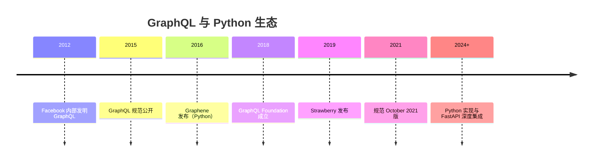

## 前置知识

- [Python 与 Jupyter：交互式计算、数据分析与可复现研究](/python/045-PythonJupyter)：建议先完成前一篇的学习

## 学习目标

- 掌握「1. 历史动机与发展脉络」的核心机制、典型用法与常见陷阱
- 掌握「2. 形式化定义」的核心机制、典型用法与常见陷阱
- 掌握「3. 理论推导与原理解析」的核心机制、典型用法与常见陷阱
- 掌握「4. 代码示例（带详尽注释）」的核心机制、典型用法与常见陷阱
- 掌握「5. 对比分析」的核心机制、典型用法与常见陷阱


## 1. 历史动机与发展脉络

GraphQL 由 Facebook 于 2012 年在移动端改造中发明，2015 年公开规范，2018 年由 GraphQL Foundation 管理。动机：移动端网络带宽有限，REST 的“服务端决定响应形状”导致过度获取与多次往返；Facebook 需要客户端按需声明字段。

Python 生态：2016 年 Graphene 发布（code-first，Django/Flask/SQLAlchemy 集成成熟）；2019 年 Strawberry 发布（基于 dataclasses 与类型注解，与 FastAPI/Starlette 配合良好）；Ariadne 提供 schema-first（先写 SDL 再绑定 resolver）。2020 年代 GraphQL 规范稳定在 October 2021 版本，Python 实现持续跟进（`__schema` 内省、指令、订阅）。



## 2. 形式化定义

### 2.1 Schema 与类型系统

GraphQL Schema 用 SDL（Schema Definition Language）描述：`type Query`、`type Mutation`、`type Subscription` 是三种根操作类型；对象类型由字段组成，字段可以有参数（arguments）；标量类型（`Int`、`Float`、`String`、`Boolean`、`ID`）是叶子；枚举、接口、联合、输入对象补充表达力。

### 2.2 查询与变更

查询（Query）是只读操作，可并行执行字段；变更（Mutation）是写操作，按顺序执行；订阅（Subscription）通过 WebSocket 推送增量。

### 2.3 Resolver

每个字段的取值由 resolver 决定：`(parent, info, **args) -> value`。默认 resolver 按字段名读取父对象属性。Resolver 是 GraphQL 执行模型的执行单元。

### 2.4 请求示例

```graphql
query GetUser($id: ID!) {
  user(id: $id) {
    id
    name
    posts {
      title
    }
  }
}
```

客户端声明需要的字段，服务端只返回这些字段，这就是“按需取数”。


## 3. 理论推导与原理解析

### 3.1 执行模型

GraphQL 执行是“解析→校验→执行”三阶段：解析器把查询字符串变成 AST；校验器对照 Schema 检查类型与参数；执行器从根类型开始，深度优先逐字段调用 resolver。每个字段的 resolver 返回 promise 时可并行（Python 中 async resolver 并发执行）。

### 3.2 N+1 问题

查询列表用户及其文章时，若每个用户的 resolver 单独查库，会产生 1（用户列表）+ N（每个用户的文章）次查询。DataLoader 通过“批处理 + 去重 + 缓存”把 N 次查询合并为 1-2 次：同一 tick 内收集所有 userId，批量 `WHERE id IN (...)`。

### 3.3 查询复杂度

恶意或低效客户端可以请求深层嵌套（如 `user -> posts -> comments -> user -> ...`）。防护手段：深度限制、数量限制、持久化查询白名单、成本分析（按字段计分）。GraphQL 本身不限制查询形状，安全是服务端责任。

### 3.4 与 REST 的对比推导

REST 的响应形状由资源表示决定，客户端无法裁剪；GraphQL 把“形状选择权”交给客户端，代价是服务端缓存与监控更复杂（端点唯一，无法按 URL 缓存）。推导结论：数据消费者多样、字段裁剪需求强时 GraphQL 优势明显；简单内部 CRUD 用 REST 更省。

## 4. 代码示例（带详尽注释）

### 4.1 Strawberry 基础 Schema

```python
from __future__ import annotations

import strawberry

# 对象类型：映射业务实体
@strawberry.type
class Post:
    id: strawberry.ID
    title: str
    # 解析器字段：根据父对象计算
    @strawberry.field
    def excerpt(self) -> str:
        return self.title[:20]

# 查询根类型：所有只读入口
@strawberry.type
class Query:
    @strawberry.field
    def post(self, id: strawberry.ID) -> Post | None:
        # 实际项目从数据库读取
        return Post(id=id, title="GraphQL 教程")

# 构建 Schema 并输出 SDL
schema = strawberry.Schema(query=Query)
print(schema.as_str())
```

讲解：Strawberry 用 Python 类型注解直接定义 GraphQL 类型，`strawberry.ID` 映射标量 ID。`excerpt` 是带逻辑的字段解析器。`schema.as_str()` 可以导出 SDL 供前端工具（GraphQL Codegen）使用。

### 4.2 Mutation 与参数

```python
from __future__ import annotations

import strawberry

# 输入类型：变更的批量参数容器
@strawberry.input
class CreatePostInput:
    title: str
    content: str = ""

@strawberry.type
class Post:
    id: strawberry.ID
    title: str

@strawberry.type
class Mutation:
    @strawberry.mutation
    def create_post(self, input: CreatePostInput) -> Post:
        # 校验与持久化（示例省略数据库）
        if not input.title.strip():
            raise ValueError("标题不能为空")
        return Post(id="p-1", title=input.title)

schema = strawberry.Schema(query=Query, mutation=Mutation)
```

讲解：Mutation 使用输入对象类型聚合参数，返回创建后的对象。业务校验在 resolver 中执行，异常会被 GraphQL 包装进 `errors` 数组返回。

### 4.3 接入 FastAPI

```python
from fastapi import FastAPI
from strawberry.fastapi import GraphQLRouter

import strawberry

@strawberry.type
class Query:
    @strawberry.field
    def hello(self) -> str:
        return "Hello GraphQL"

schema = strawberry.Schema(query=Query)
graphql_app = GraphQLRouter(schema)

app = FastAPI()
app.include_router(graphql_app, prefix="/graphql")
```

讲解：`GraphQLRouter` 把 Strawberry Schema 挂载到 FastAPI，自动提供 `/graphql` 端点与 GraphiQL 调试界面。启动 `uvicorn main:app` 后可在浏览器中交互查询。

### 4.4 Ariadne schema-first 方案

```python
from ariadne import QueryType, make_executable_schema, graphql_sync
from ariadne.asgi import GraphQL

# 1. 先用 SDL 定义 Schema
type_defs = """
    type Query {
        greeting(name: String!): String!
    }
"""

# 2. 绑定 resolver 到对应字段
query = QueryType()

@query.field("greeting")
def resolve_greeting(_, info, name: str) -> str:
    return f"Hello, {name}!"

# 3. 组合 schema
schema = make_executable_schema(type_defs, query)
```

讲解：Ariadne 坚持 schema-first：Schema 是契约（SDL 文件），resolver 用装饰器绑定。适合“前后端先约定 Schema、再并行开发”的团队流程。

### 4.5 DataLoader 解决 N+1

```python
from __future__ import annotations

from collections import defaultdict

class PostLoader:
    """简单 DataLoader：按批次加载文章，避免 N+1 查询。"""

    def __init__(self, db):
        self.db = db
        self.pending: dict[str, list] = defaultdict(list)

    # 收集阶段：注册需要加载的 user_id
    def load(self, user_id: str):
        self.pending[user_id] = []
        return self

    # 执行阶段：批量查询并分发结果
    async def dispatch(self):
        if not self.pending:
            return
        ids = list(self.pending)
        rows = await self.db.fetch_posts_by_user_ids(ids)  # WHERE user_id IN (...)
        by_user: dict[str, list] = defaultdict(list)
        for row in rows:
            by_user[row["user_id"]].append(row)
        self.pending = defaultdict(list)
        return by_user
```

讲解：真实项目直接使用 `aiodataloader` 库：`loader.load(user_id)` 返回 future，`dispatch` 在同一事件循环 tick 批量执行。核心思想是“把 N 次查询合并为一次 IN 查询”。

### 4.6 订阅（Subscription）

```python
import asyncio
import strawberry

@strawberry.type
class Subscription:
    @strawberry.subscription
    async def counter(self, max: int = 5) -> int:
        # 每秒推送一个递增数字
        for i in range(max):
            await asyncio.sleep(1)
            yield i

schema = strawberry.Schema(query=Query, subscription=Subscription)
```

讲解：订阅用异步生成器逐次 `yield` 数据，客户端通过 WebSocket 接收。适用于实时通知、进度推送等场景。

### 4.7 错误处理与自定义格式

```python
from graphql import GraphQLError
import strawberry

@strawberry.type
class Query:
    @strawberry.field
    def user(self, id: str) -> str:
        if id == "404":
            # 抛出 GraphQL 错误：进入 errors 数组，带扩展信息
            raise GraphQLError(
                "用户不存在",
                extensions={"code": "USER_NOT_FOUND", "id": id},
            )
        return f"user-{id}"
```

讲解：`GraphQLError` 的 `extensions` 字段承载业务错误码，客户端可以按 `errors[0].extensions.code` 分支处理，而不是解析文案。

## 5. 对比分析

### 5.1 GraphQL 与 REST

| 维度 | GraphQL | REST |
| --- | --- | --- |
| 端点 | 单一 /graphql | 资源化多端点 |
| 响应形状 | 客户端决定 | 服务端决定 |
| 取数效率 | 按需，防过度获取 | 可能过度/不足获取 |
| 缓存 | 需自定义 | HTTP 缓存成熟 |
| 版本管理 | Schema 演进 | URL 版本化 |
| 学习成本 | 较高 | 较低 |

### 5.2 Graphene vs Strawberry vs Ariadne

| 库 | 风格 | 特点 | 适用 |
| --- | --- | --- | --- |
| Graphene | code-first | 生态成熟，Django 集成强 | 存量 Django |
| Strawberry | code-first | 类型注解现代，FastAPI 友好 | 新项目/异步 |
| Ariadne | schema-first | SDL 契约驱动 | 前后端契约协作 |

### 5.3 查询与变更

查询可并行解析（字段间无依赖时），变更必须串行（保证写顺序）。设计 API 时，读操作放 Query，写操作放 Mutation，即使 Mutation 只读也要遵循该约定，保证客户端语义清晰。

## 6. 常见陷阱与最佳实践

陷阱一：resolver 中同步阻塞调用数据库，阻塞事件循环。最佳实践：使用异步驱动（asyncpg、aiosqlite）与 async resolver。

陷阱二：忽略 N+1，列表查询性能崩塌。最佳实践：DataLoader 或预加载（`selectinload`）。

陷阱三：不限制查询复杂度，被深层嵌套查询打垮。最佳实践：深度/数量限制 + 成本分析。

陷阱四：把业务逻辑写进 resolver。最佳实践：resolver 薄层，逻辑进 service 层，便于测试复用。

陷阱五：Mutation 返回类型不包含变更结果，客户端需要再次查询。最佳实践：返回变更后的对象或结果封装。

陷阱六：错误全部返回 200 + errors 数组，HTTP 层监控失真。最佳实践：按错误类型设置响应状态（或依赖 errors 扩展码）并记录日志指标。

陷阱七：Schema 变更破坏客户端。最佳实践：deprecation 注解、版本化演进、Schema Registry。

## 7. 工程实践

### 7.1 项目结构

```text
app/
  schema/
    query.py        # 根查询
    mutation.py     # 根变更
    types.py        # 对象/输入类型
  resolvers/
    user_resolver.py
    post_resolver.py
  services/
    user_service.py  # 业务逻辑
  main.py            # FastAPI + GraphQLRouter
```

讲解：类型、resolver、业务逻辑三层分离。resolver 只做“取参→调 service→映射结果”，service 可独立单测。

### 7.2 权限指令

```python
from strawberry.permission import BasePermission

class IsAuthenticated(BasePermission):
    # 权限校验失败时抛出错误
    message = "需要登录"

    async def has_permission(self, source, info, **kwargs) -> bool:
        request = info.context["request"]
        return request.user.is_authenticated

@strawberry.type
class Query:
    @strawberry.field(permission_classes=[IsAuthenticated])
    def profile(self) -> str:
        return "私密资料"
```

讲解：Strawberry 的权限类装饰字段，在 resolver 执行前校验。权限逻辑集中在类中，可复用、可测试。

### 7.3 持久化查询与缓存

```python
# 持久化查询：服务端保存哈希与查询的映射
PERSISTED = {
    "sha256hash1": "query Home { posts { title } }",
}

async def resolve_operation(operation_name, query):
    # 客户端传哈希时从白名单取查询
    return PERSISTED.get(operation_name, query)
```

讲解：持久化查询把查询白名单化，天然限制查询形状与复杂度，同时支持 CDN 缓存（GET + 哈希）。安全性与性能双收。

## 8. 案例研究：博客平台 GraphQL API

需求：用户、文章、评论三个实体；查询文章列表与详情；发表评论；文章更新时推送通知。

```python
from __future__ import annotations

import strawberry

@strawberry.type
class User:
    id: strawberry.ID
    name: str

@strawberry.type
class Comment:
    id: strawberry.ID
    content: str
    author: User

@strawberry.type
class Post:
    id: strawberry.ID
    title: str
    comments: list[Comment]

    # 字段参数：分页评论
    @strawberry.field
    def comments_page(self, limit: int = 10, offset: int = 0) -> list[Comment]:
        return self.comments[offset:offset + limit]

@strawberry.type
class Query:
    @strawberry.field
    def posts(self) -> list[Post]:
        # DataLoader + service 查询
        return fetch_all_posts()

    @strawberry.field
    def post(self, id: strawberry.ID) -> Post | None:
        return fetch_post(id)

@strawberry.type
class Mutation:
    @strawberry.mutation
    async def add_comment(self, post_id: strawberry.ID, content: str) -> Comment:
        if not content.strip():
            raise ValueError("评论不能为空")
        comment = await create_comment(post_id, content)
        # 触发订阅通知
        await notify_comment(comment)
        return comment

schema = strawberry.Schema(query=Query, mutation=Mutation, subscription=Subscription)
```

讲解：案例覆盖类型建模、字段参数分页、mutation 校验、订阅通知四大模块。`comments_page` 演示字段级参数——同一个 `Post` 类型在不同查询中返回不同评论子集，这是 GraphQL 表达力的典型体现。

## 9. 知识要点总结与深入讲解

GraphQL 的核心是“Schema 即契约”：类型系统同时服务服务端执行与客户端代码生成。理解 Schema、Resolver、执行模型三者，就掌握了 GraphQL 的主线。

性能关键在数据加载：N+1 是 GraphQL 的先天挑战，DataLoader 是标准解。查询复杂度防护是生产必需，不是可选项。

Python 实现的选择取决于团队工作流：喜欢类型注解与异步用 Strawberry，存量 Django 用 Graphene，契约先行用 Ariadne。三者共享 GraphQL 规范，迁移成本可控。

### 什么是 GraphQL

GraphQL 是一种 API 查询语言，由 Facebook 开发。与 REST API 不同，GraphQL 让客户端自己决定需要哪些数据，不多不少。在 REST 中，一个接口返回固定的字段，你可能获取了太多不需要的数据，或者需要调用多个接口才能获取足够的数据。GraphQL 用一个接口解决了这个问题。

GraphQL 的核心思想是：客户端描述需要的数据结构，服务端返回完全匹配的数据。这避免了过度获取（获取了不需要的字段）和不足获取（需要调用多个接口）的问题。

### 基础概念

#### Schema（模式）

Schema 定义了 API 的类型系统，描述了有哪些数据类型、每个类型有哪些字段、支持哪些查询和变更。Schema 是客户端和服务端之间的契约。

#### Query（查询）

Query 是读取数据的操作，类似于 REST 的 GET 请求。客户端在 Query 中指定需要的字段，服务端只返回这些字段。

#### Mutation（变更）

Mutation 是修改数据的操作，类似于 REST 的 POST/PUT/DELETE 请求。用于创建、更新、删除数据。

#### Resolver（解析器）

Resolver 是服务端处理每个字段的函数。当客户端请求某个字段时，对应的 Resolver 被调用来获取数据。

#### Type（类型）

GraphQL 有内置的标量类型（Int、Float、String、Boolean、ID），也支持自定义对象类型。每个类型有一组字段，字段可以有参数。

### 快速上手

#### 安装

```bash
# 安装 Strawberry GraphQL（现代的 Python GraphQL 库）
pip install strawberry-graphql fastapi

# 或者安装 Graphene（老牌 GraphQL 库）
# pip install graphene
```

#### 最简单的 GraphQL API

```python
# app.py
import strawberry
from strawberry.fastapi import GraphQLRouter
from fastapi import FastAPI

# 定义 GraphQL 类型
@strawberry.type
class User:
    name: str
    age: int
    email: str

# 模拟数据
users_db = [
    User(name="张三", age=25, email="zhangsan@example.com"),
    User(name="李四", age=30, email="lisi@example.com"),
]

# 定义 Query（查询操作）
@strawberry.type
class Query:
    @strawberry.field
    def users(self) -> list[User]:
        """获取所有用户"""
        return users_db

    @strawberry.field
    def user(self, name: str) -> User | None:
        """按名字查询用户"""
        for u in users_db:
            if u.name == name:
                return u
        return None

# 创建 GraphQL Schema
schema = strawberry.Schema(query=Query)

# 集成到 FastAPI
app = FastAPI()
graphql_app = GraphQLRouter(schema)
app.include_router(graphql_app, prefix="/graphql")
```

运行：

```bash
uvicorn app:app --reload
```

访问 http://localhost:8000/graphql 可以打开交互式查询界面（GraphQL Playground）。

#### 查询示例

客户端发送以下查询：

```graphql
# 获取所有用户，但只要 name 和 age 字段
query {
  users {
    name
    age
  }
}
```

服务端返回：

```json
{
  "data": {
    "users": [
      { "name": "张三", "age": 25 },
      { "name": "李四", "age": 30 }
    ]
  }
}
```

注意：虽然 User 类型有 email 字段，但因为查询中没有请求 email，所以返回数据中不包含它。

```graphql
# 按名字查询用户
query {
  user(name: "张三") {
    name
    email
  }
}
```

### 详细用法

#### 定义 Mutation（数据变更）

```python
import strawberry
from strawberry.fastapi import GraphQLRouter
from fastapi import FastAPI

@strawberry.type
class Article:
    id: int
    title: str
    content: str
    author: str

articles_db: list[Article] = []
next_id = 1

@strawberry.type
class Query:
    @strawberry.field
    def articles(self) -> list[Article]:
        """获取所有文章"""
        return articles_db

    @strawberry.field
    def article(self, article_id: int) -> Article | None:
        """按 ID 获取文章"""
        for a in articles_db:
            if a.id == article_id:
                return a
        return None

# 定义输入类型（用于 Mutation 的参数）
@strawberry.input
class ArticleInput:
    title: str
    content: str
    author: str

# 定义 Mutation
@strawberry.type
class Mutation:
    @strawberry.mutation
    def create_article(self, input: ArticleInput) -> Article:
        """创建文章"""
        global next_id
        article = Article(
            id=next_id,
            title=input.title,
            content=input.content,
            author=input.author,
        )
        articles_db.append(article)
        next_id += 1
        return article

    @strawberry.mutation
    def delete_article(self, article_id: int) -> bool:
        """删除文章"""
        for i, a in enumerate(articles_db):
            if a.id == article_id:
                articles_db.pop(i)
                return True
        return False

schema = strawberry.Schema(query=Query, mutation=Mutation)
app = FastAPI()
app.include_router(GraphQLRouter(schema), prefix="/graphql")
```

Mutation 查询示例：

```graphql
# 创建文章
mutation {
  createArticle(
    input: { title: "GraphQL 入门", content: "这是一篇关于 GraphQL 的教程", author: "张三" }
  ) {
    id
    title
  }
}

# 删除文章
mutation {
  deleteArticle(articleId: 1)
}
```

#### 关联类型

```python
import strawberry

@strawberry.type
class Author:
    id: int
    name: str
    email: str

@strawberry.type
class Book:
    id: int
    title: str
    author_id: int

    # 关联字段：通过 Resolver 获取作者信息
    @strawberry.field
    def author(self, info) -> Author:
        """获取书籍的作者"""
        return get_author_by_id(self.author_id)

authors_db = [
    Author(id=1, name="张三", email="zhangsan@example.com"),
    Author(id=2, name="李四", email="lisi@example.com"),
]

books_db = [
    Book(id=1, title="Python 入门", author_id=1),
    Book(id=2, title="GraphQL 实战", author_id=1),
    Book(id=3, title="Web 开发指南", author_id=2),
]

def get_author_by_id(author_id: int) -> Author:
    for a in authors_db:
        if a.id == author_id:
            return a
    raise ValueError(f"作者 ID {author_id} 不存在")
```

查询关联数据：

```graphql
# 获取书籍及其作者信息
query {
  books {
    title
    author {
      name
      email
    }
  }
}
```

#### 枚举类型

```python
import strawberry

@strawberry.enum
class Status:
    DRAFT = "draft"
    PUBLISHED = "published"
    ARCHIVED = "archived"

@strawberry.type
class Post:
    id: int
    title: str
    status: Status

@strawberry.type
class Query:
    @strawberry.field
    def posts(self, status: Status | None = None) -> list[Post]:
        """按状态过滤文章"""
        if status:
            return [p for p in posts_db if p.status == status]
        return posts_db
```

#### 分页查询

```python
import strawberry
from typing import Generic, TypeVar

T = TypeVar("T")

# 通用分页类型
@strawberry.type
class Pagination(Generic[T]):
    items: list[T]
    total: int
    page: int
    page_size: int

@strawberry.type
class Query:
    @strawberry.field
    def articles(self, page: int = 1, page_size: int = 10) -> Pagination[Article]:
        """分页获取文章"""
        start = (page - 1) * page_size
        end = start + page_size
        items = articles_db[start:end]
        return Pagination(
            items=items,
            total=len(articles_db),
            page=page,
            page_size=page_size,
        )
```

### 常见场景

#### 与 SQLAlchemy 集成

```python
import strawberry
from strawberry.fastapi import GraphQLRouter
from sqlalchemy import select
from sqlalchemy.orm import Session

# 将 SQLAlchemy 模型转换为 GraphQL 类型
@strawberry.type
class UserType:
    id: int
    name: str
    email: str

    @classmethod
    def from_orm(cls, user):
        """从 ORM 模型创建 GraphQL 类型"""
        return cls(id=user.id, name=user.name, email=user.email)

@strawberry.type
class Query:
    @strawberry.field
    def users(self, info) -> list[UserType]:
        """获取所有用户"""
        db: Session = info.context["db"]
        users = db.execute(select(User)).scalars().all()
        return [UserType.from_orm(u) for u in users]

    @strawberry.field
    def user(self, info, user_id: int) -> UserType | None:
        """按 ID 获取用户"""
        db: Session = info.context["db"]
        user = db.get(User, user_id)
        return UserType.from_orm(user) if user else None
```

### 注意事项与常见错误

#### N+1 查询问题

GraphQL 的关联查询容易产生 N+1 问题。比如查询 10 本书及其作者，可能产生 1 次查书 + 10 次查作者 = 11 次数据库查询。解决方法是使用 DataLoader 批量加载。

#### 查询深度限制

恶意客户端可能发送极深层嵌套的查询，消耗服务器资源。应该限制查询深度：

```python
from strawberry.extensions import QueryDepthLimiter

schema = strawberry.Schema(
    query=Query,
    extensions=[QueryDepthLimiter(max_depth=5)]
)
```

#### 不要把 GraphQL 当数据库

GraphQL 是 API 层，不是数据库。不要把数据库表结构直接暴露为 GraphQL 类型。应该设计面向客户端的 API 类型，在 Resolver 中做数据转换。

### 进阶用法

#### 使用 DataLoader 批量加载

```bash
pip install strawberry-graphql
```

```python
from strawberry.dataloader import DataLoader

async def load_authors(author_ids: list[int]) -> list[Author]:
    """批量加载作者"""
    authors = await batch_get_authors(author_ids)
    return [next((a for a in authors if a.id == aid), None) for aid in author_ids]

author_loader = DataLoader(load_authors)

@strawberry.type
class Book:
    id: int
    title: str
    author_id: int

    @strawberry.field
    async def author(self, info) -> Author:
        """使用 DataLoader 批量加载作者"""
        return await info.context["author_loader"].load(self.author_id)
```

#### 订阅（Subscription）

GraphQL 订阅支持实时数据推送：

```python
import asyncio
import strawberry

@strawberry.type
class Subscription:
    @strawberry.subscription
    async def message_added(self, room_id: str) -> str:
        """订阅新消息"""
        while True:
            message = await get_new_message(room_id)
            if message:
                yield message
            await asyncio.sleep(1)
```
