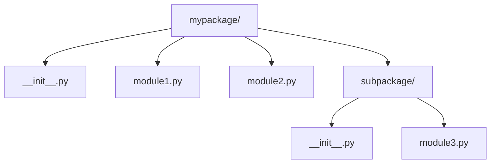
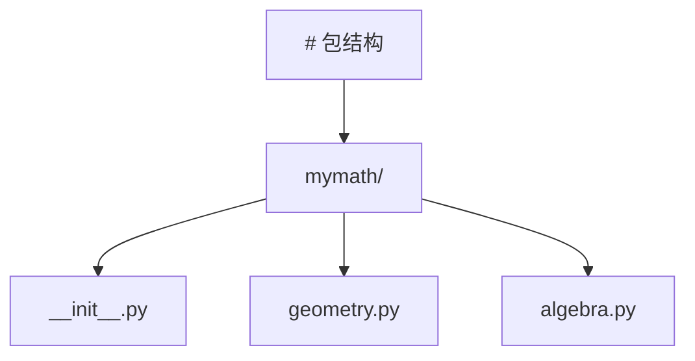
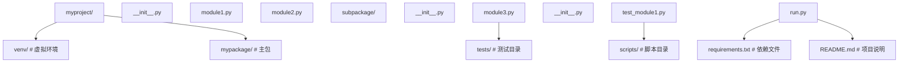

## 泛型

**基本写法：泛型函数**
`def <函数名>(<参数>: <类型>[T]) -> <类型>[T]`
```python
# 使用 TypeVar 声明泛型

## 前置知识

- [推导式与生成器](/python/053-ComprehensionGenerator)：建议先完成前一篇的学习

## 学习目标

- 掌握「泛型」的核心机制、典型用法与常见陷阱
- 掌握「Optional 与 Union」的核心机制、典型用法与常见陷阱
- 掌握「Callable 可调用类型」的核心机制、典型用法与常见陷阱
- 掌握「容器类型」的核心机制、典型用法与常见陷阱
- 掌握「TypedDict」的核心机制、典型用法与常见陷阱

from typing import TypeVar
T = TypeVar("T")
def first(items: list[T]) -> T:
    return items[0]
```

**基本写法：Python 3.12+ 泛型语法**
`def <函数名>[T](<参数>: list[T]) -> T`
```python
# Python 3.12+ 内联泛型参数声明
def first[T](items: list[T]) -> T:
    return items[0]
```

**换行写法：泛型类**
`class <类名>(Generic[T]):`
```python
# 继承 Generic 实现泛型类
from typing import Generic, TypeVar
T = TypeVar("T")
class Stack(Generic[T]):
    def __init__(self):
        self._items: list[T] = []
    def push(self, item: T) -> None:
        self._items.append(item)
```

**基本写法：Python 3.12+ 泛型类新语法**
`class <类名>[T]:`
```python
# Python 3.12+ 直接在类名后声明类型参数
class Stack[T]:
    def __init__(self):
        self._items: list[T] = []
    def push(self, item: T) -> None:
        self._items.append(item)
```

---

## Optional 与 Union

**基本写法：Optional 可选类型**
`Optional[<类型>]`
```python
# 表示值可以为 None
from typing import Optional
def find(name: str) -> Optional[int]:
    if name in data:
        return data[name]
    return None
```

**基本写法：Union 联合类型**
`Union[<类型1>, <类型2>]`
```python
# 多种可能的类型
from typing import Union
def process(data: Union[str, bytes]) -> str:
    if isinstance(data, bytes):
        return data.decode()
    return data
```

**基本写法：Python 3.10+ 联合类型语法**
`<类型1> | <类型2>`
```python
# 使用管道符表示联合类型
def process(data: str | bytes) -> str:
    if isinstance(data, bytes):
        return data.decode()
    return data
```

**基本写法：Python 3.10+ 可空语法**
`<类型> | None`
```python
# 使用管道符表示可选
def find(name: str) -> int | None:
    return data.get(name)
```

---

## Callable 可调用类型

**基本写法：Callable 类型**
`Callable[[<参数类型>], <返回类型>]`
```python
# 标注函数类型
from typing import Callable
def apply(func: Callable[[int, int], int], a: int, b: int) -> int:
    return func(a, b)
```

**基本写法：无参数 Callable**
`Callable[[], <返回类型>]`
```python
# 无参数可调用对象
def run(fn: Callable[[], str]) -> str:
    return fn()
```

**基本写法：任意签名 Callable**
`Callable[..., <返回类型>]`
```python
# 不指定参数签名的可调用对象
Handler = Callable[..., None]
```

---

## 容器类型

**基本写法：List 类型**
`list[<元素类型>]`
```python
# 列表类型标注
names: list[str] = ["Alice", "Bob"]
```

**基本写法：Dict 类型**
`dict[<键类型>, <值类型>]`
```python
# 字典类型标注
scores: dict[str, int] = {"Alice": 90}
```

**基本写法：Tuple 类型**
`tuple[<类型1>, <类型2>]`
```python
# 固定长度元组
point: tuple[float, float] = (1.0, 2.0)
```

**基本写法：可变长元组**
`tuple[<类型>, ...]`
```python
# 任意长度的同类型元组
nums: tuple[int, ...] = (1, 2, 3)
```

**基本写法：Set 类型**
`set[<元素类型>]`
```python
# 集合类型标注
tags: set[str] = {"a", "b"}
```

---

## TypedDict

**换行写法：定义 TypedDict**
`class <类名>(TypedDict):`
`    <字段>: <类型>`

```python
# 为字典提供固定键值类型
from typing import TypedDict
class UserDict(TypedDict):
    name: str
    age: int
user: UserDict = {"name": "Alice", "age": 30}
```

**基本写法：Python 3.12+ TypedDict 用于 kwargs**
`def <函数名>(**kwargs: <TypedDict类>)`
```python
# Python 3.12+ PEP 692 使用 TypedDict 标注 kwargs
class Options(TypedDict, total=False):
    timeout: int
    retry: bool
def fetch(url: str, **kwargs: Options) -> None:
    pass
```

---

## Literal 字面量类型

**基本写法：Literal 字面量**
`Literal[<值1>, <值2>]`
```python
# 限定值为特定字面量
from typing import Literal
def set_mode(mode: Literal["read", "write", "append"]) -> None:
    pass
```

---

## Protocol 结构化子类型

**换行写法：定义 Protocol**
`class <协议名>(Protocol):`
`    def <方法>(self, ...) -> ...: ...`

```python
# 鸭子类型协议
from typing import Protocol
class Comparable(Protocol):
    def __lt__(self, other: "Comparable") -> bool: ...
def sort(items: list[Comparable]) -> None:
    pass
```

**基本写法：runtime_checkable 运行时检查**
`@runtime_checkable`
```python
# 允许 isinstance 检查 Protocol
from typing import Protocol, runtime_checkable
@runtime_checkable
class Drawable(Protocol):
    def draw(self) -> None: ...
isinstance(obj, Drawable)
```

---

## Any 与 TypeGuard

**基本写法：Any 类型**
`Any`
```python
# 任意类型，跳过类型检查
from typing import Any
data: Any = json.loads(raw)
```

**基本写法：TypeGuard 类型守卫**
`TypeGuard[<类型>]`
```python
# 缩小类型范围的谓词函数
from typing import TypeGuard
def is_str_list(val: list) -> TypeGuard[list[str]]:
    return all(isinstance(x, str) for x in val)
```

**基本写法：Python 3.13+ TypeIs**
`TypeIs[<类型>]`
```python
# Python 3.13+ 更严格的类型守卫
from typing import TypeIs
def is_positive(n: int) -> TypeIs[int]:
    return n > 0
```

---

## TypeVar 高级用法

**基本写法：带约束的 TypeVar**
`TypeVar("<名称>", <类型1>, <类型2>)`
```python
# 限定类型只能是某几种
from typing import TypeVar
T = TypeVar("T", int, float)
def add(a: T, b: T) -> T:
    return a + b
```

**基本写法：带上界的 TypeVar**
`TypeVar("<名称>", bound=<类型>)`
```python
# 限定类型必须是指定类的子类
from typing import TypeVar
T = TypeVar("T", bound=str)
def process(value: T) -> T:
    return value
```

**基本写法：Python 3.13+ TypeVar 默认值**
`T = TypeVar("T", default=<类型>)`
```python
# Python 3.13+ PEP 696 类型参数默认值
from typing import TypeVar
T = TypeVar("T", default=int)
def get_value() -> T:
    return 42
```

---

## ParamSpec 与 TypeVarTuple

**基本写法：ParamSpec 参数规格**
`P = ParamSpec("P")`
```python
# 捕获函数的参数签名
from typing import ParamSpec, Callable, TypeVar
P = ParamSpec("P")
R = TypeVar("R")
def log(fn: Callable[P, R]) -> Callable[P, R]:
    def wrapper(*args: P.args, **kwargs: P.kwargs) -> R:
        return fn(*args, **kwargs)
    return wrapper
```

**基本写法：TypeVarTuple 可变泛型**
`Ts = TypeVarTuple("Ts")`
```python
# 可变数量的类型参数
from typing import TypeVarTuple, Unpack
Ts = TypeVarTuple("Ts")
def merge(*args: Unpack[Ts]) -> tuple[Unpack[Ts]]:
    return args
```

---

## 常用工具类型

**基本写法：Final 不可变**
`Final[<类型>]`
```python
# 标注不应被重新赋值
from typing import Final
MAX_SIZE: Final[int] = 100
```

**基本写法：ClassVar 类变量**
`ClassVar[<类型>]`
```python
# 标注类级别变量而非实例变量
from typing import ClassVar
class Config:
    default: ClassVar[str] = "production"
```

**基本写法：Python 3.13+ @deprecated**
`@deprecated("<消息>")`
```python
# Python 3.13+ PEP 702 标记弃用
from warnings import deprecated  # typing.deprecated
@deprecated("使用 new_func 替代")
def old_func():
    pass
```

**基本写法：@override 重写标记**
`@override`
```python
# Python 3.12+ PEP 698 标记方法重写
from typing import override
class Child(Parent):
    @override
    def method(self):
        pass
```
## 1. 模块导入 (Importing)

模块是包含 Python 代码的 `.py` 文件，它可以包含函数、类和变量。

### 1.1 基本导入方式

```python
 # 导入整个模块
 import math
 print(math.pi) # 输出: 3.141592653589793
 print(math.sqrt(16)) # 输出: 4.0
 # 导入模块并使用别名
 import math as m
 print(m.pi) # 输出: 3.141592653589793
 # 导入模块中的特定成员
 from math import pi, sqrt
 print(pi) # 输出: 3.141592653589793
 print(sqrt(16)) # 输出: 4.0
 # 导入模块中的所有成员
 from math import *
 print(pi) # 输出: 3.141592653589793
 print(sin(0)) # 输出: 0.0
```

### 1.2 导入路径 (Search Path)

Python 解释器在导入模块时，会按照以下顺序查找：

1. 当前目录
2. `PYTHONPATH` 环境变量中指定的目录
3. 标准库目录
4. 第三方库目录 (`site-packages`)

```python
 import sys
 # 查看导入路径
 print(sys.path)
 # 添加自定义目录到导入路径
 sys.path.append("/path/to/custom/modules")
```

### 1.3 相对导入

在包内部，可以使用相对导入来导入同一包中的其他模块。

```python
 # 假设目录结构如下:
 # mypackage/
 # ├── __init__.py
 # ├── module1.py
 # └── subpackage/
 # ├── __init__.py
 # └── module2.py
 # 在 module2.py 中导入 module1.py
 from .. import module1
 # 在 module1.py 中导入 subpackage.module2
 from .subpackage import module2
```

### 1.4 动态导入

使用 `importlib` 模块可以动态导入模块。

```python
 import importlib
 # 动态导入模块
 math_module = importlib.import_module("math")
 print(math_module.pi) # 输出: 3.141592653589793
 # 动态导入包中的模块
 os_path = importlib.import_module("os.path")
 print(os_path.abspath(".")) # 输出当前目录的绝对路径
```

## 2. 包 (Packages)

包是包含多个模块的目录，它必须包含一个 `__init__.py` 文件。

### 2.1 包的结构



### 2.2 `__init__.py` 文件

`__init__.py` 文件用于标识一个目录为包，它可以包含包的初始化代码。

```python
 # mypackage/__init__.py
 # 包的版本
 _
 # 从包中导出成员
 from .module1 import function1
 from .module2 import function2
 # 定义包级别的变量
 package_variable = "This is a package variable"
 # 包的初始化代码
 print("Initializing mypackage")
```

### 2.3 导入包

```python
 # 导入整个包
 import mypackage
 print(mypackage.__version__) # 输出: 1.0.0
 print(mypackage.package_variable) # 输出: This is a package variable
 print(mypackage.function1()) # 调用从 module1 导出的函数
 # 导入包中的模块
 from mypackage import module1
 print(module1.function1()) # 调用 module1 中的函数
 # 导入子包
 from mypackage.subpackage import module3
 print(module3.function3()) # 调用 module3 中的函数
```

### 2.4 命名空间包

Python 3.3+ 支持命名空间包，它允许将多个目录作为同一个包的一部分，而不需要 `__init__.py` 文件。

## 3. 命名空间与 `__name__`

### 3.1 命名空间

每个模块都有自己的命名空间，用于存储模块中的变量、函数和类。

```python
 # module1.py
 x = 10
 def function():
  pass
 class MyClass:
  pass
 # 在另一个模块中
 import module1
 print(module1.x) # 访问 module1 的命名空间中的变量
```

### 3.2 `__name__` 属性

每个模块都有一个 `__name__` 属性，用于标识模块的名称。

- 当模块作为主程序运行时，`__name__` 的值为 `"__main__"`
- 当模块被导入时，`__name__` 的值为模块的名称

```python
 # module.py
 print(f"Module name: {__name__}")
 if __name__ == "__main__":
  print("Running as main program")
 else:
  print("Being imported as a module")
 # 运行 module.py 直接执行
 # 输出:
 # Module name: __main__
 # Running as main program
 # 在另一个模块中导入 module.py
 # 输出:
 # Module name: module
 # Being imported as a module
```

### 3.3 示例：模块的测试代码

```python
 # utils.py
 def add(a, b):
  """加法函数"""
  return a + b
 def multiply(a, b):
  """乘法函数"""
  return a * b
 # 测试代码
 if __name__ == "__main__":
  print("Testing utils module")
  print(f"add(2, 3) = {add(2, 3)}")
  print(f"multiply(2, 3) = {multiply(2, 3)}")
```

## 4. 第三方库管理 (pip)

### 4.1 基本命令

```bash
 # 安装包
 pip install package_name
 # 安装指定版本的包
 pip install package_name==1.0.0
 # 升级包
 pip install --upgrade package_name
 # 卸载包
 pip uninstall package_name
 # 列出已安装的包
 pip list
 # 查看包的详细信息
 pip show package_name
 # 导出依赖
 pip freeze > requirements.txt
 # 安装依赖
 pip install -r requirements.txt
 # 检查包的更新
 pip list --outdated
```

### 4.2 虚拟环境中的 pip

在虚拟环境中使用 pip 安装的包只对该虚拟环境有效，不会影响系统全局的包。

### 4.3 国内镜像源

使用国内镜像源可以加快包的下载速度：

```bash
 # 临时使用
 pip install -i https://pypi.tuna.tsinghua.edu.cn/simple package_name
 # 永久设置
 pip config set global.index-url https://pypi.tuna.tsinghua.edu.cn/simple
```

常用的国内镜像源：

- 清华大学: <https://pypi.tuna.tsinghua.edu.cn/simple>
- 阿里云: <https://mirrors.aliyun.com/pypi/simple>
- 豆瓣: <https://pypi.douban.com/simple>

## 5. 虚拟环境 (Virtual Environments)

### 5.1 虚拟环境的作用

- **隔离依赖**: 不同项目可以使用不同版本的包
- **避免冲突**: 防止包版本冲突
- **便于管理**: 每个项目的依赖都独立管理
- **便于部署**: 可以轻松导出和安装依赖

### 5.2 使用 `venv` 创建虚拟环境

```bash
 # 创建虚拟环境
 python -m venv venv
 # 激活虚拟环境（Windows）
 venv\Scripts\activate.bat
 # 激活虚拟环境（Linux/Mac）
 source venv/bin/activate
 # 退出虚拟环境
 deactivate
```

### 5.3 使用 `conda` 创建虚拟环境

```bash
 # 创建虚拟环境
 conda create -n myenv python=3.8
 # 激活虚拟环境
 conda activate myenv
 # 退出虚拟环境
 conda deactivate
 # 删除虚拟环境
 conda remove -n myenv --all
```

### 5.4 使用 `poetry` 管理依赖

```bash
 # 初始化项目
 poetry init
 # 添加依赖
 poetry add package_name
 # 安装依赖
 poetry install
 # 激活虚拟环境
 poetry shell
 # 运行命令
 poetry run python script.py
```

### 5.5 虚拟环境的最佳实践

- **每个项目使用独立的虚拟环境**
- **使用 `requirements.txt` 或 `pyproject.toml` 管理依赖**
- **将虚拟环境目录添加到 `.gitignore`**
- **定期更新依赖**
- **在部署前测试依赖**

## 6. 模块和包的最佳实践

### 6.1 模块设计

- **单一职责**: 每个模块应该只负责一个功能
- **命名规范**: 模块名应该小写，使用下划线分隔单词
- **文档**: 为模块添加文档字符串
- **导入顺序**: 按标准库、第三方库、本地模块的顺序导入
- **避免循环导入**: 合理设计模块间的依赖关系

### 6.2 包设计

- **层次清晰**: 包的结构应该层次清晰，易于理解
- **`__init__.py`**: 合理使用 `__init__.py` 文件，导出重要的成员
- **相对导入**: 在包内部使用相对导入
- **版本管理**: 在包中包含版本信息
- **测试**: 为包添加测试代码

### 6.3 导入规范

- **避免使用 `from module import *`**: 可能导致命名冲突
- **使用别名**: 对于长模块名，使用简洁的别名
- **分组导入**: 按功能分组导入
- **显式导入**: 明确导入需要的成员

## 7. 实际应用示例

### 7.1 创建和使用自定义模块

```python
 # utils.py
 """工具模块"""
 def calculate_area(radius):
  """计算圆的面积"""
  import math
  return math.pi * radius ** 2
 def calculate_perimeter(radius):
  """计算圆的周长"""
  import math
  return 2 * math.pi * radius
 # 使用模块
 import utils
 radius = 5
 print(f"Radius: {radius}")
 print(f"Area: {utils.calculate_area(radius):.2f}")
 print(f"Perimeter: {utils.calculate_perimeter(radius):.2f}")
```

### 7.2 创建和使用包



```python
 # mymath/__init__.py
 """数学包"""
 _
 from .geometry import calculate_area, calculate_perimeter
 from .algebra import add, subtract, multiply, divide
 # mymath/geometry.py
 """几何模块"""
 import math
 def calculate_area(radius):
  """计算圆的面积"""
  return math.pi * radius ** 2
 def calculate_perimeter(radius):
  """计算圆的周长"""
  return 2 * math.pi * radius
 # mymath/algebra.py
 """代数模块"""
 def add(a, b):
  """加法"""
  return a + b
 def subtract(a, b):
  """减法"""
  return a - b
 def multiply(a, b):
  """乘法"""
  return a * b
 def divide(a, b):
  """除法"""
  if b == 0:
  raise ZeroDivisionError("Cannot divide by zero")
  return a / b
 # 使用包
 import mymath
 print(f"Package version: {mymath.__version__}")
 # 使用几何模块
 radius = 5
 print(f"Circle with radius {radius}:")
 print(f"Area: {mymath.calculate_area(radius):.2f}")
 print(f"Perimeter: {mymath.calculate_perimeter(radius):.2f}")
 # 使用代数模块
 print("\nAlgebra operations:")
 print(f"2 + 3 = {mymath.add(2, 3)}")
 print(f"5 - 2 = {mymath.subtract(5, 2)}")
 print(f"3 * 4 = {mymath.multiply(3, 4)}")
 print(f"10 / 2 = {mymath.divide(10, 2)}")
```

### 7.3 管理项目依赖

```bash
 # 创建虚拟环境
 python -m venv venv
 # 激活虚拟环境
 venv\Scripts\activate.bat
 # 安装依赖
 pip install requests
 pip install pandas
 pip install matplotlib
 # 导出依赖
 pip freeze > requirements.txt
 # 查看依赖
 cat requirements.txt
 # 安装依赖（在另一台机器上）
 pip install -r requirements.txt
```

### 7.4 项目结构示例



## 8. 高级话题

### 8.1 模块的 reload

使用 `importlib` 模块可以重新加载已经导入的模块。

```python
 import importlib
 import mymodule
 # 修改 mymodule.py 后重新加载
 importlib.reload(mymodule)
```

### 8.2 模块的缓存

Python 会缓存导入的模块，以提高性能。

```python
 import sys
 # 查看已导入的模块
 print(list(sys.modules.keys()))
 # 移除模块缓存
 del sys.modules["mymodule"]
 # 再次导入时会重新加载
 import mymodule
```

### 8.3 包的分发

使用 `setuptools` 可以将包分发给其他人。

```python
 # setup.py
 from setuptools import setup, find_packages
 setup(
  name="mymath",
  version="1.0.0",
  description="A simple math package",
  packages=find_packages(),
  install_requires=[],
  entry_points={
  "console_scripts": [
  "mymath = mymath.cli:main"
  ]
  }
 )
```

### 8.4 包的安装方式

- **开发模式安装**: `pip install -e .`
- **构建分发包**: `python setup.py sdist bdist_wheel`
- **上传到 PyPI**: `twine upload dist/*`

---

## 基本导入

**基本写法：导入模块**
`import <模块名>`
```python
# 导入整个模块，通过模块名访问成员
import os
path = os.getcwd()
```

---

**基本写法：导入特定成员**
`from <模块> import <名称>`
```python
# 仅导入需要的函数或类
from pathlib import Path
p = Path(".")
```

---

**基本写法：导入并设置别名**
`import <模块> as <别名>`
```python
# 用别名简化长模块名
import numpy as np
arr = np.array([1, 2, 3])
```

---

**基本写法：导入多个成员**
`from <模块> import <名称1>, <名称2>`
```python
# 一次导入多个符号
from collections import deque, defaultdict
```

---

**基本写法：导入全部公开成员**
`from <模块> import *`
```python
# 导入 __all__ 列出的名称，无 __all__ 则导入所有非下划线开头名称
# 不推荐在生产代码使用，易造成命名冲突
```

---

## 包与 __init__.py

**基本写法：定义包**
`<目录>/__init__.py`
```python
# 含 __init__.py 的目录即为包（Python 3.3+ 普通目录也支持命名空间包）
# mypackage/__init__.py
__all__ = ["core", "utils"]
```

---

**基本写法：包内模块导入**
`from <包> import <模块>`
```python
# mypackage/core.py 中定义函数
# 外部调用
from mypackage import core
core.run()
```

---

## __all__ 公开接口

**基本写法：声明公开名称**
`__all__ = [<名称列表>]`
```python
# 模块顶部声明，控制 from module import * 的导出范围
# utils.py
__all__ = ["helper", "format_text"]

def helper():
    pass

def _internal():
    # 以 _ 开头默认为私有，不会被 import * 导入
    pass
```

---

## 相对导入

**基本写法：当前包内导入**
`from . import <模块>`
```python
# 一个点表示当前包目录
# mypackage/core.py
from . import utils
```

---

**基本写法：上级包导入**
`from .. import <模块>`
```python
# 两个点表示上一级包
# mypackage/sub/child.py
from .. import core
```

---

**基本写法：指定相对层级**
`from .<模块> import <名称>`
```python
# 从当前包的指定模块导入
# mypackage/core.py
from .utils import format_text
```

---

## sys.path 路径管理

**基本写法：查看搜索路径**
`sys.path`
```python
import sys
# 列出模块搜索路径，首项常为当前脚本目录
print(sys.path)
```

---

**基本写法：临时添加搜索路径**
`sys.path.append(<路径>)`
```python
import sys
# 运行时动态加入目录，重启后失效
sys.path.append("/home/user/libs")
import mylib
```

---

**基本写法：插入到路径最前**
`sys.path.insert(0, <路径>)`
```python
import sys
# 0 表示最高优先级
sys.path.insert(0, "/opt/custom")
```

---

## importlib 动态导入

**基本写法：按字符串导入模块**
`importlib.import_module(<模块名>)`
```python
import importlib
# 运行时根据字符串动态加载模块
mod = importlib.import_module("json")
print(mod.dumps({"a": 1}))
```

---

**基本写法：导入子模块**
`importlib.import_module("<包>.<模块>")`
```python
import importlib
# 动态加载包内子模块
core = importlib.import_module("mypackage.core")
```

---

**基本写法：按名称获取函数**
`getattr(<模块>, <名称>)`
```python
import importlib
mod = importlib.import_module("collections")
# 再用 getattr 取出具体成员
Deque = getattr(mod, "deque")
```

---

## 模块属性

**基本写法：模块名**
`__name__`
```python
# 模块自身为 "__main__"，被导入时为模块全名
if __name__ == "__main__":
    main()
```

---

**基本写法：模块文件路径**
`__file__`
```python
# 获取模块所在文件路径
print(__file__)
```

---

**基本写法：模块文档字符串**
`__doc__`
```python
"""模块顶部文档字符串。"""
# 通过 __doc__ 访问
print(__doc__)
```

---

**基本写法：包路径**
`__path__`
```python
# 仅包拥有 __path__，表示包目录列表
# 子模块导入时会基于 __path__ 查找
```

---

## 模块缓存

**基本写法：查看已加载模块**
`sys.modules`
```python
import sys
# 字典缓存所有已导入模块，键为模块全名
print("json" in sys.modules)
```

---

**基本写法：重载模块**
`importlib.reload(<模块>)`
```python
import importlib, mymod
# 开发期修改源码后重新加载
importlib.reload(mymod)
```

---

## 条件与延迟导入

**基本写法：函数内导入**
`def <函数>(): import <模块>`
```python
# 延迟到调用时导入，常用于避免循环依赖或加速启动
def parse(path):
    import json
    with open(path) as f:
        return json.load(f)
```

---

**基本写法：try 容错导入**
`try: import <模块>`
```python
# 优先使用 C 加速版本，失败回退纯 Python
try:
    import cjson as json
except ImportError:
    import json
```

---## 基本类型别名

**基本写法：类型别名**
`<别名> = <类型>`
```python
# 为类型定义别名
Vector = list[float]
Matrix = list[list[float]]
def scale(v: Vector, n: float) -> Vector:
    return [x * n for x in v]
```

**基本写法：Python 3.12+ type 语句**
`type <别名> = <类型>`
```python
# Python 3.12+ 使用 type 关键字定义类型别名
type Vector = list[float]
type Callback = Callable[[int], str]
```

---

## 基本类型别名

**基本写法：类型别名**
`<别名> = <类型>`
```python
# 为类型定义别名
Vector = list[float]
Matrix = list[list[float]]
def scale(v: Vector, n: float) -> Vector:
    return [x * n for x in v]
```

**基本写法：Python 3.12+ type 语句**
`type <别名> = <类型>`
```python
# Python 3.12+ 使用 type 关键字定义类型别名
type Vector = list[float]
type Callback = Callable[[int], str]
```
