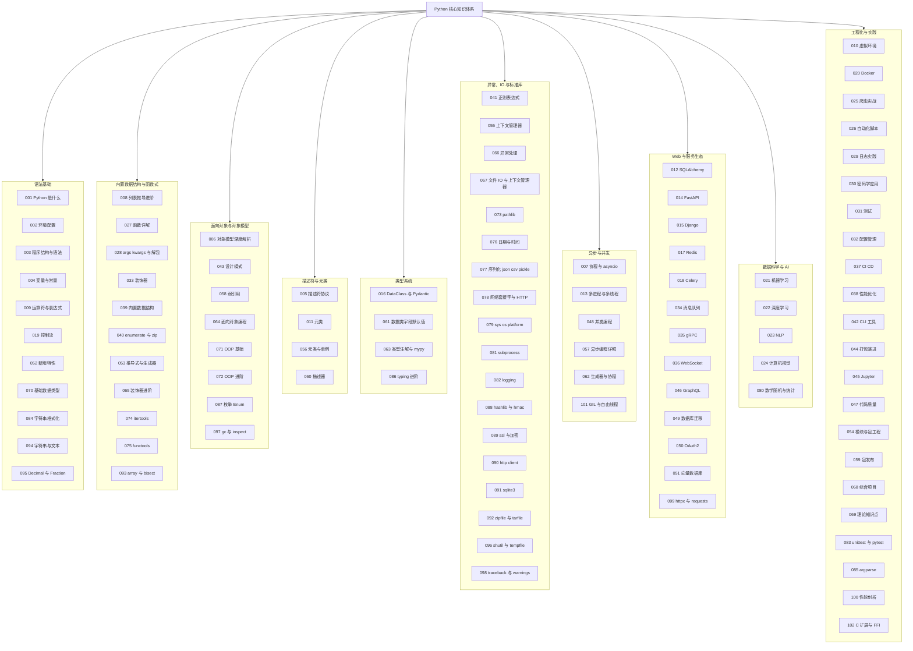

本文是对 Python 模块全部 102 篇文档的收束与回顾。我们继续使用贯穿系列的"虚拟歌手音乐平台"案例——P 主（producer）投稿歌曲、歌姬（virtual singer）开演唱会、粉丝团（fan club）用应援色统计数据——把语法、对象模型、类型系统、并发与工程生态五条主线织成一张可反复回查的知识网。每一段回顾都标注了主题出处，方便随时跳回原文精读。

## 前置知识

- [Python 是什么：最友好的第一门通用语言](/python/001-WhatIsPython)：理解 Python 的定位与"用缩进组织代码"的气质。
- [Python 基础数据类型](/python/070-BasicDataType)：int、str、bool 等类型的对象模型与不可变性。
- [面向对象编程](/python/064-OOP)：类与实例、继承、多态与魔术方法。

## 学习目标

1. 串联模块全部 102 篇文档，形成"语法基础、内置数据结构与函数式、对象模型、类型系统、异步与并发、工程生态"六层知识骨架。
2. 用统一的"虚拟歌手音乐平台"案例复述装饰器、描述符、元类、类型注解与 asyncio 协程等关键机制的惯用写法。
3. 辨析 is 与 ==、浅拷贝与深拷贝、多线程与 asyncio 等易混淆概念。
4. 掌握可变默认参数、闭包晚绑定、异常吞噬、GIL 误用等经典陷阱的成因与排查思路。
5. 明确进阶方向：FastAPI 与 Pydantic、性能剖析、自由线程与 AI 数据科学。

## 知识地图

模块 102 篇文档按主题分为十组，组内编号即学习顺序：



## 核心概念回顾

### 1. 一切皆对象：对象模型与引用语义

Python 中函数、类、模块乃至代码本身都是对象，每个对象都有身份（`id`）、类型与值；变量只是"贴在对象上的名字"，赋值传递的是引用而非副本。这一模型解释了大量"奇怪"行为：函数可以赋给变量、默认参数跨调用共享、可变对象被多处别名修改。深入讨论见[对象模型深度解析](/python/006-DataTypeObjectModelDeepDive)。

```python
# 1. 一切皆对象：函数也是对象，可以赋值、传参、存进字典
def theme_color(name: str) -> str:
    """返回歌姬的应援色。"""
    return {"初霜": "星空蓝", "南音": "月白"}.get(name, "默认白")

# 2. 函数对象赋给新名字，两个名字指向同一个函数对象
alias = theme_color
print(alias("初霜"))          # 星空蓝
print(type(alias).__name__)   # function

# 3. 变量是引用：b 与 a 指向同一个列表对象
a = ["星屑", "极光"]
b = a
b.append("回声")
print(a)                      # ['星屑', '极光', '回声']
```

### 2. 内置数据结构与推导式

list、tuple、dict、set 四大内置结构分别对应"有序可变、有序不可变、键值映射、去重集合"，复杂度与适用场景见[内置数据结构](/python/039-BuiltinDataStructure)。推导式是 Python 的标志性语法：一行完成"过滤 + 变换 + 收集"，字典与集合推导式同理；需要惰性求值时换成圆括号的生成器表达式即可。

```python
# 1. 歌单与播放量：列表 + 字典的组合使用
playlist: list[str] = ["星屑", "回声", "极光", "回声"]
plays: dict[str, int] = {"星屑": 5200, "回声": 1314, "极光": 999}

# 2. 列表推导式：筛选人气过千的歌曲（含重复，保持原顺序）
hot: list[str] = [s for s in playlist if plays.get(s, 0) > 1000]
print(hot)                    # ['星屑', '回声', '回声']

# 3. 字典推导式 + set 去重：重建去重后的播放量表
unique: dict[str, int] = {s: plays.get(s, 0) for s in set(playlist)}
print(unique)                 # {'回声': 1314, '星屑': 5200, '极光': 999}
```

### 3. 函数进阶与装饰器

Python 函数是一等公民：支持默认参数、关键字参数、`*args/**kwargs` 解包（见[函数详解](/python/027-FunctionDetailed)）。装饰器本质是"接收函数、返回新函数"的高阶函数，`@` 语法只是 `func = decorator(func)` 的糖；带参数的装饰器再多包一层，配合 `functools.wraps` 保留原函数元信息，是日志、计时、重试等横切能力的标准做法。

```python
import functools
import time

# 1. 带参数的装饰器：三层结构，最外层接收装饰器参数
def timed(label: str):
    def decorator(func):
        @functools.wraps(func)          # 保留原函数的名字与文档
        def wrapper(*args, **kwargs):
            start = time.perf_counter()
            result = func(*args, **kwargs)
            cost = time.perf_counter() - start
            print(f"[{label}] {func.__name__} 耗时 {cost:.3f}s")
            return result
        return wrapper
    return decorator

# 2. @ 等价于 sing = timed("演出")(sing)
@timed("演出")
def sing(song: str, times: int = 1) -> str:
    """登台演唱若干遍。"""
    return f"《{song}》x{times}"

print(sing("极光"))
```

### 4. 面向对象与 dataclass

Python 的类体系围绕"实例属性 + 类属性 + 方法解析顺序（MRO）"展开，魔术方法让自定义类型无缝接入语言协议：`__add__` 重载加号、`__len__` 支持 len()、`__enter__/__exit__` 支持上下文管理。`dataclasses.dataclass` 自动生成 `__init__` 与 `__repr__`，把"数据载体类"的样板代码压缩到一行装饰器，与 Pydantic 的协作见[DataClass 与 Pydantic](/python/016-DataClassPydantic)。

```python
from dataclasses import dataclass, field

# 1. dataclass 自动生成 __init__ 与 __repr__
@dataclass
class Singer:
    name: str
    color: str = "默认白"
    songs: list[str] = field(default_factory=list)  # 可变默认值必须用工厂函数

    # 2. 魔术方法重载 + 号：合并两位歌姬组成合唱团
    def __add__(self, other: "Singer") -> "Singer":
        return Singer(
            name=f"{self.name}&{other.name}",
            color=self.color,
            songs=self.songs + other.songs,
        )

# 3. 实例化后可直接用运算符组合对象
a = Singer("初霜", "星空蓝", ["星屑"])
b = Singer("南音", "月白", ["回声"])
print(a + b)                  # Singer(name='初霜&南音', color='星空蓝', songs=[...])
```

### 5. 描述符与元类

描述符是"定义了 `__get__/__set__/__delete__` 的类"，把属性读写逻辑封装成可复用组件，是 property、ORM 字段、类型校验的底层机制（见[描述符协议](/python/005-PythonDescriptorProtocol)）。元类则是"类的类"：class 语句执行时由元类的 `__new__` 控制类的创建过程，适合自动注册、接口校验等框架级需求（见[元类](/python/011-Metaclass)）。日常业务代码优先用描述符与 `__init_subclass__`，元类留给真正的框架场景。

```python
# 1. 数据描述符：把"应援色必须合法"的校验逻辑封装成可复用组件
class ThemeColor:
    """定义了 __set__，属于数据描述符，优先级高于实例属性字典。"""

    def __set_name__(self, owner: type, name: str) -> None:
        self.slot = "_" + name          # 自动记录存储槽名

    def __get__(self, obj, objtype=None) -> str:
        return getattr(obj, self.slot, "#FFFFFF")

    def __set__(self, obj, value: str) -> None:
        if not value.startswith("#"):
            raise ValueError("应援色必须以 # 开头")
        setattr(obj, self.slot, value)

# 2. 挂上描述符后，实例赋值自动触发校验
class FanClub:
    color = ThemeColor()

fc = FanClub()
fc.color = "#FF66CC"        # 正常写入
print(fc.color)
# fc.color = "粉色"          # 抛出 ValueError，非法应援色被拦截
```

### 6. 类型注解与 mypy

类型注解让 Python 获得渐进式类型系统能力：运行时不强制，配合 mypy/pyright 却能在静态检查期拦截字段拼写错误、None 传播与签名不一致。`TypedDict` 描述字典结构，`list[str]` 等内置泛型语法（PEP 585）简化了旧式 `typing.List`，进阶的 Protocol、TypeVar 与 Literal 见[类型注解与 mypy](/python/063-TypeAnnotationMypy)。

```python
from typing import TypedDict

# 1. TypedDict 描述歌曲的结构化数据
class Song(TypedDict):
    title: str
    duration: float     # 时长（秒）

# 2. 函数签名即文档：入参与出值一目了然
def total_duration(songs: list[Song]) -> float:
    return sum(s["duration"] for s in songs)

# 3. mypy 会在静态检查期发现字段拼写或类型错误
album: list[Song] = [
    {"title": "星屑", "duration": 245.0},
    {"title": "极光", "duration": 198.5},
]
print(f"专辑总时长 {total_duration(album)} 秒")
```

### 7. 迭代器、生成器与 asyncio 协程

生成器函数用 `yield` 惰性产出数据，是处理大文件、无限序列的内存友好方案；协程则把"可暂停"推到网络 IO 场景——`async def` 声明可挂起函数，`await` 让出控制权，`asyncio.gather` 并发驱动多个任务。生成器到协程的演化脉络见[推导式与生成器](/python/053-ComprehensionGenerator)与[协程与 asyncio](/python/007-CoroutineAsyncio)。

```python
import asyncio
from collections.abc import Iterator

# 1. 生成器函数：惰性产出演唱会门票，不占整块内存
def tickets(total: int) -> Iterator[int]:
    for no in range(1, total + 1):
        yield no

# 2. 协程：async def 声明，await 处让出事件循环
async def upload(song: str) -> str:
    await asyncio.sleep(0.1)            # 模拟网络等待
    return f"{song} 上传完成"

async def main() -> None:
    # 3. gather 并发执行多个协程，总耗时约等于最慢者
    results = await asyncio.gather(upload("星屑"), upload("极光"))
    print(*results, sep="\n")

asyncio.run(main())
print(sum(1 for _ in tickets(100)), "张票可售")
```

### 8. 并发选型与 GIL

Python 并发有三条路线，选型的关键是任务类型：IO 密集用多线程（等待时 GIL 释放）或 asyncio（单线程事件循环），CPU 密集必须用多进程绕开 GIL。GIL 是 CPython 保证字节码执行互斥的锁，它不是"Python 不能并发"，而是"线程不能并行执行字节码"；自由线程构建（PEP 703 方向）与迁移建议见[GIL 与自由线程](/python/101-GILAndFreeThreading)。

```python
import concurrent.futures as cf
import time

# 1. IO 密集任务：抓取多场演唱会页面，线程池是顺手的选择
def fetch(city: str) -> str:
    time.sleep(0.1)                     # 模拟网络 IO，等待期间 GIL 释放
    return f"{city} 场次已抓取"

def main() -> None:
    cities = ["上海", "东京", "首尔"]

    # 2. 线程池并发：三个请求同时等待，总耗时接近单次请求
    with cf.ThreadPoolExecutor(max_workers=3) as pool:
        for msg in pool.map(fetch, cities):
            print(msg)

if __name__ == "__main__":
    main()
    # 3. CPU 密集任务请改用 ProcessPoolExecutor 实现真并行
```

### 9. 工程化：虚拟环境、测试与打包

Python 工程化的三件套是环境隔离、测试与打包分发：`python -m venv` 建立独立依赖空间（见[虚拟环境](/python/010-PythonVirtualEnv)）；pytest 的参数化测试一张表覆盖多组用例（见[unittest 与 pytest](/python/083-UnittestPytest)）；`pyproject.toml` 统一元信息与构建配置（见[打包演进](/python/044-PythonPackagingEvolution)）。三者就位，项目才具备可复现与可协作的基本盘。

```python
# 1. 环境隔离是工程第一步：python -m venv .venv，激活后再安装依赖
# 2. 被测代码：根据点赞与转发计算应援指数
def support_index(likes: int, shares: int) -> int:
    """点赞计 2 分，转发计 3 分。"""
    return likes * 2 + shares * 3

# 3. pytest 参数化测试：一张表覆盖多组用例，命令 pytest 即可运行
import pytest

@pytest.mark.parametrize(
    ("likes", "shares", "want"),
    [(10, 0, 20), (0, 5, 15), (1, 1, 5)],
)
def test_support_index(likes: int, shares: int, want: int) -> None:
    assert support_index(likes, shares) == want
```

## 易混淆概念对比

is 与 == 是 Python 面试与 review 的高频考点：

| 对比维度 | `is` | `==` |
| --- | --- | --- |
| 语义 | 身份比较：是否同一个对象 | 值比较：内容是否相等 |
| 底层机制 | 比较 `id()` 返回值 | 调用左操作数的 `__eq__` 方法 |
| 结果稳定性 | 受小整数缓存、字符串驻留等实现细节影响 | 由类型作者定义，语义稳定 |
| 推荐用法 | `x is None`、`x is not None` | 一般业务值比较一律用 `==` |
| 常见错误 | `votes is 0` 这类写法依赖实现细节 | `config == None`（应写 `is None`） |

浅拷贝与深拷贝决定了嵌套结构的修改是否会互相污染：

| 对比维度 | 浅拷贝 `copy.copy` | 深拷贝 `copy.deepcopy` |
| --- | --- | --- |
| 复制层级 | 仅最外层容器 | 递归复制所有嵌套对象 |
| 内层对象 | 与原对象共享引用 | 完全独立的新对象 |
| 修改互影响 | 修改嵌套元素会互相影响 | 互不影响 |
| 性能开销 | 小 | 大（内部用 memo 防循环引用） |
| 典型场景 | 元素全为不可变对象的列表 | 嵌套字典、对象图、配置快照 |

## 常见误区与排查

**误区一：可变默认参数。** 默认值在函数定义时求值一次并被所有调用共享，可变默认值会跨调用累积。

```python
# 错误：第二次调用意外保留了第一次的结果
def add_song(song, playlist=[]):
    playlist.append(song)
    return playlist

print(add_song("星屑"))   # ['星屑']
print(add_song("极光"))   # ['星屑', '极光']
```

```python
# 修正：用 None 作为哨兵，函数体内再创建新列表
def add_song(song, playlist=None):
    playlist = [] if playlist is None else playlist
    playlist.append(song)
    return playlist
```

**误区二：闭包晚绑定。** 闭包捕获的是变量本身而非取值时刻，循环结束后所有闭包共享最终的循环变量。

```python
# 错误：三个 lambda 打印的全是 歌姬2
funcs = [lambda: f"歌姬{i}" for i in range(3)]
print([f() for f in funcs])
```

```python
# 修正：用默认参数在定义时固化当前值
funcs = [lambda i=i: f"歌姬{i}" for i in range(3)]
print([f() for f in funcs])   # ['歌姬0', '歌姬1', '歌姬2']
```

**误区三：遍历列表时删除元素。** 删除会让后续元素前移，迭代游标因此跳过紧邻元素。

```python
# 错误：“回响”被漏掉了，没有被检查
songs = ["星屑", "回声", "回响", "极光"]
for s in songs:
    if s.startswith("回"):
        songs.remove(s)
print(songs)              # ['星屑', '回响', '极光']
```

```python
# 修正：基于原列表重建新列表，或遍历副本 songs[:]
songs = [s for s in songs if not s.startswith("回")]
```

**误区四：静默吞掉异常。** 裸 `except: pass` 把故障藏进黑暗，数据算错也无从察觉。

```python
# 错误：任何异常都被吞掉，票数悄悄变成未定义状态
try:
    votes = int(raw)
except Exception:
    pass
```

```python
# 修正：只捕获预期的异常类型，并记录日志或给出兜底值
import logging

try:
    votes = int(raw)
except ValueError:
    logging.warning("票数格式非法: %r", raw)
    votes = 0
```

**误区五：用多线程加速 CPU 密集任务。** GIL 让线程无法并行执行字节码，CPU 密集场景多线程反而更慢。

```python
# 错误：纯计算任务用多线程，受 GIL 限制几乎无加速
import threading

def count():
    total = sum(range(10_000_000))

threads = [threading.Thread(target=count) for _ in range(4)]
```

```python
# 修正：CPU 密集任务交给进程池，绕开 GIL 实现真并行
from concurrent.futures import ProcessPoolExecutor

def count(n: int) -> int:
    return sum(range(n))

if __name__ == "__main__":  # Windows 下多进程代码必须在入口保护内
    with ProcessPoolExecutor() as pool:
        results = list(pool.map(count, [10_000_000] * 4))
```

**误区六：浅拷贝嵌套结构。** `dict.copy` 只复制外层，内层歌单仍是同一个对象，修改会互相污染。

```python
# 错误：backup 的内层列表与原对象共享
import copy

singer = {"name": "初霜", "songs": ["星屑"]}
backup = singer.copy()
backup["songs"].append("极光")
print(singer["songs"])    # ['星屑', '极光']，原数据被污染
```

```python
# 修正：嵌套结构需要深拷贝
backup = copy.deepcopy(singer)
```

## 自检清单

- [ ] 能解释"一切皆对象"：函数、类、模块都有类型与身份，变量是引用
- [ ] 能按场景选对 list、tuple、dict、set，并说出各自核心操作的复杂度
- [ ] 能写出列表、字典、集合推导式，并说明生成器表达式的惰性优势
- [ ] 能实现一个带 `functools.wraps` 的装饰器，并说清其执行时机
- [ ] 能解释 `__init__` 与 `__new__` 的分工及常用魔术方法的重载时机
- [ ] 能实现数据描述符，并说清它与实例属性字典的查找优先级
- [ ] 能用元类完成类的自动注册，并解释 type 与类的自指关系
- [ ] 能为函数与类编写类型注解，并通过 mypy 静态检查
- [ ] 能解释 GIL 的含义，并为 IO 密集与 CPU 密集任务选择正确的并发方案
- [ ] 会用 venv 隔离环境、pytest 编写参数化测试、pyproject.toml 配置打包

## 后续学习路径

1. [DataClass 与 Pydantic](/python/016-DataClassPydantic)：把类型注解升级为运行时校验的数据模型。
2. [Python FastAPI](/python/014-PythonFastAPI)：用类型驱动的方式构建高性能 Web 服务。
3. [Python CI/CD](/python/037-PythonCICD)：把测试、类型检查与发布接入持续集成流水线。
4. [性能剖析与优化](/python/100-ProfilingOptimization)：用 cProfile、line_profiler 定位热点并优化。
5. [GIL 与自由线程](/python/101-GILAndFreeThreading)：跟进 PEP 703 自由线程构建与并发选型的未来。
6. [Python 机器学习](/python/021-PythonMachineLearning)：进入 Python 最具统治力的数据科学领域。
