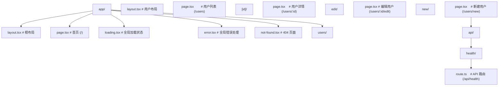

## 前置知识

- [React19 新特性](/react/006-React19NewFeatures)：建议先完成前一篇的学习

## 学习目标

- 掌握「1. React Router v7」的核心机制、典型用法与常见陷阱
- 掌握「2. 嵌套路由与布局路由」的核心机制、典型用法与常见陷阱
- 掌握「3. 数据加载（loader/action）」的核心机制、典型用法与常见陷阱
- 掌握「4. Next.js App Router」的核心机制、典型用法与常见陷阱
- 掌握「5. Server Actions」的核心机制、典型用法与常见陷阱


## 1. React Router v7

React Router v7 是 React 生态中最流行的路由库，整合了 Remix 的数据加载能力。

### 1.1 安装与基础配置

```bash
npm install react-router
```

```tsx
import { createBrowserRouter, RouterProvider } from 'react-router';
import { StrictMode } from 'react';
import { createRoot } from 'react-dom/client';

const router = createBrowserRouter([
  {
    path: '/',
    element: <Layout />,
    children: [
      { index: true, element: <Home /> },
      { path: 'about', element: <About /> },
      { path: 'users', element: <Users /> },
      { path: 'users/:id', element: <UserDetail /> },
    ],
  },
]);

createRoot(document.getElementById('root')!).render(
  <StrictMode>
    <RouterProvider router={router} />
  </StrictMode>
);
```

### 1.2 声明式路由（框架模式）

```tsx
// routes.ts
import { type RouteConfig, index, route } from '@react-router/dev/routes';

export default [
  index('routes/home.tsx'),
  route('about', 'routes/about.tsx'),
  route('users', 'routes/users.tsx'),
  route('users/:id', 'routes/user-detail.tsx'),
] satisfies RouteConfig;
```

### 1.3 导航组件

```tsx
import { Link, NavLink, useNavigate } from 'react-router';

function Navigation() {
  const navigate = useNavigate();

  return (
    <nav>
      {/* Link — 基础导航 */}
      <Link to="/">首页</Link>
      <Link to="/about">关于</Link>

      {/* NavLink — 带激活状态 */}
      <NavLink
        to="/users"
        className={({ isActive, isPending }) => (isActive ? 'active' : isPending ? 'pending' : '')}
      >
        用户
      </NavLink>

      {/* 编程式导航 */}
      <button onClick={() => navigate('/login')}>登录</button>
      <button onClick={() => navigate(-1)}>返回</button>
    </nav>
  );
}
```

### 1.4 路由参数

```tsx
import { useParams } from 'react-router';

function UserDetail() {
  const { id } = useParams<{ id: string }>();

  return <h1>用户 ID：{id}</h1>;
}
```

### 1.5 查询参数

```tsx
import { useSearchParams } from 'react-router';

function ProductList() {
  const [searchParams, setSearchParams] = useSearchParams();
  const page = searchParams.get('page') ?? '1';
  const category = searchParams.get('category') ?? '';

  const setPage = (p: number) => {
    setSearchParams((prev) => {
      prev.set('page', p.toString());
      return prev;
    });
  };

  return (
    <div>
      <p>
        第 {page} 页 | 分类：{category}
      </p>
      <button onClick={() => setPage(Number(page) + 1)}>下一页</button>
    </div>
  );
}
```

## 2. 嵌套路由与布局路由

### 2.1 嵌套路由

```tsx
const router = createBrowserRouter([
  {
    path: '/',
    element: <Layout />, // 布局组件
    children: [
      { index: true, element: <Home /> },
      {
        path: 'dashboard',
        element: <DashboardLayout />, // 子布局
        children: [
          { index: true, element: <DashboardHome /> },
          { path: 'analytics', element: <Analytics /> },
          { path: 'settings', element: <Settings /> },
        ],
      },
    ],
  },
]);
```

### 2.2 Outlet

```tsx
import { Outlet } from 'react-router';

function Layout() {
  return (
    <div>
      <header>
        <nav>导航栏</nav>
      </header>
      <main>
        <Outlet /> {/* 子路由渲染在这里 */}
      </main>
      <footer>页脚</footer>
    </div>
  );
}
```

### 2.3 布局路由（无路径）

```tsx
const router = createBrowserRouter([
  {
    // 无 path，仅作为布局容器
    element: <AuthLayout />,
    children: [
      { path: '/login', element: <Login /> },
      { path: '/register', element: <Register /> },
      { path: '/forgot-password', element: <ForgotPassword /> },
    ],
  },
]);

function AuthLayout() {
  return (
    <div className="auth-layout">
      <div className="auth-sidebar">
        <h2>欢迎</h2>
      </div>
      <div className="auth-content">
        <Outlet />
      </div>
    </div>
  );
}
```

## 3. 数据加载（loader/action）

### 3.1 Loader — 路由加载时获取数据

```tsx
import { createBrowserRouter, RouterProvider, useLoaderData } from 'react-router';

// 定义 loader
async function userLoader({ params }: { params: { id: string } }) {
  const res = await fetch(`/api/users/${params.id}`);
  if (!res.ok) throw new Response('用户不存在', { status: 404 });
  return res.json();
}

// 在路由配置中使用
const router = createBrowserRouter([
  {
    path: '/users/:id',
    element: <UserDetail />,
    loader: userLoader,
    errorElement: <UserNotFound />,
  },
]);

// 在组件中消费数据
function UserDetail() {
  const user = useLoaderData() as User;

  return (
    <div>
      <h1>{user.name}</h1>
      <p>{user.email}</p>
    </div>
  );
}
```

### 3.2 Action — 表单提交处理

```tsx
import { Form, useActionData, redirect } from 'react-router';

async function createPostAction({ request }: { request: Request }) {
  const formData = await request.formData();
  const title = formData.get('title') as string;
  const content = formData.get('content') as string;

  if (!title.trim()) {
    return { error: '标题不能为空' };
  }

  const post = await createPostAPI({ title, content });
  return redirect(`/posts/${post.id}`);
}

function NewPost() {
  const actionData = useActionData() as { error?: string };

  return (
    <Form method="post">
      <input name="title" placeholder="标题" />
      {actionData?.error && <p className="error">{actionData.error}</p>}
      <textarea name="content" placeholder="内容" />
      <button type="submit">发布</button>
    </Form>
  );
}
```

### 3.3 延迟数据（Deferred）

```tsx
import { defer, Await } from 'react-router';
import { Suspense } from 'react';

function postLoader({ params }: { params: { id: string } }) {
  // 关键数据立即加载，非关键数据延迟加载
  const post = getPost(params.id); // Promise
  const comments = getComments(params.id); // Promise

  return defer({
    post, // 等待完成
    comments, // 延迟加载
  });
}

function PostPage() {
  const data = useLoaderData() as { post: Post; comments: Promise<Comment[]> };

  return (
    <div>
      <h1>{data.post.title}</h1>
      <div>{data.post.content}</div>

      <Suspense fallback={<p>加载评论...</p>}>
        <Await resolve={data.comments}>
          {(comments) => (
            <ul>
              {comments.map((c) => (
                <li key={c.id}>{c.text}</li>
              ))}
            </ul>
          )}
        </Await>
      </Suspense>
    </div>
  );
}
```

## 4. Next.js App Router

### 4.1 文件系统路由



### 4.2 布局与模板

```tsx
// app/layout.tsx — 根布局（不会重新挂载）
export default function RootLayout({ children }: { children: React.ReactNode }) {
  return (
    <html lang="zh-CN">
      <body>
        <nav>全局导航</nav>
        {children}
      </body>
    </html>
  );
}

// app/template.tsx — 模板（路由切换时重新挂载）
export default function Template({ children }: { children: React.ReactNode }) {
  return <div className="animate-fadeIn">{children}</div>;
}
```

### 4.3 加载与错误状态

```tsx
// app/users/loading.tsx — 自动显示加载状态
export default function Loading() {
  return <UserListSkeleton />;
}

// app/users/error.tsx — 错误处理
('use client');

export default function Error({
  error,
  reset,
}: {
  error: Error & { digest?: string };
  reset: () => void;
}) {
  return (
    <div>
      <h2>出错了</h2>
      <p>{error.message}</p>
      <button onClick={reset}>重试</button>
    </div>
  );
}
```

## 5. Server Actions

Next.js Server Actions 允许从客户端直接调用服务端函数。

### 5.1 定义与调用

```tsx
// app/actions.ts
'use server';

import { revalidatePath } from 'next/cache';
import { redirect } from 'next/navigation';

export async function createPost(formData: FormData) {
  const title = formData.get('title') as string;
  const content = formData.get('content') as string;

  await db.post.create({ data: { title, content } });
  revalidatePath('/posts'); // 刷新缓存
  redirect('/posts');
}

export async function deletePost(id: string) {
  await db.post.delete({ where: { id } });
  revalidatePath('/posts');
}
```

```tsx
// app/posts/new/page.tsx
import { createPost } from '../actions';

export default function NewPostPage() {
  return (
    <form action={createPost}>
      <input name="title" required />
      <textarea name="content" required />
      <button type="submit">发布</button>
    </form>
  );
}
```

### 5.2 useActionState 配合 Server Actions

```tsx
'use client';

import { useActionState } from 'react';
import { createPost } from './actions';

export default function NewPostPage() {
  const [state, formAction, isPending] = useActionState(createPost, null);

  return (
    <form action={formAction}>
      <input name="title" required />
      <textarea name="content" required />
      <button type="submit" disabled={isPending}>
        {isPending ? '发布中...' : '发布'}
      </button>
      {state?.error && <p className="error">{state.error}</p>}
    </form>
  );
}
```

## 6. SWR

SWR 是 Vercel 开发的数据获取库，名称来自 stale-while-revalidate 缓存策略。

### 6.1 基本用法

```tsx
import useSWR from 'swr';

const fetcher = (url: string) => fetch(url).then((res) => res.json());

function UserProfile({ id }: { id: string }) {
  const { data, error, isLoading, mutate } = useSWR<User>(`/api/users/${id}`, fetcher);

  if (isLoading) return <Spinner />;
  if (error) return <Error message={error.message} />;

  return (
    <div>
      <h1>{data!.name}</h1>
      <button onClick={() => mutate()}>刷新</button>
    </div>
  );
}
```

### 6.2 全局配置

```tsx
import { SWRConfig } from 'swr';

function App() {
  return (
    <SWRConfig
      value={{
        fetcher: (url: string) => fetch(url).then((r) => r.json()),
        revalidateOnFocus: false,
        dedupingInterval: 60000,
      }}
    >
      <Router />
    </SWRConfig>
  );
}
```

### 6.3 乐观更新

```tsx
function TodoList() {
  const { data: todos, mutate } = useSWR<Todo[]>('/api/todos', fetcher);

  const toggleTodo = async (id: string) => {
    // 乐观更新
    await mutate(
      todos?.map((t) => (t.id === id ? { ...t, completed: !t.completed } : t)),
      false // 不重新验证
    );

    // 实际请求
    await fetch(`/api/todos/${id}/toggle`, { method: 'POST' });

    // 重新验证
    mutate();
  };

  return (
    <ul>
      {todos?.map((todo) => (
        <li key={todo.id} onClick={() => toggleTodo(todo.id)}>
          {todo.completed ? '' : '□'} {todo.text}
        </li>
      ))}
    </ul>
  );
}
```

## 7. React Query (TanStack Query)

React Query 是功能最全面的数据获取库，适合复杂场景。

### 7.1 基本用法

```tsx
import { QueryClient, QueryClientProvider, useQuery, useMutation } from '@tanstack/react-query';

const queryClient = new QueryClient();

function App() {
  return (
    <QueryClientProvider client={queryClient}>
      <Users />
    </QueryClientProvider>
  );
}

function Users() {
  const { data, isLoading, error } = useQuery({
    queryKey: ['users'],
    queryFn: () => fetch('/api/users').then((r) => r.json()),
    staleTime: 5 * 60 * 1000, // 5 分钟内不重新获取
  });

  if (isLoading) return <Spinner />;
  if (error) return <Error />;

  return (
    <ul>
      {data.map((user: User) => (
        <li key={user.id}>{user.name}</li>
      ))}
    </ul>
  );
}
```

### 7.2 Mutation

```tsx
function CreateUser() {
  const mutation = useMutation({
    mutationFn: (newUser: { name: string; email: string }) =>
      fetch('/api/users', {
        method: 'POST',
        headers: { 'Content-Type': 'application/json' },
        body: JSON.stringify(newUser),
      }).then((r) => r.json()),
    onSuccess: () => {
      queryClient.invalidateQueries({ queryKey: ['users'] }); // 刷新列表
    },
  });

  const handleSubmit = (e: React.FormEvent<HTMLFormElement>) => {
    e.preventDefault();
    const formData = new FormData(e.currentTarget);
    mutation.mutate({
      name: formData.get('name') as string,
      email: formData.get('email') as string,
    });
  };

  return (
    <form onSubmit={handleSubmit}>
      <input name="name" />
      <input name="email" />
      <button type="submit" disabled={mutation.isPending}>
        {mutation.isPending ? '创建中...' : '创建'}
      </button>
    </form>
  );
}
```

### 7.3 SWR vs React Query

| 特性          | SWR          | React Query  |
| :------------ | :----------- | :----------- |
| 体积          | ~4 KB        | ~13 KB       |
| 学习曲线      | 低           | 中           |
| Mutation 支持 | 基础         | 完善         |
| 离线支持      | 需要插件     | 内置         |
| 分页/无限滚动 | 基础         | 完善         |
| DevTools      | 有           | 完善         |
| 适用场景      | 简单数据获取 | 复杂数据管理 |
## useNavigate 编程式导航

**useNavigate**
`const <navigate> = useNavigate();`
```tsx
import { useNavigate } from 'react-router-dom';

function LoginButton() {
  const navigate = useNavigate();
  return <button onClick={() => navigate('/dashboard')}>登录</button>;
}
```

**navigate 签名**
`navigate(<to>, [<options>]);`
```tsx
navigate('/users');                          // 字符串路径
navigate('/users', { replace: true });        // 替换历史
navigate(-1);                                 // 后退
navigate(1);                                  // 前进
navigate({ pathname: '/u', search: '?id=1' });// 对象路径
```

**navigate options**
```tsx
navigate('/login', {
  replace: true,                              // 替换历史记录
  state: { from: '/dashboard' },             // 路由状态
});
```

---

## useParams 路径参数

**useParams**
`const <params> = useParams<<T>>();`
```tsx
import { useParams } from 'react-router-dom';

function User() {
  const { id } = useParams<{ id: string }>();
  return <div>User ID: {id}</div>;
}
```

**多个参数**
```tsx
// 路由:/users/:userId/posts/:postId
const { userId, postId } = useParams<{ userId: string; postId: string }>();
```

---

## useLocation 当前位置

**useLocation**
`const <location> = useLocation();`
```tsx
import { useLocation } from 'react-router-dom';

function Page() {
  const location = useLocation();
  // location.pathname  当前路径
  // location.search    查询字符串
  // location.hash      哈希
  // location.state     路由状态
  // location.key       唯一标识
  return <div>Current: {location.pathname}</div>;
}
```

---

## useSearchParams 查询参数

**useSearchParams**
`const [<searchParams>, <setSearchParams>] = useSearchParams();`
```tsx
import { useSearchParams } from 'react-router-dom';

function Filter() {
  const [searchParams, setSearchParams] = useSearchParams();
  const page = searchParams.get('page') ?? '1';

  const setPage = (p: number) => {
    setSearchParams({ page: String(p) });
  };
  return <button onClick={() => setPage(2)}>第 2 页</button>;
}
```

**读取多值**
```tsx
searchParams.get('q');          // 单值
searchParams.getAll('tag');     // 多值
searchParams.has('sort');       // 是否存在
```

**设置方式**
```tsx
setSearchParams({ page: '2', sort: 'desc' });
setSearchParams(prev => {
  prev.set('page', '2');
  return prev;
});
```

---

## useLoaderData 加载器数据

**useLoaderData**
`const <data> = useLoaderData() as <T>;`
```tsx
import { useLoaderData } from 'react-router-dom';

type User = { id: string; name: string };

function UserPage() {
  const user = useLoaderData() as User;
  return <h1>{user.name}</h1>;
}
```

**类型化 Loader**
```tsx
import type { LoaderFunctionArgs } from 'react-router-dom';

export async function loader({ params }: LoaderFunctionArgs) {
  const user = await fetchUser(params.id!);
  return user;
}
```

---

## useRouteError 路由错误

**useRouteError**
`const <error> = useRouteError();`
```tsx
import { useRouteError } from 'react-router-dom';

function ErrorBoundary() {
  const error = useRouteError() as Error;
  return <div>错误:{error.message}</div>;
}
```

---

## useRouteLoaderData 嵌套路由数据

**useRouteLoaderData**
`const <data> = useRouteLoaderData('<routeId>');`
```tsx
const rootData = useRouteLoaderData('root') as RootData;
```

---

## useNavigation 导航状态

**useNavigation**
`const <navigation> = useNavigation();`
```tsx
import { useNavigation } from 'react-router-dom';

function LoadingBar() {
  const navigation = useNavigation();
  // navigation.state: 'idle' | 'submitting' | 'loading'
  // navigation.location: 目标 location
  // navigation.formData: 提交的表单数据
  return navigation.state !== 'idle' ? <Spinner /> : null;
}
```

---

## useMatch 路由匹配

**useMatch**
`const <match> = useMatch('<pattern>');`
```tsx
const match = useMatch('/users/:id');
// match: { params: { id: '123' }, pathname: '/users/123', ... } | null
```

---

## useOutlet 获取 Outlet

**useOutlet**
`const <outlet> = useOutlet();`
```tsx
function Layout() {
  const outlet = useOutlet();
  return outlet ? <main>{outlet}</main> : <Empty />;
}
```

---

## useOutletContext 上下文传递

**useOutletContext**
`const <ctx> = useOutletContext<<T>>();`
```tsx
// 父组件
function Parent() {
  const [count, setCount] = useState(0);
  return <Outlet context={{ count, setCount }} />;
}

// 子组件
function Child() {
  const { count, setCount } = useOutletContext<{
    count: number;
    setCount: (n: number) => void;
  }>();
  return <button onClick={() => setCount(count + 1)}>{count}</button>;
}
```

---

## Link 与 NavLink

**Link**
`<Link to=<path> [state=<obj>] [replace]>...</Link>`
```tsx
import { Link } from 'react-router-dom';

<Link to="/users/1">用户 1</Link>
<Link to="/login" state={{ from: '/dashboard' }} replace>登录</Link>
```

**NavLink 高亮链接**
`<NavLink to=<path> [className=<fn>]>...</NavLink>`
```tsx
<NavLink
  to="/users"
  className={({ isActive, isPending }) =>
    isActive ? 'active' : isPending ? 'pending' : ''
  }
>
  用户列表
</NavLink>
```

---

## Outlet 与 Navigate

**Outlet**
`<Outlet context={<value>} />`
```tsx
<Outlet />
<Outlet context={{ user }} />
```

**Navigate 编程式重定向**
`<Navigate to=<path> [replace] [state=<obj>] />`
```tsx
<Navigate to="/login" replace state={{ from: location.pathname }} />
```

---

## Router 配置 API

**createBrowserRouter**
`const <router> = createBrowserRouter([<routes>], [<options>]);`
```tsx
import { createBrowserRouter } from 'react-router-dom';

const router = createBrowserRouter([
  {
    path: '/',
    element: <Layout />,
    errorElement: <ErrorBoundary />,
    children: [
      { index: true, element: <Home /> },
      { path: 'users/:id', element: <User />, loader: userLoader },
    ],
  },
]);
```

**RouterProvider**
`<RouterProvider router={<router>} />`
```tsx
import { RouterProvider } from 'react-router-dom';

createRoot(container).render(<RouterProvider router={router} />);
```

**defer 流式加载**
```tsx
import { defer } from 'react-router-dom';

export async function loader() {
  return defer({
    users: fetchUsers(),           // Promise
    summary: fetchSummary(),       // Promise
  });
}
```
