React 模块横跨函数组件、Hooks 原理、Fiber 并发架构与服务端组件四个层次，文档多达 47 篇。本文继续沿用"虚拟歌手音乐平台"这条主线（P 主发布歌曲、歌姬开演唱会、粉丝团投票应援），把分散的知识点重新串成一棵树，帮助你自查薄弱环节并安排二轮复习。

使用建议：知识地图负责定位，核心概念回顾负责串联，易混淆对比与误区排查负责纠偏，自检清单负责验收。全文示例围绕同一批业务对象展开，P 主、歌姬、歌曲、演唱会、应援色、粉丝团在不同框架示例中保持同名同义，便于与 Vue3、Next.js、Astro 三篇总结横向对照，理解同一需求在不同框架下的表达差异。

## 前置知识

- [概述与环境配置](/react/001-OverviewEnvSetup)：React 19 的定位、版本现状与 JSX 基础，理解声明式与组件化两大核心理念。
- [组件与 Props](/react/002-ComponentProps)：组件拆分思想与 props 单向数据流，这是所有后续示例的骨架。
- [状态与事件](/react/003-StateEvent)：useState 与事件处理的基本模式，掌握受控组件的概念。

## 学习目标

1. 能说清 useState、useEffect、useMemo、useCallback 的职责边界与依赖数组语义，判断一段逻辑该用哪一个。
2. 能把"粉丝团加入""演唱会倒计时"等逻辑封装成可复用的自定义 Hook，并保证返回值引用稳定。
3. 能画出 Fiber 双缓冲与可中断渲染的大致流程，解释 React 18 以后并发特性的由来与调度优先级的作用。
4. 能区分 Server Components 与 Client Components，并写出服务端直接取数的页面，说清两者的打包差异。
5. 能在 Context、Zustand、Redux 之间为虚拟歌手音乐平台选择合适的状态方案，并用更新频率与团队规模论证。

## 知识地图

```mermaid
flowchart TB
    subgraph R1["基础与 JSX"]
        A001["001 概述与环境配置"]
        A002["002 组件与 Props"]
        A003["003 状态与事件"]
        A006["006 React 19 新特性"]
        A011["011 JSX 深入"]
        A021["021 TypeScript 集成"]
        A027["027 设计模式"]
    end
    subgraph R2["Hooks 体系"]
        A004["004 Hooks 深入"]
        A015["015 Hooks 原理"]
        A016["016 自定义 Hook 模式"]
        A042["042 React 19 新 API"]
        A045["045 自定义 Hook 逻辑复用"]
    end
    subgraph R3["Fiber 与并发渲染"]
        A012["012 Fiber 架构"]
        A013["013 并发模式"]
        A039["039 编译器自动记忆化"]
        A043["043 可中断渲染"]
        A047["047 渲染优先级与调度"]
    end
    subgraph R4["服务端组件与全栈"]
        A010["010 Next.js 全栈"]
        A014["014 Server Components"]
        A026["026 SSR"]
        A040["040 Server 与 Client Components"]
        A041["041 Next.js App Router"]
    end
    subgraph R5["路由与数据获取"]
        A007["007 路由与数据获取"]
        A023["023 路由进阶"]
        A030["030 GraphQL"]
    end
    subgraph R6["状态与表单"]
        A005["005 Context 全局状态"]
        A017["017 状态管理方案对比"]
        A020["020 表单处理"]
    end
    subgraph R7["质量与性能"]
        A008["008 性能优化"]
        A009["009 测试工程"]
        A018["018 React 性能"]
        A019["019 错误边界"]
        A022["022 测试"]
        A044["044 错误边界与 Sentry"]
    end
    subgraph R8["工程化与跨端"]
        A031["031 微前端"]
        A036["036 Storybook"]
        A037["037 CI 与 CD"]
        A038["038 Monorepo"]
        A046["046 Vite 工具链"]
    end
    subgraph R9["专项能力"]
        A024["024 国际化"]
        A025["025 动画"]
        A028["028 WebAssembly"]
        A029["029 WebSocket"]
        A032["032 无障碍"]
        A033["033 PWA"]
        A034["034 Canvas"]
        A035["035 D3"]
    end
    R1 --> R2 --> R3 --> R4 --> R5 --> R6 --> R7 --> R8 --> R9
```



地图上有三条主线值得特别注意：Hooks 体系是日常开发的主体，绝大多数业务代码都在这一组知识内完成；Fiber 与并发渲染解释了 React 各种行为背后的"为什么"，是面试与疑难排查的分水岭；服务端组件与全栈分组则代表 React 19 之后的演进方向，也是与 Next.js 模块衔接的桥梁。时间有限时，优先保证 R1、R2、R4 三组的学习质量，R7 在项目上线前必须补齐。

## 核心概念回顾

### 1. 组件与 Props：纯函数式的 UI 描述

React 组件是"输入 props、输出 UI"的纯函数，同样的 props 必须渲染出同样的结果。演唱会卡片组件只依赖传入的 props 与回调，不持有隐藏状态，因此可以安全地被列表页、主页复用，也便于用 [Storybook](/react/036-ReactStorybook) 单独调试。理解了这一点，memo、Suspense 等优化手段才有意义。

```tsx
// components/ConcertCard.tsx：演唱会卡片组件
interface ConcertCardProps {
  title: string        // 演唱会名称
  singer: string       // 出演歌姬
  themeColor: string   // 粉丝团应援色
  onTicket: () => void // 点击购票时通知父组件
}

export default function ConcertCard({
  title,
  singer,
  themeColor,
  onTicket,
}: ConcertCardProps) {
  return (
    <article style={{ borderLeft: `4px solid ${themeColor}` }}>
      <h3>{title}</h3>
      <p>主演：{singer}</p>
      <button onClick={onTicket}>立即购票</button>
    </article>
  )
}
```

### 2. 状态与事件：useState 的函数式更新

状态变了 UI 才会重渲染，这是 React 的核心契约。更新基于"上一次状态"计算时，应使用函数式更新，避免连续 setState 之间的丢帧；事件处理函数本质是普通函数，只是通过 JSX 绑定到 DOM 事件上。这也呼应了 [Fiber 架构](/react/012-FiberArchitecture) 批量处理的调度模型。

```tsx
import { useState } from 'react'

// 播放器组件：管理当前播放歌曲与循环模式
export function Player() {
  const [current, setCurrent] = useState('星屑协奏曲')
  const [loop, setLoop] = useState(false)

  function next() {
    // 函数式更新：基于上一次状态计算，连续调用不会互相覆盖
    setCurrent((prev) => (prev === '星屑协奏曲' ? '雨声独奏' : '星屑协奏曲'))
  }

  return (
    <div>
      <p>
        正在播放：{current}（{loop ? '列表循环' : '单曲播放'}）
      </p>
      <button onClick={next}>下一首</button>
      <button onClick={() => setLoop((l) => !l)}>切换循环</button>
    </div>
  )
}
```

### 3. Hooks 三件套：useEffect、useMemo、useCallback

`useEffect` 承载数据获取、订阅等副作用，必须通过依赖数组与清理函数控制执行时机；`useMemo` 缓存昂贵的计算结果；`useCallback` 缓存函数引用，二者都是为了减少无意义的重复计算与子组件重渲染。三者共同的隐含约定是：依赖数组要如实声明，否则会读到过期闭包。

```tsx
import { useEffect, useMemo, useState } from 'react'

// 演唱会列表页：搜索过滤与副作用清理
export function ConcertList() {
  const [keyword, setKeyword] = useState('')
  const [concerts, setConcerts] = useState<{ id: number; city: string }[]>([])

  // 空依赖：仅在挂载后请求一次演出排期，卸载时中止请求
  useEffect(() => {
    const controller = new AbortController()
    fetch('/api/concerts', { signal: controller.signal })
      .then((r) => r.json())
      .then(setConcerts)
    return () => controller.abort()
  }, [])

  // useMemo：仅当排期或关键词变化时重新过滤，避免每次渲染都全量计算
  const matched = useMemo(
    () => concerts.filter((c) => c.city.includes(keyword)),
    [concerts, keyword],
  )

  return (
    <ul>
      {matched.map((c) => (
        <li key={c.id}>{c.city}场</li>
      ))}
    </ul>
  )
}
```

### 4. 自定义 Hook：逻辑复用的最小单元

自定义 Hook 是"能调用其他 Hook 的函数"，命名必须以 use 开头。它让粉丝团加入逻辑脱离具体页面，成为歌姬主页与直播间都能复用的能力，这是 [自定义 Hook 逻辑复用](/react/045-CustomHooksReuseLogic) 的核心思想。好的自定义 Hook 与普通组件一样讲究接口设计：入参明确、返回值精简、副作用自清理。

```tsx
import { useCallback, useEffect, useState } from 'react'

// 自定义 Hook：粉丝团加入逻辑，任意歌姬主页可复用
export function useFanClub(singerId: string) {
  const [joined, setJoined] = useState(false)
  const [members, setMembers] = useState(0)

  // 歌姬切换时重新拉取粉丝团人数
  useEffect(() => {
    fetch(`/api/fan-clubs/${singerId}`)
      .then((r) => r.json())
      .then((data) => setMembers(data.members))
  }, [singerId])

  const join = useCallback(async () => {
    setJoined(true)
    setMembers((m) => m + 1) // 实际项目中应先调用接口再回填
  }, [])

  return { joined, members, join }
}
```

### 5. Context 与全局状态

应援色这类"全站级"配置适合放进 Context，避免在组件树里逐层透传 props。但 Context 的每次变化会使所有消费组件重渲染，高频变化的状态应交给 [状态管理方案对比](/react/017-StateManagementSolutionComparison) 中的 Zustand 等外部仓，按切片订阅，把重渲染范围压到最小。

```tsx
import { createContext, useContext, useState, type ReactNode } from 'react'

// 应援色上下文：整站共享主题色，避免逐层传递 props
const ThemeColorContext = createContext('#7C6BFF')

// 消费侧封装：调用方无需感知 Context 细节
export function useThemeColor() {
  return useContext(ThemeColorContext)
}

export function ThemeProvider({ children }: { children: ReactNode }) {
  const [color] = useState('#7C6BFF')
  return <ThemeColorContext value={color}>{children}</ThemeColorContext>
}
```

### 6. Server Components：服务端直接取数

React 19 让服务端组件走向稳定。`async` 组件只在服务器运行，取数代码不会进入客户端 JS 包，配合流式渲染可以显著压缩首屏时间；需要交互的部分再用 `'use client'` 标注为客户端岛屿。这一模型改变了"取数必须先转圈再渲染"的旧模式，也是理解 [Next.js App Router](/react/041-NextJsAppRouter) 的前提。

```tsx
// app/singers/page.tsx：服务器组件，直接在服务端取数
interface Song {
  id: number
  title: string
  singer: string
}

// async 组件只在服务器执行，浏览器不会下载这段逻辑
export default async function SingerList() {
  const songs: Song[] = await fetch('https://api.fandex.dev/songs').then(
    (r) => r.json(),
  )

  return (
    <ul>
      {songs.map((s) => (
        <li key={s.id}>
          {s.title} - {s.singer}
        </li>
      ))}
    </ul>
  )
}
```

### 7. 列表渲染与 memo 性能优化

列表项是典型的纯展示组件，用 `memo` 包裹后，只有自身 props 变化才会重渲染；列表必须提供稳定的 key，这也是 [React 性能](/react/018-ReactPerformance) 中最基础的优化点。当列表规模上千时，还需叠加虚拟滚动与分页策略，避免一次性创建过多 DOM。

```tsx
import { memo } from 'react'

// memo：props 不变时跳过重渲染，适合列表项这类纯展示组件
const SongItem = memo(function SongItem({
  title,
  singer,
}: {
  title: string
  singer: string
}) {
  return (
    <li>
      {title} - {singer}
    </li>
  )
})

export function SongList({
  songs,
}: {
  songs: { id: number; title: string; singer: string }[]
}) {
  return (
    <ul>
      {songs.map((s) => (
        <SongItem key={s.id} title={s.title} singer={s.singer} />
      ))}
    </ul>
  )
}
```

### 8. 并发渲染：useDeferredValue 让输入不卡顿

并发模式的落地形态之一是"低优先级降级"。搜索框输入是高优先级更新，立即响应；过滤结果的计算则交给 `useDeferredValue` 降级渲染，键盘再快界面也不会卡住，这正是 [渲染优先级与调度](/react/047-RenderingPriorityAndScheduling) 要解决的问题。类似的还有 `useTransition`，用于把整段更新标记为可中断的过渡任务。

```tsx
import { useDeferredValue, useState } from 'react'

// 歌曲搜索：输入立即回显，结果列表延迟计算
export function SongSearch({ songs }: { songs: string[] }) {
  const [keyword, setKeyword] = useState('')
  // deferredKeyword 滞后于 keyword，触发低优先级重渲染
  const deferredKeyword = useDeferredValue(keyword)

  const matched = songs.filter((s) => s.includes(deferredKeyword))

  return (
    <>
      <input
        value={keyword}
        onChange={(e) => setKeyword(e.target.value)}
        placeholder="搜索歌曲或 P 主"
      />
      <ul>
        {matched.map((s) => (
          <li key={s}>{s}</li>
        ))}
      </ul>
    </>
  )
}
```

## 易混淆概念对比

### useMemo 与 useCallback

| 对比项 | useMemo | useCallback |
| --- | --- | --- |
| 缓存对象 | 计算结果（任意值） | 函数引用 |
| 返回值 | 执行工厂函数的返回值 | 原函数的 memoized 版本 |
| 典型场景 | 过滤、排序等昂贵计算 | 传给 memo 子组件或事件回调 |
| 依赖作用 | 依赖变化才重新计算 | 依赖变化才生成新函数 |
| 常见误用 | 给廉价计算也包一层，反而更慢 | 单独使用而不配合 memo 子组件 |

### Server Components 与 Client Components

| 对比项 | Server Components | Client Components |
| --- | --- | --- |
| 运行环境 | 仅服务器 | 服务器渲染首屏加浏览器运行 |
| 可用能力 | async/await、直连数据库、密钥 | useState、useEffect、事件、浏览器 API |
| 打包结果 | 不进入客户端 JS 包 | 进入客户端 JS 包 |
| 声明方式 | 默认（无需指令） | 文件顶部 `'use client'` |
| 交互能力 | 不支持 onClick 等事件 | 完整交互能力 |
| 典型用途 | 列表页、详情页等静态取数 UI | 播放器、弹窗、表单等交互 UI |

## 常见误区与排查

### 误区 1：直接修改 state 数组或对象

```tsx
// 错误：原地 push 不会触发重渲染
songs.push(newSong)
setSongs(songs)

// 修正：基于旧状态创建新数组
setSongs((prev) => [...prev, newSong])
```

### 误区 2：useEffect 漏写依赖数组

```tsx
// 错误：没有依赖数组，每次渲染都发请求
useEffect(() => {
  fetch('/api/concerts').then((r) => r.json()).then(setConcerts)
})

// 修正：空依赖表示只在挂载后执行一次
useEffect(() => {
  fetch('/api/concerts').then((r) => r.json()).then(setConcerts)
}, [])
```

### 误区 3：用数组下标作为列表 key

```tsx
// 错误：收藏或排序后，下标与内容错位，组件状态串行
{songs.map((s, i) => <SongItem key={i} title={s.title} />)}

// 修正：使用数据中稳定的唯一标识
{songs.map((s) => <SongItem key={s.id} title={s.title} />)}
```

### 误区 4：在条件或循环中调用 Hooks

```tsx
// 错误：提前 return 后 Hook 调用次数变化，违反 Hooks 规则
if (!singerId) return <p>未选择歌姬</p>
useEffect(() => loadFans(singerId), [singerId])

// 修正：所有 Hook 调用置于组件顶部，条件只影响 Hook 内部逻辑
useEffect(() => {
  if (singerId) loadFans(singerId)
}, [singerId])
if (!singerId) return <p>未选择歌姬</p>
```

### 误区 5：在 Server Components 里使用状态与事件

```tsx
// 错误：服务器组件不支持 useState 与 onClick
export default function VoteButton() {
  const [count, setCount] = useState(0) // 构建直接报错
  return <button onClick={() => setCount(count + 1)}>投票 {count}</button>
}

// 修正：交互部分独立成文件，顶部声明 'use client'
'use client'
export function VoteButton() {
  const [count, setCount] = useState(0)
  return <button onClick={() => setCount(count + 1)}>投票 {count}</button>
}
```

### 误区 6：副作用忘记清理导致重复订阅

```tsx
// 错误：组件反复挂载后，同一个直播间被订阅了多次
useEffect(() => {
  socket.on('concert', handleUpdate)
}, [])

// 修正：返回清理函数，卸载时移除监听
useEffect(() => {
  socket.on('concert', handleUpdate)
  return () => socket.off('concert', handleUpdate)
}, [])
```

### 误区 7：把派生数据复制进 state

props 或全局状态变化后，复制出来的 state 不会跟着更新，界面出现"鬼数据"。应答式思维是：能从现有状态推导出来的值，就不要存。

```tsx
// 错误：复制 props 到 state，props 更新后列表不同步
const [list, setList] = useState(songs)

// 修正：渲染期直接从 props 派生，计算昂贵时用 useMemo 缓存
const list = useMemo(() => songs.filter((s) => s.liked), [songs])
```

### 误区 8：useEffect 更新自身依赖造成死循环

```tsx
// 错误：修改了自己依赖的状态，无限重渲染直至浏览器崩溃
const [count, setCount] = useState(0)
useEffect(() => {
  setCount(count + 1)
}, [count])

// 修正：定时类需求用函数式更新加清理函数，依赖保持为空
useEffect(() => {
  const id = window.setInterval(() => setCount((c) => c + 1), 1000)
  return () => window.clearInterval(id)
}, [])
```

## 自检清单

- [ ] 能用自己的话解释 React"UI 是状态的函数"这一声明式模型，并对比命令式操作 DOM 的差异。
- [ ] 能准确说出 useEffect 三种依赖形态（无数组、空数组、有依赖）的执行时机。
- [ ] 能解释 useMemo 与 useCallback 各自缓存的对象，并判断什么情况下不该使用。
- [ ] 能把任意一段页面逻辑重构成自定义 Hook，并说明 return 出去的值如何保持稳定。
- [ ] 能画出 Fiber 双缓冲（current 与 workInProgress）交替复用的示意图，并解释 lanes 的作用。
- [ ] 能解释为什么长列表输入卡顿可以用 useDeferredValue 缓解，以及它与 useTransition 的差别。
- [ ] 能判断一个组件应该是 Server Component 还是 Client Component，并说出打包层面的依据。
- [ ] 能为虚拟歌手音乐平台选定一个状态方案，并说明 Context 高频更新的缺陷与拆分思路。
- [ ] 能说出错误边界的捕获范围，以及它捕获不了哪些错误（事件回调、异步任务、服务端组件等）。
- [ ] 能在测试中用 Testing Library 验证"点击投票按钮后人数加一"的完整交互。

## 后续学习路径

1. 复习 [Hooks 原理](/react/015-HooksPrinciple)，理解闭包链表与 Hooks 规则背后的实现，很多"灵异 bug"都能在这一篇找到答案。
2. 深入 [Fiber 架构](/react/012-FiberArchitecture) 与 [并发模式](/react/013-ConcurrentMode)，补齐可中断渲染的知识闭环，再看 [可中断渲染](/react/043-ConcurrentRenderInterruptible) 验证理解。
3. 攻克 [Server Components](/react/014-ServerComponents) 与 [Server 和 Client Components](/react/040-ServerClientComponents)，掌握 RSC 时代的心智模型与组合边界。
4. 跟进 [React 19 新 API](/react/042-React19NewAPI)，练习 use、useOptimistic、useActionState 的实战写法，为表单类需求换装。
5. 系统学习 [状态管理方案对比](/react/017-StateManagementSolutionComparison)，结合团队规模与更新频率为项目选定长期方案。
6. 补齐 [错误边界与 Sentry](/react/044-ErrorBoundarySentry)，让线上问题可观测、可归因，再配合 [测试工程](/react/009-TestEngineering) 建立回归防护。
7. 进入 [Next.js App Router](/react/041-NextJsAppRouter)，把本模块知识迁移到元框架的全栈场景，衔接 Next.js 模块的学习。
8. 浏览 [React 19 新特性](/react/006-React19NewFeatures) 与 [编译器自动记忆化](/react/039-ReactCompilerAutoMemoization)，了解 useMemo、useCallback 在编译器时代将如何被自动接管。
