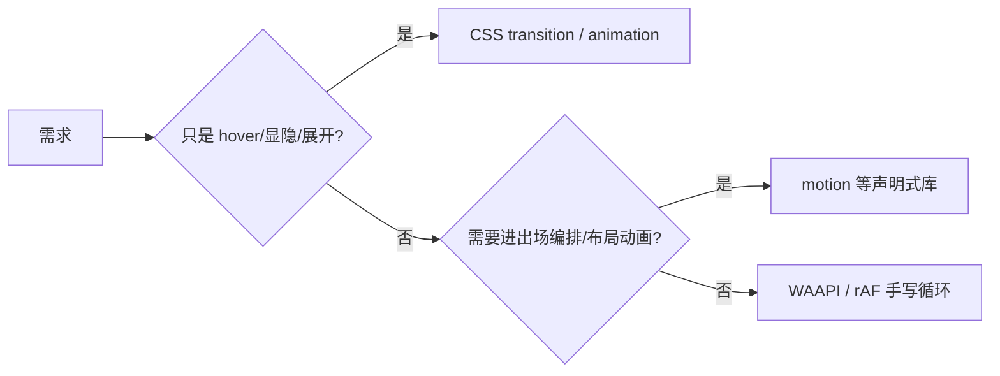

## 1. 一句话理解

React 本身没有动画 API——它只负责"决定界面长什么样"，动画是**样式随时间的变化**，由 CSS、Web Animations API（WAAPI）或 JS 库执行。React 与动画的正确关系是**状态驱动的开关**：React 把状态画成 className/属性，动画引擎接管两次状态之间的过渡。选型从下往上：能用 CSS 过渡解决的不上库；需要"布局级"动画（元素在列表间移动、进出场编排）再上 motion（Framer Motion 的新名字）等声明式库；帧级精细控制才写 rAF。



## 2. 第一层：CSS 过渡与动画，状态做开关

核心模式：React 只切换状态（布尔、data 属性），样式表里的 `transition` 负责补间：

```tsx
import { useState } from 'react';

export function Collapsible({ title, children }: { title: string; children: React.ReactNode }) {
  const [open, setOpen] = useState(false);
  return (
    <div className="collapse" data-open={open}> {/* data 属性驱动样式，无内联样式 */}
      <button onClick={() => setOpen((v) => !v)}>{title}</button>
      <div className="collapse-body">{children}</div>
    </div>
  );
}
```

```css
/* CSS 侧：transform 与 opacity 是合成器属性，动画期间不触发布局重算 */
.collapse-body {
  transform-origin: top;
  transform: scaleY(0);
  opacity: 0;
  transition: transform 0.25s ease, opacity 0.2s ease; /* 声明"怎么变" */
}
.collapse-body[data-open='true'] {
  transform: scaleY(1);
  opacity: 1;
}
```

`transition`（A 状态到 B 状态的补间）与 `animation`（用 `@keyframes` 定义多段关键帧、可自动播放/循环）的分工：前者做交互反馈，需要"起点/终点"两个状态成对出现；后者做入场、加载指示等无需成对状态、可独立播放的动画。

## 3. 退场动画：React 的天然难题

CSS 能轻松做"出现"动画，但"消失"动画要求元素**先播完动画再卸载**——而 React 的卸载是同步的。手写方案是延迟卸载：

```tsx
import { useEffect, useRef, useState } from 'react';

function FadeOut({ show, onClose }: { show: boolean; onClose: () => void }) {
  // visible：真正控制挂载的内部状态，比外部 show "晚死"
  const [visible, setVisible] = useState(show);
  const timer = useRef<number>();

  useEffect(() => {
    if (show) {
      setVisible(true); // 出现：立即挂载，CSS 下一帧播入场
    } else if (visible) {
      // 消失：先切样式触发退场动画，动画结束后再真正卸载
      timer.current = window.setTimeout(() => setVisible(false), 250);
    }
    return () => window.clearTimeout(timer.current);
  }, [show, visible]);

  if (!visible) return null;
  return (
    <div className={show ? 'fade-enter' : 'fade-exit'}>
      <button onClick={onClose}>关闭</button>
    </div>
  );
}
```

这段逻辑（进出场状态机）在每个项目里都会重复，所以生产中直接用库的 `AnimatePresence`：

```tsx
import { AnimatePresence, motion } from 'motion/react'; // framer-motion 的新包名

function Toast({ show, onClose }: { show: boolean; onClose: () => void }) {
  return (
    <AnimatePresence> {/* 子元素卸载时先播放 exit 动画 */}
      {show && (
        <motion.div
          initial={{ opacity: 0, y: 20 }}   // 挂载起点
          animate={{ opacity: 1, y: 0 }}    // 正常态
          exit={{ opacity: 0, y: 20 }}      // 卸载前播的退场
          transition={{ duration: 0.25 }}
        >
          <button onClick={onClose}>知道了</button>
        </motion.div>
      )}
    </AnimatePresence>
  );
}
```

## 4. 布局动画与列表 FLIP

"元素换了个位置，从旧位置平滑滑到新位置"这类动画手写需要 FLIP 技巧（记录旧位置 -> 翻转 -> 播放到新位置），motion 用 `layout` 属性一行声明。经典场景是 Tab 下划线指示条：

```tsx
import { motion } from 'motion/react';
import { useState } from 'react';

const TABS = ['推荐', '关注', '热榜'] as const;

export function Tabs() {
  const [active, setActive] = useState<(typeof TABS)[number]>('推荐');
  return (
    <div style={{ display: 'flex', gap: 16 }}>
      {TABS.map((tab) => (
        <button key={tab} onClick={() => setActive(tab)} style={{ position: 'relative' }}>
          {tab}
          {active === tab && (
            /* layoutId 相同的元素在 DOM 位置变化时自动做位移动画 */
            <motion.span layoutId="underline" style={{ position: 'absolute', bottom: -2, height: 2, background: '#333', insetInline: 0 }} />
          )}
        </button>
      ))}
    </div>
  );
}
```

预期渲染行为：点击另一个 Tab 时，2px 下划线不是"消失再出现"，而是从旧 Tab 平滑滑到新 Tab 下方——这正是 FLIP 的效果，由 `layoutId` 自动完成。

## 5. WAAPI 与 rAF：需要时手写

**Web Animations API** 是浏览器的原生关键帧引擎，适合一次性、程序化的动画（如提示抖动）：

```tsx
import { useRef } from 'react';

function ShakeButton() {
  const ref = useRef<HTMLButtonElement>(null);
  function shake() {
    ref.current?.animate(
      [
        { transform: 'translateX(0)' },
        { transform: 'translateX(-6px)' },
        { transform: 'translateX(6px)' },
        { transform: 'translateX(0)' },
      ],
      { duration: 300, iterations: 1, easing: 'ease-in-out' },
    );
  }
  return <button ref={ref} onClick={shake}>抖一下</button>;
}
```

**rAF 循环**用于逐帧控制（Canvas、物理模拟、进度驱动）。关键是**帧数据走 ref，不进 state**——每秒 60 次 setState 会把 React 拖垮，只有"人眼关心的结果"才落地成 state：

```tsx
import { useEffect, useRef, useState } from 'react';

function Spinner() {
  const [angle, setAngle] = useState(0);          // state 只存"要显示的值"
  useEffect(() => {
    let rafId: number;
    const tick = () => {
      setAngle((a) => (a + 6) % 360);            // 每帧 +6 度
      rafId = requestAnimationFrame(tick);
    };
    rafId = requestAnimationFrame(tick);
    return () => cancelAnimationFrame(rafId);    // 卸载必须取消，否则内存泄漏
  }, []);
  return <div style={{ transform: `rotate(${angle}deg)` }}>转</div>;
}
```

## 6. 尊重用户的动效偏好

前庭障碍用户会在系统里开启"减少动态效果"，动画实现要主动尊重：

```tsx
const reduce = window.matchMedia('(prefers-reduced-motion: reduce)').matches;
if (!reduce) animate(); // CSS 侧等价写法：@media (prefers-reduced-motion: reduce) { * { transition: none !important; } }
```

motion 库内置该支持（`MotionConfig reducedMotion="user"`）；自定义 CSS 动画需要自己写媒体查询兜底。

## 7. 常见陷阱

- **动画非合成属性**：给 `width`/`top`/`margin` 加 transition 会逐帧触发布局重排；优先 `transform`（位移/缩放/旋转）与 `opacity`。
- **display: none 无法过渡**：`display` 是离散属性，没有中间值；显隐过渡要配合 `visibility`/`opacity`/`transform`，或推迟卸载（第 3 节）。
- **key 改变导致动画重播**：列表 key 抖动会让 React 销毁重建元素，入场动画反复播放；key 必须是稳定 ID。
- **每帧 setState 大列表**：rAF 里对几百个元素逐帧 setState 会掉帧；帧内数据放 ref + 直接操作 DOM/Canvas，或只把最终值 setState。
- **StrictMode 下 Effect 双跑**：开发模式 Effect 执行两次，rAF/`el.animate` 未正确清理会叠加两个循环；清理函数必须对称。
- **动画库版本混淆**：Framer Motion 已更名为 `motion`（包名 `motion/react`），`framer-motion` 包仍可用但新项目建议用新名；从旧教程抄 import 前先确认包名。

## 8. 小结

初学者要点：

- React 只切状态，CSS 过渡负责补间；用 data 属性/class 表达状态，动画属性优先 `transform` + `opacity`。
- 退场动画的本质是"延迟卸载"，手写超时状态机或用 motion 的 `AnimatePresence`。
- rAF 循环必须清理；帧数据别 setState，只把需要展示的值落地。

进阶注意：

- 分层选型：CSS（交互反馈）-> motion（进出场、layout/FLIP 编排）-> WAAPI/rAF（程序化、逐帧）。
- Tab 指示条、列表重排这类布局动画用 `layoutId`/`layout` 声明，避免手写 FLIP。
- 无条件尊重 `prefers-reduced-motion`，这是无障碍要求的一部分（见[React 无障碍](/react/320-ReactAccessibility)）。

## 速查

**CSS 状态驱动**

```tsx
<div className="panel" data-open={open} /> {/* React 只切状态 */}
/* CSS 负责 transition: transform .25s, opacity .2s */
```

**motion 进出场**

```tsx
import { AnimatePresence, motion } from 'motion/react';
<AnimatePresence>
  {show && <motion.div initial={{ opacity: 0 }} animate={{ opacity: 1 }} exit={{ opacity: 0 }} />}
</AnimatePresence>
```

**layoutId 布局动画（FLIP）**

```tsx
{active && <motion.span layoutId="underline" />} {/* 同 id 元素位移自动补间 */}
```

**requestAnimationFrame**

```tsx
useEffect(() => {
  let rafId: number;
  const tick = () => {
    setAngle((a) => (a + 1) % 360);
    rafId = requestAnimationFrame(tick);
  };
  rafId = requestAnimationFrame(tick);
  return () => cancelAnimationFrame(rafId);
}, []);
```

**Web Animations API**

```tsx
const anim = el.animate(
  [{ transform: 'translateX(0px)' }, { transform: 'translateX(100px)' }],
  { duration: 500, iterations: Infinity, easing: 'ease-in-out' },
);
return () => anim.cancel(); // cleanup
```

**动效偏好**

```tsx
const reduce = window.matchMedia('(prefers-reduced-motion: reduce)').matches;
if (!reduce) animate();
```
