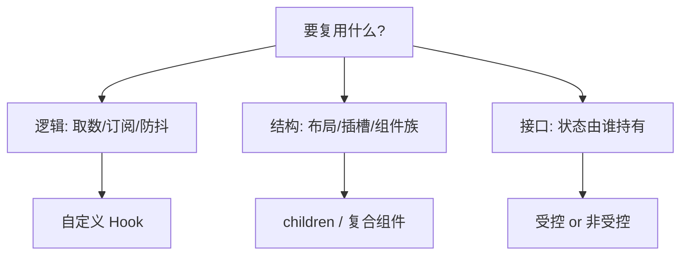

## 1. 一句话理解

React 设计模式回答一个反复出现的问题：**几个组件要共享"结构"或"行为"时，代码放在哪里**。Hooks 时代之前答案是 HOC 和 render props；Hooks 之后答案收敛为一句话——**逻辑复用用自定义 Hook，结构复用用组合，接口设计看受控/非受控**。旧模式没有作废，但要放回历史坐标里看：什么场景仍然适用、什么场景该被替代。



## 2. 组合优于继承：children 与具名插槽

React 没有继承组件的惯用法，靠的是**组合**——props 可以是任何 ReactNode，父组件把 JSX"填"进子组件的预留位置：

```tsx
import { type ReactNode } from 'react';

// 单插槽：children 就是预留位
function Card({ title, children }: { title: string; children: ReactNode }) {
  return (
    <section className="card">
      <header>{title}</header>
      <div className="card-body">{children}</div>
    </section>
  );
}

// 多插槽：用 props 当"具名插槽"（类似 Vue 的 slot）
function Modal({ header, footer, children }: { header: ReactNode; footer: ReactNode; children: ReactNode }) {
  return (
    <div className="modal">
      <div className="modal-header">{header}</div>
      <main>{children}</main>
      <div className="modal-footer">{footer}</div>
    </div>
  );
}

// 用法：结构由调用方注入，Modal 不需要知道内容长什么样
<Modal header={<h2>删除确认</h2>} footer={<><button>取消</button><button>删除</button></>}>
  确定要删除这条记录吗？此操作不可撤销。
</Modal>
```

组合优于继承的实质：**改"里面"而不改"外面"**。给 Card 塞新内容不需要改 Card，也不需要为每种内容建子类。

## 3. 接口模式：受控与非受控

表单类/开关类组件要同时支持两种用法，这是组件库（如 Radix、Ant Design）的通用设计：

- **受控**：状态由调用方持有，`value` + `onChange` 双向打通——调用方完全掌控；
- **非受控**：组件内部自持状态，`defaultValue` 起步，需要时用 ref/回调通知。

```tsx
interface SwitchProps {
  checked?: boolean;                 // 受控值（可选）
  defaultValue?: boolean;            // 非受控初值
  onChange?: (next: boolean) => void;
}

export function Switch({ checked, defaultValue = false, onChange }: SwitchProps) {
  // 内部状态兜底：受控时以 props 为准，非受控时用自己的 state
  const [inner, setInner] = useState(defaultValue);
  const isControlled = checked !== undefined;
  const value = isControlled ? checked : inner;

  function toggle() {
    const next = !value;
    if (!isControlled) setInner(next); // 非受控才动内部状态
    onChange?.(next);                  // 两种模式都通知
  }

  return <button role="switch" aria-checked={value} onClick={toggle} />;
}
```

选择标准：状态需要被页面其他部分读取/联动时受控；独立自治的小组件用非受控降低调用成本。`isControlled ? checked : inner` 这个"双轨合一"就是全部秘密。

## 4. 复合组件：一个家族共享隐式上下文

Tabs、Accordion、Menu 这类"多个部件协作"的组件适合复合组件模式：**对外是一个对象上的多个成员，对内靠 Context 通信**。调用方像写 HTML 一样自由组装：

```tsx
import { createContext, useContext, useState, type ReactNode } from 'react';

const TabsCtx = createContext<{ active: string; setActive: (v: string) => void } | null>(null);

export function Tabs({ defaultValue, children }: { defaultValue: string; children: ReactNode }) {
  const [active, setActive] = useState(defaultValue);
  return <TabsCtx.Provider value={{ active, setActive }}>{children}</TabsCtx.Provider>;
}

export function TabList({ children }: { children: ReactNode }) {
  return <div role="tablist" style={{ display: 'flex', gap: 8 }}>{children}</div>;
}

export function Tab({ value, children }: { value: string; children: ReactNode }) {
  const ctx = useContext(TabsCtx);
  if (!ctx) throw new Error('<Tab> 必须在 <Tabs> 内使用');
  return (
    <button role="tab" aria-selected={ctx.active === value} onClick={() => ctx.setActive(value)}>
      {children}
    </button>
  );
}

export function TabPanel({ value, children }: { value: string; children: ReactNode }) {
  const ctx = useContext(TabsCtx);
  return ctx?.active === value ? <div role="tabpanel">{children}</div> : null;
}

// 用法：部件顺序、数量由调用方决定，状态由家族内部消化
<Tabs defaultValue="a">
  <TabList>
    <Tab value="a">基本资料</Tab>
    <Tab value="b">安全设置</Tab>
  </TabList>
  <TabPanel value="a">昵称：张三</TabPanel>
  <TabPanel value="b">已开启两步验证</TabPanel>
</Tabs>
```

预期渲染行为：初始显示"基本资料"面板；点击"安全设置"后只有对应面板出现，Tab 上 `aria-selected` 同步切换。这就是复合组件的价值：**调用方不接触任何状态管理代码，却能自由编排结构**。

## 5. 逻辑复用：容器/展示模式与它的现代继任者

"容器组件取数、展示组件画界面"（container/presentational）是类时代的经典分层。Hooks 出现后**容器层被自定义 Hook 吸收**——取数逻辑进了 Hook，"组件"只剩一个：

```tsx
// 旧：UserListContainer 取数 + UserList 展示（两个组件）
// 新：useUsers Hook + UserList 组件（一个 Hook + 一个组件）
function UserListPage() {
  const { users, loading } = useUsers(); // 逻辑在 Hook 里，见 react/045
  if (loading) return <p>加载中...</p>;
  return <UserList users={users} />;
}
```

**HOC**（`withAuth(Component)`）与 **render props**（`{({ data }) => ...}`）同理降级：HOC 的嵌套地狱与 props 遮蔽问题在 Hook 时代没有了存在必要，只在包装第三方类组件（如 Redux `connect` 的历史代码）时还会遇到；render props 在"需要把渲染时机交给调用方"的场景偶尔仍是最直接表达，但九成场合 `children` 或 Hook 已足够。

## 6. Provider 组合与精确订阅

应用变大后 `<A><B><C>{children}</C></B></A>` 的 Provider 嵌套很深，用组合函数收敛成一层：

```tsx
function ComposeProviders({ providers, children }: {
  providers: React.ComponentType<{ children: React.ReactNode }>[];
  children: React.ReactNode;
}) {
  return providers.reduceRight(
    (acc, Provider) => <Provider>{acc}</Provider>, // 从右向左包裹
    children,
  );
}
// 用法：<ComposeProviders providers={[ThemeProvider, AuthProvider, QueryProvider]}>...</ComposeProviders>
```

另一个高频诉求是"只订阅 Context 的一部分"——Context 本身没有 selector（value 变化通知所有消费者），两条路：**拆分多个小 Context**（零依赖），或社区库 `use-context-selector` 提供 `useContextSelector(Ctx, s => s.field)` 精确订阅。组件库与大应用通常选择前者。

## 7. 常见陷阱

- **复合组件忘记抛错**：`<Tab>` 用在 `<Tabs>` 外时 `useContext` 返回 null，不检查会得到晦涩的 undefined 错误；在子组件里显式 `if (!ctx) throw`。
- **用 props 层层透传当插槽**（prop drilling）：中间组件被迫搬运十个 props；跨层共享改用组合或 Context，见[Context 全局状态](/react/050-ContextGlobalState)。
- **把 Hook 当 HOC 用出条件分支**：Hook 不能条件调用；需要"条件启用逻辑"时把 Hook 拆小，在组件里组合，而不是写 `if (need) useXxx()`。
- **HOC 丢静态方法与 ref**：包装后的组件类型丢失原组件的静态成员与 ref 转发（旧代码坑），迁移时优先改为 Hook。
- **受控组件半吊子**：只传 `value` 不传 `onChange`，组件永远不可交互；要么双轨都接，要么走非受控。
- **Context 当 selector 用**：value 是新对象就广播全部消费者，别指望 React 帮你 diff 内容；见[状态管理方案对比](/react/170-StateManagementSolutionComparison)的 Context 一节。

## 8. 小结

初学者要点：

- 结构复用靠组合：`children` 是单插槽，props 传 ReactNode 是具名插槽；不要寻找"继承"。
- 开关/表单类组件设计成"受控 or 非受控"双轨接口：`isControlled ? checked : inner`。
- 多部件协作组件用复合组件模式：Context + 家族成员，调用方自由组装。

进阶注意：

- 逻辑复用的唯一现代答案是自定义 Hook（容器/HOC/render props 依次被吸收或降级）。
- Provider 深嵌套用 `reduceRight` 组合收敛为一层；Context 精确订阅靠拆分小 Context 或 `use-context-selector`。
- 模式是手段不是目的：先问"复用的是逻辑、结构还是状态持有权"，再对号入座。

## 速查

**组合（插槽）**

```tsx
function Modal({ header, footer, children }: { header: ReactNode; footer: ReactNode; children: ReactNode }) {
  return <div><div>{header}</div>{children}<div>{footer}</div></div>;
}
```

**受控/非受控双轨**

```tsx
const isControlled = checked !== undefined;
const value = isControlled ? checked : inner;
function toggle() { const n = !value; if (!isControlled) setInner(n); onChange?.(n); }
```

**复合组件骨架**

```tsx
const Ctx = createContext<... | null>(null);
function Family({ children }) { const [v, setV] = useState(); return <Ctx.Provider value={{ v, setV }}>{children}</Ctx.Provider>; }
function Member(props) { const ctx = useContext(Ctx); if (!ctx) throw new Error('必须在 Family 内'); }
```

**Provider 组合**

```tsx
function withProviders(...providers: ComponentType<{children: ReactNode}>[]) {
  return (Comp: ComponentType) => (props: any) =>
    providers.reduceRight((acc, P) => <P>{acc}</P>, <Comp {...props} />);
}
```

**Context Selector 模式（社区库）**

```tsx
import { createContext, useContextSelector } from 'use-context-selector';
const value = useContextSelector(Ctx, (s) => s.field); // 只在该字段变化时重渲染
// 无依赖方案：拆成多个小 Context，各订阅各的
```

**Factory Component 模式**

```tsx
// 按配置生成组件：预设 + 透传
function createInput(type: string) {
  return (props: React.ComponentProps<'input'>) => <input type={type} {...props} />;
}
const PhoneInput = createInput('tel');
```
