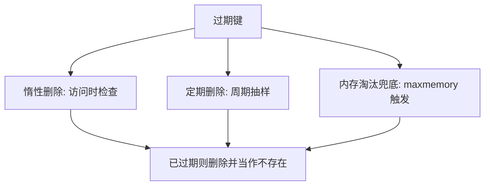

## 1. 学习目标与前置知识

- 前置：会 SET/GET 等基础读写。
- 学完本篇你将能：
  1. 说清「过期（expiry）」与「淘汰（eviction）」的区别——前者是键到
     期自动删除，后者是内存不足时的丢卒保车（见《内存淘汰策略》）；
  2. 掌握过期键的三种删除时机与主从/持久化下的行为差异；
  3. 用 NX/XX/GT/LT 精确控制 EXPIRE；
  4. 用 UNLINK 与 lazyfree 配置避免大键删除阻塞。

## 2. 过期键是怎么被删除的

Redis 不启动一个「定时器线程」逐键倒计时（每键一个定时器开销太大），
而是三种时机配合，把删除成本摊平：



1. **惰性删除**：任何读写命令执行前检查 TTL，过期即删除。CPU 友好，
   但「没人访问的过期键」会滞留内存。
2. **定期删除**：默认每 100ms（hz=10）一轮，在每个库随机抽约 20 个
   设置了过期的键，删掉其中已过期的；过期比例超过 25% 就再抽一轮，
   单轮限时约 25ms，兼顾内存回收与不阻塞主线程。
3. **兜底**：长期无人访问的过期键最终被内存淘汰策略或 AOF 重写/RDB
   生成清理。

**主从与持久化下的三条规则**（面试与排障高频）：

- 从库**不主动删**过期键，等主库删除后同步 DEL；因此读从库可能短暂
  读到「已过期但未同步」的数据（Redis 3.2 起从库对读请求做逻辑过滤，
  返回上与主库一致，但数据仍占内存）。
- RDB 生成与加载时跳过过期键。
- AOF：主库执行过期删除时向 AOF 追加一条 DEL/UNLINK；重写时跳过过期键。

## 3. EXPIRE 的四个条件选项（Redis 7.0+）

`EXPIRE/PEXPIRE/EXPIREAT/PEXPIREAT` 支持后缀选项，避免「先 TTL 再判断
再设置」的竞态：

```redis
-- NX: 仅当键【没有】过期时间时设置（保守刷新）
EXPIRE cache:cfg 600 NX
-- XX: 仅当键【已有】过期时间时设置
EXPIRE cache:cfg 600 XX
-- GT: 仅当新过期时间【晚于】当前时设置
EXPIRE cache:cfg 600 GT
-- LT: 仅当新过期时间【早于】当前时设置（缩短寿命）
EXPIRE cache:cfg 600 LT
-- 返回 1 表示设置成功，0 表示条件不满足
```

经典用法：给永不过期的配置键兜底续期时用 `NX`，防止覆盖业务已设定的
更短 TTL；秒杀库存键延长用 `GT`，防止后到的短 TTL 覆盖长 TTL。

## 4. 大键删除：DEL 的代价与懒释放

DEL 是同步删除：释放一个百万元素的 List/ZSet 可能耗时数十毫秒，
期间所有请求排队。Redis 4.0+ 提供两条出路：

```redis
-- 1) 手动异步：UNLINK 把内存释放交给后台线程
UNLINK big:zset

-- 2) 全局自动：配置项让各路径都走异步释放
CONFIG SET lazyfree-lazy-expire yes      # 过期删除异步化
CONFIG SET lazyfree-lazy-eviction yes    # 淘汰异步化
CONFIG SET lazyfree-lazy-server-del yes  # RENAME 覆盖等隐式删除异步化
CONFIG SET replica-lazy-flush yes        # 从库全量同步前清库异步化
CONFIG SET lazyfree-lazy-user-del yes    # 让 DEL 命令本身等同 UNLINK
CONFIG SET lazyfree-lazy-user-flush yes  # FLUSHDB/FLUSHALL 异步化
```

前提：元素多数是「可后台整块释放」的类型（list/set/zset/hash 的底层
容器、值较大的 string），且机器多核。`INFO` 的 `lazyfree_pending_objects`
可观察待释放积压。

---

## 命令速查

## 过期时间设置

**基本写法：EXPIRE / PEXPIRE**
`EXPIRE <key> <秒> | PEXPIRE <key> <毫秒>`
```redis
-- 设置过期时间（秒）
SET session:1001 'user_data'
EXPIRE session:1001 1800

-- 毫秒级过期
PEXPIRE token:abc 90000

-- SET 时直接带过期（推荐，原子操作）
SET session:1001 'data' EX 1800
SET token:abc 'v' PX 90000

-- 设置绝对过期时间点
EXPIREAT cache:img 1735689600      -- Unix 时间戳（秒）
PEXPIREAT cache:img 1735689600000  -- 毫秒
```

---

**基本写法：TTL / PTTL 查看剩余时间**
`TTL <key> | PTTL <key>`
```redis
-- 返回剩余秒数；-1=永不过期；-2=键不存在
TTL session:1001
-- 返回剩余毫秒
PTTL token:abc
```

---

## 过期移除与持久化

**基本写法：PERSIST 移除过期**
`PERSIST <key>`
```redis
-- 将带过期的 key 变为永久 key
SET k1 v1 EX 60
PERSIST k1
TTL k1   -- 返回 -1（永不过期）
```

---

## Key 基本操作

**基本写法：TYPE 查看类型**
`TYPE <key>`
```redis
-- 返回 key 的数据类型：string/list/hash/set/zset/stream/none
TYPE user:1001
TYPE mylist
```

---

**基本写法：DEL / UNLINK 删除**
`DEL <key> [<key>...] | UNLINK <key> [<key>...]`
```redis
-- DEL 同步删除（阻塞，大 key 慎用）
DEL k1 k2 k3

-- UNLINK 异步删除（后台释放内存，适合大 key）
UNLINK biglist:1
```

---

**基本写法：RENAME / RENAMENX**
`RENAME <old> <new> | RENAMENX <old> <new>`
```redis
-- 重命名（new 已存在会被覆盖）
RENAME k1 k2
-- 仅在 new 不存在时重命名
RENAMENX k1 k2
```

---

**基本写法：RANDOMKEY / EXISTS**
`RANDOMKEY | EXISTS <key> [<key>...]`
```redis
-- 随机返回一个 key
RANDOMKEY

-- 检查 key 是否存在，返回存在的数量
EXISTS user:1 user:2 user:3
```

---

## SCAN 遍历

**基本写法：SCAN 游标遍历**
`SCAN <cursor> [MATCH <pattern>] [COUNT <n>] [TYPE <类型>]`
```redis
-- 增量式遍历，不阻塞，适合生产环境
SCAN 0 MATCH user:* COUNT 100

-- 下一页用上一次返回的游标（示例值，实际以上一轮返回为准）
SCAN 4228 MATCH user:* COUNT 100

-- 按类型过滤（Redis 6.0+）
SCAN 0 TYPE hash

-- 返回格式：1) 下一个游标  2) 匹配的 key 列表
-- 游标返回 0 表示遍历结束
```

---

**基本写法：集合类型 HSCAN/SSCAN/ZSCAN**
`<HSCAN|SSCAN|ZSCAN> <key> <cursor> [MATCH <pattern>] [COUNT <n>]`
```redis
-- 遍历 Hash 字段
HSCAN user:1001 0 MATCH name* COUNT 100

-- 遍历 Set 成员
SSCAN tags 0 MATCH tech* COUNT 100

-- 遍历 ZSet 成员
ZSCAN leaderboard 0 MATCH user:* COUNT 100
```

---

## Key 通配模式

**基本写法：KEYS（生产禁用）**
`KEYS <pattern>`
```redis
-- KEYS 会阻塞，仅限调试；生产用 SCAN 替代
KEYS *              -- 所有 key
KEYS user:*         -- user: 开头
KEYS ?ser:100?      -- ? 匹配单字符
KEYS [au]ser:*      -- 字符集匹配
```

---

**基本写法：OBJECT ENCODING 查看内部编码**
`OBJECT ENCODING <key>`
```redis
-- 查看底层编码（int/embstr/raw/listpack/hashtable/skiplist/intset...）
OBJECT ENCODING k1
-- 查看引用计数
OBJECT REFCOUNT k1
-- 查看空闲时间（秒）
OBJECT IDLETIME k1
```

---

## 批量操作

**基本写法：MSET / MGET**
`MSET <k1> <v1> [<k2> <v2>...] | MGET <k1> [<k2>...]`
```redis
-- 批量设置（原子操作）
MSET k1 v1 k2 v2 k3 v3
-- 批量获取
MGET k1 k2 k3

-- MSETNX：仅当所有 key 都不存在时设置
MSETNX k1 v1 k2 v2
```

---

**基本写法：DBSIZE / FLUSHDB**
`DBSIZE | FLUSHDB [ASYNC]`
```redis
-- 当前库 key 数量
DBSIZE
-- 清空当前库（慎用）
FLUSHDB
-- 异步清空（不阻塞）
FLUSHDB ASYNC
-- 清空所有库
FLUSHALL ASYNC
```

---

## 过期键通知

**基本写法：键空间通知**
`CONFIG SET notify-keyspace-events <参数>`
```redis
-- 启用过期事件通知（K=键空间，E=键事件，x=过期事件）
CONFIG SET notify-keyspace-events Ex

-- 订阅过期事件
SUBSCRIBE __keyevent@0__:expired

-- 通知参数组合：
-- K 键空间通知  E 键事件通知
-- g 通用命令   $ 字符串  l 列表  s 集合  h 哈希  z 有序集合
-- x 过期事件   e 驱逐事件  t TTL  d 新 key
-- A 所有事件（g$lshzxe 的别名）
```
