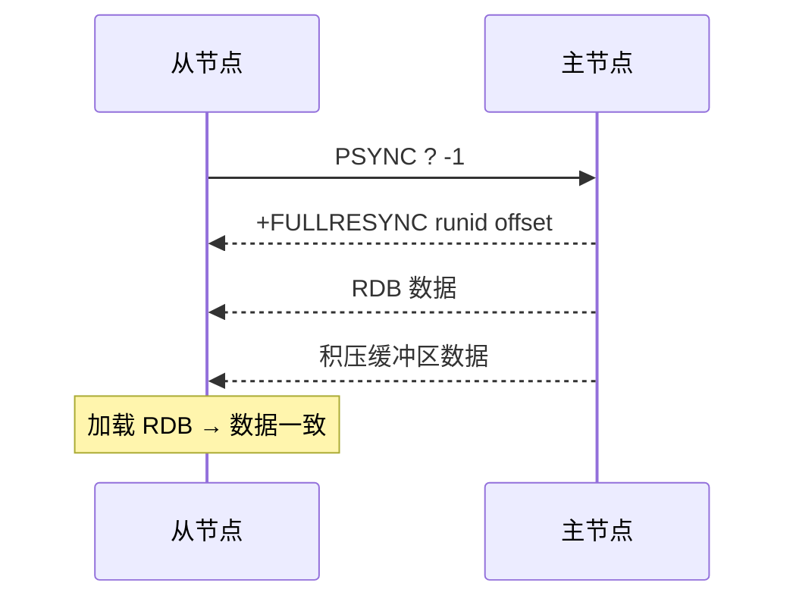
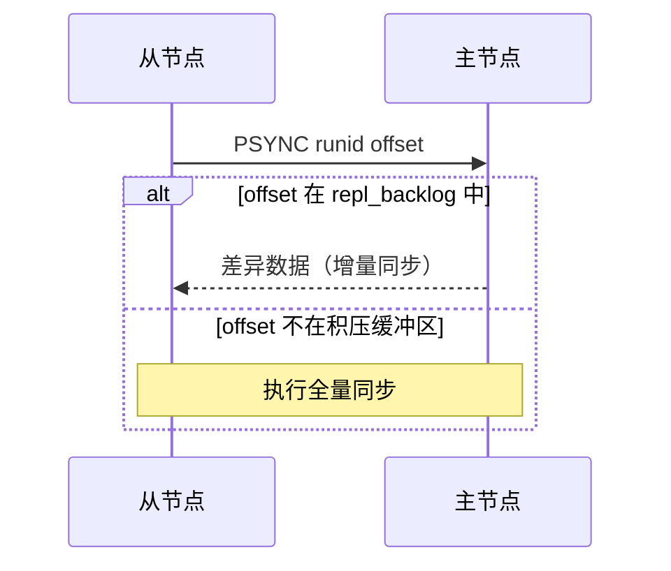
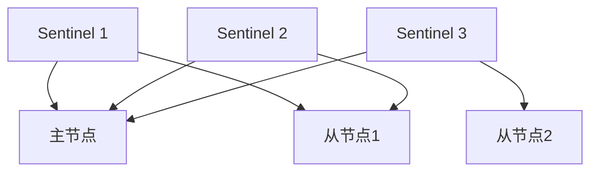
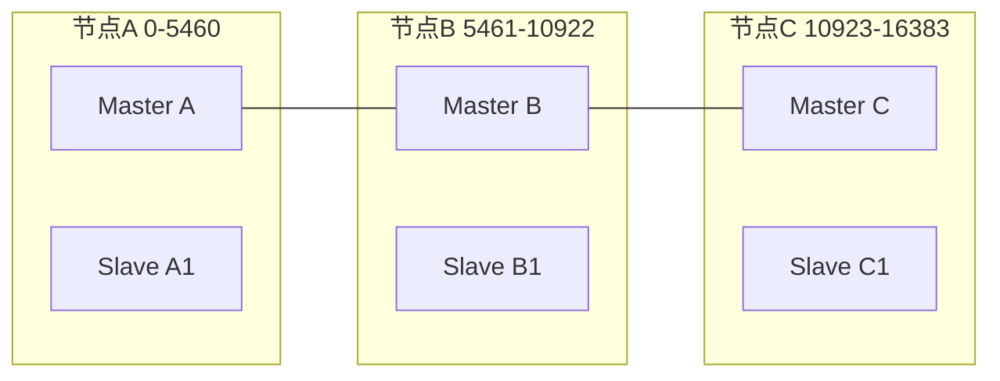
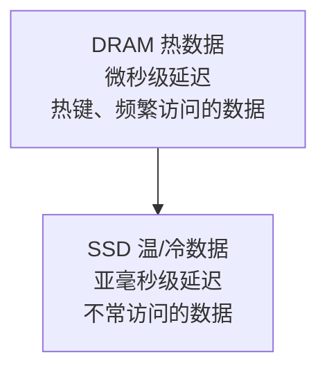

## 1. 主从复制

### 1.1 全量同步



### 1.2 增量同步



### 1.3 主从配置

```bash
# 从节点配置
redis-server --replicaof 192.168.1.10 6379

# 或在 redis.conf 中
replicaof 192.168.1.10 6379
masterauth "MasterPass123"       # 主节点密码

# 只读模式（默认开启）
replica-read-only yes

# 复制相关配置
repl-diskless-sync yes           # 无盘复制
repl-ping-replica-period 10      # 心跳间隔
repl-timeout 60                  # 超时时间
replica-serve-stale-data yes     # 断开后是否继续响应
replica-priority 100             # 哨兵选举优先级
```

### 1.4 复制状态监控

```bash
# 主节点查看从节点
INFO replication
# # Replication
# role:master
# connected_slaves:2
# slave0:ip=192.168.1.11,port=6379,state=online,offset=1234567,lag=0
# slave1:ip=192.168.1.12,port=6379,state=online,offset=1234560,lag=1

# 从节点查看状态
INFO replication
# # Replication
# role:slave
# master_host:192.168.1.10
# master_link_status:up
# master_sync_in_progress:0
# slave_read_only:1
```

## 2. 哨兵模式（Sentinel）

### 2.1 Sentinel 架构



### 2.2 Sentinel 配置

```ini
# sentinel.conf
port 26379
sentinel monitor mymaster 192.168.1.10 6379 2
# mymaster: 主节点名称
# 192.168.1.10 6379: 主节点地址
# 2: 至少2个 Sentinel 同意才进行故障转移

sentinel auth-pass mymaster MasterPass123
sentinel down-after-milliseconds mymaster 30000     # 30秒无响应判定主观下线
sentinel failover-timeout mymaster 180000            # 故障转移超时
sentinel parallel-syncs mymaster 1                   # 同时同步的从节点数
```

### 2.3 故障转移流程

```
1. 主观下线(SDOWN): 单个 Sentinel 认为主节点不可用
2. 客观下线(ODOWN): 超过 quorum 个 Sentinel 认为主节点不可用
3. Sentinel 选举 Leader（Raft 协议）
4. Leader 执行故障转移:
   a. 选择新主节点:
      - 排除断线的从节点
      - 优先 replica-priority 最小的
      - 优先复制偏移量最大的（数据最新）
      - 优先 runid 最小的
   b. 对新主节点执行 SLAVEOF NO ONE
   c. 对其他从节点执行 SLAVEOF 新主节点
   d. 更新 Sentinel 配置
5. 客户端连接新主节点
```

### 2.4 Sentinel 客户端连接

```python
import redis
from redis.sentinel import Sentinel

# 连接 Sentinel
sentinel = Sentinel([
    ('192.168.1.10', 26379),
    ('192.168.1.11', 26379),
    ('192.168.1.12', 26379)
], socket_timeout=5)

# 获取主节点连接
master = sentinel.master_for('mymaster', password='MasterPass123')
master.set('key', 'value')

# 获取从节点连接（读操作）
slave = sentinel.slave_for('mymaster', password='MasterPass123')
value = slave.get('key')

# 发现主节点地址
master_addr = sentinel.discover_master('mymaster')
```

## 3. Redis Cluster

### 3.1 Cluster 架构



分片规则：slot = CRC16(key) % 16384，每个主节点负责一部分槽位，Gossip 协议进行节点间通信

### 3.2 Cluster 配置

```ini
# redis.conf
cluster-enabled yes
cluster-config-file nodes-6379.conf
cluster-node-timeout 15000          # 节点超时（毫秒）
cluster-announce-ip 192.168.1.10    # 外部可达 IP
cluster-announce-port 6379
cluster-announce-bus-port 16379     # 集群总线端口

cluster-require-full-coverage yes   # 槽位不全覆盖时拒绝服务
cluster-migration-barrier 1         # 从节点迁移屏障
cluster-allow-reads-when-down no    # 集群下线时允许读
```

### 3.3 Cluster 创建

```bash
# 创建集群（6 节点: 3主3从）
redis-cli --cluster create \
  192.168.1.10:6379 192.168.1.11:6379 192.168.1.12:6379 \
  192.168.1.13:6379 192.168.1.14:6379 192.168.1.15:6379 \
  --cluster-replicas 1

# 查看集群信息
redis-cli cluster info
redis-cli cluster nodes

# 检查集群状态
redis-cli --cluster check 192.168.1.10:6379

# 添加主节点
redis-cli --cluster add-node 192.168.1.16:6379 192.168.1.10:6379

# 重新分配槽位
redis-cli --cluster reshard 192.168.1.10:6379

# 添加从节点
redis-cli --cluster add-node 192.168.1.17:6379 192.168.1.10:6379 \
  --cluster-slave --cluster-master-id <node_id>
```

### 3.4 跨槽事务

```bash
# 普通事务不支持跨槽
MULTI
SET key1 val1    # slot 9182
SET key2 val2    # slot 4998  ← 报错: CROSSSLOT

# 解决方案1: Hash Tag
SET {order}:1:name "Alice"    # 同一 hash tag → 同一槽
SET {order}:1:total 100       # 同一 hash tag → 同一槽
# Hash Tag: {} 内的内容参与 CRC16 计算

# 解决方案2: Lua 脚本（同样受限于同一节点）
# 解决方案3: 应用层分布式事务
```

### 3.5 Cluster 客户端

```python
from redis.cluster import RedisCluster

# 连接集群
rc = RedisCluster(
    host='192.168.1.10',
    port=6379,
    password='ClusterPass123',
    decode_responses=True
)

# 自动路由到正确节点
rc.set('user:1001', 'Alice')     # 自动路由到对应槽位
rc.get('user:1001')

# 批量操作（需同一槽或使用 Hash Tag）
rc.mset({'{order}:1:name': 'Alice', '{order}:1:total': '100'})

# 集群信息
rc.cluster_info()
rc.cluster_nodes()
```

## 4. 集群代理

```bash
# redis-cluster-proxy（实验性）
# 提供单入口访问 Redis Cluster

# 安装
git clone https://github.com/RedisLabs/redis-cluster-proxy.git
cd redis-cluster-proxy && make

# 启动代理
redis-cluster-proxy -p 7777 192.168.1.10:6379

# 客户端连接代理（像单机一样使用）
redis-cli -p 7777
SET key1 val1
MGET key1 key2 key3    # 代理自动处理跨槽
```

## 5. Redis Flex 混合存储引擎

### 5.1 架构



自动分层：LRU 算法决定数据在 DRAM 还是 SSD，成本降低约 80%，延迟 < 500μs

### 5.2 配置

```ini
# redis.conf (Redis Flex)
flex-enabled yes
flex-ssd-path /data/redis-ssd
flex-ssd-ratio 0.1              # DRAM:SSD = 1:10
flex-dram-max-memory 4gb        # DRAM 最大使用量
flex-ssd-max-storage 40gb       # SSD 最大使用量
flex-eviction-policy allkeys-lru
```

### 5.3 适用场景

| 场景     | 传统 Redis | Redis Flex |
| :------- | :--------- | :--------- |
| 数据量   | 受内存限制 | 可达 TB 级 |
| 成本     | 高         | 降低 80%   |
| 延迟     | < 100μs    | < 500μs    |
| 适用数据 | 热数据     | 全量数据   |
| 典型场景 | 缓存       | 数据库替代 |

## 6. Redis for AI 套件

### 6.1 向量库（Vector Set）

```bash
# 创建向量集合
VSET products:vec item1 0.1 0.2 ... 0.768
VSET products:vec item2 0.2 0.3 ... 0.768

# KNN 搜索
VSEARCH products:vec 0.1 0.15 ... 0.76 COUNT 10

# 带元数据过滤
VSET products:vec item1 0.1 0.2 ... 0.768 META category "electronics" price 299
VSEARCH products:vec 0.1 0.15 ... 0.76 COUNT 10 FILTER category == "electronics"
```

### 6.2 推理缓存

```bash
# LLM 推理缓存
# 缓存 prompt → response 映射
SET llm:cache:sha256:abc123 "response text here" EX 3600

# 语义缓存（基于向量相似度）
# 1. 将 prompt 转为向量
# 2. 在 Vector Set 中搜索相似 prompt
# 3. 相似度超过阈值则返回缓存结果
VSEARCH prompts:vec <prompt_vector> COUNT 1

# 命中缓存则直接返回，否则调用 LLM 并缓存结果
```

### 6.3 VSS 优化

```
向量相似度搜索(VSS)优化:

1. HNSW 参数调优:
   - M: 连接数（默认16，越大越精确但内存越大）
   - EF_CONSTRUCTION: 构建时搜索宽度（默认200）
   - EF_RUNTIME: 查询时搜索宽度（默认10）

2. 量化优化:
   - FP32 → FP16: 内存减半，精度损失极小
   - INT8 量化: 内存减至1/4，精度有损
   - PQ(Product Quantization): 压缩比更高

3. 分片策略:
   - 按向量 ID 哈希分片
   - 每个分片独立构建 HNSW 索引
   - 查询时并行搜索所有分片，合并结果

4. 批量操作:
   - 批量插入向量（减少索引更新开销）
   - 批量查询（pipeline）
```
## 集群创建

**基本写法：redis-cli 创建集群**
`redis-cli --cluster create <节点1> <节点2> ... --cluster-replicas <每主几个从>`
```bash
# 创建 3 主 3 从集群
redis-cli --cluster create \
  192.168.1.1:7000 192.168.1.2:7000 192.168.1.3:7000 \
  192.168.1.1:7001 192.168.1.2:7001 192.168.1.3:7001 \
  --cluster-replicas 1

# cluster-replicas 1 表示每个主库配 1 个从库
```

---

**基本写法：节点配置文件**
`cluster-enabled yes`
```conf
# 每个节点的 redis.conf
port 7000
cluster-enabled yes
cluster-config-file nodes-7000.conf
cluster-node-timeout 15000
cluster-announce-ip 192.168.1.1
cluster-announce-port 7000
cluster-announce-bus-port 17000

# 集群总线端口 = 数据端口 + 10000
# 节点间通信用总线端口，客户端用数据端口
```

---

## CLUSTER 节点管理

**基本写法：CLUSTER MEET 加入节点**
`CLUSTER MEET <ip> <port>`
```redis
-- 向集群添加新节点
CLUSTER MEET 192.168.1.4 7000

-- 查看集群节点列表
CLUSTER NODES
-- 返回格式：id ip:port@bus flags master ping pong epoch link slots
-- flags: master/slave/fail/myself/handshake/noaddr
```

---

**基本写法：CLUSTER INFO 集群状态**
`CLUSTER INFO`
```redis
-- 查看集群信息
CLUSTER INFO
-- 关键字段：
-- cluster_state:ok
-- cluster_slots_assigned:16384
-- cluster_slots_ok:16384
-- cluster_known_nodes:6
-- cluster_size:3
```

---

## 槽位管理

**基本写法：CLUSTER SLOTS 槽位分布**
`CLUSTER SLOTS`
```redis
-- 查看槽位分配
CLUSTER SLOTS
-- 返回：起始槽-结束槽-主节点信息-从节点信息
-- 如：0-5460 [ip,port,id] [从ip,从port,从id]
```

---

**基本写法：CLUSTER COUNTKEYSINSLOT**
`CLUSTER COUNTKEYSINSLOT <slot>`
```redis
-- 统计某槽位的 key 数量
CLUSTER COUNTKEYSINSLOT 5500

-- 计算 key 的槽位
CLUSTER KEYSLOT mykey
-- Redis 用 CRC16(key) % 16384 计算槽位
```

---

**基本写法：分配槽位**
`CLUSTER ADDSLOTS <slot> [<slot>...]`
```redis
-- 给当前节点分配槽位
CLUSTER ADDSLOTS 0 1 2 3 4 5

-- 删除槽位
CLUSTER DELSLOTS 0 1 2

-- 批量分配（创建集群时用 bash 循环）
# for i in {0..5460}; do redis-cli -p 7000 CLUSTER ADDSLOTS $i; done
```

---

**基本写法：迁移槽位**
`CLUSTER SETSLOT <slot> MIGRATING <目标nodeid> | IMPORTING <源nodeid>`
```redis
-- 槽位迁移流程（手动迁移 slot 100 从 A 到 B）
-- 1. B 准备接收
CLUSTER SETSLOT 100 IMPORTING <A的nodeid>

-- 2. A 准备迁出
CLUSTER SETSLOT 100 MIGRATING <B的nodeid>

-- 3. 迁移 key
MIGRATE <B_ip> <B_port> '' 0 5000 KEYS key1 key2

-- 4. 两端都确认新归属
CLUSTER SETSLOT 100 NODE <B的nodeid>

-- 推荐：用 redis-cli --cluster reshard 自动迁移
```

---

## redis-cli 集群工具

**基本写法：集群重平衡**
`redis-cli --cluster reshard <任意节点>`
```bash
# 交互式迁移槽位
redis-cli --cluster reshard 192.168.1.1:7000
# 输入：迁移多少槽位、目标节点id、源节点（all 或 id 列表）

# 自动平衡槽位分布
redis-cli --cluster rebalance 192.168.1.1:7000

# 检查集群健康
redis-cli --cluster check 192.168.1.1:7000

# 修复槽位异常
redis-cli --cluster fix 192.168.1.1:7000
```

---

**基本写法：添加/移除节点**
`redis-cli --cluster add-node <新节点> <集群任意节点>`
```bash
# 添加主节点
redis-cli --cluster add-node 192.168.1.4:7000 192.168.1.1:7000

# 添加从节点（指定主库 id）
redis-cli --cluster add-node 192.168.1.4:7001 192.168.1.1:7000 \
  --cluster-slave --cluster-master-id <主库nodeid>

# 移除节点（先迁移槽位）
redis-cli --cluster del-node 192.168.1.1:7000 <待移除nodeid>
```

---

## 客户端集群操作

**基本写法：-c 启用集群模式**
`redis-cli -c -h <host> -p <port>`
```bash
# -c 自动跟随 MOVED/ASK 重定向
redis-cli -c -h 192.168.1.1 -p 7000

# 不加 -c 时遇到跨槽 key 会报错并返回 MOVED
# MOVED 5474 192.168.1.2:7000 表示去 2 号节点查
```

---

**基本写法：Hash Tag 保证同槽**
`SET {tag}key1 v1 | SET {tag}key2 v2`
```redis
-- 用 {} 指定 hash tag，大括号内内容参与槽位计算
SET {user100}.name 'Alice'
SET {user100}.age '30'
SET {user100}.email 'a@x.com'

-- 三个 key 槽位相同，可在同节点执行 MGET/事务
MGET {user100}.name {user100}.age {user100}.email

-- 适用于多 key 操作（事务/聚合）必须在同节点
```

---

## 集群限制

**基本写法：跨槽操作限制**
`<多key命令> 仅当所有 key 同槽时可用`
```redis
-- 以下命令要求所有 key 在同一槽位，否则报 CROSSSLOT 错误
MGET k1 k2 k3          -- 若槽位不同则失败
MULTI / EXEC            -- 事务中跨槽 key 失败
SINTER s1 s2            -- 集合运算跨槽失败
ZUNIONSTORE dst 2 s1 s2

-- 解决方案：用 Hash Tag {tag} 强制同槽
MGET {tag}k1 {tag}k2 {tag}k3
```

---

## 故障转移

**基本写法：手动故障转移**
`CLUSTER FAILOVER [FORCE|TAKEOVER]`
```redis
-- 从库执行，请求升主（需主库同意）
CLUSTER FAILOVER

-- FORCE：不等主库确认，直接升主（主库不可达时）
CLUSTER FAILOVER FORCE

-- TAKEOVER：跳过集群协商，强制升主（危险，可能脑裂）
CLUSTER FAILOVER TAKEOVER

-- 流程：从库停止复制 -> 通知主库 -> 主库停止处理 -> 从库升主
```

---

**基本写法：故障节点处理**
`CLUSTER FORGET <nodeid>`
```redis
-- 从集群中移除故障节点（需对所有存活节点执行）
CLUSTER FORGET <故障nodeid>

-- 重置当前节点集群状态
CLUSTER RESET [HARD|SOFT]
-- SOFT：保留数据，重置集群信息
-- HARD：清空数据 + 重置集群（重新加入用）
```
