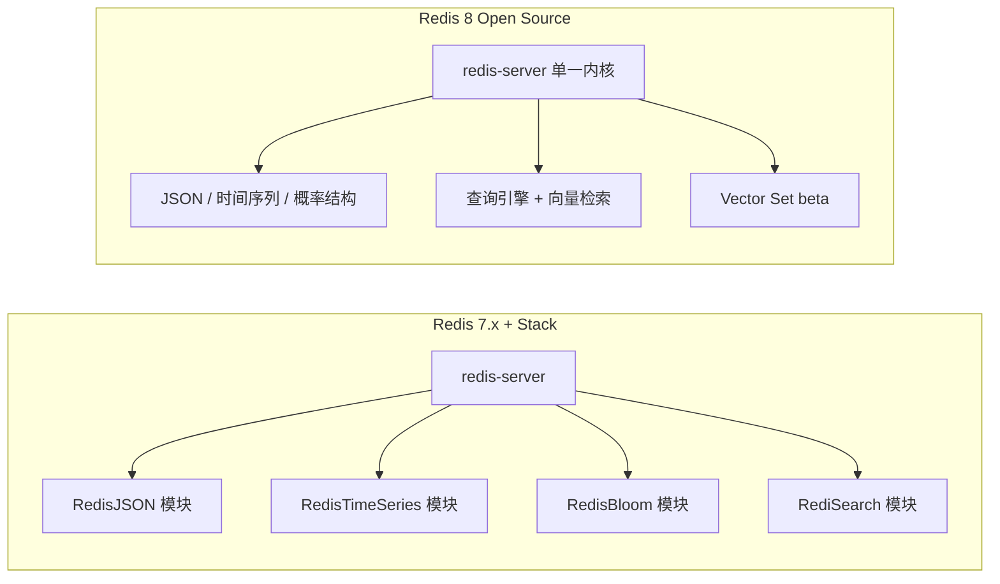

## 1. 学习目标与前置知识

- 前置：用过 SET/HSET 等基础命令，了解 7.x 的 Function、multi-part AOF
  （见《Redis 7 新特性》）。
- 学完本篇你将能回答：
  1. Redis 8 相比 7.x 多了什么、哪些原 Stack 能力进了内核；
  2. 许可证怎么选（AGPLv3 是什么、Valkey 是什么关系）；
  3. HGETDEL/HGETEX/HSETEX、Vector Set、查询引擎怎么用；
  4. 从 7.x 或 Redis Stack 升级到 8 要注意什么。

> 版本说明（信息截至 2026-09）：Redis 8.0 于 2025-05 GA，8.x 系列快速迭代
> （8.2、8.4 等已发布，写作时最新稳定版为 8.8，以 redis.io/downloads 为准）。
> 本文以 8.0 的核心变化为主线，8.x 后续版本的新命令会标注引入版本。

## 2. 定位：为什么要关注 Redis 8

把 Redis 8 之前的生态比作一家「主体店 + 五六个加盟档口」：核心键值店是
redis-server，JSON、时间序列、布隆过滤器等能力要靠单独安装 Redis Stack
（模块打包发行版），版本匹配、部署、运维都多一套心智负担。

Redis 8 做的事是把档口全部搬进主体店：



一句话：**8.0 起不再有「装不装 Stack」的选择题，开源内核自带全部能力**，
Redis Stack 独立发行版停止更新（官方对 6.2/7.2/7.4 的补丁支持止于
2025-09-15），新项目直接用 Redis 8+。

## 3. 许可与发行版变化

### 3.1 三许可证可选

| 许可证 | 性质 | 一句话理解 |
| :--- | :--- | :--- |
| RSALv2 | 源可用（非 OSI 开源） | 7.4 及之前的既有选项，限制托管转售 |
| SSPLv1 | 源可用（非 OSI 开源） | 同上，另一份源可用协议 |
| AGPLv3 | OSI 认可的开源协议 | **8.0 新增**；网络服务场景也须开源你的修改版 |

- AGPLv3 选项于 2025-05 随 8.0 引入，主要是回应社区对「OSI 认可开源
  协议」的诉求；自用、内部部署仍可任选三者之一。
- 2024-03 的许可收紧（移除 BSD）曾催生 **Valkey** 分叉（Linux Foundation
  托管、BSD 协议、API 兼容 Redis）；了解其存在即可，本文不展开选型立场。

### 3.2 产品名变化

免费的 Redis Community Edition 更名为 **Redis Open Source**；Redis Cloud /
Redis Software 是商业产品线。8.0 博客中的 Redis for AI、Redis Flex 等属于
商业层能力，不是开源内核的 redis.conf 配置项。

## 4. 内置的新数据结构

### 4.1 JSON

把 JSON 文档存为键，用 JSONPath 精细读写，支持原子局部更新：

```bash
# 存入一个 JSON 文档
JSON.SET user:1001 $ '{"name":"Alice","age":30,"tags":["vip","beta"]}'
# 返回: OK

# JSONPath 取局部字段（不必取整个文档）
JSON.GET user:1001 $.name
# 返回: "[\"Alice\"]"

# 原子自增嵌套字段
JSON.NUMINCRBY user:1001 $.age 1
# 返回: "[31]"

# 数组追加
JSON.ARRAPPEND user:1001 $.tags '"paid"'
# 返回: "[3]"（数组新长度）
```

### 4.2 时间序列（Time Series）

```bash
# 创建温度序列：10 秒窗口聚合均值，60 秒保留期做降采样
TS.CREATE sensor:1:temp RETENTION 86400000
# 返回: OK

# 写入带时间戳的样本（毫秒时间戳 值）
TS.ADD sensor:1:temp 1704067200000 21.5
# 返回: 1704067200000

# 区间查询最近 5 分钟数据
TS.RANGE sensor:1:temp - + COUNT 10
# 返回: 按时间升序的 (时间戳, 值) 列表
```

### 4.3 概率数据结构（5 种，8.0 内置）

| 结构 | 回答的问题 | 误差特征 |
| :--- | :--- | :--- |
| Bloom / Cuckoo filter | 「某元素见过吗」 | 可能误判「见过」，绝不漏判「没见过」 |
| Count-Min Sketch | 「某元素大约出现几次」 | 只会多算不会少算 |
| Top-K | 「出现最频繁的 K 个是谁」 | 近似榜单 |
| t-digest | 「P99 分位数是多少」 | 两端精度高，中间粗 |

```bash
# 布隆过滤器：缓存穿透防护的最轻量实现
BF.ADD seen:emails "a@b.com"
BF.EXISTS seen:emails "a@b.com"
# 返回: 1（整数，表示存在）
BF.EXISTS seen:emails "nope@b.com"
# 返回: 0

# t-digest：流式计算分位数
TDIGEST.CREATE lat:svc1
TDIGEST.ADD lat:svc1 12 8 30 55 90 120
TDIGEST.QUANTILE lat:svc1 0.99
# 返回: 约 120（P99 估计值）
```

与 HyperLogLog 的分工：HLL 只算基数（UV），上述结构覆盖「判重、频次、
Top-K、分位数」。细节与 22 篇缓存穿透中的布隆过滤器实践互相印证。

### 4.4 查询引擎（Query Engine）

对 Hash / JSON 建二级索引，支持精确匹配、全文检索与向量 KNN：

```bash
# 给 user:* 的 Hash 建索引：name 做 TAG，age 做数值
FT.CREATE idx:user ON HASH PREFIX 1 user: SCHEMA name TAG age NUMERIC
# 返回: OK

# 精确 + 范围组合查询
FT.SEARCH idx:user '@name:{Alice} @age:[25 35]' DIALECT 2
# 返回: 命中数 + 文档列表

# 向量 KNN（嵌入存入 Hash 字段，8 字节 float32 二进制）
FT.CREATE idx:doc ON HASH PREFIX 1 doc: SCHEMA vec VECTOR HNSW 6 \
  TYPE FLOAT32 DIM 8 DISTANCE_METRIC COSINE
```

8.0 起查询引擎支持**集群横向扩展**与**垂直扩展（多线程查询）**，官方称
查询处理能力最高提升 16 倍；这是「免费版也能做十亿级向量检索」的基础。

## 5. Vector Set（beta）

Redis 原作者 Salvatore Sanfilippo 回归后设计的新数据类型：像操作 ZSet
一样操作高维向量（VADD / VSIM / VEMB / VREM），内置 HNSW 索引。

```bash
# 添加 8 维向量；默认 int8 量化以省内存
VADD points VALUES 8 0.1 0.2 0.3 0.4 0.5 0.6 0.7 0.8 pt:A
# 返回: 1

# 相似度检索（余弦相似度，1 最相似）
VSIM points VALUES 8 0.1 0.2 0.3 0.4 0.5 0.6 0.7 0.8 COUNT 3 WITHSCORES
# 返回: 1) "pt:A"  2) "1"  3) ... （按相似度降序）
```

- 8.0 以 beta 引入，官方明确「API 未来可能变化」；8.2 补充 VISMEMBER、
  8.4 补充 VRANGE 等命令，仍在快速演进。
- 完整命令、量化选项（Q8/BIN/NOQUANT）、FILTER 过滤与调参见
  《向量集》一篇（redis/100-VectorSet）。
- 与查询引擎向量检索的分工：Vector Set 轻量、开箱即用、语义近似 ZSet；
  查询引擎适合「向量 + 结构化字段混合过滤」的复杂索引场景。

## 6. 新增 Hash 命令（基于 7.4 字段级过期）

7.4 引入 Hash 单字段过期（HEXPIRE/HTTL/HPERSIST），8.0 再补三个
「取值顺便处理过期」的命令，业务上非常常用：

```bash
HSET session:u1 token "abc" csrf "xyz"
# 返回: 2

# HSETEX：写字段并设过期（EX 秒 / PX 毫秒）
HSETEX session:u1 EX 3600 FIELDS 1 token "abc-new"
# 返回: 1

# HGETEX：读字段并顺延/重设过期
HGETEX session:u1 EX 3600 FIELDS 1 token
# 返回: 1) "abc-new"

# HGETDEL：读取即删除（一次性票据场景）
HGETDEL session:u1 FIELDS 1 csrf
# 返回: 1) "xyz"
```

## 7. 性能与内核改进

### 7.1 I/O 线程重新实现

6.0 的 I/O 线程只搬运读写与解析，8.0 重新设计后可显著吃满多核：

```ini
# redis.conf
io-threads 8          # 默认 1（关闭）；多核大流量机器建议 2~8
io-threads-do-reads yes
```

官方基准（Intel 多核、io-threads=8）：吞吐最高提升约 112%（即约 2 倍）；
149 项延迟基准中 90 项更快，p50 延迟降幅 5.4%~87.4%。

### 7.2 复制机制重构（双流并行）

全量同步期间，主库同时发送「RDB 数据流 + 增量命令流」，第二阶段不再
阻塞等待第一阶段。官方 10GB 数据集 + 2684 万条增量写入的测试中：

- 全量同步期间主库写入吞吐平均高 7.5%；
- 复制总时长缩短 18%；
- **主库峰值复制缓冲降低 35%**——这直接缓解「全量同步把主库内存打爆」
  的经典故障，详见《复制缓冲区》一篇。

### 7.3 其他

超过 30 项性能优化（命令延迟、内存占用等），以及 ACL 为新数据结构
新增类别（`@bloom`、`@cms`、`@topk`、`@t-digest`、`@vector-set` 等，
`@read`/`@write` 也已涵盖新结构命令）。

```bash
ACL SETUSER analyst on >pwd ~* +@read +@bloom +@t-digest
```

## 8. 升级注意事项（7.x / Stack → 8）

1. **兼容性**：8.0 兼容 7.x 的核心命令与数据格式；先在预发跑回归，
   特别关注使用了已废弃命令或模块私有 API 的代码。
2. **从 Redis Stack 迁移**：JSON/TS/概率/查询命令（JSON.*、TS.*、BF.*、
   FT.* 等）在 8 内核中直接可用，去掉模块加载配置即可；模块版本与
   内核版本绑定问题随之消失。
3. **内存基线重估**：新结构、新复制机制改变内存画像，升级后重测
   `INFO memory` 与 `maxmemory` 阈值。
4. **Vector Set 是 beta**：API 可能变，生产关键路径慎用，做好版本锁定。
5. **许可审计**：AGPLv3 选项对 SaaS 托管场景有传染性要求，选择前过一遍
   法务；不想受约束仍可选用 RSALv2/SSPLv1（不选 AGPLv3 即可）。

## 9. 陷阱与调试

- **「装了 8 就有 Redis for AI / Flex」**：错。那些是商业产品能力，
  开源内核没有对应开关。
- **io-threads 盲目调大**：核少流量小时反而因线程切换变慢；默认 1，
  出现网络 I/O 瓶颈（`INFO stats` 中 `instantaneous_ops_per_sec` 高、
  CPU 单核打满）再开启并压测。
- **把 HSETEX 当 SETEX**：字段过期不等于整个键过期；键本身没有 TTL
  时，删到最后一个字段键仍在。用 `TTL` 与 `HTTL` 分别确认两层过期。
- **查询引擎语义变化**：`FT.SEARCH` 的 DIALECT 版本影响查询语义，
  升级后显式声明 `DIALECT 2`，避免依赖旧方言。
- **误把 8.x 全部新特性当 8.0**：VISMEMBER（8.2）、VRANGE（8.4）等
  是后续 minor 版本加入，写兼容层时按实际运行版本判断。

## 10. 小结

- 初学者要点：8.0 = 「一个内核装下 Stack」+ AGPLv3 可选 + 内置查询引擎
  与 Vector Set；装 Redis 直接装 8.x，不再需要 Stack。
- 进阶注意：许可三选一的合规含义；multi-part AOF、HFE 等 7.x 能力是
  8 的地基；io-threads 与双流复制改变性能画像，升级需重做容量规划。
- 下一步：《向量集》（redis/100-VectorSet）深入 Vector Set 命令与调参；
  《Redis 7 新特性》（redis/300-NewFeatures7）补齐 Function 与
  multi-part AOF 底层细节。
