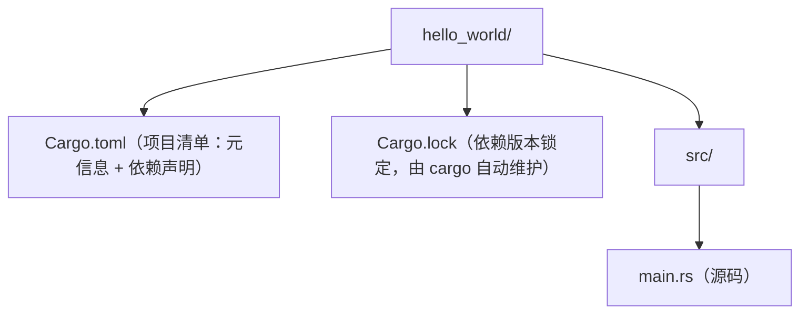

## 1. 环境搭建前须知

学习 Rust 前，先理解它的工具链构成：Rust 由三部分组成——编译器（rustc）、构建与包管理工具（Cargo）、以及官方安装器（rustup）。

| 工具 | 作用 | 类比 |
| --- | --- | --- |
| rustup | 安装/管理 Rust 工具链，可切换稳定版、测试版 | nvm（Node 版本管理） |
| rustc | 编译器，把 .rs 源码编译为可执行文件 | gcc / clang |
| cargo | 项目构建、依赖管理、测试、发布 | npm + webpack 的组合 |

建议在 Windows 上使用 WSL2 或原生安装，二者均可；本教程以原生 Windows 安装为例。

## 2. 使用 rustup 安装

打开终端（PowerShell），访问官方安装页 https://rustup.rs/ 复制安装命令执行：

```bash
# Windows PowerShell 中执行
winget install Rustlang.Rustup
# 或从 https://rustup.rs/ 下载 rustup-init.exe 后运行
```

Linux / macOS 使用：

```bash
curl --proto '=https' --tlsv1.2 -sSf https://sh.rustup.rs | sh
```

讲解：rustup-init 安装的是 rustup 加最新稳定版工具链（stable）。安装完成后需要把 `%USERPROFILE%\.cargo\bin` 加入 PATH（安装器通常自动配置）。

验证安装：

```bash
rustc --version   # 例如 rustc 1.85.0
cargo --version   # 例如 cargo 1.85.0
```

讲解：若提示"command not found"，说明 PATH 未生效，请重开终端或手动把 `~/.cargo/bin` 加入 PATH。

## 3. 安装开发插件

编写 Rust 推荐 VS Code + rust-analyzer 插件：

| 插件 | 用途 |
| --- | --- |
| rust-analyzer | 代码补全、跳转、类型提示、错误波浪线（核心） |
| CodeLLDB | 断点调试 |
| Even Better TOML | Cargo.toml 高亮与补全 |
| crates | 依赖版本提示与升级 |

安装命令（VS Code 命令行）：`code --install-extension rust-lang.rust-analyzer`

讲解：rust-analyzer 会在你输入时即时分析代码，是 Rust 开发体验的关键；首次打开项目时它会后台编译索引，稍等片刻。

## 4. 创建第一个项目

用 cargo 新建项目并运行：

```bash
cargo new hello_world
cd hello_world
cargo run
```

讲解：`cargo new` 生成项目骨架（src/main.rs 与 Cargo.toml）；`cargo run` 编译并执行。控制台输出 `Hello, world!` 即成功。

```rust
// src/main.rs —— cargo new 自动生成的代码
fn main() {
    println!("Hello, world!");
}
```

讲解：`fn main()` 是程序入口；`println!` 是输出宏（注意是宏，带感叹号）；语句以分号结尾。

## 5. Cargo 项目结构



`Cargo.toml` 是项目的核心配置文件：

```toml
[package]
name = "hello_world"
version = "0.1.0"
edition = "2024"

[dependencies]
# 在此声明第三方依赖，例如：
# serde = { version = "1", features = ["derive"] }
```

讲解：`[package]` 段描述项目本身；`edition` 指定语言版本（新项目用 2024）；`[dependencies]` 段声明第三方库，cargo 会从 crates.io 自动下载。

## 6. 常用 cargo 命令

| 命令 | 作用 |
| --- | --- |
| cargo new <name> | 新建二进制项目 |
| cargo build | 编译（debug 模式） |
| cargo build --release | 编译（优化模式，用于发布） |
| cargo run | 编译并运行 |
| cargo check | 只做类型检查，不生成二进制（最快） |
| cargo test | 运行单元测试 |
| cargo fmt | 自动格式化代码 |
| cargo clippy | 静态检查，发现潜在问题 |
| cargo doc --open | 生成并打开依赖文档 |

开发循环建议：写代码 → `cargo check` 快速验证 → `cargo clippy` 检查质量 → `cargo test` 验证功能。

## 7. 常见问题排查

问题一：rustc 更新后旧项目无法编译。执行 `rustup update` 更新工具链；`cargo update` 更新依赖。

问题二：依赖下载缓慢。配置国内镜像源，在 `~/.cargo/config.toml` 中设置：

```toml
[source.crates-io]
replace-with = 'rsproxy'

[source.rsproxy]
registry = "sparse+https://rsproxy.cn/index/"
```

讲解：稀疏协议（sparse）比旧版 git 协议下载快数倍；更换镜像后删除 Cargo.lock 中缓存再重新 build 即可。

问题三：编辑器无智能提示。确认已安装 rust-analyzer 并重新加载窗口；检查项目根目录是否有 Cargo.toml。

## 10. 小结

环境搭建的核心是"rustup 管工具链、cargo 管项目、rust-analyzer 管编辑体验"。完成本课后，你已经能用 cargo 创建、编译、运行、测试 Rust 项目。下一步进入基础语法，学习变量、类型与函数。

> **一句话记忆**：Rust 环境三件套——"rustup 装工具链、cargo 建项目、rust-analyzer 给智能提示"；日常开发循环是 `cargo check`（快速验证）→ `cargo clippy`（查质量）→ `cargo test`（验功能）。
