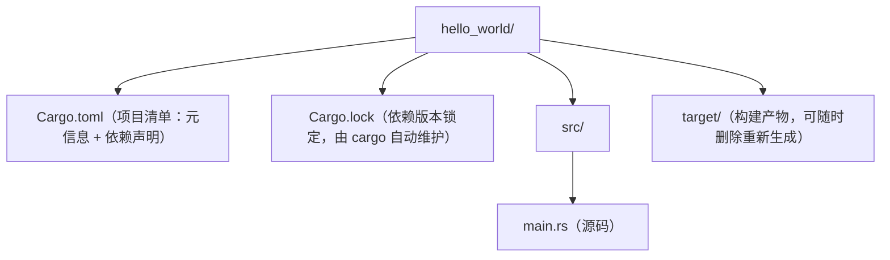

## 1. 环境搭建前须知

学习 Rust 前，先理解它的工具链构成：Rust 由三部分组成——编译器（rustc）、构建与包管理工具（Cargo）、以及官方安装器与工具链管理器（rustup）。

| 工具 | 作用 | 类比 |
| --- | --- | --- |
| rustup | 安装/管理 Rust 工具链，可切换 stable/beta/nightly 通道 | nvm（Node 版本管理） |
| rustc | 编译器，把 .rs 源码编译为可执行文件 | gcc / clang |
| cargo | 项目构建、依赖管理、测试、文档、发布 | npm + webpack 的组合 |

三者分工清晰：rustup 管"装哪个版本的 Rust"，rustc 管"怎么编译"，cargo 管"项目怎么组织"。日常开发 90% 的时间只和 cargo 打交道——rustc 在幕后被 cargo 调用，很少手动执行。

建议在 Windows 上使用原生安装或 WSL2，二者均可；本教程以原生 Windows 安装为例。

## 2. 使用 rustup 安装

Windows 上推荐用 winget 或官方安装器：

```powershell
# Windows PowerShell 中执行（二选一）
winget install Rustlang.Rustup          # 包管理器安装
# 或访问 https://rustup.rs/ 下载 rustup-init.exe 后双击运行
```

Linux / macOS 使用一行命令：

```bash
curl --proto '=https' --tlsv1.2 -sSf https://sh.rustup.rs | sh
```

讲解：rustup-init 默认安装 rustup 加**最新稳定版工具链（stable）**。Windows 上安装器会提示安装 Microsoft C++ Build Tools（MSVC 链接工具）——Rust 在 Windows 上的默认工具链依赖它，按提示装好即可；装过 Visual Studio 的机器通常已具备。

安装完成后需要把 `%USERPROFILE%\.cargo\bin` 加入 PATH（安装器通常自动配置），然后验证：

```bash
rustc --version   # 例如 rustc 1.98.0
cargo --version   # 例如 cargo 1.98.0
rustup show       # 查看已安装的工具链与默认通道
```

讲解：若提示"command not found"，说明 PATH 未生效，请重开终端或手动把 `~/.cargo/bin` 加入 PATH。Rust 每 6 周发布一个稳定版，之后随时用 `rustup update` 升级到最新（如 1.98.x → 1.99）。

## 3. 工具链通道：stable、beta 与 nightly

rustup 把工具链分成三条发布通道，理解它们对读懂社区文章很重要：

| 通道 | 说明 | 适用场景 |
| --- | --- | --- |
| stable | 每 6 周一发的稳定版，默认通道 | 日常开发、生产项目 |
| beta | 下一个稳定版的候选，只做修复 | 提前回归测试 |
| nightly | 每晚构建，含未稳定的实验特性 | 尝鲜特性、部分工具（如 Miri） |

```bash
rustup update            # 更新当前所有已装工具链
rustup toolchain install nightly   # 安装 nightly（需要时才装）
rustup default stable    # 切换默认通道（一般不用动）
```

讲解：绝大多数项目全程使用 stable 即可；个别工具（如检测未定义行为的 Miri、部分 lint）只在 nightly 提供，可以用 `cargo +nightly miri test` 这种"单次调用指定通道"的写法，不必整体切换。

## 4. 安装开发插件

编写 Rust 推荐 VS Code + rust-analyzer 插件：

| 插件 | 用途 |
| --- | --- |
| rust-analyzer | 代码补全、跳转、类型提示、错误波浪线（核心） |
| CodeLLDB | 断点调试 |
| Even Better TOML | Cargo.toml 高亮与补全 |
| crates | 依赖版本提示与升级 |

安装命令（VS Code 命令行）：

```bash
code --install-extension rust-lang.rust-analyzer
```

讲解：rust-analyzer 会在你输入时即时分析代码，是 Rust 开发体验的关键；首次打开项目时它会后台编译索引，稍等片刻。rust-analyzer 官方推荐用 rustup 额外安装一个专用工具链组件以获得最佳兼容性：`rustup component add rust-analyzer`（编辑器插件会自动探测）。

## 5. 创建第一个项目

用 cargo 新建项目并运行：

```bash
cargo new hello_world
cd hello_world
cargo run
```

讲解：`cargo new` 生成项目骨架（src/main.rs 与 Cargo.toml）；`cargo run` 编译并执行，终端输出 `Hello, world!` 即成功。第一次编译会慢一些，之后的增量编译明显变快——产物在 `target/debug/` 目录下，发布版用 `cargo build --release`，产物在 `target/release/`（运行更快、编译更慢）。

```rust
// src/main.rs —— cargo new 自动生成的代码
fn main() {
    println!("Hello, world!");
}
```

讲解：`fn main()` 是程序入口；`println!` 是输出宏（注意是宏，带感叹号，后面加 `!`）；语句以分号结尾。想验证"编译器是最严格的导师"，可以试着删掉一个引号再 `cargo run`，观察它给出的报错与修复建议。

## 6. Cargo 项目结构



`Cargo.toml` 是项目的核心配置文件：

```toml
[package]
name = "hello_world"
version = "0.1.0"
edition = "2024"    # 语言版本：新项目用 2024（2025-02 随 1.85 稳定）

[dependencies]
# 在此声明第三方依赖，例如：
# serde = { version = "1", features = ["derive"] }
```

讲解：`[package]` 段描述项目本身；`edition` 指定语言版本规则（2015/2018/2021/2024 四代，新项目统一 2024）；`[dependencies]` 段声明第三方库，cargo 会从 crates.io 自动下载。`Cargo.lock` 记录依赖的精确版本，**应用项目应把它提交进版本库**以保证可复现构建。

## 7. 常用 cargo 命令

| 命令 | 作用 |
| --- | --- |
| cargo new <name> | 新建二进制项目 |
| cargo build | 编译（debug 模式） |
| cargo build --release | 编译（优化模式，用于发布） |
| cargo run | 编译并运行 |
| cargo check | 只做类型检查，不生成二进制（最快） |
| cargo test | 运行单元测试 |
| cargo fmt | 自动格式化代码 |
| cargo clippy | 静态检查，发现潜在问题 |
| cargo add serde | 添加依赖（自动写入 Cargo.toml） |
| cargo doc --open | 生成并打开依赖文档 |

开发循环建议：写代码 → `cargo check` 快速验证 → `cargo clippy` 检查质量 → `cargo test` 验证功能。`cargo check` 不做链接、不产出可执行文件，是四个命令里最快的，写代码时应高频使用它而不是反复 `cargo run`。

## 8. 常见问题排查

问题一：rustc 更新后旧项目无法编译。执行 `rustup update` 更新工具链；`cargo update` 更新依赖。Rust 保证向后兼容，绝大多数项目无需改动即可在新版本编译。

问题二：依赖下载缓慢。配置国内镜像源，在 `~/.cargo/config.toml` 中设置：

```toml
[source.crates-io]
replace-with = 'rsproxy'

[source.rsproxy]
registry = "sparse+https://rsproxy.cn/index/"
```

讲解：稀疏协议（sparse）比旧版 git 协议下载快数倍，也是 crates.io 当前的官方协议；更换镜像后删除 Cargo.lock 缓存再重新 build 即可。

问题三：Windows 上链接失败，提示 `link.exe not found`。说明 MSVC Build Tools 未安装：运行 Visual Studio Installer，勾选"使用 C++ 的桌面开发"工作负载后重试。

问题四：编辑器无智能提示。确认已安装 rust-analyzer 并重新加载窗口；检查项目根目录是否有 Cargo.toml（rust-analyzer 以它为项目入口）。

## 9. 小结

环境搭建的核心是"rustup 管工具链、cargo 管项目、rust-analyzer 管编辑体验"。完成本课后，你已经能用 rustup 维护 stable 工具链、用 cargo 创建/编译/运行/测试 Rust 项目。下一步进入基础语法，学习变量、类型与函数。

> **一句话记忆**：Rust 环境三件套——"rustup 装并更新工具链、cargo 建项目跑构建、rust-analyzer 给智能提示"；日常开发循环是 `cargo check`（快速验证）→ `cargo clippy`（查质量）→ `cargo test`（验功能），工具链跟着 stable 每 6 周一升即可。
