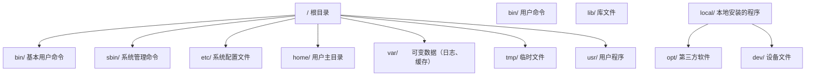

## 命令的通用结构（先看这里）

绝大多数终端命令都长这样：

```text
命令名  参数/选项  目标
ls     -la       /home/user
```

- **命令名**：做什么（`ls` 列出文件、`cd` 切换目录）；
- **选项**：怎么做的开关，通常以 `-` 开头（`-l` 详细信息、`-a` 含隐藏文件）；
- **目标**：对谁做（目录、文件）。

> 为什么先学这个结构？因为看懂结构后，新命令不需要背，猜也能猜出大半；记不住时用 `命令 --help` 查看说明。

## 文件列表查看

**基本写法：列出目录内容**
`ls`
```bash
# Linux/macOS 列出当前目录文件
ls
```

---

**基本写法：详细列表（Linux/macOS）**
`ls -la`
```bash
# 显示所有文件含隐藏文件及详细信息
ls -la
```

**为什么与参数拆解：**

- `ls` = list，列出目录内容；
- `-l` = long format，显示权限、大小、修改时间等详细信息；
- `-a` = all，包含以 `.` 开头的隐藏文件；
- 组合 `-la` 等价于 `-l -a`，是查看目录最常用的组合。

---

**基本写法：Windows 列出目录内容**
`dir`
```bash
# Windows CMD 列出目录文件
dir
```

---

**基本写法：PowerShell 列出内容**
`Get-ChildItem`
```bash
# PowerShell 列出目录内容
Get-ChildItem
```

---

**基本写法：显示隐藏文件（PowerShell）**
`Get-ChildItem -Force`
```bash
# 显示包含隐藏文件的所有文件
Get-ChildItem -Force
```

---

## 文件操作

**基本写法：创建新文件（PowerShell）**
`New-Item <文件名>`
```bash
# 创建新的空文件
New-Item index.html
```

---

**基本写法：创建新文件（Linux/macOS）**
`touch <文件名>`
```bash
# 创建空文件或更新时间戳
touch index.html
```

---

**基本写法：复制文件**
`cp <源文件> <目标>`
```bash
# Linux/macOS 复制文件
cp file.txt backup.txt
```

---

**基本写法：复制文件（Windows）**
`copy <源文件> <目标>`
```bash
# Windows CMD 复制文件
copy file.txt backup.txt
```

---

**基本写法：移动或重命名文件**
`mv <源文件> <目标>`
```bash
# Linux/macOS 移动或重命名
mv old.txt new.txt
```

---

**基本写法：移动文件（Windows）**
`move <源文件> <目标>`
```bash
# Windows CMD 移动文件
move file.txt D:\backup\
```

---

**基本写法：删除文件**
`rm <文件名>`
```bash
# Linux/macOS 删除文件
rm file.txt
```

---

**基本写法：删除文件（Windows）**
`del <文件名>`
```bash
# Windows CMD 删除文件
del file.txt
```

---

**基本写法：强制删除文件**
`rm -f <文件名>`
```bash
# 强制删除不提示确认
rm -f file.txt
```

---

## 目录创建与删除

**基本写法：创建目录**
`mkdir <目录名>`
```bash
# 创建新目录
mkdir myproject
```

---

**基本写法：递归创建目录**
`mkdir -p <路径>`
```bash
# 一次性创建多级目录
mkdir -p src/components/ui
```

---

**基本写法：PowerShell 递归创建**
`New-Item -ItemType Directory -Path <路径> -Force`
```bash
# PowerShell 创建多级目录
New-Item -ItemType Directory -Path "src\components\ui" -Force
```

---

**基本写法：删除目录**
`rm -r <目录名>`
```bash
# Linux/macOS 递归删除目录
rm -r oldproject
```

---

**基本写法：删除目录（Windows）**
`rmdir /s <目录名>`
```bash
# Windows CMD 递归删除目录
rmdir /s oldproject
```

---

## 文件内容查看

**基本写法：查看文件内容**
`cat <文件名>`
```bash
# 输出文件全部内容
cat package.json
```

---

**基本写法：分页查看（Linux/macOS）**
`less <文件名>`
```bash
# 分页查看大文件内容
less largefile.log
```

---

**基本写法：查看文件头部**
`head -n <行数> <文件名>`
```bash
# 查看文件前 N 行
head -n 20 README.md
```

---

**基本写法：查看文件尾部**
`tail -n <行数> <文件名>`
```bash
# 查看文件后 N 行
tail -n 20 error.log
```

---

**基本写法：实时追踪日志**
`tail -f <文件名>`
```bash
# 持续监控文件新增内容
tail -f application.log
```

---

## 文本搜索

**基本写法：搜索文件内容（Linux/macOS）**
`grep "<关键词>" <文件>`
```bash
# 在文件中搜索关键词
grep "TODO" index.js
```

---

**基本写法：递归搜索目录**
`grep -r "<关键词>" <目录>`
```bash
# 递归搜索目录下所有文件
grep -r "console.log" src/
```

---

**基本写法：Windows 搜索文件内容**
`findstr "<关键词>" <文件>`
```bash
# Windows CMD 搜索文件内容
findstr "TODO" index.js
```

---

**基本写法：PowerShell 搜索内容**
`Select-String -Pattern "<关键词>" -Path <文件>`
```bash
# PowerShell 搜索文件内容
Select-String -Pattern "TODO" -Path index.js
```

---

## 文件查找

**基本写法：按名称查找（Linux/macOS）**
`find <路径> -name "<文件名>"`
```bash
# 在指定路径查找文件
find . -name "*.js"
```

---

**基本写法：按名称查找（Windows）**
`dir /s /b <文件名>`
```bash
# Windows 递归查找文件
dir /s /b *.js
```

---

**基本写法：PowerShell 查找文件**
`Get-ChildItem -Path <路径> -Filter <模式> -Recurse`
```bash
# PowerShell 递归查找文件
Get-ChildItem -Path . -Filter "*.js" -Recurse
```
## 1. Shell 与终端

### 1.1 Shell 概述

Shell 是操作系统的**命令解释器**，是用户与内核之间的接口。它接收用户输入的命令，将其翻译为系统调用，并将结果返回给用户。

| Shell          | 全称                       | 特点                   |
| :------------- | :------------------------- | :--------------------- |
| **sh**         | Bourne Shell               | Unix 最初 Shell        |
| **bash**       | Bourne Again Shell         | Linux 默认，最广泛使用 |
| **zsh**        | Z Shell                    | macOS 默认，功能强大   |
| **fish**       | Friendly Interactive Shell | 用户友好，自动建议     |
| **PowerShell** | —                          | Windows 默认，面向对象 |

### 1.2 终端模拟器

终端模拟器是运行 Shell 的图形界面程序：

| 终端                 | 平台    | 特点               |
| :------------------- | :------ | :----------------- |
| **Windows Terminal** | Windows | 多标签、GPU 加速   |
| **iTerm2**           | macOS   | 分屏、热键窗口     |
| **Alacritty**        | 跨平台  | GPU 加速、极简     |
| **Kitty**            | 跨平台  | GPU 加速、图片显示 |
| **WezTerm**          | 跨平台  | Lua 配置、多路复用 |

### 1.3 Shell 配置文件

```bash
# bash 配置文件加载顺序
/etc/profile           # 系统级，登录时加载
~/.bash_profile        # 用户级，登录时加载
~/.bashrc              # 用户级，每次打开新 Shell 加载

# zsh 配置文件加载顺序
~/.zshenv              # 所有 zsh 实例加载
~/.zshrc               # 交互式 Shell 加载
~/.zlogin              # 登录 Shell 加载
```

## 2. 文件系统操作

### 2.1 目录导航

```bash
pwd                     # 显示当前工作目录
cd /home/user/projects  # 切换到绝对路径
cd ../..                # 上移两级目录
cd -                    # 返回上一个目录
cd ~                    # 切换到主目录
```

### 2.2 文件与目录管理

```bash
# 创建
mkdir project           # 创建目录
mkdir -p a/b/c          # 递归创建多级目录
touch file.txt          # 创建空文件

# 复制
cp file.txt backup.txt  # 复制文件
cp -r src/ dest/        # 递归复制目录

# 移动与重命名
mv old.txt new.txt      # 重命名
mv file.txt ../         # 移动到上级目录

# 删除
rm file.txt             # 删除文件（不可恢复！）
rm -r directory/        # 递归删除目录
rm -rf directory/       # 强制递归删除（危险！）

# 查找
find . -name "*.js"     # 按名称查找
find . -type f -mtime -7  # 查找7天内修改的文件
```

### 2.3 文件查看与搜索

```bash
# 查看文件
cat file.txt            # 显示全部内容
less file.txt           # 分页查看（推荐）
head -n 20 file.txt     # 显示前20行
tail -n 20 file.txt     # 显示后20行
tail -f log.txt         # 实时追踪文件末尾

# 搜索
grep "error" log.txt           # 搜索包含 error 的行
grep -r "TODO" src/            # 递归搜索目录
grep -i "warning" log.txt      # 忽略大小写
grep -n "function" app.js      # 显示行号
```

### 2.4 权限管理

```bash
# 查看权限
ls -la
# -rwxr-xr-x 1 user group 4096 Jan 1 12:00 script.sh
#  └┬┘└┬┘└┬┘
#   │   │   └── 其他用户: r-x (读+执行)
#   │   └────── 组用户: r-x (读+执行)
#   └────────── 所有者: rwx (读+写+执行)

# 修改权限
chmod +x script.sh      # 添加执行权限
chmod 755 script.sh     # 数字方式设置权限
chmod -R 644 directory/ # 递归设置目录权限

# 修改所有者
chown user:group file   # 修改文件所有者和组
```

### 2.5 文件系统层次标准（FHS）



## 3. 进程管理

### 3.1 进程查看

```bash
ps aux                   # 查看所有进程
ps -ef                   # 另一种格式
top                      # 实时进程监控
htop                     # 增强版 top（推荐）
pgrep -f "node"          # 按名称查找进程 PID
```

### 3.2 进程控制

```bash
# 前台/后台
command &                # 后台运行
Ctrl+Z                   # 暂停当前进程
bg                       # 将暂停的进程放到后台
fg                       # 将后台进程调到前台
jobs                     # 查看后台任务

# 终止进程
kill PID                 # 发送 SIGTERM（优雅终止）
kill -9 PID              # 发送 SIGKILL（强制终止）
killall node             # 按名称终止所有匹配进程
pkill -f "webpack"       # 按命令行模式终止
```

### 3.3 信号系统

| 信号        | 编号 | 含义 | 用途                        |
| :---------- | :--- | :--- | :-------------------------- |
| **SIGHUP**  | 1    | 挂断 | 终端关闭时通知进程          |
| **SIGINT**  | 2    | 中断 | `Ctrl+C` 发送               |
| **SIGQUIT** | 3    | 退出 | `Ctrl+\` 发送，生成核心转储 |
| **SIGTERM** | 15   | 终止 | 默认 kill 信号，可被捕获    |
| **SIGKILL** | 9    | 杀死 | 强制终止，不可被捕获        |
| **SIGSTOP** | 19   | 停止 | 不可被捕获，暂停进程        |
| **SIGCONT** | 18   | 继续 | 恢复暂停的进程              |

### 3.4 守护进程与服务

```bash
# systemd 服务管理
systemctl start nginx     # 启动服务
systemctl stop nginx      # 停止服务
systemctl restart nginx   # 重启服务
systemctl status nginx    # 查看状态
systemctl enable nginx    # 开机自启
systemctl disable nginx   # 取消自启

# 查看服务日志
journalctl -u nginx -f    # 实时查看 nginx 日志
```

## 4. 网络工具

### 4.1 连接测试

```bash
ping google.com           # 测试网络连通性
ping -c 4 google.com      # 发送4个包后停止
traceroute google.com     # 跟踪路由路径
mtr google.com            # 持续跟踪路由（推荐）
```

### 4.2 DNS 查询

```bash
nslookup google.com       # DNS 查询
dig google.com            # 详细 DNS 查询
dig +short google.com     # 只显示 IP 地址
host google.com           # 简洁 DNS 查询
```

### 4.3 端口与连接

```bash
# 查看端口占用
netstat -tlnp             # 查看所有监听端口
ss -tlnp                  # 更快的替代方案
lsof -i :8080             # 查看占用 8080 端口的进程

# 网络连接测试
curl http://example.com   # HTTP 请求
curl -I https://example.com  # 只看响应头
wget https://example.com/file.zip  # 下载文件
nc -zv localhost 3306     # 测试端口连通性
```

### 4.4 防火墙

```bash
# ufw（Ubuntu 防火墙）
ufw status                # 查看状态
ufw allow 80/tcp          # 允许 80 端口
ufw allow 443/tcp         # 允许 443 端口
ufw deny 3306             # 拒绝 3306 端口
ufw enable                # 启用防火墙
```

## 5. 管道与重定向

### 5.1 重定向

```bash
# 输出重定向
echo "hello" > file.txt       # 覆盖写入
echo "world" >> file.txt      # 追加写入

# 输入重定向
sort < names.txt              # 从文件读取输入

# 错误重定向
command 2> error.log          # 错误输出到文件
command 2>&1                  # 错误合并到标准输出
command &> all.log            # 所有输出到文件
```

### 5.2 管道

管道将前一个命令的**标准输出**作为后一个命令的**标准输入**：

```bash
# 组合使用
cat access.log | grep "404" | wc -l        # 统计404错误数
ps aux | grep node | grep -v grep           # 查找node进程
find . -name "*.js" | xargs wc -l          # 统计JS文件行数
history | sort | uniq -c | sort -rn | head  # 最常用命令
```

### 5.3 文本处理三剑客

```bash
# grep - 文本搜索
grep -E "error|warning" log.txt    # 正则搜索

# sed - 流编辑器
sed 's/old/new/g' file.txt         # 替换文本
sed -n '10,20p' file.txt           # 打印10-20行

# awk - 文本分析
awk '{print $1, $3}' data.txt      # 打印第1、3列
awk -F: '{print $1}' /etc/passwd   # 指定分隔符
awk '$3 > 100 {print $0}' data.txt # 条件过滤
```

## 6. Shell 脚本入门

### 6.1 基本结构

```bash
#!/bin/bash
# 这是一个 Shell 脚本

# 变量
NAME="World"
echo "Hello, $NAME!"

# 条件判断
if [ -f "package.json" ]; then
    echo "Found package.json"
    npm install
else
    echo "No package.json found"
fi

# 循环
for file in *.js; do
    echo "Processing: $file"
done

# 函数
greet() {
    local name=$1
    echo "Hello, $name!"
}
greet "Developer"
```

### 6.2 实用脚本示例

```bash
#!/bin/bash
# 自动化项目部署脚本

set -e  # 遇到错误立即退出

PROJECT_DIR="/var/www/myapp"
BRANCH="main"

echo "=== Deploying $BRANCH ==="

cd "$PROJECT_DIR"
git pull origin "$BRANCH"
npm install --production
npm run build
pm2 restart myapp

echo "=== Deploy complete ==="
```
## 路径与目录

**基本用法:查看当前路径**
`pwd`

```bash
# 显示当前工作目录绝对路径
pwd
```

---

**基本用法:切换目录**
`cd <路径>`

```bash
# 切换到指定目录
cd /home/user/project

# 返回上一级目录
cd ..

# 返回用户主目录
cd ~

# 返回上一次所在目录
cd -
```

---

**基本用法:列出目录内容**
`ls [选项] [路径]`

```bash
# 长格式列出含隐藏文件
ls -la

# 按修改时间倒序排列
ls -lt

# 人类可读文件大小(KB/MB)
ls -lh

# 仅显示目录本身属性
ls -ld src
```

---

## 文件与目录创建

**基本用法:创建目录**
`mkdir [选项] <目录名>`

```bash
# 递归创建多级目录
mkdir -p src/components/ui

# 创建时打印信息
mkdir -pv logs cache tmp
```

---

**基本用法:创建空文件**
`touch <文件名>`

```bash
# 创建空文件或更新时间戳
touch index.html

# 批量创建
touch a.txt b.txt c.txt
```

---

## 复制与移动

**基本用法:复制文件或目录**
`cp [选项] <源> <目标>`

```bash
# 递归复制整个目录
cp -r src src_backup

# 保留权限与时间戳复制
cp -a config config.bak

# 覆盖前确认
cp -i file.txt /tmp/
```

---

**基本用法:移动或重命名**
`mv [选项] <源> <目标>`

```bash
# 重命名文件
mv old.txt new.txt

# 移动并覆盖前确认
mv -i tmp.log logs/

# 不覆盖已存在文件
mv -n a.txt b.txt
```

---

## 删除操作

**基本用法:删除文件**
`rm [选项] <文件>`

```bash
# 强制删除不提示
rm -f temp.txt

# 递归删除目录
rm -r old_project

# 强制递归删除(谨慎使用)
rm -rf node_modules
```

---

## 通配符与扩展

**基本用法:通配符匹配**
`<命令> <模式>`

```bash
# 匹配所有 .js 文件
ls *.js

# 匹配单字符
ls config?.json

# 字符集合匹配
ls file[0-9].txt

# 花括号扩展批量创建
mkdir -p {src,test}/{components,utils}
```

---

## 文件信息查看

**基本用法:查看文件类型**
`file <文件>`

```bash
# 显示文件实际类型
file package.json
```

---

**基本用法:查看文件元信息**
`stat <文件>`

```bash
# 显示大小、权限、时间戳
stat README.md
```

---## 目录操作

**基本写法：查看当前路径**
`pwd`
```bash
# 显示当前工作目录
pwd
```

---

**基本写法：切换目录**
`cd <路径>`
```bash
# 切换到指定目录
cd C:\Projects\myapp
```

---

**基本写法：返回上级目录**
`cd ..`
```bash
# 返回上一级目录
cd ..
```

---

**基本写法：返回用户主目录**
`cd ~`
```bash
# 切换到用户主目录
cd ~
```

---

**基本写法：返回上一次目录**
`cd -`
```bash
# 切换到上次所在的目录
cd -
```

## 常用选项速查（为什么带这些参数）

| 命令与选项 | 含义 | 为什么常用 |
| --- | --- | --- |
| `ls -la` | `-l` 详细信息，`-a` 含隐藏文件 | 查看目录全貌 |
| `mkdir -p a/b/c` | `-p` 父目录不存在时自动创建 | 一条命令建多层目录 |
| `rm -rf 目录` | `-r` 递归，`-f` 强制 | 危险组合，删除前务必确认路径 |
| `cp -r 源 目标` | `-r` 递归复制目录 | 复制文件夹必须加 |
| `grep -r 词 目录` | `-r` 递归搜索目录 | 在项目里全局搜代码 |
| `tail -f 文件` | `-f` 持续追踪新增内容 | 实时看日志 |
| `chmod +x 文件` | `+x` 增加执行权限 | 让脚本可以运行 |
| `find 目录 -name 模式` | `-name` 按名称匹配 | 按文件名找文件 |

> 为什么选项常用 `-` 开头？这是 Unix 的约定：`-` 后跟单字母是短选项（如 `-l`），`--` 后跟单词是长选项（如 `--help`）。记不清时先试 `命令 --help`。

---

## 目录操作

**基本写法：查看当前路径**
`pwd`
```bash
# 显示当前工作目录
pwd
```

---

**基本写法：切换目录**
`cd <路径>`
```bash
# 切换到指定目录
cd C:\Projects\myapp
```

---

**基本写法：返回上级目录**
`cd ..`
```bash
# 返回上一级目录
cd ..
```

---

**基本写法：返回用户主目录**
`cd ~`
```bash
# 切换到用户主目录
cd ~
```

---

**基本写法：返回上一次目录**
`cd -`
```bash
# 切换到上次所在的目录
cd -
```
