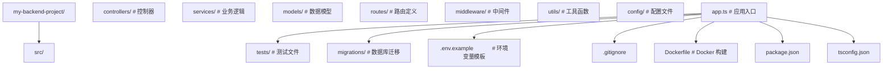
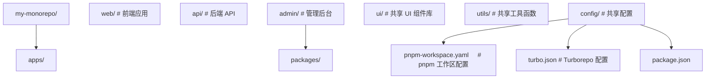

> 阅读建议：脚手架与项目结构是重点；Monorepo 属于进阶内容，0 基础学习者可先跳过。

## 1. 项目初始化概述

### 1.1 为什么需要规范化初始化

项目初始化不仅是创建文件和目录，更是建立**工程化基础设施**的关键步骤。良好的初始化可以：

- 统一团队开发规范
- 内置代码质量保障工具
- 自动化重复性操作
- 降低新人上手成本
- 避免后期补建基础设施的技术债

### 1.2 初始化检查清单

| 类别         | 项目                            | 说明           |
| :----------- | :------------------------------ | :------------- |
| **版本控制** | Git 仓库 + .gitignore           | 代码版本管理   |
| **依赖管理** | package.json / requirements.txt | 依赖声明与锁定 |
| **代码规范** | ESLint + Prettier               | 代码风格统一   |
| **提交规范** | Husky + commitlint              | 提交信息规范   |
| **测试框架** | Vitest / Jest / pytest          | 自动化测试     |
| **构建工具** | Vite / Webpack / Make           | 构建与打包     |
| **CI/CD**    | GitHub Actions / GitLab CI      | 持续集成与部署 |
| **文档**     | README + CHANGELOG              | 项目说明       |

## 2. 脚手架工具

### 2.1 前端脚手架

| 工具                 | 框架  | 特点                                       |
| :------------------- | :---- | :----------------------------------------- |
| **create-vue**       | Vue 3 | 官方脚手架，支持 TypeScript、Router、Pinia |
| **create-react-app** | React | 官方脚手架（已不推荐）                     |
| **Vite**             | 通用  | 极快的构建工具，支持多框架                 |
| **Next.js**          | React | SSR/SSG 全栈框架                           |
| **Nuxt**             | Vue 3 | SSR/SSG 全栈框架                           |

```bash
# Vue 3 项目
npm create vue@latest my-vue-app

# Vite 项目（选择框架）
npm create vite@latest my-project -- --template react-ts

# Next.js 项目
npx create-next-app@latest my-next-app --typescript --tailwind

# Nuxt 项目
npx nuxi@latest init my-nuxt-app
```

### 2.2 后端脚手架

```bash
# Python - FastAPI
pip install fastapi[standard]
fastapi new my-api-project

# Go - 标准项目
mkdir my-go-project && cd my-go-project
go mod init github.com/user/my-go-project

# Java - Spring Boot
# 使用 Spring Initializr: https://start.spring.io/
curl https://start.spring.io/starter.zip \
  -d type=maven-project \
  -d language=java \
  -d bootVersion=3.2.0 \
  -d groupId=com.example \
  -d artifactId=demo \
  -o demo.zip
```

### 2.3 自定义脚手架

使用 Yeoman 或自建 CLI 创建项目模板：

```javascript
// 简单脚手架实现
#!/usr/bin/env node
import { execSync } from 'child_process';
import fs from 'fs';
import path from 'path';

const projectName = process.argv[2];
const projectDir = path.join(process.cwd(), projectName);

// 创建目录
fs.mkdirSync(projectDir, { recursive: true });

// 初始化 Git
execSync('git init', { cwd: projectDir });

// 初始化 npm
execSync('npm init -y', { cwd: projectDir });

// 创建基础文件
const files = {
  'src/index.ts': '// Entry point\n',
  '.gitignore': 'node_modules/\ndist/\n.env\n',
  'tsconfig.json': JSON.stringify({
    compilerOptions: {
      target: 'ES2022',
      module: 'ESNext',
      strict: true,
      outDir: './dist',
    },
    include: ['src/**/*'],
  }, null, 2),
};

for (const [filePath, content] of Object.entries(files)) {
  const fullPath = path.join(projectDir, filePath);
  fs.mkdirSync(path.dirname(fullPath), { recursive: true });
  fs.writeFileSync(fullPath, content);
}

console.log(` Project ${projectName} created!`);
```

## 3. 项目结构规范

### 3.1 前端项目结构

```mermaid
flowchart TD
    T0["my-frontend-project/"]
    T1["public/                  # 静态资源"]
    T2["favicon.ico"]
    T3["src/"]
    T4["assets/             # 需要构建处理的资源"]
    T5["components/         # 可复用组件"]
    T6["common/         # 通用组件"]
    T7["business/       # 业务组件"]
    T8["composables/        # 组合式函数（Vue）/ Hooks（React）"]
    T9["layouts/            # 布局组件"]
    T10["pages/              # 页面组件"]
    T11["router/             # 路由配置"]
    T12["stores/             # 状态管理"]
    T13["styles/             # 全局样式"]
    T14["utils/              # 工具函数"]
    T15["types/              # TypeScript 类型定义"]
    T16["App.vue             # 根组件"]
    T17["main.ts             # 入口文件"]
    T18["tests/                  # 测试文件"]
    T19[".eslintrc.cjs           # ESLint 配置"]
    T20[".prettierrc             # Prettier 配置"]
    T21[".gitignore              # Git 忽略规则"]
    T22["index.html              # HTML 入口"]
    T23["package.json            # 项目配置"]
    T24["tsconfig.json           # TypeScript 配置"]
    T25["vite.config.ts          # Vite 配置"]
    T0 --> T1
    T2 --> T3
    T17 --> T18
    T17 --> T19
    T17 --> T20
    T17 --> T21
    T17 --> T22
    T17 --> T23
    T17 --> T24
    T17 --> T25
```



### 3.2 后端项目结构



### 3.3 Monorepo 结构



## 4. 配置文件体系

### 4.1 核心配置文件

| 文件             | 用途                | 格式       |
| :--------------- | :------------------ | :--------- |
| `package.json`   | 项目元信息与依赖    | JSON       |
| `tsconfig.json`  | TypeScript 编译选项 | JSON       |
| `vite.config.ts` | Vite 构建配置       | TypeScript |
| `.eslintrc.cjs`  | 代码检查规则        | JavaScript |
| `.prettierrc`    | 代码格式化规则      | JSON       |
| `.gitignore`     | Git 忽略规则        | 文本       |
| `.env`           | 环境变量            | KEY=VALUE  |
| `Dockerfile`     | Docker 构建指令     | 文本       |

### 4.2 EditorConfig

`.editorconfig` 确保不同编辑器使用一致的格式：

```ini
# .editorconfig
root = true

[*]
charset = utf-8
end_of_line = lf
indent_style = space
indent_size = 2
insert_final_newline = true
trim_trailing_whitespace = true

[*.md]
trim_trailing_whitespace = false
```

## 5. Git 初始化最佳实践

### 5.1 初始提交

```bash
# 创建项目目录
mkdir my-project && cd my-project

# 初始化 Git
git init

# 创建 .gitignore
cat > .gitignore << 'EOF'
node_modules/
dist/
.env
.env.local
*.log
.DS_Store
EOF

# 创建 README
cat > README.md << 'EOF'
# My Project

## Getting Started

\`\`\`bash
npm install
npm run dev
\`\`\`
EOF

# 初始提交
git add .
git commit -m "chore: initial project setup"
```

### 5.2 分支初始化

```bash
# 创建开发分支
git checkout -b develop

# 创建功能分支
git checkout -b feature/setup-project

# 合并回开发分支
git checkout develop
git merge feature/setup-project

# 推送到远程
git remote add origin git@github.com:user/my-project.git
git push -u origin main
git push -u origin develop
```

## 6. 模板与预设

### 6.1 热门模板

| 模板              | 技术栈                    | 特点             |
| :---------------- | :------------------------ | :--------------- |
| **Vitesse**       | Vue 3 + Vite + TypeScript | Vue 社区流行模板 |
| **SvelteKit**     | Svelte + Vite             | Svelte 官方框架  |
| **T3 Stack**      | Next.js + tRPC + Prisma   | TypeScript 全栈  |
| **create-t3-app** | 同上                      | T3 Stack 脚手架  |

### 6.2 GitHub 模板仓库

GitHub 支持将仓库标记为**模板仓库**，其他用户可以基于模板创建新项目：

1. 仓库 Settings → 勾选 "Template repository"
2. 其他用户点击 "Use this template" 创建新仓库
3. 新仓库不包含 Git 历史，从零开始
