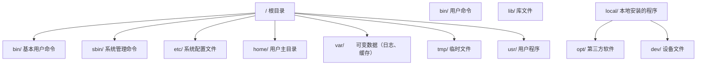

## 1. Shell 与终端

### 1.1 Shell 是什么

Shell 是操作系统的**命令解释器**，是用户与内核之间的接口：它接收你输入的命令，翻译为系统调用交给内核执行，再把结果返回给你。"Shell"与"终端"经常被混用，其实分工不同——**终端（Terminal）是窗口，Shell 是窗口里干活的程序**。

常见 Shell 一览：

| Shell          | 全称                       | 特点                   |
| :------------- | :------------------------- | :--------------------- |
| **sh**         | Bourne Shell               | Unix 最初 Shell        |
| **bash**       | Bourne Again Shell         | 多数 Linux 发行版默认  |
| **zsh**        | Z Shell                    | macOS 自 10.15 起默认  |
| **fish**       | Friendly Interactive Shell | 用户友好，自动建议     |
| **PowerShell** | —                          | Windows 默认，面向对象 |

```bash
echo "$SHELL"     # 查看当前登录 Shell
echo "$0"         # 交互模式下也能看出当前 Shell
```

### 1.2 终端模拟器

终端模拟器是承载 Shell 的图形界面程序：

| 终端                 | 平台    | 特点               |
| :------------------- | :------ | :----------------- |
| **Windows Terminal** | Windows | 多标签、GPU 加速   |
| **iTerm2**           | macOS   | 分屏、热键窗口     |
| **Alacritty**        | 跨平台  | GPU 加速、极简     |
| **Kitty**            | 跨平台  | GPU 加速、图片显示 |
| **WezTerm**          | 跨平台  | Lua 配置、多路复用 |

Windows 用户建议安装 Windows Terminal 并在其中使用 PowerShell 或 WSL（Linux 子系统），体验远好于传统 cmd 窗口。

### 1.3 Shell 配置文件

```bash
# bash 配置文件加载顺序
/etc/profile           # 系统级，登录时加载
~/.bash_profile        # 用户级，登录时加载
~/.bashrc              # 用户级，每次打开新交互 Shell 加载

# zsh 配置文件加载顺序
~/.zshenv              # 所有 zsh 实例加载
~/.zshrc               # 交互式 Shell 加载
~/.zlogin              # 登录 Shell 加载
```

原则：**别名、提示符等交互配置放 rc 文件；环境变量放 profile 类文件**。修改后 `source` 对应文件或重开终端生效。加载顺序的完整规则见《环境变量与配置文件》。

## 2. 命令的通用结构（先看这里）

绝大多数终端命令都长这样：

```text
命令名  参数/选项  目标
ls     -la       /home/user
```

- **命令名**：做什么（`ls` 列出文件、`cd` 切换目录）；
- **选项**：怎么做的开关，`-` 后跟单字母（`-l`）可合并（`-la`），`--` 后跟单词（`--all`）；
- **目标**：对谁做（目录、文件）。

> 为什么先学结构？因为看懂结构后，新命令不需要背，猜也能猜出大半；记不住时用 `命令 --help` 或 `man 命令` 查。

## 3. 文件系统操作

### 3.1 目录导航

```bash
pwd                     # 显示当前工作目录
cd /home/user/projects  # 切换到绝对路径
cd ..                   # 返回上一级
cd ../..                # 上移两级
cd -                    # 返回上一次所在目录
cd ~                    # 切换到主目录
```

绝对路径以 `/`（Windows 为盘符 `C:\`）开头，相对路径以当前目录为起点。

### 3.2 文件与目录管理

```bash
# 创建
mkdir project           # 创建目录
mkdir -p a/b/c          # 递归创建多级目录
touch file.txt          # 创建空文件

# 复制
cp file.txt backup.txt  # 复制文件
cp -r src/ dest/        # 递归复制目录

# 移动与重命名
mv old.txt new.txt      # 重命名
mv file.txt ../         # 移动到上级目录

# 删除
rm file.txt             # 删除文件（不可恢复！）
rm -r directory/        # 递归删除目录
rm -rf directory/       # 强制递归删除（危险！先 ls 确认再敲）

# 查找
find . -name "*.js"     # 按名称查找（模式加引号防止 Shell 抢先展开）
find . -type f -mtime -7  # 查找 7 天内修改的普通文件
```

### 3.3 文件查看与搜索

```bash
# 查看文件
cat file.txt            # 显示全部内容
less file.txt           # 分页查看（推荐，q 退出 / 搜索）
head -n 20 file.txt     # 显示前 20 行
tail -n 20 file.txt     # 显示后 20 行
tail -f log.txt         # 实时追踪文件末尾新增

# 搜索内容
grep "error" log.txt           # 搜索包含 error 的行
grep -r "TODO" src/            # 递归搜索目录
grep -i "warning" log.txt      # 忽略大小写
grep -n "function" app.js      # 显示行号
```

文件元信息两个补充命令：

```bash
file photo.dat          # 识别文件真实类型（不依赖扩展名）
stat README.md          # 大小、权限、时间戳等完整元信息
```

### 3.4 跨平台对照表

同一件事在不同平台的命令不同，最常用的对照如下：

| 任务 | Linux/macOS（bash/zsh） | Windows CMD | PowerShell |
| :--- | :--- | :--- | :--- |
| 列目录 | `ls -la` | `dir` | `Get-ChildItem`（含隐藏加 `-Force`） |
| 切目录 | `cd /home/user` | `cd C:\Projects` | `cd C:\Projects` |
| 复制 | `cp a b` / `cp -r src dst` | `copy a b` / `robocopy src dst /e` | `Copy-Item` |
| 移动 | `mv a b` | `move a b` | `Move-Item` |
| 删除 | `rm a` / `rm -r dir` | `del a` / `rmdir /s dir` | `Remove-Item` |
| 建目录 | `mkdir -p a/b/c` | `mkdir a\b\c` | `New-Item -ItemType Directory -Force` |
| 搜内容 | `grep -r "TODO" src` | `findstr /s "TODO" *.js` | `Select-String -Pattern "TODO"` |
| 清屏 | `clear` | `cls` | `Clear-Host` |

> 注意：`cd C:\Projects\myapp` 只在 CMD/PowerShell 中成立；bash（含 Git Bash）里反斜杠是转义符，应写 `cd /c/Projects/myapp` 或 `cd "C:\Projects\myapp"`。这是初学者最常见的"命令明明没打错却报错"。

### 3.5 权限管理

```bash
ls -la
# -rwxr-xr-x 1 user group 4096 Jan 1 12:00 script.sh
#  └┬┘└┬┘└┬┘
#   │   │   └── 其他用户: r-x (读+执行)
#   │   └────── 组用户: r-x (读+执行)
#   └────────── 所有者: rwx (读+写+执行)

chmod +x script.sh      # 添加执行权限
chmod 755 script.sh     # 数字方式设置权限（r=4 w=2 x=1 相加）
chmod -R 644 directory/ # 递归设置权限（注意：对目录 644 会导致无法进入，目录通常 755）

chown user:group file   # 修改文件所有者和组
```

数字权限的换算：`755 = rwxr-xr-x`（7=4+2+1，5=4+0+1）。脚本跑不起来时先看有没有 `x` 权限。

### 3.6 文件系统层次标准（FHS）

Linux 的目录布局有统一约定（FHS），知道"什么东西放在哪"能少走很多弯路：



高频目录：配置找 `/etc`，日志找 `/var/log`，自己装的软件放 `/opt` 或 `/usr/local`。

## 4. 进程管理

### 4.1 进程查看

```bash
ps aux                   # 查看所有进程（BSD 风格）
ps -ef                   # 全格式列出（System V 风格）
top                      # 实时进程监控
htop                     # 增强版 top（推荐，需安装）
pgrep -f "node"          # 按名称查找进程 PID
```

### 4.2 进程控制

```bash
# 前台/后台
command &                # 后台运行
Ctrl+Z                   # 暂停当前进程
bg                       # 将暂停的进程放到后台
fg                       # 将后台进程调到前台
jobs                     # 查看后台任务

# 终止进程
kill PID                 # 发送 SIGTERM（优雅终止）
kill -9 PID              # 发送 SIGKILL（强制终止，最后手段）
killall node             # 按名称终止所有匹配进程
pkill -f "webpack"       # 按命令行模式终止
```

先 TERM 后 KILL 是纪律：`kill -9` 不给进程清理机会，会留下锁文件与脏状态。信号系统与作业控制的完整讲解见《进程与作业控制》。

### 4.3 守护进程与服务

```bash
systemctl start nginx     # 启动服务
systemctl stop nginx      # 停止服务
systemctl restart nginx   # 重启服务
systemctl status nginx    # 查看状态
systemctl enable nginx    # 开机自启
systemctl disable nginx   # 取消自启

journalctl -u nginx -f    # 实时查看 nginx 日志
```

## 5. 网络工具

### 5.1 连接测试

```bash
ping -c 4 google.com      # 测试连通性（-c 4 发 4 个包后停止）
traceroute google.com     # 跟踪路由路径
mtr google.com            # 持续跟踪路由（推荐）
```

### 5.2 DNS 查询

```bash
nslookup google.com       # DNS 查询
dig google.com            # 详细 DNS 查询
dig +short google.com     # 只显示 IP 地址
host google.com           # 简洁 DNS 查询
```

### 5.3 端口与连接

```bash
# 查看端口占用
ss -tlnp                  # 查看所有监听端口（netstat 的现代替代）
lsof -i :8080             # 查看占用 8080 端口的进程

# 网络请求
curl -I https://example.com        # 只看响应头
wget https://example.com/file.zip  # 下载文件
nc -zv localhost 3306              # 测试端口连通性
```

`netstat -tlnp` 仍可用，但新系统逐渐以 `ss` 为主。排查"端口被占用"的标准组合：`lsof -i :端口` 找进程，`kill` 处理。

### 5.4 防火墙（以 Ubuntu ufw 为例）

```bash
ufw status                # 查看状态
ufw allow 80/tcp          # 允许 80 端口
ufw deny 3306             # 拒绝 3306 端口
ufw enable                # 启用防火墙
```

## 6. 管道与重定向

### 6.1 重定向

```bash
echo "hello" > file.txt       # 覆盖写入
echo "world" >> file.txt      # 追加写入

sort < names.txt              # 从文件读取输入

command 2> error.log          # 错误输出到文件
command > all.log 2>&1        # 输出与错误都进 all.log
command &> all.log            # 同上（bash 简写）
```

### 6.2 管道

管道把前一个命令的**标准输出**接到后一个命令的**标准输入**，是命令行"组合思维"的核心：

```bash
cat access.log | grep "404" | wc -l        # 统计 404 数量
ps aux | grep node | grep -v grep           # 查找 node 进程（排除 grep 自身）
find . -name "*.js" | xargs wc -l          # 统计 JS 文件行数
history | awk '{print $2}' | sort | uniq -c | sort -rn | head  # 最常用命令
```

三段式 `sort | uniq -c | sort -rn`（分组计数）与重定向的系统讲解见《文本处理三剑客》与《管道与重定向》。

## 7. Shell 脚本入门

### 7.1 基本结构

```bash
#!/bin/bash
# 这是一个 Shell 脚本

# 变量
NAME="World"
echo "Hello, $NAME!"

# 条件判断
if [ -f "package.json" ]; then
    echo "Found package.json"
    npm install
else
    echo "No package.json found"
fi

# 循环
for file in *.js; do
    echo "Processing: $file"
done

# 函数
greet() {
    local name="$1"
    echo "Hello, $name!"
}
greet "Developer"
```

保存为 `hello.sh` 后 `chmod +x hello.sh && ./hello.sh` 运行。语法、控制流与函数的完整讲解见《Shell 脚本编程基础》。

### 7.2 实用脚本示例

```bash
#!/bin/bash
# 自动化部署脚本骨架

set -e  # 遇到错误立即退出

PROJECT_DIR="/var/www/myapp"
BRANCH="main"

echo "=== Deploying $BRANCH ==="

cd "$PROJECT_DIR"
git pull origin "$BRANCH"
npm ci
npm run build
pm2 restart myapp

echo "=== Deploy complete ==="
```

生产脚本请在开头使用完整的 `set -euo pipefail` 并配置清理逻辑，见《脚本调试与严格模式》。

## 8. 常见陷阱

**陷阱一：平台命令混用。** 在 bash 里敲 `dir`、在 CMD 里敲 `ls`、在 bash 里用反斜杠路径 `cd C:\Projects`（bash 会把 `\P` 当转义）。用 3.4 节对照表对号入座。

**陷阱二：`rm -rf` 不确认路径。** 删除前先 `ls` 一遍同一路径；变量参与路径时必须加引号（`rm -rf "$dir"`），避免空变量或空格导致的意外删除。

**陷阱三：文件名含空格。** 所有引用文件的变量加双引号：`cat "$file"`，否则被拆成多个参数。

**陷阱四：通配符无匹配。** `rm *.log` 在无匹配文件时模式原样传递，命令报错或误删字面量文件；脚本里用 `[ -e "$file" ] || continue` 防御。

**陷阱五：改了配置文件不生效。** `~/.bashrc` 修改后需要 `source ~/.bashrc` 或重开终端。

## 9. 小结

**初学者要点**：

- 终端是窗口，Shell 是窗口里的解释器；`ls`/`cd`/`mkdir`/`cp`/`mv`/`rm` 六个命令起步
- 命令结构 `命令 + 选项 + 目标`，忘了就 `--help` 与 `man`
- 权限三件套：`ls -l` 看权限、`chmod +x` 加执行、`chown` 改属主
- Linux 找东西认准 FHS：配置在 `/etc`，日志在 `/var/log`

**进阶注意**：

- 不同平台命令差异大（尤其 Windows），跨平台脚本要么明确目标平台，要么用 PowerShell/WSL 统一
- `ps`/`kill`/`systemctl` 是进程三板斧，先 TERM 后 KILL
- 管道组合是命令行的灵魂，后续《文本处理三剑客》《管道与重定向》会展开
- 本篇是"全景图"，每个主题的深入版本都在本模块后续文档中
