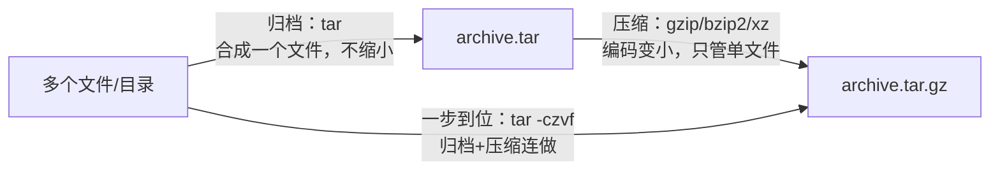

本篇是压缩归档的**速查手册**：先分清"打包"与"压缩"两件事（分不清则 tar 参数永远靠猜），再按工具给用法与预期输出，最后给出格式选型与完整性校验的速查表。

## 0. 心智模型：打包 ≠ 压缩



- **归档（archive）**：把一堆文件合成一个文件（tar），方便传输，体积几乎不减；
- **压缩（compress）**：用编码算法把单个文件变小（gzip/bzip2/xz），只管一个文件；
- `zip`/`7z` 是"归档+压缩"二合一，`tar + gzip` 是两大步骤的经典组合。

理解了这一点，tar 的参数就是两套字母：**动作（c 建 / x 解 / t 看）+ 压缩器（z gzip / j bzip2 / J xz）+ f 文件名**。

## 1. tar：归档主力

**创建** `tar -c[v]f <归档名> <路径>`（压缩加 z/j/J）

```bash
tar -cvf archive.tar src/           # 仅打包不压缩
tar -czvf project.tar.gz dist/      # 打包 + gzip（最通用）
tar -cjvf project.tar.bz2 dist/     # 打包 + bzip2（更慢，压缩率更高）
tar -cJvf project.tar.xz dist/      # 打包 + xz（最慢，压缩率最高）
tar -czf app.tar.gz --exclude='.git' --exclude='node_modules' .   # 排除目录
```

**查看** `tar -t[v]f <归档名>`

```bash
tar -tzvf project.tar.gz    # 列出内容不解压——解压前先看一眼是安全习惯
```

**解压** `tar -x[v]f <归档名>`

```bash
tar -xzvf project.tar.gz                 # 现代 tar 认后缀，z 可省略：tar -xvf 亦常可行
tar -xzvf project.tar.gz -C /opt/app/    # -C 指定解压目的地（目录需已存在）
tar -xzvf project.tar.gz path/to/file    # 只解压包内指定文件
```

```text
$ tar -czvf demo.tar.gz notes/
notes/
$ tar -tzf demo.tar.gz
notes/
$ tar -xzf demo.tar.gz && ls
demo.tar.gz  notes
```

助记口诀：**c 建包、x 解包、t 看包；z/j/J 对应 gz/bz2/xz；f 后面紧跟文件名**。记不住时只记 `tar -xf 任意.tar.*`（多数现代实现自动识别压缩格式）。

**两个安全要点**：

- 解压前先 `tar -tf` 看内容，防止"炸弹包"（包内路径混乱、覆盖现有文件）；现代 tar 解压时默认剥掉绝对路径开头的 `/`，不会写到包外，但相对路径仍可能覆盖当前目录同名文件。
- 归档路径尽量用相对路径：`tar -czf app.tar.gz -C /var/www myapp`（-C 先切到父目录，再打包 myapp），解出来就是一个干净的 `myapp/` 目录。

## 2. gzip / bzip2 / xz：单文件压缩

```bash
gzip large.log            # 压缩，原文件被替换为 large.log.gz
gzip -k large.log         # -k 保留原文件（keep）
gzip -d large.log.gz      # 解压（或 gunzip large.log.gz）
gzip -9 -k big.csv        # -1~-9 压缩率/速度档位，9 最慢最小

zcat large.log.gz         # 不解压直接看内容（排查压缩日志神器）
zgrep "ERROR" app.log.gz  # 直接在压缩文件里 grep

bzip2 bigfile.dat         # .bz2，压缩率高于 gzip，速度更慢
xz dump.sql               # .xz，压缩率最高，速度最慢
```

```text
$ ls -lh app.log* 
-rw-r--r-- 1 user user  48M Sep  9 10:00 app.log
-rw-r--r-- 1 user user 4.2M Sep  9 10:01 app.log.gz
```

单文件压缩的工具定位：日志轮转、数据库导出等"一个大文件"场景；一堆文件请先 tar 再压。

## 3. zip / unzip：跨平台交换

```bash
zip -r archive.zip src/                # 递归压缩目录
zip -r app.zip . -x "*/node_modules/*" # 排除模式
zip -e secret.zip docs/                # 加密码（交互输入；注意 zip 加密强度弱，敏感数据慎用）
unzip archive.zip                      # 解压到当前目录
unzip archive.zip -d /tmp/out          # 解压到指定目录
unzip -l archive.zip                   # 只看内容不解压
```

**经典陷阱：Windows 压的 zip 在 Linux 解出乱码文件名**。Windows 传统工具用本地编码（如 GBK）存文件名，Linux 默认按 UTF-8 解读。交换文件优先用 tar.gz；必须处理乱码 zip 时可借助支持指定编码的解压工具（如 `unzip -O gbk`，以本机版本支持为准）。

## 4. 7z 与 Windows 内置

```bash
# 7-Zip（需安装，跨平台，格式支持最全）
7z a archive.7z src/       # a = 添加
7z x archive.7z            # x = 解压（保留目录结构）
7z l archive.7z            # l = 列出内容
```

```powershell
# Windows 内置（PowerShell 5+），零安装
Compress-Archive -Path src\* -DestinationPath app.zip
Expand-Archive -Path app.zip -DestinationPath .\out
```

PowerShell 的 `Compress-Archive` 只支持 zip 格式，且对大文件（超 2GB）历史上有限制，跨平台交付仍以 tar.gz 为首选。

## 5. 格式选型速查

| 格式 | 命令 | 压缩率 | 速度 | 适用场景 |
| :--- | :--- | :--- | :--- | :--- |
| `.tar.gz` | `tar czf` | 中 | 快 | 通用首选，兼容性最好 |
| `.tar.bz2` | `tar cjf` | 较高 | 慢 | 老旧源码包常见 |
| `.tar.xz` | `tar cJf` | 最高 | 最慢 | 追求极限体积（发行版镜像） |
| `.zip` | `zip -r` | 低-中 | 快 | 与 Windows 用户交换文件 |
| `.7z` | `7z a` | 高 | 中 | 本地归档，需双方装 7-Zip |

经验法则：给别人下载用 `.tar.gz`（人人能解）；自己长期存档且体积敏感用 `.tar.xz`；跟 Windows 同事互传用 `.zip`。

## 6. 完整性校验与分割

传输/下载完成后**先校验再使用**，这是打包链路的最后一环：

```bash
# 生成校验文件（与压缩包一起发布）
sha256sum project.tar.gz > project.tar.gz.sha256

# 校验（输出 OK 即完好）
sha256sum -c project.tar.gz.sha256
# project.tar.gz: OK

# md5sum 用法相同，但安全性弱，仅用于防传输出错
md5sum image.iso
```

```text
$ sha256sum -c project.tar.gz.sha256
project.tar.gz: OK
```

超大文件传输前分割、收到后合并：

```bash
split -b 100M big.tar.gz part_     # 按每 100MB 切成 part_aa、part_ab...
cat part_* > big.tar.gz            # 按顺序合并还原（合并后记得 sha256sum 校验）
```

## 7. 小结

**初学者要点**：

- 打包（tar 合文件）与压缩（gzip 变小）是两件事，`tar -czvf` 只是把两步连做
- tar 三动作：`c` 建、`x` 解、`t` 看；`z` 是 gzip；`f` 后跟文件名
- 解压前先 `tar -tf` 看内容；`-C` 指定目的地
- 单文件压缩用 gzip，一堆文件先 tar；跨平台交换用 zip

**进阶注意**：

- `--exclude` 要写在路径前且模式与实际层级匹配，打包构建产物前先排除 `.git`、`node_modules`
- Windows zip 的非 ASCII 文件名在 Linux 可能乱码，跨平台交付优先 tar.gz
- 发布压缩包时同时提供 `sha256sum` 校验文件，下载方 `-c` 校验后再解压
- 单文件压缩场景善用 `zcat`/`zgrep` 直接操作压缩日志，省去解压步骤
