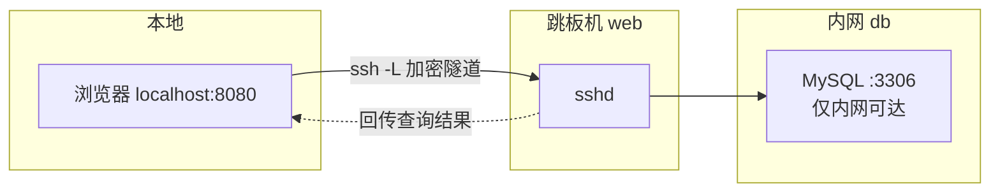

## 1. 从"配钥匙"说起：SSH 是什么

你有一台云服务器放在机房，人却在自己的电脑前——**SSH（Secure Shell）就是那条加密的"遥控通道"**：你在本地终端敲命令，命令经加密通道送到远端执行，结果原路传回。本地与远端的关系，就像你拿着配好的钥匙（密钥）进自己家（服务器），门禁系统（sshd 服务）验证钥匙后放行。

SSH 解决三件事：

| 需求 | SSH 能力 |
| :--- | :--- |
| 远程登录执行命令 | `ssh user@host` |
| 本地与远端传文件 | `scp` / `rsync` |
| 穿透网络访问内网服务 | 端口转发（-L / -R / -D） |

前置知识：本篇会用到进程概念（sshd 是常驻服务）、非交互 Shell 与重定向，见《进程与作业控制》与《管道与重定向》。

## 2. 基本连接

```bash
ssh username@203.0.113.10          # 指定用户登录
ssh -p 2222 deploy@example.com     # 非默认端口
ssh deploy@example.com "uptime"    # 直接执行一条命令，输出后退出
ssh -v deploy@example.com          # 详细日志排错（-vvv 更详细）
exit                               # 或 Ctrl+D 结束会话
```

```text
$ ssh deploy@203.0.113.10 "uptime"
 10:32:01 up 15 days,  3:12,  1 user,  load average: 0.08, 0.03, 0.01
```

### 2.1 第一次连接：主机指纹

首次连接会看到指纹确认：

```text
The authenticity of host '203.0.113.10' can't be established.
ED25519 key fingerprint is SHA256:xxxxxxxxxxxxxxxxxxxxxxxxxxxx.
Are you sure you want to continue connecting (yes/no/[fingerprint])?
```

这是 SSH 的"初次见面核对身份"：确认后主机公钥存入 `~/.ssh/known_hosts`，之后每次连接自动比对。生产环境建议通过带外渠道（云控制台）核对指纹，防止中间人攻击。

### 2.2 连不上的排查顺序

1. `ping`（或 `nc -zv host 22`）确认网络通、端口开；
2. `ssh -v` 看卡在哪一步：认证失败还是网络超时；
3. 服务器端查 `sudo journalctl -u sshd -n 50`（或 `/var/log/auth.log`）看拒绝原因；
4. 密码登录被禁用时确认自己有可用密钥（见下节）。

## 3. 密钥免密登录

每次输密码既慢又不安全。**SSH 密钥对**是标准解法：私钥留在本地（绝不出门），公钥放到服务器上"锁孔"里。

### 3.1 生成与部署

```bash
# 1. 生成 Ed25519 密钥对（现代推荐算法）
ssh-keygen -t ed25519 -C "deploy@mylaptop"
# 提示保存路径（默认 ~/.ssh/id_ed25519）与口令（passphrase，可为空）

# 2. 把公钥装到服务器（一次一条命令）
ssh-copy-id -i ~/.ssh/id_ed25519.pub deploy@example.com

# 3. 验证：不再询问密码即成功
ssh deploy@example.com "echo ok"
```

```text
预期输出：
$ ssh deploy@example.com "echo ok"
ok
```

手动部署的等价操作（ssh-copy-id 不可用时的兜底）：

```bash
cat ~/.ssh/id_ed25519.pub | ssh deploy@example.com \
    "mkdir -p ~/.ssh && cat >> ~/.ssh/authorized_keys && chmod 700 ~/.ssh && chmod 600 ~/.ssh/authorized_keys"
```

### 3.2 权限是第一陷阱

sshd 对权限极度严格，权限错了会直接拒绝密钥登录（服务端日志常见 `Authentication refused: bad ownership or modes`）：

| 路径 | 要求权限 |
| :--- | :--- |
| `~/.ssh/`（服务器端） | 700，属主必须是登录用户 |
| `~/.ssh/authorized_keys` | 600 |
| 本地私钥 `id_ed25519` | 600（过宽时 ssh 会警告并可能拒用） |

```bash
chmod 700 ~/.ssh && chmod 600 ~/.ssh/authorized_keys   # 服务器端修复
```

### 3.3 口令与 ssh-agent

私钥设了 passphrase 后每次连接都要输一次口令，用 ssh-agent 缓存解锁结果：

```bash
eval "$(ssh-agent -s)"     # 启动代理（或由桌面环境自动管理）
ssh-add ~/.ssh/id_ed25519  # 输入一次口令，之后会话内免输
```

安全模型：私钥文件即使泄露，没有口令也用不了；口令只输给本机 agent，从不离开你的电脑。

## 4. ssh config：多主机管理

服务器一多，`ssh -p 2222 deploy@203.0.113.10 -i ~/.ssh/special_key` 记不住也敲不动。写入 `~/.ssh/config` 后一个别名搞定：

```text
# ~/.ssh/config（权限 600）
Host web
    HostName 203.0.113.10
    User deploy
    Port 2222
    IdentityFile ~/.ssh/id_ed25519

Host db
    HostName 10.0.0.5
    User deploy
    ProxyJump web          # 经 web 跳板机中转，连不通外网的 db

Host *
    ServerAliveInterval 60   # 每 60 秒发心跳，防止空闲断线
    ServerAliveCountMax 3
```

```bash
ssh web                    # 等价于完整的 ssh -p 2222 deploy@203.0.113.10 -i ...
scp app.tar.gz web:/tmp/   # scp/rsync 同样识别别名
ssh db                     # 自动经 web 中转
```

config 是"一次配置、处处生效"的：ssh、scp、rsync、git（远程仓库走 SSH 时）全部共用这套别名。

## 5. 远程执行与引号陷阱

`ssh host "command"` 把命令送到远端执行，**引号在哪一层被展开**是核心陷阱：

```bash
NAME=alice

ssh host "echo hello $NAME"    # 双引号：本地先展开 $NAME，远端收到 echo hello alice
ssh host 'echo hello $NAME'    # 单引号：原样送达，远端展开远端的 NAME 变量
```

需要远端多步操作时，用 heredoc 保持可读性：

```bash
ssh deploy@web 'bash -s' <<'EOF'
set -euo pipefail
cd /opt/myapp
git pull
systemctl restart myapp
echo "部署完成"
EOF
```

要点：

- heredoc 定界符 `<<'EOF'` 加引号表示内容不做本地展开，整段脚本原样交给远端 bash
- 远程命令的**退出码会传回本地**：远端失败则 `ssh` 返回非零，可被 `set -e` 捕获
- 需要交互（sudo、top）时加 `-t` 强制分配伪终端：`ssh -t host sudo systemctl restart nginx`

## 6. 文件传输：scp 与 rsync

### 6.1 scp：简单直接

```bash
scp local.tar.gz web:/tmp/              # 本地 -> 远端
scp web:/var/log/app.log ./             # 远端 -> 本地
scp -r ./src web:/opt/myapp/src         # 递归传目录
scp -P 2222 file web:/tmp/              # 注意 scp 用大写 -P 指定端口（ssh 是小写 -p）
```

新版 OpenSSH 中 scp 底层已默认改用 SFTP 协议传输（旧版为 SCP 协议），日常用法不变。

### 6.2 rsync：增量同步的正确工具

scp 每次全量复制；**rsync 只传差异**，大目录二次同步快几个数量级，还支持排除、删除对端多余文件：

```bash
rsync -avz ./dist/ web:/var/www/myapp/      # 增量同步构建产物
rsync -avz --delete --dry-run ./dist/ web:/var/www/myapp/   # 先演练！
rsync -avz --exclude='node_modules' ./proj/ web:/opt/proj/
```

**rsync 最大的陷阱：结尾斜杠语义**。

```bash
rsync -av src  dst/    # 把 src 目录本身放进 dst/，得到 dst/src/...
rsync -av src/ dst/    # 把 src 里面的内容放进 dst/，得到 dst/...
```

`src/` 与 `src` 差一个字符，结果完全不同。**首次使用先加 `--dry-run`（或 `-n`）看清单再真跑**，`--delete`（让对端与本地完全一致，多出的文件被删）更是必须先演练——`--delete` 配错方向会删掉对端文件。

```text
预期输出（rsync -avz）：
sending incremental file list
index.html
assets/main-a1b2c3.js
sent 12,345 bytes  received 89 bytes  total size 45,678  speedup is 3.68
```

`speedup` 大于 1 说明增量生效了。rsync 走 SSH 通道加密（默认 remote shell 为 ssh），安全性与 ssh 一致。

## 7. 端口转发：把远端服务"借"到本地



```bash
# 本地转发 -L：访问本地 8080 等于访问远端内网的 3306
ssh -L 8080:10.0.0.5:3306 web -N
# 另开终端验证
mysql -h 127.0.0.1 -P 8080 -u app -p

# 远程转发 -R：把本地开发机服务暴露给远端访问
ssh -R 9000:localhost:3000 web

# 动态转发 -D：本地起 SOCKS5 代理，流量经跳板机出去
ssh -D 1080 web -N
```

| 参数 | 语义 | 典型场景 |
| :--- | :--- | :--- |
| `-L 本地端口:目标:目标端口` | 本地端口转发 | 本地访问内网数据库、管理后台 |
| `-R 远端端口:目标:目标端口` | 远程端口转发 | 让服务器回调本机调试的回调服务 |
| `-D 本地端口` | SOCKS 动态代理 | 临时以服务器出口访问受限资源 |
| `-N` | 只建隧道不执行命令 | 转发的标配后缀 |

配合 `-f`（认证后转入后台）可让隧道常驻：`ssh -fN -L 8080:10.0.0.5:3306 web`。更稳定的长期隧道建议交给 autossh 或 systemd 服务管理，避免断线后无人重连。

## 8. 完整案例：批量执行与发布

```bash
#!/bin/bash
# batch.sh - 在多台主机上执行同一条命令
set -euo pipefail

HOSTS=(web1 web2 web3)          # 使用 ssh config 别名

for host in "${HOSTS[@]}"; do
    echo "==> $host"
    if ssh -o ConnectTimeout=5 -o BatchMode=yes "$host" 'bash -s' <<'EOF'
set -euo pipefail
uptime
systemctl is-active myapp
EOF
    then
        echo "==> $host 完成"
    else
        echo "==> $host 失败（退出码 $?）" >&2
    fi
done
```

要点：

- `-o BatchMode=yes` 禁止任何交互提示（密钥不可用时直接失败而不是卡住等输密码），批量脚本必加
- `-o ConnectTimeout=5` 防止坏主机拖死整个循环
- 循环内对失败主机记录并继续，最后统一汇报——比"第一台失败就全停"更适合巡检场景

发布场景把 `ssh 'bash -s'` 换成 `rsync -avz --delete ./dist/ web:/var/www/myapp/`，即为最简的静态站点发布脚本（先 `--dry-run` 演练，见第 6 节）。

## 9. 常见陷阱

**陷阱一：known_hosts 告警不当回事（或反应过度）。** 看到 `WARNING: REMOTE HOST IDENTIFICATION HAS CHANGED!` 先核实：服务器重装系统换密钥属正常，确认后执行 `ssh-keygen -R "203.0.113.10"` 移除旧指纹再连；**不明原因出现该告警可能意味着中间人攻击，不要盲目清记录**。

**陷阱二：私钥权限过宽。** 本地私钥 644 时 ssh 拒绝使用，`chmod 600 ~/.ssh/id_ed25519` 修复；私钥永不外发、不进 Git 仓库。

**陷阱三：引号层级混乱。** `ssh host "cd /opt && ls $DIR"` 中 `$DIR` 在本地展开（多半是空），想用远端变量请用单引号包整条命令。

**陷阱四：scp/rsync 方向与斜杠搞反。** 先 `--dry-run` 看清单；`--delete` 使用前必须演练，方向反了等于清空目标。

**陷阱五：脚本里裸 ssh 卡死。** 没配密钥时 ssh 交互式等密码，脚本永远停住——批量场景必加 `BatchMode=yes` 与 `ConnectTimeout`。

## 10. 小结

**初学者要点**：

- `ssh user@host` 登录、`ssh host 'cmd'` 执行、`scp/rsync` 传文件，四个命令覆盖九成场景
- 免密 = `ssh-keygen`（本地生成）+ `ssh-copy-id`（公钥上服务器），权限 700/600 不能错
- 多台服务器先写 `~/.ssh/config` 别名，之后 ssh/scp/rsync/git 通用
- rsync 用结尾斜杠区分"传目录本身"还是"传目录内容"，拿不准先 `--dry-run`

**进阶注意**：

- 引号决定变量在哪一层展开：双引号本地展开、单引号原样送达远端
- 端口转发三件套 `-L/-R/-D` 是访问内网资源的瑞士军刀，`-N` 表示只建隧道
- 批量脚本加 `BatchMode=yes`、`ConnectTimeout`，失败不中断、最后汇总
- host 指纹告警先核实再清除；安全加固（禁密码登录、禁 root 直登）建议在能保住现有密钥登录后再做
