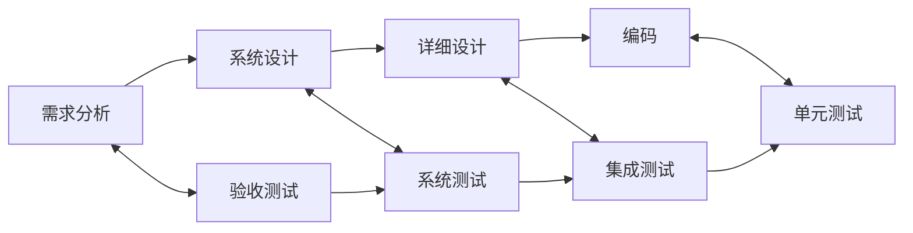

## 1. 测试基础概念

### 1.1 什么是软件测试

软件测试是通过**手动或自动化**手段来运行或检验软件系统的过程，目的是发现缺陷、验证功能、评估质量。

### 1.2 测试目的

| 目的     | 描述                 |
| -------- | -------------------- |
| 发现缺陷 | 找出软件中的错误     |
| 验证功能 | 确认软件满足需求     |
| 评估质量 | 度量软件质量水平     |
| 提供信心 | 为发布提供质量保证   |
| 预防缺陷 | 通过早期测试预防问题 |

### 1.3 测试与调试

| 对比项   | 测试              | 调试     |
| -------- | ----------------- | -------- |
| 目的     | 找缺陷            | 修缺陷   |
| 执行者   | 测试人员/开发人员 | 开发人员 |
| 方式     | 系统化            | 探索式   |
| 可预见性 | 可计划            | 不可预见 |

### 1.4 静态测试与动态测试

按「要不要真的运行程序」划分两大类。**静态测试**不运行代码：评审需求与
设计文档、代码审查（code review）、静态分析工具（ESLint、SonarQube 的
静态规则）都属于这一类——它们在代码「跑起来之前」就能发现缺陷，而大量
研究一致表明缺陷越早发现修复成本越低。**动态测试**则要真正执行程序：
单元测试、集成测试、性能测试都在其列。

| 维度     | 静态测试               | 动态测试               |
| -------- | ---------------------- | ---------------------- |
| 是否运行 | 不运行                 | 必须运行               |
| 对象     | 文档、代码本身         | 运行中的系统           |
| 代表手段 | 评审、代码审查、lint   | 单元/集成/系统/E2E     |
| 发现的缺陷 | 规范、逻辑、可维护性问题 | 行为、接口、性能问题 |

一个常见的误解是把「测试」等同于「写用例跑程序」。工程实践中评审与静态
分析发现的缺陷数量往往不低于动态测试，且修复成本低得多——这正是「测试
左移」（见「安全与移动测试」）的理论基础。

### 1.5 验证与确认（V&V）

这对术语回答的是两个不同的问题：

- **验证（Verification）**：我们是否**正确地构建了产品**——产出是否符合
  规格说明？（ Did we build the product right?）
- **确认（Validation）**：我们是否**构建了正确的产品**——产出是否满足
  用户真实需要？（Did we build the right product?）

类比：验证像「按图纸验收房子」（墙的位置和图纸一致吗），确认像「住户
验收房子」（住起来真的舒服吗）。图纸本身错了，验证全通过的房子依然
不是用户想要的——对应测试七原则中的「无错误谬误」：没有发现缺陷不
等于系统满足需求。测试金字塔的各层主要承担验证职责，而验收测试
（UAT）、探索性测试是确认的主战场。

## 2. 测试七原则

### 原则1：测试显示缺陷的存在

测试只能证明缺陷存在，不能证明缺陷不存在。

### 原则2：穷尽测试不可能

无法测试所有输入组合，需要基于风险选择测试范围。

### 原则3：尽早测试

越早发现缺陷，修复成本越低。

```
需求阶段发现 → 修复成本 1x
设计阶段发现 → 修复成本 5x
编码阶段发现 → 修复成本 10x
测试阶段发现 → 修复成本 20x
生产阶段发现 → 修复成本 100x
```

### 原则4：缺陷集群性

少数模块通常包含大部分缺陷（帕累托法则：80% 的缺陷集中在 20% 的模块中）。

### 原则5：杀虫剂悖论

反复使用相同的测试用例将无法发现新缺陷，需要不断更新和补充测试。

### 原则6：测试依赖于上下文

不同类型的应用需要不同的测试方法。

### 原则7：无错误谬误

没有发现缺陷不等于软件可用，还需要验证是否满足用户需求。

## 3. 测试模型

### 3.1 V 模型



### 3.2 W 模型

V 模型的改进，强调测试与开发并行：

```
需求分析 → 需求评审
    ↓           ↓
系统设计 → 系统测试设计
    ↓           ↓
详细设计 → 集成测试设计
    ↓           ↓
  编码   → 单元测试设计
```

### 3.3 敏捷测试

| 特点       | 描述           |
| ---------- | -------------- |
| 持续测试   | 每个迭代都测试 |
| 全团队参与 | 开发和测试协作 |
| 自动化优先 | 快速反馈       |
| 探索性测试 | 补充自动化不足 |

## 4. 测试生命周期

### 4.1 基本过程

```
1. 测试计划 → 确定范围、策略、资源
2. 测试分析 → 分析需求、识别测试条件
3. 测试设计 → 设计测试用例
4. 测试实现 → 编写脚本、准备数据
5. 测试执行 → 运行测试、记录结果
6. 测试评估 → 评估出口准则
7. 测试报告 → 生成测试报告
8. 测试收尾 → 归档、经验总结
```

### 4.2 测试出口准则

| 准则   | 描述                    |
| ------ | ----------------------- |
| 覆盖率 | 代码/需求覆盖率达到目标 |
| 缺陷率 | 未修复缺陷低于阈值      |
| 通过率 | 测试通过率达到目标      |
| 风险   | 剩余风险可接受          |

## 5. 缺陷管理

### 5.1 缺陷生命周期

```
新建 → 已确认 → 已分配 → 修复中 → 已修复 → 已验证 → 已关闭
                    ↓                    ↓
               已拒绝              重新打开
```

### 5.2 缺陷属性

| 属性     | 描述                      |
| -------- | ------------------------- |
| 严重程度 | 致命/严重/一般/轻微       |
| 优先级   | 紧急/高/中/低             |
| 状态     | 新建/已确认/已修复/已关闭 |
| 环境     | 操作系统/浏览器/版本      |

### 5.3 严重程度 vs 优先级

严重程度回答「这个缺陷有多坏」，优先级回答「要多快修」——两者通常正相关
但不等同：启动页的错别字严重程度轻微，却可能因影响第一印象被排成高优
先级；一个极深角落的崩溃严重程度高，却可能因触发条件苛刻而低优先级。
定级时先客观评严重程度，再结合业务影响排优先级。

| 严重程度 | 优先级 | 示例               |
| -------- | ------ | ------------------ |
| 致命     | 紧急   | 系统崩溃、数据丢失 |
| 严重     | 高     | 核心功能不可用     |
| 一般     | 中     | 非核心功能异常     |
| 轻微     | 低     | UI 文案错误        |

## 小结

- 初学者要点：测试的目的是发现缺陷、验证需求、评估质量——「没找到缺陷」
  不等于「软件没问题」（无错误谬误）；七原则里最常用的是「穷尽测试不可
  能」与「缺陷集群性」，它们直接决定精力往哪投；缺陷的严重程度与修复
  优先级是两个维度，不要混用。
- 进阶注意：V 模型回答「每个开发阶段对应哪层测试」，W 模型进一步强调
  「测试与开发并行、测试对象不只是代码」（需求评审也是测试）；生命周期
  中分析、设计发生在执行之前，出口准则（覆盖率、通过率、剩余风险）应
  写进测试计划而不是测试结束时临时解释；测试与调试的分工是「测试证明
  缺陷存在，调试定位缺陷原因」。
