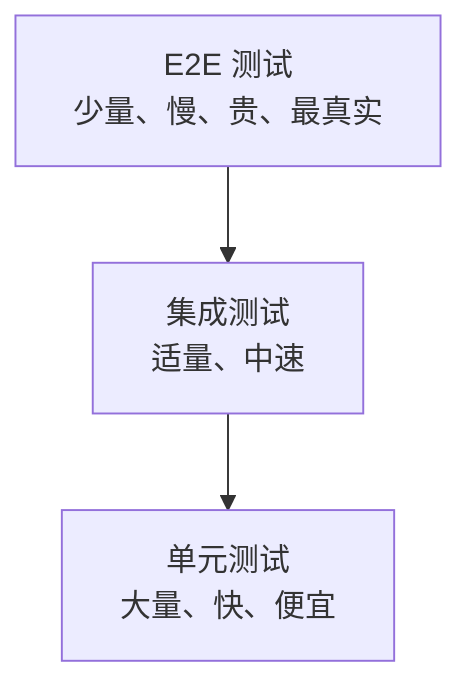

## 1. 测试金字塔

### 1.1 经典金字塔

Mike Cohn 提出的经典分层：底层大量快速的单元测试，中层适量集成测试，
顶层少量昂贵的端到端测试。越往上越接近真实用户，也越慢、越贵、越难
定位失败原因。



### 1.2 各层对比

| 层级     | 范围     | 速度 | 成本 | 数量 | 失败定位 |
| -------- | -------- | ---- | ---- | ---- | -------- |
| 单元测试 | 函数/类  | 毫秒 | 低   | 多   | 精确到函数 |
| 集成测试 | 模块间   | 秒   | 中   | 适量 | 定位到接口 |
| 系统测试 | 整体系统 | 分钟 | 高   | 少   | 需排查链路 |
| 验收测试 | 业务场景 | 分钟 | 高   | 少   | 需排查链路 |

### 1.3 测试奖杯：对金字塔的修正

金字塔并非唯一答案。Kent C. Dodds 针对前端与微服务场景提出「测试奖杯
（Testing Trophy）」：把**集成测试**作为投入重心——它们比 E2E 快而稳，
又比单元测试更接近真实行为，对「胶水代码多、逻辑在组装层」的应用保护
性价比最高。两种模型的共识是：E2E 保持少量，纯 Mock 链式单元测试的
性价比有限。

选择取决于代码形态：核心资产是纯逻辑（算法、规则引擎）→ 金字塔；
核心资产是组装与胶水（前端应用、服务编排）→ 奖杯。多数团队的实际
落点是「金字塔 + 偏厚的中层」。

## 2. 单元测试

### 2.1 定义

对软件中最小可测试单元（函数、方法、类）进行验证。

### 2.2 特点

| 特点   | 描述             |
| ------ | ---------------- |
| 隔离性 | 与外部依赖隔离   |
| 快速   | 毫秒级执行       |
| 自动化 | CI/CD 集成       |
| 可重复 | 任何环境结果一致 |

### 2.3 AAA 模式

```python
def test_user_creation():
    # Arrange（准备）
    user_data = {"name": "Alice", "email": "alice@example.com"}

    # Act（执行）
    user = create_user(user_data)

    # Assert（断言）
    assert user.name == "Alice"
    assert user.email == "alice@example.com"
```

### 2.4 Mock 与 Stub

| 技术 | 描述         | 用途               |
| ---- | ------------ | ------------------ |
| Stub | 返回固定值   | 替换外部依赖       |
| Mock | 验证交互行为 | 验证方法是否被调用 |
| Spy  | 记录调用     | 部分模拟           |
| Fake | 简化实现     | 内存数据库         |

```python
from unittest.mock import Mock, patch

# Stub
db = Mock()
db.get_user.return_value = {"id": 1, "name": "Alice"}

# Mock
email_service = Mock()
create_user(data, email_service)
email_service.send_welcome.assert_called_once_with("alice@example.com")
```

## 3. 集成测试

### 3.1 定义

验证模块间的接口和交互是否正确。

### 3.2 集成策略

| 策略     | 描述               | 优缺点         |
| -------- | ------------------ | -------------- |
| 大爆炸   | 一次性集成所有模块 | 简单但定位困难 |
| 自顶向下 | 从上层模块开始     | 需要 Stub      |
| 自底向上 | 从底层模块开始     | 需要 Driver    |
| 三明治   | 上下同时进行       | 综合方案       |
| 增量式   | 逐步添加模块       | 定位容易       |

### 3.3 集成测试类型

| 类型       | 描述           |
| ---------- | -------------- |
| 组件集成   | 模块间接口测试 |
| 系统集成   | 子系统间测试   |
| API 集成   | 接口契约测试   |
| 数据库集成 | 数据层交互测试 |

### 3.4 集成测试的边界：替身到哪一层为止

集成测试的价值取决于「哪些依赖是真的」。判断标准：**在你能承受的速度内，
让边界越真越好**——

- 数据库用真实引擎（本地容器，如 Testcontainers），不用 Mock 的仓储层：
  SQL 方言、约束、事务行为是 Mock 测不出的高频缺陷区；
- 消息队列用内存实现或真实实例，验证序列化与投递语义；
- 第三方 HTTP 依赖用契约测试或本地 Stub 服务器（如 WireMock），保持
  报文格式真实；
- 时间、随机源注入可控实现，保证可重复。

只有「不可控的外部世界」（支付渠道、短信网关）才用替身，因为你要测的
是「我方如何应对它」，而不是「它如何工作」。

### 3.5 示例

```python
import pytest
from httpx import AsyncClient
from app.main import app

@pytest.mark.asyncio
async def test_user_api_integration():
    async with AsyncClient(app=app, base_url="http://test") as client:
        # 创建用户
        response = await client.post("/api/users", json={
            "name": "Alice",
            "email": "alice@example.com"
        })
        assert response.status_code == 201
        user_id = response.json()["id"]

        # 查询用户
        response = await client.get(f"/api/users/{user_id}")
        assert response.status_code == 200
        assert response.json()["name"] == "Alice"
```

## 4. 系统测试

### 4.1 定义

对完整系统进行端到端测试，验证是否满足需求规格。

### 4.2 测试类型

| 类型       | 描述               |
| ---------- | ------------------ |
| 功能测试   | 验证功能需求       |
| 非功能测试 | 性能、安全、兼容性 |
| 端到端测试 | 完整业务流程       |

### 4.3 端到端测试示例

```javascript
// Playwright E2E 测试
import { test, expect } from '@playwright/test';

test('user can login and view dashboard', async ({ page }) => {
  await page.goto('/login');
  await page.fill('[name="email"]', 'user@example.com');
  await page.fill('[name="password"]', 'password123');
  await page.click('button[type="submit"]');

  await expect(page).toHaveURL('/dashboard');
  await expect(page.locator('h1')).toContainText('Welcome');
});
```

## 5. 验收测试

### 5.1 定义

由用户或客户验证软件是否满足业务需求。

### 5.2 类型

| 类型       | 描述                 | 执行者   |
| ---------- | -------------------- | -------- |
| Alpha 测试 | 开发环境中的用户测试 | 内部用户 |
| Beta 测试  | 生产环境中的用户测试 | 外部用户 |
| UAT        | 用户验收测试         | 业务用户 |
| 合同验收   | 合同要求验证         | 客户代表 |

### 5.3 验收准则

```gherkin
Feature: 用户登录
  Scenario: 成功登录
    Given 用户在登录页面
    When 输入正确的用户名和密码
    Then 跳转到首页
    And 显示欢迎消息

  Scenario: 密码错误
    Given 用户在登录页面
    When 输入错误的密码
    Then 显示错误提示
    And 仍在登录页面
```

## 6. 测试层级选择

| 场景     | 推荐层级          |
| -------- | ----------------- |
| 日常开发 | 单元测试为主      |
| API 开发 | 单元+集成测试     |
| Web 应用 | 单元+集成+E2E     |
| 微服务   | 契约测试+集成测试 |
| 关键业务 | 全层级覆盖        |

## 小结

- 初学者要点：金字塔从下到上是「多-中-少」；单元测试用 AAA 结构、隔离
  外部依赖；集成测试验证模块间真实交互；E2E 只留关键路径。
- 进阶注意：奖杯模型把集成层做厚，更适合胶水型应用；集成测试的边界
  原则是「越真越好、以速度为限」，数据库优先用真实引擎；微服务间的
  兼容性靠契约测试守护，Mock 假设不是合同。
