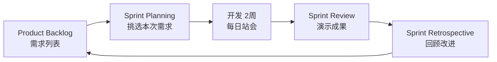
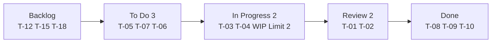

## 1. 从"做菜 vs 外卖"说起

### 1.1 两种做事的风格

想象你要给朋友做一顿饭：

**方式 A（传统/瀑布式）**：先花一周研究菜谱、列食材清单、规划流程，然后一次性把所有菜做出来端上桌。如果朋友中途说"不想吃辣了"——之前的规划全废。

**方式 B（敏捷式）**：先快速做一道简单的菜让朋友尝尝，朋友说"有点咸"→ 你调整 → 再做一道 → 再反馈 → 逐步调整，直到朋友满意。

**敏捷开发（Agile）就是方式 B**：不追求"一次性交付完美产品"，而是**短周期迭代、快速交付、持续响应变化**——先做一个最小可用版本，收集反馈，再逐步完善。

### 1.2 敏捷的诞生

2001 年，17 位软件工程专家聚在一起，发表了著名的**敏捷宣言（Agile Manifesto）**，针对当时"文档驱动、流程繁重"的瀑布式开发，提出了一种更轻量、更贴近现实的方法论。

## 2. 敏捷宣言与原则

### 2.1 四大价值观

| 价值 | 优先于 |
| :--- | :--- |
| 个体和互动 | 流程和工具 |
| 可工作的软件 | 详尽的文档 |
| 客户合作 | 合同谈判 |
| 响应变化 | 遵循计划 |

**注意**：敏捷宣言不是说"不要文档、不要计划"，而是说"当两者冲突时，**更看重左边**"。文档仍然要写，但"能工作的软件"比"详尽的文档"更有价值。

### 2.2 十二原则（核心摘要）

1. 最高优先级是**尽早持续交付**有价值的软件
2. **欢迎需求变化**，即使开发后期（变化是机会不是麻烦）
3. 频繁交付可工作的软件（周期越短越好）
4. 业务人员与开发者**每日协作**
5. 以积极的人为核心，提供所需环境和信任
6. **面对面沟通**是最有效的信息传递方式
7. 可工作的软件是**进度的首要度量**
8. 可持续的开发节奏（不要透支团队）
9. 持续关注**技术卓越和良好设计**
10. 简洁——最大化未完成工作量的艺术（少做不必要的事）
11. 最好的架构、需求和设计出自**自组织团队**
12. 团队定期**反思和调整**（持续改进）

## 3. Scrum 框架：最流行的敏捷实践

Scrum 是敏捷的**具体实现**，它定义了清晰的角色、事件和工件。可以这样理解：敏捷是"理念"，Scrum 是"执行 Scrum 的具体规则"。

### 3.1 三个角色

| 角色 | 职责 | 关注点 |
| :--- | :--- | :--- |
| Product Owner（产品负责人） | 管理 Product Backlog，定义需求优先级 | 做正确的事（what） |
| Scrum Master（敏捷教练） | 移除障碍，确保 Scrum 实践 | 正确地做事（how） |
| Development Team（开发团队） | 自组织完成 Sprint 目标 | 高效地做事（do） |

**要点**：Scrum Master 不是"项目经理"，他不命令团队做什么，而是"清除障碍"——让团队能专注工作。开发团队"自组织"：自己决定如何完成 Sprint 目标。

### 3.2 五个事件

以两周的 Sprint（冲刺）为例：

| 事件 | 时长（2周 Sprint） | 参与者 | 目的 |
| :--- | :--- | :--- | :--- |
| Sprint | 2周 | 全员 | 交付增量 |
| Sprint Planning | 4小时 | 全员 | 规划 Sprint 目标 |
| Daily Standup | 15分钟 | 开发团队 | 同步进度和障碍 |
| Sprint Review | 2小时 | 全员+利益相关者 | 展示成果 |
| Sprint Retrospective | 1.5小时 | 全员 | 改进流程 |

**关键事件解读**：

- **Sprint Planning**：Sprint 开始前，团队从 Backlog 挑选本次要做的需求，并确定 Sprint 目标
- **Daily Standup（每日站会）**：每天 15 分钟，只回答三个问题——"昨天做了什么？今天做什么？有什么障碍？"（站着开，保证简短）
- **Sprint Review**：Sprint 结束时，向利益相关者演示"做出来了什么"
- **Sprint Retrospective（回顾）**：最重要的事件——团队反思"哪些做得好、哪些要改进"，并制定具体改进动作

### 3.3 三个工件

| 工件 | 说明 | 负责人 |
| :--- | :--- | :--- |
| Product Backlog | 所有需求的有序列表（按优先级） | Product Owner |
| Sprint Backlog | 当前 Sprint 的任务（从 Backlog 挑选） | Development Team |
| Increment | 可交付的产品增量（每个 Sprint 的产出） | Development Team |

**产品待办列表（Product Backlog）**是整个产品"要做的事"的清单，按优先级排序，Product Owner 负责维护。Sprint 开始时，团队从列表顶部挑选本次要做的条目。

### 3.4 Sprint 流程



## 4. Kanban 方法：可视化流动

Kanban（看板）是另一种敏捷实践，它不强制固定周期，更强调**可视化与流动效率**。

### 4.1 六大核心原则

1. **可视化工作流**：看板展示所有工作项（Backlog → To Do → In Progress → Review → Done）
2. **限制 WIP（Work In Progress）**：限制每列在制品数量（防止同时做太多事）
3. **管理流动**：优化工作项从左到右的流动
4. **显式策略**：明确"完成"的定义（DoD）
5. **反馈环**：定期评审和改进
6. **协作改进**：团队共同优化流程

### 4.2 Kanban 看板示例



**WIP 限制的意义**：In Progress 列最多 2 个任务。当列满时，团队必须先"完成一个"才能"开始下一个"——这防止了"同时开工 10 件事、一件都没完成"的低效状态。

### 4.3 Scrum vs Kanban

| 维度 | Scrum | Kanban |
| :--- | :--- | :--- |
| 迭代周期 | 固定 Sprint | 无固定周期 |
| 变更 | Sprint 内不变 | 随时可变 |
| WIP 限制 | Sprint 容量 | 每列 WIP 限制 |
| 角色 | PO/SM/Team | 无规定角色 |
| 度量 | 速度（Velocity） | Lead Time / Cycle Time |
| 适用 | 产品开发 | 运维/支持 |

**怎么选**：做产品（有明确版本节奏）用 Scrum；做运维/支持（持续小批量任务）用 Kanban。两者也可以混用（Scrumban）。

## 5. Backlog 管理：需求的载体

### 5.1 用户故事

Backlog 里的需求通常写成**用户故事**：

```
作为 [角色]，我希望 [功能]，以便 [业务价值]
```

```text
作为 注册用户，
我希望 能够重置密码，
以便 我忘记密码时可以重新访问账户
```

**INVEST 原则**：好故事应该满足：

| 原则 | 含义 |
| :--- | :--- |
| Independent | 故事之间尽量独立 |
| Negotiable | 故事是可协商的 |
| Valuable | 对用户或业务有价值 |
| Estimable | 可以估算工作量 |
| Small | 足够小，一个 Sprint 内完成 |
| Testable | 可以验证是否完成 |

### 5.2 验收标准

故事只有配上**验收标准（Acceptance Criteria）**才是完整的：

```text
验收标准:
1. 用户点击"忘记密码"链接
2. 输入注册邮箱
3. 系统发送重置链接到邮箱
4. 链接30分钟内有效
5. 重置密码需满足复杂度要求
```

**没有验收标准的故事 = 没定义"什么叫做完"**，团队会陷入"做好了没有"的争论。

### 5.3 故事估算

| 方法 | 说明 |
| :--- | :--- |
| 故事点 | 相对复杂度估算（斐波那契数列：1,2,3,5,8,13） |
| T恤尺码 | S/M/L/XL 粗粒度估算 |
| 理想天数 | 假设无干扰的完成天数 |

**规划扑克**：团队成员同时出牌（亮出估算点数），差异大时讨论——让"估算差异"暴露认知偏差。

### 5.4 优先级排序

| 方法 | 说明 |
| :--- | :--- |
| MoSCoW | Must（必须有）/ Should（应该有）/ Could（可以有）/ Won't（不要） |
| WSJF | 加权最短作业优先（价值/时长） |
| 价值/成本比 | ROI 排序 |
| Kano 模型 | 基本需求/期望需求/兴奋需求 |

## 6. 敏捷度量：用数据说话

### 6.1 速度（Velocity）

$$\text{Velocity} = \sum_{i \in \text{Sprint}} \text{StoryPoints}_i$$

每个 Sprint 完成的故事点总和。**速度用于规划**：团队知道"平均每 Sprint 能完成多少点"，就能预测下个 Sprint 能接多少需求。

**注意**：速度不是考核工具！不同团队的速度不可比较（故事点本来就是相对的）。比"绝对速度"更重要的是"速度的稳定性"。

### 6.2 燃尽图（Burndown Chart）


横轴是 Sprint 天数，纵轴是剩余故事点。理想线是从 100 直线降到 0；实际线如果偏离，说明进度有问题（偏离太快 = 任务过多；偏离太慢 = 可能没做实事）。

### 6.3 Lead Time vs Cycle Time

| 指标 | 定义 | 含义 |
| :--- | :--- | :--- |
| Lead Time | 需求提出到交付 | 客户感知的响应时间 |
| Cycle Time | 开始工作到完成 | 团队的执行效率 |

**理解**：Lead Time 包含"等待时间"（需求排队等开发），Cycle Time 只算"实际干活时间"。缩短 Lead Time 往往比缩短 Cycle Time 更关键（因为等待时间占比更大）。

## 7. 敏捷落地：常见失败模式

### 7.1 仪式化敏捷（Agile Theater）

**症状**：开了所有会、走了所有流程，但只是"看起来敏捷"——每日站会变成"向领导汇报"，回顾会开完没有改进动作。

**对策**：会议的目的是**沟通与改进**，不是"走流程"。每个会议都要有产出（站会产生障碍清单，回顾会产生改进动作）。

### 7.2 需求仍大爆炸

**症状**：说好"小步迭代"，但每个 Sprint 仍然塞进大量需求，团队加班赶工。

**对策**：遵守"Small"原则——一个 Sprint 只做"能完成"的事，宁可少做也要做透。

### 7.3 缺乏自组织

**症状**：团队习惯被命令，Scrum Master 变成"包工头"，成员不主动。

**对策**：自组织需要时间和信任。先让团队自己决定"如何完成目标"，逐步培养自主性。

### 7.4 回顾会流于形式

**症状**：每次回顾都说"没什么问题"，改进动作从不落实。

**对策**：回顾会必须产出"可执行的改进动作"（哪怕只有一个），并跟踪落实——"改进闭环"是敏捷持续进步的动力（详见 039-engineering-practices《事故复盘方法论》）。
