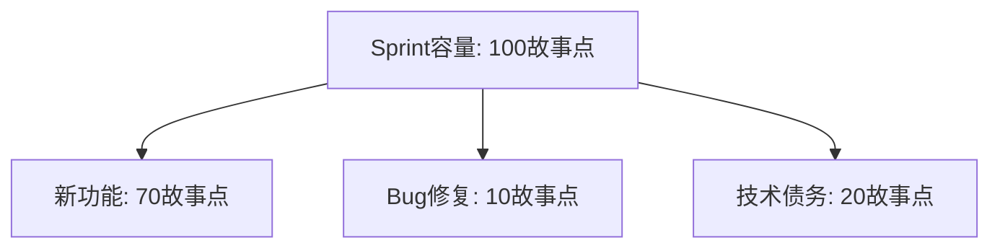

## 1. 从"信用卡欠款"说起

### 1.1 技术债务是什么

想象你用信用卡买了一个新手机。**你用"未来的钱"换来了"今天的方便"**——但欠款有代价：要还利息，而且欠得越久、还起来越痛苦。

**技术债务（Technical Debt）就是软件开发中的"信用卡"**：为了短期利益（赶 deadline、快速上线），你采取了"次优的技术决策"（跳过设计、不写测试、复制粘贴），这些决策累积了**额外的长期维护成本**——就像欠款的"利息"。

> **技术债务 = 快速交付的收益 - 长期维护的额外成本**

### 1.2 一个经典场景

- **场景**：产品经理说"这个功能本周必须上线"
- **选择 A**：先设计、写测试、保证质量 → 上线晚两周
- **选择 B**：跳过设计、不写测试、快速实现 → 本周上线（借了"技术债"）

选择 B 的"利息"会在未来显现：没有测试，改代码总是提心吊胆；设计混乱，加新功能越来越难。**这就是技术债务的"复利效应"——欠得越多，后面还的越多。**

### 1.3 债务的四种类型

| 类型 | 说明 | 示例 |
| :--- | :--- | :--- |
| 有意债务 | 明确权衡后的选择 | 为了赶 deadline 跳过设计 |
| 无意债务 | 不了解最佳实践 | 不知 SOLID 原则而违反 |
| 鲁莽债务 | 知道不对但不管 | 明知该写测试但不写 |
| 谨慎债务 | 知道风险但有意为之 | 原型验证时快速实现 |

**关键区分**：

- **谨慎债务**（原型验证）是合理的——明确知道代价、且有偿还计划
- **鲁莽债务**（知道不对但不管）最危险——既欠债又没计划

## 2. 技术债务的来源与识别

### 2.1 债务来源

| 来源 | 说明 |
| :--- | :--- |
| 时间压力 | 赶进度牺牲质量 |
| 知识不足 | 不了解最佳实践 |
| 需求变更 | 原有设计不再适用 |
| 团队变动 | 人员流动导致知识丢失 |
| 技术演进 | 框架/库版本过时 |
| 缺乏重构 | 从不偿还债务 |

### 2.2 债务识别方法

| 方法 | 说明 | 工具 |
| :--- | :--- | :--- |
| 静态分析 | 自动检测代码问题 | SonarQube、ESLint |
| 代码审查 | 人工发现设计问题 | PR Review |
| 架构评审 | 评估架构合理性 | ADR |
| 开发者调查 | 团队感知的痛点 | 问卷/访谈 |
| 缺陷分析 | 高频修改的模块 | Git 热点分析 |

### 2.3 债务的五个信号

**怎么知道"代码欠债了"**？出现以下信号就要警惕：

| 信号 | 含义 |
| :--- | :--- |
| 修改一个功能需改多个文件 | 高耦合 |
| 新人理解代码需要很长时间 | 可读性差 |
| 添加简单功能需要很长时间 | 设计不灵活 |
| 测试困难 | 依赖过多 |
| 频繁出现回归 Bug | 缺乏测试覆盖 |

## 3. 技术债务的量化：把"感觉"变成"数字"

技术债务最大的问题是"看不见摸不着"。SQALE 方法把它量化为**修复时间**：

### 3.1 SQALE 方法

$$\text{TD} = \sum_{i=1}^{n} \text{RemediationTime}_i$$

（把每一项债务的"修复时间"加起来）

| 质量特性 | 典型债务 |
| :--- | :--- |
| 可测试性 | 缺少测试、依赖难以 Mock |
| 可维护性 | 代码重复、圈复杂度高 |
| 可修改性 | 硬编码、紧耦合 |
| 可靠性 | 未处理异常、资源泄露 |
| 可移植性 | 平台依赖 |

**工具实践**：SonarQube 会自动估算每个问题的"修复时间"，加总后就是"技术债务总额"——**一个可量化的数字**。

### 3.2 债务比率

$$\text{债务比率} = \frac{\text{技术债务（修复时间）}}{\text{开发总投入（时间）}}$$

| 比率 | 等级 | 建议 |
| :--- | :--- | :--- |
| <5% | 优秀 | 保持 |
| 5%~10% | 良好 | 定期偿还 |
| 10%~20% | 警告 | 需要专项偿还 |
| >20% | 危险 | 立即行动 |

**债务比率的含义**：如果债务比率是 20%，意味着"把代码修到干净需要的时间"相当于"全部开发时间的 20%"——这个数字能帮助团队和管理层"看见"债务。

## 4. 偿还策略：怎么还债

### 4.1 偿还的五个原则

| 原则 | 说明 |
| :--- | :--- |
| 童子军规则 | 每次修改让代码比之前更好（"离开时比来时干净"） |
| 渐进式偿还 | 小步持续改进，不搞"大爆炸重构" |
| ROI 优先 | 先偿还"收益最高"的债务 |
| 与功能结合 | 新功能开发时顺便重构（重构时机之一） |
| 定期专项 | 每 Sprint 分配 20% 时间还债 |

### 4.2 偿还计划流程

```
1. 盘点: 列出所有技术债务项
2. 评估: 每项的影响和修复成本
3. 排序: 按 ROI 排序（收益/成本）
4. 计划: 分配到 Sprint Backlog
5. 执行: 按计划偿还
6. 验证: 确认债务已消除
```

### 4.3 技术债务 Backlog

技术债务应该**像功能需求一样进入 Backlog**，有明确的优先级：

| ID | 描述 | 影响 | 修复成本 | ROI | 优先级 |
| :--- | :--- | :--- | :--- | :-- | :--- |
| TD-01 | 订单模块圈复杂度>30 | 高 | 3天 | 高 | P0 |
| TD-02 | 缺少单元测试 | 中 | 5天 | 中 | P1 |
| TD-03 | 日志框架版本过旧 | 低 | 1天 | 中 | P2 |

**关键认知**：技术债务不"排期"就不会被还——它总是被"更重要的新功能"挤掉。**把债务写进 Backlog、排上优先级，是偿还的第一步。**

## 5. 预防机制：如何不欠新债

### 5.1 预防措施

| 措施 | 说明 |
| :--- | :--- |
| 编码规范 | 统一代码风格和最佳实践 |
| 代码审查 | PR 合并前必须审查 |
| 持续集成 | 自动化构建和测试 |
| 静态分析 | 自动检测代码问题 |
| 架构决策记录 | 记录设计决策和权衡（ADR） |
| 技术雷达 | 跟踪技术趋势和风险 |

### 5.2 债务预算

**每个 Sprint 预留固定比例（如 20%）的时间用于偿还技术债务**：



**为什么必须"留预算"**：如果不预留，债务永远没有时间还——就像信用卡月月刷爆、从不还本金，利息越滚越大。

## 6. 常见误区

**误区一：技术债务 = 代码写得烂。** → 技术债务是"权衡的结果"（用质量换速度），不等于能力差。谨慎债务是合理的，问题在于"欠了不还"。

**误区二：技术债务可以永远不还。** → 不还的债务会"利滚利"：代码越来越难改，新功能越来越慢，最终"技术破产"（推倒重写）。

**误区三：重构 = 还清债务。** → 重构是还债的一种方式。但有些债务（如架构选型错误）靠重构也还不清，需要重新设计。

**误区四：技术债务是"技术团队的事"。** → 债务影响的是**交付速度**（新功能越来越慢）——这直接关系到业务。要让管理层"看见"债务（量化成数字），争取还债的资源。

**误区五：还债要"一次性还清"。** → 大爆炸式重构风险极高。**渐进式偿还**（每 Sprint 还一点）更安全、更可持续。
