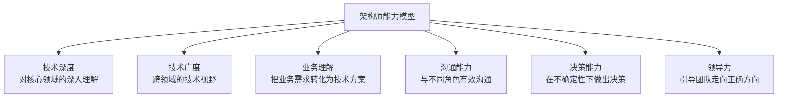

## 1. 从"盖楼"说起：什么是软件架构

### 1.1 一个楼的故事

想象你要盖一栋 30 层的写字楼。开工前，谁会先决定这些事？

- 承重墙放在哪里？每层能承受多重的荷载？
- 电梯井预留几个？消防通道怎么设计？
- 楼是框架结构还是剪力墙结构？
- 以后能不能在楼顶加两层？能不能改造成住宅？

这些决定，都是**建筑设计师**在画施工图之前就要拍板的。它们的共同特征是：

- **决定整栋楼的命运**：选错了结构，后面装修得再好也白搭
- **一旦定下，极难更改**：楼盖到 10 层才发现承重墙位置错了，只能拆了重建
- **影响所有后续工作**：水电、装修、幕墙都要在结构确定之后才能做

**软件架构（Software Architecture）就是软件的"建筑结构设计"**。它是在写具体代码之前，对系统"整体怎么组织"做出的一批高层决策。

### 1.2 软件架构的定义

软件架构的权威定义（来自 SEI 卡内基梅隆软件工程研究所）：

> **软件架构 = 系统的一组重要结构决策，包括系统的组件、组件之间的关系、组件与环境的交互方式，以及指导系统设计与演化的原则。**

拆开理解这句话，包含四个要素：

| 要素 | 含义 | 举例 |
| :--- | :--- | :--- |
| 组件 | 系统的构建块 | 用户模块、订单模块、数据库 |
| 连接器 | 组件间的交互机制 | HTTP 调用、消息队列、函数调用 |
| 约束 | 组件使用的规则 | "业务层不能直接访问数据库" |
| 配置 | 组件和连接器的组合 | 部署在 3 台服务器、数据库做主从 |

### 1.3 架构 vs 设计：它们有什么不同

初学者最容易混淆的就是"架构"和"设计"。用一个简单区分：

> **架构回答"系统由哪些大块组成、大块之间怎么配合"；设计回答"每个大块内部怎么实现"。**

| 维度 | 架构（Architecture） | 设计（Design） |
| :--- | :--- | :--- |
| 层级 | 系统级 | 模块/类级 |
| 关注 | 全局结构与交互 | 局部实现细节 |
| 变更成本 | 极高（牵一发动全身） | 较低（局部修改） |
| 影响范围 | 整个系统 | 单个模块 |
| 谁来做 | 架构师 + 团队共识 | 每个开发者 |
| 类比 | 楼的结构设计 | 房间的装修风格 |

**关键认知**：架构决策和设计决策没有绝对清晰的边界，但有一条实用判断标准——**这个决定改起来贵不贵？贵（影响全系统）就是架构决策，便宜（影响局部）就是设计决策。**

## 2. 架构的核心要素

### 2.1 组件：系统的"积木"

组件是构成系统的基本单元。一个组件通常具有：

- **清晰的职责**：只做一类事（如"负责用户认证"）
- **可识别边界**：能明确说出"这个组件负责什么、不负责什么"
- **可替换性**：理论上可以换一个实现（比如换个数据库驱动）

### 2.2 连接器：组件间的"管道"

组件之间的交互方式，决定了系统的很多特性：

| 连接器类型 | 特点 | 适用场景 |
| :--- | :--- | :--- |
| 直接函数调用 | 最快、最简单 | 同进程内模块 |
| HTTP/REST | 跨网络、标准统一 | 服务间调用 |
| 消息队列 | 异步、解耦 | 削峰填谷、系统解耦 |
| 数据库共享 | 数据共享 | 强一致需求 |
| 事件总线 | 广播、松耦合 | 事件驱动架构 |

**一个重要的架构教训**：连接器的选择往往比组件的实现更影响系统质量。比如"支付成功后发通知"用同步调用还是消息队列，决定了系统在支付服务故障时的表现。

### 2.3 约束与配置

**约束**是"不能做什么"的规则，比如：

- 业务层不得直接依赖具体数据库实现
- 所有外部输入必须经过校验
- 模块间禁止循环依赖

**配置**是"系统如何部署组合"，比如：

- 3 个 Web 实例 + 1 个数据库主节点 + 2 个从节点
- 缓存层用 Redis，消息用 Kafka

## 3. 架构师：系统命运的关键角色

### 3.1 架构师在做什么

架构师不是"职位最高的工程师"，而是**专门为系统长远质量负责的人**。他的核心职责是：

| 职责 | 说明 | 日常表现 |
| :--- | :--- | :--- |
| 技术决策 | 选择技术栈和架构风格 | "用微服务还是单体？用 MySQL 还是 PG？" |
| 质量保障 | 确保系统满足质量属性 | "这样设计可用性够吗？性能达标吗？" |
| 风险管理 | 识别和缓解技术风险 | "这个方案依赖某个闭源库，风险大吗？" |
| 沟通桥梁 | 连接业务和技术 | 把业务需求翻译成技术方案 |
| 技术指导 | 制定技术标准和规范 | 编码规范、评审清单 |
| 知识传承 | 培养团队技术能力 | 技术分享、方案评审 |

### 3.2 架构师的三个"不能"

**不能一：不能只做"画图的人"。** 画了架构图然后交给团队实现、自己不管——架构图会很快与现实脱节。好的架构师要持续跟进实现，确保架构决策落地。

**不能二：不能当"独裁者"。** 架构是团队的集体决策，不是某个人的意志。好的架构师会倾听各方意见，用数据说话，而不是"我说了算"。

**不能三：不能做"完美主义者"。** 追求"理想架构"而拒绝妥协，会导致系统永远上不了线。好的架构师懂得在"理想"和"现实约束"之间取得平衡。

### 3.3 架构师的能力模型



## 4. 架构决策：架构师最重要的产出

### 4.1 什么是架构决策

架构决策（Architectural Decision）是那些**影响深远、难以逆转、代价高昂**的技术选择。例如：

- 选用哪种数据库
- 采用微服务还是单体
- 用消息队列还是直接调用
- 前端用什么框架

### 4.2 为什么架构决策必须被记录

想象半年后的场景：新来的工程师看着系统问"为什么我们用 Kafka 而不用 RabbitMQ？"——没有人能回答，因为当年做决定的架构师已经离职了。于是新团队不敢动这块，或者干脆推翻重来。

**记录架构决策（ADR，Architecture Decision Record）** 就是为了解决这个问题：把"当时的背景、做的决定、为什么这么做、代价是什么"写下来，让未来的团队能理解并延续决策。

**核心原则**：决策可以被推翻，但必须被记录。记录的价值不是"这个决策永远正确"，而是"后人能看到决策的来龙去脉"。

### 4.3 决策的五大原则

| 原则 | 含义 | 实操 |
| :--- | :--- | :--- |
| 延迟决策 | 不着急的决定不要提前做 | "这个问题下季度再定" |
| 可逆性优先 | 优先选可逆的决策 | 能换的组件优于绑死的 |
| 证据驱动 | 基于数据而非直觉 | 先做 PoC 验证再拍板 |
| 最简可行 | 选最简单的可行方案 | 不要一上来就上最重的方案 |
| 适度设计 | 满足当前需求，预留空间 | 不超前设计，也不裸奔 |

### 4.4 ADR 示例

```markdown
# ADR-001: 选择微服务架构

## 状态

已接受

## 背景

单体应用已无法满足业务快速增长的需求：
- 30 人的团队在同一代码库协作，合并冲突频繁
- 每次发布全量回归，发布周期从 1 天拖到 2 周
- 某个模块的高负载会拖垮整个系统

## 决策

采用微服务架构，按业务域拆分服务（用户、订单、商品、支付）。

## 理由

1. 独立部署：各服务可独立发布，不再相互阻塞
2. 技术异构：各服务可选择合适技术栈
3. 团队自治：每个团队负责自己的服务
4. 弹性伸缩：按需扩展高负载服务

## 后果

- 增加运维复杂度（服务发现、监控、部署）
- 需要 API 网关与分布式事务方案
- 需要更强的可观测性体系

## 替代方案

- 模块化单体：改造成本更低，但部署仍整体化
- 继续单体 + 扩展机器：无法解决协作与发布问题
```

## 5. 架构文档：让架构可理解、可维护

### 5.1 为什么需要架构文档

架构是"系统的骨架"，但骨架是看不见的。架构文档的作用是**让看不见的骨架变得可见**：

- 新成员通过文档快速理解系统（而不是自己翻三个月代码）
- 团队通过文档对齐认知（避免"我以为的架构"和"实际架构"不一致）
- 评审通过文档评估决策（架构评审的对象）

### 5.2 C4 模型：自顶向下的四层视图

业界最流行的架构文档模型是 C4 模型（Context, Containers, Components, Code），它用**四个由粗到细的层次**描述系统：

| 层级 | 视图 | 描述 | 受众 |
| :--- | :--- | :--- | :--- |
| Level 1 | 系统上下文图 | 系统与外部的关系 | 所有人 |
| Level 2 | 容器图 | 系统由哪些容器组成 | 开发者/架构师 |
| Level 3 | 组件图 | 每个容器内的组件 | 开发者 |
| Level 4 | 代码图 | 组件的内部实现 | 开发者 |

**为什么用 C4**：很多人画架构图只会画"一堆框框和箭头"，C4 提供了清晰的层级：先画"系统和外部的边界"（Level 1），再画"系统里有哪些进程/服务"（Level 2），再往下钻。它防止了"一上来就画底层细节"的通病。

### 5.3 架构视图（4+1 视图模型）

除了 C4，经典教材还常用"4+1 视图"来描述架构的不同侧面：

| 视图 | 描述 | 关注者 |
| :--- | :--- | :--- |
| 逻辑视图 | 系统的功能分解 | 终端用户 |
| 进程视图 | 并发与同步 | 集成者 |
| 开发视图 | 代码的组织方式 | 程序员 |
| 物理视图 | 部署拓扑 | 运维人员 |
| 场景（+1） | 关键用例贯穿上述视图 | 所有人 |

**架构文档的黄金法则**：一个系统需要多张图，因为不同的人关心不同的侧面。一张图试图画下所有信息，结果是谁都看不懂。

## 6. 架构反模式：常见的大坑

理解"不该怎么做"往往比"该怎么做"更重要。以下是架构领域最常见的五个反模式：

### 6.1 大泥球（Big Ball of Mud）

**症状**：没有清晰的结构，代码相互纠缠，改一处崩三处。模块边界形同虚设，任何人都在任何地方加代码。

**成因**：架构设计缺失 + 长期缺乏重构。

**对策**：从最容易的部分开始逐步分层，先画出"实际架构"，再逐步向"目标架构"收敛。

### 6.2 过度工程（Over-Engineering）

**症状**：为"未来可能的需求"引入了分布式、微服务、复杂的抽象层——但当前业务一个简单单体就够。

**成因**：架构师焦虑"以后扩展不了怎么办"。

**对策**：YAGNI（You Aren't Gonna Need It）——不为不存在的需求设计。架构应该"为已知的需求做充分设计，为未知的需求留简单空间"。

### 6.3 复制-粘贴架构

**症状**：多个服务的代码结构完全一样（同一个模板生成），只是改了名字。任何修改要在 N 个地方重复做。

**成因**：缺乏统一平台，团队各自为政。

**对策**：提取共享库/平台，或接受"标准化模板 + 自动化生成"。

### 6.4 供应商锁定（Vendor Lock-in）

**症状**：整个系统深度绑定某个云厂商/闭源产品的专有特性，迁移成本高到不可承受。

**成因**：选型时只看"现在好用"，不看"未来可换"。

**对策**：关键依赖增加抽象层（但不要过度抽象）、评估迁移成本、避免使用非必要专有特性。

### 6.5 架构黑洞

**症状**：架构文档写得漂亮，但实际代码早就偏离了架构。架构"看起来存在，实际上不存在"。

**成因**：架构决策不落地、实现无人跟踪、文档与代码脱节。

**对策**：架构评审要对照真实代码；架构变更要同步更新文档；用工具（如依赖检查、架构测试）自动校验架构符合性。

## 7. 架构演进：架构不是一次定死的

### 7.1 架构是"演化的"，不是"设计的"

很多初学者以为架构是"设计好就固定了"。实际上，**架构和软件一样需要演化**：

- 业务变了 → 架构要跟着变
- 技术栈成熟了 → 可以考虑替换
- 团队规模变了 → 协作方式要变

**现代架构思维**：不是"设计一个最终架构"，而是"设计一个能演化的架构"。就像盖楼时预留电梯井和管道位置——你不知道未来要装什么设备，但你知道要为未来的改造留空间。

### 7.2 演进原则

1. **小步演进**：架构调整要分阶段，每次保持系统可用
2. **演进有记录**：每次架构变化都有 ADR 记录理由
3. **对照验证**：定期检查"实际架构 vs 文档架构"是否一致
4. **权衡明确**：每次演进都要说清楚"得到了什么、放弃了什么"
